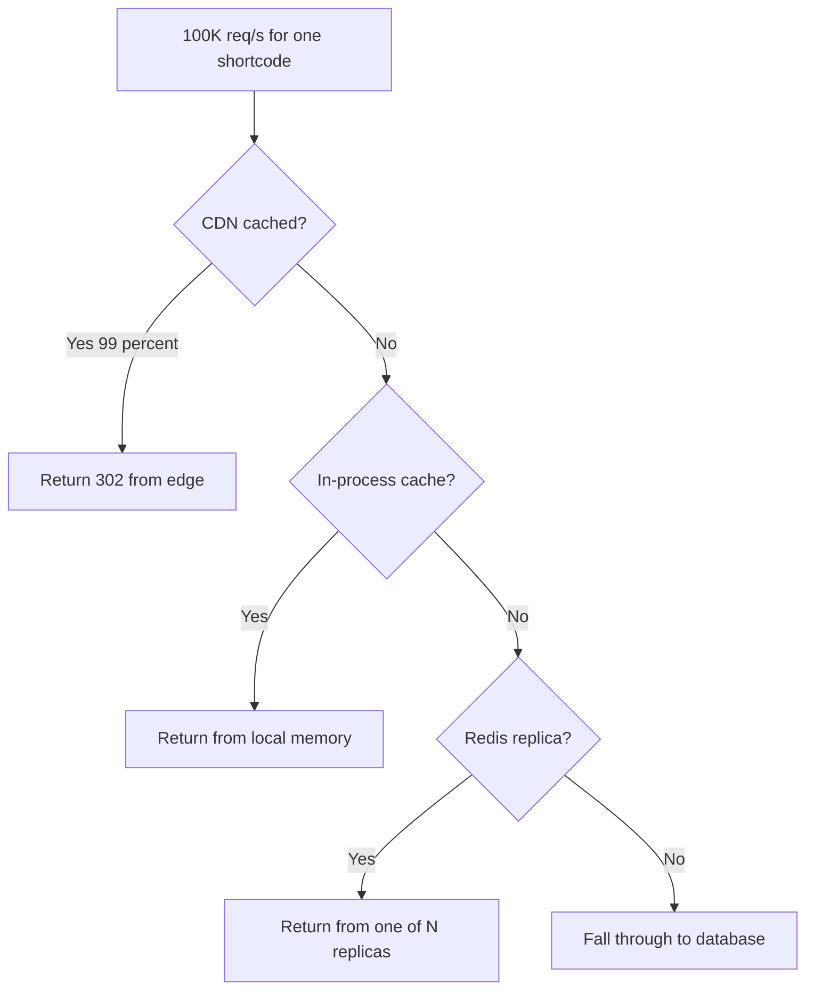

## The scene

You sit down. The interviewer opens a blank doc. They type one line and turn the screen toward you.

> *"Design a URL shortener like bit.ly."*

Then they sit back. They wait. They are not going to say more until you ask.

This is the most common system design question on the planet. It sounds easy. A short string maps to a long string. Done in 10 minutes, right?

Not quite. The trap is in the small word "shortener." It hides a pile of real problems. How do you mint a short code without two servers picking the same one? What happens when a single link goes viral and gets 100,000 hits per second? How do you stop someone from using your service to send people to a phishing site? And how do you keep the redirect under 50ms when your database lives in another continent?

We will walk this from a tiny weekend project to a system that handles billions of links. At every step we will name what breaks first, then add the smallest fix that solves it.

---

## Step 1: Ask the right questions

Before you draw any boxes, sit for five minutes. Write down questions you would ask the interviewer.

A good answer is not "20 questions about every detail." It is the small handful of questions that change the design if answered differently.

<details markdown="1">
<summary><b>Show: 7 questions that matter</b></summary>

1. **How much traffic?** New links per day? Redirects per day? *(Without this you cannot size anything. A bit.ly answer is about 100M new links per month and 10x more reads than writes.)*
2. **How short is short?** 7 characters? 8? Custom aliases like `summer-sale`? *(7 base62 characters gives 3.5 trillion codes. Custom aliases change the design because you have to check for conflicts.)*
3. **Do links expire?** Forever, or after a year? Can users delete them? *(Permanent storage and TTL storage look very different.)*
4. **How fast must the redirect be?** Under 100ms anywhere on Earth? Or 500ms in one region is fine? *(Globally fast means a CDN. One region means you can be much simpler.)*
5. **Click counts?** Real-time number, or "yesterday's total is fine"? *(Real-time needs a separate write path. Batch is cheaper.)*
6. **Anonymous, or logged in?** Can anyone shorten? Or do you need an account? *(This pulls in rate limiting, abuse handling, and a phishing check.)*
7. **Same long URL twice, same shortcode?** If two requests submit the same URL, do they get the same short code back? *(This is dedup. It changes the write path.)*

If you walked in asking only "how many URLs," the interviewer is left guessing. The seven above give you enough to scope the design.

</details>

---

## Step 2: How big is this thing?

The interviewer hands you these numbers:

- 100M new short URLs per month
- Reads are 10x writes
- Average long URL: 100 bytes
- Keep links for 5 years
- Redirect P99 target: 100ms globally

Compute four things on paper before peeking:

1. Writes per second (steady, not peak)
2. Reads per second (steady)
3. Total URLs stored after 5 years
4. How much storage you need for the URLs themselves

<details markdown="1">
<summary><b>Show: the math</b></summary>

**Writes per second.**

100M / month = 100M / (30 × 86400) ≈ **38 writes/sec steady**. Peak is 3 to 5 times that, so call it **~150 writes/sec at peak**. Tiny.

**Reads per second.**

10x writes = **~380 reads/sec steady, ~1,500/sec peak**. Still tiny.

**Total URLs after 5 years.**

100M × 12 × 5 = **6 billion URLs**.

**Storage.**

Each row: 7 byte short code + 100 byte long URL + a few timestamps + a user id + some overhead. Round to **150 bytes per record**.

6B × 150 bytes ≈ **900GB**. Round up to 1TB. That fits on a single big server. You will shard later, but not because of storage size. You shard for other reasons (failure blast radius, regional latency).

**Cache size.**

URL popularity follows a Zipf curve (a few links are huge, most are tiny). The top 1 million URLs serve roughly 80% of the redirects. 1M × 150 bytes ≈ **150MB**. That fits on one small Redis box.

**What the math is telling you:**

The numbers are small. A URL shortener is not a throughput problem. The cache is small. The database is small. A single Postgres could handle the writes.

The interesting part is everything else: making the redirect fast everywhere on Earth, surviving a viral link, and stopping abuse. Capacity is not the hard part.

Also, reads beat writes 10 to 1. The read path matters more than the write path.

</details>

---

## Step 3: How do you make a short code?

This is the central decision. Before you draw boxes, decide where short codes come from.

You need a 7-character string. It must be unique. It should not be guessable (or scrapers will harvest every link). It must be fast to generate (no slow database lookup on every write).

Three real approaches. Here they are with a problem to think through.

```
Approach A: Hash the long URL
   shortcode = base62( first 42 bits of SHA256(long_url) )

Approach B: Counter, then base62 encode
   shortcode = base62( next_counter_value() )

Approach C: Random string, check for collision
   loop: code = random 7 chars; if not in DB, use it
```

Before peeking, ask yourself:
- Approach A: what happens at 6 billion URLs?
- Approach B: what does a sequence of codes look like? Is that a problem?
- Approach C: what happens when the database fills up?

<details markdown="1">
<summary><b>Show: the comparison and what to pick</b></summary>

| Approach | How it works | Pros | Cons |
|----------|-------------|------|------|
| **A. Hash the long URL** | Take first 42 bits of SHA256, base62 encode | Same URL gives same code (great for dedup). No coordination needed. | Birthday collisions. At ~2M URLs, 50% chance of one collision. At 6B URLs, lots. You need a retry loop with a salt. |
| **B. Counter, base62** | Increment a 64-bit counter, encode it | Zero collisions ever. Compact. Predictable. | Counter is shared state. Sequential codes are guessable. A scraper can iterate `abc1230, abc1231, abc1232...` and harvest every link. |
| **C. Random + check** | Generate random 7 chars, check DB, retry if taken | Unguessable. Simple to code. | Every write does an extra DB lookup. Retry latency grows as the namespace fills. |

**Pick: counter with sharded ranges, then scrambled.**

Here is the trick. Each URL Service instance grabs a range of 10,000 IDs at a time from a small coordinator (Redis or a tiny Postgres sequence). Then it hands them out from its local range, no coordination per write. When the range runs out, it grabs another 10,000.

> Why this matters: without the range trick, every write would call out to a shared counter. That is one network hop per write. With the range, you call out once per 10,000 writes. Round-trip vanishes from the critical path.

Then, before encoding, you **scramble** the counter. XOR with a 64-bit secret, then base62. Same uniqueness (XOR is reversible). But consecutive counters now give scattered codes:

```
counter 1000      -> XOR secret -> 84729104 -> base62 -> "Xk2pQz3"
counter 1001      -> XOR secret -> 84729105 -> base62 -> "Y8fM9aQ"
```

A scraper cannot guess the next code. They look random.

**Why not hash?** Birthday collisions. At 2 million URLs you already have a 50% chance of one collision. At 6 billion you will have many. The retry loop works but its latency is unpredictable. Counter is just cleaner.

**Why not pure random?** Every write does a database round-trip just to check. That is wasted latency on every single create. Counter avoids it.

</details>

---

## Step 4: Draw the system

You know where short codes come from. Now draw the boxes that run the whole thing.

Try to fill in the missing pieces. Five boxes are missing. Think about: what sits in front (handles TLS, blocks bad traffic), what runs the logic, what serves reads fast, what stores the truth, and what collects click data.

```
    Client (browser, mobile app)
           |
           v
    +-----------------+
    |   [ ? ]         |   TLS, rate limit, WAF, geo-route
    +--------+--------+
             |
             v
    +-----------------+
    |   [ ? ]         |   stateless, scales horizontally
    | runs the logic  |
    +-+-------+-------+
      |       |
read  |       |  write
      |       |
      v       v
  +---------+ +-----------+
  | [ ? ]   | |  [ ? ]    |   source of truth
  | fast    | |           |
  +---------+ +-----+-----+
                    |
                    | async
                    v
              +-----------+
              |  [ ? ]    |   click events, analytics
              +-----------+
```

<details markdown="1">
<summary><b>Show: the full architecture</b></summary>

```
    Client (browser, mobile app)
           |
           v
    +-------------------+
    |  CDN / Edge       |   caches popular 302s (60s TTL)
    +---------+---------+
              |
              v
    +-------------------+
    |  Load Balancer    |   anycast, geo-route, TLS,
    |  + WAF + Rate     |   rate limit, block bad bots
    |    Limiter        |
    +---------+---------+
              |
              v
    +-------------------+
    |   URL Service     |   stateless, runs per region
    |  (read + write)   |   owns counter range
    +--+-------------+--+
       |             |
 read  |             |  write
       |             |
       v             v
   +---------+   +---------------+
   |  Redis  |   |   Postgres    |   sharded by hash(shortcode),
   | (cache) |   |  (database)   |   replicas in every region
   +---------+   +-------+-------+
                         |
                         |  CDC / outbox
                         v
                +---------------+
                |   Kafka       |   click_event, link_created
                |   topics      |
                +-------+-------+
                        |
                        v
                +----------------+
                | ClickHouse /   |   counts per shortcode,
                | BigQuery       |   1-min rollups
                +----------------+
```

What each piece does, in one line:

- **CDN / Edge.** Caches the 302 redirects for popular links right next to the user. Most viral traffic never reaches your origin.
- **Load Balancer.** TLS termination, geo-routing to the nearest healthy region, rate limit, WAF (blocks SQL injection, bots, known-bad patterns).
- **URL Service.** Stateless. Reads cache, writes to DB, owns a local counter range. You can scale it horizontally with no coordination.
- **Redis.** Holds the hot links in memory. ~90% of reads should hit it. The DB is a fallback.
- **Postgres.** Source of truth. Sharded by hash of shortcode (spreads load evenly). Read replicas in every region.
- **Kafka + ClickHouse.** Click events stream here async. The redirect path never blocks on analytics.

> Why a CDN before the load balancer? Because the redirect is just a 302 with a `Location` header. It is the perfect thing to cache at the edge. A viral link should never bother your origin servers. The CDN serves it from a box 20ms from the user.

</details>

---

## Step 5: The API

Two endpoints carry the whole product. Create a short link, follow a short link. Everything else is reading data back.

```
POST /api/v1/links
  body: { long_url, custom_alias?, expires_at? }
  returns: 201 with { short_url, shortcode }

GET /<shortcode>
  returns: 302 with Location: <long_url>
```

Now, what status codes do you need? Think through:
- What if the custom alias is taken?
- What if the link was flagged as phishing?
- What if the link expired?
- What if the user is being rate-limited?

<details markdown="1">
<summary><b>Show: the full API with status codes</b></summary>

**Create a link**

```
POST /api/v1/links
Content-Type: application/json
Idempotency-Key: <uuid>          # required, stops dup links on retry

{
  "long_url": "https://example.com/very/long/path?with=query",
  "custom_alias": "my-link",      # optional
  "expires_at": "2026-12-31T..."  # optional
}
```

| Status | Meaning |
|--------|---------|
| 201 Created | New short URL minted |
| 200 OK | Same long URL submitted by same user before, returning existing one |
| 400 Bad Request | Invalid URL, bad alias format, expires in the past |
| 409 Conflict | Custom alias already taken |
| 429 Too Many Requests | Rate limit hit |
| 451 Unavailable for Legal Reasons | URL flagged as phishing |

**Follow a link**

```
GET /<shortcode>
```

| Status | Meaning | Headers |
|--------|---------|---------|
| 302 Found | Redirect to long URL | `Location: <long_url>`, `Cache-Control: private, max-age=0` |
| 404 Not Found | Shortcode does not exist |  |
| 410 Gone | Shortcode existed but expired or was deleted |  |
| 451 Unavailable for Legal Reasons | URL was flagged later |  |

A few small but load-bearing choices:

- **302, not 301.** This one is sneaky. A 301 means "permanent redirect." Browsers cache it forever. If a phishing site uses your shortener and you need to block it, the user's browser will skip your service and go straight to the bad URL. You lose all control. With 302, you stay in the loop on every click.

- **`Idempotency-Key` is required on create.** Mobile networks drop packets. The app retries. Without an idempotency key, you mint two short codes for the same submission. With the key, the second request returns the first one's result.

- **`Cache-Control: private, max-age=0` on the redirect.** Tells browsers and middleboxes not to cache the 302 themselves. Your CDN can still cache it because you control the CDN. Browsers should always hit you, so you can revoke a link by flipping its status to blocked.

</details>

---

## Step 6: The viral link problem (hot key)

One day, a celebrity tweets a short link. Suddenly that one shortcode gets 100,000 requests per second. All the other shortcodes still work fine. But this one shortcode is melting one Redis node.

This is called the **hot key** problem. One specific cache key is taking all the load. The Redis shard owning that key pegs at 100% CPU. Latency for every other key on that shard degrades. You start dropping traffic.

How do you survive?

<details markdown="1">
<summary><b>Show: layered defenses against a hot key</b></summary>

You stack four defenses, from cheap to expensive.



**1. CDN at the edge.**

The first and biggest line. The 302 response is tiny and the same for every user. Perfect for caching. Set a 60-second TTL. If 99% of the 100K req/s hits the CDN, your origin only sees 1,000 req/s for that key. That is easy.

> Why 60 seconds and not 24 hours? Because if the link gets flagged as phishing, you want it offline fast. 60 seconds is the sweet spot between cache hit rate and how quickly you can revoke a bad link.

**2. In-process cache on the URL Service.**

Each URL Service pod keeps a tiny LRU cache in its own memory. The top 1,000 keys live there with a 60s TTL. A cache hit here costs nothing. No network call.

**3. Redis read replicas.**

Redis can replicate a key to N read-only replicas. The URL Service round-robins reads across them. If you have 5 replicas, each one takes 1/5 of the traffic. Multiplies hot-key throughput by 5.

**4. Request coalescing on cache miss.**

When the cache entry expires, 10,000 concurrent requests all try to refresh it at the same time. They all hit the database for the same row. The DB melts.

Fix: when a request sees a stale cache entry, only the first one fetches from the DB. The rest wait on a per-key lock and read the populated value. 10,000 misses become 1 DB read.

> Pre-warming for predictable virality. If a marketing team is about to announce something at noon, push the entry to every region's cache at 11:55. The cache is already hot when the storm hits.

</details>

---

## Step 7: One short code, four ways things can go wrong

Same system, four real failures. Each one stresses a different part of the design.

For each, think about: what breaks first, and what is the smallest fix?

**A. Same long URL, two submissions in the same millisecond.** Two API calls with `long_url = "https://example.com/sale"` arrive at the same instant. Do they get the same short code or two different ones?

**B. The counter coordinator hands out the same range twice.** Redis failed over, the replica was stale, and it gave the range `[10000, 20000]` to both pod A and pod B. Now they are minting the same short codes.

**C. A short code is flagged as phishing after 1 million people already saved it.** The link has been live for 3 days. It is in everyone's CDN cache. How do you kill it?

**D. The cache evicts a viral link's entry during a 50K req/s burst.** Suddenly the database gets 50K req/s for one row.

<details markdown="1">
<summary><b>Show: what each one teaches</b></summary>

**A. Dedup race.**

If both submissions are by the same logged-in user, you want dedup (give back the same shortcode). The race: both requests hit `SELECT shortcode WHERE creator_id = ? AND long_url_hash = ?`. Both miss. Both proceed to INSERT.

Fix: a **unique index** on `(creator_id, long_url_hash)`. Then use:

```sql
INSERT INTO short_links (...)
VALUES (...)
ON CONFLICT (creator_id, long_url_hash) DO UPDATE SET ...
RETURNING shortcode;
```

The second INSERT sees the conflict, returns the first one's shortcode. The database does the work. No app-level locks.

If both submissions are anonymous: give them different codes. Same URL going to two short codes is fine for anonymous users (it actually preserves privacy, two devices submitting the same URL should not be linked).

**B. Coordinator handed the same range twice.**

This is the scariest scenario. Two pods are minting the same codes. Eventually they will both try to insert the same shortcode. The DB unique constraint catches one of them (good) but the user gets a 500.

The fix has two parts:
- **Detection:** every range allocation writes a row to a `range_allocations` ledger table `(range_start, range_end, instance_id, allocated_at)`. A periodic job scans for overlapping ranges and alerts.
- **Prevention:** never run the coordinator on plain Redis. Back it with a strongly-consistent store. Postgres sequences work. ZooKeeper works. Redis with replication does not, because failover can lose recent writes.

> The mid-level answer covers only prevention. The senior answer covers detection, recovery, and prevention in one breath.

**C. Killing a flagged link with cached copies everywhere.**

You set `status = blocked` in the database. But:
- Your CDN still has the old 302. Up to 60 seconds of bad redirects continue.
- Every URL Service's local in-process cache still has the old value.
- Redis still has the old value.

Cache invalidation, three layers:
- DB write: `UPDATE short_links SET status = 'blocked'`.
- Publish to a Redis pub/sub channel `link.invalidated`. Every URL Service pod subscribes. Each one evicts the key from its in-process cache and from Redis.
- For the CDN: send a purge API call (every CDN supports this). If purge is slow, accept the 60-second window. Bad links go quiet within a minute.

**D. Cache miss on a viral key (thundering herd).**

Same as #4 above. Mitigations:
- **Jittered TTL.** Don't let all the top 1000 keys expire in the same second. Add ±10% random jitter to every TTL.
- **Request coalescing.** First request fetches from DB. Others wait.
- **Stale-while-revalidate.** Serve the old value while one background goroutine refreshes. Same trick HTTP uses.

**The big idea.** A URL shortener looks like a simple key-value lookup. The interesting engineering lives at the edges: the hot key, the dedup race, the coordinator failure, the cache invalidation. That is what the interviewer wants to hear about.

</details>

---

## Follow-up questions

Try answering each in 2 or 3 sentences before opening the solution.

1. **Two users submit the same long URL within milliseconds.** Same shortcode or different ones? What if both are anonymous? What if both are logged in as the same user?

2. **Custom aliases.** User A reserves `summer-sale` at the same moment as user B. How do you make sure only one of them gets it, atomically, without a slow lock?

3. **A single shortcode goes viral and takes 100K req/s.** What is your layered defense? What is the cheapest layer and what does it buy you?

4. **Phishing detection.** Google Safe Browsing takes 200 to 500ms per check. You cannot block the create endpoint on that. What is the trade-off you accept, and how do you handle URLs that turn malicious after creation?

5. **Click counts.** Every redirect needs to bump a counter. You have 1,500 redirects per second. Why does `UPDATE short_links SET clicks = clicks + 1` not work? What do you do instead?

6. **Custom domains.** Acme Corp wants `shrt.acme.com/abc1234` instead of `shrt.ly/abc1234`. What changes in routing, TLS, and the data model?

7. **Expiration with retention.** Links expire after 1 year. Do you delete the row, mark it expired, or just let the cache TTL win? What about historical analytics?

8. **Thundering herd on cache miss.** A popular URL's cache entry just expired. 10k requests arrive in the next 100ms. Walk through what happens without protection. Then walk through the fix.

9. **GDPR delete.** A user wants every short URL they created deleted. You have 64 sharded databases. How do you find and delete everything? What about their click history?

10. **3am page: the counter coordinator handed the same range to two instances.** What is the blast radius? How do you detect it? How do you recover? How do you prevent it from happening again?

---

## Related problems

- **[Distributed Cache (009)](../009-distributed-cache/question.md).** The caching layer this problem leans on. Understand its eviction and replication before tackling the hot key problem here.
- **[Rate Limiter (004)](../004-rate-limiter/question.md).** The rate limiter on `POST /links` uses the same algorithms (token bucket, sliding window) you would design from scratch in that problem.
- **[Notification System (010)](../010-notification-system/question.md).** The click stream pipeline at the bottom uses the same fan-out, retry, and durability patterns as a notification system's event delivery.
