## The scene

You sit down. The interviewer opens a blank doc. They type one line and turn the screen toward you.

> *"Design a URL shortener like bit.ly."*

Then they sit back and wait.

This is the most common system design question on the planet. It sounds trivial: a short string maps to a long string. Done in ten minutes, right?

Not quite. The word "shortener" hides a pile of real problems. How do you mint a short code without two servers picking the same one? What happens when a single link goes viral and gets 100,000 hits per second? How do you kill a phishing link when copies of the redirect are cached on six continents? And how do you serve the redirect in under 50ms when your database lives in another continent?

We will walk this from a tiny weekend project to a system that handles billions of links. At every step we name what breaks first, then add the smallest fix that solves it.

---

## Step 1: Picture one redirect

Before any boxes, picture what a URL shortener actually is. Alice pastes a long URL. She gets a short code. Bob types the short code. He lands on Alice's URL.

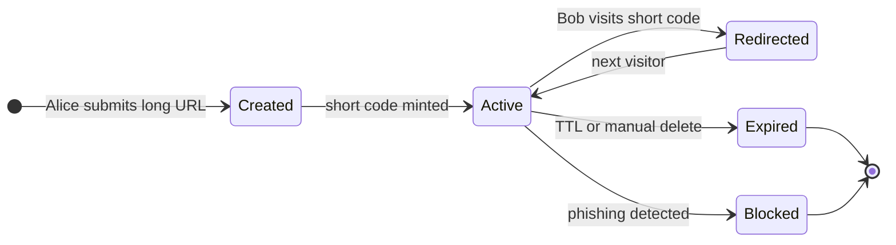

That is the whole product in one picture. Everything we add later (caching, sharding, analytics, abuse handling) is a detail on top of this lifecycle.

> **Take this with you.** A URL shortener is a key-value store with a lifecycle. The short code is the key. The long URL is the value. The lifecycle (active, expired, blocked) is what makes it a real system.

---

## Step 2: Ask the right questions

In a real interview, sit quietly for two minutes and write down what you want to ask. Not twenty questions. Five good ones.

<details markdown="1">
<summary><b>Show: 5 questions that change the design</b></summary>

1. **How much traffic?** New links per day? Redirects per day? *Without this you cannot size anything. A bit.ly answer is about 100M new links per month and 10x more reads than writes.*
2. **How short, and can users pick their own?** 7 auto-generated characters, or custom aliases like `summer-sale`? *Custom aliases change the write path because you have to check for conflicts on the exact string the user requested, not just any available code.*
3. **Do links expire?** Forever, or after a year? *Permanent storage and TTL storage look different. Expiration also determines how much data you are holding five years from now.*
4. **How fast must the redirect be?** Under 100ms anywhere on Earth, or 500ms in one region? *Globally fast requires a CDN. One region is much simpler.*
5. **Who can shorten?** Anonymous anyone, or logged-in users only? *Anonymous shortening forces rate limiting, abuse handling, and a phishing pipeline that authenticated services often skip.*

A strong candidate also asks: *"Are click counts part of this, and how fresh must they be?"* Real-time counts need a separate write pipeline. Batch counts are far cheaper.

</details>

---

## Step 3: How big is this thing?

The interviewer gives you numbers: 100M new short URLs per month, reads are 10x writes, keep links for 5 years, redirect P99 target of 100ms globally.

| Metric | Value |
|--------|-------|
| Writes/sec, steady | ~38 |
| Writes/sec, peak | ~150 |
| Reads/sec, steady | ~380 |
| Reads/sec, peak | ~1,500 |
| Total URLs after 5 years | 6 billion |
| Total storage | ~900 GB |
| Hot working set (top 1M URLs) | ~150 MB |

<details markdown="1">
<summary><b>Show: how the numbers come out</b></summary>

**Writes per second.** 100M / month = 100M / (30 × 86,400) ≈ 38 writes/sec steady. Peak is 3 to 5 times that, so call it ~150/sec at peak. Tiny.

**Reads per second.** 10x writes: ~380/sec steady, ~1,500/sec peak. Still tiny.

**Total URLs after 5 years.** 100M × 12 × 5 = 6 billion URLs.

**Storage.** Each row: 7-byte short code + 100-byte long URL + timestamps + user id + overhead. Round to 150 bytes. 6B × 150 bytes ≈ 900 GB. Fits on one big server. You will shard later, but for failure isolation and regional latency, not capacity.

**Cache size.** URL popularity follows a Zipf curve: a few links are huge, most are tiny. The top 1 million URLs serve roughly 80% of the redirects. 1M × 150 bytes ≈ 150 MB. That fits on one small Redis box.

**What the math is telling you.** The numbers are small. A single Postgres handles the writes. The hard parts are making the redirect fast everywhere on Earth, surviving a viral link, and blocking phishing. Capacity is not the challenge here.

</details>

> **Take this with you.** Reads beat writes 10 to 1. The read path is more important than the write path. And the hot working set is tiny: 150 MB of cache serves 80% of the traffic.

---

## Step 4: The smallest thing that works

Forget scale. We are a 10-person team launching this weekend. One server, one table, one idea: Alice shortens a URL, Bob follows it.

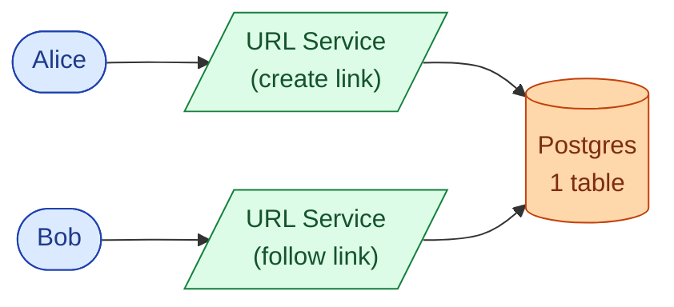

The two-request flow:

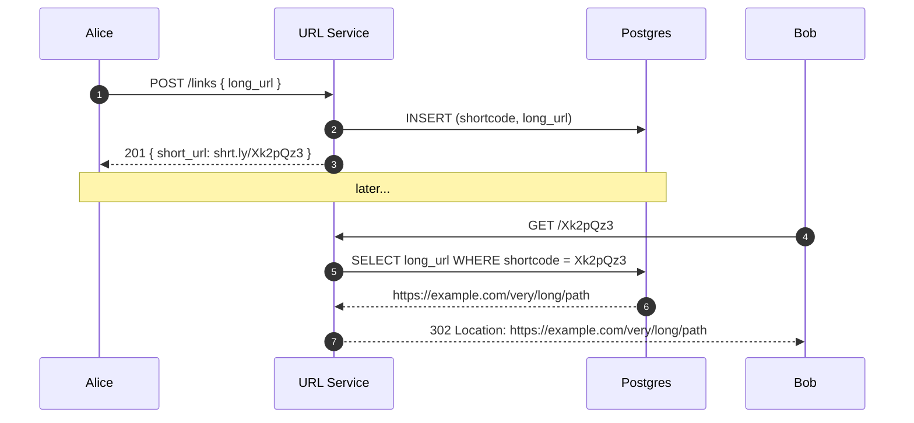

<details markdown="1">
<summary><b>Show: the one table</b></summary>

```sql
CREATE TABLE short_links (
    shortcode    VARCHAR(16) PRIMARY KEY,
    long_url     TEXT NOT NULL,
    creator_id   BIGINT,
    created_at   TIMESTAMPTZ NOT NULL DEFAULT NOW(),
    expires_at   TIMESTAMPTZ,
    status       SMALLINT NOT NULL DEFAULT 1
);
```

Six columns. This is the right place to start. Everything we add from here will be a response to a real problem.

</details>

> **Take this with you.** Always start from the smallest thing that works. The interesting part of the interview is what happens next.

---

## Step 5: The central decision - where do short codes come from?

Before adding any more boxes, decide where short codes come from. This choice drives the write path.

You need a 7-character string. It must be unique. It should not be guessable (or scrapers will harvest every link). It must be fast to generate with no slow database lookup on every write.

Three approaches exist:

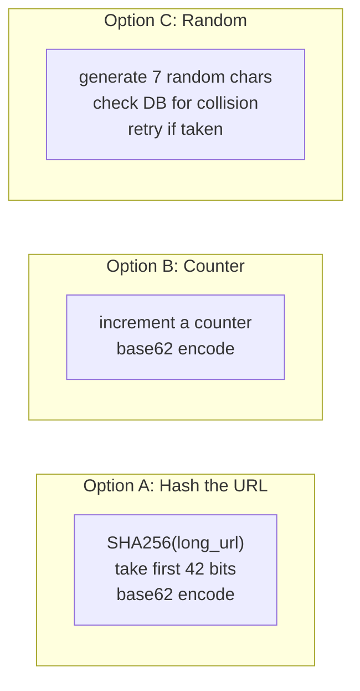

<details markdown="1">
<summary><b>Show: the comparison and what to pick</b></summary>

| Approach | Pros | Cons |
|----------|------|------|
| **A. Hash the URL** | Same URL gives same code (great for dedup). No coordination. | Birthday collisions. At ~2M URLs, 50% chance of one collision. At 6B URLs, many. You need a retry loop with a salt. |
| **B. Counter, base62** | Zero collisions ever. Compact. Predictable. | Sequential codes are guessable. A scraper iterates `abc1230, abc1231, abc1232` and harvests every link. Counter is also shared state. |
| **C. Random + check** | Unguessable. Simple to code. | Every write does an extra DB lookup. Retry latency grows as the namespace fills. |

**Pick: counter with sharded ranges, then scrambled.**

Each URL Service instance grabs a range of 10,000 IDs at a time from a small coordinator. It hands them out from its local range with no coordination per write. When the range runs out, it grabs another 10,000.

Then, before encoding, scramble the counter. XOR with a 64-bit secret, then base62. Same uniqueness (XOR is reversible), but consecutive counters give scattered codes:

```
counter 1000 -> XOR secret -> 84729104 -> base62 -> "Xk2pQz3"
counter 1001 -> XOR secret -> 84729105 -> base62 -> "Y8fM9aQ"
```

A scraper cannot guess the next code. They look random.

The key insight: without the range trick, every write calls out to a shared counter. That is one network hop per write. With ranges, you call out once per 10,000 writes.

</details>

> **Take this with you.** Use a counter with local ranges, XOR-scrambled before encoding. Zero collisions. No per-write coordination. Unguessable codes.

---

## Step 6: Build the architecture, one layer at a time

We have a service that mints short codes and resolves them. Now build the system around it. One layer at a time, with a reason for each addition.

### v1: just the service

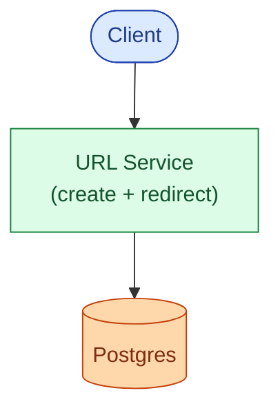

Fine for a few hundred users.

### v2: the redirect path is too slow

Every redirect hits Postgres. With 380 reads per second and a 150 MB working set, the database is doing work it does not need to do. Add Redis in front. ~90% of reads hit cache. The DB sees only cache misses.

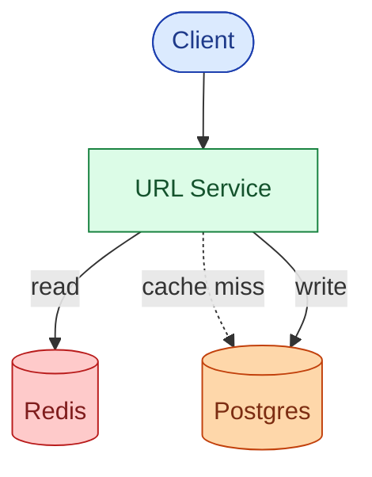

### v3: users in Europe see 200ms latency

The service is in us-east. European users suffer. Add a CDN in front and an API gateway for TLS, rate limits, and bot blocking.

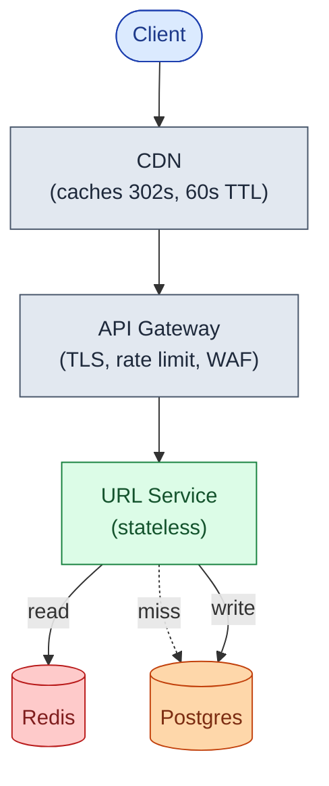

### v4: click analytics and phishing detection cannot block the redirect

If ClickHouse is slow, should Bob's redirect wait? No. If the phishing check takes 400ms, should Alice's create call block? No. Add Kafka. Anything reactive becomes a consumer.

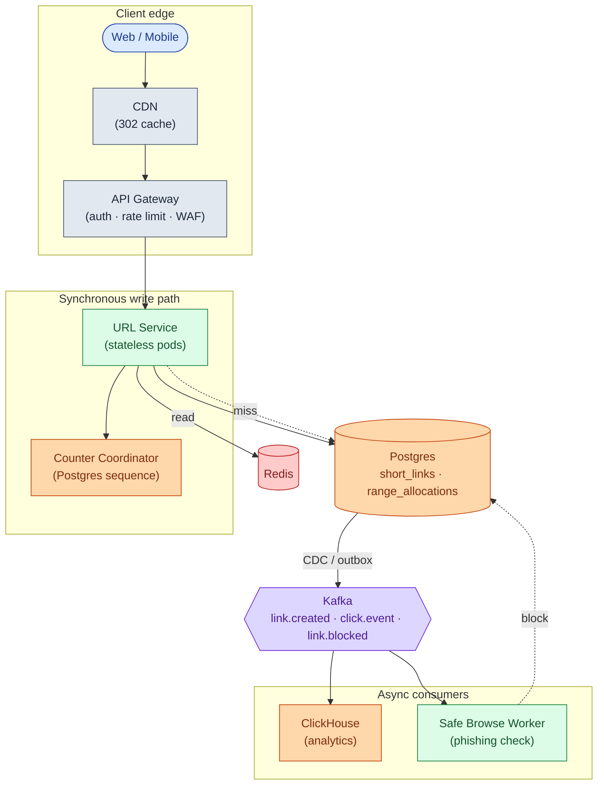

Each box, in one line:

| Box | What it does |
|-----|--------------|
| **CDN** | Caches the 302 at the edge. Viral traffic never reaches origin. |
| **API Gateway** | TLS termination, rate limits, bot blocking. |
| **URL Service** | Stateless. Mints codes, resolves redirects. Scales horizontally. |
| **Counter Coordinator** | Hands out ranges of IDs. Called once per 10,000 writes per pod. |
| **Postgres** | Source of truth. Short links + range allocation ledger. |
| **Redis** | Hot working set in memory. ~90% of reads never reach the DB. |
| **Kafka** | Carries events out. Analytics and phishing checks are downstream. |
| **ClickHouse** | Click counts and time-series analytics. Not on the redirect path. |
| **Safe Browse Worker** | Calls Google Safe Browsing async. Flags links after creation. |

> **Take this with you.** If ClickHouse dies at 3am, redirects still work. Click counts just lag. Anything reactive lives after Kafka, not before it.

---

## Step 7: One redirect, end to end

Bob visits `shrt.ly/Xk2pQz3`. Watch what happens.

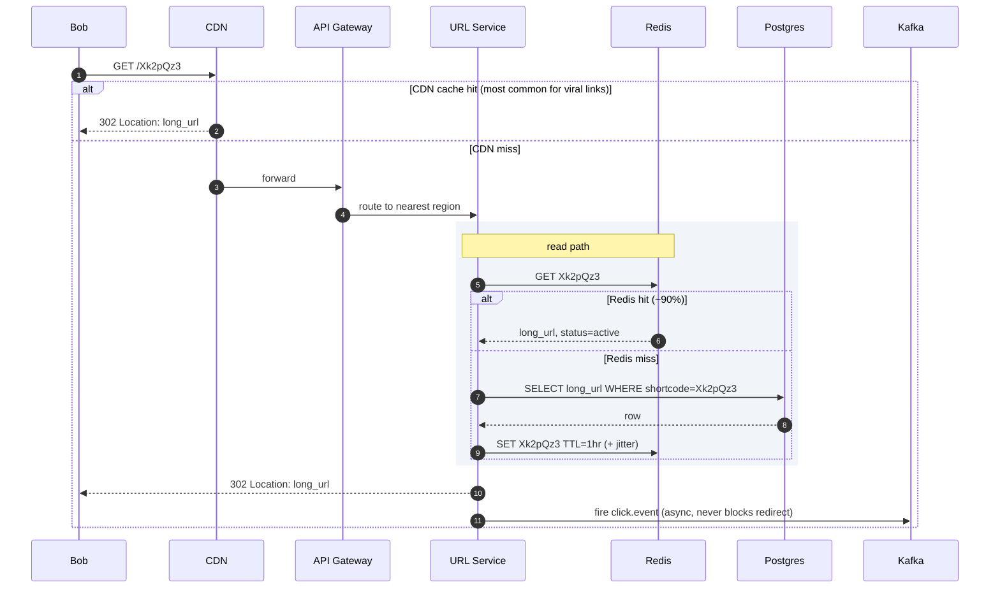

Three details worth pointing at:

1. The CDN handles most viral traffic before it reaches origin. Bob's redirect costs zero compute on a warm cache.
2. The click event is fired after returning 302. Analytics never adds latency to the redirect.
3. The URL Service is stateless. Restart any pod at any time. State lives in Postgres and Redis.

---

## Step 8: The viral link problem

One day a celebrity tweets a short link. That one shortcode starts taking 100,000 requests per second. The other shortcodes work fine. But the Redis shard that owns this key pegs at 100% CPU. Latency for every other key on that shard gets worse.

This is the **hot key** problem.

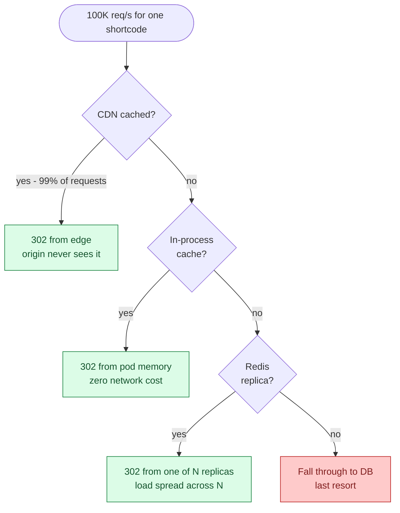

Four defenses, cheapest first:

1. **CDN.** The 302 is tiny and identical for every user. Set a 60-second TTL. If 99% of 100K req/s hits the CDN, origin sees 1,000 req/s.
2. **In-process LRU cache on each pod.** Top 1,000 keys in pod memory, 60-second TTL. A hit here costs nothing. No network call.
3. **Redis read replicas.** Redis can replicate a key to N read-only replicas. Round-robin reads across them. Five replicas multiplies hot-key throughput by five.
4. **Request coalescing on cache miss.** When the entry expires, 10,000 concurrent requests all try to refresh it. They all hit the DB for the same row. Fix: only the first request fetches from DB. The rest wait on a per-key lock and read the populated value. 10,000 DB reads become one.

For predictable virality: if marketing is announcing something at noon, push the entry to every region's cache at 11:55. The storm hits a warm cache.

> **Take this with you.** CDN does the most work for the lowest cost. In-process cache, Redis replicas, and request coalescing are backstops for when the CDN cannot help (cold cache, private links, etc.).

---

## Step 9: Cache invalidation - killing a bad link fast

The Safe Browse Worker flags a link as phishing. You flip `status = blocked` in Postgres. But:

- The CDN still has the old 302, up to 60 seconds.
- Every pod's in-process cache still has the old value.
- Redis still has the old value.

The user gets redirected to a phishing site for up to a minute. That is not acceptable.

Three-layer invalidation:

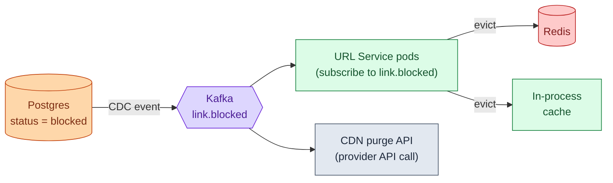

This is also why the redirect is a **302, not a 301**. A 301 says "permanent redirect." Browsers cache it forever locally. You lose all control over the user's browser cache. With 302, the browser always asks you, so you can revoke a link.

> **Take this with you.** Cache invalidation is three layers: Kafka event to evict Redis and in-process caches, plus a CDN purge API call. The 302/301 choice is not cosmetic - it is the difference between having control over your users' browsers and not.

---

## Step 10: Four ways things can go wrong

Same system, four real failures. Each stresses a different part of the design.

**A. Same long URL, two submissions in the same millisecond.** Two API calls with `long_url = "https://example.com/sale"` arrive at the same instant. Same shortcode or two different ones?

**B. The counter coordinator hands out the same range twice.** Redis failed over, the replica was stale, and it gave range `[10000, 20000]` to both pod A and pod B. They are now minting the same short codes.

**C. A link is flagged as phishing after 1 million people already saved it.** The link has been live for 3 days. It is in every CDN cache. How do you kill it fast?

**D. The cache evicts a viral link's entry during a 50K req/s burst.** The database suddenly sees 50K req/s for one row.

<details markdown="1">
<summary><b>Show: what each one teaches</b></summary>

**A. Dedup race.**

If both submissions are by the same logged-in user, you want dedup. The race: both requests run `SELECT WHERE creator_id = ? AND long_url_hash = ?`. Both miss. Both proceed to INSERT.

Fix: a unique index on `(creator_id, long_url_hash)`, plus an upsert:

```sql
INSERT INTO short_links (shortcode, long_url, creator_id, long_url_hash)
VALUES (...)
ON CONFLICT (creator_id, long_url_hash) DO UPDATE SET updated_at = NOW()
RETURNING shortcode;
```

The second INSERT sees the conflict and returns the first one's shortcode. The database does the work. No app-level locks.

If both submissions are anonymous: give them different codes. Two devices submitting the same URL should not be linkable as the same person.

**B. Coordinator handed the same range twice.**

Two pods are minting the same codes. Some creates will collide on the DB unique constraint and 500.

Detection: every range allocation writes a row to a `range_allocations` ledger `(range_start, range_end, instance_id, allocated_at)`. A periodic job scans for overlapping ranges and alerts.

Prevention: never run the coordinator on plain Redis. Its failover can replay recent writes, handing out the same range twice. Use Postgres sequences or ZooKeeper instead.

**C. Killing a flagged link with cached copies everywhere.**

DB write flips `status = blocked`. Publish to Kafka `link.blocked`. Every URL Service pod subscribes, evicts from in-process cache and Redis. Send a purge API call to the CDN. Bad links go quiet within 60 seconds.

**D. Thundering herd on cache miss.**

Jitter TTLs so the top 1% of keys don't expire at the same second. Use request coalescing: first request fetches from DB, others wait. Serve stale-while-revalidate: one background goroutine refreshes while the old value keeps serving. Ten thousand DB reads become one.

</details>

---

## Follow-up questions

Try answering each in 2 or 3 sentences before opening the solution.

1. **Two users submit the same long URL within milliseconds.** Same shortcode or different ones? What if both are anonymous? What if both are logged in as the same user?

2. **Custom aliases.** User A reserves `summer-sale` at the same moment as user B. How do you make sure only one of them gets it, atomically, without a slow lock?

3. **A single shortcode goes viral and takes 100K req/s.** What is your layered defense? What is the cheapest layer and what does it buy you?

4. **Phishing detection.** Google Safe Browsing takes 200 to 500ms per check. You cannot block the create endpoint on that. What is the trade-off you accept, and how do you handle URLs that turn malicious after creation?

5. **Click counts.** Every redirect needs to bump a counter. You have 1,500 redirects per second. Why does `UPDATE short_links SET clicks = clicks + 1` not work? What do you do instead?

6. **Custom domains.** Acme Corp wants `shrt.acme.com/abc1234` instead of `shrt.ly/abc1234`. What changes in routing, TLS, and the data model?

7. **Expiration with retention.** Links expire after 1 year. Do you delete the row, mark it expired, or just let the cache TTL win? What about historical analytics?

8. **Thundering herd on cache miss.** A popular URL's cache entry just expired. 10K requests arrive in the next 100ms. Walk through what happens without protection. Then walk through the fix.

9. **GDPR delete.** A user wants every short URL they created deleted. You have 64 sharded databases. How do you find and delete everything? What about their click history?

10. **3am page: the counter coordinator handed the same range to two instances.** What is the blast radius? How do you detect it? How do you recover? How do you prevent it from happening again?

---

## Related problems

- **[Distributed Cache (009)](../009-distributed-cache/question.md).** The caching layer this problem leans on. Understand its eviction and replication before tackling the hot key problem here.
- **[Rate Limiter (004)](../004-rate-limiter/question.md).** The rate limiter on `POST /links` uses the same algorithms (token bucket, sliding window) you would design from scratch in that problem.
- **[Notification System (010)](../010-notification-system/question.md).** The click stream pipeline at the bottom uses the same fan-out, retry, and durability patterns as a notification system's event delivery.
