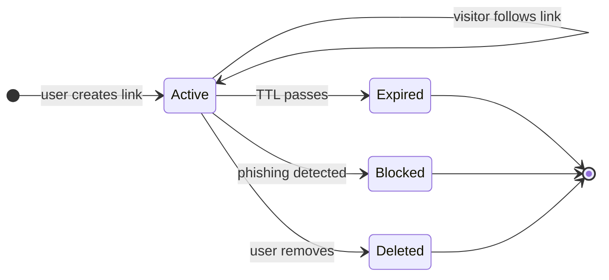
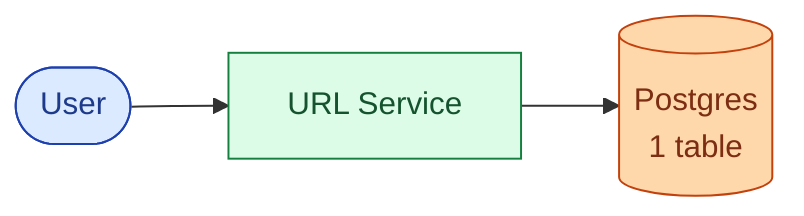
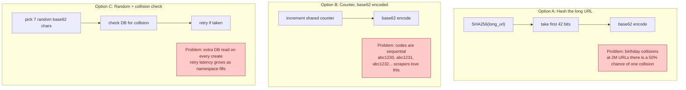
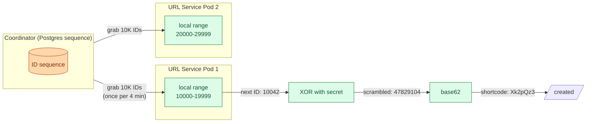
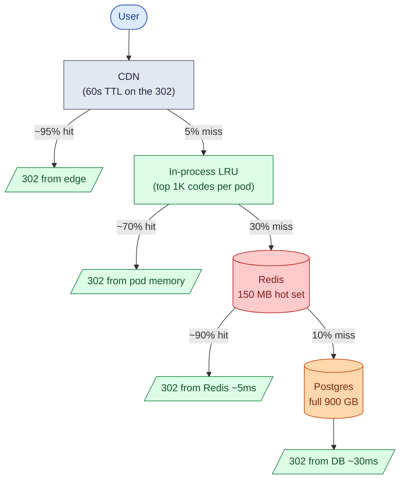
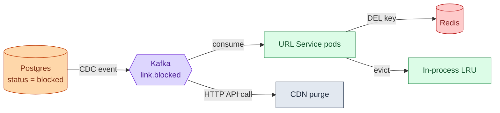
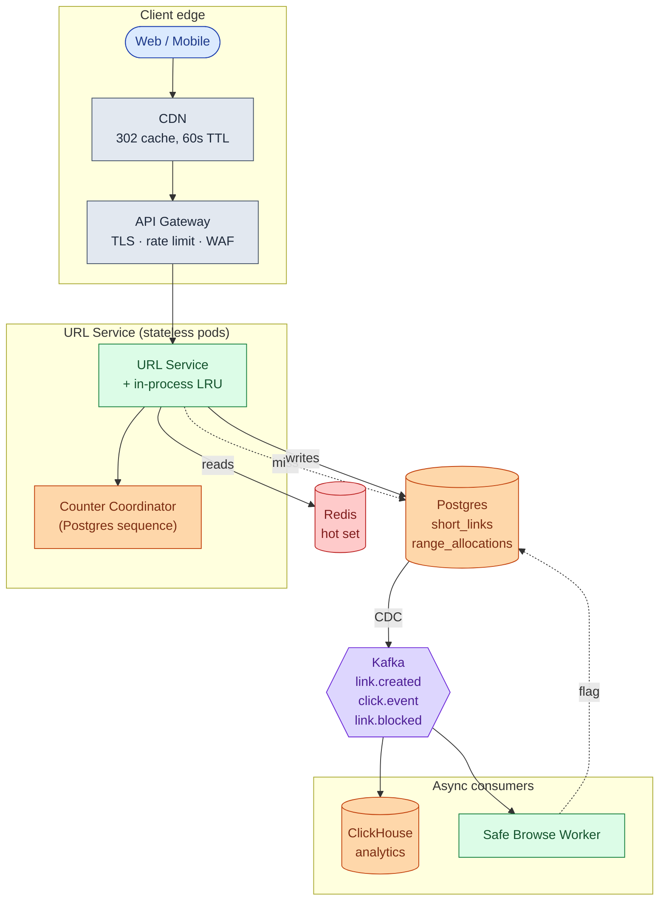
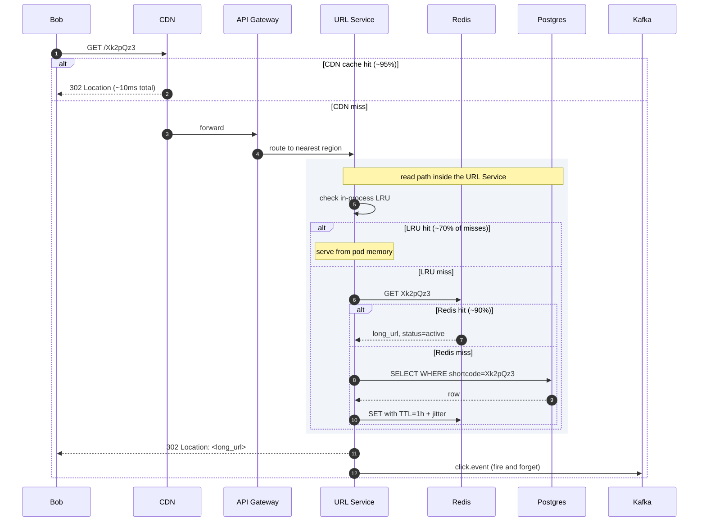
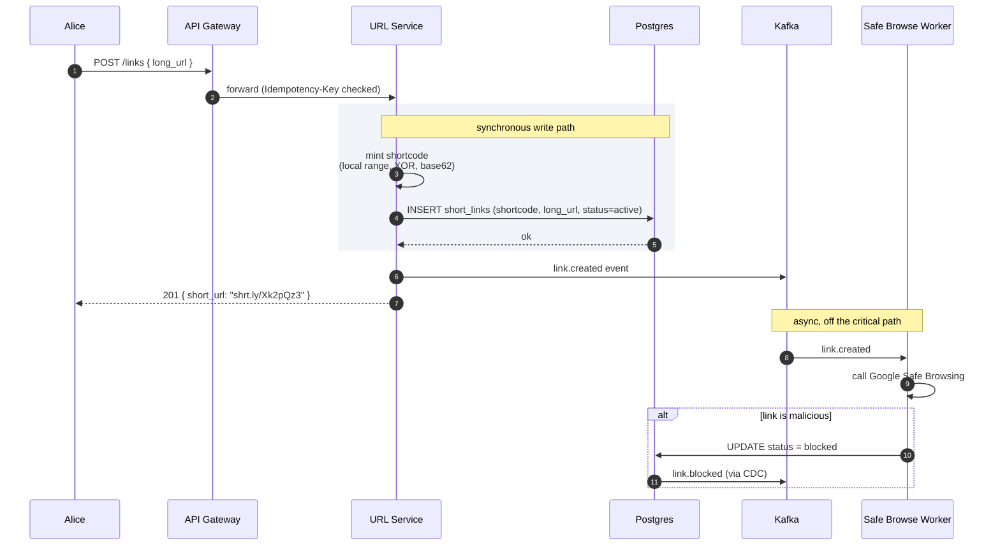
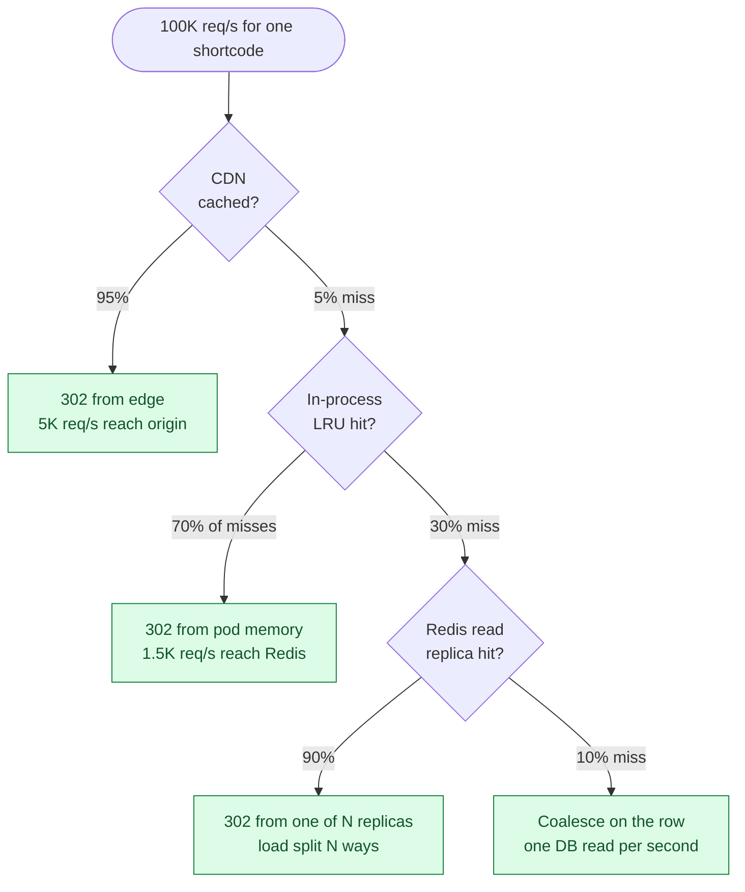

## What we are building

A URL shortener takes a long link like:

```
https://example.com/products/electronics/laptops/macbook-pro-16?ref=newsletter&utm_campaign=fall
```

and gives back a short one:

```
https://shrt.ly/Xk2pQz3
```

When anyone visits the short URL, the service redirects their browser to the original. That is the whole product. That is bit.ly.

The problem looks easy. Most candidates draw a database and a service in five minutes and stop. The interesting part is what comes after.

There are four real problems hiding in this product:

1. **Where do short codes come from?** Two servers must never pick the same one.
2. **How does a redirect stay fast?** 100ms feels slow. The target is under 50ms anywhere on Earth.
3. **What happens when one link goes viral?** 100,000 requests per second to one row will melt a database.
4. **What happens when a link is malicious?** It is cached on six continents and we have one minute to kill it.

We will start with the simplest version that works. Then we add one piece at a time as each problem appears.

---

## The lifecycle of one short link

Every short link goes through a small set of states. Picture it before drawing any boxes.



A link spends almost all its life in `Active`, getting clicked. Everything else (caches, sharding, analytics) exists to make that "click" path fast and to handle the transitions out of `Active` cleanly.

> **Take this with you.** A URL shortener is a key-value store with a tiny lifecycle. Short code is the key. Long URL is the value. Status (active, expired, blocked) is what makes it a real service instead of a hash map.

---

## How big this gets

A bit.ly-shaped product gives us these numbers to work with.

| Input | Number |
|-------|--------|
| New short URLs created | 100 million per month |
| Read-to-write ratio | 10 to 1 |
| Average long URL length | ~100 bytes |
| Storage retention | 5 years |
| Redirect latency target (P99, global) | < 100ms |

From these we can derive everything else.

<details markdown="1">
<summary><b>Show: the derived numbers</b></summary>

| Metric | Value | How |
|--------|-------|-----|
| Writes per second, steady | ~38 | 100M / (30 × 86,400) |
| Writes per second, peak | ~150 | 3-5x steady |
| Reads per second, steady | ~380 | 10x writes |
| Reads per second, peak | ~1,500 | 10x peak writes |
| Total links after 5 years | 6 billion | 100M × 12 × 5 |
| Total storage | ~900 GB | 6B × 150 bytes/row |
| Hot working set (Zipf 80/20) | ~150 MB | top 1M URLs × 150 bytes |

Three observations:

1. **The throughput is tiny.** A single Postgres can do 38 writes per second without breaking a sweat. We do not shard for capacity. We shard later for failure isolation and regional latency.
2. **The hot set fits in one Redis box.** 150 MB is nothing. ~80% of traffic hits that cache. The database is almost a backstop.
3. **A redirect has no body.** It is just an HTTP 302 with a `Location` header. Bandwidth costs are negligible compared to a normal web request.

</details>

> **Take this with you.** Reads beat writes 10 to 1, and the working set is tiny. The read path is where the design effort goes.

---

## The smallest version that works

Before optimizing anything, draw the simplest service that does the job.



Two endpoints carry the entire product.

| Endpoint | What it does |
|----------|--------------|
| `POST /links` | Accept a long URL, return a short code |
| `GET /:code` | Look up the code, redirect with `302 Location: <long_url>` |

<details markdown="1">
<summary><b>Show: the one table</b></summary>

```sql
CREATE TABLE short_links (
    shortcode    VARCHAR(16) PRIMARY KEY,
    long_url     TEXT NOT NULL,
    creator_id   BIGINT,
    created_at   TIMESTAMPTZ NOT NULL DEFAULT NOW(),
    expires_at   TIMESTAMPTZ,
    status       SMALLINT NOT NULL DEFAULT 1
);
```

Six columns. `shortcode` is the primary key (and the lookup key) so the redirect skips an index hop. `long_url` is `TEXT` because real URLs can exceed 2,048 characters. `status` is a small integer instead of an enum so adding `4 = quarantined` later does not need a migration.

</details>

This is enough for a hundred users on a Tuesday. The interesting question is what breaks first as the system grows. Three things will: how we mint codes, how we serve reads, and how we handle abuse. We address each in turn.

---

## Decision 1: where do short codes come from?

A short code has four requirements:

1. **Unique.** Two creates must never produce the same code.
2. **Short.** Seven base62 characters give us 62⁷ = 3.5 trillion possible codes. Enough.
3. **Unguessable.** If codes are sequential, a scraper iterates through them and harvests every link.
4. **Cheap.** Generating one cannot require a slow database lookup on every write.

There are three real options. Each has a problem.



The fix is to combine the best parts of B and C: **counter with ranges, then XOR-scrambled.**



What the three tricks buy:

| Trick | What it solves |
|-------|----------------|
| Range allocation | One coordinator call per 10,000 writes per pod (not one per write). At 38 writes per second per pod, that is one call every 4 minutes. |
| Counter (not hash) | Zero collisions. Ever. No retry loop. |
| XOR scramble | Same uniqueness as the counter, but consecutive counters give scattered codes. `10042` becomes `Xk2pQz3`, `10043` becomes `Y8fM9aQ`. Scrapers cannot guess the next code. |

> **Take this with you.** Counter with ranges, XOR-scrambled, base62 encoded. Zero collisions, no per-write coordination, unguessable codes. The trap to avoid: never run the coordinator on plain Redis because its failover can hand the same range out twice.

---

## Decision 2: how do we serve reads fast?

Every redirect is one lookup: `shortcode → long_url, status`. With 1,500 reads per second and a 150 MB hot set, a single Postgres can technically handle it. But Postgres is not fast enough for the latency target (under 50ms cross-region), and a viral link will overwhelm one row.

The answer is layers. Each layer catches the easy cases. The next layer handles what slips through.



If we multiply the hit rates: of every 1,000 redirects, roughly 950 are served by the CDN, 35 by in-process cache, 13 by Redis, and 2 reach Postgres. The database handles the cold tail and nothing else.

A few rules make this hierarchy correct:

- **Use 302, not 301.** A 301 tells the browser to cache the redirect forever locally. If we ever need to revoke the link, the user's browser ignores us and goes straight to the (now bad) target. With 302 every click goes through us, so we keep control.
- **Jitter the TTLs.** If every Redis entry expires at exactly 1 hour, the top 1% of keys all expire in the same second and the database sees a stampede. Add ±10% random jitter on every TTL.
- **Coalesce on miss.** When a popular entry expires, 10,000 concurrent requests all try to refresh it. Only the first should hit the database. The rest wait on a per-key lock and read the populated value. This turns 10,000 DB reads into one.

> **Take this with you.** Layered cache, jittered TTLs, request coalescing. The CDN does the most work for the lowest cost. Postgres is the backstop, not the front line.

---

## Decision 3: how do we kill a bad link fast?

A safe-browsing worker flags `shrt.ly/Xk2pQz3` as phishing. We flip `status = blocked` in Postgres. But the link is still being redirected for up to 60 seconds from the CDN, every pod's in-process cache, and every Redis replica. That is 60 seconds of users sent to a phishing page.

Invalidation has to fan out across all three caching layers.



A few seconds after the status flip, every layer has dropped the old value. The next visitor gets `451 Unavailable For Legal Reasons` from the service.

> **Take this with you.** Cache invalidation is not a single delete. It is three: evict from in-process, evict from Redis, purge from CDN. Kafka carries the event so each layer can react independently.

---

## The full architecture

Putting the three decisions together gives us the system.



Each component, in one sentence:

| Component | Purpose |
|-----------|---------|
| CDN | Caches the 302 at the edge. Handles ~95% of viral traffic without reaching origin. |
| API Gateway | TLS termination, per-IP rate limits, bot blocking. |
| URL Service | Stateless. Mints codes, resolves redirects, owns the in-process LRU. |
| Counter Coordinator | Hands out ranges of 10,000 IDs. Called once per 4 minutes per pod. |
| Redis | Hot working set (~150 MB). Catches ~90% of what the CDN missed. |
| Postgres | Source of truth. Two tables: `short_links` and the range allocation ledger. |
| Kafka | Carries events out. Click events, link.created, link.blocked. |
| ClickHouse | Click counts and time-series analytics, downstream of Kafka. |
| Safe Browse Worker | Calls Google Safe Browsing asynchronously. Flags bad links after creation. |

Notice what is not on the synchronous path: analytics, phishing checks, and notifications. If ClickHouse goes down at 3 a.m., redirects still work. Click counts just lag.

---

## Walk: a redirect, end to end

Bob visits `shrt.ly/Xk2pQz3`. Here is what happens.



What to notice:

1. The CDN handles most of the work before the request reaches origin. A warm CDN cache costs almost nothing.
2. The 302 is returned **before** the click event is published. Analytics never adds latency to the redirect.
3. The URL Service is stateless. Restart any pod at any time. State lives in Postgres and Redis.

---

## Walk: a create, end to end

Alice posts a new long URL.



The create returns in ~50ms because nothing slow is on the path: no Safe Browsing call, no analytics write, no cache warming. Those all happen after the response goes out.

---

## The hot key problem

One link goes viral. A single shortcode is now taking 100,000 requests per second. Other links are fine, but the Redis shard that owns this one key is at 100% CPU and every key on that shard is suffering.

We have already designed for this. The defenses, cheapest first:



For predictable virality (marketing announces something at noon), warm every region's cache at 11:55 by pre-populating the entry. The storm hits a warm cache, not a cold one.

> **Take this with you.** Viral traffic is solved by layered caching, not by scaling Postgres. The CDN does most of the work. The rest is in-process LRU, Redis replicas, and request coalescing.

---

## Follow-up questions

Try answering each in 2 or 3 sentences before opening the solution.

1. **Two users submit the same long URL within milliseconds.** Same shortcode or different ones? What if both are anonymous? What if both are logged in as the same user?

2. **Custom aliases.** User A reserves `summer-sale` at the same moment as user B. How do you make sure only one of them gets it, atomically, without a slow lock?

3. **A single shortcode goes viral and takes 100K req/s.** What is your layered defense? What is the cheapest layer and what does it buy you?

4. **Phishing detection.** Google Safe Browsing takes 200 to 500ms per check. You cannot block the create endpoint on that. What is the trade-off you accept, and how do you handle URLs that turn malicious after creation?

5. **Click counts.** Every redirect needs to bump a counter. You have 1,500 redirects per second. Why does `UPDATE short_links SET clicks = clicks + 1` not work? What do you do instead?

6. **Custom domains.** Acme Corp wants `shrt.acme.com/abc1234` instead of `shrt.ly/abc1234`. What changes in routing, TLS, and the data model?

7. **Expiration with retention.** Links expire after 1 year. Do you delete the row, mark it expired, or just let the cache TTL win? What about historical analytics?

8. **Thundering herd on cache miss.** A popular URL's cache entry just expired. 10K requests arrive in the next 100ms. Walk through what happens without protection. Then walk through the fix.

9. **GDPR delete.** A user wants every short URL they created deleted. You have 64 sharded databases. How do you find and delete everything? What about their click history?

10. **3 a.m. page: the counter coordinator handed the same range to two instances.** What is the blast radius? How do you detect it? How do you recover? How do you prevent it from happening again?

---

## Related problems

- **[Distributed Cache (009)](../009-distributed-cache/question.md).** The caching layer this problem leans on. Understand its eviction and replication before tackling the hot key problem here.
- **[Rate Limiter (004)](../004-rate-limiter/question.md).** The rate limiter on `POST /links` uses the same algorithms (token bucket, sliding window) you would design from scratch in that problem.
- **[Notification System (010)](../010-notification-system/question.md).** The click stream pipeline uses the same fan-out, retry, and durability patterns as a notification system's event delivery.
