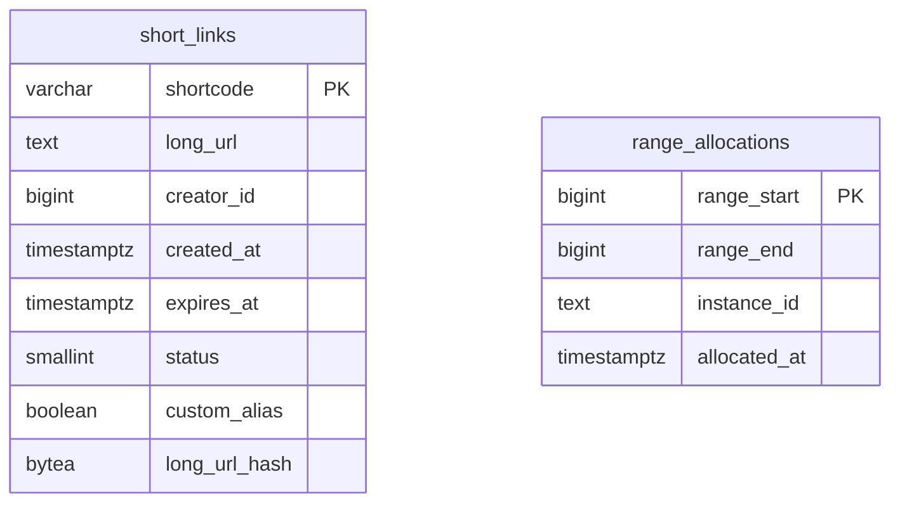
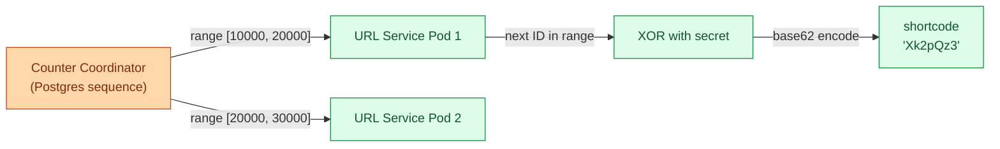
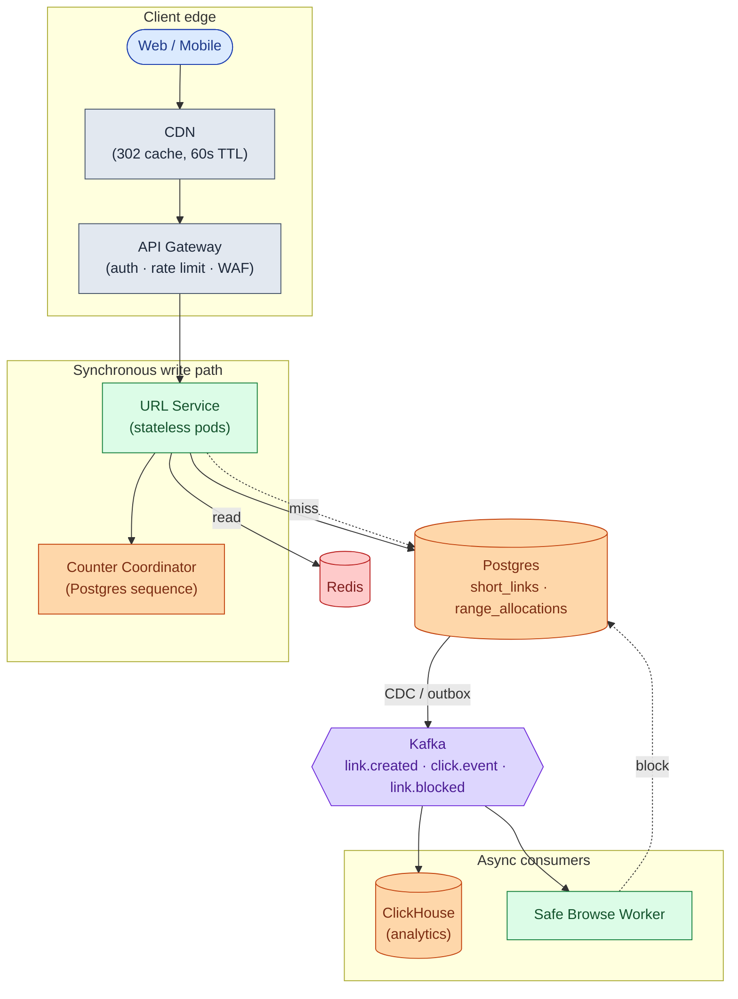
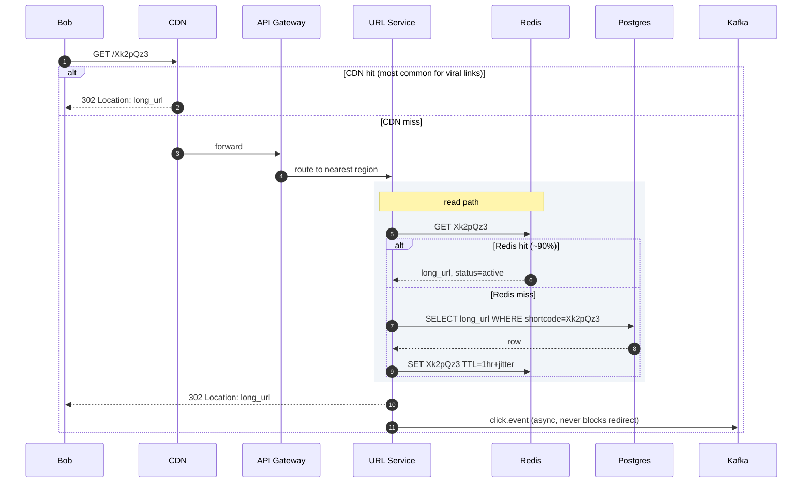
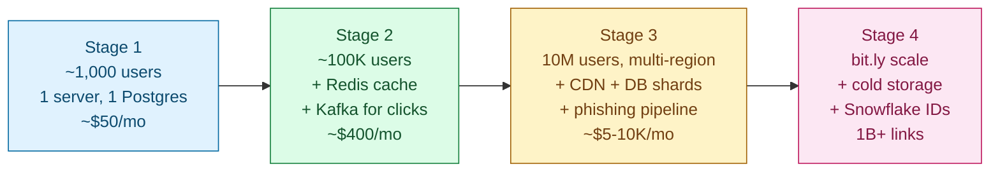

## Solution: URL Shortener

### The short version

A URL shortener is a key-value lookup with one twist: reads beat writes 10 to 1, and one specific key can suddenly take 100,000 requests per second when it goes viral.

The core is a stateless service in front of a cache in front of a sharded database. Short codes come from a counter that hands out ranges (no coordination on the write path), then get XOR-scrambled so they look random. Reads almost always hit cache. The database is a backstop.

The data model fits on a napkin: one table with shortcode as the primary key. Scale is not the hard part. At bit.ly numbers the system handles 38 writes per second steady. The hard part is the edges: surviving a viral link, revoking a phishing URL that is cached on six continents, recovering when the counter coordinator misbehaves.

---

### 1. The two questions that matter most

If you only get to ask two clarifying questions, ask these.

**How much traffic?** Without numbers you cannot pick a cache size, a sharding scheme, or even a database. Everything else derives from the numbers.

**Custom aliases, yes or no?** Aliases change the write path from "mint a fresh code" to "atomically reserve this exact string." That means checking for conflicts on the specific string the user wants, not just grabbing any available code.

Everything else (latency target, analytics shape, expiration) follows from those two.

---

### 2. The math, in plain numbers

| Metric | Value |
|--------|-------|
| Writes/sec, steady | ~38 |
| Writes/sec, peak | ~150 |
| Reads/sec, steady | ~380 |
| Reads/sec, peak | ~1,500 |
| Total URLs after 5 years | 6 billion |
| Total storage | ~900 GB |
| Hot working set (top 1M URLs) | ~150 MB |

Three things the numbers tell you:

- **The system is small.** A single Postgres handles the writes. You shard for failure isolation and regional latency, not capacity.
- **Cache wins everything.** 150 MB of hot set on one Redis node serves ~80% of traffic. Get the cache right and the database is almost an afterthought.
- **The redirect bandwidth is zero.** A 302 with a `Location` header has no body. You serve nothing. The user goes straight to the target.

---

### 3. The API

Two endpoints carry the whole product. Create a link. Follow a link.

```
POST /api/v1/links
Idempotency-Key: <uuid>

{
  "long_url": "https://example.com/very/long/path?with=query",
  "custom_alias": "my-link",
  "expires_at": "2027-12-31T00:00:00Z"
}
```

```
GET /<shortcode>
-> 302 Location: <long_url>
```

Non-obvious choices:

- **302, not 301.** A 301 says "permanent redirect." Browsers cache it forever locally. If you ever need to block the link (phishing, copyright, legal), the user's browser skips you and goes directly to the target. With 302, every click goes through you, so you keep control.
- **`Idempotency-Key` is required on create.** Mobile drops connections. The client retries. Without the key, one tap mints two short codes.
- **`Cache-Control: private, max-age=0` on the redirect.** Tells browsers and middlebox proxies not to cache. Your CDN can still cache it because you control the CDN explicitly.

Status codes worth knowing: **409 Conflict** when a custom alias is taken. **410 Gone** for expired or deleted links (different from 404 because it tells the browser the resource existed but is gone permanently, not just missing). **451 Unavailable for Legal Reasons** for blocked URLs.

---

### 4. The data model

One main table.



<details markdown="1">
<summary><b>Show: full SQL</b></summary>

```sql
CREATE TABLE short_links (
    shortcode      VARCHAR(16) PRIMARY KEY,
    long_url       TEXT NOT NULL,
    creator_id     BIGINT,
    created_at     TIMESTAMPTZ NOT NULL DEFAULT NOW(),
    expires_at     TIMESTAMPTZ,
    status         SMALLINT NOT NULL DEFAULT 1,
    custom_alias   BOOLEAN NOT NULL DEFAULT FALSE,
    long_url_hash  BYTEA
);

CREATE INDEX idx_creator_created ON short_links (creator_id, created_at DESC);
CREATE UNIQUE INDEX idx_dedup ON short_links (creator_id, long_url_hash)
    WHERE creator_id IS NOT NULL;
CREATE INDEX idx_expires ON short_links (expires_at) WHERE expires_at IS NOT NULL;

CREATE TABLE range_allocations (
    range_start    BIGINT PRIMARY KEY,
    range_end      BIGINT NOT NULL,
    instance_id    TEXT NOT NULL,
    allocated_at   TIMESTAMPTZ NOT NULL DEFAULT NOW()
);
```

</details>

Four small choices doing real work:

**`shortcode` as the primary key.** Reads are by shortcode. Matching the primary key to the lookup key skips an index hop on every single redirect. Sounds tiny. At 1,500 reads per second across 6 billion rows, it adds up.

**`long_url` is `TEXT`, not `VARCHAR(2048)`.** Real URLs exceed 2048 characters. Google Maps share links, deep OAuth callbacks, marketing URLs with tracking parameters. Trust the use case.

**`status` is `SMALLINT`, not an enum.** When you want to add `4 = pending_review` or `5 = quarantined`, no schema migration. Just write the new number.

**Unique index on `(creator_id, long_url_hash)`.** This is what makes dedup safe under concurrent writes. Two simultaneous POSTs of the same URL by the same user: one wins, the other gets a conflict and returns the existing shortcode. No application-level locks.

Why Postgres and not Cassandra? Because you want ACID for the counter-range allocation and the dedup unique index. Postgres gives you both. At 38 writes per second steady, you are nowhere near needing a NoSQL store.

---

### 5. How short codes get made

The engine of the write path.



<details markdown="1">
<summary><b>Show: the mint function</b></summary>

```python
def mint_shortcode():
    if local_range.exhausted():
        local_range = coordinator.allocate_range(size=10_000)

    counter_id = local_range.next()
    scrambled = counter_id ^ XOR_SECRET
    return base62_encode(scrambled)
```

</details>

Three things make this work:

**Range allocation removes the per-write coordination call.** A pod grabs 10,000 IDs from the coordinator. It serves 10,000 writes from local memory before talking to the coordinator again. At 38 writes per second per pod, that is one coordinator call every 4 minutes per pod.

**The XOR scramble kills sequential guessability.** Without it, codes look like `Aaa0001, Aaa0002, Aaa0003`. A scraper iterates the namespace and harvests every link. With XOR, consecutive counters give scattered codes. Same uniqueness (XOR is bijective).

**The coordinator must survive failover.** This is the trap. If the coordinator is plain Redis and the replica is stale, the same range gets handed out twice and two pods mint colliding codes. Back it with Postgres (a real sequence) or ZooKeeper.

Why not hash the URL? Birthday collisions. At 2 million URLs you have a 50% chance of one collision. At 6 billion, many. A retry loop with a salt handles them, but the latency is unpredictable at the tail. Counters are cleaner.

---

### 6. The architecture



Five things to notice:

- The CDN is in front of everything. A viral link's 302 is cached at the edge. Most clicks never reach origin.
- The write path has exactly one external dependency: the counter coordinator, called once per 10,000 writes per pod.
- Click analytics is downstream of Kafka. If ClickHouse falls over, redirects keep working. Click counts just lag.
- The Safe Browse Worker is also downstream. A phishing link may be live for up to a minute before being blocked. That trade-off is worth the latency win on create.
- URL Service pods are stateless. Roll them any time. State lives in Postgres and Redis.

---

### 7. A redirect, end to end



Target latencies in the common path:

| Path | P99 |
|------|-----|
| CDN hit | ~10ms (distance to edge node) |
| Redis hit, no CDN | ~30ms regional, ~80ms cross-region |
| DB hit (cache miss) | ~50ms regional |
| Create (new link) | ~200ms (bottleneck: synchronous DB insert) |

---

### 8. The scaling journey: 10 users to 1 billion links

At every stage, name what just broke and what fixes it. Build nothing preemptively.



#### Stage 1: 1,000 users

One server. Single Postgres. Counter is a Postgres sequence. No CDN, no Kafka, no sharding. About $50/month. Ships in a weekend.

Enough because you see ten links a day. Anything more is over-engineering.

#### Stage 2: 100,000 users

Something breaks: read latency spikes during the day, and Postgres CPU hits 60%.

Add Redis. The hot working set (a few hundred MB) fits in one Redis node. Cache hit rate goes from 0% to ~85%, Postgres CPU drops to 10%. Move click counting to a Kafka pipeline so the redirect path stops bumping a row on every hit. Add one read replica for durability.

Still one region. Still no sharding. About $400/month.

#### Stage 3: 10 million users, multi-region

New problems pile up:

- European users see 200ms latency (server is in us-east).
- One viral link starts taking 30K req/s and pegs one Redis CPU.
- Phishing complaints arrive weekly.

Fixes, in order:

- **Add a CDN.** Caches the 302 at the edge. Drops origin traffic by 80% for popular links.
- **Add regional read paths.** URL Service + Redis + read replica per region. Writes still go to one primary region.
- **Shard the database.** 64 shards by hash of shortcode. Spreads write load evenly.
- **Move the counter to a dedicated coordinator.** Range allocation, durable state in Postgres or ZooKeeper.
- **Build a phishing pipeline.** Safe Browsing API consumed via Kafka. Async. Cache invalidation via pub/sub when a link is flagged.

Cost climbs to $5-10K/month.

#### Stage 4: bit.ly scale (1 billion+ links)

What changes:

- CDN is critical infrastructure, not a nice-to-have. 95% of viral traffic served from the edge.
- Hot key defenses (in-process cache, Redis replicas, request coalescing) all in place as routine.
- Storage goes multi-tier. Cold tier in S3 for links older than 1 year.
- Multi-region writes become tempting. Probably still not worth it. A single primary region for writes is simpler and the write rate is still small.

The architecture has not fundamentally changed since Stage 3. You added more shards, more replicas, more CDN coverage, more careful abuse handling. The core data model is the same table you wrote in Stage 1.

At 10x of bit.ly, move to Snowflake-style IDs: machine ID + timestamp + sequence. No coordinator at all. Each pod mints codes forever without talking to a central service. The trade-off: codes get one character longer.

---

### 9. Reliability

**Cache failure.** Redis is down. All reads fall through to the DB. The DB can handle 1,500 req/s for a while, not forever. The URL Service detects Redis health and switches to protective mode: stricter rate limits, shed non-essential traffic with 503 + `Retry-After`.

**DB primary failure.** Promote a read replica. Writes are unavailable for 30 to 60 seconds (typical Postgres failover). Reads keep working everywhere else. The counter coordinator must not lose state during this window, which is why it lives on its own store.

**Counter coordinator failure.** The worst case. If the coordinator hands the same range to two pods, they mint colliding codes. The DB unique constraint catches the collision (one INSERT wins, the other 500s). The range_allocations ledger detects the overlap within minutes and alerts. Recovery: scan the conflicting range, find any collisions, reissue the affected codes manually.

**Region failure.** The global LB shifts traffic to healthy regions. The failed region's cache is cold elsewhere. Expect ~5 minutes of degraded latency as the new region's cache warms up.

**CDN failure.** Rare. Traffic falls to origin. Origin sees 5x normal load. Auto-scaling buys time. If load is too high, shed with 503s.

---

### 10. Observability

| Metric | Why it matters |
|--------|----------------|
| `redirect.latency` p50/p95/p99 by region | The headline SLO. The whole product is "the redirect is fast." |
| `redirect.cache_hit_rate` | If this drops below 80%, something is wrong: TTL too short, cache node died, or the Zipf assumption broke. |
| `redirect.404_rate` | A spike means someone is scraping the namespace. New rate limit rule needed. |
| `create.latency` p50/p99 | Slow creates point to the counter coordinator or DB write path. |
| `create.dedup_rate` | If 30% of POSTs are dedups, clients are buggy or not respecting the idempotency key. |
| `counter.range_overlap_detected` | Must be 0. Page on any non-zero value. |
| `safe_browsing.flagged_rate` | A sudden spike means an active abuse campaign. |
| `kafka.click_event_lag` | If clicks lag more than 5 minutes, analytics is stale. |
| `db.replication_lag_p99` | Must stay under 1 second. |

Page on: redirect P99 > 200ms for 5 minutes. Cache hit rate < 70% for 5 minutes. Counter range overlap detected (any).

Ticket on: dedup rate spike. 404 rate spike (could be scraping, could be someone deleted a popular link).

---

### 11. Follow-up answers

**1. Two users submit the same long URL within milliseconds.**

If both are anonymous, give them different shortcodes. Two devices submitting the same URL should not be linkable as the same person.

If both are logged in as the same user, dedup. Compute `sha256(long_url)`. Use `INSERT ... ON CONFLICT (creator_id, long_url_hash) DO UPDATE ... RETURNING shortcode`. The unique index makes the race safe. The second INSERT sees the conflict and returns the first one's shortcode.

If a logged-in user wants two separate codes for the same URL (e.g., for A/B testing two marketing campaigns), accept a `force_new=true` parameter to skip dedup.

**2. Custom aliases (atomic reservation).**

```sql
INSERT INTO short_links (shortcode, long_url, creator_id, custom_alias)
VALUES ($alias, $url, $user, TRUE)
ON CONFLICT (shortcode) DO NOTHING
RETURNING shortcode;
```

If `RETURNING` is empty, the alias was taken. Return 409. Atomic at the DB level. No locks needed.

One extra concern: a custom alias like `abc1234` looks identical to a generated code. Reserve disjoint namespaces. Custom aliases must be at least 4 chars and contain a non-base62 character (hyphen, underscore), or at least 8 chars. Generated codes are 7 base62 characters only. No overlap possible.

**3. Hot key problem.**

Layer four defenses, cheapest first:

- **CDN.** 99% of load served from the edge. Origin sees 1% of the storm.
- **In-process LRU cache on each pod.** Top 1,000 keys in pod memory, 60s TTL. Zero network cost per hit.
- **Redis read replicas.** Read round-robin across N replicas. Multiplies hot-key throughput by N.
- **Request coalescing on cache miss.** Only one goroutine fetches from DB. The rest wait on a per-key lock.

For pre-known viral events: push the entry to every region's cache before the storm hits.

**4. Phishing detection.**

Google Safe Browsing takes 200 to 500ms. You cannot block create on that.

At create time: synchronous check against a small bloom filter of known-bad domains. Catches the worst offenders instantly. Asynchronously via Kafka: a worker calls Safe Browsing. If flagged, flip `status = blocked` and evict the cache everywhere via pub/sub. Continuously: a nightly job rescans links created in the last 30 days. Phishing campaigns sometimes weaponize URLs that were clean at creation.

Trade-off: a phishing URL can be live for 1 to 2 minutes before being blocked. To shrink the window, fire the Safe Browsing call before returning from create but only block on the response if it lands within 50ms.

**5. Click count analytics.**

`UPDATE short_links SET clicks = clicks + 1` on every redirect: 1,500 writes per second serialized on hot rows. Lock contention on viral links. It melts the DB.

Pipeline instead: redirect emits `{shortcode, ts, ip_hash, ua_hash}` to Kafka. A streaming job (Flink or ksqlDB) aggregates per shortcode in 1-minute windows. Aggregates go to Redis for rolling totals and ClickHouse for time series. The UI queries the counter store, not the primary DB.

Consistency: eventually consistent, 1 to 2 minutes behind real time. Fine for almost every use case.

**6. Custom domains.**

`shrt.acme.com/abc1234` instead of `shrt.ly/abc1234`:

- **TLS.** Per-customer cert via Let's Encrypt automation, or wildcard cert.
- **Routing.** Load balancer SNI-routes the TLS connection to URL Service. The service reads the `Host` header and looks up which tenant owns it.
- **Data model.** Add `tenant_id` to `short_links`, and a `custom_domains` table mapping domain to tenant. Shortcodes are now scoped per tenant. The same `abc1234` can exist for two tenants.
- **DNS.** Customer adds a CNAME from their domain to your load balancer.

This is how every URL shortener supports paid plans. The base shortener is the loss leader; custom domains are the upsell.

**7. Link expiration with retention.**

Three states: `active`, `expired`, `deleted`.

Expired links return 410. The row stays for analytics: "how many clicks did this campaign get before it expired?" Deleted links are gone. For GDPR you may null out `long_url` while keeping the shortcode reservation so the code is not reissued to someone else.

A nightly job sets `status = expired` where `expires_at < now()`. Cache entries naturally expire and the next fetch picks up the new status. No special invalidation needed. Move rows older than 6 months to a cold storage table, then to S3 after a year.

**8. Thundering herd on cache miss.**

Without protection: the popular URL's cache entry expires. 10,000 concurrent requests all hit the DB for the same row. CPU spikes. The DB potentially falls over.

Three fixes, all needed together:

- **Jittered TTL.** Add ±10% random jitter to every TTL. Prevents the top 1% of keys from expiring in the same second.
- **Request coalescing.** First request fetches from DB and populates cache. Others wait on a per-key lock and read the populated value. 10,000 DB reads become one.
- **Stale-while-revalidate.** Serve the stale value while one background goroutine refreshes. Same trick HTTP's `stale-while-revalidate` directive uses. Every major CDN does this internally.

**9. GDPR delete.**

Scatter-gather across all 64 shards: `WHERE creator_id = ?` runs in parallel, union the results. Either DELETE the rows or null out `long_url` and `creator_id` and set `status = gdpr_deleted`. Keep the shortcode reservation so the code is not reissued. Anonymize click history: hash or drop the user identifier and IP. Publish a pub/sub event to evict all of this user's keys from every cache. Confirm to the user within the 30-day GDPR window.

If you expect many GDPR requests, maintain a `creator_id -> shortcode[]` secondary index in a dedicated table. Avoids the scatter-gather for the common case.

**10. Counter coordinator handed the same range twice.**

**Detection.** Every range allocation writes to `range_allocations`. A periodic job (every minute) scans for overlapping ranges:

```sql
SELECT a.*, b.*
  FROM range_allocations a, range_allocations b
 WHERE a.range_start < b.range_end
   AND b.range_start < a.range_end
   AND a.instance_id != b.instance_id;
```

Non-empty result: page immediately.

**Recovery.** Scan the conflicting range against `short_links`. Find which IDs got minted by both pods. For each duplicate that ended up with a different `long_url`: keep the earlier one, contact the second submitter, reissue with a new shortcode.

**Prevention.** Never run the coordinator on plain Redis. Its failover can lose recent writes, replaying the same N seconds worth of IDs. Use Postgres sequences or ZooKeeper. The cost is a tiny bit of extra infrastructure. The benefit is correctness.

The mid-level answer covers only prevention. The senior answer covers detection, recovery, and prevention in one breath.

---

### 12. Trade-offs worth saying out loud

**Why not a multi-master database.** DynamoDB Global Tables or Spanner would let writes happen in every region. The operational complexity and write-latency tax are rarely worth it at URL-shortener traffic (38 writes per second). Single-primary with read replicas is the right answer at this scale.

**Why not content-addressed (hash-based) shortcodes.** If shortcodes are hashes of the long URL, you cannot change the target. Mutability is a feature here: you need it for moderation, phishing takedowns, and legal compliance.

**Why 302 and not 301 is not just trivia.** It is the difference between having control over your users' browser caches and not. The phishing use case makes 302 mandatory, not just preferable.

**What to revisit at 10x scale.** Move to Snowflake-style IDs to eliminate the counter coordinator. Put the tiered cache (in-process LRU, regional Redis, DB) in as an explicit design rather than emergent behavior. Reconsider Postgres at 64 shards - Cassandra or DynamoDB starts winning on operational cost at that point.

---

### 13. Common mistakes

Most weak answers fall into one of these:

**Diving straight into "use Redis and a database."** No clarification, no math, no API. Loses the interviewer in the first two minutes.

**Hashing the long URL with MD5 and assuming no collisions.** Birthday paradox. At 6 billion URLs you will have many. Either acknowledge the collision-handling cost or use a counter.

**Using 301 instead of 302.** Browsers cache 301s forever in their local cache. You lose the ability to block phishing, change targets, or count clicks at the service level. 302 is correct.

**Ignoring click analytics.** Every URL shortener has them. A senior candidate mentions the async pipeline even if not asked.

**Hand-waving cache invalidation.** "We'll use TTLs" handles routine eviction but not blocked links that need immediate revocation. Mention the pub/sub eviction path.

**No mention of phishing.** It is a real operational issue. Any URL shortener that accepts anonymous submissions needs to address it.

**Over-engineering from the start.** Do not propose a globally distributed multi-master CRDT-backed KV store unless the numbers demand it. They don't.

**Ignoring the hot key problem.** You will be asked. Layered caching is the answer.

**No story for counter coordinator failure.** This is where senior candidates separate from mid-level ones. Detection, recovery, and prevention in one breath.

If you hit seven of these nine cleanly, you are interviewing at staff level. The three that matter most: 302 vs 301, the layered hot-key defense, and the counter coordinator failure story. Those are what a senior architect listens for.
