## What we are building

A news feed shows a ranked, personalized list of posts from accounts a user follows. Alice opens Instagram. She sees 50 posts from the 300 people she follows, ordered roughly by how likely she is to engage with them, not by raw time. When Bob posts a photo, it appears in Alice's feed within a few seconds.

That sounds like `SELECT ... ORDER BY time`. It is not.

There are five hard problems hiding in this product:

1. **Where do the post_ids come from?** Computing a feed by joining posts and follows on every read is too slow once a user follows hundreds of accounts.
2. **How do you fan out a post?** When a celebrity with 100 million followers posts, writing to every follower's feed is 100 million database writes from one event.
3. **How does ranking work without blocking the read?** ML models change weekly and use signals that only exist at read time. You cannot pre-rank at write time.
4. **What happens when a post is deleted?** The post_id is in 100 million pre-built feeds. You cannot scrub them all.
5. **How do you keep the feed fast across all user types?** A user who follows 5,000 accounts, a new user with an empty feed, and a user returning after 30 days all need fast first loads.

We start with 1,000 users and a single database. Then we add one pressure at a time.

---

## The lifecycle of one feed load

Before drawing any boxes, picture what happens when Alice opens the app.

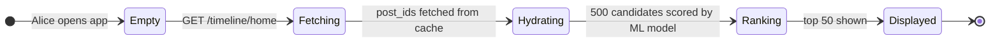

The interesting design work is in `Fetching` and `Hydrating`: where do those post_ids come from, and how did they get there before Alice asked for them?

> **Take this with you.** A feed is not a query. It is a pre-built list of post_ids, assembled at write time, ready to read in milliseconds.

---

## How big this gets

A Twitter-shaped product gives us these numbers.

| Input | Number |
|-------|--------|
| Daily active users | 300 million |
| Posts per day | 500 million |
| Times each user opens the app per day | 10 |
| Median follower count per user | 100 |
| Top celebrity follower count | 100 million |
| Feed load latency target (P99) | under 200ms |

From these we derive everything else.

<details markdown="1">
<summary><b>Show: the derived numbers</b></summary>

| Metric | Value | How |
|--------|-------|-----|
| Posts/sec, steady | ~5,800 | 500M / 86,400 |
| Posts/sec, peak | ~17,000 | 3x steady |
| Feed loads/sec, steady | ~35,000 | 300M × 10 / 86,400 |
| Feed loads/sec, peak | ~100,000 | 3x steady |
| Timeline writes/sec (naive push) | ~580,000 | 5,800 × 100 followers |
| One celebrity post (100M followers) | 100M writes | single event |
| Storage for pre-built feeds (post_ids only) | ~6 TB | 300M users × 1,000 post_ids × 20 bytes |

Three observations:

1. **The hard number is not throughput.** 580,000 timeline writes per second is large but manageable across a pool of workers. The hard number is the ratio between an average post (100 writes) and a celebrity post (100M writes): six orders of magnitude. No single strategy handles both.
2. **Reads beat writes 100 to 1.** Most users scroll without posting. That ratio justifies pre-building feeds even at the cost of write amplification.
3. **Feed storage is expensive but bounded.** 6 TB of post_ids spreads across many Redis shards. Storing full post content instead of post_ids would be 25x that. Store post_ids, hydrate at read.

</details>

> **Take this with you.** The hard number is not average throughput. It is the gap between a normal user (100 followers) and a celebrity (100 million followers). Those two cases need different strategies.

---

## The smallest version that works

One Postgres, one app server, two services. The feed is a join.

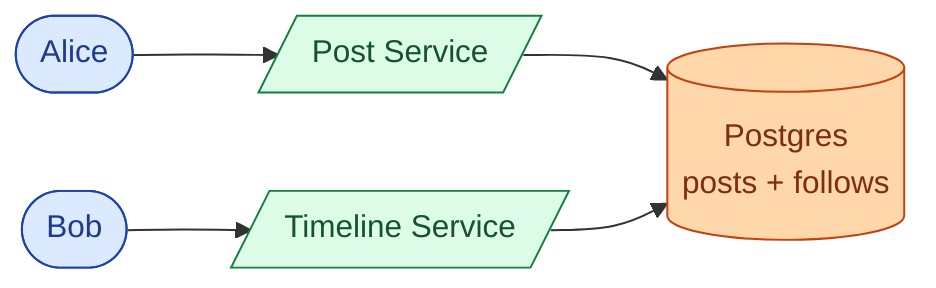

Two endpoints carry the whole product.

| Endpoint | What it does |
|----------|--------------|
| `POST /posts` | Save post, return post_id |
| `GET /timeline/home?cursor=<opaque>&limit=50` | Return 50 ranked posts for the caller |

<details markdown="1">
<summary><b>Show: the feed query at small scale</b></summary>

```sql
SELECT p.*
  FROM posts p
  JOIN follows f ON f.followee_id = p.author_id
 WHERE f.follower_id = :user_id
   AND p.deleted_at IS NULL
 ORDER BY p.created_at DESC
 LIMIT 50;
```

</details>

Fine for 1,000 users. Starts hurting at 100,000 when users follow 200+ accounts.

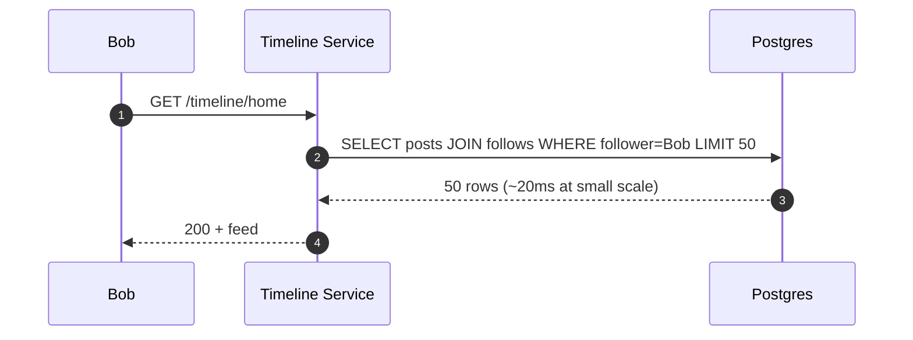

> **Take this with you.** Start here. The interesting question is what breaks first as the product grows, not what you build on day one.

---

## Decision 1: how do we fan-out posts?

When Alice posts, we have two choices: write her post_id into every follower's feed list right now, or wait and fetch her recent posts when each follower opens their feed.

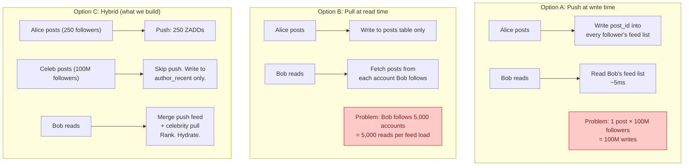

Hybrid fan-out: push for normal users, pull for celebrities at read time.

<details markdown="1">
<summary><b>Show: why the threshold matters and how to set it</b></summary>

The threshold is not just follower count. A user with 800k followers who posts 50 times per day creates more fan-out load than a celebrity with 5M followers who posts once a week. The right metric is `followers × daily_post_rate`.

A background job recomputes the threshold per author hourly and stores it in Redis. The fan-out dispatcher reads that flag when it sees a new post event. No hard-coded cutoff.

The risk of setting the threshold too low: borderline users get treated as celebrities. Their followers do an extra Redis pull per feed load. Across many borderline users, the pull side gets expensive.

</details>

> **Take this with you.** This one decision shapes the entire system. If you say "push to everyone" in the interview, the celebrity math kills the answer. If you say "pull at read time," a user following 5,000 accounts kills it.

---

## Decision 2: how do we store and read pre-built feeds?

We have settled on push for normal users. We need a data structure that supports:

- Insert a post_id with a timestamp score (at write time, from fan-out workers)
- Fetch the top N post_ids in reverse time order (at read time)
- Trim to a maximum depth (cap at 1,000 entries per user to bound memory)

A Redis sorted set does all three with three commands.

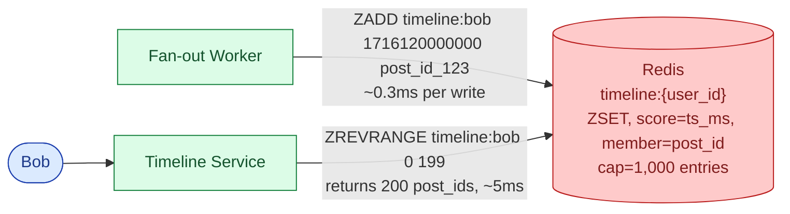

<details markdown="1">
<summary><b>Show: the three Redis commands</b></summary>

```
# Write (fan-out worker, once per follower per post)
ZADD timeline:{user_id} {created_at_ms} {post_id}
ZREMRANGEBYRANK timeline:{user_id} 0 -1001   # trim to top 1,000

# Read (timeline service, once per feed load)
ZREVRANGE timeline:{user_id} 0 199            # top 200 candidates in reverse time order
```

ZADD is O(log N). ZREMRANGEBYRANK trims stale entries. ZREVRANGE returns top N. Three commands. No joins.

</details>

For celebrity authors, we use the same structure but keyed by author instead of by user:

```
author_recent:{author_id}  →  ZSET of recent post_ids, capped at 50
```

At read time the Timeline Service fetches from `timeline:{user_id}` (push side) and from `author_recent:{celeb}` for every celebrity the user follows (pull side), then merges.

> **Take this with you.** Redis sorted sets are a near-perfect fit for pre-built feeds. ZADD inserts with ordering, ZREVRANGE reads top N, ZREMRANGEBYRANK bounds memory. Three commands per write, one per read.

---

## Decision 3: where does ranking live?

Modern feeds rank by predicted engagement, not raw time. The ML model takes a list of candidate post_ids, fetches features for each, and returns scores. Where does this step happen?

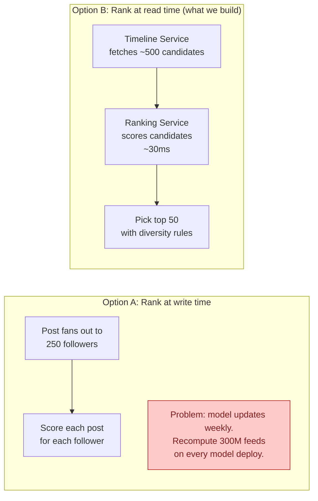

Ranking lives on the read path. Three reasons:

1. **Model changes weekly.** Write-time ranking means recomputing 300M feeds on every deploy. Not feasible.
2. **Some signals only exist at read time.** What did Bob click this morning? What is trending right now? These are not available at write time.
3. **Small candidate set.** We score ~500 posts per feed load, not billions. At 500 candidates, scoring takes ~30ms and fits inside a 200ms budget.

> **Take this with you.** Pre-ranking sounds efficient. It breaks every time the ML team ships a new model, which is weekly. Score on the read path against a small candidate set.

---

## Decision 4: how do we handle deletes, blocks, and unfollows?

A post can be in 100 million pre-built feeds. A block or unfollow can affect thousands. Eagerly scrubbing feed lists is not practical.

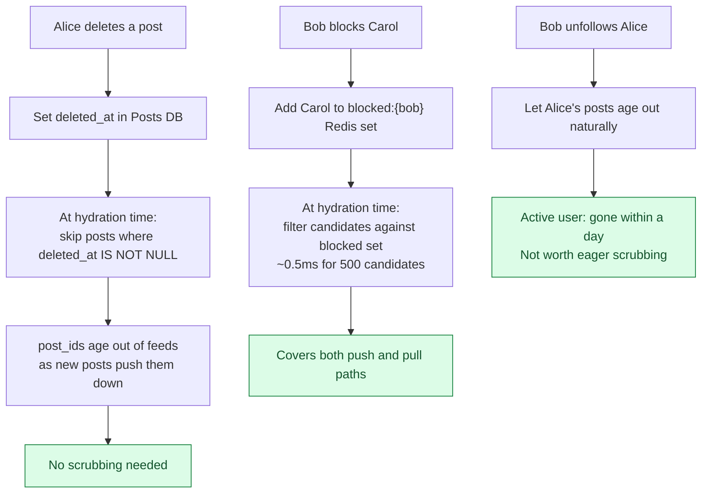

The pattern is: store post_ids, not content, in the feed cache. Hydrate at read time. Filter at hydration. All three operations (delete, block, unfollow) are handled cleanly by a single filter step rather than by scrubbing millions of sorted sets.

> **Take this with you.** Lazy delete and lazy filter at hydration time are not shortcuts. They are the correct architecture. They work because we store post_ids, not post content, in the timeline cache.

---

## The full architecture

Putting the four decisions together:

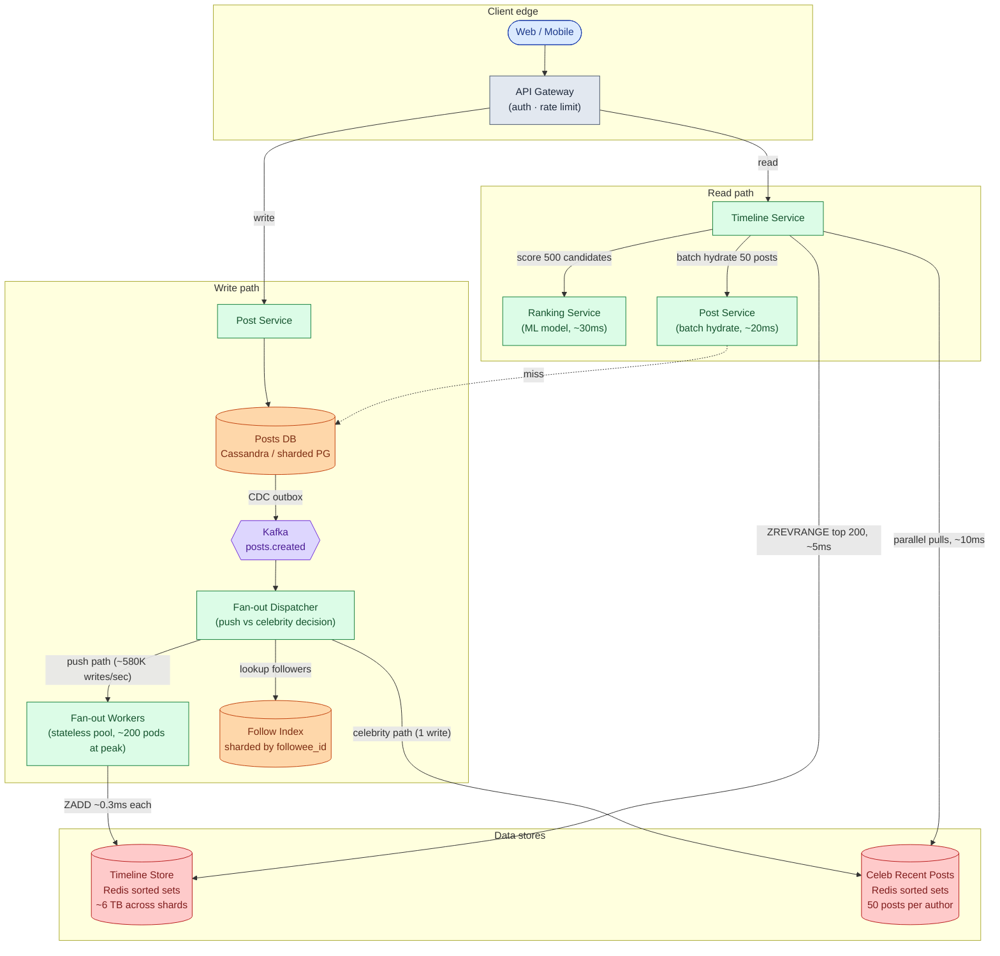

Each component, in one line:

| Component | Purpose |
|-----------|---------|
| API Gateway | TLS termination, auth, per-user rate limits |
| Post Service | Saves posts, batch-fetches post content by post_id |
| Posts DB | Source of truth for post content. Sharded by post_id |
| Kafka | Async buffer between post creation and fan-out |
| Fan-out Dispatcher | Reads post events, decides push vs celebrity path per author |
| Follow Index | Sharded by followee_id so "who follows Alice?" is one shard |
| Fan-out Workers | Write post_ids into follower sorted sets. Auto-scale on Kafka lag |
| Timeline Store | Pre-built feed per user. Redis sorted sets, capped at 1,000 entries |
| Celeb Recent Posts | Per-celebrity recent post_ids. 50 entries per author |
| Timeline Service | Reads both stores, merges, sends to Ranking, hydrates, returns |
| Ranking Service | Stateless ML scoring. Owned by ML team, deployed independently |

Notice what is not on the read path: the Posts DB is only hit by Post Service for hydration, not for the feed list itself. The timeline list comes entirely from Redis.

---

## Walks: posting and reading, end to end

**Alice posts (250 followers, push path):**

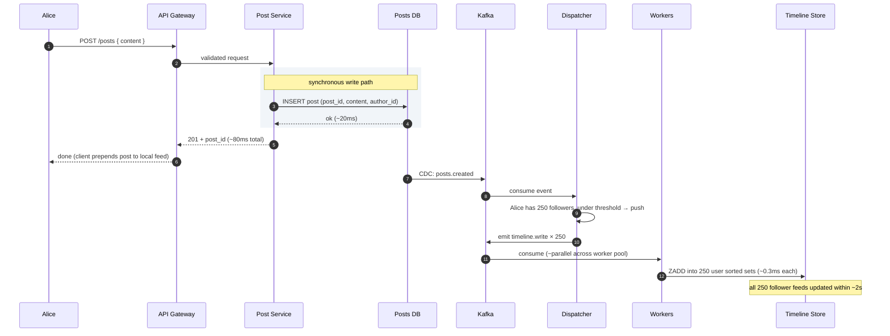

**Bob reads his feed (follows Alice and 2 celebrities):**

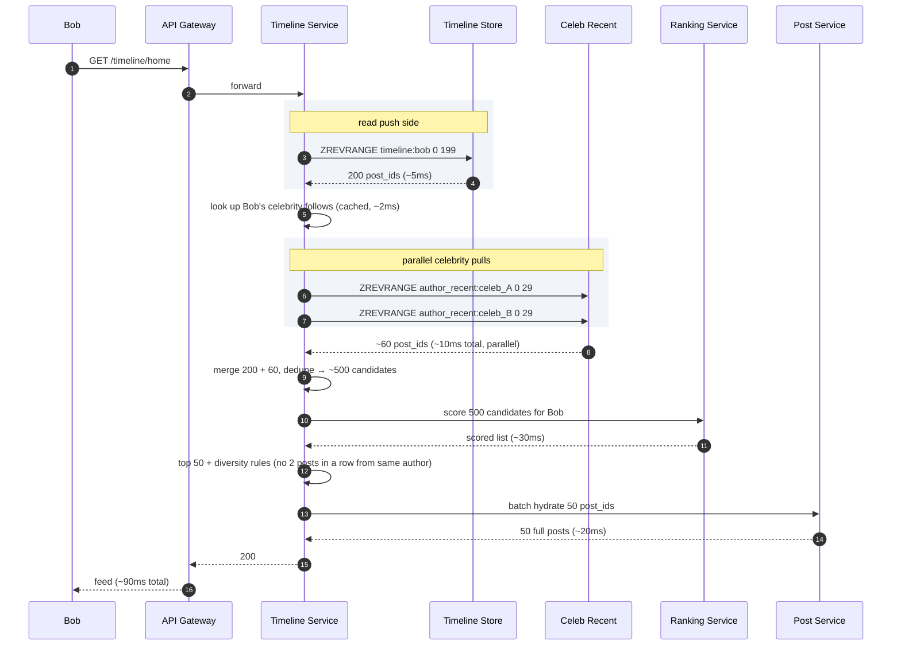

Two things worth noting:

1. Alice's 201 returns before fan-out starts. She sees her own post via a client-side prepend, not by waiting for workers.
2. The read path always merges both sides. If Bob follows no celebrities, the pull side returns empty cheaply.

---

## The deep problem: celebrity posts during peak load

A celebrity with 100 million followers posts. The fan-out dispatcher correctly skips push and writes to `author_recent`. That part is fine.

The hard part: the next few seconds after the celebrity posts, 50 million of their followers open the app almost simultaneously. Every one of them hits the Timeline Service. Every one of them hits `author_recent:{celeb}`. Every one of them then hits Ranking Service with 500 candidates.

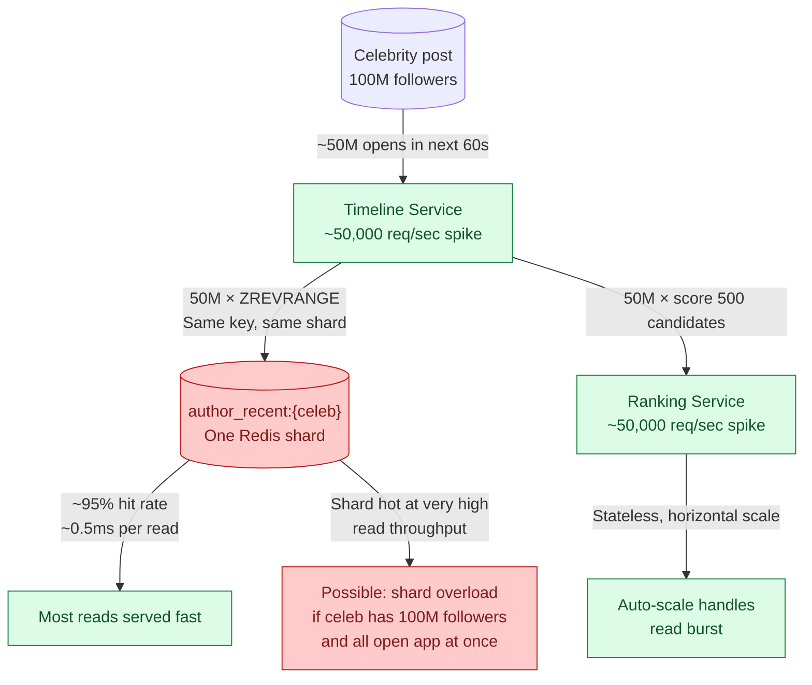

Three defenses for the Redis hot key:

1. **Read replicas for `author_recent`.** Add 5-10 read replicas for the shard hosting top celebrities. Round-robin reads across them. Multiplies read throughput by N.
2. **In-process LRU on Timeline Service pods.** Cache the top 20 post_ids from each celebrity in pod memory with a 10-second TTL. At 200 pods, a single celebrity's recent posts need only ~20 Redis reads per 10 seconds total, not 50,000.
3. **CDN or regional cache for feed responses.** For users whose feeds overlap heavily (same region, same celebrity follows), cache assembled feed responses at the API gateway for 30 seconds. Most users see near-real-time feeds; celebrities get slightly stale.

> **Take this with you.** The celebrity pull path moves the fan-out problem from write time to read time. For the biggest celebrities, you still need to handle hot-key reads. In-process LRU on the read service is the cheapest first defense.

---

## Follow-up questions

Try answering each in 2 or 3 sentences before opening the solution.

1. **User blocks another user.** Old posts from the blocked person are in the blocker's pre-built feed. Do you scrub the feed, or filter at read time?

2. **User unfollows someone.** Their pre-built feed has that author's posts. Remove them right away, or let them age out?

3. **User deletes a post.** The post_id is in 100 million pre-built feeds. How do you handle it? You cannot scrub 100M entries.

4. **New user signs up and follows 50 accounts.** Their feed is empty. How do you bootstrap it?

5. **Cold user.** A user has not opened the app for 30 days. Do you keep pushing to their feed every time someone they follow posts?

6. **Backfill on new follow.** I just followed someone. Do their last 10 posts show up in my feed right away, or do I have to wait for their next post?

7. **Live updates.** A new post lands while I am scrolling. Push it over WebSocket, or wait for pull-to-refresh?

8. **Pagination.** I scroll past 50 posts. How does the cursor work? What if one of the posts at the cursor position has been deleted?

9. **One fan-out worker is doing 100x the work of others.** What is wrong? How do you fix it?

10. **CEO wants "you might like" injections.** Put 3 recommended posts at positions 5, 15, 25 of every feed. Where does this live in the pipeline?

11. **Repost (retweet).** A celebrity reposts my normal post. Does my post now have to fan out to the celebrity's 100 million followers?

12. **Private account.** Someone's account is private. Their post should only reach approved followers. How does fan-out know?

13. **Replication lag.** I post. The post is in the primary DB but not the read replica yet. I open my own feed and don't see it. How do you fix it?

14. **Ad slot.** Position 4 of every feed is an ad. Where does the ad get picked? What happens if the ad service is down?

15. **Region failover.** US-East goes down. Users get routed to US-West. Their feeds are stale by a few minutes. What do they see?

---

## Related problems

- **[Chat System (003)](../003-chat-system/question.md).** Same fan-out and delivery problem. DMs are 1-to-1 fan-out instead of 1-to-many, but the patterns rhyme.
- **[Notification System (010)](../010-notification-system/question.md).** Same fan-out worker pattern. Same celebrity problem when a popular account triggers notifications to millions.
- **[Distributed Cache (009)](../009-distributed-cache/question.md).** The timeline store leans hard on Redis. Know its eviction, replication, and hot-key limits.
- **[Typeahead (005)](../005-typeahead-autocomplete/question.md).** Both use the same two-stage pattern: candidate generation followed by scoring.
