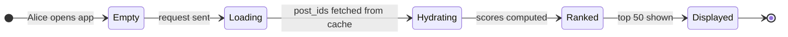
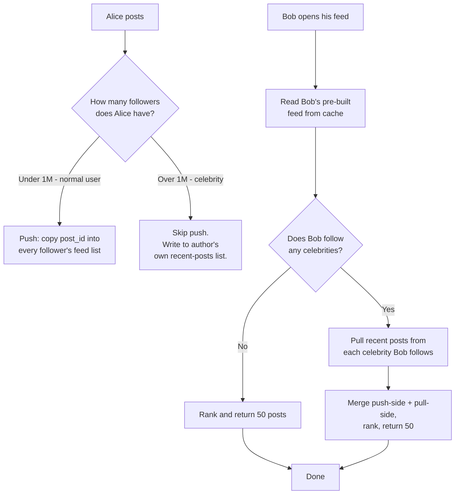
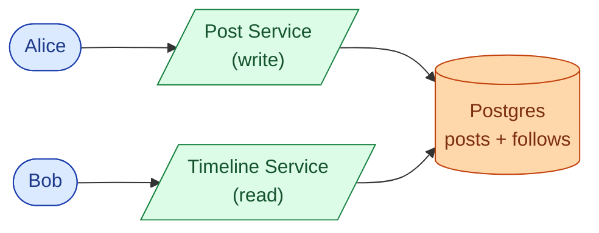
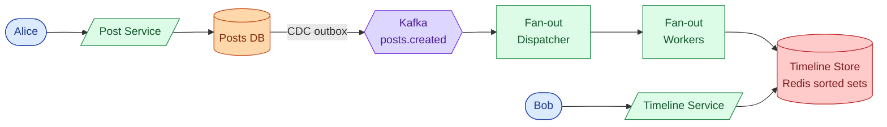
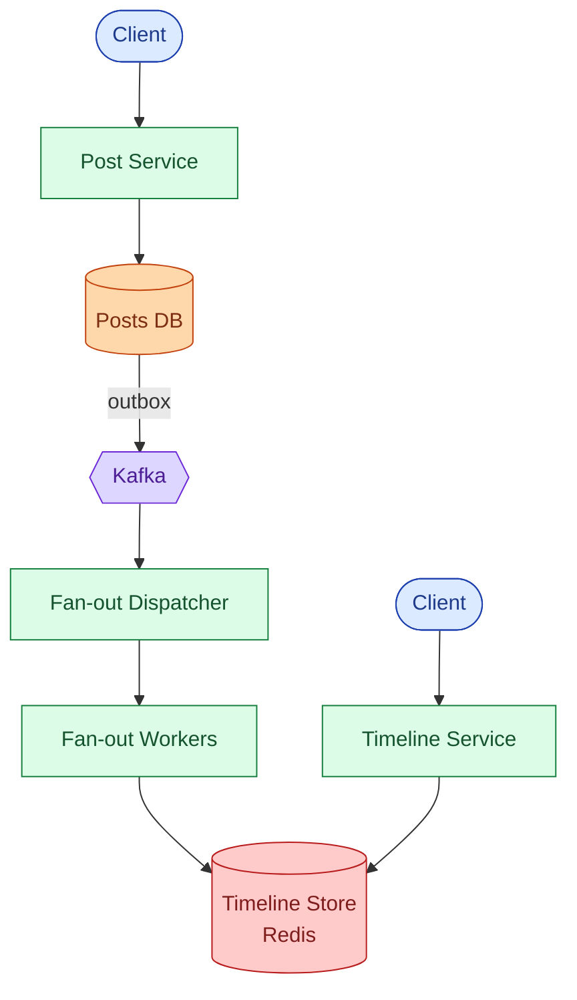
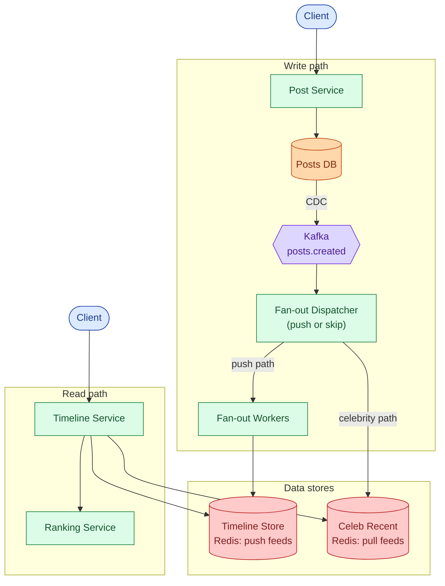
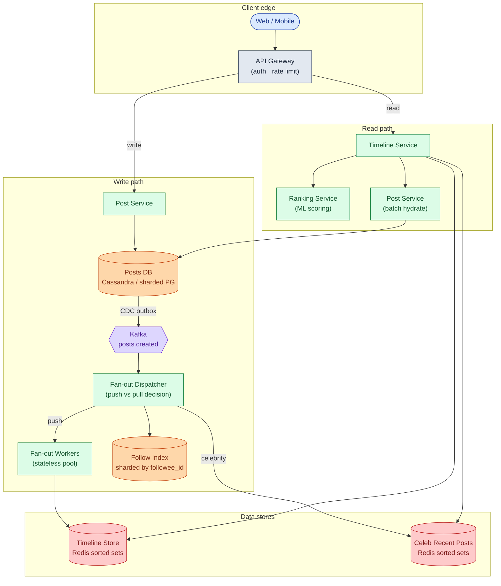
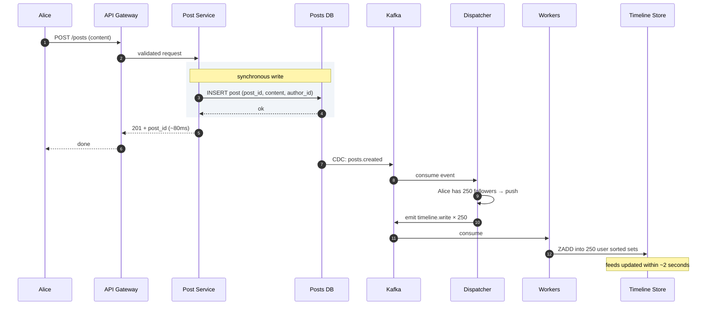
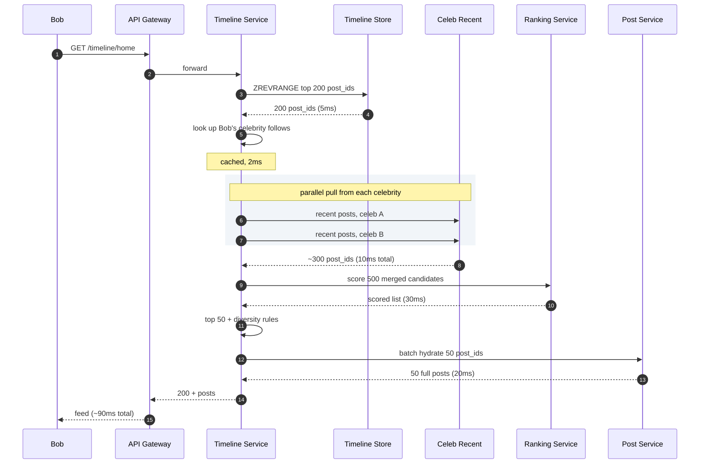
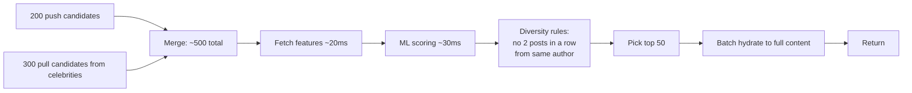

## The scene

You sit down. The interviewer leans in.

> *"Think about Twitter's home feed. When I log in, I see a list of posts from people I follow. Design that. Start with a small app, a thousand users. Then grow it until we're at Twitter scale, three hundred million daily users."*
>
> *"And tell me: what's the single number that decides the whole design?"*

It sounds like a simple list query. It is not.

The trap is the word "feed." It sounds like a `SELECT ... ORDER BY time`. The real question is hidden:

- What happens when one person has 100 million followers and posts right now?
- How do you show anyone's feed in under 200ms?
- How do you handle a post being deleted after it has already reached a million feeds?
- Where does ranking live, and what breaks if you get it wrong?

We will start with 1,000 users and a single database. Then we add one pressure at a time and watch the design grow.

---

## Step 1: Picture one feed

Before boxes or SQL, picture what a feed is. Alice follows Bob and Carol. She opens the app.



That is the whole read path. The interesting design work is in the loading and hydrating steps: where do those post_ids come from, and how do they get there?

> **Take this with you.** A feed is not a query against a posts table. It is a pre-built list of post_ids, assembled when people post, ready to read in milliseconds.

---

## Step 2: Ask the right questions

In a real interview, pause for two minutes and write down what you want to ask. Not twenty questions. Five good ones.

<details markdown="1">
<summary><b>Show: 5 questions that change the design</b></summary>

1. **What is the biggest user's follower count?** Median user has maybe 100 followers. Top user: 1 million? 100 million? *This single number decides the whole architecture. If the biggest user has 1,000 followers, you can push to everyone. If they have 100 million, you cannot.*
2. **Time order or ranked by an algorithm?** Old Twitter was time order. New Twitter, Instagram, and Facebook all run an ML ranking step. Ranking adds 30ms on the read path and forces ranking to live there, not at write time.
3. **How fast must the feed load?** Sub-200ms P99 is the target. Anything slower feels broken.
4. **How many reads per write?** Posts are rare; scrolling is constant. About 100 reads per post write is typical. That ratio justifies pre-building feeds rather than computing them on demand.
5. **How fresh must the feed be?** My own post should appear instantly (client-side prepend). A friend's post can take 5 seconds. Knowing the tolerance shapes how aggressively we can cache.

A strong candidate also asks the meta question: *"Is the biggest user 1 million followers or 100 million?"* The two answers lead to very different architectures.

</details>

---

## Step 3: How big is this thing?

Same product, two very different scales.

| Scale | Posts/sec | Feed loads/sec | One celebrity post |
|-------|-----------|----------------|-------------------|
| 1,000-user app | ~0.01 | ~0.1 | not relevant |
| 300M DAU (Twitter) | ~5,800 (peak 17k) | ~35,000 (peak 100k) | 100M writes, one post |

<details markdown="1">
<summary><b>Show: how the numbers come out</b></summary>

**Inputs:** 300M daily active users, 500M posts per day, each user opens the app 10 times per day, median user has 100 followers, top celebrity has 100M followers.

**Posts per second.** 500M / 86,400 ≈ **5,800/sec** steady. Peak 3x = ~17,000/sec.

**Feed loads per second.** 300M × 10 = 3B loads/day ÷ 86,400 ≈ **35,000/sec** steady. Peak ~100,000/sec.

**Naive push: write every post to every follower's feed.** On average, each post goes to 100 followers. 5,800 × 100 = **580,000 timeline writes/sec**. A lot, but manageable.

**One celebrity post.** One post by a user with 100M followers = 100M timeline writes. If they post once a minute, that is 100M writes per minute from one account. This is what breaks the system. The fan-out queue grows without bound. Other users see slow feeds.

**Storage for pre-built feeds.** 300M users × 1,000 post_ids per feed × 20 bytes per entry = **6 TB**. Spread across many Redis shards, this fits.

**What the math tells you.** The hard number is not throughput. It is the gap between an average post (100 writes) and a celebrity post (100M writes), which spans six orders of magnitude. No single strategy works for both.

</details>

---

## Step 4: The core decision

Before drawing any boxes, settle one question: when Alice posts, what do you do?



This is hybrid fan-out. Push for normal users; pull for celebrities at read time.

<details markdown="1">
<summary><b>Show: why each pure approach fails</b></summary>

| Approach | Read speed | Write cost | Breaks when |
|----------|------------|------------|-------------|
| **Push only** | ~10ms (cached) | One write per follower | A celebrity posts. 100M writes for one post. |
| **Pull only** | Slow, maybe 500ms | One write per post | A user follows 5,000 accounts: 5,000 reads per feed load. |
| **Hybrid** | ~10ms push + ~10ms celeb pull | Bounded: only push to non-celebrities | Edge cases at the threshold. |

Push fails because of celebrity math. Pull fails because of heavy followers. Hybrid takes the cheap path in each case.

The threshold (1M followers) is not fixed. A user with 800k followers who posts 50 times a day creates the same fan-out load as a celeb who rarely posts. A background job tunes the threshold per author based on `followers × post_rate`.

</details>

> **Take this with you.** This one decision shapes every other choice: the data stores, the worker pool, the read path. If you say "push for everyone" in the interview, the next 30 minutes go nowhere.

---

## Step 5: The smallest thing that works

Forget Twitter scale. We have 1,000 users and a single Postgres. One feed query. No workers.



The feed query is a join:

```sql
SELECT p.*
  FROM posts p
  JOIN follows f ON f.followee_id = p.author_id
 WHERE f.follower_id = :user_id
 ORDER BY p.created_at DESC
 LIMIT 50;
```

Fine for 1,000 users. Starts to hurt at 100,000 when users follow 200+ accounts.


> **Take this with you.** Start here. The interesting interview question is what happens next, not what you build on day one.

---

## Step 6: The first crack

The app grows to 100,000 users. Carol follows 400 accounts. Her feed query now scans 400 author IDs, sorts by time, and consistently hits 800ms. Users are complaining.

The fix: stop computing the feed on every read. Compute it at write time instead. When Alice posts, write her post_id into each follower's pre-built feed list. When Bob reads, he gets a single cached list, not a join.

This is the push strategy. It moves work from the read path to the write path.



The timeline store is a Redis sorted set per user, keyed by `timeline:{user_id}`. Score is the post's creation timestamp. Members are `post_id`s. We keep the top 1,000 entries and trim on insert.

<details markdown="1">
<summary><b>Show: the Redis data shape</b></summary>

```
Key:    timeline:{user_id}
Type:   ZSET
Score:  created_at (unix ms)
Member: post_id (64-bit Snowflake ID)
Cap:    top 1,000 entries; ZREMRANGEBYRANK trims on insert
```

Insert: `ZADD timeline:bob <timestamp> <post_id>` then `ZREMRANGEBYRANK timeline:bob 0 -1001` to trim.

Read: `ZREVRANGE timeline:bob 0 199` returns 200 candidates in reverse time order.

One write per follower per post. One read per feed load. No joins.

</details>

> **Take this with you.** Pre-building feeds at write time is the single biggest performance unlock. It trades write amplification for sub-10ms reads.

---

## Step 7: Build the architecture, one layer at a time

We have push fan-out working. Now build the full system around it, one layer at a time.

### v1: post → push fan-out → cache → read



This handles one million users. But no celebrity handling yet.

### v2: add celebrity pull path

When Alice has 50M followers and posts, we skip push. Her post_id goes into `author_recent:{alice_id}`. When Bob opens his feed and follows Alice, the read path pulls from that list.



### v3: add API gateway and post hydration

Feed reads return `post_id`s from Redis. We need to hydrate them to full post content. Add a Post Service on the read path (batch lookup by post_id). Also add an API gateway for auth and rate limiting.

### v4: full architecture at Twitter scale



Each box, in one line:

| Box | What it does |
|-----|--------------|
| **API Gateway** | Authenticates callers, rate-limits bots, routes reads vs writes. |
| **Post Service** | Saves posts; returns full post content given a post_id. |
| **Posts DB** | Source of truth for post content. Sharded by post_id. |
| **Kafka** | Async buffer between writes and fan-out. Post creation never waits for fan-out. |
| **Fan-out Dispatcher** | Reads new post events; decides push vs celebrity-pull based on follower count. |
| **Follow Index** | Sharded by followee_id so "who follows Alice?" is one shard, not a scatter. |
| **Fan-out Workers** | Write post_ids into each follower's Redis sorted set. Auto-scale on queue lag. |
| **Timeline Store** | Pre-built feed per user. Redis sorted sets, trimmed to top 1,000 entries. |
| **Celeb Recent Posts** | Per-celebrity recent post_ids. Read at feed time by followers. |
| **Timeline Service** | Reads from both stores, merges, ranks, hydrates, returns. |
| **Ranking Service** | Stateless ML scoring. Takes ~500 candidates, returns scores. |

> **Take this with you.** Fan-out workers and the ranking service are both stateless. Any pod can die at any time. State lives in Kafka, Redis, and the databases.

---

## Step 8: One post and one feed read, end to end

**Posting:**



**Reading:**



Two things worth pointing at:

1. The post creation returns a 201 before fan-out starts. Alice sees her own post via a client-side prepend, not by waiting for workers.
2. The read path always merges both sides. If Bob follows no celebrities, the pull side returns empty cheaply. No conditional logic needed.

---

## Step 9: Where does ranking live?

Modern feeds are not in time order. They rank by predicted engagement. Where does scoring happen?

<details markdown="1">
<summary><b>Show: why ranking belongs on the read path</b></summary>

Two choices: rank at write time (score posts when they fan out) or rank at read time (score candidates when the user opens the app).

Ranking lives on the read path. Three reasons.

**The model changes weekly.** The ML team ships a new version every Tuesday. If we ranked at write time, every model update means recomputing 300M pre-built feeds. Impossible.

**Some signals only exist at read time.** What did Bob click this morning? What is trending right now? The model uses these. They do not exist at write time.

**Ranking is cheap on a small set.** We score 500 candidates, not 1B posts. Scoring 500 items at read time takes ~30ms. That fits in a 200ms budget.



The ranking service is owned by the ML team. The timeline service just sends candidates and gets scores. Each team deploys independently.

</details>

> **Take this with you.** Pre-ranking sounds efficient but breaks every time the model updates. Score on the read path against a small candidate set.

---

## Step 10: Three users, one system

The same architecture handles three wildly different load patterns.

**A. Aisha posts a selfie.** She has 250 followers. Normal user.

**B. Elon posts.** He has 200M followers. Celebrity.

**C. Marcus opens his feed.** He follows 2,000 normal people and 30 celebrities.

<details markdown="1">
<summary><b>Show: what each case teaches</b></summary>

**A. Aisha posts (push path).**

- Post saved to Posts DB.
- `posts.created` event hits Kafka.
- Dispatcher: 250 followers, under threshold. Push.
- 250 tasks emitted to `timeline.write`.
- Workers do 250 ZADDs.
- Total time from Aisha posting to all follower feeds: ~2 seconds.

Common bug: dispatcher uses a cached follower count. Aisha gained 10 followers in the last minute. Those 10 miss this post in their pre-built feed. They see it when she posts next. Tolerable.

**B. Elon posts (celebrity path).**

- Post saved to Posts DB.
- `posts.created` event hits Kafka.
- Dispatcher: 200M followers, over threshold. Skip push.
- Write post_id into `author_recent:{elon}`. One write.
- Done in under 100ms.

No fan-out. Every Elon follower's next feed load does one extra Redis read for his recent posts. Cost shifts to read time, but it is a tiny Redis operation.

Common bug: threshold set too low. A user with 10,000 followers gets treated as a celebrity. Their followers now do an extra Redis pull per load for someone barely notable. Multiply across many borderline users and the pull side gets expensive.

**C. Marcus opens his feed (read path).**

- Read 200 post_ids from Marcus's Redis sorted set. 5ms.
- Look up Marcus's 30 celebrity follows. 2ms.
- Pull recent posts from each celebrity in parallel. 10ms total.
- Merge: ~500 candidates.
- Score with Ranking Service. 30ms.
- Hydrate top 50 post_ids to full content. 20ms.
- Return. ~90ms total.

Common bug: the hydrate step issues 50 sequential requests instead of one batch. 50 × 5ms = 250ms for hydration alone. Always batch.

</details>

---

## Follow-up questions

Try answering each in 2 or 3 sentences before opening the solution.

1. **User blocks another user.** Old posts from the blocked person might be in the blocker's pre-built feed. Do you scrub the feed, or filter at read time?

2. **User unfollows someone.** Their pre-built feed has that author's posts. Remove them right away, or let them age out?

3. **User deletes a post.** The post might be in 100 million pre-built feeds. How do you handle it? You cannot scrub 100M entries.

4. **New user signs up and follows 50 accounts.** Their feed is empty. How do you bootstrap it?

5. **Cold user.** A user has not opened the app for 30 days. Do you keep pushing to their feed every time someone they follow posts?

6. **Backfill on new follow.** I just followed someone. Do their last 10 posts show up in my feed right away, or do I have to wait for their next post?

7. **Live updates.** A new post lands while I am scrolling. Push it over WebSocket, or wait for pull-to-refresh?

8. **Pagination.** I scroll past 50 posts. How does the cursor work? What if one of the posts at the cursor has been deleted?

9. **One fan-out worker is doing 100x the work of others.** What is wrong? How do you fix it?

10. **CEO wants "you might like" injections.** Put 3 recommended posts at positions 5, 15, 25 of every feed. Where does this live in the pipeline?

11. **Repost (retweet).** A celebrity reposts my normal post. Does my post now have to fan out to the celebrity's 100M followers?

12. **Private account.** Someone's account is private. Their post should only reach approved followers. How does fan-out know?

13. **Replication lag.** I post. The post is in the primary DB but not the read replica yet. I open my own feed and don't see it. How do you fix it?

14. **Ad slot.** Position 4 of every feed is an ad. Where does the ad get picked? What happens if the ad service is down?

15. **Region failover.** US-East goes down. Users get routed to US-West. Their feeds are stale by a few minutes. What do they see?

---

## Related problems

- **[Chat System (003)](../003-chat-system/question.md).** Same fan-out and delivery problem. DMs are 1-to-1 fan-out instead of 1-to-many, but the patterns rhyme.
- **[Notification System (010)](../010-notification-system/question.md).** Same fan-out worker pattern, same celebrity problem when a popular account triggers notifications to millions.
- **[Distributed Cache (009)](../009-distributed-cache/question.md).** The timeline store leans hard on Redis. Know its limits.
- **[Typeahead (005)](../005-typeahead-autocomplete/question.md).** Both this problem and search use the "two-stage: candidate generation + ranking" pattern.
