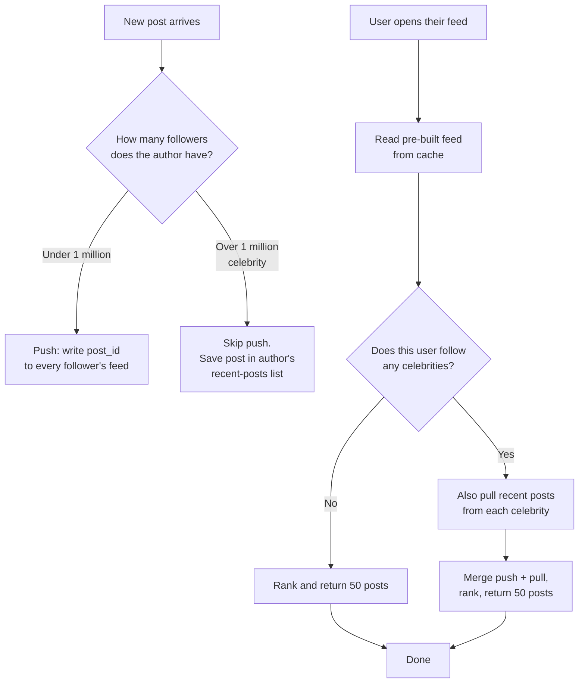
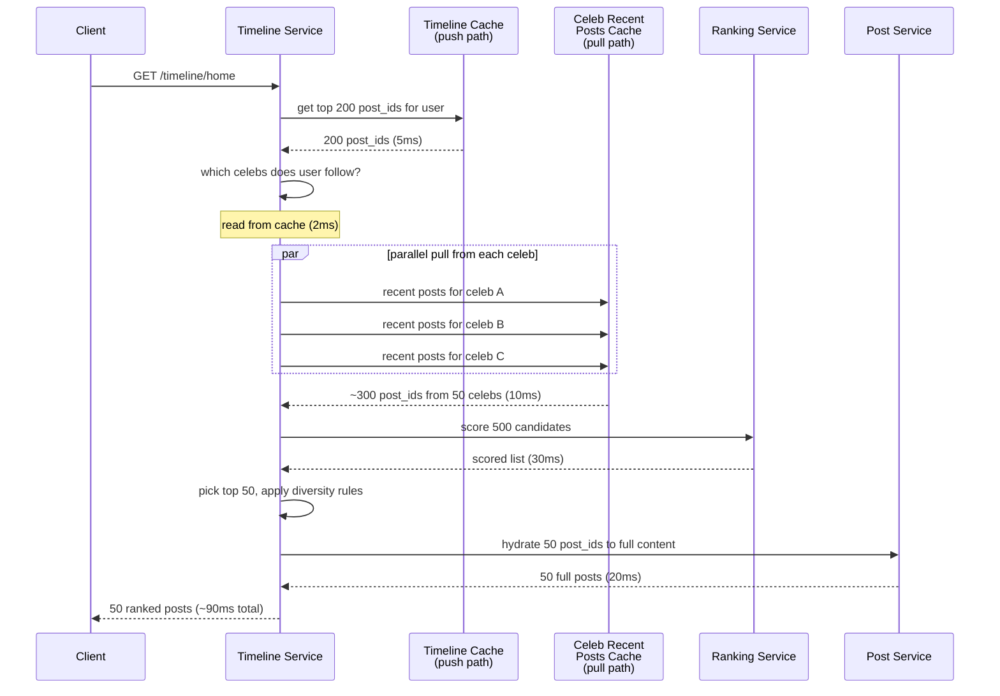
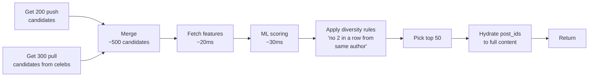

## The scene

You sit down. The interviewer slides a sheet of paper across the table.

> *"Design Twitter. Not the whole thing. Just the home feed. You know, the list of posts from people you follow. Walk me through it."*

Then they lean back and add: *"Start simple. A small app with 1,000 users. Then we'll grow it. By the end I want to see how it works at 300 million users."*

It looks like a simple list problem. It is not. The trap is the word "feed." It sounds like a query. The real question is hidden: what happens when one person has 100 million followers? How do you show a fresh feed in less than 200ms? How do you stop one celebrity's post from melting the whole system?

We will walk this from a 1,000-user app to a Twitter-sized service. At each step we will name what breaks first. Then we will add the smallest fix that solves it.

---

## Step 1: Ask the right questions

Before you draw anything, sit for five minutes. Write down the questions you would ask.

A good answer is not "20 questions about every detail." It is the small handful of questions that change the design if the answer is different.

<details markdown="1">
<summary><b>Show: 8 questions that matter</b></summary>

1. **How big is the biggest user?** Median user has maybe 100 followers. But what about the top user? 1 million? 100 million? *(This single number decides the whole design. If the biggest user has 1,000 followers, you can push to everyone. If they have 100 million, you can't.)*
2. **Is the feed in time order, or ranked by an algorithm?** Old Twitter was time order. New Twitter, Instagram, Facebook are all ranked by a machine learning model. Ranking adds a step on the read path.
3. **How fast must the feed load?** Sub-200ms is the bar. Anything slower feels broken.
4. **How many reads per write?** Posts are rare. Feed reads are constant. About 100 reads per post is normal. That changes the design a lot.
5. **How fresh must it be?** Does my own post need to show up instantly in my feed? (Yes.) Can my friend's post take 5 seconds to reach me? (Usually yes.)
6. **Are posts text only, or with images and video?** Media needs a CDN, thumbnails, and an upload pipeline. We will note it but focus on the feed.
7. **Are notifications part of this design?** Say no. The feed is one product. Notifications are a different product that listens to the same events.
8. **Do we show only posts from people I follow, or also "you might like"?** Recommendations add an injection step in the read path.

A strong candidate also asks the meta question: *"Is the biggest user 1 million followers or 100 million?"* The answer changes everything.

</details>

---

## Step 2: How big is this thing?

Same problem, three sizes. Do the math at each.

**Inputs from the interviewer:**

- 300 million daily active users
- Median user has 100 followers
- Heavy users have 1 million followers
- Top users (celebrities) have 100 million followers
- 500 million posts per day
- Each user opens the app 10 times per day
- Feed shows the latest 50 posts

Try to compute:

1. Posts per second
2. Feed loads per second
3. How many "timeline writes" happen if we push every post to every follower
4. What happens when one celebrity posts

<details markdown="1">
<summary><b>Show: the math</b></summary>

**Posts per second.**
500M / 86,400 seconds ≈ **5,800 posts/sec on average**. Peak is 3x → about **17,000 posts/sec**.

**Feed loads per second.**
300M users × 10 loads = 3 billion loads/day → about **35,000 loads/sec** on average. Peak about **100,000/sec**.

**Naive push: write every post to every follower's feed.**
On average, each post goes to 100 followers. 5,800 × 100 = **580,000 timeline writes per second**. That is a lot, but it fits.

**One celebrity post.**
One post by a user with 100 million followers = 100 million timeline writes. For one post. If that user posts once per second, that is 100 million writes per second from one person.

This is what breaks the system. The fan-out worker queue grows forever. Replication falls behind. Other users see slow feeds.

**Storage for ready-made feeds.**
300M users × 1,000 posts per feed × 50 bytes per entry = **15 TB**. Spread across many shards, this fits.

**What the math tells you:**

The big number is not posts per second. It is not feed loads per second. It is the gap between an average user (100 followers) and the top user (100 million). That gap is 1 million times. No single design works for both. The whole architecture exists to handle that gap.

</details>

---

## Step 3: The big decision: push, pull, or both?

This is the heart of the problem. Before drawing any boxes, decide your approach.

You have three options:

- **Push (write everywhere).** When I post, copy the post into every follower's ready-made feed list. Reads are fast. Writes can be huge.
- **Pull (read everywhere).** When you open your feed, ask every person you follow for their recent posts. Merge them. Writes are tiny. Reads can be slow.
- **Hybrid (mix).** Push for normal users. Pull for celebrities.

Think about it with this flowchart:



<details markdown="1">
<summary><b>Show: side-by-side comparison</b></summary>

| Approach | Read speed | Write cost | Breaks when |
|----------|------------|------------|-------------|
| Push only | ~10ms (cached) | One write per follower | A celebrity posts. 100M writes for one post crushes the system. |
| Pull only | Slow. Maybe 500ms for active users | One write per post | A user follows 5,000 people. Their feed needs 5,000 reads. |
| Hybrid | ~10ms for most. A bit more for people who follow celebrities. | Bounded. Push only for non-celebrities. | Edge cases at the boundary: who counts as a celebrity? |

**Why hybrid wins.**

The math forces it. Push fails for celebrities (100M writes per post). Pull fails for users who follow many people (5,000 reads per feed load). Hybrid takes the cheap path for each case.

- Normal user posts (median 100 followers) → push. Cheap.
- Celebrity posts (over 1M followers) → no push. Save in their own "recent posts" list.
- User opens feed → read their pre-built feed AND pull from any celebrities they follow. Merge.

The threshold (1M followers) is not fixed. Set it lower for users who post often (high posts × high followers = same load). Set it higher for users who rarely post. A background job tunes it.

> **Why this matters.** This decision shapes every other choice. Database, cache, worker pool, all of it. If you say "push for everyone," the next 30 minutes go nowhere.

</details>

---

## Step 4: Draw the system

Now draw the boxes. Try to fill in the missing pieces below. Five boxes are missing. Think about: where posts get stored, what runs the push fan-out, where the ready-made feeds live, who reads them, and who does the merge.

```
            Client (mobile, web)
                   |
                   v
            +---------------+
            |  API Gateway  |  auth, rate limit
            +-+----------+--+
   read       |          |       write (post)
              |          |
              v          v
        +-----------+  +-----------+
        |   [ ? ]   |  |   Post    |  stores posts in main DB
        |  (reads)  |  |  Service  |
        +-----+-----+  +-----+-----+
              |              |
              |              v
              |        +------------+
              |        |   [ ? ]    |  reads new post,
              |        | (dispatch) |  decides push vs pull
              |        +-----+------+
              |              |
              |              v
              |        +------------+
              |        |   [ ? ]    |  workers that write into
              |        | (workers)  |  each follower's feed list
              |        +-----+------+
              |              |
              v              v
        +-------------------------+
        |   [ ? ]                  |  pre-built feeds.
        |   per-user list of       |  Hot users in Redis,
        |   recent post_ids        |  cold in Cassandra.
        +-------------------------+

        Separately, for celebrities:
        +-------------------------+
        |   [ ? ]                  |  per-author recent posts.
        |                          |  Read at feed time.
        +-------------------------+
```

<details markdown="1">
<summary><b>Show: the full architecture</b></summary>

```
            Client (mobile, web)
                   |
                   v
            +---------------+
            |  API Gateway  |  auth, rate limit
            +-+----------+--+
   read       |          |       write (post)
              |          |
              v          v
        +-----------+  +-----------+
        | Timeline  |  |   Post    |  Main store for posts.
        | Service   |  |  Service  |  Sharded by post_id.
        | (reads)   |  +-----+-----+
        +-----+-----+        |
              |              v
              |        +----------------+
              |        |   Posts DB     |  Cassandra or sharded
              |        |                |  Postgres.
              |        +-------+--------+
              |                |
              |                | CDC / outbox
              |                v
              |        +----------------+
              |        | Kafka topic:   |
              |        | posts.created  |
              |        +-------+--------+
              |                |
              |                v
              |        +----------------+
              |        |  Fan-out       |  Reads new post.
              |        |  Dispatcher    |  Author < 1M followers?
              |        +-------+--------+  Push. Else skip.
              |                |
              |                v
              |        +----------------+
              |        | Kafka topic:   |  One message per follower.
              |        | timeline.write |
              |        +-------+--------+
              |                |
              |                v
              |        +----------------+
              |        |  Fan-out       |  Stateless pool.
              |        |  Workers       |  Each task: write
              |        +-------+--------+  one post_id into
              |                |           one feed.
              v                v
        +-------------------------+
        |  Timeline Store          |  Redis sorted sets,
        |  (hot users in Redis,    |  sharded by user_id.
        |   cold in Cassandra)     |  Top 1000 entries per user.
        +-------------------------+

        Pull path for celebrities:
        +-------------------------+
        |  Per-author              |  "Recent 50 posts" list
        |  Recent Posts Cache      |  per author. Cached in Redis.
        |  (Redis)                 |  Read at feed time.
        +-------------------------+

        Ranking:
        +-------------------------+
        |  Ranking Service         |  ML model. Scores candidates.
        |                          |  Called by Timeline Service.
        +-------------------------+
```

**What each piece does, in one line:**

- **API Gateway.** Auth (who is this), rate limit (no bots), basic shape checks.
- **Post Service.** Owns the post. Returns full post content given a post_id.
- **Posts DB.** Source of truth for post content. Sharded by post_id.
- **Kafka (posts.created).** Stream of new posts. Glue between writes and fan-out.
- **Fan-out Dispatcher.** Reads new post events. Decides push vs pull based on author follower count.
- **Fan-out Workers.** Write post_ids into each follower's feed list. Auto-scale on queue depth.
- **Timeline Store.** Per-user list of recent post_ids. Redis for hot users, Cassandra for cold.
- **Per-author Recent Posts Cache.** The pull-path target. Celebrities' posts land here for read-time merging.
- **Timeline Service.** The read path. Pulls from both push and pull stores, merges, ranks, hydrates, returns.
- **Ranking Service.** Stateless ML scoring. Takes ~200 candidates, returns scores.

</details>

---

## Step 5: The celebrity problem (pull at read time)

A celebrity posts. We do not push to their 100 million followers. Good. But now a follower opens their feed. How do we get the celebrity's post in there?

Walk through it in your head. The user follows 50 celebrities. They open their app. What happens?

<details markdown="1">
<summary><b>Show: the read flow with pull</b></summary>

Here is the read flow as a sequence diagram.



**Why this works:**

1. **Each celebrity has their own "recent posts" cache.** When a celeb posts, we write one entry into one Redis key. Cheap.
2. **The user follows 50 celebs.** We do 50 parallel reads. Each is a Redis hit. About 10ms total.
3. **We merge with the pre-built feed.** Push gives ~200 posts. Pull gives ~300. Together: ~500 candidates.
4. **Rank, pick top 50, hydrate, return.** Total under 200ms.

> **Why hybrid beats push for celebrities.** Push would write 100M entries every time the celeb posts. Most of those followers are offline right now. We did the work for nothing. Pull only does the work when someone actually opens their feed. Much cheaper.

> **Why hybrid beats pull for normal users.** Pull would force every feed load to query every account you follow. If you follow 500 normal people, that is 500 reads per feed load. Push lets us read one cached list instead.

</details>

---

## Step 6: Where does ranking live?

Modern feeds are not in time order. They are scored by a machine learning model. Recent posts with high predicted engagement go first. So where in the system does ranking happen?

Two choices:

- **Rank at write time.** When a post is fanned out, we already know its score. Store it ranked.
- **Rank at read time.** Store posts in time order. When the user loads their feed, score the candidates fresh.

Which one?

<details markdown="1">
<summary><b>Show: ranking belongs on the read path</b></summary>

Ranking lives on the read path. Always. Three reasons.

**The model changes weekly.** The ML team ships a new version every Tuesday. If we ranked at write time, every model change means recomputing 300 million feeds. Impossible.

**Some signals only exist at read time.** What did the user click on this morning? What page were they just on? The model uses these. None of them exist at write time.

**Ranking is cheap on a small set.** We rank 200 candidates, not 1 billion posts. Scoring 200 items is ~30ms. Do it on the read path.

**The pipeline:**



> **Why diversity rules?** Without them, a chatty author drowns out everyone else. Diversity rules force a mix. They are simple but important. Usually "no 2 posts in a row from the same author" and "mix post types."

The ranking service is separate from the timeline service. The ranking team owns it. The timeline team just sends candidates and gets scores back. This separation lets each team move at their own speed.

</details>

---

## Step 7: Three real cases, one system

Same architecture. Three different users. Each one stresses a different part of the design.

For each, guess which part of the system does the heavy work. Then check.

**A. Aisha posts a selfie.** She has 250 followers. Normal user.

**B. Elon posts a tweet.** He has 200 million followers. Celebrity.

**C. Marcus opens his feed.** He follows 2,000 normal people plus 30 celebrities. Active user.

<details markdown="1">
<summary><b>Show: what each one teaches</b></summary>

**A. Aisha posts a selfie (push path).**

- Post lands in Posts DB.
- Posts.created event hits Kafka.
- Dispatcher checks: 250 followers, under threshold. Push.
- 250 small messages emitted to timeline.write topic.
- Fan-out workers write 250 ZADDs into 250 Redis sorted sets.
- Total time: ~2 seconds from post to all followers' feeds.

This is the common case. 99% of posts go this way.

> *Common bug:* the dispatcher uses a stale follower count. Aisha gained 10 new followers in the last minute, the cache says 240. Those 10 new followers miss this post in their pre-built feed. They will see it next time they reload. Tolerable.

**B. Elon posts a tweet (pull path).**

- Post lands in Posts DB.
- Posts.created event hits Kafka.
- Dispatcher checks: 200M followers, over threshold. Skip push.
- Write post_id into Elon's "recent posts" cache. One write.
- Done. Total time: under 100ms.

No fan-out work. The cost shifts to read time. Every Elon follower's feed load now does one extra Redis read for Elon's recent posts.

> *Common bug:* the threshold is set too low. A user with 10,000 followers gets treated as a celebrity. Their followers now do an extra pull per feed load for someone who is not actually a celebrity. Sum across many borderline users and the pull side gets expensive.

**C. Marcus opens his feed (read path).**

- Timeline Service gets request.
- Read top 200 post_ids from Marcus's Redis sorted set (push side). 5ms.
- Look up Marcus's 30 celeb follows. 2ms.
- Pull recent posts from each celeb in parallel. 10ms.
- Merge: ~500 candidates.
- Send to Ranking Service. 30ms.
- Hydrate top 50 post_ids to full content. 20ms.
- Return. ~90ms total.

> *Common bug:* the hydrate step is sequential instead of batched. 50 sequential Post Service calls at 5ms each = 250ms. Always batch. Make 1 call that returns 50 posts.

**The big idea.** One system. Three very different load patterns. The architecture handles all three because we picked the right path for each.

</details>

---

## Follow-up questions

Try answering each in 2 or 3 sentences before opening the solution.

1. **User blocks another user.** Old posts from the blocked person might be in the blocker's pre-built feed. Do you scrub the feed, or filter at read time?

2. **User unfollows someone.** Their pre-built feed has that author's posts. Remove them right away, or let them age out?

3. **User deletes a post.** The post might be in 100 million pre-built feeds. How do you handle it? You cannot scrub 100M entries.

4. **New user signs up and follows 50 accounts.** Their feed is empty. How do you bootstrap it?

5. **Cold user.** A user has not opened the app for 30 days. Do you keep pushing to their feed every time someone they follow posts?

6. **Backfill on new follow.** I just followed someone. Do their last 10 posts show up in my feed right away, or do I have to wait for their next post?

7. **Live updates.** A new post lands while I am scrolling. Push it over WebSocket, or wait for pull-to-refresh?

8. **Pagination.** I scroll past 50 posts. How does the cursor work? What if one of the posts at the cursor has been deleted?

9. **One fan-out worker is doing 100x the work of others.** What is wrong? How do you fix it?

10. **CEO wants "you might like" injections.** Put 3 recommended posts at positions 5, 15, 25 of every feed. Where does this live in the pipeline?

11. **Repost (retweet).** A celeb reposts my normal post. Does my post now have to fan out to the celeb's 100M followers?

12. **Private account.** Someone's account is private. Their post should only reach approved followers. How does fan-out know?

13. **Replication lag.** I post. The post is in the primary DB but not the read replica yet. I open my own feed and don't see it. How do you fix it?

14. **Ad slot.** Position 4 of every feed is an ad. Where does the ad get picked? What happens if the ad service is down?

15. **Region failover.** US-East goes down. Users get routed to US-West. Their feeds are stale by a few minutes. What do they see?

---

## Related problems

- **[Chat System (003)](../003-chat-system/question.md).** Same fan-out and delivery problem. DMs are 1-to-1 fan-out instead of 1-to-many, but the patterns rhyme.
- **[Notification System (010)](../010-notification-system/question.md).** Same fan-out worker pattern. Same celebrity problem when a popular account triggers notifications to millions.
- **[Distributed Cache (009)](../009-distributed-cache/question.md).** The timeline store leans hard on Redis. Know its limits.
- **[Typeahead (005)](../005-typeahead-autocomplete/question.md).** Both this problem and search use the "two-stage: candidate generation + ranking" pattern.
