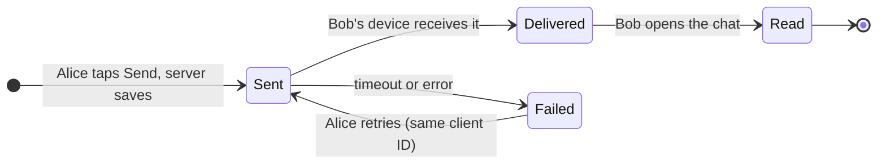
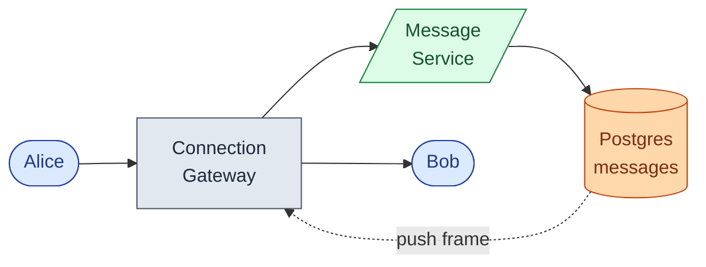
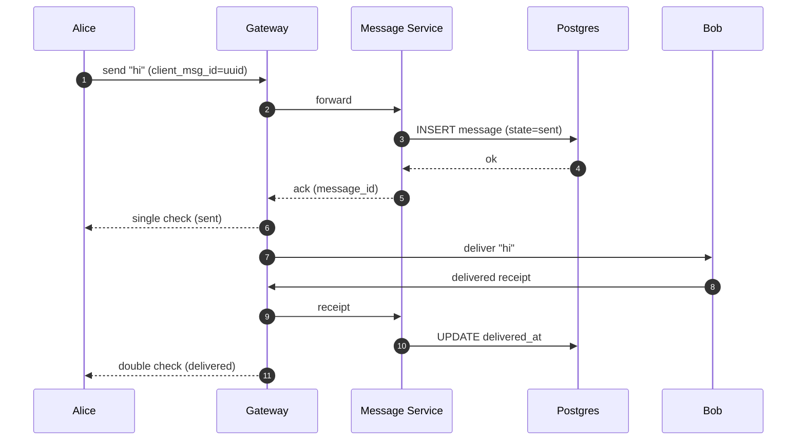
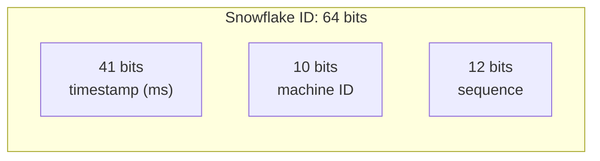
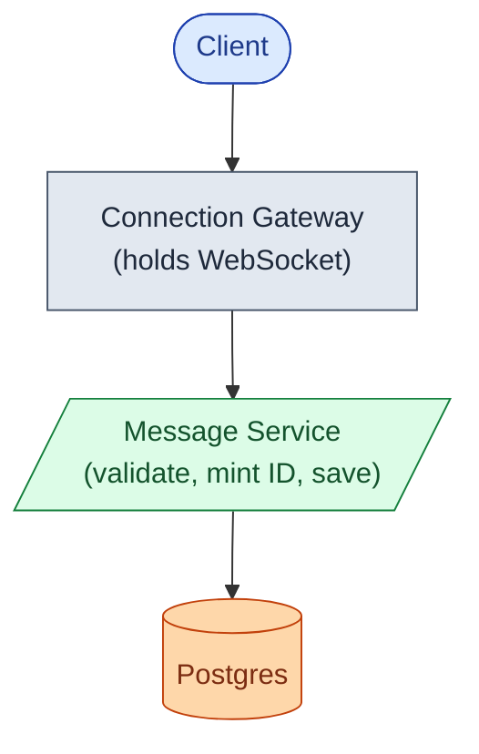
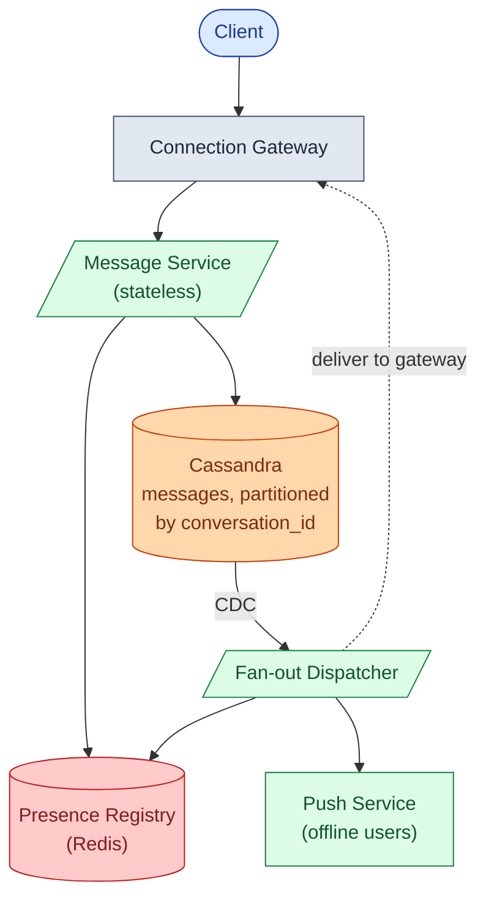
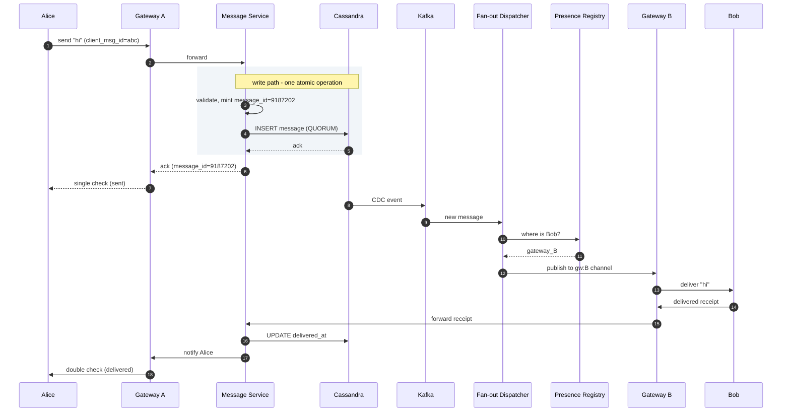
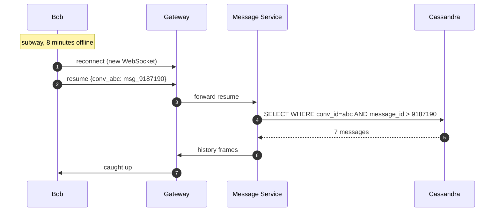

## The scene

You sit down. The interviewer used to work at WhatsApp.

> *"Last week I sent my wife a message saying I'd be late. She saw it immediately. Two blue ticks. She typed back before I finished putting my phone away."*
>
> *"That's one person sending to one person. Now design the thing that makes it work for a billion people at the same time. One-to-one and groups. Real-time. Mobile first."*

That is the question. It sounds like a simple inbox. It is not.

The word **real-time** is the first trap. If you start listing REST endpoints, you have already missed it. If you draw one box labeled "WebSocket server" and stop, you have missed the second trap.

Three things make chat hard:

1. Holding hundreds of millions of open connections simultaneously.
2. Keeping messages in the right order even when phones drop signal in the subway.
3. Delivering receipts cheaply when a group message to 1,000 people creates 1,400 events.

We will start with a tiny chat app for Alice and Bob. Then we add one pressure at a time and watch the design grow.

---

## Step 1: Picture one message

Before any architecture, just picture what sending a message **is**. Alice types. The server saves it. Bob sees it.



That is the whole product in one picture. Everything we add later (groups, receipts, presence, offline push) sits on top of this three-state machine.

> **Take this with you.** A chat system is a message moving through three states: Sent, Delivered, Read. The hard part is making each transition reliable at scale.

---

## Step 2: Ask the right questions

In a real interview, pause for two minutes. Write down what you want to ask. Not twenty questions. Five that change the design if answered differently.

<details markdown="1">
<summary><b>Show: 5 questions that change the design</b></summary>

1. **How many open connections at peak?** One billion daily users can mean 100 million or 500 million concurrent connections. That number drives the entire edge fleet size. Ask for it explicitly. *WhatsApp answer: 500 million open WebSockets at peak.*
2. **Groups: how big?** WhatsApp caps groups at 1,024. Slack channels can hit 10,000+. Group size decides whether fan-out fits in one fast loop or needs a dedicated worker pool. The receipt math changes dramatically.
3. **Do we show delivered and read receipts?** Receipts are 30x more events than messages in group chats. Knowing this upfront changes the schema, the storage, and the throughput plan.
4. **How long do we keep history?** WhatsApp keeps very little server-side. Slack keeps everything forever. This alone decides whether you need tiered cold storage or a simple delete-on-delivery model.
5. **End-to-end encrypted?** If yes, the server cannot read message bodies. That kills server-side search, changes push notification previews, and makes moderation purely metadata-based.

A strong candidate also asks the meta question: *"Is presence (online/offline) part of this, or a separate service?"* It should be separate. The engine emits events. The presence service maintains its own state.

</details>

---

## Step 3: How big is this thing?

Same product, two very different scales.

| Company | DAU | Peak connections | Messages/day | Groups |
|---------|-----|-----------------|--------------|--------|
| Startup | 10,000 | ~3,000 | ~500,000 | Small, <20 people |
| WhatsApp scale | 1 billion | 500 million | 100 billion | Up to 1,024 members |

<details markdown="1">
<summary><b>Show: how the numbers come out</b></summary>

**Messages per second (WhatsApp scale).**
- 100 billion / 86,400 seconds = ~1.16 million/second steady
- Peak is roughly 3x: ~3.5 million/second

**Receipt events per second.**
- Half the messages are 1-to-1: ~1.8 receipts per message (delivered + read)
- Half are group with ~50 people. About 80% online = ~39 delivered + ~31 read = ~70 receipts per message
- Weighted average: 0.5 × 1.8 + 0.5 × 70 = ~36 receipts per message
- Total events: 1.16M × (1 + 36) = ~43 million/second steady, ~130 million at peak

**Edge servers needed to hold connections.**
- 500M connections / 100K per server = 5,000 servers
- Add 30-40% spare for failures: 7,000-8,000 servers
- Each idle WebSocket uses ~10 KB of memory: 100K × 10 KB = ~1 GB per server. Fine.

**Storage for 1 year.**
- 100B/day × 365 = ~36 trillion messages
- ~350 bytes per message (200 content + 150 metadata) = ~12 PB raw
- With 3 replicas: ~36 PB

**The number that matters most.** Receipts beat messages 30 to 1. A 1,000-person group message creates 1 storage write and ~1,800 receipt events. Design the receipt path badly and the system melts on the first viral group.

</details>

> **Take this with you.** Receipts dominate the load. Raw message throughput is a distraction. Ask about groups and receipts before you draw a single box.

---

## Step 4: The smallest thing that works

Forget WhatsApp. We are building a chat app for Alice and Bob. 100 users. No groups yet.

Three boxes. One sequence diagram.



The end-to-end flow:



<details markdown="1">
<summary><b>Show: the two tables</b></summary>

```sql
CREATE TABLE messages (
    message_id      BIGINT PRIMARY KEY,
    conversation_id BIGINT NOT NULL,
    sender_id       BIGINT NOT NULL,
    client_msg_id   TEXT,
    body            TEXT,
    created_at      TIMESTAMPTZ DEFAULT NOW(),
    delivered_at    TIMESTAMPTZ,
    read_at         TIMESTAMPTZ
);

CREATE TABLE conversations (
    conversation_id BIGSERIAL PRIMARY KEY,
    member_a        BIGINT NOT NULL,
    member_b        BIGINT NOT NULL,
    created_at      TIMESTAMPTZ DEFAULT NOW()
);
```

This is enough for 100 users. The interesting part starts next.

</details>

> **Take this with you.** Always start here. The interview is about what you add next, and why.

---

## Step 5: The first crack

Alice sends a message. Bob is on the subway. His phone drops signal for 8 minutes.

You look at your code. When Bob reconnects, his phone asks: "Any new messages?" Your server scans the whole messages table. That is already slow at 10,000 users. At 100 million, it melts.

Also: the gateway is holding both Alice's and Bob's connections. What happens when that box restarts for a deploy? Both connections drop, and the server has no idea what Bob already has.

Two problems. Both solvable with one idea.

**Make the message ID a Snowflake.** Give every message a globally sortable ID. The client stores the last message_id it has seen, per conversation. On reconnect, it tells the server: *"I have everything up to message 9,187,201 in this chat."* The server returns only what's newer.



No coordinator. Each Message Service pod mints its own IDs. They still sort by time globally.

The second problem: the gateway cannot hold durable state. If it crashes, connections drop but no messages are lost, because everything durable lives in the database. The client just reconnects and runs the resume protocol.

> **Take this with you.** Gateways are stateful by necessity (they hold sockets), but they must hold no durable data. Crashes are routine at this scale. Design for it from the start.

---

## Step 6: Build the architecture, one layer at a time

We have a gateway, a message service, and a database. Now add layers only as real problems arrive.

### v1: just the core



Fine for 10,000 users.

### v2: we need to know who is online and where

Bob has a connection on Gateway 7. Alice has a connection on Gateway 2. When Alice sends a message, Gateway 2 must somehow push it to Gateway 7. They need a shared directory.

Add a **Presence Registry**: a Redis cluster mapping user_id to gateway_id.

```mermaid
flowchart TB
    C([Client]):::user --> GW["Connection Gateway"]:::edge
    GW --> MS[/"Message Service"/]:::app
    MS --> DB[("Postgres")]:::db
    MS --> PR[("Presence Registry<br/>(Redis)")]:::cache
    GW -.->|subscribe gw:{id}| PR

    classDef user fill:#dbeafe,stroke:#1e40af,color:#1e3a8a
    classDef edge fill:#e2e8f0,stroke:#475569,color:#1e293b
    classDef app fill:#dcfce7,stroke:#15803d,color:#14532d
    classDef db fill:#fed7aa,stroke:#c2410c,color:#7c2d12
    classDef cache fill:#fecaca,stroke:#b91c1c,color:#7f1d1d
```

### v3: Postgres cannot hold 100 billion messages, and groups need fan-out

Move messages to **Cassandra**, partitioned by `conversation_id`. All messages in one chat live on one node. Reading the last 50 is one fast range query.

Add a **Fan-out Dispatcher**: reads Cassandra's change stream, finds all members of the conversation, and sends each a delivery task. Separating fan-out from the write path means the send-ack latency no longer depends on group size.



### v4: receipts explode, and offline push needs its own path

A 1,000-person group creates 1,800 receipt events per message. Writing a row per event per member per message will overwhelm any database. And APNs/FCM have their own rate limits and rules: they cannot share the delivery path.

Add **Kafka** to buffer receipt events. Add **receipt counters** in Redis. The sender sees "delivered to 800/1,000" from a counter lookup, not a table scan.

```mermaid
flowchart TB
    subgraph Edge["Client edge"]
        C([Web / Mobile]):::user
        GW["Connection Gateway<br/>(stateful, 100K sockets/node)"]:::edge
    end

    subgraph WritePath["Write path (synchronous)"]
        MS[/"Message Service<br/>(stateless pods)"/]:::app
        Pg[("Postgres<br/>conversations · members")]:::db
    end

    Cass[("Cassandra<br/>messages · group_receipts")]:::db

    subgraph FanOut["Async fan-out"]
        FD[/"Fan-out Dispatcher<br/>(Kafka consumer)"/]:::app
        DW[/"Delivery Workers"/]:::app
    end

    PR[("Presence Registry<br/>(Redis)")]:::cache
    RC[("Receipt Counters<br/>(Redis)")]:::cache
    K{{"Kafka<br/>msg.new · receipt.*"}}:::queue
    Push["Push Service<br/>(APNs / FCM)"]:::ext

    C --> GW
    GW -->|send frame| MS
    MS --> Cass
    MS --> Pg
    MS -.->|ack| GW
    Cass -->|CDC| K
    K --> FD
    FD --> PR
    FD --> DW
    FD --> Push
    DW --> RC
    DW -.->|publish gw:{id}| GW
    GW -->|receipt frame| MS
    MS --> RC

    classDef user fill:#dbeafe,stroke:#1e40af,color:#1e3a8a
    classDef edge fill:#e2e8f0,stroke:#475569,color:#1e293b
    classDef app fill:#dcfce7,stroke:#15803d,color:#14532d
    classDef db fill:#fed7aa,stroke:#c2410c,color:#7c2d12
    classDef cache fill:#fecaca,stroke:#b91c1c,color:#7f1d1d
    classDef queue fill:#ddd6fe,stroke:#6d28d9,color:#4c1d95
    classDef ext fill:#e9d5ff,stroke:#7e22ce,color:#581c87
```

Each box, in one line:

| Box | What it does |
|-----|--------------|
| **Connection Gateway** | Holds the WebSocket. Stateful but no durable data. Safe to crash. |
| **Message Service** | Validates, mints Snowflake ID, writes to Cassandra. Stateless. |
| **Cassandra** | The message log. Partitioned by `conversation_id`. RF=3, QUORUM writes. |
| **Kafka** | Buffers the CDC stream. Backpressure builds here if fan-out falls behind. |
| **Fan-out Dispatcher** | Reads new messages. Finds members. Routes online vs. offline. |
| **Delivery Workers** | Publish to per-gateway Redis channels. Receipt counters live here too. |
| **Presence Registry** | Redis. Maps user_id to gateway_id. Also online/idle/offline state. |
| **Push Service** | Talks to APNs and FCM. Separate from the real-time path on purpose. |

> **Take this with you.** If the Push Service dies at 3 a.m., online users still get messages instantly. Offline users queue up and get notified when the service recovers. Separate the paths.

---

## Step 7: One message, all the way through

Alice sends "hi" to Bob. Both are online on different gateways.



Three things worth pointing at:

1. The Cassandra write happens before the ack. Alice's single check means *"the server has your message."* Not "Bob got it."
2. Kafka is written after Cassandra via CDC. Fan-out is completely async. Send latency does not grow with group size.
3. The gateway holds no durable state. If Gateway A crashes after step 6, Alice reconnects, sends a `resume` frame, and catches up. No message is lost.

---

## Step 8: When the phone drops signal

Bob goes into the subway at 9:03. His WebSocket dies. He comes out at 9:11. He missed 20 messages across 4 chats.

The naive fix is a per-user inbox queue on the server. At 500 million users that is enormous state to maintain. There is a simpler way.

**The resume protocol.** The client stores the last `message_id` it has received, per conversation. On reconnect, it sends one frame:

```
resume: {
  conv_abc: msg_9187190,
  conv_xyz: msg_8800041
}
```

The server queries Cassandra for each conversation: *"give me messages with `message_id > last_seen`."* Cap at 1,000 messages or 7 days. Returns them as `history` frames. The client renders them in order.



Most reconnects find 0-3 missed messages. They complete in under 100ms. Bob notices nothing.

> **Take this with you.** The client tracks what it has. The server fills the gap. No per-user delivery queue. No massive server-side state. Cassandra reads are cheap because the partition is already by `conversation_id`.

---

## Step 9: The receipt problem in groups

A message goes to a group of 1,000 people. 800 are online. Each device says "delivered." 640 open the chat and say "read." That is 1,440 events from one message.

How do you store it? How do you show the sender "delivered to 800/1,000" without a table scan?

**For 1-to-1 chats.** Store `delivered_at` and `read_at` on the message row. One row. Done.

**For groups.** A separate table with a 90-day TTL:

<details markdown="1">
<summary><b>Show: the group_receipts table</b></summary>

```sql
CREATE TABLE group_receipts (
    conversation_id  TEXT,
    message_id       BIGINT,
    member_id        BIGINT,
    state            SMALLINT,      -- 1=delivered, 2=read
    state_ts         TIMESTAMP,
    PRIMARY KEY ((conversation_id, message_id), member_id)
) WITH default_time_to_live = 7776000;   -- 90 days
```

Nobody asks "who read this 6 months ago?" Cassandra deletes expired rows automatically.

</details>

Three tricks that make receipts affordable:

1. **Batch receipts.** The phone sends "delivered up to message_id X" once per second, not once per message. One event covers many messages.
2. **Counter in Redis for the sender's UI.** The sender wants two numbers, not a list of 800 names:
   ```
   receipts:{conv_id}:{msg_id}  ->  { delivered: 800, read: 640 }
   ```
   One Redis GET. No scan.
3. **Drop "delivered" in large groups.** WhatsApp skips "delivered" in groups over 256 members. Only "sent" and "read" are shown. That alone cuts receipt volume roughly in half.

> **Take this with you.** Receipts are the busiest pipe in the system. Batch them, counter them, and drop them when they don't add user value.

---

## Step 10: Four features, one engine

Same architecture. Four real features. Each stresses something different.

| Feature | The user-visible behavior | What it stresses | The key decision |
|---------|--------------------------|-----------------|-----------------|
| **Typing indicator** | "Alice is typing..." | Fire-and-forget. Never stored. | Flows gateway to fan-out to recipient gateway. No Cassandra write. Auto-expires after 5s without refresh. Skip in large groups. |
| **Presence** | Green dot means online | 300K events/second at WhatsApp scale | Redis only. Subscriber model: only subscribe to contacts visible on screen. Coarse 5-minute idle window to stop flickering. |
| **Multi-device** | Read on phone, badge clears on laptop | Session model | Session Registry stores per-device entries. Fan-out emits one delivery task per session. Receipt sync sends a `state_change` frame to sibling sessions. |
| **End-to-end encryption** | Server cannot read body | Search, push previews, moderation | Body is a ciphertext blob. Server routes by metadata. Push says "new message from Alice," not the content. No server-side search. |

---

## Follow-up questions

Try answering each in 2 or 3 sentences before reading the solution.

1. **Reconnect after 30 minutes offline.** A user goes offline mid-conversation. Comes back 30 minutes later. How does the client catch up without re-downloading the full history?

2. **A bot in a big group.** A group has 1,000 members. One member is a bot sending a message every 5 seconds. What strain does this put on the system? How do you protect against it?

3. **Presence at scale.** Every user has 200 contacts and toggles online/offline often. What is the total fan-out? Where is presence stored? Why not in Cassandra?

4. **Typing indicators.** How are they delivered? Are they stored anywhere? What happens if the user closes the app while typing?

5. **Multi-device sync.** A user has a phone and a laptop both logged in. How does reading a message on the phone remove the unread badge on the laptop?

6. **End-to-end encryption.** If messages are E2E-encrypted, the server cannot see them. How does that affect search, push previews, and group fan-out?

7. **Gateway crash.** A gateway holding 100K connections crashes. What happens to those clients? How fast do they recover?

8. **New device bootstrap.** A user logs in on a new phone. They have 500 chats and 10 years of history. How do you bootstrap them without sending gigabytes?

9. **Spam detection.** A user is mass-DMing strangers. How do you detect and rate-limit them without blocking legitimate business accounts?

10. **Delivery lag spikes in one region.** At 3am, message delivery lag in one region spikes to 30 seconds. The message store metrics look fine. Where do you look first?

---

## Related problems

- **[News Feed (002)](../002-news-feed/question.md).** Same fan-out patterns. A group chat is fan-out-on-write to a small audience. The write-heavy fan-out tradeoffs are identical.
- **[Notification System (010)](../010-notification-system/question.md).** The push path here (APNs/FCM) uses the same offline delivery machinery. The quiet-hours and preference logic lives there.
- **[Distributed Cache (009)](../009-distributed-cache/question.md).** The presence registry and receipt counters are Redis. Knowing its eviction and failure modes matters here.
