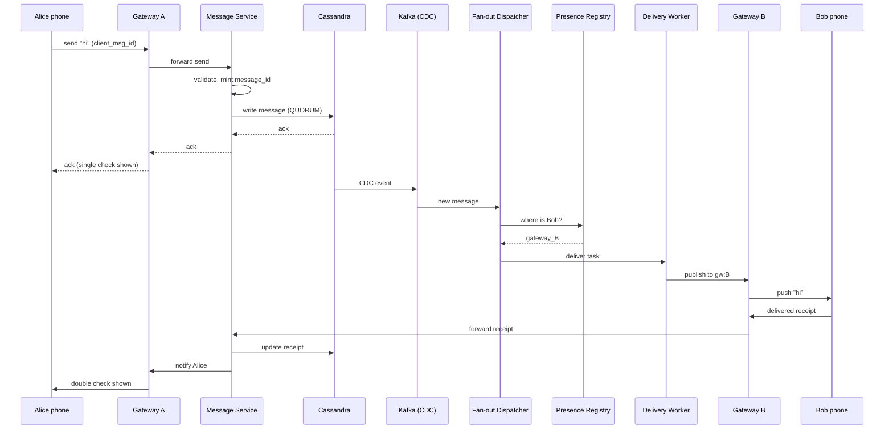
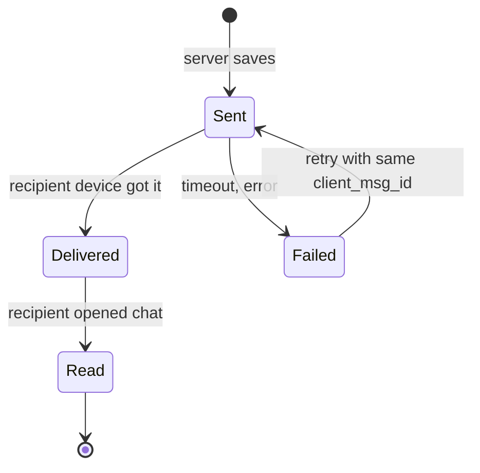
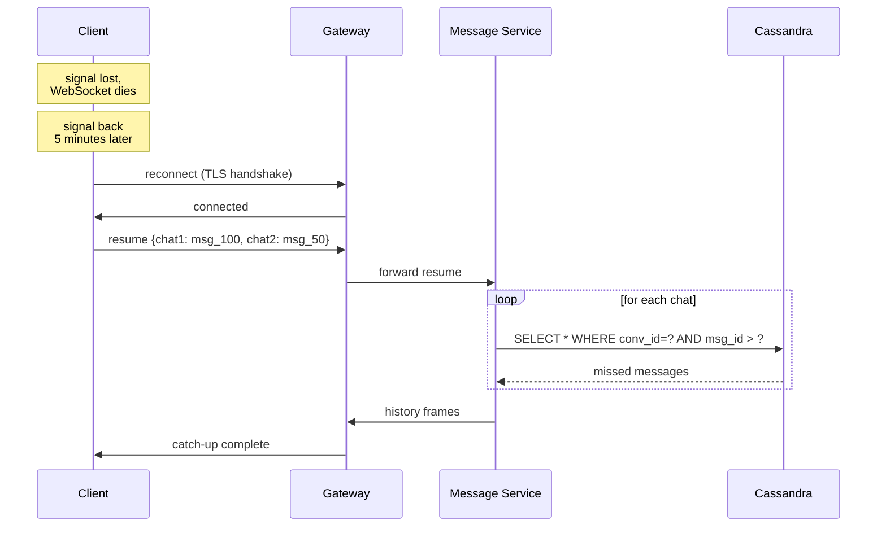

## The scene

You sit down. The interviewer used to work at WhatsApp. Then Slack. They open with one line:

> *"Design a chat system. One-to-one chats and group chats. Real-time. Mobile is the main client. Go."*

It looks simple. It is not. The trap is the word "real-time." If you start by listing REST endpoints, you have already missed the point. If you draw one box called "WebSocket server" and stop, you missed the other point.

Two things make chat hard:

1. Holding open hundreds of millions of network connections at the same time.
2. Keeping messages in the right order even when phones lose signal every few minutes.

We will walk this from a tiny chat app for 100 users to a system that holds 500 million open connections. At each step we will name what breaks first, then add the smallest fix.

---

## Step 1: Ask the right questions

Before you draw anything, sit for 5 minutes. Write down the questions you would ask the interviewer.

A good answer is not "ask 20 questions about every edge case." It is the small set of questions that change the design if answered differently.

<details markdown="1">
<summary><b>Show: 8 questions that matter</b></summary>

1. **How many users? How many open connections at peak?** *(WhatsApp answer: 1 billion daily users, 500 million open connections at peak. The connection count drives the whole edge fleet size.)*
2. **One-to-one only, or groups too? How big can groups get?** *(WhatsApp caps groups at 1024. Slack channels can hit 10,000+. Group size decides if fan-out fits in one transaction or needs a worker pool.)*
3. **What order guarantees do we need?** *(Most chat apps promise: messages from the same sender stay in order. They do not promise a strict global order. That difference saves you from needing distributed consensus on every message.)*
4. **Do we show sent / delivered / read?** *(Receipts triple the load in groups. One message to 1000 people creates 1000 "delivered" events. Receipts are the real workload, not messages.)*
5. **Do we show online / typing / last-seen?** *(Presence is its own beast. High update rate, low durability, different audience.)*
6. **History on the server? How long?** *(WhatsApp keeps little server-side. Slack keeps everything forever. This decides your storage tier.)*
7. **End-to-end encryption?** *(If yes, the server cannot read messages. That limits search, notifications, and moderation.)*
8. **Push notifications when offline?** *(Apple APNs and Google FCM have their own rules. They are part of the design.)*

> **Why these matter most.** Asking just "how many users?" misses the questions that actually shape the system. Concurrent connections, group size, and receipts together drive 80% of the architecture.

</details>

---

## Step 2: How big is this thing?

Same problem, two scales. Do the math.

**Inputs from the interviewer (enterprise scale):**

- 1 billion daily active users
- 500 million WebSocket connections open at peak (a WebSocket is a long-lived two-way connection)
- 100 billion messages per day
- Half the messages go to groups. Average group has 50 people. Biggest group has 1000.
- Each message creates one "delivered" event from each online recipient. 80% of recipients open and read it.
- Average message is 200 bytes
- Keep history for 1 year, searchable

Compute four things on paper, then peek.

<details markdown="1">
<summary><b>Show: the math</b></summary>

**Messages per second.**

- 100B / 86,400 seconds = ~1.16M messages/second steady
- Peak is about 3x = ~3.5M messages/second

**Total events per second (messages + receipts).**

- Half the messages are 1-to-1: 1 delivered + 0.8 read = ~1.8 receipts per message
- Half are group messages with ~49 other people. About 80% are online. So ~39 delivered + ~31 read = ~70 receipts per group message
- Weighted average: 0.5 x 1.8 + 0.5 x 70 = ~36 receipts per message
- Total events: 1.16M x (1 + 36) = ~43M events/second steady, ~130M peak

> **Receipts dominate.** This is the first non-obvious insight. A group message of 1000 people creates 1 write to the message store and ~1800 receipt events. If you treat each receipt like a real message, you store 36 PB/year instead of 12.

**Edge servers (the boxes holding open connections).**

- 500M connections / 100K per server = 5,000 servers
- Add 30-40% spare = 7,000-8,000 servers
- Each connection uses ~10 KB of memory. 100K x 10 KB = ~1 GB per server. Trivial.

**Storage for 1 year.**

- 100B/day x 365 = 36.5 trillion messages
- 350 bytes per message (200 content + ~150 metadata) = ~12 PB/year
- Need 3 copies for safety = ~36 PB

**Outbound bandwidth at peak.**

- 3.5M messages x 36 fan-out x ~300 bytes = ~38 GB/second
- Spread across 7,000 servers = ~5 MB/second per server. Trivial.

> **What the math tells you.** Receipts beat messages 30 to 1. Connection count drives the server fleet. Group size drives the fan-out cost. None of it is about raw message throughput.

</details>

---

## Step 3: How do messages reach phones?

Phones need to receive messages without asking the server "any new messages?" every second. There are three ways to do this. Think about each one before peeking.

| Way | How it works |
|---|---|
| **Short polling** | Phone asks "any new messages?" every 5 seconds |
| **Long polling** | Phone asks "any new messages?" Server waits up to 30 seconds before answering |
| **WebSocket** | One always-open connection. Server pushes messages instantly |

Which one wins for chat at 500M users? Why?

<details markdown="1">
<summary><b>Show: why WebSocket wins</b></summary>

> **Why not short polling?** With 500M users polling every 5 seconds, that is 100 million requests per second hitting your servers. Almost all of them get back "nothing new." That is a huge waste of CPU, bandwidth, and battery.

> **Why not long polling?** Better, but the server still holds the connection open. You get all the cost of WebSocket without the two-way push benefit. Also, every message takes a round trip: phone asks, server waits, server answers, phone asks again.

> **Why WebSocket wins.** One always-open connection per user. Server pushes messages the moment they arrive. The same connection sends receipts back. No wasted polling. An idle WebSocket on Linux costs ~10 KB of memory. Cheap.

**The trade-off.** WebSockets are stateful. Each one lives on a specific server. If that server dies, every connection on it drops. Phones drop signal often (subway, elevator, plane). So you need:

- A way for the phone to reconnect fast
- A way to catch up on messages missed during the drop
- A way to route the phone back to the same logical place each time

Use WebSocket as the main transport. Fall back to plain HTTPS only when WebSocket is blocked (some corporate networks block the upgrade).

</details>

---

## Step 4: Draw the system

You know phones use WebSockets. Now draw the boxes behind them.

Try to fill in the missing pieces below. Eight boxes are missing. Think about: where the WebSocket lands, who validates the message, where messages get stored, how the system knows which other users are online and where, and how offline users get a push notification.

```
            Phone (iOS, Android, web)
                       |
                       | WebSocket over TLS
                       v
              +-----------------+
              |   [ ? ]         |   holds 100K connections per node,
              |   (stateful)    |   pushes messages out
              +----+--------+---+
                   |        |
        send       |        |    receive (from other gateways)
                   |        |
                   v        ^
              +-----------------+
              |   [ ? ]         |   validates, assigns message ID,
              |   (stateless)   |   saves to storage
              +--------+--------+
                       |
                       v
              +-----------------+      +------------------+
              |   [ ? ]         | ---> |   [ ? ]          |
              |   (durable      | CDC  |   (decides who   |
              |    storage)     |      |    needs this    |
              |                 |      |    message)      |
              +-----------------+      +-------+----------+
                                               |
                       +-----------------------+---------------------+
                       |                       |                     |
                       v                       v                     v
              +----------------+      +----------------+    +----------------+
              |   [ ? ]        |      |   [ ? ]        |    |  APNs / FCM    |
              |   (knows which |      |   (sends to    |    |  (push for     |
              |    gateway     |      |    online      |    |   offline      |
              |    each user   |      |    users)      |    |   users)       |
              |    is on)      |      |                |    |                |
              +----------------+      +----------------+    +----------------+
```

<details markdown="1">
<summary><b>Show: the full architecture</b></summary>

```
            Phone (iOS, Android, web)
                       |
                       | WebSocket over TLS
                       v
              +---------------------+
              | Connection Gateway  |   holds 100K connections per node,
              | (stateful edge)     |   pushes messages out
              +----+-----------+----+
                   |           |
        send       |           |    receive (from other gateways)
                   |           |
                   v           ^
              +---------------------+
              | Message Service     |   validates, mints message_id,
              | (stateless)         |   saves to Cassandra, sends ack
              +----------+----------+
                         |
                         v
              +---------------------+    +----------------------+
              | Cassandra (sharded  |--->| Fan-out Dispatcher   |
              | by conversation_id) |CDC | (reads new messages, |
              |                     |    |  finds recipients)   |
              +---------------------+    +-----+----------------+
                                               |
              +--------------------------------+----------------+
              |                                |                |
              v                                v                v
        +----------------+         +----------------+    +----------------+
        | Presence /     |         | Delivery       |    | Push Service   |
        | Session        |         | Workers        |    | (APNs for iOS, |
        | Registry       |         |                |    |  FCM for       |
        |                |         | Sends to       |    |  Android)      |
        | Redis: maps    |         | online users   |    |                |
        | user_id ->     |         | via pub/sub    |    | For offline    |
        | gateway_id     |         | to their       |    | users          |
        |                |         | gateway        |    |                |
        +----------------+         +----------------+    +----------------+
```

What each piece does in one line:

- **Connection Gateway.** The edge server. Holds the open WebSocket. Knows nothing else. Stateless except for the live socket. If it dies, phones reconnect to a new one.
- **Message Service.** The brain. Validates the message, gives it an ID, saves it. Stateless. Scales by adding more pods.
- **Cassandra.** The message store. Sharded (split) by conversation_id, so all messages in one chat live on one node. Reading the last 50 messages of a chat is one fast query.
- **Fan-out Dispatcher.** Reads new messages from Cassandra's change stream. Looks up who is in the conversation. Sends each one a delivery task.
- **Presence / Session Registry.** A small Redis cluster. Knows which user is on which gateway right now. Also tracks online/idle/offline.
- **Delivery Workers.** Take a delivery task. Look up the user's gateway. Publish the message to that gateway's channel.
- **Push Service.** For users with the app closed. Talks to Apple (APNs) and Google (FCM). Sends a push notification so the user knows to open the app.

> **Why pub/sub between Delivery Workers and Gateways?** The worker does not know directly which socket the user is on. The gateway is the only place that knows for sure. Publishing to a gateway channel lets the gateway decide if the socket is alive. If the user moved to a different gateway, the old one drops the event. The user's reconnect protocol catches them up later.

</details>

---

## Step 5: The send-message flow

A user named Alice sends "hi" to Bob. Both are online. Trace it step by step. What happens between Alice pressing Send and Bob seeing the message?

<details markdown="1">
<summary><b>Show: the full path with diagram</b></summary>



Step by step:

1. Alice's phone sends a frame over the WebSocket: `{type: send, client_msg_id: uuid, body: "hi"}`. The `client_msg_id` is for safety. If the phone retries after a network blip, the server uses this ID to skip the duplicate.
2. Gateway A forwards to the Message Service.
3. Message Service does five things: checks Alice is allowed to send to this chat, mints a `message_id` (Snowflake style, sortable by time), saves to Cassandra, and sends back an ack.
4. Alice's UI shows a single check (sent).
5. Cassandra emits a CDC event (CDC = "change data capture", a stream of every row change). The Fan-out Dispatcher reads it.
6. Dispatcher asks the Presence Registry: where is Bob? Answer: Gateway B.
7. Dispatcher creates a delivery task. A Delivery Worker publishes to Gateway B's channel.
8. Gateway B sees the event. It finds Bob's live socket. It writes the message frame.
9. Bob's phone receives "hi". It sends back a "delivered" receipt (batched with other recent receipts to save bandwidth).
10. The receipt flows back the same way. Alice's UI updates to show double check (delivered).
11. Bob opens the chat. His phone sends a "read" receipt. Alice sees double check turn blue.

> **Why a separate ack and delivery path?** Sender's ack means "the server has your message safe." Delivery means "the other person's device got it." Read means "they opened it." Three states, three events. Users want all three.

> **Why client_msg_id?** Phones lose signal mid-send all the time. The phone retries. Without an ID, the server might save the same message twice. With it, the server says "already saved, here's the message_id again."

</details>

---

## Step 6: Keeping messages in order

A user types fast: "hi", "are you there", "ok bye". On the other phone, they must appear in that order. Even if the network reorders. Even if the phone retries.

What if Alice and Bob are typing at the same time in a group? What order does everyone see?

<details markdown="1">
<summary><b>Show: ordering rules and how to make them work</b></summary>

**The rules chat apps actually promise:**

1. **Same sender stays in order.** Alice's three messages appear in the order Alice sent them. Always.
2. **Same view for everyone in a conversation.** If Alice and Bob both send at nearly the same time, the server picks an order. Every viewer sees the same order. Nobody tries to enforce a specific cross-sender order.
3. **No order across different chats.** Messages in chat X and chat Y are independent.

**How to make it work:**

The `message_id` is the canonical order. It is a Snowflake ID:

```
| 41 bits timestamp (ms) | 10 bits machine ID | 12 bits sequence |
```

- Time-prefixed, so newer messages have bigger IDs
- Globally unique without needing a coordinator
- Sortable, so recipients sort by message_id when displaying

> **Why Snowflake and not a database auto-increment?** Auto-increment needs a single source. At 3.5M messages/second across many regions, that source becomes the bottleneck. Snowflake lets each Message Service instance mint IDs without talking to anyone, and the IDs still sort by time.

**FIFO per sender, enforced in the engine.** Each client has a counter (`client_seq`) that goes up per conversation. The Message Service tracks the last seen `client_seq` for (sender, conversation). If a new send has a smaller or equal seq, reject it. The client refreshes and retries.

**What you do NOT need:**

- Vector clocks (overkill, users do not notice 1ms reorderings)
- Distributed consensus per message (slow, expensive)
- Lamport timestamps (the Snowflake already gives you time ordering)

> **Common trap.** Junior candidates try to design Paxos for chat ordering. The interviewer lets you. Then asks: "what does the user see if order breaks by 1ms on a 50-message screen?" Answer: nothing. Match the engineering to the user-visible problem.



</details>

---

## Step 7: The receipt problem (groups are expensive)

A message goes to a group of 1000 people. 800 are online. Each one's phone says "delivered." 600 open the chat and say "read." That is 1400 events from one message.

How do you store that? How do you show the sender "delivered to 800 out of 1000"?

<details markdown="1">
<summary><b>Show: the receipt model</b></summary>

**For 1-to-1 chats.** Store sent_at, delivered_at, and read_at on the message row itself. One row covers everything.

**For group chats.** A new table:

```sql
CREATE TABLE group_receipts (
    conversation_id  TEXT,
    message_id       BIGINT,
    member_id        BIGINT,
    state            SMALLINT,    -- 1=delivered, 2=read
    state_ts         TIMESTAMP,
    PRIMARY KEY ((conversation_id, message_id), member_id)
) WITH default_time_to_live = 7776000;   -- 90 days
```

One row per (message, member). At 1000 members per message, that table grows fast.

**Three tricks to make it affordable:**

1. **Batch receipts.** The phone does not send one receipt per message. Every 1-2 seconds it sends "everything up to message_id X is delivered." One event covers many messages. Saves bandwidth and database writes.

2. **TTL the table.** After 90 days, nobody cares who read what. Cassandra deletes the rows for free.

3. **Drop "delivered" in huge groups.** In WhatsApp groups over 256 members, only "sent" and "read" are shown. "Delivered" is skipped. That alone cuts receipt volume in half.

**Showing "delivered to 800/1000" without scanning 800 rows.**

Maintain a counter in Redis:

```
Key:   receipts:{conv_id}:{msg_id}
Value: hash { delivered: 800, read: 600 }
TTL:   90 days
```

The Delivery Worker bumps this counter as receipts come in. The sender's UI shows the counter. Reading is one Redis get. No scan.

> **Why a counter instead of a list?** The sender wants two numbers, not 1000 names with checkmarks. The counter answers the question in O(1). The list is only used when the user taps "see who read this," which is rare.

</details>

---

## Step 8: What happens when the phone drops signal?

This is the hard part of mobile chat. A user goes into a subway tunnel. WebSocket dies. 5 minutes later they come out. New connection. They might have missed 20 messages from 5 different chats.

How do they catch up without re-downloading their whole history?

<details markdown="1">
<summary><b>Show: the reconnect-with-resume protocol</b></summary>

The trick is the client remembers what it has. On reconnect, it tells the server "I have everything up to here in each chat. What did I miss?"



**The protocol:**

1. Phone connects WebSocket. Sends a `resume` frame with the last message_id it has per conversation.
2. Server reads Cassandra: "give me messages with `message_id > last_seen` per conversation." Cap at 1000 messages or 7 days.
3. Server sends them back as `history` frames over the WebSocket.
4. If the gap is too big (more than 1000 missed messages), server says "too old." The phone falls back to the REST history API and pages through.

**Most reconnects find 0-2 missed messages.** They resume in under 100ms. The user does not notice anything.

> **Why client-side state instead of a server-side queue?** Some designs maintain a per-user inbox queue. At 500M users that is a huge state to keep current. Letting the client track what it has and asking the server to fill the gap is simpler and just as correct. Cassandra reads are cheap (one partition).

> **Why does this work even if the gateway crashes?** The gateway has no durable state. Everything that matters is in Cassandra, Postgres, or Redis. A gateway crash drops 100K connections. They reconnect to other gateways within seconds. No message is ever lost.

</details>

---

## Step 9: Online users vs offline users

A message goes out. Some recipients have the app open (online). Some have it closed (offline). They need different paths.

**Online users.** The system finds their gateway and pushes through the WebSocket. Instant.

**Offline users.** No socket. The system sends a push notification through Apple APNs (iOS) or Google FCM (Android). The phone shows a notification banner. The user taps it. The app opens. The resume protocol catches them up.

<details markdown="1">
<summary><b>Show: the push path and why it is separate</b></summary>

```
Message Service writes to Cassandra
         |
         v
   Fan-out Dispatcher
         |
         +---- for each recipient ----+
         |                            |
   is user online?                  is user offline?
         |                            |
         v                            v
   Delivery Worker             Push Service
   (publish to gateway)        (call APNs / FCM)
         |                            |
         v                            v
   live WebSocket              notification banner
```

Why two paths:

1. **APNs and FCM have their own rules.** They batch. They rate-limit. They sometimes drop messages. You cannot treat them like an internal queue.
2. **Push is best-effort.** If the provider is down for an hour, you do not buffer pushes. The user opens the app and resume catches them up.
3. **Push payload is small.** Some apps send the message body in the push. End-to-end encrypted apps send only "new message from X" because the server cannot decrypt the body.
4. **Token management is its own problem.** Each device has a push token. Tokens expire. Users uninstall. The Push Service maintains the token registry and cleans up dead ones.

> **Why not just rely on push?** Push is slow (1-5 seconds) and unreliable (occasional drops). The WebSocket path is fast (under 500ms) and direct. Use WebSocket when you can. Use push when you must.

</details>

---

## Follow-up questions

Try answering each in 2 or 3 sentences before opening the solution.

1. **Catch-up after a 30-minute drop.** A user goes offline mid-conversation, comes back 30 minutes later. How does the client catch up without re-downloading everything?

2. **A chatty bot.** A group has 1000 members. One member is a bot sending a message every 5 seconds. What strain does this put on the system? How do you protect against it?

3. **Presence at scale.** Every user has 200 contacts and toggles online/offline often. What is the fan-out? Where is presence stored?

4. **Typing indicators.** How do you deliver these? Are they saved anywhere? What happens if the user closes the app while typing?

5. **Multi-device sync.** A user has a phone and a laptop both logged in. How do you make a message read on the phone disappear from the unread badge on the laptop?

6. **End-to-end encryption.** If messages are E2E-encrypted, the server cannot see them. How does that affect search, push previews, and group fan-out?

7. **Gateway crash.** A gateway holding 100K WebSocket connections crashes. What happens to those clients? How fast do they recover?

8. **New device bootstrap.** A user logs in on a new phone. They have 500 chats and 10 years of history. How do you bootstrap them without sending gigabytes?

9. **Spam detection.** A user is mass-DMing strangers. How do you detect and rate-limit them without blocking legitimate business accounts?

10. **Sudden lag in one region.** At 3am, message delivery lag in one region spikes to 30 seconds. The message store metrics look fine. Where do you look first?

---

## Related problems

- **[News Feed (002)](../002-news-feed/question.md).** Same fan-out patterns. A group chat is fan-out-on-write with a small audience.
- **[Notification System (010)](../010-notification-system/question.md).** The push notification path here uses the same machinery for offline users.
- **[Distributed Cache (009)](../009-distributed-cache/question.md).** The presence registry and receipt counters lean on Redis. Knowing its limits matters.
