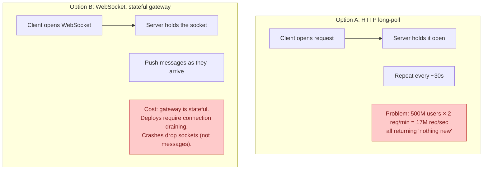
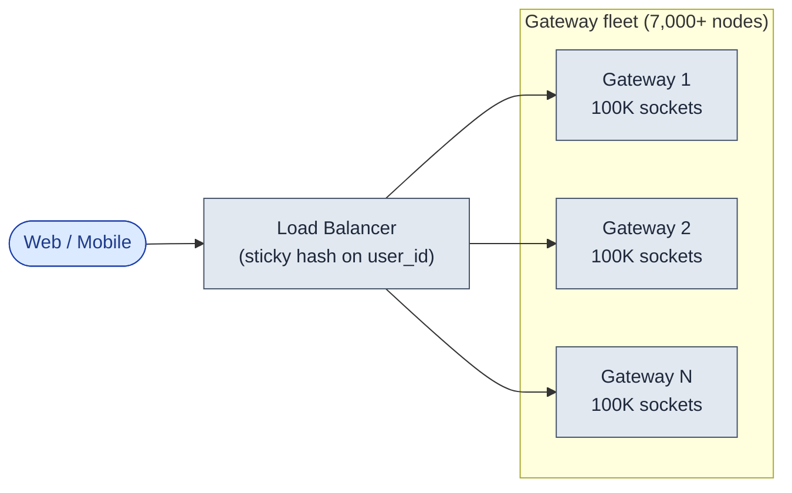
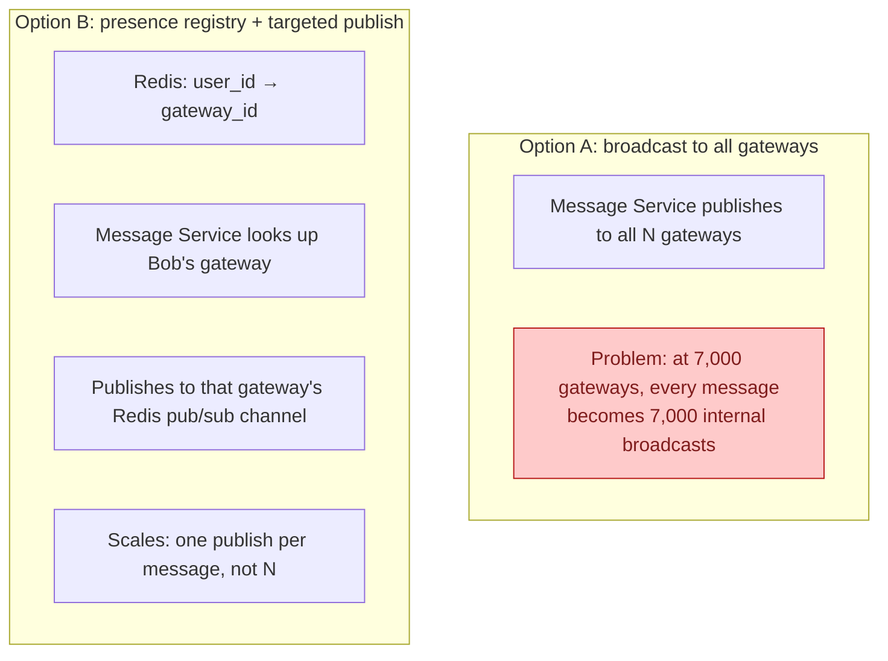
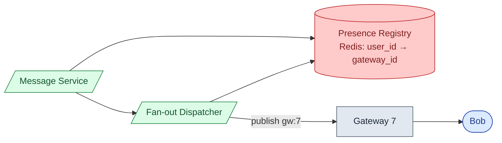
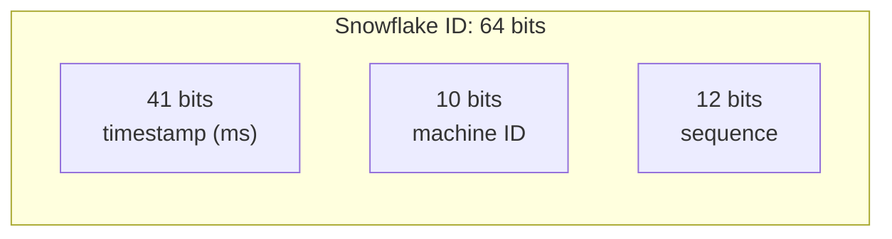
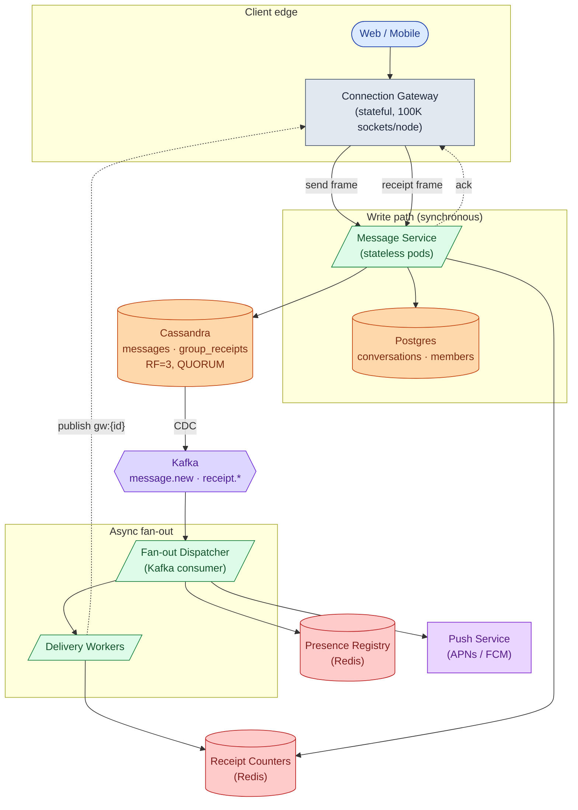
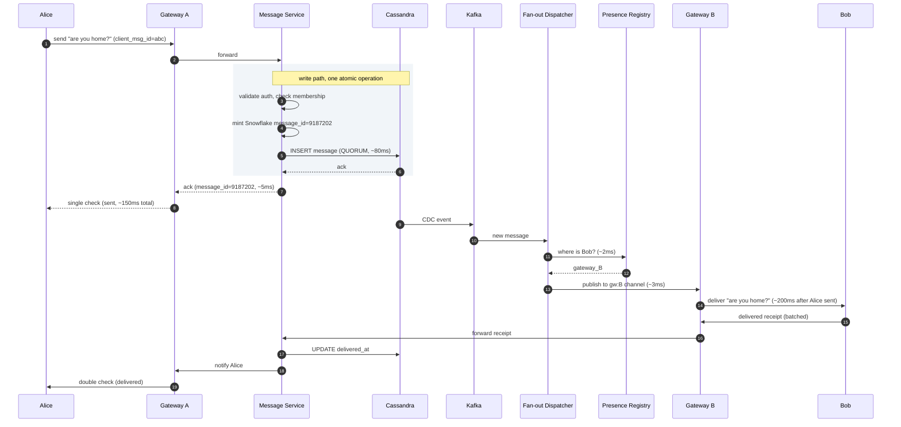
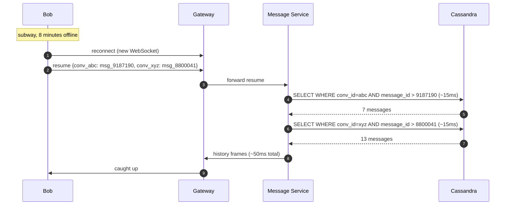
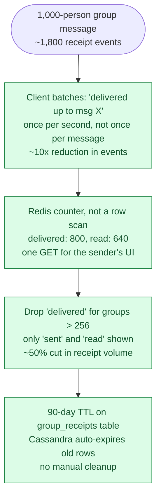

## What we are building

A chat system lets people send messages to each other in real time. Alice opens WhatsApp, types "are you home?", and taps send. Bob's phone buzzes a second later. He types back before Alice puts her phone down. Two blue ticks appear on Alice's screen.

That is the whole product. It sounds like a simple inbox. It is not.

There are four real problems hiding in this product:

1. **How do we hold open connections for hundreds of millions of phones at once?** A WebSocket is not free. At WhatsApp scale, 500 million open connections is the constraint that drives the entire edge fleet size.
2. **How do messages stay in order when phones drop signal?** Bob goes into the subway mid-conversation. Eight minutes later he resurfaces. His phone needs to catch up without the server tracking exactly what every device has.
3. **How do receipts scale in groups?** One message to a 1,000-person group creates roughly 1,800 "delivered" and "read" events. Design the receipt path carelessly and the system melts on the first popular group.
4. **How do offline users get notified?** APNs and FCM have their own rate limits and failure modes. The push path cannot share infrastructure with the real-time path.

We will start with the two-person version. Then we add one pressure at a time.

---

## The lifecycle of one message

Every message goes through a small set of states. Picture it before drawing any boxes.


A message spends most of its life in `Sent` or `Delivered`, waiting for the other person to look at their phone. Everything else (groups, receipts, presence, push) sits on top of this three-state machine.

> **Take this with you.** A chat system moves messages through three states: Sent, Delivered, Read. The hard part is making each transition reliable when the network is unreliable and the group is large.

---

## How big this gets

Same product, two very different scales.

| Input | Startup | WhatsApp scale |
|-------|---------|---------------|
| Daily active users | 10,000 | 1 billion |
| Peak concurrent connections | ~3,000 | 500 million |
| Messages per day | ~500,000 | 100 billion |
| Max group size | 20 | 1,024 |

<details markdown="1">
<summary><b>Show: the derived numbers</b></summary>

**Messages per second (WhatsApp scale).**
- 100 billion / 86,400 = ~1.16 million/second steady
- Peak is ~3x: ~3.5 million/second

**Receipt events per second.**
- Half the messages are 1-to-1: ~1.8 receipts per message (delivered + read)
- Half are group with ~50 members, 80% online: ~70 receipts per message
- Weighted average: 0.5 × 1.8 + 0.5 × 70 = ~36 receipts per message
- Total events/second: 1.16M × (1 + 36) = ~43 million/second steady, ~130 million at peak

**Edge gateway servers needed.**
- 500M connections / 100K per server = 5,000 servers
- Add 30-40% spare for failures: 7,000-8,000 servers
- Memory per server: 100K connections × 10 KB each = ~1 GB. Acceptable.

**Storage for 1 year.**
- 100B messages/day × 365 = ~36 trillion messages
- ~350 bytes per message (200 content + 150 metadata) = ~12 PB raw
- With 3 replicas: ~36 PB

The number that matters most: receipts beat messages 30 to 1. A 1,000-person group message creates 1 storage write and ~1,800 receipt events. This is where most candidate designs fall apart.

</details>

> **Take this with you.** Ask about groups and receipts before drawing a single box. Message throughput is a distraction. Receipt throughput is the real constraint.

---

## The smallest version that works

Forget WhatsApp. We are building a chat app for Alice and Bob. 100 users. No groups yet.


Two endpoints carry the non-real-time parts. Everything else flows over WebSocket.

| Endpoint | What it does |
|----------|--------------|
| `GET /chat/v1/ws` | Upgrade to WebSocket |
| `GET /api/v1/conversations/:id/messages?before=<id>&limit=50` | Fetch history |

<details markdown="1">
<summary><b>Show: the two tables</b></summary>

```sql
CREATE TABLE messages (
    message_id      BIGINT PRIMARY KEY,
    conversation_id BIGINT NOT NULL,
    sender_id       BIGINT NOT NULL,
    client_msg_id   TEXT,
    body            TEXT,
    created_at      TIMESTAMPTZ DEFAULT NOW(),
    delivered_at    TIMESTAMPTZ,
    read_at         TIMESTAMPTZ
);

CREATE TABLE conversations (
    conversation_id BIGSERIAL PRIMARY KEY,
    member_a        BIGINT NOT NULL,
    member_b        BIGINT NOT NULL,
    created_at      TIMESTAMPTZ DEFAULT NOW()
);
```

This is enough for 100 users. The interesting questions start next.

</details>

This is fine for a hundred users on a Tuesday. Three things will break first as the system grows: how messages get delivered when phones go offline, how the system routes a message from Alice's gateway to Bob's gateway, and how groups work without making the send path slow.

---

## Decision 1: how do we keep connections alive?

The gateway holds one WebSocket per connected device. At scale, that is 100K open sockets per server, multiplied across thousands of machines.



WebSocket wins. The stateful cost is real but bounded. The gateway holds sockets but no durable data. If a gateway crashes, clients reconnect. Nothing is lost because nothing durable lived there.



Sticky routing: hash the user's ID to a specific gateway. All devices for the same user land on the same node. This makes multi-device sync cheaper and avoids per-user state in the routing layer.

> **Take this with you.** Gateways are stateful by necessity but must hold no durable data. A crash drops sockets, not messages. Design for restarts from day one.

---

## Decision 2: how do we route a message from Alice to Bob?

Alice is on Gateway 2. Bob is on Gateway 7. When Alice sends a message, Gateway 2 must get it to Gateway 7. They need a shared directory.



The **Presence Registry** is a Redis cluster. Each gateway subscribes to its own channel (`gw:{id}`). When the fan-out dispatcher wants to deliver to Bob, it looks up his gateway_id, then publishes one message to that channel.



The pub/sub channel is fire-and-forget. A lost event means Bob does not get the real-time push. That is fine: the resume protocol (Decision 3) catches him up on reconnect, and a push notification wakes up his phone in the meantime.

> **Take this with you.** The Presence Registry is a lookup table, not a message queue. Durable delivery comes from the message store, not from the routing bus.

---

## Decision 3: how do we handle phones dropping signal?

Bob goes into the subway at 9:03. His WebSocket closes. He comes out at 9:11. He missed 20 messages across 4 chats.

The naive fix: keep a per-user delivery queue on the server. At 1 billion users, that is an enormous amount of server-side state. There is a simpler way.

**The resume protocol.** Bob's phone stores the last `message_id` it received, per conversation. On reconnect it sends one frame:

```
resume: {
  conv_abc: msg_9187190,
  conv_xyz: msg_8800041
}
```

The server queries Cassandra for each conversation: "messages with `message_id > last_seen`." Returns them as `history` frames. Cap at 1,000 messages or 7 days.

For this to work, message IDs must be globally sortable. The solution is Snowflake IDs.



No coordinator. Each Message Service pod mints its own IDs. They sort by time globally. No two pods can collide.

> **Take this with you.** The client tracks what it has. The server fills the gap. No per-user delivery queue on the server. Cassandra reads are cheap because the message partition is already by `conversation_id`.

---

## Decision 4: how do we handle receipts in groups?

One message to a 1,000-person group, 800 online. Each phone responds "delivered." 640 open the chat and say "read." That is 1,440 events from one message.

Three tricks make this affordable.

**For 1-to-1 chats:** store `delivered_at` and `read_at` on the message row itself. One row. Done.

**For groups:** a separate receipts table with a 90-day TTL.

<details markdown="1">
<summary><b>Show: the group_receipts table (Cassandra)</b></summary>

```sql
CREATE TABLE group_receipts (
    conversation_id  TEXT,
    message_id       BIGINT,
    member_id        BIGINT,
    state            SMALLINT,      -- 1=delivered, 2=read
    state_ts         TIMESTAMP,
    PRIMARY KEY ((conversation_id, message_id), member_id)
) WITH default_time_to_live = 7776000;   -- 90 days
```

Nobody asks "who read this 6 months ago?" Cassandra handles the expiry automatically.

</details>

**Batch receipts.** The phone sends "delivered up to message_id X" once per second, not once per message. One event covers many messages.

**Counter in Redis for the sender's UI.** The sender wants two numbers: how many people got it, how many read it. Not a list of names.

```
receipts:{conv_id}:{msg_id}  ->  { delivered: 800, read: 640 }
```

One Redis GET. No scan.

**Drop "delivered" in large groups.** WhatsApp skips "delivered" in groups over 256 members. Only "sent" and "read" are shown. That cuts receipt volume roughly in half.

> **Take this with you.** Receipts are the busiest pipe in the system. Batch them, count them with Redis, and drop the ones that do not add user value in large groups.

---

## The full architecture

Pulling all four decisions together:



Each box, in one line:

| Box | Purpose |
|-----|---------|
| Connection Gateway | Holds the WebSocket. Stateful but no durable data. Safe to crash. |
| Message Service | Validates, mints Snowflake ID, writes to Cassandra. Stateless. |
| Cassandra | The message log. Partitioned by `conversation_id`. RF=3, QUORUM writes. |
| Postgres | Conversations and membership metadata. Small, relational, queried by user. |
| Kafka | Buffers the CDC stream. Backpressure builds here if fan-out falls behind. |
| Fan-out Dispatcher | Reads new messages. Finds members. Routes online vs. offline. |
| Delivery Workers | Publish to per-gateway Redis channels. Bump receipt counters. |
| Presence Registry | Redis. Maps user_id to gateway_id. Online/idle/offline state. |
| Receipt Counters | Redis. Delivered/read counts per message, no scan needed. |
| Push Service | Talks to APNs and FCM. Separate from the real-time path on purpose. |

Fan-out is fully async, behind Kafka. Send latency does not grow with group size. If the Push Service goes down at 3 a.m., online users still get messages instantly.

---

## Walk: Alice sends to Bob (both online)

Both users are connected to different gateways.



Three things to notice:

1. The Cassandra QUORUM write happens before the ack. Alice's single check means "the server has your message," not "Bob got it."
2. Fan-out is completely async. Send latency does not grow with group size.
3. The gateway holds no durable state. If Gateway A crashes after step 6, Alice reconnects, the resume protocol catches her up, and no message is lost.

---

## Walk: Bob reconnects after dropping signal

Bob resurfaces from the subway after 8 minutes offline.



Most reconnects find 0-3 missed messages. They complete in under 100ms. Bob notices nothing.

---

## The hard sub-problem: receipt storm in large groups

A message goes to a 1,000-person group. Every member's phone sends a receipt event. Without protection, 1,800 individual writes hit Cassandra at once.



The four techniques stack. A 1,000-person group without any of them: ~1,800 Cassandra writes per message. With all four: roughly 200 writes, two Redis increments, and no scan at read time.

> **Take this with you.** The receipt path is the dominant engineering challenge in a chat system. The message write path is easy. The multiplier is what gets people.

---

## Follow-up questions

Try answering each in 2 or 3 sentences before reading the solution.

1. **Reconnect after 30 minutes offline.** A user goes offline mid-conversation. Comes back 30 minutes later. How does the client catch up without re-downloading the full history?

2. **A bot in a big group.** A group has 1,000 members. One member is a bot sending a message every 5 seconds. What strain does this put on the system? How do you protect against it?

3. **Presence at scale.** Every user has 200 contacts and toggles online/offline often. What is the total fan-out? Where is presence stored? Why not in Cassandra?

4. **Typing indicators.** How are they delivered? Are they stored anywhere? What happens if the user closes the app while typing?

5. **Multi-device sync.** A user has a phone and a laptop both logged in. How does reading a message on the phone remove the unread badge on the laptop?

6. **End-to-end encryption.** If messages are E2E-encrypted, the server cannot see them. How does that affect search, push previews, and group fan-out?

7. **Gateway crash.** A gateway holding 100K connections crashes. What happens to those clients? How fast do they recover?

8. **New device bootstrap.** A user logs in on a new phone. They have 500 chats and 10 years of history. How do you bootstrap them without sending gigabytes?

9. **Spam detection.** A user is mass-DMing strangers. How do you detect and rate-limit them without blocking legitimate business accounts?

10. **Delivery lag spikes in one region.** At 3 a.m., message delivery lag in one region spikes to 30 seconds. The message store metrics look fine. Where do you look first?

---

## Related problems

- **[News Feed (002)](../002-news-feed/question.md).** Same fan-out patterns. A group chat is fan-out-on-write to a small audience. The write-heavy fan-out trade-offs are identical.
- **[Notification System (010)](../010-notification-system/question.md).** The push path here (APNs/FCM) uses the same offline delivery machinery. The quiet-hours and preference logic lives there.
- **[Distributed Cache (009)](../009-distributed-cache/question.md).** The presence registry and receipt counters are Redis. Knowing its eviction and failure modes matters here.
