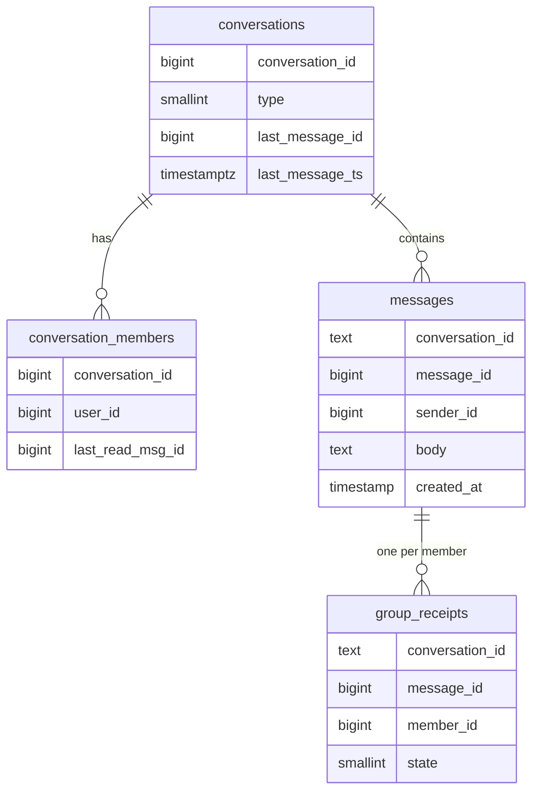
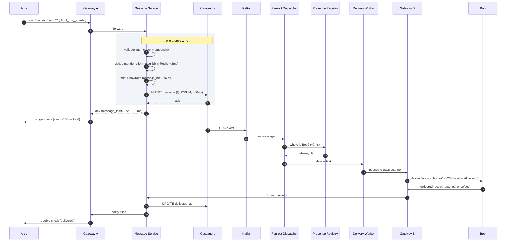
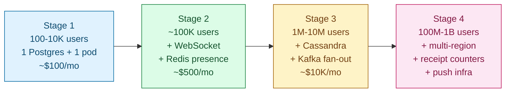

## Solution: Chat System (WhatsApp / Slack)

### What this system is

A chat system is two problems pressed together.

The first is a connection layer: hold hundreds of millions of WebSockets open simultaneously. Bound by socket count, kernel tuning, and reconnect logic, not CPU.

The second is a message layer: store messages in order and deliver them. Bound by receipt volume, which beats raw message volume 30 to 1 in group chats.

The shape: stateful gateways at the edge holding WebSockets, a stateless Message Service that owns ordering and writes to Cassandra, fan-out through Kafka to delivery workers, a Redis Presence Registry mapping user to gateway, and a Push Service for offline users on a completely separate path.

The interesting work hides in four small but load-bearing details. Snowflake IDs for FIFO-per-sender without consensus. Batched receipts to keep groups affordable. Resume-on-reconnect to make phone drops invisible. A counter in Redis instead of scanning per-member receipt rows.

---

### 1. The two questions that matter most

**How many open connections at peak?** This drives the edge fleet size more than anything else. 500 million concurrent WebSockets means roughly 7,000 gateway servers. Message rate is almost irrelevant compared to this number.

**How big are groups, and do you show receipts?** Group size controls per-message fan-out work. Receipts add 30x more events than messages in large groups. Both answers together define whether your receipt path is a footnote or the dominant engineering challenge.

---

### 2. The math

| Metric | Value |
|--------|-------|
| Messages/second (steady) | ~1.16 million |
| Messages/second (peak) | ~3.5 million |
| Total events/second with receipts (steady) | ~43 million |
| Total events/second with receipts (peak) | ~130 million |
| Edge gateway servers needed | ~5,000, provisioned ~7,000-8,000 |
| Memory per gateway (100K sockets × 10 KB) | ~1 GB |
| Storage per year, raw | ~12 PB |
| Storage per year, 3 replicas | ~36 PB |

The decisive observation: a 1,000-person group message produces 1 write to storage and ~1,800 receipt events. Design the receipt path badly and the system collapses on the first large group conversation.

---

### 3. The API

Most of chat lives over WebSocket. REST handles history fetch, media upload, and account management.

**WebSocket connection:**

```
GET /chat/v1/ws
Authorization: Bearer <token>
Upgrade: websocket
Sec-WebSocket-Protocol: chat.v1
```

<details markdown="1">
<summary><b>Show: client-to-server frame types</b></summary>

```json
// Send a message
{ "type": "send", "client_msg_id": "uuid", "conversation_id": "conv_abc", "body": "hi" }

// Delivered receipt (batched, covers all messages up to this ID)
{ "type": "delivered", "conversation_id": "conv_abc", "up_to_message_id": "9187202" }

// Read receipt
{ "type": "read", "conversation_id": "conv_abc", "up_to_message_id": "9187202" }

// Typing indicator
{ "type": "typing", "conversation_id": "conv_abc", "is_typing": true }

// Resume after reconnect
{ "type": "resume", "last_seen": { "conv_abc": "9187190", "conv_xyz": "8800041" } }
```

</details>

<details markdown="1">
<summary><b>Show: server-to-client frame types</b></summary>

```json
// Ack of a sent message
{ "type": "ack", "client_msg_id": "uuid", "message_id": "9187202", "server_ts": 1716000000123 }

// Incoming message
{ "type": "message", "message_id": "9187202", "conversation_id": "conv_abc",
  "sender_id": "user_alice", "body": "hi", "server_ts": 1716000000123 }

// Receipt update for the sender
{ "type": "receipt", "conversation_id": "conv_abc", "message_id": "9187202",
  "state": "delivered", "member_id": "user_bob" }

// Catch-up after resume
{ "type": "history", "conversation_id": "conv_abc", "messages": [...] }
```

</details>

**REST endpoints (non-real-time):**

```
POST /api/v1/conversations
GET  /api/v1/conversations
GET  /api/v1/conversations/:id/messages?before=<msg_id>&limit=50
POST /api/v1/media
POST /api/v1/devices     (register push token)
```

Two load-bearing details:

- `client_msg_id` is required on send. Phones lose signal mid-send and retry. The server deduplicates on `(sender_id, client_msg_id)` and returns the same `message_id` on retry. Without this, every flaky network produces a duplicate message.
- Receipts are batched. The client says "delivered up to msg X" once per second. The server records the high-water mark. That alone cuts receipt database writes by 10-50x.

---

### 4. The data model

Two tables live in Cassandra (large, write-heavy, partitioned). Three live in Postgres (small, relational, queried by user).



<details markdown="1">
<summary><b>Show: the full schema</b></summary>

```sql
-- Cassandra: the message log
CREATE TABLE messages (
    conversation_id    TEXT,
    message_id         BIGINT,
    sender_id          BIGINT,
    client_msg_id      TEXT,
    body               TEXT,
    body_type          SMALLINT,       -- 1=text, 2=image_ref, 3=system
    media_refs         LIST<TEXT>,
    reply_to           BIGINT,
    created_at         TIMESTAMP,
    deleted_at         TIMESTAMP,
    edited_at          TIMESTAMP,
    delivered_at       TIMESTAMP,      -- for 1-to-1 chats only
    read_at            TIMESTAMP,      -- for 1-to-1 chats only
    PRIMARY KEY ((conversation_id), message_id)
) WITH CLUSTERING ORDER BY (message_id DESC);

-- Cassandra: group receipts with 90-day TTL
CREATE TABLE group_receipts (
    conversation_id   TEXT,
    message_id        BIGINT,
    member_id         BIGINT,
    state             SMALLINT,        -- 1=delivered, 2=read
    state_ts          TIMESTAMP,
    PRIMARY KEY ((conversation_id, message_id), member_id)
) WITH default_time_to_live = 7776000;

-- Postgres: conversations
CREATE TABLE conversations (
    conversation_id   BIGSERIAL PRIMARY KEY,
    type              SMALLINT NOT NULL,   -- 1=direct, 2=group
    name              TEXT,
    created_by        BIGINT NOT NULL,
    created_at        TIMESTAMPTZ NOT NULL DEFAULT NOW(),
    last_message_id   BIGINT,
    last_message_ts   TIMESTAMPTZ
);

-- Postgres: membership
CREATE TABLE conversation_members (
    conversation_id   BIGINT NOT NULL,
    user_id           BIGINT NOT NULL,
    role              SMALLINT NOT NULL DEFAULT 1,
    joined_at         TIMESTAMPTZ NOT NULL,
    last_read_msg_id  BIGINT,
    muted_until       TIMESTAMPTZ,
    PRIMARY KEY (conversation_id, user_id)
);
CREATE INDEX idx_member_user ON conversation_members (user_id);
```

</details>

Three decisions doing real work:

**Partition messages by `conversation_id`.** All messages in one chat live on one Cassandra partition. Reading the last 50 is a single fast range query. Writes for different chats go to different nodes and scale horizontally.

**Clustering order DESC.** The common query is "give me the last 50 messages." Clustering newest-first means Cassandra returns them without a sort pass.

**No foreign key between `group_receipts` and `messages`.** If a message is ever deleted (GDPR, bulk error), receipt history must survive independently.

---

### 5. Message flow, end to end



**Send latency budget, P99, both users online:**

| Step | Cost |
|------|------|
| Mobile RTT to gateway | 50-150ms |
| Gateway to Message Service | 5ms |
| Redis dedup check | 2ms |
| Cassandra QUORUM write | 50-100ms |
| Ack to sender | 10ms |
| **Total to sender ack** | **~200-300ms** |
| CDC to fan-out to recipient | +200-500ms async |

---

### 6. The architecture

```mermaid
flowchart TB
    subgraph Edge["Client edge"]
        C([Web / Mobile]):::user
        GW["Connection Gateway<br/>(stateful, 100K sockets/node,<br/>sticky by user_id hash)"]:::edge
    end

    subgraph Write["Write path (synchronous)"]
        MS[/"Message Service<br/>(stateless pods)"/]:::app
        PG[("Postgres<br/>conversations · members")]:::db
    end

    Cass[("Cassandra<br/>messages · group_receipts<br/>RF=3, QUORUM")]:::db

    PR[("Presence Registry<br/>(Redis)")]:::cache
    RC[("Receipt Counters<br/>(Redis)")]:::cache

    K{{"Kafka<br/>message.new · receipt.*"}}:::queue

    subgraph FanOut["Async fan-out"]
        FD[/"Fan-out Dispatcher<br/>(Kafka consumer group)"/]:::app
        DW[/"Delivery Workers"/]:::app
        Push["Push Service<br/>(APNs / FCM)"]:::ext
    end

    C --> GW
    GW -->|send frame| MS
    MS --> Cass
    MS --> PG
    MS --> PR
    MS -.->|ack| GW
    Cass -->|CDC| K
    K --> FD
    FD --> PR
    FD --> DW
    FD --> Push
    DW --> RC
    DW -.->|publish gw:{id}| GW
    GW -->|receipt| MS
    MS --> RC

    classDef user fill:#dbeafe,stroke:#1e40af,color:#1e3a8a
    classDef edge fill:#e2e8f0,stroke:#475569,color:#1e293b
    classDef app fill:#dcfce7,stroke:#15803d,color:#14532d
    classDef db fill:#fed7aa,stroke:#c2410c,color:#7c2d12
    classDef cache fill:#fecaca,stroke:#b91c1c,color:#7f1d1d
    classDef queue fill:#ddd6fe,stroke:#6d28d9,color:#4c1d95
    classDef ext fill:#e9d5ff,stroke:#7e22ce,color:#581c87
```

Five things to notice:

- Gateways are stateful but hold no durable data. Crashes drop connections. Clients reconnect. Nothing is lost.
- The pub/sub bus (Redis per-gateway channels) is fire-and-forget. Lost events are recovered by the resume protocol or push notification.
- Message Service is fully stateless. Scale by adding pods. No coordination needed.
- Fan-out is fully async, behind Kafka. Send latency does not grow with group size.
- Push Service is downstream of fan-out, not inline. If APNs is degraded, online delivery is unaffected.

---

### 7. The scaling journey: 100 users to 1 billion



#### Stage 1: 100 to 10,000 users

One Postgres. One app server. Messages in a single table. Long polling for new messages. Push via APNs/FCM directly from the app server. About $100/month.

Ten requests per second is nowhere near a bottleneck. Building more is waste.

#### Stage 2: 100,000 users

Polling at this scale wastes bandwidth and battery. Clients polling every 5 seconds create ~20K requests/second, most returning "nothing new."

Add WebSocket. One Redis for presence. Still one Postgres. Offline push directly from the app server. Postgres is loafing. No fan-out workers, no Kafka, no Cassandra yet.

#### Stage 3: 1 million to 10 million users

Several things break at once. Postgres struggles past ~10K message inserts/second. A single app server cannot hold millions of WebSockets. Group messages block the send path while fan-out runs. "Show last 50 messages" gets slow past 100M rows.

Fixes, in order:
- Move messages to Cassandra, partitioned by `conversation_id`. Postgres keeps conversations and members.
- Split gateways from Message Service. Gateways hold sockets. Message Service is stateless.
- Add Kafka in front of fan-out. Send returns as soon as Cassandra acks.
- Add Redis Presence Registry.

Cost: ~$5-10K/month.

#### Stage 4: 100 million to 1 billion users

Receipt volume explodes. Per-member receipt storage grows to tens of billions of rows. Hot group conversations overwhelm one Cassandra partition. Cross-region latency becomes visible.

Fixes:
- Batched receipts (once per second, not once per message).
- Receipt counters in Redis (delivered/read counts from a hash, not a scan).
- Drop "delivered" in groups over 256 members.
- Multi-region: each region has its own gateways, Message Service, and Cassandra ring. Each conversation has a home region.

Cost: ~$100K+/month.

---

### 8. Reliability

**Gateway crash.** 100K clients see their socket close. Each client applies jittered exponential backoff (random 1-5 seconds). Clients reconnect to other gateways via consistent hashing on user_id. Each sends a `resume` frame. Total recovery: 5-15 seconds. No data loss because no durable state lived in the gateway.

Build reconnect storm shaping into the client SDK. Cap new connections per gateway per second at the load balancer. Keep 30% spare capacity so one gateway cluster can absorb another's failure.

**Cassandra node failure.** RF=3, QUORUM writes. Losing one replica leaves two. Reads and writes continue. Losing two replicas of the same partition makes those chats temporarily unavailable for QUORUM reads. Degrade gracefully (serve from one replica with a stale warning) or surface the error.

**Pub/sub bus failure.** Redis pub/sub is not durable. A lost event means the recipient does not get the real-time push. Recovery: the resume protocol catches them up on next reconnect. Push notification fires independently and prompts the user to open the app. Both backstops work without the pub/sub bus.

**Message Service crash mid-write.** Two cases. First: Cassandra committed but the ack never reached the sender. Client retries with the same `client_msg_id`. Server deduplicates and returns the original `message_id`. No duplicate. Second: Cassandra rejected the write. Client retries. Server mints a new ID and writes. No duplicate. The dedup window is 60 seconds in Redis; for authoritative dedup, the Message Service reads Cassandra for `(sender_id, client_msg_id)` in the last ~100 messages of the partition before minting a new ID.

---

### 9. Observability

| Metric | Why it matters |
|--------|----------------|
| `gateway.connections` per region | Capacity and routing health |
| `gateway.connection_churn_per_sec` | Spike means bad client build or network issue |
| `message_service.write_latency_p99` | Cassandra QUORUM dominates this |
| `cassandra.replication_lag_p99` | Should be under 3s cross-region |
| `fanout.kafka.consumer_lag` | Leading indicator of delayed delivery |
| `fanout.dispatch_latency_p99` | CDC to pub/sub publish, target under 1s |
| `delivery.publish_drop_rate` | Rises if Redis pub/sub drops |
| `receipts.write_rate` | Should be ~30-40x message rate; if not, batching broke |
| `push.apns.error_rate` | Provider health |
| `push.token_invalid_rate` | Users uninstalling; needs cleanup |
| `presence.online_count` | Should match `gateway.connections` within 1% |
| `resume.message_count_p99` | High value means clients are missing real-time pushes |

Page on: gateway availability below 99.9% in any region, message P99 above 1s for 5 minutes, Kafka consumer lag above 30s.

Ticket on: push error rate above 5%, resume fallback rate above 10%, receipt rate diverging from message rate.

---

### 10. Follow-up answers

**1. Reconnect after 30 minutes offline.**

Resume protocol. The client sends `resume` with per-conversation `last_seen_message_id` (stored locally on-device). Server queries Cassandra for `message_id > last_seen` per conversation, capped at 1,000 messages and 7 days. Returns as `history` frames. For larger gaps, the server responds with `resume_failed: too_old` and the client falls back to the REST history endpoint.

The server never assumes the client has anything. The client's local store is the authority for "what does this device know." This keeps the server stateless, with no per-user delivery queue.

**2. A bot in a big group.**

A bot sending one message every 5 seconds to a 1,000-member group generates ~360 receipt events per second. Harmless alone. At 10,000 such bots: 3.6 million extra receipt events per second.

Per-sender rate limit per conversation: 60 messages/minute by default. Bots needing more declare themselves and use a business API with explicit quota. Receipt suppression for bot accounts: bots get no "read" receipts, cutting their receipt load in half. Hot bot-heavy conversations get their own Kafka partition with rate-limited consumption.

**3. Presence at scale.**

A user with 200 contacts toggles online. Naive fan-out publishes to all 200. At 1 billion users this is the highest-rate subsystem in the whole system.

Real design: subscriber model. A user subscribes to presence only for contacts visible on screen (~20). Subscription drops when navigating away. Coarse granularity: online becomes idle after 5 minutes of inactivity, offline after 15. This prevents flickering on spotty connections. State lives in Redis only, no disk write. Lost on Redis failure, recomputed on reconnect. At 500M concurrent users with sparse transitions: ~300K events/second. Manageable.

**4. Typing indicators.**

Sent as `{type: typing, is_typing: true}` on first keypress. Sent as `false` after 5 seconds of no typing or when the message sends. Never touches Cassandra or Postgres. Flows gateway to fan-out (small, in-memory path) to recipient gateways to sockets. Auto-expires on the recipient after 5 seconds without refresh.

Skip in groups over ~50 people. Slack does not show typing in large channels. The feature adds noise rather than value at that scale.

**5. Multi-device sync.**

The Presence Registry stores per-device entries for the same user:

```
session:user_42 = {
  "phone_abc": { gateway: "gw-7" },
  "laptop_xyz": { gateway: "gw-22" }
}
```

Fan-out emits one delivery task per session, not per user. Each device gets its own message copy.

Read sync flows through the receipt path. Phone marks a message as read. The Message Service updates `last_read_msg_id` in `conversation_members`. A `state_change` frame goes to all other active sessions for that user. The laptop's unread badge drops.

**6. End-to-end encryption.**

Messages are encrypted client-side (Signal Protocol Double Ratchet for 1-to-1, Sender Keys or MLS for groups). The server stores ciphertext blobs. It cannot read content.

Effects: server-side search is impossible (WhatsApp does client-side search on the local database; Slack chose not to do E2E because it needs server-side search). Push previews say "New message from Alice," not the body. Fan-out is unchanged: the server routes by metadata (sender, conversation, timestamps), which stays plaintext. Multi-device pairing requires a new device to be authorized by an existing one via QR code scan.

**7. Gateway crash with 100K connections.**

Clients reconnect with jittered backoff over 5-15 seconds. Consistent hashing on user_id routes each client to a new gateway. Each sends `resume`. Missed messages are returned as `history` frames. No data is lost because no durable state lived in the gateway.

The concern to mention: the remaining fleet must absorb the reconnect storm. Size for 30% spare or losing one gateway cluster knocks over the rest.

**8. New device bootstrap.**

User logs in. 500 chats. 10 years of history. Millions of messages. Sending it all is impractical.

Lazy load: fetch the conversation list with last-message preview first. That is ~500 rows at ~500 bytes each, about 250 KB. Fast. When the user opens a specific chat, fetch the last 50 messages (one Cassandra range query). Load older history only if the user scrolls up, paginated with `?before=<msg_id>`.

For E2E-encrypted chats, the new device must receive key material from an existing active device. WhatsApp skips history for unpairable devices. Signal syncs a recent window.

The chat list is the only thing that must be fast on a fresh login. The denormalized `last_message_id` and `last_message_ts` on the `conversations` row make it one query.

**9. Spam detection.**

Track per-sender signals: outbound rate to non-contacts, account age vs. message volume (a 1-hour-old account sending 500 messages is a bot), block/report rate above 5% of recipients within 24 hours, similar message bodies across many recipients (locality-sensitive hashing), and device/IP novelty.

Response, in escalating order:
1. Soft rate limit: cap outbound to non-contacts at 50/hour.
2. Friction: phone verification or CAPTCHA before continuing.
3. Shadow ban: messages accepted, never delivered. Sender sees "sent." Recipient sees nothing. Buys time to confirm.
4. Hard suspend: account disabled.

Whitelisted business accounts with declared quota skip steps 1-3.

**10. Delivery lag spikes to 30s in one region. Message store metrics look fine.**

Where to look, in order:

1. **Kafka fan-out consumer lag for that region.** Most common cause. Check per-partition lag, not just the aggregate. A single hot partition (one massive group chat) can drive perceived lag while the aggregate looks healthy.
2. **Redis pub/sub bus latency.** Check CPU and slow log on the Redis cluster serving gateway pub/sub.
3. **Per-gateway connection imbalance.** Consistent hashing after a deploy can land 5% of users on one gateway. Check per-gateway connection count and outbound frame rate.
4. **Presence Registry slowness.** Every fan-out task does a presence lookup. If Redis is slow, fan-out queues.
5. **Membership cache cold.** Fan-out loads group membership. A cache miss on a large popular group hits Postgres and is slow.

The senior answer names per-partition Kafka lag (not just aggregate) and the Presence Registry as the often-overlooked culprits.

---

### 11. Trade-offs worth saying out loud

**Why stateful gateways and not stateless HTTP.** Every other component is stateless and trivially scaled. Gateways are not. Deploys require rolling restarts with connection draining. The complexity is worth it because the alternative (HTTP long-poll at 500M users) would create ~100M requests/second of "nothing new" responses, consuming more resources than the gateways ever would.

**Why no per-user inbox queue on the server.** Some textbook designs maintain durable queues per user. At 1 billion users, the queue infrastructure is enormous. Cassandra plus the resume protocol gives the same delivery guarantees with dramatically less state.

**Why pub/sub is fire-and-forget.** Redis pub/sub drops events on bus failure. This is acceptable because push notifications backstop offline users and the resume protocol backstops reconnecting users. A durable replacement would double bus operational cost for negligible observable benefit.

**Why single home region per conversation.** Avoids multi-master conflict resolution on the ordered log. Cross-region writes have higher latency, but that is hidden inside the async fan-out pipeline and is only slightly visible on send-ack for cross-region senders. The complexity savings are significant.

**Why Snowflake IDs and not consensus.** Users do not notice 1ms reordering on a 50-message screen. Snowflake gives FIFO-per-sender and consistent per-conversation order for free. Paxos-per-conversation is expensive, high-latency overkill for the problem that actually exists.

**What to revisit at 10x scale.**
- Commit-log in front of Cassandra: Kafka as a durable write buffer, ack the sender on log commit, write to Cassandra asynchronously. Shaves ~50ms from send latency.
- MLS for E2E group chat. WhatsApp's Sender Keys do not scale to 1,000-person groups with high member churn.
- Edge-local Message Service: push to each region's edge, synchronize via global log. Sub-200ms cross-region send.

---

### 12. Common mistakes

**Drawing one box labeled "WebSocket server" and moving on.** The connection layer is half the problem. Talk about connection count, sticky routing, reconnect-with-resume, and what happens when a gateway crashes.

**Forgetting receipts dominate the load.** Many candidates compute messages-per-second and stop. Receipts are 30x more events and shape the schema, the storage tier, and the throughput plan.

**Designing strict total order via consensus.** Paxos-per-conversation for strict global order. The actual user-visible guarantee is much weaker: same-sender FIFO, same view for all members. Snowflake gives that for free.

**Polling for messages.** "Client polls every 5 seconds" is the worst of both worlds at scale.

**No mention of push (APNs/FCM) for offline users.** Real-time only works when the socket is open. Offline is a separate path and must be named.

**One big Postgres table for everything.** Postgres at 100 billion messages/day melts. Cassandra partitioned by `conversation_id` is the standard answer.

**Per-recipient receipt storage with no TTL.** Use the receipts table with a 90-day TTL. Drop "delivered" in large groups.

**No multi-device model.** Users have phones and laptops. The session model must support multiple sessions per user_id, with read state synced between them.

**Ignoring abuse.** Rate limits and shadow ban are always asked about. Have an answer ready.

**Hand-waving reconnect.** "The client reconnects" is not an answer. The resume protocol with per-conversation `last_seen_message_id` is the answer. Name it explicitly.

If you hit 8 of these 10, you are at senior level. The three that separate strong from average: receipts dominating load, the resume protocol, and the multi-device session model.
