## What we are building

A rate limiter sits in front of an API and enforces per-client request quotas. A SaaS company might give free-tier users 100 requests per minute, pro users 10,000 per minute, and enterprise users 100,000 per minute. The API gateway runs on 200 nodes. Every one of those nodes must enforce the same limit for the same client. When Alice sends request number 101 in the same minute, any node she hits must reject it.

That is the whole product. The implementation is where things get interesting.

There are five real problems hiding in this design:

1. **Shared counter.** With 200 nodes each keeping their own count, Alice can send 100 requests to each and pass 20,000 through. The counter must be shared.
2. **Fail-open vs fail-closed.** When the counter store goes down, do you let requests through or block them? The answer depends on the route, not the system.
3. **Burst handling.** "100 requests per minute" does not say anything about the first second. Alice could send all 100 in the first millisecond. Most algorithms handle this differently.
4. **Latency budget.** The rate check must cost under 2ms at P99. Every design choice is constrained by that number.
5. **Hot tenant.** One enterprise client sends 80% of the total traffic. Their counter is hit 240,000 times per minute. The counter store must not become the bottleneck for everyone else.

We will start with the simplest version that works, then add one layer at a time as each problem appears.

---

## The lifecycle of one request

Every incoming request goes through the same short path.

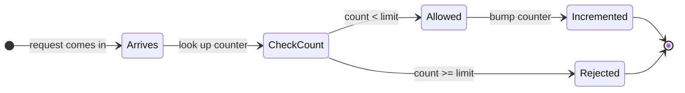

Everything we add later (shared Redis, local caches, fail-open modes, burst allowances) is a complication on top of this single flow.

> **Take this with you.** A rate limiter is a counter lookup, an increment, and a yes-or-no decision. All the engineering is in making those three steps fast, shared, and fault-tolerant.

---

## How big this gets

Assume the following numbers.

| Input | Value |
|-------|-------|
| Peak QPS | 300,000 |
| Distinct API keys | 100,000 |
| Free tier limit | 100 req/min |
| Pro tier limit | 1,000 req/min |
| Enterprise tier limit | 10,000 req/min |
| Gateway nodes | 200 |
| Latency budget for the check | 2ms at P99 |

<details markdown="1">
<summary><b>Show: what the numbers mean</b></summary>

**Counter writes per second.**
Every request bumps a counter. 300K QPS at peak means 300K writes per second to start. Keep a few counters per client (per-minute, per-hour, per-route) and it becomes roughly 1 million Redis ops per second at peak.

**Memory for all the counters.**
100K clients x 3 counters each x 100 bytes per counter = **30 MB**. Tiny. Fits on one Redis node. We shard for availability, not capacity.

**Per-node QPS.**
300K / 200 nodes = **1,500 checks per second per gateway**. Easy in-process. The risk is not CPU. It is the number of Redis round trips.

**Redis ops if every check is a round trip.**
300K req/sec x 2 ops per check (read + conditional increment) = 600K ops/sec. One Redis instance handles about 100K ops/sec comfortably. So we either shard, or cut the number of round trips, or both.

The state is small. The challenge is **how often we touch the store**, not how much we store.

</details>

> **Take this with you.** State is not the problem. Round trips are. Every design decision that follows is about cutting the number of Redis calls.

---

## The smallest version that works

Forget 200 gateway nodes. One gateway. One Redis. One table of limits.


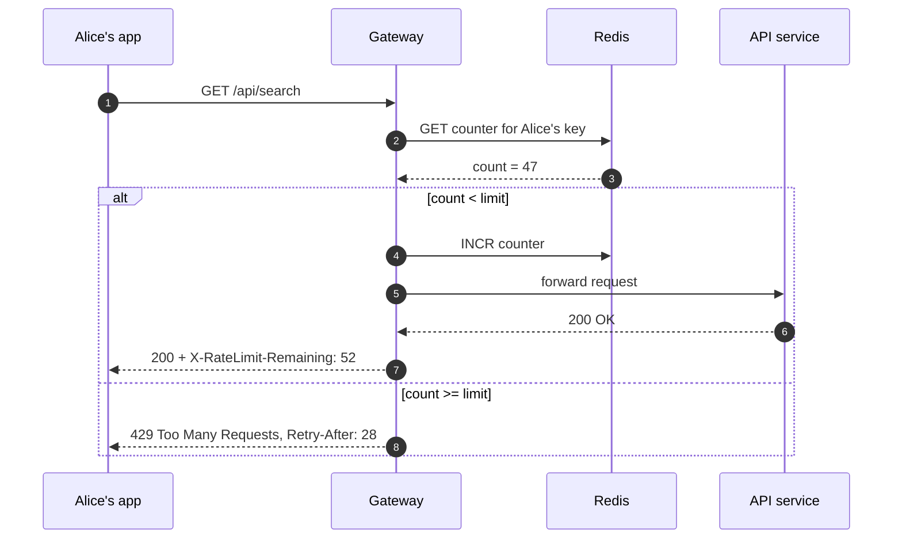

That is the whole product. Everything we add from here fixes a specific problem.

> **Take this with you.** Start from this. The interesting part of the interview is what breaks the moment you add the second gateway node.

---

## Decision 1: where does the counter live?

The second gateway node breaks everything. Each node has its own in-memory counter. Alice sends 100 requests: 50 land on node 1, 50 land on node 2. Both see 50. Neither blocks her. With 200 nodes, Alice can pass 20,000 through a 100-request limit.

A counter that is not shared is not a rate limiter.

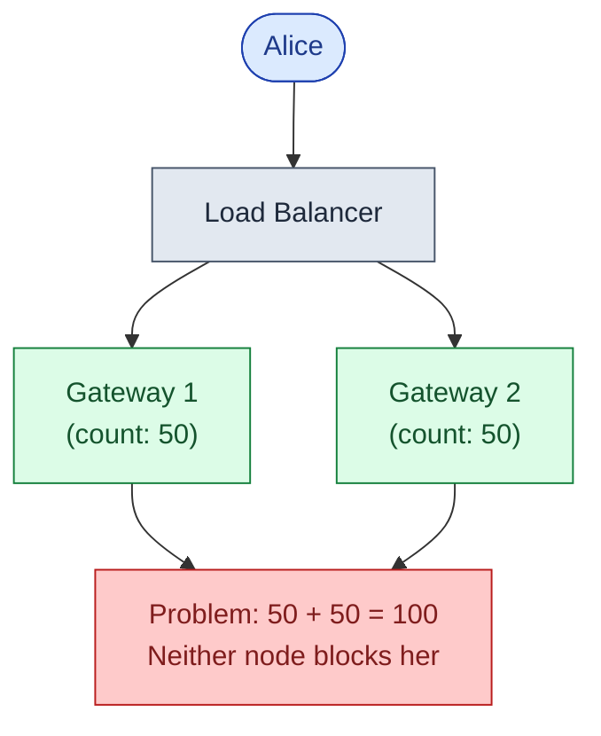

Move the counter to Redis. All 200 gateways share one counter per client. The math stays honest.

But now every request makes a Redis call. At 300K QPS that is 300K Redis ops per second. One Redis node handles about 100K comfortably. We need sharding.

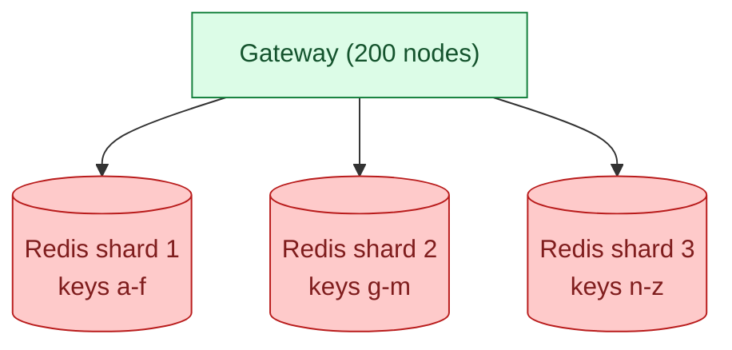

One client's counters always land on the same shard. The atomic Lua script (which reads current-window and previous-window keys together) works because both keys are on the same shard.

<details markdown="1">
<summary><b>Show: the atomic check-and-increment Lua script</b></summary>

```lua
-- KEYS[1] = current window key   e.g. "rl:apikey:sk_xyz:search:1716381660"
-- KEYS[2] = previous window key  e.g. "rl:apikey:sk_xyz:search:1716381600"
-- ARGV[1] = limit
-- ARGV[2] = window_seconds
-- ARGV[3] = now_ms
-- ARGV[4] = cost (default 1)
-- Returns: { allowed (0|1), remaining, retry_after_ms }

local limit          = tonumber(ARGV[1])
local window_seconds = tonumber(ARGV[2])
local now_ms         = tonumber(ARGV[3])
local cost           = tonumber(ARGV[4])

local current  = tonumber(redis.call('GET', KEYS[1])) or 0
local previous = tonumber(redis.call('GET', KEYS[2])) or 0

local window_ms   = window_seconds * 1000
local elapsed_ms  = now_ms % window_ms
local prev_weight = (window_ms - elapsed_ms) / window_ms

local estimated = current + math.floor(previous * prev_weight)

if estimated + cost > limit then
    local need_to_shed   = (estimated + cost) - limit
    local retry_after_ms = math.ceil((need_to_shed / math.max(previous, 1)) * window_ms)
    return { 0, 0, retry_after_ms }
end

local new_current = redis.call('INCRBY', KEYS[1], cost)
redis.call('EXPIRE', KEYS[1], window_seconds * 2)

local remaining = math.max(0, limit - (estimated + cost))
return { 1, remaining, 0 }
```

One Redis round trip per check. All reads and the conditional write happen inside one Lua execution, so two concurrent requests cannot both read count = 99 and both increment to 100.

</details>

> **Take this with you.** Shared state is required. The question is how to share it without making every API call slow. Shard Redis by client key. Use a Lua script for atomic check-and-increment.

---

## Decision 2: which algorithm?

There are five common rate-limiting algorithms. Each handles burst traffic differently.

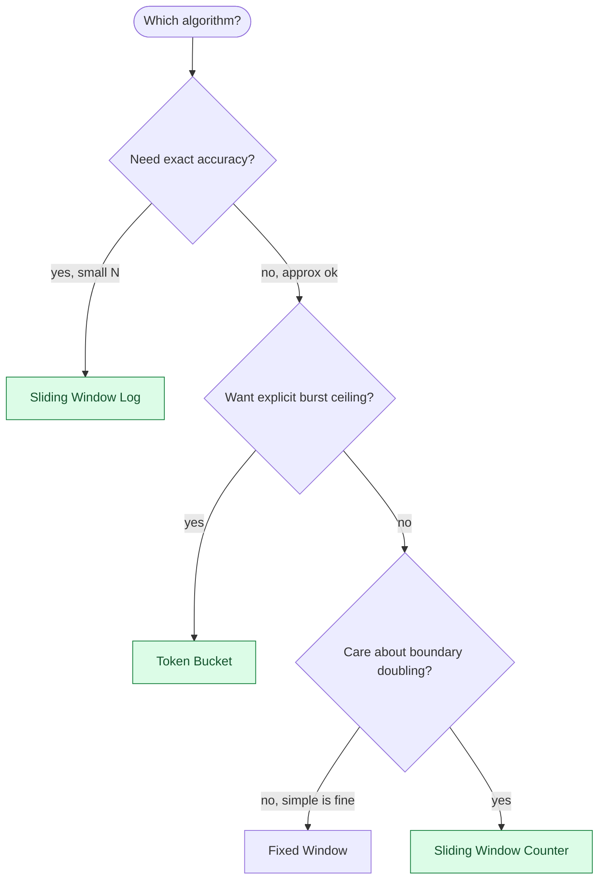

<details markdown="1">
<summary><b>Show: algorithm comparison</b></summary>

| Algorithm | Memory per client | Burst behavior | Boundary problem | When to pick it |
|-----------|-------------------|----------------|------------------|-----------------|
| **Token bucket** | ~16 bytes | Explicit: bucket_size burst, then throttled to R/sec | None | When you want a burst ceiling with a steady rate after |
| **Leaky bucket** | ~16 bytes + queue | Smooths spikes by queuing them | None | Network shaping, not APIs: queuing adds latency |
| **Fixed window** | ~16 bytes | Burst at start of window | Doubles at boundary: 100 at 11:59 + 100 at 12:00 = 200 in 2s | Advisory limits where doubling is acceptable |
| **Sliding window log** | 8 bytes per request | Ideal | None | Low-traffic, small N, high-value endpoints |
| **Sliding window counter** | ~24 bytes | Close to ideal, no jump | ~1% inaccuracy vs true sliding | Almost everything else |

**The sliding window counter** is the right default. O(1) memory, no boundary doubling, fits in a 15-line Lua script, 1% inaccuracy is invisible.

How it works: keep two fixed-window counters (current and previous). Weight the previous by how much time has passed.

```
estimated = current + previous * (1 - elapsed / window)
```

At 30 seconds into the current minute, with 80 requests in the previous minute and 40 in the current:

```
estimated = 40 + 80 * (1 - 30/60) = 40 + 40 = 80
```

No boundary jump. As the window turns over, the previous minute's contribution decays from 100% to 0% smoothly.

**Token bucket** is a strong second choice. AWS, Stripe, and most public clouds use it. Pick it when you want an explicit burst: "200 requests in the first second, then 1 per second after."

</details>

> **Take this with you.** Sliding window counter for most cases. Token bucket when you need an explicit burst ceiling. Fixed window only if boundary doubling is acceptable.

---

## Decision 3: how do we stay inside the 2ms latency budget?

At 300K QPS, even a 1ms Redis call is a problem. The clients most over their limit are also the ones sending the most traffic, which means the most Redis calls come from exactly the clients you want to stop fast.

The fix: add a tiny in-process LRU cache on each gateway. If a key was over-limit 100ms ago, fast-fail without calling Redis at all.

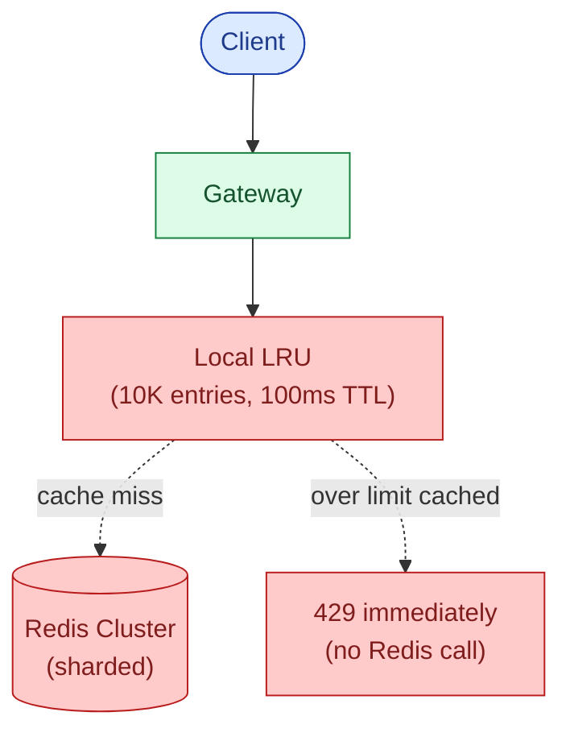

For a client hammering at 100x their limit, only the first few requests per window hit Redis. Everything else fast-fails on the local cache. Redis traffic drops by 80-90% for exactly the clients who would otherwise flood it.

Latency per check:

| Path | P99 |
|------|-----|
| Local LRU hit (over-limit fast-fail) | ~0.3ms |
| Local LRU miss, Redis hit | ~2ms |
| Local LRU miss, Redis miss (cold key) | ~3ms |

> **Take this with you.** The local LRU is the highest-impact optimization for the lowest cost. The abusers you most want to stop are the ones least likely to touch Redis after the first rejection.

---

## Decision 4: what happens when Redis goes down?

Most candidates skip this. It is where senior answers separate from mid-level ones.

Three failure modes:

**One Redis shard fails.** Its replica gets promoted. There is a 10-30 second window where some counters serve stale data. Acceptable. Redis Sentinel or Cluster handles this automatically.

**One gateway loses its Redis connection.** Others still have it. That node should fail its health check and stop receiving traffic. Serving traffic from a node that cannot enforce limits is worse than pulling it out of rotation.

**The whole Redis cluster is down.** This is the interesting one.

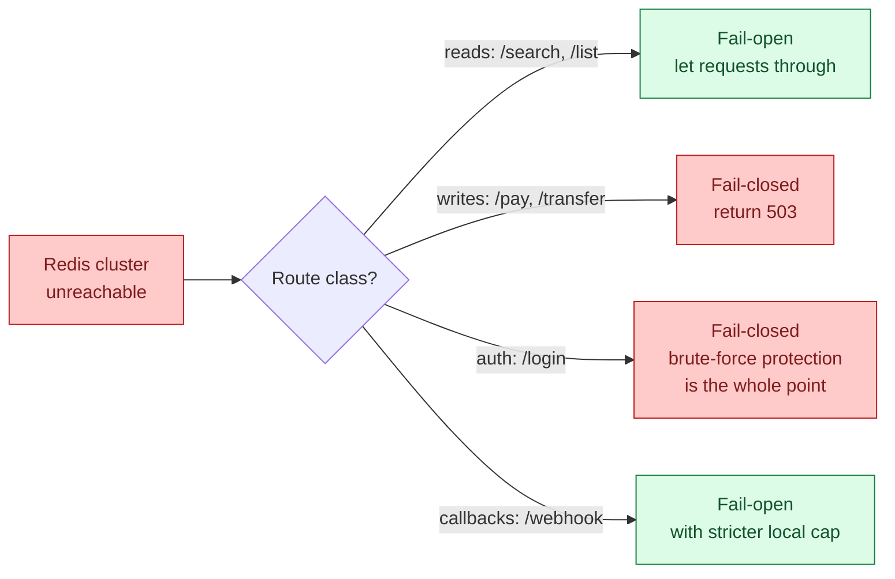

The fail mode is set per route, not globally. Engineering and security sign off on any fail-closed route. Whatever mode you pick, make the failure loud: emit `limiter.degraded_mode` metrics from every gateway, page immediately.

> **Take this with you.** "What happens when Redis dies?" is the question. "We just use Redis" is not an answer. The fail mode is a business decision per route, not a technical one.

---

## The full architecture

Putting the four decisions together:

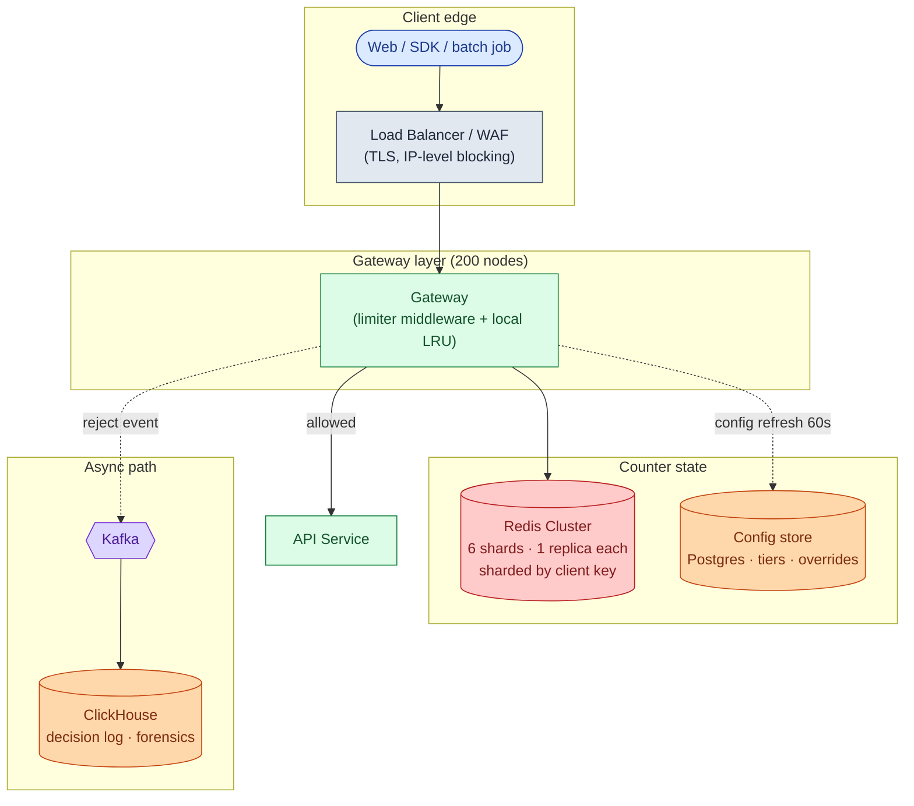

Each component in one line:

| Component | Purpose |
|-----------|---------|
| Load Balancer / WAF | TLS termination, IP-level blocking, distributes to gateway nodes |
| Gateway + limiter middleware | Runs the check. Library, not a separate service. |
| Local LRU | Fast-fails known-over-limit keys. Cuts Redis load 80%+ for abusers. |
| Redis Cluster | Shared counters. Sharded by client key. Lua script for atomic check-and-increment. |
| Config store | Tiers, per-client overrides, route costs. Refreshed every 60 seconds per gateway. |
| Kafka + ClickHouse | Every rejection event. Answers "why was customer X blocked at 3pm yesterday?" |

Notice what is not a separate service: the limiter itself. It is middleware inside the gateway process. A separate limiter service adds one network hop per API call, which blows the 2ms latency budget.

---

## Walk: an allowed request, end to end

Alice has a pro account. Limit is 1,000 req/min. She is at count 847. She sends a search request (cost = 5 units).

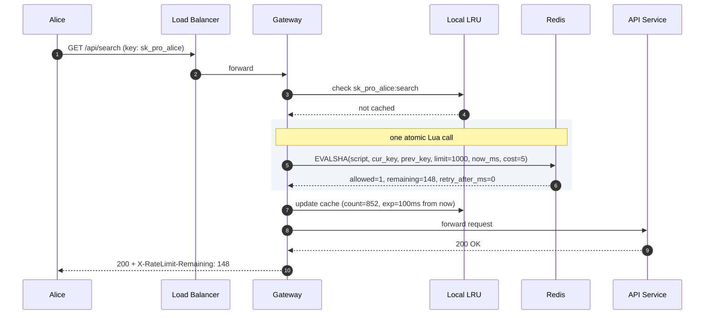

Now Alice sends one more request after hitting the limit exactly:

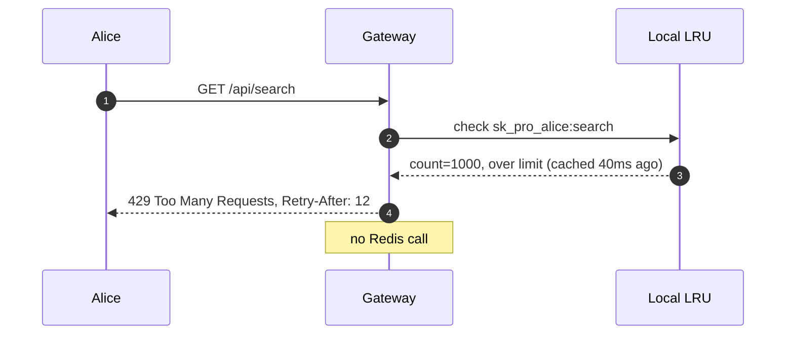

The second flow never touches Redis. The LRU absorbed it. This is what cuts Redis load during an abuse spike.

---

## The hot tenant problem

Bob is an enterprise customer at 100,000 req/min. His counter key gets hit 1,667 times per second. The one Redis shard that owns his key is at 80% CPU. Everyone else whose keys hash to the same shard is also slowed down.

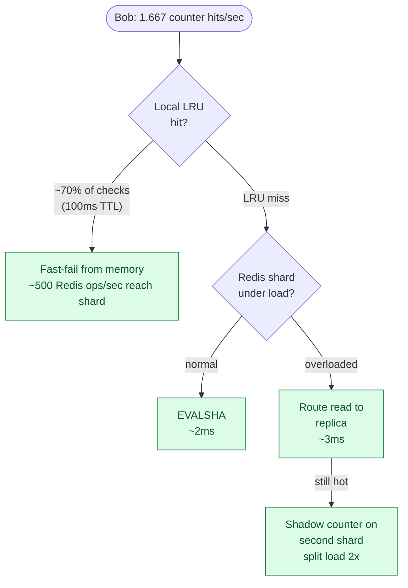

Three mitigations, in order of cost:

| Mitigation | What it solves | Cost |
|-----------|----------------|------|
| Local LRU (already built) | Cuts 70%+ of checks from hitting the shard | Free |
| Redis read replicas | Distributes read pressure across N replicas | Low |
| Shadow counter on a second shard | Halves writes to the hot shard | Medium: adds a small counting error |

For predictable bursts (an enterprise batch job starts at 2am), pre-announce: the customer registers the burst window and the system raises their local LRU TTL to 1 second for that window, reducing shard traffic further.

> **Take this with you.** One large tenant can saturate a Redis shard and drag everyone else on it. The local LRU is the first defense. Replicas for reads. Shadow counters only if the shard is still overloaded.

---

## Follow-up questions

Try answering each in 2 or 3 sentences before opening the solution.

1. **Multiple keys per request.** A request has an IP, an API key, and a user_id. Do you check all three limits in parallel or one after another? What if the API key limit allows it but the IP limit does not?

2. **Limits per route.** `/api/search` is expensive. `/api/health` is cheap. Same client, same tier. How do you express this in the data model?

3. **Cost-based limits.** Instead of "1,000 requests per minute," the limit is "1,000 units per minute." A search costs 5 units. A lookup costs 1. What changes in the limiter?

4. **Burst allowance.** A client should be able to send 200 in the first 10 seconds, but still hit a total of 1,000 per minute. Which algorithm? How do you configure it?

5. **IP rotation (botnet).** An attacker rotates through 10,000 different home IPs. Per-IP limits do nothing. What do you do?

6. **Customer override.** An enterprise customer negotiated a 100x limit. Where do you store the override? How fresh must it be? What if the override service is down?

7. **Distributed accuracy.** Two requests from the same client land on two gateway nodes within 1ms. Both check Redis. Both see count = 99 (under a 100 limit). Both INCR. Now count = 101 and both were allowed. What stops this?

8. **Pre-warming a known burst.** A customer says they will run a batch job at 2 AM that needs 10,000 requests in 60 seconds, well above their normal limit. How do you let them through without raising their permanent limit?

9. **"User got popular."** A blog post hits the front page. A user's API endpoint sees 10x traffic. The limiter blocks them. Is that correct? How would you build a smarter signal?

10. **The limiter is the bottleneck.** Your dashboard shows the limiter middleware adds 8ms to P99 latency. Your budget was 2ms. Where do you look first?

---

## Related problems

- **[URL Shortener (001)](../001-url-shortener/question.md).** The `POST /links` endpoint sits behind exactly this kind of limiter. The design plugs in directly.
- **[Distributed Cache (009)](../009-distributed-cache/question.md).** The Redis cluster backing the limiter is a distributed cache. The eviction, sharding, and replication choices there set the limiter's failure modes.
- **[News Feed (002)](../002-news-feed/question.md).** Both the `POST /posts` endpoint and the timeline read path need rate limiting. The cost-based pattern in follow-up 3 is exactly how feeds throttle expensive ranking queries.
