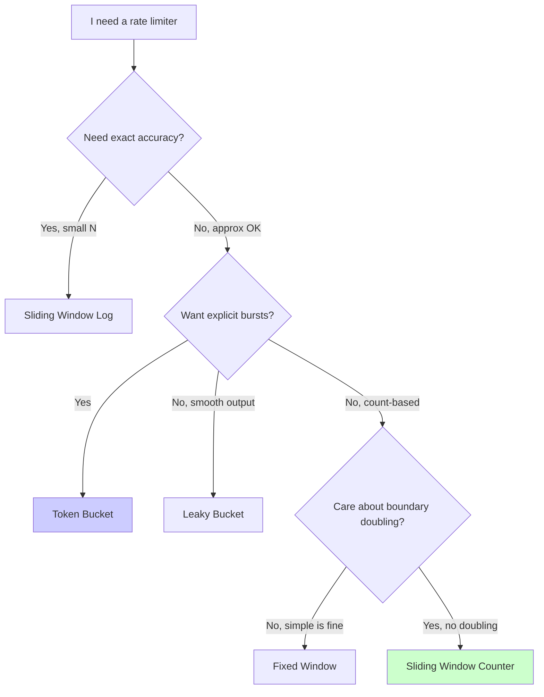
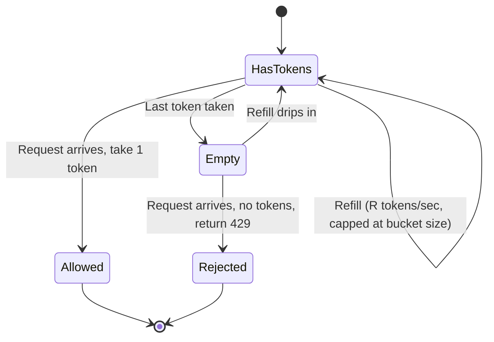
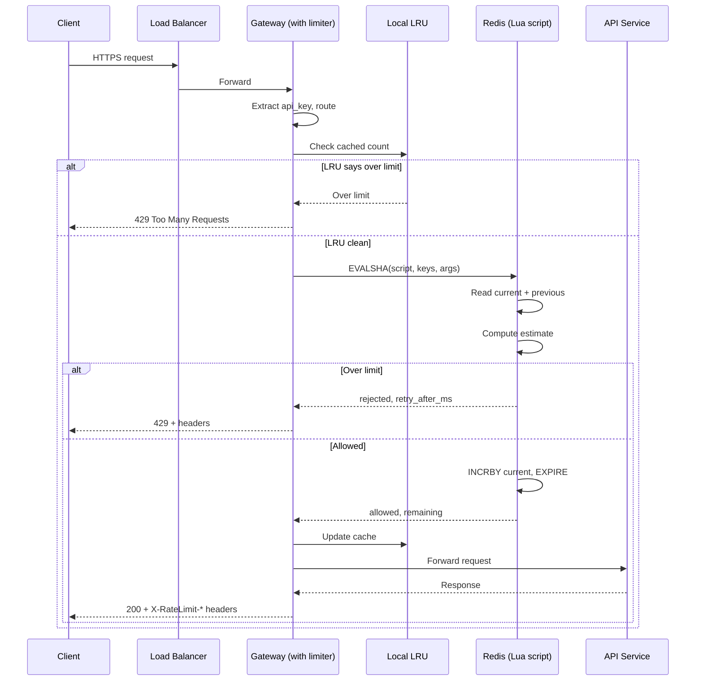

## The scene

You walk into the second round of an onsite. The interviewer runs the API gateway team at a SaaS company. They write one sentence on the whiteboard.

> *"Design a rate limiter for our public API."*

Then they add: *"We have free, pro, and enterprise tiers. Each tier has a different limit. The API runs on 200 gateway servers. Make it work."*

It looks small. It is not. Most candidates say "token bucket in Redis" in 30 seconds and then run out of things to say. The algorithm is the easy part. The hard parts are:

- Where does the limiter sit?
- What happens when Redis dies?
- How do 200 gateway nodes share one counter?
- How do we not make every API call slower because of the check itself?

We will walk through all of this. We will start small and grow the design step by step.

> **Why a rate limiter at all?** Without one, a single buggy client (or one attacker) can hammer your API and bring everything down for everyone else. The limiter is the bouncer at the door. It lets only a fair number of requests through per client per second.

---

## Step 1: Ask the right questions

Before you draw anything, sit for five minutes. Write down questions you would ask the interviewer.

A good answer here is not "ten questions about every edge case." It is the small handful of questions that change the design if the answer changes.

<details markdown="1">
<summary><b>Show: 8 questions that matter</b></summary>

1. **What do you limit on?** Per IP? Per API key? Per user_id? Per route? Some mix? *(This is the biggest question. A per-IP limit fails the moment a company NAT puts 10,000 employees behind one address. A per-API-key limit is useless against an attacker who rotates keys. Real systems use layers.)*

2. **What does the limit mean?** Is it 100 requests per minute on the clock? Or 100 in any rolling 60-second window? Are short bursts okay? *(Fixed windows are easier. Sliding windows are more fair. Bursts are usually allowed so the API feels snappy.)*

3. **Same limit for everyone?** Or does each tier (free, pro, enterprise) have its own? Can one big customer get an override? *(Almost always tiered with overrides. Shapes the config store.)*

4. **What if the store is down?** If Redis dies, do we let everything through (fail-open) or block everything (fail-closed)? *(This is a business question disguised as a technical one. Most public APIs fail-open. Payment APIs fail-closed.)*

5. **What do we return on a reject?** A 429 with `Retry-After`? Headers like `X-RateLimit-Remaining` so good clients can self-throttle? *(Headers are table stakes. Skipping them is a red flag.)*

6. **Count requests, or cost?** Is one search query worth the same as one health check? Or should the search cost 5 "units"? *(Cost-based limits are common at scale and add real complexity.)*

7. **How much latency can the check add?** Under 1ms means in-process. Under 5ms means one Redis round trip. Over 10ms is a problem. *(Sets the latency budget.)*

8. **Traffic numbers.** Total QPS? P99 per-client QPS? How many distinct clients? *(Without this you cannot size Redis.)*

The two that matter most: **what do you limit on** and **what happens when the store is down**. If you skip those, you are answering a different (smaller) problem.

</details>

---

## Step 2: How big is this thing?

The interviewer gives you these numbers:

- 100K total API requests per second, peak 300K
- 100K distinct API keys
- Free tier: 100 req/min. Pro: 1,000/min. Enterprise: 10,000/min.
- Most clients sit at 1 to 10 percent of their limit. A few sit near the cap.
- 200 gateway nodes in the fleet.
- The check must add no more than 2ms at P99.

Try the math first. Compute:

1. How many counter updates per second?
2. How much memory to track all 100K clients?
3. How many limit checks per second on each gateway node?
4. How many Redis ops per second if every check is a round trip?

<details markdown="1">
<summary><b>Show: the math</b></summary>

**Counter updates per second.**
Every request bumps a counter. 300K QPS at peak means **300K writes per second** baseline. Keep a few counters per client (per-minute, per-hour, per-route) and you multiply by 3 to 5. Call it **~1M Redis ops/sec at peak**.

**Memory for state.**
100K clients x ~3 counters each x ~100 bytes per counter = **30MB**. Tiny. Fits on one Redis node. We still shard for availability, not for capacity.

**Per-node QPS.**
300K / 200 gateway nodes = **1,500 checks per second per gateway**. Easy in-process. But each check that talks to Redis is one network round trip. That is 1,500 round trips per node per second.

**Redis ops if every check is a round trip.**
300K req/sec x 2 ops per check (read, then maybe increment) = **600K ops/sec** on the Redis cluster. One Redis instance handles about 100K ops/sec comfortably. So we shard, or cache locally, or both.

**What the math tells us:**

The state is small. The challenge is **how many times we touch the store per request**, not how much we store.

> Why this matters: Every saved Redis round trip saves real latency and money. The whole design centers on cutting round trips for hot keys.

</details>

---

## Step 3: Pick the algorithm

There are five common rate limiting algorithms. Each makes a different trade between memory, accuracy, and how it handles bursts.

Try to guess the rough idea of each before reading on:

- Token bucket
- Leaky bucket
- Fixed window counter
- Sliding window log
- Sliding window counter

Here is a quick flowchart of how to pick one:



<details markdown="1">
<summary><b>Show: side-by-side comparison</b></summary>

| Algorithm | How it works | Memory per client | Burst behavior | Boundary problem | When it is wrong |
|-----------|--------------|-------------------|----------------|------------------|-------------------|
| **Token bucket** | A bucket holds up to N tokens. It refills at R tokens/sec. Each request takes one. Empty = reject. | ~16 bytes | Allows bursts up to bucket size, then throttles to R | None | When you want zero bursts |
| **Leaky bucket** | Requests enter a queue. The queue drains at fixed rate R. Full queue = reject. | ~16 bytes plus the queue | Smooths spikes by queuing them | None | When latency matters (queuing adds delay) |
| **Fixed window** | Count requests in the current minute. Window resets on the clock. | ~16 bytes | Allows 2x burst right at the boundary | Bad: 100 at 11:59:59 plus 100 at 12:00:00 | When clients notice the doubling |
| **Sliding window log** | Store the timestamp of every request in the last window. | O(N), can be many MB | Exact | Best possible | When N is large (10K x 8 bytes x 100K clients = 8GB) |
| **Sliding window counter** | Weighted blend of the current window count and the previous window count. | ~24 bytes | Close to ideal, no boundary jump | ~99% accurate vs true sliding | When you need exact correctness (rare) |

**My pick: sliding window counter.**

- O(1) memory per client (like fixed window).
- No boundary doubling.
- Fits in a ~10-line Redis Lua script. Atomic. P99 under 1ms.
- The 1% inaccuracy is invisible to clients.

**Token bucket** is a strong second choice. AWS and Stripe use it. Pick it when you want explicit burst control (200 right now, then 1 per second after).

> Why this matters: most candidates pick token bucket because they have heard of it. The real question is *why* a sliding window counter exists. The answer: fixed window has the boundary problem, sliding window log uses too much memory, and the counter is the cheap fix for both.

</details>

---

## Step 4: A picture of the token bucket

The token bucket is the easiest to visualize. Think of a real bucket that holds, say, 200 tokens. A pipe drips 1 token per second into it. Each request scoops out 1 token. If the bucket is empty, the request is rejected.



Two things to notice:

- **Idle time fills the bucket.** If nobody calls for a minute, the bucket fills up (capped at its size). The next burst can scoop out everything at once.
- **Sustained calls throttle to the refill rate.** Once the bucket drains, you can only call as fast as the bucket refills.

> Real world: a bucket of size 200 with refill rate 1/sec lets a client send 200 requests in one second, then slows them to 1/sec after that. Good for clients that batch-load and then idle.

---

## Step 5: Where does the limiter live?

You have four options for where the limiter runs. Try to fill in the gaps below. Where would *you* put it?

```
   Client ───►   +-------------+
                 |   [ ? ]     |  (TLS, route by host)
                 +------+------+
                        |
                        v
                 +-------------+
                 |   [ ? ]     |  (where does the limiter run?)
                 |             |  +---------------+
                 |             |->|   [ ? ]       |  (shared state? local? both?)
                 |             |  +---------------+
                 +------+------+
                        |  allowed? -> forward
                        |  rejected? -> 429
                        v
                 +-------------+
                 |  API service|
                 +-------------+

   Failure path: if [ ? ] is unreachable, the limiter must decide:
                 fail-open (allow) or fail-closed (reject)?
```

<details markdown="1">
<summary><b>Show: the full picture and why</b></summary>

```
   Client ───►   +-----------------+
                 |  Load Balancer  |  Anycast IP, TLS termination,
                 |  (L7)           |  health-checks gateways
                 +--------+--------+
                          |
                          v
                 +-----------------+
                 |  API Gateway    |  Stateless. Runs the limiter
                 |  (200 nodes)    |  as in-process middleware.
                 |                 |  Each node keeps a small LRU
                 |  +-----------+  |  cache of recent counter values.
                 |  | Limiter   |  |
                 |  | middleware|--+-----------+
                 |  +-----------+  |           |  Lua script:
                 +--------+--------+           |  atomic check + INCR,
                          |                    v  returns
                          |  allowed   +-----------------+
                          v            |  Redis Cluster  |
                 +-----------------+   |  Sharded by key |
                 |   API Service   |   |  hash, replicated|
                 +-----------------+   +-----------------+

   Failure path: if Redis is unreachable from a gateway node,
   that node falls back to in-process counters with a stricter
   ceiling. Loud alert immediately.
```

**Why each piece is here:**

- **The load balancer is not the limiter.** Load balancers see TCP connections. They cannot see the API key inside the HTTP request. A limiter at the LB can only do per-IP, which is the weakest defense (NAT, IP rotation).

- **In-process middleware on the gateway.** The limiter is a *library*, not a separate service. Calling out to a "rate limiter service" would add one network hop per API call. That doubles the latency budget.

- **Per-node LRU cache (the trick).** A tiny local cache says "this key was already over the limit 50ms ago, don't ask Redis again." This cuts Redis traffic by 80% or more for abusive clients. More on this in Step 6.

- **Redis cluster for shared state.** All 200 gateway nodes share counters here. Sharded by client key. Lua scripts run atomically (read + check + increment in one shot).

- **Cold archive (optional).** When a customer asks "why did you block me yesterday?", the Redis counters have already expired. Stream rejection events to S3 + ClickHouse so you can answer the question.

</details>

---

## Step 6: How do 200 nodes share one counter?

This is the heart of the design. Without sharing, every gateway has its own count. A client could get N requests through each node and effectively get 200N total.

You have three real options. Think through each before reading on:

- **Central Redis.** Every check is a remote call.
- **Local counters with gossip.** Each node has its own counter. Nodes broadcast their counts every few seconds.
- **Local-first with reconciliation.** Each node has a local counter, drains it to Redis on a schedule.

<details markdown="1">
<summary><b>Show: compare and pick</b></summary>

| Approach | Accuracy | Latency | If Redis dies | Use when |
|----------|----------|---------|----------------|----------|
| **Central Redis** (atomic Lua) | Exact | 1 to 2ms per check | Limiter is down. Pick fail-open or fail-closed. | Default. The right answer at this scale. |
| **Gossip** | Lags. Burst of Nx200 before gossip catches up. | Sub-millisecond | Each node keeps going | Latency is brutally tight and limits are soft |
| **Local-first** | Approximate. Drift bounded by interval. | Sub-ms on hot path | Survives short outages. Drift grows with outage length. | Low latency *and* central state needed, ~10% drift is okay |

**My pick: central Redis with Lua scripts, plus a per-node LRU cache to skip Redis for known-hot keys.**

Per-request flow:

1. Compute the key. Example: `rl:apikey:sk_live_xyz:search:1716381660`.
2. Check the local LRU. If the cached count is already over the limit, **reject right away. No Redis call.**
3. Otherwise, run the Lua script on Redis. It does: read current, read previous, check estimate, increment if okay. All atomic.
4. Update the LRU with the new count.

> Why the LRU is the trick: for a client hammering at 100x their limit, only the first few requests per window hit Redis. Everything else fast-fails on the local cache. Redis traffic drops by 90% or more *exactly when you need the savings most*.

**The small race we accept.** Two requests on different nodes within 1ms can both pass the LRU before its update lands. With 200 nodes and a 100/min limit, the theoretical overshoot is ~400 requests in a window. In practice it is under 10. Invisible to users.

</details>

---

## Step 7: What happens when Redis dies?

This is the question that separates senior from mid-level. Most candidates have not thought it through.

Three failure modes to walk through:

1. **One Redis primary shard fails.** Its replica takes over.
2. **One gateway node loses its Redis connection.** Others still have it.
3. **The whole Redis cluster is down.** Nothing works.

<details markdown="1">
<summary><b>Show: how to handle each</b></summary>

**1. Single shard failover.**
The replica gets promoted. There is a 5 to 30 second window where some keys might serve stale data. Acceptable. Redis Sentinel or Redis Cluster do this automatically. The gateway retries on errors.

**2. One node loses Redis.**
That node falls back to in-process counters. It now under-counts (it cannot see traffic on the other 199 nodes), so a client routed there can get extra requests. We bound the damage two ways:
- Set a stricter local ceiling (for example, burst x 1.5).
- The load balancer marks the node unhealthy. Traffic shifts to other nodes.

**3. The whole Redis cluster is down.** This is a disaster. You have two choices.

| Choice | What it does | Right for |
|--------|--------------|-----------|
| **Fail-open** | Every gateway uses its local LRU only. Limits become per-node, not global. A client might get 200x their limit. The API keeps serving. | Public read APIs (`/api/search`, `/api/list`). Uptime matters more than perfect enforcement. |
| **Fail-closed** | Every check returns rejected. The API stops serving. | Payment, login, money transfer. Abuse risk is bigger than downtime risk. |

Make the choice **per route**, not globally. `/api/search` fails open. `/api/transfer-money` fails closed.

Whatever you pick, make the failure **loud**:
- Page on Redis cluster down.
- Emit a `limiter.degraded_mode` metric per gateway.
- Run a canary that tests the limiter rejects when over limit, so a silently broken limiter is caught.

> The bad answer is "we just use Redis." If you cannot answer "what when Redis dies?", the interview is over.

</details>

---

## Step 8: What you return on a reject

The limiter has rejected the request. What do you send back? What do good clients need so they can back off correctly?

<details markdown="1">
<summary><b>Show: the response format</b></summary>

**HTTP status: 429 Too Many Requests.** Not 503. 503 means "the server is overloaded, try anywhere." 429 means "you specifically are over your limit, others are fine."

**Headers (required):**

```
HTTP/1.1 429 Too Many Requests
Retry-After: 28
X-RateLimit-Limit: 100
X-RateLimit-Remaining: 0
X-RateLimit-Reset: 1716381660
Content-Type: application/json
```

**Body:**

```json
{
  "error": "rate_limited",
  "message": "Request exceeds rate limit of 100 requests per minute.",
  "retry_after_seconds": 28,
  "doc_url": "https://api.example.com/docs/rate-limits"
}
```

**Send headers on allowed requests too.**
`X-RateLimit-Limit`, `X-RateLimit-Remaining`, `X-RateLimit-Reset` on every response, not just 429s. Good clients use them to self-throttle before they ever get rejected. The cost is about 30 bytes per response. Nothing.

**`Retry-After` is computed, not guessed.**
- For sliding window: time until enough of the current window has rolled off.
- For token bucket: time until the next token refills.
- Don't make the client guess.

**Doc URL.**
Always include a link to the rate-limit docs. The single most effective thing you can do to cut support tickets. Half the developers who see it go read the docs instead of opening a ticket.

</details>

---

## Step 9: A request, drawn end to end

Here is the full life of one request through the system.



That whole flow is under 2ms at P99 for the happy path.

---

## Follow-up questions

Try to answer each one in 3 or 4 sentences before peeking at the solution.

1. **Multiple keys per request.** A request has an IP, an API key, and a user_id. Do you check all three rate limits in parallel or one after the other? What if the API key limit allows it but the IP limit does not?

2. **Limits per route.** `/api/search` is expensive. `/api/health` is cheap. Same client, same tier. How do you express this in your data model?

3. **Cost-based limits.** Instead of "100 requests per minute," the limit is "100 units per minute." A search costs 5 units. A lookup costs 1. What changes in the limiter?

4. **Burst allowance.** A client should be able to send 200 in the first 10 seconds of a minute but still total 1000 in that minute. Which algorithm? How do you configure it?

5. **IP rotation (botnet).** An attacker rotates through 10,000 home IPs. Per-IP limits are useless. What do you do?

6. **Customer override.** Enterprise customer X negotiated a 100x limit. Where do you store the override? How fresh must it be? What if the override service is down?

7. **Distributed accuracy.** Two requests from the same client land on two gateway nodes within 1ms. Both check Redis. Both see count = 99 (under 100 limit). Both INCR. Now count = 101 and both were allowed. What stops this?

8. **Pre-warming a known burst.** A customer says they will run a batch job at 2 AM that needs 10,000 requests in 60 seconds, way over their normal limit. How do you let them through without raising their permanent limit?

9. **"User spam" vs "user got popular".** A blog post hits Hacker News. A user's API endpoint sees 10x traffic. The limiter blocks them. Is that correct? How would you build a smarter signal?

10. **The limiter is the bottleneck.** Your dashboard shows the limiter middleware is adding 8ms to P99 latency. Where do you look first?

---

## Related problems

- **[URL Shortener (001)](../001-url-shortener/question.md).** The `POST /links` endpoint sits behind exactly this kind of limiter. The design plugs in directly.
- **[Distributed Cache (009)](../009-distributed-cache/question.md).** The Redis cluster backing the limiter *is* a distributed cache. The eviction, sharding, and replication choices there set the limiter's failure modes.
- **[News Feed (002)](../002-news-feed/question.md).** Both the `POST /posts` endpoint and the timeline read path need rate limiting. The cost-based pattern in follow-up 3 is exactly how feeds throttle expensive ranking queries.
