## The scene

You sit down for the second round of an onsite. The interviewer runs the API gateway team at a SaaS company. She writes one line on the whiteboard.

> *"Design a rate limiter for our public API."*

Then she adds: *"We have free, pro, and enterprise tiers. Each tier has a different limit. The API runs on 200 gateway servers."*

That sounds simple. It is not.

The word "rate limiter" sounds like a counter. The real questions are different:

- Where does the counter actually live when 200 gateway nodes all handle the same client?
- What happens when the counter store goes down?
- How do you avoid making every API call slower because of the check itself?
- How do you handle a burst in the first second of a minute without punishing the client?
- When you reject a request, what do you send back so the client can recover?

We will start with the simplest possible thing. Then we add one pressure at a time.

---

## Step 1: Picture one request hitting a limit

Before any boxes, just picture what a rate check *is*. A client sends a request. You count it. If the count is too high, you stop it. That is it.

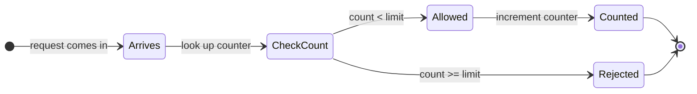

Everything we add later (shared Redis, local caches, fail-open modes, burst allowances) is a complication on top of this single diagram.

> **Take this with you.** A rate limiter is a counter lookup, an increment, and a yes-or-no decision. All the engineering is in making those three steps fast, shared, and fault-tolerant.

---

## Step 2: Ask the right questions

In a real interview, sit quietly for two minutes. Write down the questions that change the design if the answer changes. Not twenty. Five.

<details markdown="1">
<summary><b>Show: 5 questions that change the design</b></summary>

1. **What do you limit on?** Per IP? Per API key? Per user? Some combination? *This is the biggest question. Per-IP fails the moment 10,000 employees at one company share a NAT address. Per-API-key is the right default for a public API. Layered checks catch more abuse vectors.*

2. **What does "100 requests per minute" mean exactly?** Does the window reset on the clock at :00, or does it roll with the client? *Fixed windows are simpler but have a boundary problem: a client can send 100 at 11:59:59 and 100 at 12:00:00 and get 200 in two seconds.*

3. **What happens when the counter store goes down?** Let everything through (fail-open)? Block everything (fail-closed)? *A business question, not a technical one. Most public read APIs fail-open. Payment endpoints fail-closed.*

4. **Are all requests the same cost?** One search query versus one health check? *Cost-based limits add real complexity. "100 units per minute, a search costs 5, a lookup costs 1" is a common pattern at scale.*

5. **How much latency can the check add?** Under 1ms means in-process only. Under 5ms means one Redis round trip. *This sets the latency budget for the whole design.*

The two that matter most: **what do you limit on**, and **what happens when the store is down**. If you skip those, you are answering a smaller, easier problem.

</details>

---

## Step 3: How big is this thing?

The interviewer gives you the numbers.

| Dimension | Value |
|-----------|-------|
| Peak QPS | 300,000 |
| Distinct API keys | 100,000 |
| Free tier limit | 100 req/min |
| Pro tier limit | 1,000 req/min |
| Enterprise tier limit | 10,000 req/min |
| Gateway nodes | 200 |
| Latency budget for the check | 2ms at P99 |

<details markdown="1">
<summary><b>Show: what the numbers mean</b></summary>

**Counter writes per second.**
Every request bumps a counter. 300K QPS at peak means 300K writes per second to start. Keep a few counters per client (per-minute, per-hour, per-route) and it becomes roughly 1 million Redis ops per second at peak.

**Memory for all the counters.**
100K clients x 3 counters each x 100 bytes per counter = **30MB**. Tiny. Fits comfortably on one Redis node. We shard for availability, not capacity.

**Per-node QPS.**
300K / 200 nodes = **1,500 checks per second per gateway**. Easy in-process. The risk is not CPU, it is the number of Redis round trips.

**Redis ops if every check is a round trip.**
300K req/sec x 2 ops per check (read + conditional increment) = 600K ops/sec. One Redis instance handles about 100K ops/sec comfortably. So we either shard, or we cut the number of round trips, or both.

The state is small. The challenge is **how often we touch the store**, not how much we store.

</details>

> **Take this with you.** State is not the problem. Round trips are. Every design decision that follows is about cutting the number of Redis calls.

---

## Step 4: The smallest thing that works

Forget 200 gateway nodes. We are a 10-person company. One gateway. One Redis. One table of limits.

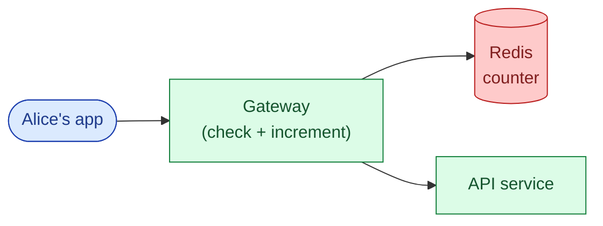

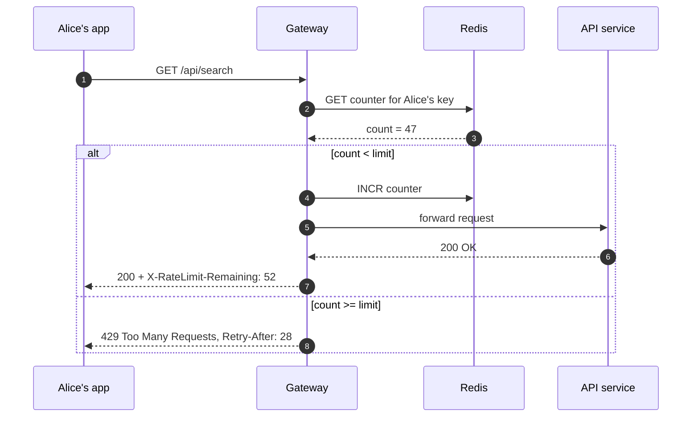

That is the whole product in one picture. Everything we add from here is a response to a real problem.

> **Take this with you.** Start from this. The interesting part of the interview is what breaks when you add the second gateway node.

---

## Step 5: The first crack - two nodes, one counter

The next morning, the team deploys a second gateway node for redundancy.

Now you have a problem. Each node has its own in-memory counter. Alice sends 100 requests. 50 land on node 1, 50 land on node 2. Node 1 sees 50, node 2 sees 50. Both say "still under the 100 limit." Alice actually sent 100, but neither node blocked her.

With 200 nodes, Alice could send 100 requests to each node and get 20,000 through. This is the core problem. **A counter that is not shared is not a rate limiter.**

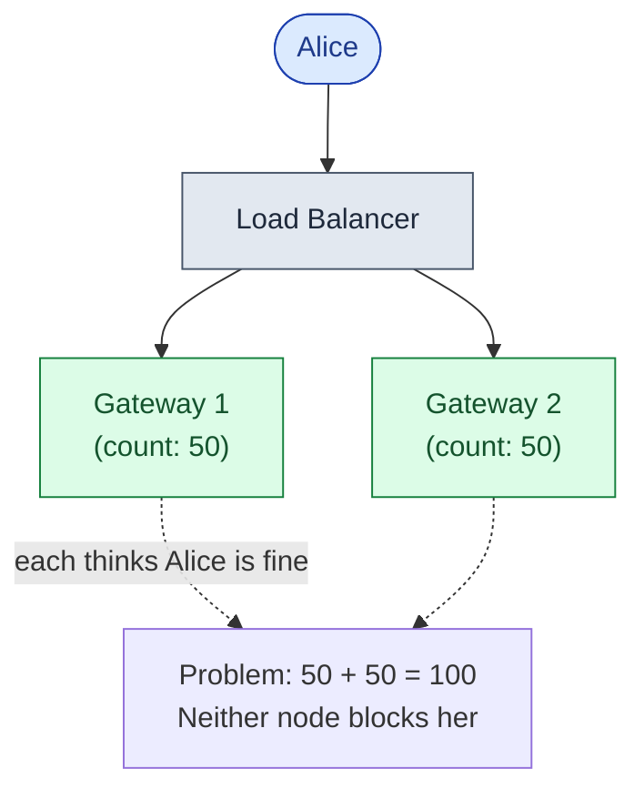

The fix: move the counter to Redis. All 200 gateways share one counter per client. The math stays honest.

<details markdown="1">
<summary><b>Show: the shared counter approach</b></summary>

The gateway runs an atomic Lua script on Redis. One call does the read, the comparison, and the increment. Atomic means two gateways cannot both read count=99 and both increment to 100. One wins. The other sees 100 and rejects.

```lua
-- KEYS[1] = "rl:apikey:sk_live_xyz:1716381600"
-- ARGV[1] = limit, ARGV[2] = window_seconds, ARGV[3] = cost
local count = tonumber(redis.call('GET', KEYS[1])) or 0
local limit = tonumber(ARGV[1])
local cost  = tonumber(ARGV[3])
if count + cost > limit then
    return {0, 0}
end
local new = redis.call('INCRBY', KEYS[1], cost)
redis.call('EXPIRE', KEYS[1], tonumber(ARGV[2]) * 2)
return {1, limit - new}
```

This is a fixed-window counter: the key includes the minute-aligned timestamp. It is simple and it works. Section 6 covers why a sliding window counter is better.

</details>

> **Take this with you.** Shared state is required. The question is how to share it without making every API call slow.

---

## Step 6: Build the architecture, one layer at a time

We need shared Redis. Now build the rest. One layer at a time.

### v1: gateway calls Redis on every request

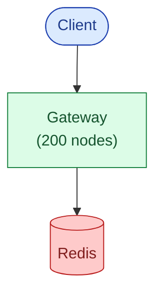

This works. But 300K req/sec x 1 round trip each = 300K Redis ops/sec. One Redis node handles 100K comfortably. We need sharding.

### v2: shard Redis by client key

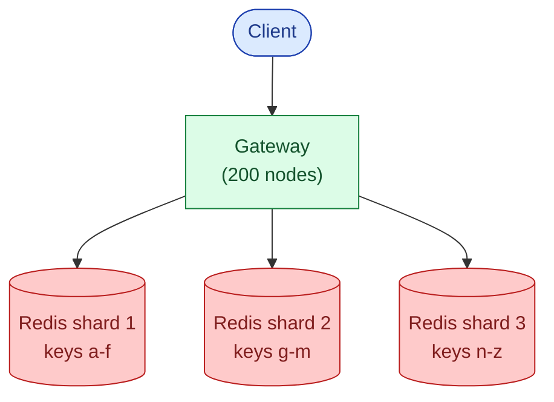

One client's counters always land on the same shard. The Lua script can read current-window and previous-window keys atomically, because they are on the same shard. Six shards with one replica each handles 300K op/sec with headroom.

### v3: local LRU cache to cut Redis traffic

The most abusive clients are the ones pounding you 1,000x over their limit. They are also the ones you most need to stop *without* burning Redis bandwidth. Add a tiny in-process LRU cache on each gateway. If a key was over-limit 50ms ago, fast-fail without calling Redis at all.

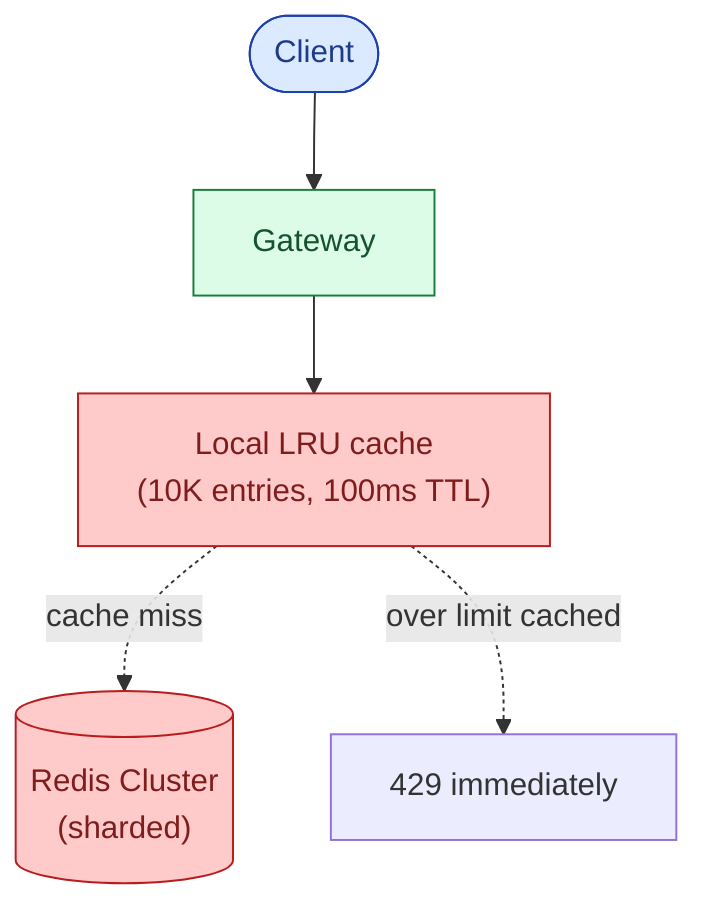

For a client hammering at 100x their limit, only the first few requests per window hit Redis. Everything else fast-fails on the local cache. Redis traffic drops by 80-90% for exactly the clients who would otherwise flood it.

### v4: config service, decision log, full picture

Limits come from a config table (tiers, overrides). Rejections go to a decision log so customer support can answer "why was I blocked yesterday?"

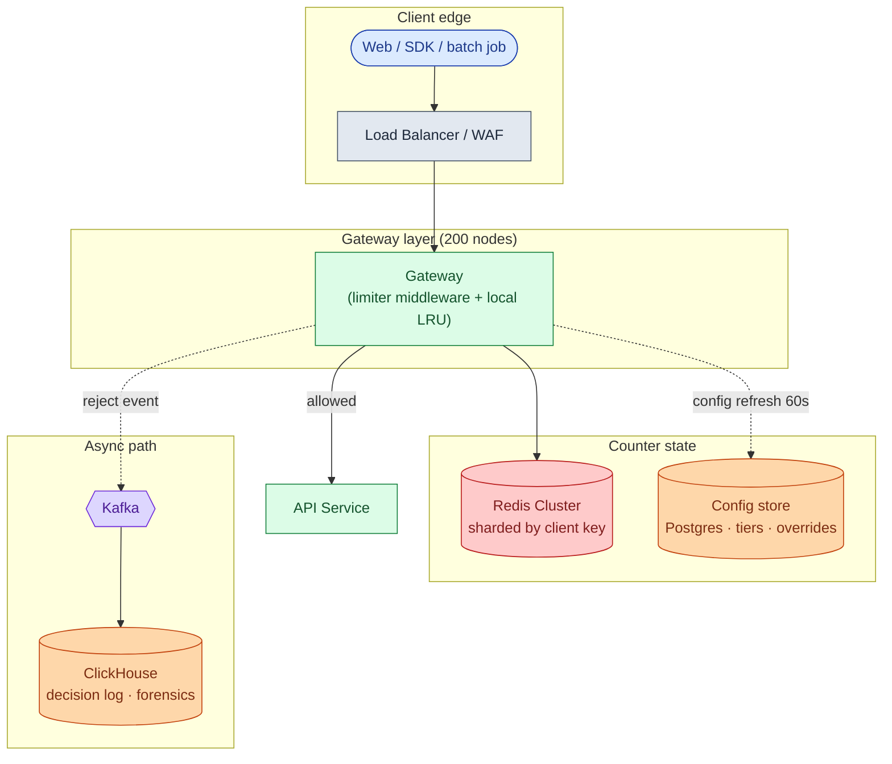

Each box in one line:

| Box | What it does |
|-----|--------------|
| **Load Balancer / WAF** | TLS termination, IP-level blocking, distributes to gateway nodes. |
| **Gateway + limiter middleware** | Runs the check. Library, not a separate service. |
| **Local LRU** | Fast-fails known-over-limit keys. Cuts Redis load by 80%+ for abusers. |
| **Redis Cluster** | Shared counters. Sharded by client key. Lua script for atomic check-and-increment. |
| **Config store** | Tiers, per-client overrides, route costs. Refreshed every 60 seconds by each gateway. |
| **Kafka + ClickHouse** | Every rejection event. Answers "why was customer X blocked at 3pm yesterday?" |

> **Take this with you.** The limiter is a library running inside the gateway, not a separate service. Adding a network hop would blow the 2ms latency budget.

---

## Step 7: One request, all the way through

Alice has a pro account. Limit is 1,000 req/min. She is at count 847. She sends another request.

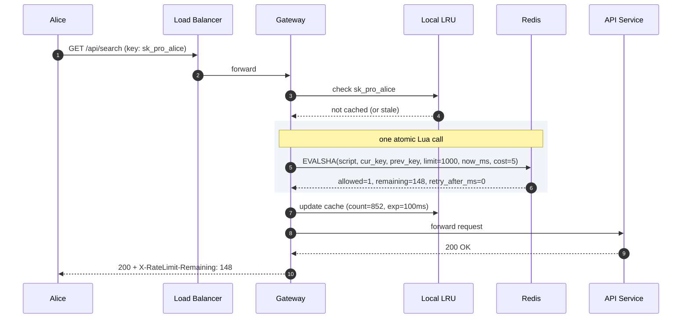

Now Alice sends one more request after she has hit the limit exactly:

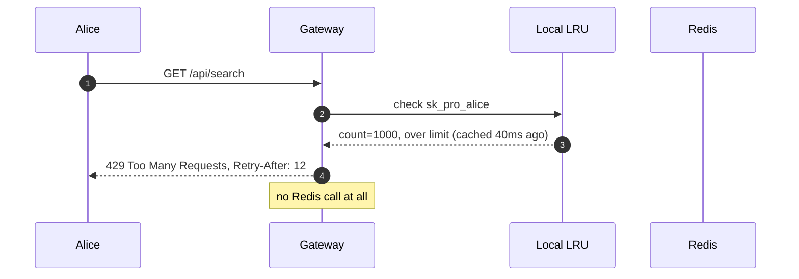

Two details to notice:

1. The search query costs 5 units. The Lua script does `INCRBY 5` not `INCR 1`. A health check would cost 0 (free pass).
2. The second flow never touches Redis. The LRU absorbed it. This is what cuts Redis load during an abuse spike.

---

## Step 8: The algorithm choice

There are five common rate limiting algorithms. The choice is not obvious.

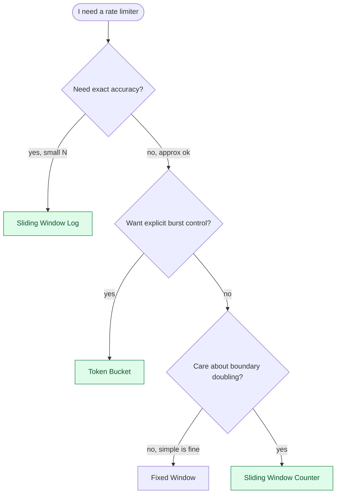

<details markdown="1">
<summary><b>Show: algorithm comparison and why sliding window counter wins</b></summary>

| Algorithm | Memory per client | Burst behavior | Boundary problem | When to pick it |
|-----------|-------------------|----------------|------------------|-----------------|
| **Token bucket** | ~16 bytes | Explicit: bucket_size burst, then throttles to R | None | When you want a burst ceiling with a steady rate after |
| **Leaky bucket** | ~16 bytes + queue | Smooths spikes by queuing them | None | Network shaping, not APIs: queuing adds latency |
| **Fixed window** | ~16 bytes | Burst at start of window | Doubles at boundary: 100 at 11:59 + 100 at 12:00 = 200 in 2s | Advisory limits where doubling is acceptable |
| **Sliding window log** | 8 bytes per request | Ideal | None | Low-traffic, small N, high-value endpoints |
| **Sliding window counter** | ~24 bytes | Close to ideal, no jump | ~1% inaccuracy vs true sliding | Almost everything else |

**The sliding window counter** is the right default. O(1) memory, no boundary doubling, fits in a 15-line Lua script, 1% inaccuracy is invisible.

**How it works.** Keep two fixed-window counters: current and previous. Weight the previous by how much time is left in the window.

```
estimated = current + previous * (1 - elapsed / window)
```

At 30 seconds into the current minute, with 80 requests in the previous minute and 40 in the current:

```
estimated = 40 + 80 * (1 - 30/60) = 40 + 40 = 80
```

No boundary jump. As the window turns over, the previous minute's contribution decays from 100% to 0% smoothly.

**Token bucket** is a strong second choice. AWS, Stripe, and most public clouds use it. Pick it when you want an explicit burst: "200 requests in the first second, then 1 per second after."

</details>

<details markdown="1">
<summary><b>Show: the full sliding window Lua script</b></summary>

```lua
-- KEYS[1] = current window key   e.g. "rl:apikey:sk_xyz:search:1716381660"
-- KEYS[2] = previous window key  e.g. "rl:apikey:sk_xyz:search:1716381600"
-- ARGV[1] = limit
-- ARGV[2] = window_seconds
-- ARGV[3] = now_ms
-- ARGV[4] = cost (default 1)
-- Returns: { allowed (0|1), remaining, retry_after_ms }

local limit          = tonumber(ARGV[1])
local window_seconds = tonumber(ARGV[2])
local now_ms         = tonumber(ARGV[3])
local cost           = tonumber(ARGV[4])

local current  = tonumber(redis.call('GET', KEYS[1])) or 0
local previous = tonumber(redis.call('GET', KEYS[2])) or 0

local window_ms   = window_seconds * 1000
local elapsed_ms  = now_ms % window_ms
local prev_weight = (window_ms - elapsed_ms) / window_ms

local estimated = current + math.floor(previous * prev_weight)

if estimated + cost > limit then
    local need_to_shed   = (estimated + cost) - limit
    local retry_after_ms = math.ceil((need_to_shed / math.max(previous, 1)) * window_ms)
    return { 0, 0, retry_after_ms }
end

local new_current = redis.call('INCRBY', KEYS[1], cost)
redis.call('EXPIRE', KEYS[1], window_seconds * 2)

local remaining = math.max(0, limit - (estimated + cost))
return { 1, remaining, 0 }
```

Five things worth pointing at:

- One Redis round trip: two GETs, one conditional INCRBY, one EXPIRE, all inside one Lua execution.
- Atomic: two concurrent requests cannot both pass the check at count = limit - 1.
- Clock from the caller, not Redis. If Redis decides "now," clock skew during failover maps the same key to different windows.
- `cost` supports cost-based limits at zero extra cost.
- `retry_after_ms` is computed, not a fixed guess.

</details>

---

## Step 9: What Redis dying actually means

This question separates senior from mid-level. Most candidates have not thought it through.

Three failure modes:

**One Redis shard fails.** Its replica gets promoted. There is a 10-30 second window where some counters serve stale data. Acceptable. Redis Sentinel or Redis Cluster handles this automatically.

**One gateway loses its Redis connection.** Others still have it. That node falls back to in-process counters. It under-counts. A client can get extra requests through it. Bound the damage with a stricter local ceiling. The load balancer should fail that node's health check and stop sending traffic to it.

**The whole Redis cluster is down.** This is the interesting one.

<details markdown="1">
<summary><b>Show: fail-open vs fail-closed, by route</b></summary>

| Route class | Fail mode | Why |
|-------------|-----------|-----|
| `/api/search`, `/api/list` (reads) | fail-open | API uptime matters more than perfect enforcement |
| `/api/transfer`, `/api/pay` (money) | fail-closed | Abuse risk is bigger than downtime risk |
| `/api/login` (auth) | fail-closed | Brute-force protection is the whole point |
| `/api/webhook` (callbacks) | fail-open with stricter local cap | Webhooks must keep flowing |

Set the fail mode per route, not globally. The config service owns this. Engineering and security sign off on any fail-closed route.

Whatever mode you pick, make the failure loud: page on Redis cluster down, emit a `limiter.degraded_mode` metric from each gateway, run a canary test that verifies the limiter rejects over-limit requests.

</details>

> **Take this with you.** "What happens when Redis dies?" is the question. "We just use Redis" is not an answer.

---

## Step 10: What to return on a reject

The request is over-limit. What do you send back?

**Status code: 429 Too Many Requests.** Not 503. 503 means "the server is overloaded, try again anywhere." 429 means "*you* specifically are over your limit; other clients are fine."

**Headers:**

```
HTTP/1.1 429 Too Many Requests
Retry-After: 28
X-RateLimit-Limit: 1000
X-RateLimit-Remaining: 0
X-RateLimit-Reset: 1716381660
```

**JSON body:**

```json
{
  "error": "rate_limited",
  "message": "Request exceeds rate limit of 1000 requests per minute.",
  "retry_after_seconds": 28,
  "doc_url": "https://api.example.com/docs/rate-limits"
}
```

Three things that matter here:

- **Send `X-RateLimit-*` on every response, not just 429s.** Good clients self-throttle using these. They never get to 429 in the first place.
- **`Retry-After` is computed, not guessed.** For a sliding window: the time until enough of the previous window rolls off. For a token bucket: time until the next token refills.
- **Include a doc URL.** It is the single most effective thing you can do to cut support tickets.

---

## Follow-up questions

Try answering each in 2 or 3 sentences before opening the solution.

1. **Multiple keys per request.** A request has an IP, an API key, and a user_id. Do you check all three limits in parallel or one after the other? What if the API key limit allows it but the IP limit does not?

2. **Limits per route.** `/api/search` is expensive. `/api/health` is cheap. Same client, same tier. How do you express this in the data model?

3. **Cost-based limits.** Instead of "1,000 requests per minute," the limit is "1,000 units per minute." A search costs 5 units. A lookup costs 1. What changes in the limiter?

4. **Burst allowance.** A client should be able to send 200 in the first 10 seconds, but still hit a total of 1,000 per minute. Which algorithm? How do you configure it?

5. **IP rotation (botnet).** An attacker rotates through 10,000 different home IPs. Per-IP limits do nothing. What do you do?

6. **Customer override.** An enterprise customer negotiated a 100x limit. Where do you store the override? How fresh must it be? What if the override service is down?

7. **Distributed accuracy.** Two requests from the same client land on two gateway nodes within 1ms. Both check Redis. Both see count = 99 (under a 100 limit). Both INCR. Now count = 101 and both were allowed. What stops this?

8. **Pre-warming a known burst.** A customer says they will run a batch job at 2 AM that needs 10,000 requests in 60 seconds, well above their normal limit. How do you let them through without raising their permanent limit?

9. **"User got popular."** A blog post hits the front page. A user's API endpoint sees 10x traffic. The limiter blocks them. Is that correct? How would you build a smarter signal?

10. **The limiter is the bottleneck.** Your dashboard shows the limiter middleware adds 8ms to P99 latency. Your budget was 2ms. Where do you look first?

---

## Related problems

- **[URL Shortener (001)](../001-url-shortener/question.md).** The `POST /links` endpoint sits behind exactly this kind of limiter. The design plugs in directly.
- **[Distributed Cache (009)](../009-distributed-cache/question.md).** The Redis cluster backing the limiter is a distributed cache. The eviction, sharding, and replication choices there set the limiter's failure modes.
- **[News Feed (002)](../002-news-feed/question.md).** Both the `POST /posts` endpoint and the timeline read path need rate limiting. The cost-based pattern in follow-up 3 is exactly how feeds throttle expensive ranking queries.
