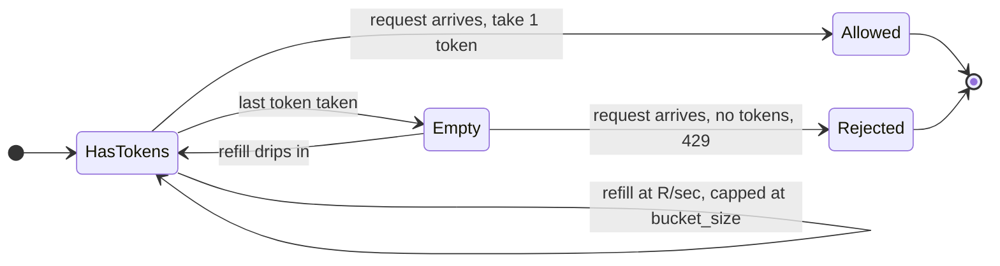
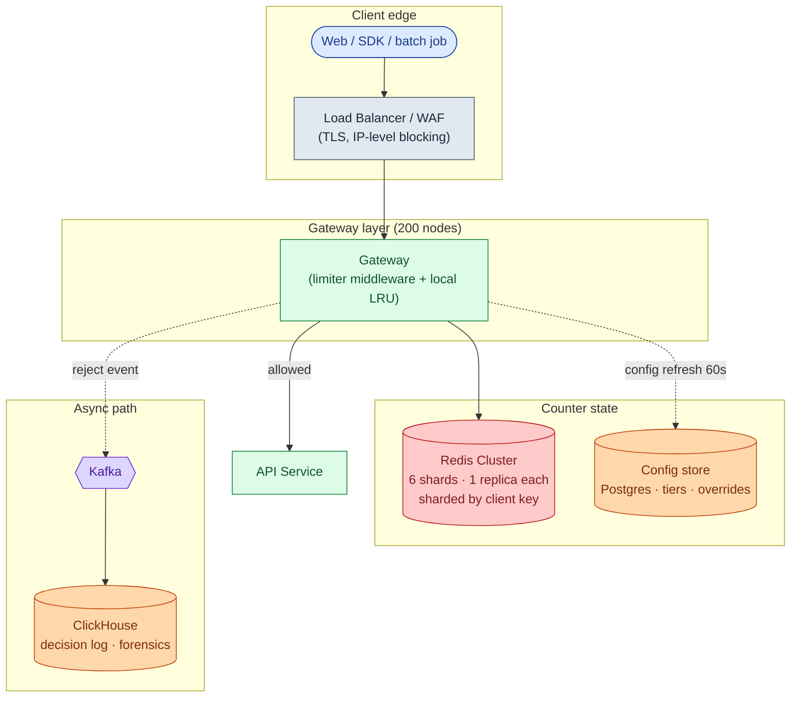
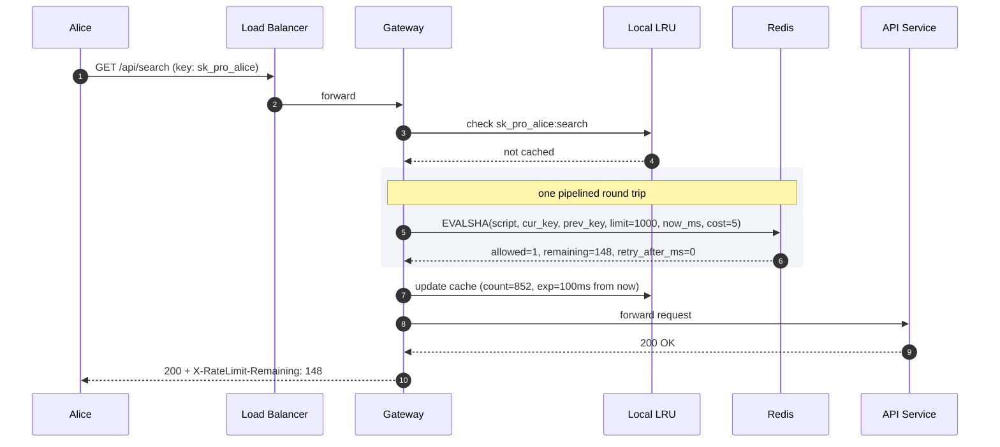
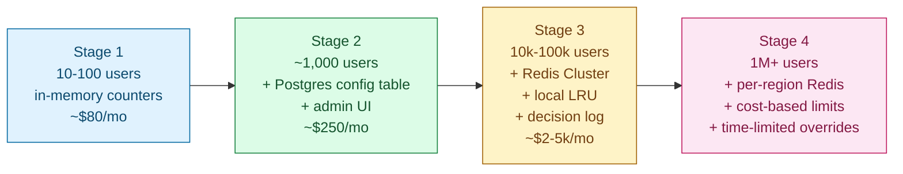

## Solution: Rate Limiter

### What this system is

A rate limiter is a counter lookup with a yes-or-no decision. It sits inside the API gateway as middleware, not as a separate service. It enforces per-client quotas by keeping a shared counter in Redis, checking it atomically on every request, and returning 429 when the client is over their limit.

The algorithm is the easy part. What actually matters:

- **Where does the check run?** In-process middleware on each gateway, not a separate service. A separate service adds one network hop per API call and blows the latency budget.
- **How do 200 nodes share state?** Redis Cluster, one atomic Lua script per check, sharded by client key.
- **What happens when Redis dies?** Configurable per route. Public reads fail-open. Payment and auth endpoints fail-closed.
- **How do you keep the check under 2ms?** A tiny per-node LRU cache that fast-fails over-limit clients without touching Redis.

The best algorithm for almost every case is the **sliding window counter**: O(1) memory, no boundary doubling, 15 lines of Lua. Token bucket is a strong second when you need explicit burst ceilings.

---

### 1. The two questions that matter most

If you only get to ask two clarifying questions, ask these.

**What do you limit on?** Per IP? Per API key? Per user? All three? Per-IP fails immediately against corporate NAT and IP rotation. Per-API-key is the right default. Layered keys (IP + API key + user) catch more abuse vectors.

**What happens when the counter store is down?** This is a business question. Public read APIs usually fail-open (enforce nothing, keep serving). Payment and auth endpoints fail-closed (stop serving rather than allow abuse). If you do not have an answer to this, you have not finished the design.

---

### 2. The math

| Number | Value | Why it matters |
|--------|-------|----------------|
| Peak QPS | 300,000 | Drives Redis sizing |
| Counter writes/sec | 300K to 1M (multiple counters per client) | One Redis handles ~100K/sec, so sharding is required |
| Total state | ~30 MB | Tiny. Shard for availability, not capacity |
| Per-node QPS | 1,500 | Easy in-process. The cost is round trips, not compute |
| Wire bytes per check | ~120 | Negligible. Round trips are what hurt |

State is small. Requests are many. Every request must touch the limiter. Everything else is a consequence of those three facts.

---

### 3. The API and headers

The limiter is internal middleware. It does not have a public API. It produces headers on every API response.

**Allowed:**

```
HTTP/1.1 200 OK
X-RateLimit-Limit: 1000
X-RateLimit-Remaining: 847
X-RateLimit-Reset: 1716381660
```

**Rejected:**

```
HTTP/1.1 429 Too Many Requests
Retry-After: 28
X-RateLimit-Limit: 1000
X-RateLimit-Remaining: 0
X-RateLimit-Reset: 1716381660
Content-Type: application/json

{
  "error": "rate_limited",
  "message": "Request exceeds rate limit of 1000 requests per minute.",
  "retry_after_seconds": 28,
  "doc_url": "https://api.example.com/docs/rate-limits"
}
```

Four choices worth defending:

| Choice | Reason |
|--------|--------|
| 429, not 503 | 503 means "the server is overloaded, try anywhere." 429 means "you are over your limit, others are fine." |
| `Retry-After` is required | Well-written SDKs respect it. Sending it costs nothing. |
| Headers on success too | Good clients self-throttle. They never reach 429. |
| Include a doc URL | The single most effective way to cut support tickets. |

---

### 4. The data model

Two storage layers. Live counters in Redis. Config in Postgres.

**Live counters (Redis keys):**

```
rl:{scope}:{identifier}:{route_class}:{window_start_ts}
```

Examples:

```
rl:apikey:sk_live_xyz789:search:1716381600    -> integer count, TTL 120s
rl:ip:198.51.100.42:default:1716381600        -> integer count, TTL 120s
rl:user:user_42:write:1716381600              -> integer count, TTL 120s
```

The sliding window counter reads two keys per check: current window and previous window. TTL is 2x the window length so the previous key is still readable. A key without TTL is a memory leak.

**Config store (Postgres):**

<details markdown="1">
<summary><b>Show: the config schema</b></summary>

```sql
CREATE TABLE rate_limit_tiers (
    tier_name        VARCHAR(32) PRIMARY KEY,
    default_limit    INTEGER NOT NULL,
    window_seconds   INTEGER NOT NULL,
    burst_multiplier NUMERIC(3,2) NOT NULL DEFAULT 1.00
);

CREATE TABLE rate_limit_overrides (
    api_key        VARCHAR(64) NOT NULL,
    route_class    VARCHAR(32) NOT NULL,
    limit_value    INTEGER NOT NULL,
    window_seconds INTEGER NOT NULL,
    valid_until    TIMESTAMPTZ,
    reason         TEXT,
    PRIMARY KEY (api_key, route_class)
);

CREATE TABLE rate_limit_route_costs (
    route_pattern  VARCHAR(128) NOT NULL,
    route_class    VARCHAR(32) NOT NULL,
    cost_units     INTEGER NOT NULL DEFAULT 1,
    PRIMARY KEY (route_pattern)
);
```

Three things doing real work:

- Tiers are a tiny static table. Each gateway loads it at startup and refreshes every 60 seconds. A tier change takes up to one minute to spread. Acceptable: limits are not security boundaries.
- Overrides are keyed by (api_key, route_class). An enterprise customer with raised search limits but default write limits is two rows, not one JSON blob.
- Route costs are in a separate table. Pricing team owns costs. Sales team owns overrides. Separate tables prevent merge conflicts and confused ownership.

</details>

---

### 5. The algorithm

The **sliding window counter** is the right default. Keep two fixed-window counters (current window, previous window) and compute a weighted blend.

If we are 30 seconds into the current minute, with 80 requests in the previous minute and 40 in the current:

```
estimated = current + previous * (1 - elapsed / window)
          = 40 + 80 * (1 - 30/60)
          = 80
```

No boundary jump. As time passes, the previous window's contribution decays from 100% to 0% smoothly.



The diagram above is the **token bucket** state machine, shown as the second option. Use it when you need an explicit burst ceiling: "200 requests in the first second, then 1/second after." Two knobs: `bucket_size` (max burst) and `refill_rate` (sustained throughput).

Key properties of the Lua implementation (full script in `question.md`):

- One Redis round trip per check (two GETs + one conditional INCRBY, all inside one Lua execution).
- Atomic at the shard level. Two concurrent requests cannot both pass the check at count = limit - 1.
- Clock from the caller, not Redis. Prevents window mismatches during failover.
- `cost` parameter supports cost-based limits at zero extra Redis calls.

---

### 6. How the gateway resolves a check

The limiter is in-process middleware. Per-request flow:

1. Auth middleware extracts `(api_key, user_id, ip)` from the request.
2. Limiter computes rate limit keys: typically 2-4 per request (per-API-key, per-IP, per-user, per-API-key-per-route).
3. For each key, check the **local LRU**. If any key is over-limit and the cache entry is fresh, reject immediately. No Redis call.
4. If no fast-path hit, run all checks against Redis in one **pipelined batch**: one EVALSHA per key, one round trip total.
5. Take the most restrictive result. If any key is rejected, the request is rejected.
6. Update the local LRU with the new counts.
7. If allowed: forward to the API service, attach `X-RateLimit-*` headers to the response.
8. If rejected: return 429, emit a rejection event to Kafka.

<details markdown="1">
<summary><b>Show: gateway-side limiter code</b></summary>

```python
SCRIPT_HASH = redis.script_load(LUA_SCRIPT)

class Limiter:
    def __init__(self, redis_client, local_cache_size=10000):
        self.redis = redis_client
        self.lru = LRUCache(local_cache_size)

    def check(self, api_key, route_class, cost=1):
        tier = config.get_tier_for(api_key)
        limit, window_s = tier.limit, tier.window_seconds

        now_ms = time.time_ns() // 1_000_000
        window_start = (now_ms // 1000 // window_s) * window_s
        prev_start = window_start - window_s

        cur_key  = f"rl:apikey:{api_key}:{route_class}:{window_start}"
        prev_key = f"rl:apikey:{api_key}:{route_class}:{prev_start}"

        cached = self.lru.get(cur_key)
        if cached and cached.count_estimate >= limit and cached.exp_ms > now_ms:
            return RateLimitResult(allowed=False, remaining=0,
                                   retry_after_ms=cached.exp_ms - now_ms)

        try:
            allowed, remaining, retry_ms = self.redis.evalsha(
                SCRIPT_HASH, 2, cur_key, prev_key,
                limit, window_s, now_ms, cost)
        except RedisError:
            return self._fail_mode(api_key, route_class, cost)

        self.lru.set(cur_key, CachedCount(
            count_estimate=limit - remaining,
            exp_ms=now_ms + 100
        ))

        return RateLimitResult(allowed=bool(allowed),
                               remaining=remaining,
                               retry_after_ms=retry_ms)

    def _fail_mode(self, api_key, route_class, cost):
        if config.fail_open_for(route_class):
            metrics.increment("limiter.degraded.fail_open")
            return RateLimitResult(allowed=True, remaining=-1, retry_after_ms=0)
        else:
            metrics.increment("limiter.degraded.fail_closed")
            return RateLimitResult(allowed=False, remaining=0, retry_after_ms=5000)
```

The LRU has a 100ms TTL per entry. Short enough that a real recovery is honored. Long enough to absorb the next 5-10 requests from an abusive client without hitting Redis.

</details>

---

### 7. The architecture



Five things to notice:

- The limiter is **in-process middleware**. A separate "rate limiter service" adds one network hop per API call. That doubles the latency budget.
- The **local LRU** on each gateway cuts Redis traffic by 80%+ for abusive clients. The clients you most need to stop are the ones least likely to hit Redis after the first few requests.
- **Redis is sharded by client key.** All counters for one client land on the same shard. The Lua script reads current-window and previous-window keys atomically, with no cross-shard coordination needed.
- The **config service** is read-mostly. Each gateway refreshes every 60 seconds. If the config service dies, gateways use their last-known config.
- The **decision log** captures every rejection. When customer support asks "why was customer X blocked at 3pm yesterday?", you have an answer. Redis counters have already expired by then.

---

### 8. A request, end to end



Target latencies:

| Operation | P99 |
|-----------|-----|
| Allowed request (LRU hit, no Redis) | ~0.5ms |
| Allowed request (LRU miss, Redis call) | ~2ms |
| Rejected (LRU hit) | ~0.3ms |

---

### 9. The scaling journey: 10 users to 1 million



#### Stage 1: 10 to 100 users

One app instance. In-memory counter dictionary. No Redis. Limits are constants in code. About $80/month.

Enough because you see ten requests a minute. Building more is over-engineering.

#### Stage 2: 1,000 users

What breaks: a customer asks for a higher limit and you have to deploy code to give it to them.

Move limits to a `rate_limit_tiers` Postgres table. Add a simple admin UI for overrides. Still one app instance, so in-memory counters are fine. ~$250/month.

#### Stage 3: 10,000 to 100,000 users

Multiple app instances. In-memory counters drift. A client can get Nx their limit, where N is the number of instances.

Add Redis. Atomic Lua script for check + increment. Add the local LRU. Shard Redis by client key with 6 primary shards, one replica each. Add the decision log to Kafka and ClickHouse. Add per-route fail mode. Cost: $2-5K/month.

#### Stage 4: 1 million users

New problems: EU data residency, expensive-vs-cheap route costs, enterprise batch bursts, botnet attacks rotating IPs.

Add per-region Redis clusters (counters are not synced cross-region: a client using two regions can get up to 2x their limit, which is acceptable and documented). Add cost-based limits via the `cost` parameter. Add time-limited overrides via `valid_until`. Add layered keys and an abuse-detection pipeline.

The core architecture has not changed since Stage 3. You added regions, knobs, and a separate abuse pipeline.

---

### 10. Reliability

**Redis shard failure.** Sentinel or Cluster promotes the replica. During the 10-30 second window, some counters serve stale data. The gateway falls into degraded mode. Fail-open or fail-closed per route.

**Network partition.** One gateway loses Redis while others keep it. That gateway should fail its health check and stop receiving traffic. Serving rate-limited traffic from a node that cannot enforce limits is worse than taking it out of rotation.

**Slow Redis.** Use a per-call timeout (5ms) with a circuit breaker. After N consecutive timeouts the gateway flips to degraded mode. This prevents Redis latency from bleeding into API latency.

**Full cluster outage.**

| Route class | Fail mode | Why |
|-------------|-----------|-----|
| `/api/search`, `/api/list` | fail-open | Uptime matters more than enforcement |
| `/api/transfer`, `/api/pay` | fail-closed | Abuse risk is bigger than downtime |
| `/api/login` | fail-closed | Brute-force protection is the whole point |
| `/api/webhook` | fail-open with stricter local cap | Webhooks must keep flowing |

**Counter drift after failover.** If a Redis primary dies before AOF sync, some counters reset to zero. Affected clients get a small extra allowance. Acceptable.

**Lua script bug.** A bad script can lock a Redis shard. Scripts are versioned. The gateway sends a `SCRIPT_HASH` it can roll back. Canary new scripts to one gateway, watch metrics for 10 minutes, then roll out.

---

### 11. Observability

| Metric | Why it matters |
|--------|----------------|
| `limiter.check.latency.p99` per gateway | Over 5ms means slow Redis, bad Lua, or connection pool exhaustion |
| `limiter.rejections_per_sec` by tier | Spike means abuse or a customer hitting their cap |
| `limiter.local_cache_hit_rate` | Should be >50% for hot keys. Drop suggests key churn or a rotating-key attack |
| `limiter.redis_op_rate` | Tracks Redis load, drives sharding decisions |
| `limiter.degraded_mode.fail_open_count` | Critical: Redis unreachable from at least one node |
| `limiter.degraded_mode.fail_closed_count` | Critical: same, on a fail-closed route |
| `limiter.script_eval_errors` | Lua failures (script update bugs) |
| `config.refresh.lag_seconds` | Stale config means wrong limits |

Page on: `limiter.check.latency.p99 > 5ms for 5 minutes`. Any `limiter.degraded_mode.*` sample. Any `script_eval_errors`.

Ticket on: rejection rate spike on any tier. Cache hit rate sustained drop.

---

### 12. Follow-up answers

**1. Multiple keys per request.**

Check all three (per-IP, per-API-key, per-user) in **parallel via one Redis pipeline**: one round trip, three EVALSHAs. Take the most restrictive result. Each key catches a different abuse vector. Checking sequentially adds 3x latency. Checking only one leaves a gap.

**2. Limits per route.**

Map URL patterns to a `route_class`:

```
/api/v1/search    -> "search"
/api/v1/transfer  -> "write"
/health           -> "free"   (cost = 0, always passes)
```

The rate limit key includes `route_class`. Each client has multiple parallel counters. Search consumption does not eat into write consumption.

**3. Cost-based limits.**

The Lua script takes a `cost` parameter. The gateway looks up the cost for the matched route. The script does `INCRBY cost` instead of `INCR 1`. The check becomes `estimated + cost > limit`. Cost weights should reflect real backend cost. A search hitting Elasticsearch is 50x more expensive than a Postgres lookup, so search costs 50.

**4. Burst allowance.**

Switch the route to **token bucket**. Config:

```yaml
tier: pro
limits:
  default:
    algorithm: token_bucket
    bucket_size: 200
    refill_rate: 16.67
```

The bucket holds 200 tokens and refills at 16.67/sec (1,000/min). The first 200 requests go through immediately. Then throttled to 16.67/sec. The switch is one branch in the limiter. Both algorithms have Lua scripts.

**5. IP rotation (botnet).**

Per-IP limits fail against botnets. Defense is layered:

- API-key-level limits catch a botnet rotating IPs with one stolen key.
- Behavioral signals across IPs: user-agent stability, request path patterns, inter-request timing. 10,000 IPs all hitting `/api/login` with the same user-agent and exactly 1.0s between requests is one attacker. Feed this into a fraud-detection pipeline that writes to a `blocked_keys` Redis set.
- Subscribe to a commercial IP reputation feed. Apply stricter limits to known-botnet ranges.

The limiter is one defense, not the only one. Treat it as a speed bump.

**6. Customer override.**

Stored in `rate_limit_overrides` (Postgres). Each gateway pulls a snapshot every 60 seconds. Staleness of 60 seconds is fine: limits are not transactional. If the config service is down, gateways use last-known config indefinitely.

For emergency changes ("block this customer NOW"), a separate `blocked_keys` Redis set is consulted on every request. Writing to it propagates in milliseconds. Not the everyday path.

**7. Distributed accuracy.**

The Lua script is **atomic at the Redis shard level**. Only one of two concurrent requests can read count = 99 and increment to 100. The other reads count = 100 and is rejected. Lua atomicity is the whole defense.

The only race the design accepts is the local LRU's 100ms inconsistency window. Theoretical max overshoot with 200 nodes: 400 extra requests per window. Practical overshoot in load tests: under 10. Documented. No one has complained.

**8. Pre-warming a known burst.**

Write a row to `rate_limit_overrides` with `valid_until = 2026-05-28 02:01:00`. Active only for that minute. The gateway picks it up within 60 seconds. For recurring batch use cases, a separate `/batch` endpoint with its own higher limits (backed by a separate API key) is cleaner.

**9. "User got popular."**

The limit enforced correctly if set to protect the API. Whether it was the *right* call depends on whether the goal is protecting the API or protecting the customer from runaway cost.

Smarter signals: compare the current minute's rate against the customer's 7-day P95. A 10x step-change sustained for 2 minutes triggers an automated email: "Your API saw a 10x spike. You have been temporarily throttled. Click here to raise your limit." Self-service relief. If the traffic pattern is bot-like (single user-agent, one geo, repeated path), throttle. If it is human (mixed user-agents, geo-distributed, varied paths), that is real viral traffic and it is worth auto-raising the limit for a paid account.

**10. The limiter is the bottleneck.**

Limiter middleware is adding 8ms P99. Budget was 2ms.

1. **Redis latency.** Run `redis-cli --latency`. Check shard CPU, network path, AOF sync settings.
2. **Pipelining.** Are multiple-key checks sequential instead of pipelined? 3 sequential calls x 2ms each = 6ms. Should be one pipelined call.
3. **LRU miss rate.** If the cache misses on every request, every check hits Redis. Cache too small, or every request has a unique key (sign of a rotating-key attack).
4. **Lua complexity.** Has someone added expensive logic? Profile with `SLOWLOG`.
5. **Gateway CPU.** If the pod is pegged, even fast Redis responses queue.
6. **Connection pool exhaustion.** If the Redis connection pool is small, requests wait. Raise the pool or add gateway nodes.

The first three explain ~90% of latency regressions in practice.

---

### 13. Trade-offs worth saying out loud

**Per-region vs global limits.** Per-region is the default. Cross-region counter sync adds 100ms+ to every check. Global limits exist only for enterprise contracts that require them. Document the trade-off explicitly. A client using two regions can get up to 2x their limit. That is not a bug; it is the price of low latency.

**Why the limiter is a library, not a service.** A separate rate-limiter service adds one network hop per API call. At a 2ms budget, one hop already takes 1-2ms. There is no room for another.

**Why Lua, not application-level transactions.** A read followed by a conditional write in two separate Redis calls is not atomic. Two concurrent requests can both read count = 99, both pass the check, and both increment. Lua runs serially within a Redis shard. No coordination protocol needed.

**Why not the cloud provider's managed limiter.** AWS WAF, Cloudflare, and similar tools are good for IP-level and bot mitigation. They are not flexible enough for tiered customer pricing or cost-based limits. Most production APIs use both: cloud limiter as the outer ring for IP threats, custom limiter at the gateway for business-rule enforcement.

**What to revisit at 10x scale.** Move counter state from Redis to a purpose-built counter store (ScyllaDB or a custom in-memory grid) once Redis cost becomes meaningful. Push limit checks to the edge (PoPs) for global APIs, accepting gossip-driven inaccuracy. Move tier resolution into a sidecar proxy (Envoy) so gateway code does not need to know about tiers.

---

### 14. Common mistakes

Most weak answers fall into one of these:

**"Just use a token bucket in Redis" with nothing else.** Skipped clarification. Did not address shared state across nodes. Did not address failure mode. Stops the interview.

**No local LRU.** At 300K QPS, every check is a round trip. The local LRU is the cheapest, highest-impact optimization. A senior candidate names it without prompting.

**Per-IP only.** Fails against NAT (corporate offices, mobile carriers) and against IP rotation. Layered keys is the correct answer.

**No fail-open vs fail-closed distinction.** The interviewer will ask. Have a route-level opinion, not a single global choice.

**Forgetting `Retry-After`.** Polite clients respect it. Sending it signals you have built real public APIs.

**Limiter as a separate service.** Now every API call pays two network hops instead of one. The latency budget does not survive.

**Confusing fixed and sliding windows.** Fixed resets on the clock boundary: 100 at 11:59:59 plus 100 at 12:00:00 = 200 in two seconds. Sliding counts the last N seconds rolling. The boundary doubling problem is why sliding exists.

**One Redis box, no replication, no failure plan.** Half the design score is in operational reality.

If you name 8 of these without prompting, you are interviewing at staff level. The three that separate strong from average: the local LRU, layered keys, and per-route fail mode.
