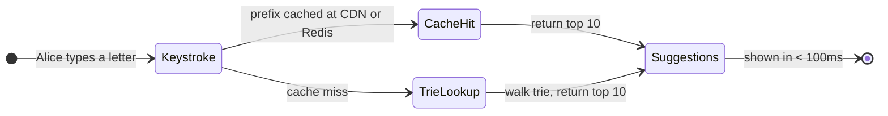
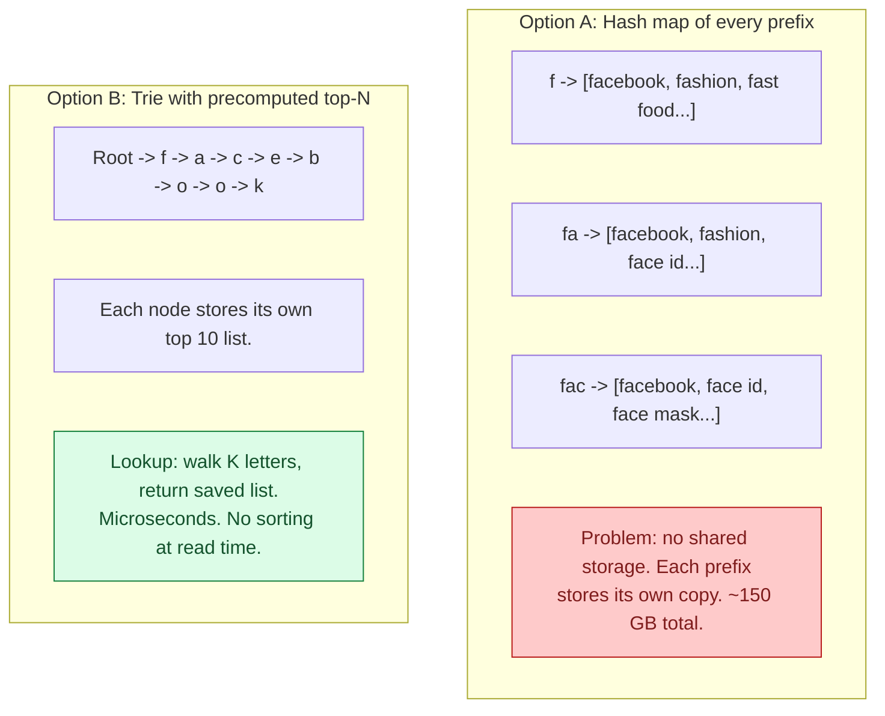
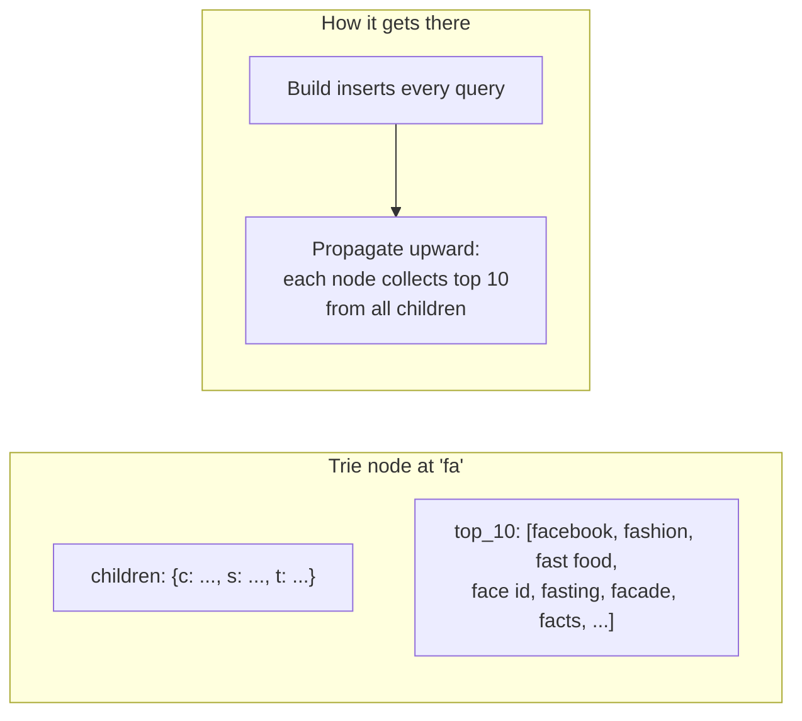
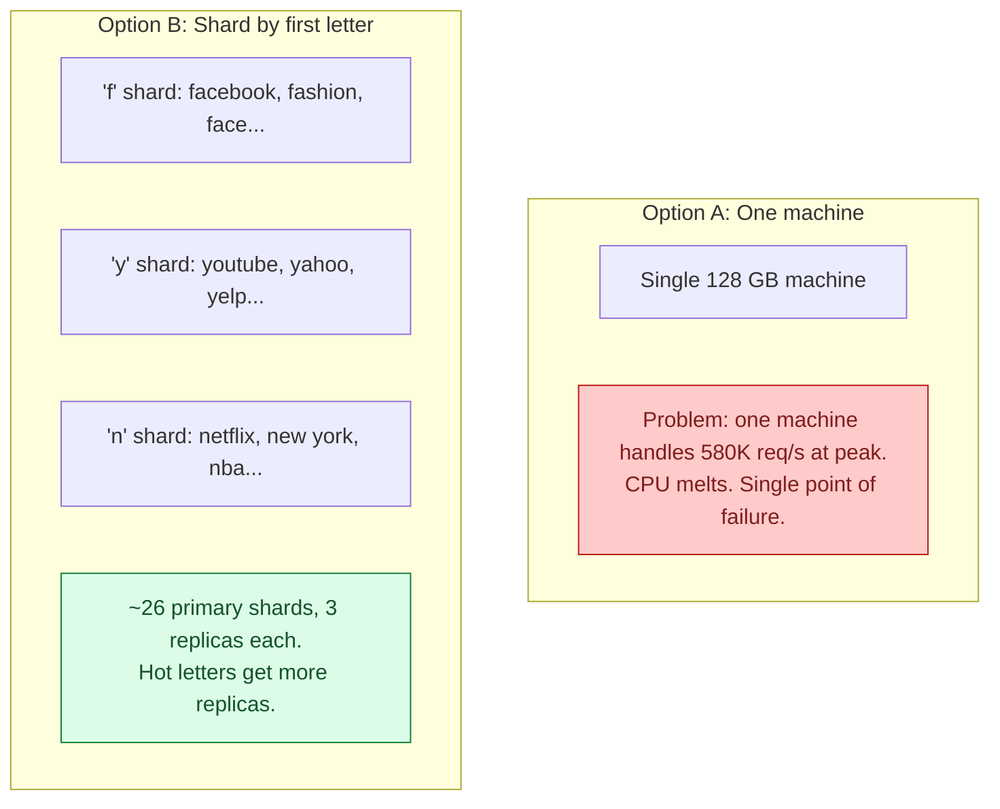
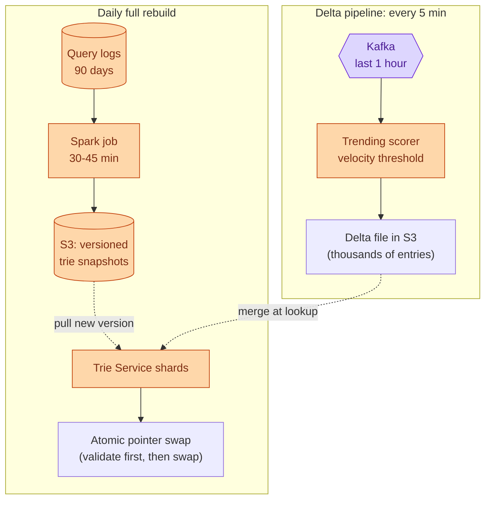
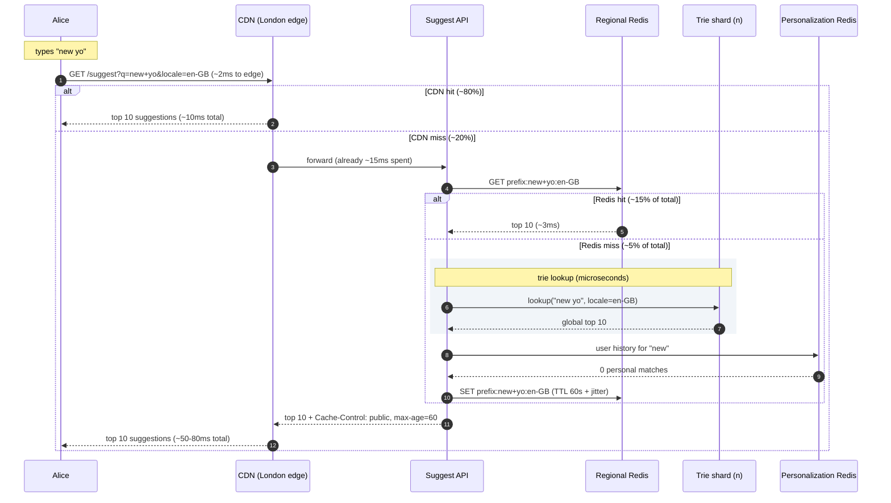
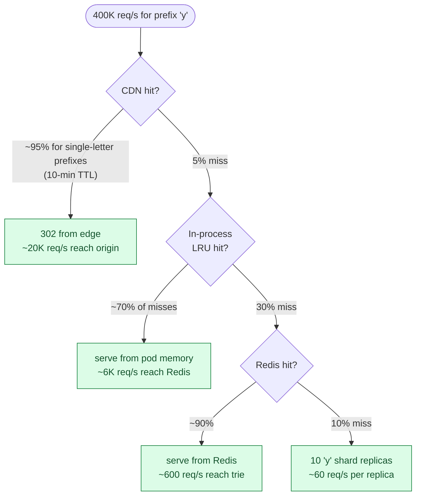

## What we are building

Alice types "new yo" into the Google search box. Before she finishes, a dropdown appears: "new york weather", "new york times", "new yorker". She picks one and never types the last three letters.

That dropdown is typeahead autocomplete. Every keystroke sends a request. The suggestions must appear before the next keystroke, so the budget is around 100ms end to end, including the network trip. At Google's scale that is 2 million such requests per second.

There are four hard problems hiding in this product:

1. **The 100ms budget.** A database query takes 5 to 50ms. With network overhead, a database alone cannot fit inside the budget. The lookup must come from memory.
2. **Trie size at scale.** Storing the top 10 suggestions for every possible prefix takes roughly 90 GB. That does not fit on one machine.
3. **Top-N ranking.** For the prefix "fa" there are thousands of matching queries. "facade" comes before "facebook" alphabetically. The system has to know that "facebook" should win.
4. **Hot prefix handling.** The prefix "y" is typed by billions of users. At peak, one shard might see 400,000 requests per second.

We will start with the smallest thing that works, then add pressure one layer at a time.

---

## The lifecycle of one keystroke

Every suggestion request takes one of two paths: it hits a cache, or it falls through to the trie.



A keystroke spends microseconds in the trie itself. Almost all of the 100ms budget is network. The design goal is to eliminate as many network hops as possible for the most common prefixes.

> **Take this with you.** A typeahead is a ranked prefix lookup served from memory, behind a cache. Speed is the whole design.

---

## How big this gets

| Input | Tiny startup | Google scale |
|-------|-------------|--------------|
| Active users | 1,000 | 1 billion |
| Searches per day | 10,000 | 5 billion |
| Keystrokes per search | ~10 | ~10 |
| Suggest requests per second (steady) | ~1 | ~580,000 |
| Suggest requests per second (peak) | ~5 | ~2,000,000 |
| Latency target P99 end-to-end | < 300ms | < 100ms |

<details markdown="1">
<summary><b>Show: the derived numbers at Google scale</b></summary>

| Metric | Value | How |
|--------|-------|-----|
| Requests per second, steady | ~580,000 | 5B × 10 / 86,400 |
| Requests per second, peak | ~2,000,000 | ~3.5x steady |
| Top 10 million queries cover | ~95% of traffic | Zipf distribution |
| Trie memory for top 10M queries | ~90 GB | ~9 KB per query node chain |
| Hot working set in Redis | ~5 GB | top prefixes per locale |

Three observations:

1. The 95/5 split is what makes caching so powerful. Cache the answer for "y" once and a billion requests get it for free.
2. At 580,000 requests per second, a database query averaging 10ms can serve at most 100 requests per second per core. This is why the lookup must come from memory.
3. 90 GB does not fit on one machine with headroom for the OS and other processes. Sharding by first letter is the natural split.

</details>

> **Take this with you.** When 95% of traffic falls on 5% of prefixes, cache layering is not an optimization. It is the design.

---

## The smallest version that works

Forget Google. A startup with 1,000 users searching a product catalog needs none of this complexity.


One table, one GIN index on the query column. Lookups come back in 5 to 20ms. One endpoint:

| Endpoint | What it does |
|----------|--------------|
| `GET /suggest?q=new+yo&locale=en-US` | Return the top 10 matching queries |

<details markdown="1">
<summary><b>Show: the Postgres query</b></summary>

```sql
CREATE INDEX idx_queries_text ON queries USING gin (query gin_trgm_ops);

SELECT query, score
  FROM queries
 WHERE query LIKE $1 || '%'
 ORDER BY score DESC
 LIMIT 10;
```

This works up to around 100,000 users. Above that, 20ms per query starts to show on fast typers.

</details>

This is enough for the first few months. The interesting question is what breaks first as usage grows.

---

## Decision 1: what data structure stores the prefixes?

At 100,000 users the Postgres prefix query hits 50ms P99. That is already half the budget with no network time counted. The same handful of prefixes appear millions of times per day. Running the same query billions of times is wasteful.

Two options:



The trie wins because it shares prefixes. "facebook", "fashion", and "fast food" all share the "f" and "fa" nodes. The critical trick: precompute the top 10 at every node during the build. A lookup for "fa" is just: walk root -> f -> a, return the saved list. No subtree traversal, no sorting, constant time.

Without precomputing top-N, a lookup for "f" would require walking millions of child nodes, collecting every query, sorting by score, then taking the top 10. That takes seconds.



Build is slow (30 minutes on a Spark cluster). Reads are constant time. That trade is worth it when reads outnumber builds by a billion to one.

> **Take this with you.** Precomputing the top 10 at every node is the central trick. The trie does not search at read time. It returns a pre-built list.

---

## Decision 2: where does the trie live?

The trie is 90 GB. Two options:



Sharding by first letter is natural: the Suggest API reads the first character of the prefix and routes to the right shard. Each shard holds roughly 3 to 5 GB of trie data and handles a fraction of total traffic.

The "y" shard is still hot because "youtube" and "yahoo" dominate. The fix is more replicas for hot shards, not a different sharding scheme. We will revisit this in the hot prefix section.

> **Take this with you.** Shard by first letter. Each shard is an in-memory trie that handles one slice of the prefix space. Hot letters get more replicas.

---

## Decision 3: how do we keep the trie fresh?

The trie is built once per day from 90 days of search logs. Two problems:

1. Building takes 30 to 45 minutes. We cannot mutate the live trie while building.
2. A celebrity trend starts at 2 PM. The daily rebuild ran at midnight. Users expect it to appear within minutes, not tomorrow.



The atomic swap: the Trie Service downloads the new snapshot in the background, validates it (size sanity check, spot-check popular prefixes, confirm at least 90% of yesterday's top suggestions are still present), then swaps a pointer in one CPU instruction. Readers see either the old or new trie, never a mix.

The delta layer is tiny (a few thousand entries) and adds about 1 microsecond per lookup.

> **Take this with you.** Never mutate the live trie. Build offline, validate, swap atomically. Delta handles freshness in between.

---

## Decision 4: how do we rank the suggestions?

For "fa" there are thousands of matching queries. Which ten appear?

Alphabetical order is wrong. "facade" beats "facebook" alphabetically. Frequency alone is wrong. "facebook ipo 2012" has more lifetime searches than "facebook layoffs 2026" but not right now.

Six signals feed the score:

| Signal | What it captures |
|--------|-----------------|
| Total frequency | Lifetime search volume. The baseline. |
| Recent frequency | Last 7 days weighted more than last 90. "facebook layoffs 2026" beats "facebook ipo 2012" today. |
| Click-through rate | When shown, did users click it? High CTR = genuinely useful. |
| Trending velocity | Spike in the last hour. Catches breaking news before the daily rebuild. |
| Personalization | Queries the user has searched before get a boost (logged-in users only). |
| Safety penalty | Harmful queries are dropped or demoted. |

The trie stores the **global** top 10 at each node. Personalization happens at the Suggest API, not inside the trie. Storing a personalized trie per user would mean billions of tries at 3 GB each, which is not feasible. Instead, the API fetches the user's top-100 recent queries (5 KB per user in Redis), boosts any prefix matches, re-ranks, and returns the top 10.

> **Take this with you.** Ranking is half the product. A trie with bad ranking gives alphabetical suggestions and a useless box.

---

## The full architecture

Putting the four decisions together:

```mermaid
flowchart TB
    subgraph Edge["Client edge"]
        A([Web / Mobile]):::user
        CDN["CDN\n(~80% hit rate, TTL 60-600s)"]:::edge
    end

    subgraph ReadPath["Read path (per region)"]
        LB["Load Balancer\n(anycast, nearest region)"]:::edge
        API["Suggest API\n(stateless pods)"]:::app
        Cache[("Regional Redis\n(~15% hit rate, TTL 60s)")]:::cache
        T["Trie Service\n(sharded by first letter,\n3-10 replicas per shard)"]:::app
        P[("Personalization\nRedis\n(user history, 5 KB/user)")]:::cache
    end

    subgraph BuildPath["Build path (offline, global)"]
        Logs[("Query Logs\nS3 Parquet, 30d hot")]:::db
        Builder["Trie Builder\n(Spark, daily + 5-min delta)"]:::app
        Store[("Object Storage\nS3 trie snapshots,\nversioned per locale/shard)"]:::db
    end

    A --> CDN
    CDN -.miss.-> LB
    LB --> API
    API --> Cache
    Cache -.miss.-> T
    API -.logged-in.-> P
    T -.pulls new version.-> Store
    Logs --> Builder
    Builder --> Store

    classDef user fill:#dbeafe,stroke:#1e40af,color:#1e3a8a
    classDef edge fill:#e2e8f0,stroke:#475569,color:#1e293b
    classDef app fill:#dcfce7,stroke:#15803d,color:#14532d
    classDef db fill:#fed7aa,stroke:#c2410c,color:#7c2d12
    classDef cache fill:#fecaca,stroke:#b91c1c,color:#7f1d1d
```

Each component in one line:

| Component | Purpose |
|-----------|---------|
| CDN | Caches responses for popular prefixes at the edge. Absorbs ~80% of traffic. |
| Load Balancer | Anycast routes to nearest region. |
| Suggest API | Stateless. Routes to the right trie shard, blends personalization, enforces safety blacklist. |
| Regional Redis | Hot cache for prefixes that miss the CDN but are still common per region. ~15% hit rate. |
| Trie Service | In-memory trie sharded by first letter. 3 to 10 replicas per shard. Read-only at runtime. |
| Personalization Redis | Per-user top-100 recent queries. 5 KB per user. Used to boost personal results. |
| Trie Builder | Spark job. Reads logs, scores queries, builds trie files, uploads to S3. |
| Object Storage | Versioned trie snapshot files. Trie Service downloads new versions from here. |
| Query Logs | Every past search. Parquet files in S3. 30 days hot, 5 years cold. |

---

## Walk: one keystroke, end to end

Alice is in London. She types "new yo" into the search box. The sixth keystroke sends a request.



Target latencies:

| Path | P99 |
|------|-----|
| CDN hit (~80% of requests) | ~10ms |
| Regional Redis hit (~15%) | ~30ms |
| Trie Service hit (~5%) | ~50-80ms |
| End-to-end budget | 100ms |

The trie lookup itself takes 50 microseconds. The 50ms for the slow path is almost entirely TCP and TLS. Getting fast means getting closer to the user, not making the trie faster.

---

## The hot prefix problem

The prefix "y" is typed by hundreds of millions of users per day. At 2 million requests per second fleet-wide, the "y" shard alone might receive 400,000 requests per second. Other shards are fine. This one is on fire.



Four fixes, used together:

1. **Aggressive CDN TTL for short prefixes.** "y" returns nearly the same answer for 10 minutes. Cache it that long at the edge. 400,000 per second drops to ~20,000 at origin.
2. **In-process LRU on the Suggest API.** Each pod keeps a small LRU (1,000 entries, 10-second TTL). Absorbs flash spikes before they hit Redis.
3. **More replicas for hot shards.** The "y" shard gets 10 replicas instead of 3.
4. **Finer sharding.** Split the "y" shard into "ya", "ye", "yi", "yo", "yu". Five shards share the load.

Cache layer math at 2M peak requests per second:

| Layer | Hit rate | Requests absorbed |
|-------|----------|------------------|
| CDN | ~80% | 1,600,000/s |
| Regional Redis | ~15% | 300,000/s |
| Trie Service | ~5% | ~100,000/s across ~150 shards |

100,000 requests per second across 150 shards is ~700 per shard. A 16 GB machine handles tens of thousands per second. Without caching, the trie alone would need to absorb 2,000,000 per second.

> **Take this with you.** Hot shard problems appear in every sharded system. The fix is always: cache higher up, add replicas, split the hot key.

---

## Follow-up questions

Try answering each in 2 or 3 sentences before opening the solution.

1. **Typos.** Alice types "facbook" instead of "facebook". The trie returns nothing because "facb" has no children. How do you still suggest "facebook"?

2. **Sub-minute trending.** A celebrity passes away at 2:00 PM. By 2:05 PM the world is searching their name. The daily rebuild ran at midnight. How quickly can you make their name appear as a suggestion?

3. **Hot shard failure.** The "y" shard loses one of its three replicas. What happens? How do you protect against a cascade?

4. **Personalization without a per-user trie.** Alice has searched "deep learning" three times. When she types "d", "deep learning" should rank high for her. How do you do this without storing a 3 GB trie per user?

5. **Bad suggestion goes live.** The trie shows something hateful for the prefix "j". The safety filter missed it. How do you remove it within 5 minutes globally?

6. **Multilingual user.** A French user sometimes searches in English. When they type "b", they want French suggestions but also want "BBC" to appear. How do you mix two language tries?

7. **Brand new query.** A new query starts trending but is not in the trie yet. Without waiting for tomorrow's rebuild, how do you make it appear?

8. **New language launch.** You launch in Vietnamese. There are no query logs yet. How do you bootstrap suggestions?

9. **Privacy.** Personalization uses past searches. How do you avoid leaking one user's queries to another? What happens when a user clicks "delete my history"?

10. **Snapshot swap memory pressure.** When a new trie loads, both old and new live in memory at the same time. That doubles your RAM briefly. How do you avoid running out?

11. **GET vs POST.** Why must the suggest endpoint be GET and not POST?

12. **CDN partial outage.** The CDN drops from 80% hit rate to 50% for one region. Origin load almost doubles. Are you provisioned for that?

13. **Mobile clients.** Mobile networks add 100 to 300ms of latency on their own. The 100ms budget is gone before the request reaches your data center. What can you do?

14. **Bot traffic.** A bot sends 100,000 requests per second for nonsense prefixes. It pollutes your query logs and skews rankings. How do you detect and filter it?

15. **A/B testing ranking.** Product wants to test a new ranking formula on 1% of users. How do you do this without rebuilding two whole tries?

---

## Related problems

- **[URL Shortener (001)](../001-url-shortener/question.md).** Same heavy read pattern. Same tiered caching (CDN + Redis + in-memory). Start there to learn cache layering.
- **[Distributed Cache (009)](../009-distributed-cache/question.md).** The regional Redis cache here uses the same eviction, replication, and hot-key patterns.
- **[Web Crawler (008)](../008-web-crawler/question.md).** Both have an offline batch pipeline that produces a serving index on a schedule. Same build-and-swap pattern.
- **[News Feed (002)](../002-news-feed/question.md).** Both use two-stage retrieval: cheap candidates first, smarter re-rank second.
