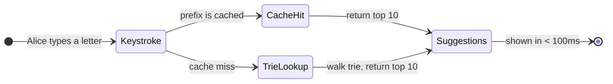
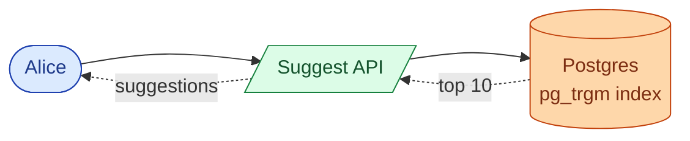
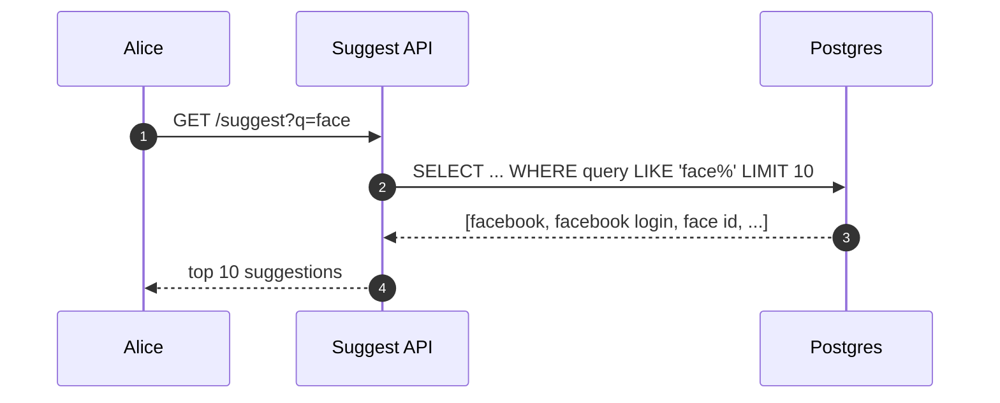
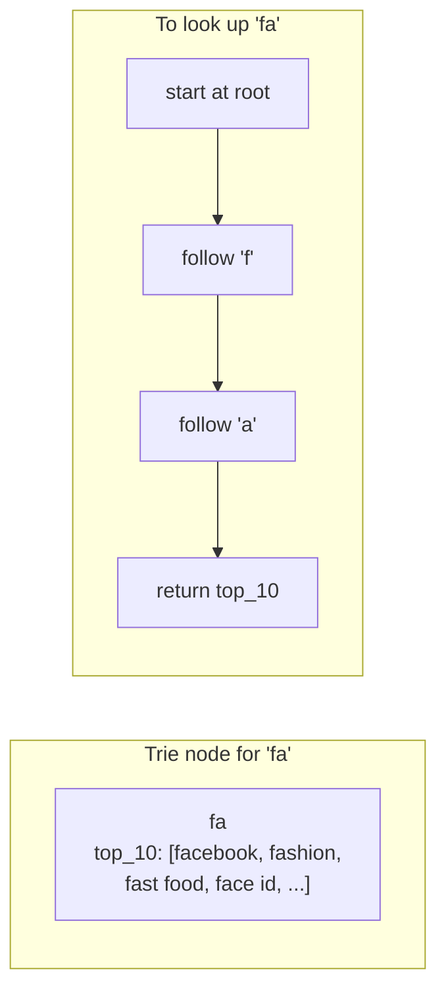
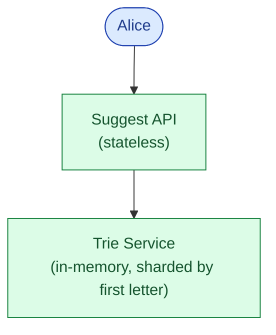
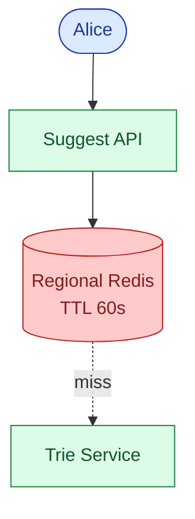
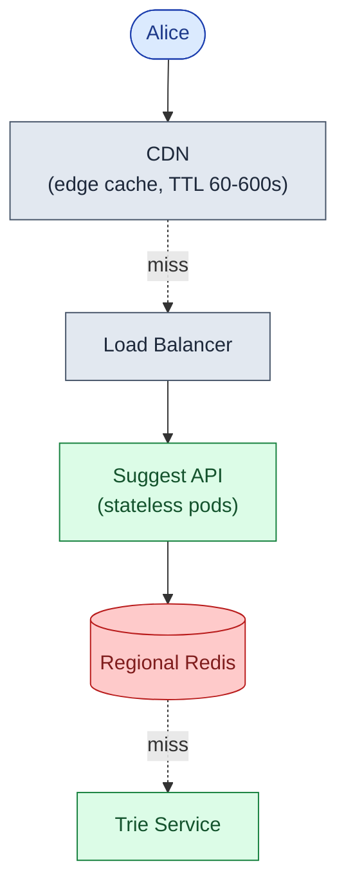
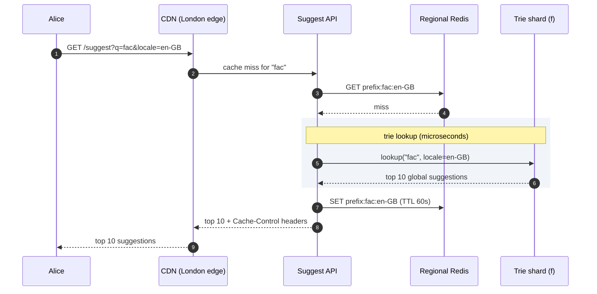
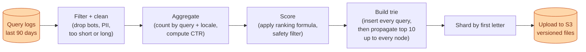

## The scene

You sit down. The interviewer pulls up the Google homepage and types one letter into the search box.

> *"See that dropdown? Ten suggestions, basically instant. Design the system that powers it."*
>
> *"One constraint: if the suggestions show up after the user types the next letter, the box feels broken. It has to feel instant."*

That is the question. It sounds small. It is not.

Three hard things stack on top of each other:

- Every keystroke is a request. A user typing "facebook" sends 8 requests. The whole world types a lot.
- The answer has to come back in under 100ms. That includes the trip across the internet.
- The suggestions need to be smart. Not alphabetical. For the prefix "fa", "facebook" has to beat "facade".

We will start with the smallest thing that works for a tiny app, then add pressure one piece at a time.

---

## Step 1: Picture one request

Before any boxes, picture what one typeahead request actually is.

Alice types "f". The box shows ten suggestions. She types "fa". The box updates instantly. She clicks "facebook". Done.



That is the whole product. Every letter triggers one of those two paths. Everything we add later (ranking, hot shards, edge caches, trending) is a refinement on top of this.

> **Take this with you.** A typeahead is a ranked-prefix-lookup, served from memory, behind a cache. Speed is the whole design.

---

## Step 2: Ask the right questions

In a real interview, sit for two minutes and write down what you want to ask. Not twenty questions. Five good ones.

<details markdown="1">
<summary><b>Show: 5 questions that change the design</b></summary>

1. **How fast?** What is the latency budget per keystroke? Google's bar is 100ms end to end, including the network trip. *If the budget is 300ms you can use a database. Under 100ms the answer must already be in memory.*
2. **How many users?** A typical answer for a global product is 5 billion searches per day. Each search is about 10 keystrokes. That is 50 billion suggest requests per day.
3. **Personalized?** Should each user see their own suggestions, or does every user see the same list for the same prefix? *Personalization roughly doubles the system.*
4. **How fresh?** If a celebrity trend starts right now, must it appear in 5 minutes? An hour? Tomorrow? *Hourly is easy. Sub-minute is genuinely hard.*
5. **Typos?** Should "gogle" suggest "google"? *This is a separate layer on top of the trie.*

The latency budget is the question that decides everything else. Without that number you could just use a database and go home.

</details>

---

## Step 3: How big is this thing?

Same product, two very different scales.

| Company | Users | Requests/second | Trie size | Cache needed |
|---------|-------|-----------------|-----------|--------------|
| Tiny startup | 1,000 | ~1 | A few MB | No |
| Google | 1 billion | 580k steady, 2M peak | ~90 GB | Absolutely |

<details markdown="1">
<summary><b>Show: how the numbers come out</b></summary>

**Tiny startup (1,000 users):**
- 1,000 users x 10 searches/day x 10 keystrokes = 100,000 requests/day.
- That is about 1 per second. Tiny. A single database handles it.

**Google scale (1 billion users):**
- 5 billion searches/day x 10 keystrokes = 50 billion suggest requests/day.
- 50B / 86,400 = ~580,000 per second. Peak is 3x that: ~2 million per second.
- The top 10 million queries cover 95% of all traffic (Zipf distribution).
- Storing those 10 million queries in a trie, with the top 10 precomputed at every node, takes roughly **90 GB**.

**What the math tells you:**

At Google scale a database query takes 5 to 50ms. The budget for the whole round-trip is 100ms. That means the lookup itself has to be microseconds. Everything in the read path must be in memory.

Also: the same handful of prefixes appear over and over. "y" is typed by billions of users. If you cache the answer for "y" once, billions of requests get it free. When 95% of traffic hits 5% of the data, your job is making sure that 95% never reaches the slow path.

</details>

---

## Step 4: The smallest thing that works

Forget Google. We are a tiny startup. One use case: search a product catalog of 50,000 items. 1,000 users. 1 request per second.

Three boxes. Nothing else.



One table, one GIN index on the text column. Lookups come back in 5 to 20ms. Good enough for 1,000 users.



<details markdown="1">
<summary><b>Show: the Postgres query</b></summary>

```sql
CREATE INDEX idx_queries_text ON queries USING gin (query gin_trgm_ops);

SELECT query, score
  FROM queries
 WHERE query LIKE $1 || '%'
 ORDER BY score DESC
 LIMIT 10;
```

This works up to maybe 100,000 users. Above that, the 20ms latency starts to show on fast typers, and you have outgrown this approach.

</details>

> **Take this with you.** Always start from the smallest thing that works. The interesting part of the interview is what happens next.

---

## Step 5: The first crack

At 100,000 users, two things break at once:

- The Postgres prefix query now takes 50ms P99. That is already half the budget, with network time not counted.
- The same handful of prefixes ("y", "fa", "go") show up millions of times per day. You are running the same query billions of times.

The fix for the second problem is obvious: **cache**. The fix for the first requires a different data structure.

You need something that answers "what are the top 10 suggestions for prefix X" in microseconds, not milliseconds. The answer is a **trie**.



Walking to a node takes microseconds, no matter how many queries are in the trie. That is the whole trick.

<details markdown="1">
<summary><b>Show: why the trie beats a hash map</b></summary>

A hash map stores every prefix pointing to its top 10 list: `"f" -> [...]`, `"fa" -> [...]`, `"fac" -> [...]`. It works but does not share anything. Every prefix stores its own copy. For 100 million queries, that grows to about 150 GB.

A trie shares prefixes. "facebook", "fashion", and "fast food" all share the "f" and "fa" nodes. Memory drops to about 90 GB.

The deeper trick: the trie stores the **top 10 precomputed at every node**. So a lookup for "fa" is just: walk root -> f -> a, return the saved list. No subtree traversal. No sorting. Constant time.

Without precomputing the top 10 at every node, a lookup for "f" would require walking millions of child nodes, collecting every query, sorting by score, then taking the top 10. That would take seconds.

We trade build-time work (compute the top 10 at every node when building the trie) for read-time speed (constant lookup forever after). Builds happen once a day. Reads happen 2 million times per second. That is the right trade.

</details>

> **Take this with you.** Precomputing the top 10 at every node is the central trick. Build is slow. Read is constant. That trade is worth it when reads outnumber builds by a billion to one.

---

## Step 6: Build the architecture, one layer at a time

We have a trie that answers lookups in microseconds. Now build the system around it.

### v1: just the trie



This is fine for a few thousand users.

### v2: the same prefix gets asked a million times a day

Add a regional Redis cache in front of the trie. "youtube" is typed by millions of users. Cache the result once.



### v3: users in Paris, Tokyo, and São Paulo

The network trip from Paris to your US data center is 80ms. That is the whole budget. Add a CDN at the edge. Popular prefixes like "y" and "fa" never leave the edge server.



### v4: where does the trie come from?

The trie is built offline from search logs. Add the build pipeline and object storage for the trie snapshots.

```mermaid
flowchart TB
    subgraph Edge["Client edge"]
        A([Web / Mobile]):::user
        CDN["CDN<br/>(~80% hit rate)"]:::edge
    end

    subgraph ReadPath["Read path"]
        LB["Load Balancer"]:::edge
        API["Suggest API<br/>(stateless)"]:::app
        Cache[("Regional Redis<br/>(~15% hit rate)")]:::cache
        T["Trie Service<br/>(sharded by first letter,<br/>3 replicas each)"]:::app
    end

    subgraph Build["Build path (offline)"]
        Logs[("Query Logs<br/>S3 Parquet")]:::db
        Builder["Trie Builder<br/>(Spark, daily)"]:::app
        Store[("Object Storage<br/>S3 trie snapshots")  ]:::db
    end

    A --> CDN
    CDN -.miss.-> LB
    LB --> API
    API --> Cache
    Cache -.miss.-> T
    T -.pulls new version.-> Store
    Builder --> Store
    Logs --> Builder

    classDef user fill:#dbeafe,stroke:#1e40af,color:#1e3a8a
    classDef edge fill:#e2e8f0,stroke:#475569,color:#1e293b
    classDef app fill:#dcfce7,stroke:#15803d,color:#14532d
    classDef db fill:#fed7aa,stroke:#c2410c,color:#7c2d12
    classDef cache fill:#fecaca,stroke:#b91c1c,color:#7f1d1d
```

Each box, in one line:

| Box | What it does |
|-----|--------------|
| **CDN** | Caches responses for popular prefixes close to the user. Absorbs ~80% of traffic. |
| **Suggest API** | Stateless. Routes by region, handles personalization, picks the right trie shard. |
| **Regional Redis** | Warm cache for prefixes that miss the CDN but are still common in the region. |
| **Trie Service** | The lookup. In-memory trie, sharded by first letter, 3 replicas per shard. |
| **Trie Builder** | Spark job. Reads search logs, scores queries, builds trie files, uploads to S3. |
| **Object Storage** | Holds versioned trie snapshot files. Trie Service downloads new versions from here. |
| **Query Logs** | Every past search. Parquet files in S3. 30 days hot, 5 years cold. |

> **Take this with you.** CDN hits ~80%. Redis hits ~15%. The trie sees the remaining 5%. Without that layering, the trie would melt under load.

---

## Step 7: One keystroke, all the way through

Alice is in London. She types "fac" into the Google search box. Watch what happens.



Three things worth pointing out:

1. The trie lookup itself takes microseconds. The 50-80ms P99 is almost entirely network round-trips.
2. The result is stored in Redis after the first miss. The next user who types "fac" in the same region gets the cached answer.
3. CDN caches the result too, with `Cache-Control: public, max-age=60`. The user after that gets it at the edge.

---

## Step 8: How do you rank the suggestions?

For the prefix "fa" there are thousands of matching queries. Which ten win?

Alphabetical order is wrong. "facade" would beat "facebook". You need a score.

<details markdown="1">
<summary><b>Show: the ranking signals</b></summary>

Six signals, in rough order of importance:

1. **Total frequency.** How often this query has been searched, ever. The baseline.
2. **Recent frequency.** Searches from the last 7 days count more than searches from 90 days ago. This is why "facebook layoffs 2026" can beat "facebook ipo 2012" today even if the older query has more lifetime clicks.
3. **Click-through rate.** When this suggestion was shown, did users click it? High CTR means the suggestion is genuinely useful.
4. **Trending.** A sudden spike in the last hour. Catches breaking news before the daily rebuild captures it.
5. **Personalization.** Queries the user has searched before get a boost, for logged-in users only.
6. **Safety.** Hateful or banned queries get dropped or pushed to the bottom.

A simple weighted formula:

```
score = w1 * log(total_frequency)
      + w2 * recent_frequency
      + w3 * click_through_rate
      + w4 * trending_score
      + w5 * personalization_match
      - w6 * safety_penalty
```

The trie stores the **global** top 10 at each node. Personalization happens at the Suggest API layer, not inside the trie. Storing a personalized trie per user would mean billions of tries, each ~3 GB. Impossible. Instead, the trie gives you the global best 10, and the API boosts any matches from the user's recent history.

</details>

> **Take this with you.** Ranking is half the product. A trie with bad ranking gives alphabetical suggestions and a useless box.

---

## Step 9: How do you build the trie?

The trie does not appear by magic. A Spark job builds it from 90 days of search logs. Then the Trie Service swaps in the new version without downtime.

<details markdown="1">
<summary><b>Show: the build pipeline and atomic swap</b></summary>

**The build (runs daily at 00:00 UTC):**



**The atomic swap:**

1. Trie Service shards poll S3 for new versions every minute.
2. When a new version appears, the shard downloads it in the background.
3. The shard validates: size is sane, popular prefixes still look right, at least 90% of last version's top-10 prefixes are still present.
4. If validation passes, the shard swaps a pointer in one CPU instruction. Old trie becomes new trie atomically.
5. Reads in flight see either the old or new trie. Never a mix.
6. The old trie is freed after a short grace period.

**What about trending queries between builds?**

A celebrity passes away at 2:00 PM. The daily rebuild ran at 00:45 AM. You do not want to wait until tomorrow.

A **delta pipeline** runs every 5 to 15 minutes. It reads the last hour of logs from Kafka (not S3, too slow), finds queries with trending velocity above threshold, and writes a small delta file. Trie Service shards load the delta and merge it into results at lookup time. The delta layer is tiny, a few thousand entries at most.

</details>

> **Take this with you.** Never mutate a live trie. Build offline, validate, then swap atomically. The delta pipeline handles freshness in between.

---

## Step 10: The hot shard problem

The trie is sharded by first letter. The "y" shard handles "youtube" and "yahoo". The "f" shard handles "facebook". Both are enormous.

At 2 million requests per second, the "y" shard alone might see 400,000 requests per second. Four fixes, used together:

1. **Aggressive CDN caching for single-letter prefixes.** "y" returns nearly the same answer every time and changes slowly. Cache it for 10 minutes at the edge. Now 400,000 per second drops to ~5,000 reaching your origin.
2. **More replicas for hot shards.** The "y" shard gets 10 replicas instead of 3.
3. **In-process LRU on the Suggest API.** Each pod keeps a small LRU (1,000 entries, 10-second TTL). Absorbs flash spikes before they reach Redis.
4. **Finer sharding for hot letters.** Split the "y" shard into "ya", "ye", "yi", "yo", "yu". Five shards share the load.

> **Take this with you.** Hot shard problems appear in every sharded system. The fix is always the same: cache higher up, add replicas, split the hot key.

---

## Follow-up questions

Try answering each in 2 or 3 sentences before opening the solution.

1. **Typos.** A user types "facbook" instead of "facebook". The trie returns nothing because "facb" has no children. How do you still suggest "facebook"?

2. **Sub-minute trending.** A celebrity passes away at 2:00 PM. By 2:05 PM the world is searching their name. The daily rebuild ran at 00:45 AM. How quickly can you make their name appear as a suggestion?

3. **Hot shard failure.** The "y" shard loses one of its three replicas. What happens? How do you protect against a cascade?

4. **Personalization without a per-user trie.** Alice has searched "deep learning" three times. When she types "d", "deep learning" should rank high for her. How do you do this without storing a 3 GB trie per user?

5. **Bad suggestion goes live.** The trie shows something hateful for the prefix "j". The safety filter missed it. How do you remove it within 5 minutes globally?

6. **Multilingual user.** A French user sometimes searches in English. When they type "b", they want French suggestions but also want French-language "BBC" to appear. How do you mix two language tries?

7. **Brand new query.** A new query starts trending but is not in the trie yet. Without waiting for tomorrow's rebuild, how do you make it appear?

8. **New language launch.** You launch in Vietnamese. There are no query logs yet. How do you bootstrap suggestions?

9. **Privacy.** Personalization uses past searches. How do you avoid leaking one user's queries to another? What happens when a user clicks "delete my history"?

10. **Snapshot swap memory pressure.** When a new trie loads, both old and new live in memory at the same time. That doubles your RAM briefly. How do you avoid running out?

11. **GET vs POST.** Why must the suggest endpoint be GET and not POST?

12. **CDN partial outage.** The CDN drops from 80% hit rate to 50% for one region. Origin load almost doubles. Are you provisioned for that?

13. **Mobile clients.** Mobile networks add 100 to 300ms of latency on their own. The 100ms budget is gone before the request reaches your data center. What can you do?

14. **Bot traffic.** A bot sends 100,000 requests per second for nonsense prefixes. It does not affect user latency directly, but it is polluting your query logs and skewing rankings. How do you detect and filter it?

15. **A/B testing ranking.** Product wants to test a new ranking formula on 1% of users. How do you do this without rebuilding two whole tries?

---

## Related problems

- **[URL Shortener (001)](../001-url-shortener/question.md).** Same heavy read pattern. Same tiered caching (CDN + Redis + in-memory). Start there to learn cache layering.
- **[Distributed Cache (009)](../009-distributed-cache/question.md).** The regional Redis cache here uses the same eviction, replication, and hot-key patterns.
- **[Web Crawler (008)](../008-web-crawler/question.md).** Both have an offline batch pipeline that produces a serving index on a schedule. Same build-and-swap pattern.
- **[News Feed (002)](../002-news-feed/question.md).** Both use two-stage retrieval: cheap candidates first, smarter re-rank second.
