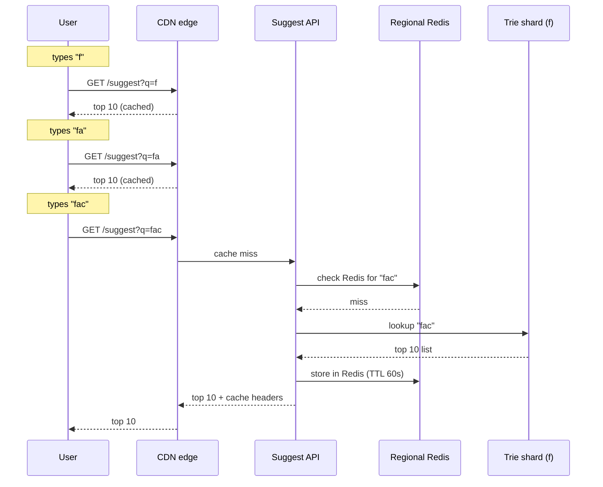
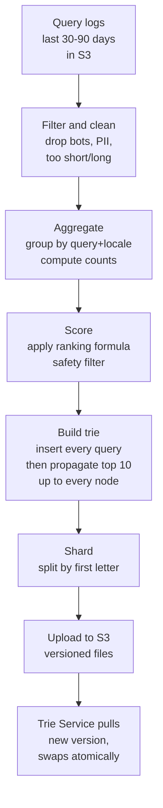

## The scene

You sit down for your interview. The interviewer pulls up the Google homepage and points at the search box.

> *"Type a letter in there. See how suggestions pop up under the box? That little dropdown. Design the system that powers it. Walk me through it from the user's keystroke all the way to the answer."*

Then they add one more thing: *"It has to feel instant. If the suggestions show up after the user types the next letter, the box feels broken."*

This problem looks small. "Just show some suggestions." But three hard things stack on top of each other:

1. Every single keystroke is a request. A user typing "facebook" sends 8 requests. The world types a lot.
2. The answer has to come back in under 100ms. That includes the trip across the internet.
3. The suggestions have to be smart. Not alphabetical. They need to know that "facebook" beats "facade" for the prefix "fa".

We will start small (a tiny app for one country) and grow it to handle the whole planet. At each step I will name what breaks first, then add the smallest fix.

---

## Step 1: Ask the right questions

Before you draw anything, sit for five minutes. Write down questions you would ask the interviewer.

The trick here is not to list 20 questions. It is to find the small handful that change the design.

<details markdown="1">
<summary><b>Show: 7 questions that matter</b></summary>

1. **How fast?** What is the deadline per keystroke? Google's bar is about 100ms end to end, including the network trip. *(If the budget is 300ms, you can use a database. If it is under 100ms, the answer must already be in memory.)*
2. **How big?** How many searches per day? *(A typical answer is 5 billion searches a day. Each search is about 10 keystrokes. So 50 billion suggest requests a day.)*
3. **How many languages?** English only or all of them? *(Adds storage and ranking work. Most real systems keep one index per language.)*
4. **Personalized?** Should each user see their own suggestions? Or do all users see the same list for the same prefix? *(Personalization roughly doubles the system.)*
5. **How fresh?** If a new query starts trending right now, must it show in suggestions today? In an hour? In a minute? *(Hourly is easy. Sub-minute is hard.)*
6. **Typos?** If the user types "gogle" should we suggest "google"? *(Adds a separate spell-fix layer.)*
7. **Safety?** What about hateful or banned words? Per-country rules? *(This is real work, not a checkbox.)*

If you forgot to ask about the latency budget, you missed the question that decides everything else. The 100ms budget is what forces the whole answer (in-memory trie, layered caches, edge serving). Without that number, you could just use a database and go home.

</details>

---

## Step 2: How big is this thing?

Same problem, two scales. Do the math.

**At a tiny startup (1,000 users):**

- 1,000 users
- About 10 searches per user per day
- 10 keystrokes per search

**At Google scale (a billion users):**

- 5 billion searches per day
- Top 10 million queries are 95% of all traffic

Work out three numbers for each scale: suggest requests per second, total trie memory, and how much can be cached.

<details markdown="1">
<summary><b>Show: the math</b></summary>

**Tiny startup:**

- 1,000 users x 10 searches x 10 keystrokes = 100,000 suggest requests a day.
- That is about 1 per second. Tiny.
- A single small server handles this. You could even use a database.

**Google scale:**

- 5 billion x 10 = 50 billion suggest requests a day.
- That is about 580,000 per second on average.
- Peak hours are about 3x that. So 2 million per second at peak.
- The trie (with the top 10 cached at every prefix) is roughly 90GB.
- The hot cache (the prefixes everybody types like "y", "fa", "ama") is only a few GB.

**What the math is telling you:**

At Google scale, you cannot ask a database for an answer. A database query takes 5 to 50 milliseconds on its own. The budget for the whole trip is 100ms. So the lookup itself has to be microseconds. That means **everything in the read path must be in memory.**

Also: the same handful of prefixes show up over and over. "y" is typed billions of times. "facebook" is typed by everyone. So caching is going to save you. If you cache the answer for "y" once, billions of users get it for free.

> **Why this matters:** When 95% of traffic comes from 5% of the data, your job is to make sure that 95% never hits the slow path. Edge cache first, regional cache second, trie last.

</details>

---

## Step 3: How do you store the data?

This is the central decision. Before you draw any boxes, pick the data structure.

You have a long list of past search queries. For any prefix the user types, you need to return the top 10 suggestions in microseconds. How do you store it?

Three serious options. Look at each one. Try to guess which one wins for Google scale.

| Option | What it is | Lookup speed |
|--------|------------|--------------|
| Database with prefix index | Like Postgres or Elasticsearch. Look up rows where text starts with prefix. | 5 to 50 ms |
| Hash map | Map every possible prefix to its top 10 list. | Microseconds. But huge memory. |
| Trie (prefix tree) with top 10 saved at each node | A tree where each branch is a letter. At each node, save the best 10 suggestions for the prefix you reach by walking there. | Microseconds. Smaller than hash map. |

<details markdown="1">
<summary><b>Show: why the trie wins</b></summary>

**What is a trie?**

A trie (rhymes with "try") is a tree where each branch is one letter. You walk down the tree letter by letter. When you reach a node, that node represents a prefix.

Here is a small piece of a trie:

```
root
 |
 f
 |
 a  <-- top 10 here: [facebook, fashion, fast food, ...]
 | \
 c  s
 |
 e
 |
 b
 |
 o
 |
 o
 |
 k  <-- this node means the full word "facebook"
```

When the user types "fa", you walk root -> f -> a. You arrive at the "a" node. The top 10 is right there, already saved. You return it. Done. No searching. No sorting. No database.

**Why save the top 10 at every node?**

If you did not save them, what would happen when the user types "f"? You would have to walk every node below "f" in the tree (millions of them), collect every query, sort by score, take the top 10. That would take seconds, not microseconds.

By saving the answer at every node ahead of time, every lookup becomes constant work: walk K letters, return the list. Done.

> **Why this matters:** This is the central trick. We trade build-time work (computing the top 10 at every node when we build the trie) for read-time speed (constant lookup forever after). Build is slow, read is fast. That is the right trade when reads outnumber builds by a billion to one.

**Why not a hash map?**

A hash map maps every prefix to its top 10. "f" -> [...], "fa" -> [...], "fac" -> [...], and so on. It works, but it does not share. Every prefix stores its own copy of the data. For 100M queries, that grows to about 150GB.

A trie shares prefixes. "facebook", "face id", "fast food" all share the "f" node. Memory drops to about 90GB.

**Why not a database?**

5 to 50 ms per query. Times millions of requests per second. You would need an army of database servers. And it still might not fit the 100ms budget when you add the network trip.

**The verdict:** trie with top 10 at every node. ~90GB total. Shards across machines easily. Lookup is microseconds.

</details>

---

## Step 4: Draw the system

You know how the data is stored. Now draw the boxes that serve it.

Try to fill in the missing pieces below. Six boxes are blank. Think about: what sits closest to the user to catch popular requests, what holds the actual trie, what builds the trie from old search logs, and where the logs live.

```
        User types in the search box
                    |
                    | one request per keystroke
                    v
            +-----------------+
            |     [ ? ]       |  catches popular prefixes
            |                 |  close to the user
            +-----------------+
                    | on miss
                    v
            +-----------------+
            |   Suggest API   |  the front door
            |   (stateless)   |
            +-----------------+
                    |
                    v
            +-----------------+
            |     [ ? ]       |  warm prefixes
            |                 |  one per region
            +-----------------+
                    | on miss
                    v
            +-----------------+
            |     [ ? ]       |  the actual trie
            |                 |  sharded by first letter
            +-----------------+

   Built offline (runs nightly):

            +-----------------+
            |     [ ? ]       |  raw search history
            +-----------------+
                    |
                    v
            +-----------------+
            |     [ ? ]       |  the build pipeline
            +-----------------+
                    |
                    v
            +-----------------+
            |     [ ? ]       |  finished trie files
            +-----------------+
```

<details markdown="1">
<summary><b>Show: the full architecture</b></summary>

```
        User types in the search box
                    |
                    v
            +-----------------------+
            |   CDN / Edge cache    |  CloudFront, Fastly, Cloudflare.
            |                       |  Caches the response for popular
            |                       |  prefixes. ~80% of traffic stops here.
            +-----------------------+
                    | on miss
                    v
            +-----------------------+
            |   Suggest API         |  Stateless. Handles auth, picks the
            |   (regional pods)     |  right region, adds personalization.
            +-----------------------+
                    |
                    v
            +-----------------------+
            |   Regional cache      |  Redis. Catches prefixes that are
            |   (Redis cluster)     |  warm but not hot enough for CDN.
            |                       |  ~15% of traffic stops here.
            +-----------------------+
                    | on miss
                    v
            +---------------------------------+
            |   Trie Service (sharded)        |  In-memory tries.
            |   Each shard owns some letters. |  Sharded by first letter.
            |   +----+ +----+ +----+ +----+   |  Each shard is replicated
            |   |a-c | |d-f | |g-i | |... |   |  3x for safety and speed.
            |   +----+ +----+ +----+ +----+   |  ~5% of traffic reaches here.
            +---------------------------------+
                    ^
                    | pulls new tries periodically
                    |
            +-----------------------+
            |   Object storage      |  S3 or GCS. Holds the finished
            |   (S3 / GCS)          |  trie files, versioned.
            +-----------------------+
                    ^
                    | writes new trie versions
                    |
            +-----------------------+
            |   Trie Builder        |  Spark/MapReduce. Runs daily.
            |   (offline pipeline)  |  Reads logs, ranks queries,
            |                       |  builds trie, uploads files.
            +-----------------------+
                    ^
                    | reads
                    |
            +-----------------------+
            |   Query log store     |  S3 / HDFS / Kafka.
            |   (Parquet files)     |  Every past search, with click info.
            +-----------------------+
```

What each piece does, in one line:

- **CDN.** First catcher. The response for "y" is the same for everyone, and it changes slowly. Cache it at the edge. Saves billions of requests.
- **Suggest API.** Stateless front door. Routes by region. Handles auth. Adds personalization if the user is logged in. Stores nothing.
- **Regional cache.** Redis. Catches prefixes that the CDN missed but are still common in this region.
- **Trie Service.** The actual lookup. Trie lives in RAM. Sharded by first letter. Replicated 3x for safety and read throughput.
- **Object storage.** Holds finished trie files. Trie Service downloads new versions from here.
- **Trie Builder.** Offline. Runs daily. Reads search logs, computes scores, builds tries, writes them to object storage.
- **Query log store.** Every search ever performed. Used by the builder. Cold storage.

> **Why this matters:** Look at the layering. CDN catches 80%. Regional cache catches 15%. Trie sees 5%. That last 5% is small enough that the trie service can be fast. Without the layers, the trie would melt.

</details>

---

## Step 5: Picture a keystroke

Let's trace what happens when the user types "f", then "fa", then "fac".



> **Why this matters:** Three keystrokes, three very different paths. The first two are free (CDN hits). Only the third does any real work. As the user keeps typing, the prefix gets rarer, and we drop deeper into the system. But by then we have already spent most of our 100ms budget on the network trip. The actual lookup has to be tiny.

---

## Step 6: How do you rank the suggestions?

You have 10 suggestions to show. But for "fa" there are probably thousands of past queries that match. Which 10 win?

Try to come up with 5 signals you would use. Then check.

<details markdown="1">
<summary><b>Show: the ranking signals</b></summary>

Six signals, in rough order of importance:

1. **Total frequency.** How often has this query been searched, ever. The baseline.
2. **Recent frequency.** Recent searches count more. A search from today counts 10x a search from 90 days ago. This is why "facebook layoffs" can beat "facebook ipo" today even if "ipo" has more lifetime searches.
3. **Click-through rate.** When this suggestion was shown, did users click it? High click rate means the suggestion is good. Low click rate means people see it and move on.
4. **Trending.** Big spike in the last hour. Catches breaking news.
5. **Personalization.** If the user is logged in, queries they searched before should rank higher for them.
6. **Safety.** Hateful or banned words get dropped or pushed way down.

You combine them with weights:

```
score = w1 * log(total_frequency)
      + w2 * recent_frequency
      + w3 * click_through_rate
      + w4 * trending_score
      + w5 * personalization_match
      - w6 * safety_penalty
```

The trie stores the **global** top 10 at each node. Personalization is added later, at the Suggest API layer. Why? Because storing a personalized trie per user would mean billions of tries. Impossible. Instead, the trie gives you the global best 10. The API then says "but this user also searched X three times, so push X higher for them."

> **Why this matters:** Ranking is not a small detail. It is half the product. A correct trie with bad ranking gives you alphabetical suggestions and a useless search box. A correct trie with good ranking feels like the system reads your mind.

</details>

---

## Step 7: How do you build the trie?

The trie does not appear by magic. It is built from past search logs. How? On what schedule? And how do you swap in a new version without breaking the live service?

<details markdown="1">
<summary><b>Show: the build pipeline</b></summary>

The build runs as a big batch job. Spark or MapReduce. Here is the flow.



**How often?**

- **Daily full rebuild.** Catches new queries, updates weights.
- **Every 5 to 15 minutes: a delta job** for trending queries. Reads only the last hour of logs from Kafka. Finds queries that suddenly became popular. Writes a small "delta" file. The Trie Service merges this delta on top of the static trie at lookup time.
- **On demand: a blacklist API.** For legal takedowns or moderation. Effective in seconds.

**How does the swap work without downtime?**

1. Trie Service shards poll S3 for new versions every minute.
2. When a new version appears, the shard downloads it in the background.
3. The shard validates it: size is sane, popular prefixes still look right.
4. Once validated, the shard atomically swaps a pointer. Old trie pointer becomes new trie pointer in one CPU instruction.
5. Reads in flight either see the old trie or the new one. Never half of each.
6. The old trie is freed after a short grace period.

> **Why this matters:** This is the standard "build offline, atomic swap" pattern. You see it everywhere (search indexes, ML models, routing tables). It avoids a hard problem (concurrent updates to a live tree) by sidestepping it. You never mutate the live trie. You replace it whole.

**What about validation?** If a new build is broken (say a bug drops half the queries), you do not want to swap it in. So before swapping, sample 1000 prefixes from the old trie. Look them up in the new trie. If the top 10 changed by more than 50% across most prefixes, refuse the swap and alert someone. Cheap safety net.

</details>

---

## Step 8: The hot shard problem

The trie is sharded by first letter. So one shard owns everything starting with "y". Another owns "f". And so on.

Quick: which shards run hot?

The "y" shard handles "youtube" and "yahoo" searches. The "f" shard handles "facebook". These are huge.

A single shard might handle 20% of total traffic. At 2 million requests per second peak, that one shard sees 400,000 per second. Can one machine handle that?

<details markdown="1">
<summary><b>Show: four fixes for hot shards</b></summary>

Use all four. They stack.

1. **Aggressive CDN caching for single-letter prefixes.** "y" returns nearly the same answer every time and changes slowly. Cache it for 10 minutes at the edge. Now the 400,000 per second mostly never reaches your servers. This is the biggest win.

2. **More replicas for hot shards.** Instead of 3 replicas of the "y" shard, run 10. Load gets spread.

3. **In-process cache on the Suggest API.** Each Suggest API pod keeps a tiny LRU (~1000 entries) with a 10-second TTL. Catches flash spikes.

4. **Finer sharding for hot letters.** Instead of one "y" shard, split into "ya", "ye", "yi", "yo", "yu". Five shards share the load.

> **Why this matters:** Hot shard problems show up in every sharded system. The fix is the same pattern everywhere: cache higher up, add replicas, split the hot key. Practice spotting them.

</details>

---

## Step 9: Multi-region

Your users are everywhere. Asia, Europe, the Americas. You cannot serve a French user from a US data center; the trip is too slow. So you run the system in every region.

Here is the shape:

```
                          User (Paris)
                              |
                              v
                  +-----------------------+
                  |   CDN (Paris edge)    |  ~80% cache hit
                  +-----------+-----------+
                              | miss
                              v
                  +-----------------------+
                  |  Global load balancer |
                  |  (anycast, routes to  |
                  |   nearest region)     |
                  +-----------+-----------+
                              |
   +--------------------------+--------------------------+
   |                          |                          |
   v                          v                          v
+--------------+      +--------------+         +--------------+
|  us-east-1   |      |  eu-west-1   |         |  ap-south-1  |
|              |      |              |         |              |
| Suggest API  |      | Suggest API  |         | Suggest API  |
| Redis cache  |      | Redis cache  |         | Redis cache  |
| Trie shards  |      | Trie shards  |         | Trie shards  |
+------+-------+      +------+-------+         +------+-------+
       |                     |                        |
       +---------------------+------------------------+
                             |
                             v
                  +-----------------------+
                  |   Object storage      |  Trie files
                  |   (global)            |  (one set, shared)
                  +-----------------------+
                             ^
                             |
                  +-----------------------+
                  |   Trie Builder        |  Runs once, globally.
                  |   (one big job)       |  Reads logs from all regions.
                  +-----------------------+
```

Each region runs its own full stack. They all pull the same trie files from object storage. The build runs once globally, not per region, because we want one consistent ranking everywhere.

For privacy laws (GDPR in Europe), EU search logs may need to stay in EU. Either anonymize them before sending to the global builder, or run a separate EU-only build.

---

## Follow-up questions

Try answering each in 2 or 3 sentences before opening the solution.

1. **Typos.** A user types "facbook" instead of "facebook". The trie returns nothing because "facb" has no children. How do you still suggest "facebook"?

2. **Sub-minute trending.** A celebrity passes away at 2:00 PM. By 2:05 PM the world is searching their name. The daily rebuild ran at 0:45 AM. How quickly can you make their name appear as a suggestion?

3. **Hot prefix.** The "y" shard handles 20% of all traffic. One replica falls over. What happens? How do you protect against this?

4. **Personalization without a per-user trie.** A logged-in user has searched "deep learning" three times. When they type "d", "deep learning" should rank high for them. How do you do this without storing a trie per user?

5. **Bad suggestion goes live.** Your trie suggests something hateful for the prefix "j". The safety filter missed it. How do you remove it within 5 minutes globally?

6. **Multilingual user.** A French user types "b". They want French suggestions. But they sometimes search in English too. How do you mix the two languages?

7. **Brand new query.** A new query starts trending but is not in the trie yet. Without waiting for tomorrow's rebuild, how do you make it appear?

8. **New language launch.** You launch in Vietnamese. There are no query logs yet. How do you bootstrap suggestions?

9. **Privacy.** Personalization uses past searches. How do you avoid leaking one user's queries to another user? What happens when a user clicks "delete my history"?

10. **Snapshot swap memory pressure.** When a new trie loads, both old and new live in memory for a moment. That doubles your RAM. How do you avoid running out?

11. **GET vs POST.** Why must the suggest endpoint be GET and not POST?

12. **CDN partial outage.** The CDN drops from 80% hit rate to 50%. Origin load doubles. Are you ready for that?

13. **Mobile clients.** Mobile networks are slow. The 100ms budget is gone before the request reaches your data center. What can you do to make typing feel instant on mobile?

14. **Bot traffic.** A bot starts sending 100,000 requests per second for nonsense prefixes, polluting your logs and skewing rankings. How do you detect and ignore it?

15. **A/B testing the ranking.** Product wants to ship a new ranking formula. How do you test it on 1% of users without rebuilding two whole tries?

---

## Related problems

- **[URL Shortener (001)](../001-url-shortener/question.md).** Same heavy read pattern. Same tiered caching (CDN + Redis + in-memory). Learn the cache layering there first.
- **[Distributed Cache (009)](../009-distributed-cache/question.md).** The regional Redis cache here uses the same eviction, replication, and hot-key tricks.
- **[Web Crawler (008)](../008-web-crawler/question.md).** Both have an offline batch pipeline that produces a serving index on a schedule. Same build-and-swap pattern.
- **[News Feed (002)](../002-news-feed/question.md).** Both use two-stage retrieval (cheap candidates first, then a smarter re-rank). Same shape.
