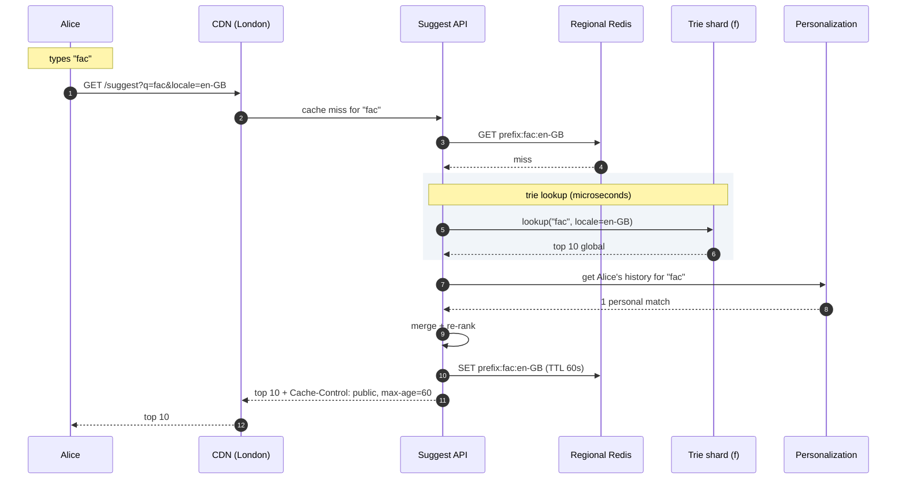
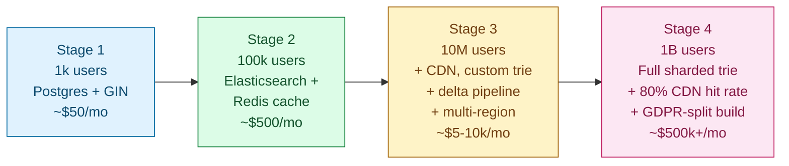

## Solution: Typeahead / Autocomplete Search

### The short version

Autocomplete is a ranked-prefix-lookup served from memory behind layered caches. Every keystroke is a request. At Google scale that is about 2 million requests per second at peak, with a 100ms budget that includes the network trip.

The lookup structure is a sharded in-memory **trie** (a prefix tree where each branch is one letter). At every node we precompute the top 10 suggestions for that prefix. So a lookup is: walk K letters, return the saved list. No searching. No sorting. Microseconds.

In front of the trie we stack two caches. A CDN at the edge catches about 80% of traffic. A regional Redis catches about 15%. The trie itself sees the remaining 5%.

The trie is built offline by a Spark job that reads search logs, computes scores, and writes finished snapshot files to S3. Trie Service shards pull new versions and swap them in atomically. For trending queries, a smaller delta job runs every 5 to 15 minutes and patches fresh suggestions in without a full rebuild.

The interesting work is in the layers: cache layering (95% of traffic must be absorbed before the trie), ranking (frequency, recency, trending, click-through, personalization, safety), hot shards (the "y" shard handles 20% of all traffic alone), and the edge cases (typos, new languages, cold start, privacy).

---

### 1. The two questions that matter most

**Latency budget per keystroke.** Anything over 200ms admits a database (Elasticsearch completion suggester, Postgres prefix index). Under 100ms forces in-memory tries, sharding, and aggressive caching. This number decides the entire architecture.

**Personalization scope.** Per-user data on the hot path roughly doubles the system and kills CDN cacheability. Most companies pick "globally ranked, with light personalization blended in at request time" because that keeps the edge cache useful.

Everything else (languages, freshness, typos, safety) follows from those two answers.

---

### 2. The math, in plain numbers

| Scale | Requests/second | Trie size | Hot cache size |
|-------|-----------------|-----------|----------------|
| Tiny startup (1k users) | ~1 sustained | A few MB | Not needed |
| Google (1B users) | 580k sustained, 2M peak | ~90 GB | ~5 GB hot working set |

A few numbers that drive the design:

- **95% of traffic comes from the top 5% of queries.** Heavy Zipf distribution. This is what makes caching so powerful.
- **Top 10 million queries cover 95% of volume.** The other 90 million are long-tail.
- **Cache hit rate dominates capacity.** If CDN drops from 80% to 70% hit rate, origin load nearly doubles.
- **Trie is 90 GB.** Does not fit on one machine. Shards naturally by first letter.

> **Take this with you.** When 95% of work falls on 5% of data, your job is making sure that 95% never reaches the slow path. Cache layering is not an optimization. It is the design.

---

### 3. The API

One endpoint carries the whole product.

```
GET /api/v1/suggest?q=face&locale=en-US&limit=10
Cookie: user_session=...   # optional, for personalization

200 OK
{
  "prefix": "face",
  "suggestions": [
    { "query": "facebook",             "type": "global",   "score": 0.93 },
    { "query": "facebook login",       "type": "global",   "score": 0.91 },
    { "query": "face id",              "type": "personal", "score": 0.89 }
  ],
  "request_id": "req-abc-123"
}
```

Small but load-bearing choices:

- **GET, not POST.** CDNs cache GETs. A POST defeats the entire edge layer. If this is a POST, 80% of your capacity plan falls apart.
- **`limit` is capped at 10 on the server.** The UI rarely shows more. Bigger limits waste bandwidth.
- **`locale` is required.** Different tries per language.
- **`type` on each suggestion** tells the client where it came from. Useful for UI badges ("Recent" vs "Trending").
- **Anonymous users get identical responses** for identical prefix + locale. That is what lets the CDN cache them.
- **Personalized responses use `Cache-Control: private, max-age=10`.** The CDN must not share them across users.

A separate admin endpoint for emergency blacklists:

```
POST /admin/blacklist
{
  "locale": "en-US",
  "queries": ["harmful query here"],
  "reason": "policy-2026-05-27",
  "ttl": "PT720H"
}
```

The Suggest API reloads the blacklist every 30 seconds. Globally effective within about 60 seconds.

---

### 4. The data model

#### The trie node (lives in RAM on Trie Service)

```
TrieNode {
    children:        HashMap<char, TrieNode*>   # next letter -> next node
    top_suggestions: [Suggestion; 10]           # precomputed top 10 for this prefix
    is_terminal:     bool                       # is this prefix itself a full query?
}

Suggestion {
    query_id: u32   # 4 bytes; resolves to display string via a side table
    score:    f32   # 4 bytes
    flags:    u8    # safety, locale, type
}
```

Using `query_id` (4 bytes) instead of the full string (30 bytes average) at every node saves roughly 50% of trie memory. For 300 million nodes with 10 suggestions each, that is the difference between 90 GB and 200 GB.

#### The side table (query_id to display string)

```
QueryRecord {
    display_string: String   # original query text, properly cased
    locale:         u8
    total_count:    u64
    last_seen_ts:   u32
    safety_flags:   u8
}
```

About 50 bytes per record. 100 million queries = ~5 GB. Loaded once per Trie Service instance.

#### The query log (input to the builder)

```json
{
  "query": "facebook login",
  "ts": 1716383530,
  "user_id_hash": "abc123",
  "locale": "en-US",
  "shown_suggestions": ["facebook", "facebook login"],
  "clicked_position": 1,
  "country": "US"
}
```

Stored in S3 as Parquet, partitioned by date and locale. 30 days hot. 5 years cold (analytics only). User IDs are hashed with a rotating salt before the builder reads them. The trie has no user-identifying data.

---

### 5. The engine: lookup and build

#### The hot-path lookup

```python
def suggest(prefix: str, locale: str, k: int = 10) -> list[Suggestion]:
    root = trie_for(locale)
    node = root
    for ch in normalize(prefix):
        node = node.children.get(ch)
        if node is None:
            return []
    return node.top_suggestions[:k]
```

Walk K letters (typically 5 to 15). Each step is a hash lookup. Return the saved list. Total: 1 to 10 microseconds in a warm cache. The bottleneck at every layer is network, not computation.

<details markdown="1">
<summary><b>Show: the build function (propagating top 10 upward)</b></summary>

```python
def build_trie(queries: list[ScoredQuery]) -> TrieNode:
    root = TrieNode()

    for q in queries:
        node = root
        for ch in q.normalized:
            node = node.children.setdefault(ch, TrieNode())
        node.is_terminal = True
        node.terminal_score = q.score
        node.query_id = q.id

    def propagate(node):
        candidates = []
        if node.is_terminal:
            candidates.append((node.query_id, node.terminal_score))
        for child in node.children.values():
            propagate(child)
            candidates.extend(child.top_suggestions)
        node.top_suggestions = heapq.nlargest(10, candidates, key=lambda s: s.score)

    propagate(root)
    return root
```

Propagation is bottom-up. Each node collects the best candidates from all its children and keeps the top 10. For a 90 GB trie this runs in about 30 minutes on a 100-node Spark cluster. It runs in a separate batch cluster and never touches the live Trie Service.

</details>

---

### 6. The architecture

```mermaid
flowchart TB
    subgraph Edge["Client edge"]
        A([Web / Mobile]):::user
        CDN["CDN<br/>(CloudFront / Fastly)<br/>TTL 60-600s, ~80% hit rate"]:::edge
    end

    subgraph ReadPath["Read path (per region)"]
        LB["Load Balancer<br/>(anycast, routes to nearest)"]:::edge
        API["Suggest API<br/>(stateless pods)"]:::app
        Cache[("Regional Redis<br/>(~15% hit rate, TTL 60s)")]:::cache
        T["Trie Service<br/>(sharded by first letter,<br/>3-10 replicas per shard)"]:::app
    end

    subgraph BuildPath["Build path (offline, global)"]
        Logs[("Query Logs<br/>S3 Parquet, 30d hot")]:::db
        Builder["Trie Builder<br/>(Spark, daily full rebuild +<br/>5-min delta for trending)"]:::app
        Store[("Object Storage<br/>S3 trie snapshots,<br/>versioned per locale/shard)"]:::db
    end

    A --> CDN
    CDN -.miss.-> LB
    LB --> API
    API --> Cache
    Cache -.miss.-> T
    T -.pulls new version.-> Store
    Logs --> Builder
    Builder --> Store

    classDef user fill:#dbeafe,stroke:#1e40af,color:#1e3a8a
    classDef edge fill:#e2e8f0,stroke:#475569,color:#1e293b
    classDef app fill:#dcfce7,stroke:#15803d,color:#14532d
    classDef db fill:#fed7aa,stroke:#c2410c,color:#7c2d12
    classDef cache fill:#fecaca,stroke:#b91c1c,color:#7f1d1d
```

Five things to notice:

- The CDN is the cheapest compute you can buy. Every response cached at the edge is a response your trie never has to compute.
- The Suggest API is stateless. Auth, locale routing, optional personalization. Scale horizontally. Store nothing.
- Trie Service shards are **read-only at runtime**. No mutations. New tries replace old via snapshot swap. This avoids a whole class of concurrency bugs.
- The builder runs offline. Trie Service never builds anything. It only downloads finished snapshots.
- All regions share one set of trie files. One global ranking. Each region serves it locally.

---

### 7. A keystroke, end to end



Target latencies:

| Path | P99 |
|------|-----|
| CDN hit (~80% of requests) | ~10ms (mostly network to edge) |
| Regional Redis hit (~15%) | ~30ms |
| Trie Service hit (~5%) | ~50-80ms |
| End-to-end P99 budget | 100ms |

The trie lookup itself takes 50 microseconds. The 50ms is almost entirely TCP and TLS. Getting fast means getting closer to the user, not making the trie faster.

---

### 8. The scaling journey: 1,000 users to 1 billion



#### Stage 1: 1,000 users

One Postgres with a `pg_trgm` GIN index. One app server. No caching. About $50/month. Two weeks to ship.

Enough because you see 1 request per second. Building anything more is over-engineering.

#### Stage 2: 100,000 users

Something breaks: prefix queries take 50ms P99 and typers see visible lag.

Bring in Elasticsearch with its completion suggester. ~20ms lookups, decent ranking out of the box. Add Redis in front of the Suggest API for hot prefixes. About $500/month.

Still no CDN, no multi-region, no custom trie. ES handles this scale without complaint.

#### Stage 3: 10 million users

Several things break at once:

- ES hits 50ms P99 at peak.
- Users in Asia have 300ms round-trips to your US region.
- Trending queries from today appear in suggestions tomorrow at the earliest.

Fixes in order: CDN in front (60% hit rate cuts ES load by 60%), custom in-memory trie for the top 1 million queries (falls back to ES for long-tail), a second region (CDN routes by location), a delta pipeline every hour for trending. Cost jumps to $5-10k/month.

#### Stage 4: 1 billion users

New problems:

- 2 million requests per second at peak. A single "y" shard cannot keep up.
- GDPR requires EU search logs to stay in EU.
- A celebrity trend must appear in suggestions in under 5 minutes.

The full design from Section 6:

- Trie sharded by first letter across ~50 shards, replicated 3x. Hot letters ("y", "f") get 10 replicas each.
- CDN tuned to ~80% hit rate.
- Regional Redis for another 15%.
- Multi-region build: EU-only log path for GDPR compliance.
- Delta pipeline runs every 5 minutes via Kafka. Trending queries appear within 10 minutes.

Cost: ~$500k+/month. Mostly trie service memory and CDN bandwidth.

Notice that the basic shape (CDN -> API -> cache -> trie) appears at Stage 2 and never changes. We add layers, sharding, and replicas. The core data model stays the same.

---

### 9. Sharding and hot shards

**Sharding:** shard by first character. ~26 letters plus digits plus common UTF-8 prefixes = ~50 shards for English. For multiple languages, shard by `(locale, first_character)`. Each shard is a separate process on a dedicated machine, replicated 3x for availability and read throughput.

A small config table in the Suggest API maps `{locale: {first_char: shard_address}}`. On request, the API hashes the prefix to pick the shard.

**Hot shards:** the "y" shard handles "youtube" and "yahoo". At 2 million peak requests per second, "y" alone might see 400,000 per second. Four fixes used together:

1. CDN caches single-character prefixes for 10 minutes. 400,000/s drops to ~5,000/s at origin.
2. 10 replicas of the "y" shard instead of 3.
3. In-process LRU on each Suggest API pod (1,000 entries, 10-second TTL).
4. Finer sharding: "y" splits into "ya", "ye", "yi", "yo", "yu".

**Cache layer math:**

| Layer | Hit rate | Requests absorbed at 2M peak |
|-------|----------|-------------------------------|
| CDN | 80% | 1.6M/s |
| Regional Redis | 15% | 300k/s |
| Trie Service | 5% | ~100k/s across ~150 shards |

100,000 requests per second across 150 shards is ~700 per shard. A 16 GB machine handles tens of thousands per second easily.

> **Take this with you.** The CDN hit rate is your leading indicator of capacity stress. Watch it closely. A 10-point drop nearly doubles origin load.

---

### 10. Build pipeline, in detail

<details markdown="1">
<summary><b>Show: daily full rebuild timeline</b></summary>

```
00:00 UTC  Snapshot last 90 days of query logs.
00:10 UTC  Spark job starts on 200-executor cluster.

  Stage 1: Filter and normalize.
           Drop bots (user-agent + volume signature).
           Drop PII patterns (credit card numbers, SSN-like strings).
           Drop queries under 2 or over 100 characters.
           Lowercase, normalize whitespace, strip extra diacritics.
           Output: ~400B cleaned rows.

  Stage 2: Aggregate.
           Group by (normalized_query, locale).
           Compute total count, recency-weighted count (exponential
           decay, tau=30 days), CTR, trending velocity.
           Output: ~100M unique (query, locale) rows.

  Stage 3: Score.
           Apply ranking formula. Run each through the safety
           classifier. Output: ~100M scored rows.

  Stage 4: Build trie per locale.
           Group by locale, then build trie + propagate top 10
           upward. Output: ~30 locale tries, ~3 GB each on average.

  Stage 5: Shard.
           Split each locale trie by first character.
           Output: ~30 locales x 30 shards = ~900 files.

  Stage 6: Upload to S3 with version tag.
           Path: trie/v=2026-05-27/locale=en-US/shard=f.trie

00:45 UTC  Build done. ~35 min on 200-executor cluster.
00:45 UTC  Trie Service instances begin polling, download shards.
00:50 UTC  Validate snapshot: check size, sample 1,000 lookups,
           compare against previous version. Reject if >50% change.
00:52 UTC  Atomic pointer swap. Old trie freed after grace period.
```

</details>

<details markdown="1">
<summary><b>Show: delta pipeline for trending queries</b></summary>

The delta pipeline runs every 5 minutes:

1. Read the last hour of query logs from Kafka (not S3, too slow).
2. Aggregate and score, weighting trending velocity heavily.
3. For each (locale, prefix) where a new candidate beats the current top 10, emit a delta entry.
4. Write delta file to S3.
5. Trie Service shards pull the delta and merge it at lookup time.

```python
def lookup_with_delta(prefix, locale):
    static_top10 = trie[locale].lookup(prefix)
    delta_entries = delta_layer[locale].get(prefix, [])
    return merge_and_rerank(static_top10, delta_entries)[:10]
```

The delta layer is tiny (a few thousand entries at any moment). Merge adds ~1 microsecond per lookup.

After the next daily rebuild includes the trending queries naturally, delta entries expire automatically.

</details>

---

### 11. Reliability

| Failure | What happens | Mitigation |
|---------|--------------|------------|
| One Trie shard replica down | Other replicas absorb load. CPU jumps. | Run hot shards with 10 replicas at <50% CPU baseline. |
| Regional Redis down | Reads fall through to trie shards. Trie load spikes 5x. | Trie shards carry headroom for exactly this. |
| CDN partial outage (80% -> 50% hit) | Origin load almost doubles. | Provision for 50% CDN hit rate, not 80%. Fallback: serve cached top-100 popular queries. |
| Bad snapshot fails validation | Old trie keeps serving. | Validation step before swap; page on-call. |
| Object storage down | Existing tries keep serving. New snapshots cannot pull. | Trie ages slowly. ~24 hours of staleness is acceptable. |
| Trie Builder fails | Most recent valid trie serves. | Alert if no new snapshot in 26 hours. |
| Personalization service down | Suggest API skips personalization. Global top 10 returned. | Invisible degradation for most users. |

The pattern: every layer degrades gracefully. The user always sees something, even if not the best something.

---

### 12. Observability

| Metric | Why it matters |
|--------|----------------|
| `suggest.latency_p99` per region | Headline SLO. Target <100ms. |
| `suggest.cdn_hit_rate` | Leading indicator of capacity. Alert below 70%. |
| `suggest.regional_cache_hit_rate` | Drop here means trie shards take the hit. |
| `trie.shard_qps` per shard | Spot hot shards before they melt. |
| `trie.shard_cpu` per shard | Cardinal CPU signal. |
| `trie.snapshot_age` per shard | Alert if over 26 hours. |
| `delta.lag` | Time from query trending to appearing. Target under 15 minutes. |
| `builder.run_duration` | Daily build should finish under 60 minutes. |
| `builder.input_row_count` | Sudden drop means broken log pipeline. |
| `safety.blacklisted_query_serve_count` | Must always be 0. Page immediately if non-zero. |

Page on: `suggest.latency_p99 > 200ms` for 5 minutes; `trie.snapshot_age > 26h`; `safety.blacklisted_query_serve_count > 0`.

Ticket on: CDN hit rate drift, delta lag spike, build duration regression.

One specific dashboard: a **hot shard heatmap**, a grid of all shards colored by current QPS. The on-call sees at a glance whether load is balanced or one shard is on fire.

---

### 13. Follow-up answers

**1. Typos.**

Plain trie traversal fails because "facb" has no children. Three approaches:

- **BK-tree (Burkhard-Keller tree).** A separate structure indexed by edit distance. Find candidate corrections within edit distance 1 or 2, then look up suggestions for each corrected candidate.
- **Symspell.** Precompute all single-deletion variants of every common query at build time. Fast at query time but bloats the index 4 to 5x.
- **Two-pass fallback.** Try clean trie lookup first. If 0 results, hit a spell-correction service for a corrected prefix, then re-lookup. Adds latency only on misses.

I would put a small BK-tree at the Suggest API, fired only when the trie returns 0 results. It indexes only the top ~1 million most popular queries. Edit distance cap of 2. Cost: ~5ms per fallback lookup. Frequency: ~3% of requests. Net latency impact: tiny.

**2. Sub-minute trending.**

The delta pipeline. Every 5 minutes, read the last hour of logs from Kafka, find queries with high trending velocity, write a delta file. Trie Service shards pull and merge.

For faster paths: skip the file and push deltas via pub/sub directly to each shard. Latency drops to ~2 minutes.

The hard part is the threshold. High enough to ignore spam (one bot sending 1,000 queries should not move ranking), low enough that real news events get picked up. Typical formula: velocity > 10x baseline AND total volume > 100 in 5 minutes AND from more than 10 distinct user_id_hashes.

**3. Hot shard failure.**

If the "f" shard loses one replica, the others absorb its load. If the shard was already at 80% CPU, remaining replicas may hit 100%. P99 latency degrades. Some requests time out.

Mitigations in order:
1. Run hot shards at <50% CPU baseline. Leave headroom for failures.
2. Autoscale on shard CPU.
3. Aggressive in-process LRU on Suggest API absorbs short spikes.
4. Circuit breaker: if shard timeouts exceed 1% over 30 seconds, open the circuit and return a fallback (cached top-100 always-popular queries).
5. Pre-warm replacement replicas after snapshot swap.

**4. Personalization without a per-user trie.**

A per-user trie would be 3 GB x billions of users. Impossible.

Instead, store per-user a small list of their most-issued queries (top 100, with counts). Keyed by `user_id_hash` in Redis.

At request time:
1. Fetch user's top-100 list (~2ms).
2. Filter to those starting with the current prefix (usually 0-5 hits).
3. Get global top 10 from the trie.
4. Merge: user-history matches get a boost, reorder, take top 10.

Memory: 100 entries x 50 bytes = 5 KB per user. 1 billion users = 5 TB. Sharded Redis handles it.

**5. Bad suggestion in production.**

Immediate action:
- Admin posts to `/admin/blacklist` with the offending query and locale.
- Suggest API reloads the blacklist every 30s and filters within ~60 seconds globally.
- CDN still serves the bad suggestion from edge cache. Issue a CDN purge for the affected prefix. ~30 to 90 seconds to clear globally.

Total time to clean: 2 to 3 minutes.

Preventing it from coming back: the blacklist persists across rebuilds. The Trie Builder reads the blacklist and drops blacklisted queries during scoring. The safety classifier gets retrained on the new example.

**6. Multilingual user.**

Two layers:
- **Primary trie:** default to the user's UI locale. A French user gets the `fr-FR` trie.
- **Cross-locale mixin:** for users with multilingual history (detected from past queries), mix in the top 1 to 2 results from a secondary locale.

Anonymous users: use `Accept-Language`. Some queries are global across locales ("facebook", "youtube", brand names). Tag them as "global" during build. Every locale trie includes them.

**7. Brand new query, not yet in trie.**

Delta pipeline handles it. 5 to 15 minute lag.

If even 5 minutes is too slow: a streaming Flink job updates the delta layer in real time. Sub-minute lag. Reserve this for domains where freshness is critical (news, e-commerce flash sales).

**8. Cold start for a new language.**

Bootstrap options:
- Wikipedia titles for that language, ranked by pageview. About 10 million entities per major language.
- Translated top 100k English queries. Brand names stay in original form.
- Product catalog names if this is e-commerce search.
- Aggressive trend detection: as real queries trickle in, the delta pipeline promotes them quickly.

Combine all three sources and let real logs take over within 30 days. Human reviewers spot-check the top 10 for common prefixes during the first month.

**9. Privacy and deletion.**

Risks:
- **Leaking queries across users.** Per-user history is keyed by hashed user_id and never mixed across users. Cross-user signals (global rank, trending) come from the aggregated trie only.
- **User IDs in build logs.** At ingestion, hash user_ids with a rotating salt. The builder works only on hashed IDs and aggregates volume. The trie has no user-identifying data.
- **"Delete my history."** Delete the user's entry from `user:history:{user_id_hash}`. Mark the hash as deleted in the log retention table. Scrub their rows in the next compaction. Their contribution to global trends is already pseudonymous and aggregated. We do not retroactively rebuild the trie.

For minors and sensitive accounts: never store personalization at all. User-controlled setting.

**10. Snapshot swap memory pressure.**

When a new trie loads, both old and new live in memory briefly. 3 GB x 2 = 6 GB per shard during swap.

Mitigations:
- **Stagger swaps across replicas.** One replica at a time enters "swap mode" and is briefly removed from the load balancer. Peak memory increase is per-replica, not fleet-wide.
- **Memory-map the trie file.** The OS reclaims old pages gradually rather than freeing them all at once.

**11. GET vs POST.**

GET is required because CDNs cache GETs. A POST is not cacheable at the edge. If suggest were a POST, the ~80% of traffic that currently stops at the edge would hit your origin instead. The whole capacity plan collapses. GETs are also easier to debug (shareable URL) and play well with browser back-button behavior.

**12. CDN partial outage.**

CDN drops from 80% to 50% hit rate. Origin load almost doubles.

Capacity planning rule: always provision for 50% CDN hit rate. Never assume 80%. If you provision for 80% and it drops, you fall over.

Backup plan: at the Suggest API layer, serve a "degraded mode" response when origin is overwhelmed. Cached top-100 most popular queries per locale. Not personalized. Not perfect. But the box still works.

**13. Mobile clients.**

Mobile networks add 100 to 300ms of latency. The 100ms budget is gone before the request reaches your data center.

Tricks:
- **Ship a tiny trie to the client.** Top ~10k queries plus the user's recent history. First 1 to 2 keystrokes resolve on-device with zero network.
- **Pre-fetch on focus.** When the user taps the search box, fire a warm-up request to populate caches before they type.
- **Drop the request when the user types fast.** If keystroke N+1 happens before keystroke N's response returns, cancel N. Avoids stale results.
- **HTTP/2 or HTTP/3.** Multiplexed connections cut handshake overhead.

**14. Bot traffic.**

Detection:
- Volume signature. A user with 100 keystrokes per second is not human.
- User-agent filtering. Known bot UAs get blocked at the load balancer.
- Behavior signature. Real users dwell on suggestions and click. Bots do not.
- Rate limit per IP and per user_id_hash.

Filtering at log ingestion: drop bot rows before they reach the builder. The builder only sees clean logs.

Ranking protection: any single user_id_hash contributes at most one vote per (query, day), regardless of how many times they searched. One bot cannot dominate global rankings.

**15. A/B testing ranking.**

Do not rebuild two whole tries.

Instead: build one trie with top 50 candidates per node instead of 10. At the Suggest API, apply the ranking formula on the candidate set per request. Different formulas pick different top 10 results from the same candidates. Route 1% of users to the experimental formula via a feature flag. Compare click-through rates over a week.

If the new formula wins, ship it. The trie is unchanged.

---

### 14. Trade-offs worth saying out loud

**Why not Elasticsearch's completion suggester?** It works and gets you to 10 million users with minimal code. The downside is per-shard JVM memory pressure and tail latency at Google scale. For startup-scale, Elasticsearch is the right answer. Build the custom trie when you can measure the difference.

**Why not real-time updates to the live trie?** Mutating a tree while readers walk it requires locking, which kills throughput. Snapshot swap sidesteps this entirely. The cost is a freshness lag of ~24 hours for the full rebuild, which the delta pipeline reduces to ~5 to 10 minutes for trending queries.

**Why not per-user tries for personalization?** Billions of users x 3 GB per trie is impossible. Blending personalization on top of a global trie at request time costs 5ms and produces good-enough quality.

**Why CDN at all if some responses are personalized?** Split it. Anonymous and short-prefix responses cache at the CDN (60 to 80% of traffic). Personalized responses bypass it with `Cache-Control: private`. The CDN is not all-or-nothing.

**Why not vector search?** Vector search handles typos and semantic intent better. The cost is latency (10 to 30ms per lookup) and weaker exact-prefix recall. Trie plus BK-tree is faster and more predictable. Vector search shows up as a secondary candidate re-ranker at the next level of design.

---

### 15. Common mistakes

Most weak answers fall into one of these:

- **"Just use a trie."** Without acknowledging memory cost, top-N precomputation, the offline rebuild, or cache layering. That is a junior answer.
- **Forgetting the CDN.** At 2 million requests per second, every byte cached at the edge is a byte not served by your origin. Mention CDN early.
- **Not computing trie size.** The 90 GB number is what justifies sharding. Without it you sound like you have not thought about scale.
- **Storing full strings at every node.** Use query_ids and a side dictionary. Saves 50%+ of memory.
- **Ignoring ranking.** Alphabetical or pure frequency is wrong. Recency, CTR, trending, personalization, and safety all matter.
- **Live writes to the trie.** Snapshot swap is the standard. Mutating a live trie is a concurrency bug waiting to happen.
- **No mention of typos.** Real users misspell things. A BK-tree or spell fallback is expected at staff level.
- **No mention of safety.** Real product concern. Mention it unprompted.
- **Per-user trie for personalization.** Then unable to defend the memory math. The standard answer is "boost user history on top of global rank at request time."
- **Underweighting CDN hit rate as the capacity driver.** At 95% cache hit rate, the trie sees 100k requests per second (easy). At 80%, it sees 400k per second (painful). The whole capacity plan rests on the edge layer.

The three answers that separate strong from average: **why precompute top-N at every node**, **why atomic snapshot swap instead of live updates**, and **how personalization blending actually works**. Those are the answers a senior architect listens for.
