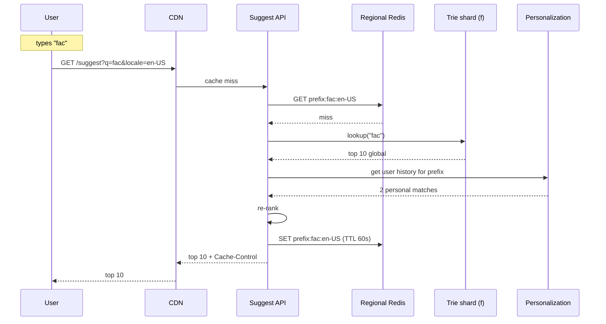

## Solution: Typeahead / Autocomplete Search

### The short version

Autocomplete is a read-heavy, latency-bound, ranked-prefix-lookup problem. Every keystroke is a request. At Google scale that is about 2 million requests per second at peak with a 100ms budget that includes the network trip.

The answer is a sharded in-memory **trie** (a prefix tree where each branch is a letter). At every node we save the top 10 suggestions for that prefix. So a lookup is "walk K letters, return the saved list." No searching. No sorting. Microseconds.

In front of the trie we stack two caches: a CDN at the edge (catches ~80% of traffic) and a regional Redis (catches ~15%). The trie itself sees only the remaining 5%.

The trie is built offline by a Spark job that reads search logs, computes scores, and writes finished trie files to S3. Trie Service shards pull new versions and swap them in atomically. For trending queries, a smaller job runs every 5 to 15 minutes and patches in fresh suggestions without a full rebuild.

The interesting work is in the layers: cache layering (95% of traffic must be absorbed before the trie), ranking (frequency, recency, trending, click-through, personalization, safety), hot shards (the "y" shard takes 20% of all traffic), and small but important features (typos, personalization, multilingual, safety, bootstrap for new languages).

---

### 1. The clarifying questions, in one paragraph

The single most important question is **latency budget per keystroke**. Anything looser than 200ms admits a database design (Elasticsearch completion suggester, Postgres prefix index, done in a week). Anything tighter than 150ms forces in-memory tries, sharding, and aggressive caching. Without that number you cannot decide the structure.

The second most important is **personalization scope**. Per-user data on the hot path roughly doubles the architecture. Most companies pick "globally ranked, with light personalization for logged-in users" because that keeps the CDN useful.

Everything else (languages, trending freshness, typos, safety) follows from those two.

---

### 2. The math, in plain numbers

| Scale | Requests/second | Trie size | Cache size |
|-------|-----------------|-----------|------------|
| Tiny startup (1k users) | ~1 sustained | A few MB | Not needed |
| Google (1B users) | 580k sustained, 2M peak | ~90 GB | ~5 GB hot working set |

A few facts that drive the design:

- **95% of traffic is the top 5% of queries.** Heavy Zipf distribution. This is what makes caching so powerful.
- **Top 10 million queries cover 95% of volume.** The other 90 million are the long tail.
- **Per-request payload is ~600 bytes.** Tiny. Bandwidth is not the issue.
- **Trie size is 90GB.** Cannot fit on one machine. But it shards beautifully by first letter.
- **Cache hit rate dominates capacity.** If CDN drops from 80% to 70%, origin load nearly doubles.

> **Why this matters:** When 95% of work falls on 5% of data, your job is making sure that 95% never reaches the slow path. Cache layering is not an optimization. It is the design.

---

### 3. The API

One endpoint carries the whole product.

```
GET /api/v1/suggest?q=<prefix>&locale=<lang>&limit=10
Accept: application/json
Cookie: user_session=...   # optional, for personalization

Response (200):
{
  "prefix": "face",
  "suggestions": [
    { "query": "facebook",             "type": "global", "score": 0.93 },
    { "query": "facebook login",       "type": "global", "score": 0.91 },
    { "query": "facebook marketplace", "type": "global", "score": 0.87 }
  ],
  "request_id": "req-abc-123"
}
```

Small but load-bearing choices:

- **GET, not POST.** The CDN can cache GETs. POSTs defeat the entire edge layer. If you make this a POST, the whole design falls apart.
- **`limit` capped at 10 on the server.** The UI rarely shows more. Bigger limits waste bandwidth.
- **`locale` is required.** Different tries per language.
- **`type` field on each suggestion** tells the client where this came from (global ranking, user history, trending). Useful for UI badges.
- **No personalization for anonymous users.** Same prefix + same locale = identical response. That is what lets the CDN cache it.
- **For personalized responses, set `Cache-Control: private, max-age=10`.** The CDN must not share it.

A separate admin endpoint for emergency blacklists:

```
POST /admin/blacklist
Authorization: Bearer <admin_token>
{
  "locale": "en-US",
  "queries": ["bad query 1"],
  "reason": "DMCA notice 2026-05-24",
  "ttl": "PT720H"
}
```

Effective globally within ~60 seconds. The Suggest API reloads the blacklist every 30s and filters candidates before returning.

---

### 4. The data model

#### The trie node (lives in RAM on Trie Service)

```
TrieNode {
    children: HashMap<char, TrieNode*>    # next letter -> next node
    top_suggestions: [Suggestion; 10]     # precomputed top 10 for this prefix
    is_terminal: bool                     # is this prefix itself a full query?
}

Suggestion {
    query_id: u32       # 4 bytes; resolves to display string via a side table
    score: f32          # 4 bytes
    flags: u8           # bitfield: safety, locale, type
}
```

A small picture of part of the trie:

```
root
 |
 f
 |
 a   top_suggestions: [facebook, fashion, fast food, facade, ...]
 |\
 c s
 |
 e   top_suggestions: [face id, facebook, facebook login, ...]
 |
 b
 |
 o
 |
 o
 |
 k   is_terminal=true, query "facebook"
```

When a request for "fa" comes in, we walk root -> f -> a. At "a", the top 10 is right there. Return it. No subtree traversal. Microseconds.

**Why each design choice:**

- **`query_id`, not the full string.** Every distinct query gets a 32-bit ID at build time. The trie nodes reference IDs. A side table maps ID to display text. Saves big memory: 4 bytes per ID vs ~30 bytes per string. Times 300M nodes times 10 suggestions, that is the difference between 90GB and 200GB.
- **HashMap children, not fixed array.** UTF-8 means the alphabet is huge. A fixed 256-entry array per node would waste memory because most nodes have few children.
- **Top 10 precomputed at every node.** The central optimization. Without it, looking up "f" would mean walking millions of nodes per request.
- **Trie is immutable at runtime.** Built offline. The live trie is read-only. New tries replace old via snapshot swap.

#### The side table (query_id -> display)

```
QueryRecord {
    display_string: String   # original query text, properly cased
    locale: u8
    total_count: u64
    last_seen_ts: u32
    safety_flags: u8
}
```

About 50 bytes per record. 100M queries = ~5GB. Loaded once per Trie Service instance.

#### The query log (input to the builder)

```
{
  "query": "facebook login",
  "ts": 1716383530,
  "user_id_hash": "abc123",
  "locale": "en-US",
  "shown_suggestions": ["facebook", "facebook login"],
  "clicked_position": 1,
  "country": "US"
}
```

Stored in S3 as Parquet, partitioned by date and locale. 30 days hot. 5 years cold (analytics only).

---

### 5. The lookup (hot path)

The whole runtime is this:

```python
def suggest(prefix: str, locale: str, k: int = 10) -> list[Suggestion]:
    root = trie_for(locale)
    node = root
    for ch in normalize(prefix):
        node = node.children.get(ch)
        if node is None:
            return []                          # no match
    return node.top_suggestions[:k]            # constant time
```

That's it. Walk K letters (typically 5 to 15). Each step is a hash lookup. Return the saved list. Total: 1 to 10 microseconds in a hot cache.

What you do **not** do at request time: traverse the subtree, score candidates, hit a database, recompute anything. All the work happened at build time. Runtime is constant per request.

---

### 6. The build (cold path)

```python
def build_trie(queries: list[ScoredQuery]) -> TrieNode:
    root = TrieNode()

    # Step 1: insert every query
    for q in queries:
        node = root
        for ch in q.normalized:
            node = node.children.setdefault(ch, TrieNode())
        node.is_terminal = True
        node.terminal_score = q.score
        node.query_id = q.id

    # Step 2: propagate top 10 upward (recursive, bottom up)
    def propagate(node):
        candidates = []
        if node.is_terminal:
            candidates.append((node.query_id, node.terminal_score))
        for child in node.children.values():
            propagate(child)
            candidates.extend(child.top_suggestions)
        node.top_suggestions = heapq.nlargest(10, candidates, key=lambda s: s.score)
    propagate(root)

    return root
```

A few notes:

- Propagation is O(N x K) where N is total nodes and K is top-N size. Heap-merging child lists is the inner loop.
- For a 90GB trie this runs in about 30 minutes on a 100-node Spark cluster.
- The build never runs on the Trie Service. It runs in a separate batch cluster. Trie Service only loads finished snapshots.

---

### 7. The architecture, drawn out

```
                                  User typing (keystroke)
                                          |
                                          v
                              +-----------------------+
                              |    CDN / Edge cache    |  CloudFront, Fastly,
                              |                        |  Cloudflare. TTL 60-600s.
                              |                        |  Hits ~80% of traffic.
                              +-----------+------------+
                                          | miss
                                          v
                              +-----------------------+
                              |  Global load balancer  |  Anycast. Routes to
                              |                        |  nearest healthy region.
                              +-----------+------------+
                                          |
              +---------------------------+---------------------------+
              |                           |                           |
              v                           v                           v
      +---------------+           +---------------+           +---------------+
      |  us-east-1    |           |  eu-west-1    |           |  ap-south-1   |
      |               |           |               |           |               |
      | Suggest API   |           | Suggest API   |           | Suggest API   |
      | (N pods)      |           | (N pods)      |           | (N pods)      |
      |     |         |           |     |         |           |     |         |
      |     v         |           |     v         |           |     v         |
      | Regional      |           | Regional      |           | Regional      |
      | Redis cache   |           | Redis cache   |           | Redis cache   |
      |     |         |           |     |         |           |     |         |
      |     v         |           |     v         |           |     v         |
      | Trie shards   |           | Trie shards   |           | Trie shards   |
      | (sharded by   |           | (sharded by   |           | (sharded by   |
      |  first letter)|           |  first letter)|           |  first letter)|
      +-------+-------+           +-------+-------+           +-------+-------+
              |                           |                           |
              |  all regions pull trie snapshots from object storage  |
              +---------------------------+---------------------------+
                                          |
                                          v
                              +-----------------------+
                              |  Object storage        |  S3 / GCS.
                              |  (trie snapshots,      |  Versioned files
                              |   delta files)         |  per locale per shard.
                              +-----------+------------+
                                          ^
                                          |
                              +-----------------------+
                              |  Trie Builder          |  Spark / MapReduce.
                              |  (batch pipeline)      |  Daily full rebuild.
                              |                        |  15-min delta updates.
                              +-----------+------------+
                                          ^
                                          |
                              +-----------------------+
                              |  Query Logs            |  S3 / HDFS / Kafka.
                              |  (Parquet, partitioned)|  All historical queries.
                              +-----------------------+
```

Five things to notice:

- **The CDN is the cheapest tier.** Every byte served at the edge is a byte not served by your origin. Personalized responses bypass the CDN with `Cache-Control: private`.
- **Suggest API is stateless.** Auth, locale routing, optional personalization. Nothing stored. Can scale horizontally.
- **Trie Service shards are read-only at runtime.** No mutations. New tries replace old via snapshot swap. This avoids a whole class of concurrency bugs.
- **The builder runs offline.** Trie Service never builds anything. It only loads finished files.
- **All regions share one set of trie files.** One global ranking. Each region serves it locally.

---

### 8. A keystroke, drawn end to end



Target latencies, roughly:

- **CDN hit (~80% of requests):** P99 ~10ms (mostly network from edge to user).
- **Regional cache hit (~15%):** P99 ~30ms.
- **Trie Service hit (~5%):** P99 ~50-80ms.
- **End-to-end P99 budget:** 100ms.
- **End-to-end P50:** ~30ms.

The bottleneck at every layer is the network trip, not the lookup itself. Trie lookup is 50 microseconds. The 50ms is mostly TCP and TLS.

---

### 9. The scaling journey: 1k users to 1B users

The interviewer cares about this part most. At each stage, name what just broke and the smallest fix.

#### Stage 1: 1,000 users

One Postgres with a `pg_trgm` GIN index. One app server. No caching. Auth is a cookie. About $50/month. Two weeks to ship.

Enough because you see 1 request per second. The whole world fits in Postgres. Building anything more is over-engineering.

#### Stage 2: 100,000 users

Something breaks: the dashboard for power users shows visible lag on each keystroke.

Bring in Elasticsearch with its completion suggester. Replaces the Postgres prefix search. ~20ms lookups, decent ranking out of the box. Add a small Redis cache in front of the Suggest API for hot prefixes. Bandwidth is fine. About $500/month.

Still no custom trie. No CDN. No multi-region. ES handles this scale beautifully.

#### Stage 3: 10 million users

Several things break at once:

- ES queries hit 50ms P99 during peak.
- Ranking is too generic; trending queries lag by a day.
- The single region serves users in Asia with 300ms round-trips.

Fixes, in order:

- Put a CDN in front. Cache `GET /suggest` for popular prefixes. 60% hit rate. Cuts ES load by 60%.
- Build a custom trie for the top 1M queries. Serve it from in-memory shards. Falls back to ES for long-tail prefixes.
- Add a second region. CDN routes by location.
- Add a simple delta pipeline: every hour, recompute trending and patch the trie.

Cost jumps to $5-10k/month.

#### Stage 4: 1 billion users

New problems:

- 2M requests per second peak. Single trie shard cannot handle the "y" load.
- 90GB trie does not fit on one machine.
- Privacy laws (GDPR) force EU data to stay in EU.
- Some queries trend in 5 minutes and need to appear in suggestions immediately.

The full design from Section 7:

- Trie sharded by first letter across ~50 shards, replicated 3x. Hot letters get 10 replicas.
- CDN tuned for ~80% hit rate. Pre-warmed after each snapshot swap.
- Regional cache (Redis) catches another 15%.
- Multi-region build with EU-only logs option for GDPR.
- Delta pipeline runs every 5 minutes. Trending queries appear within 10 minutes.
- BK-tree for typos at the Suggest API layer.

Cost: $500k+/month at full scale. Mostly trie service memory and CDN bandwidth.

> **Why this matters:** Notice that the basic shape (CDN -> API -> cache -> lookup) appears at Stage 2 and never changes. We just add layers, sharding, and replicas. The data model from Stage 3 onward is the same one you would draw on a napkin.

---

### 10. Sharding and hot shards

#### Sharding

- Shard by first character. ~26 letters + digits + a few common UTF-8 prefixes = ~50 shards for English.
- For multiple languages: shard by `(locale, first character)`.
- Each shard is a separate process on a dedicated machine.
- Replicate each shard 3x for HA and read throughput.

Sizing per instance: ~3GB shard + ~5GB query dictionary + ~2GB OS overhead = ~10GB RAM. Use 16GB machines.

Routing: Suggest API has a tiny config file mapping `{locale: {first_char: shard_id}}`. On request, hash the prefix to pick the shard.

#### Hot shards

The "y" shard handles maybe 20% of all suggest traffic ("youtube", "yahoo"). At 2M peak x 20% = 400K per second on one shard. Four fixes:

1. **CDN caching for single-character prefixes.** "y" alone changes slowly. Cache 10 min at edge. Biggest win: 400K per second at origin drops to ~5K.
2. **More replicas for hot shards.** 10 replicas of "y" instead of 3.
3. **In-process LRU on Suggest API.** 1000-entry cache per pod, 10s TTL. Absorbs spikes.
4. **Finer sharding for hot letters.** "y" splits into "ya", "ye", "yi", "yo", "yu". Five shards share the load.

Production uses all four.

#### Cache layer math

```
CDN hit rate:        80%   (absorbs 1.6M req/s of 2M peak)
Regional Redis hit:  15%   (absorbs 0.3M req/s)
Trie Service load:    5%   (~100K req/s across ~150 shards = ~700 req/s/shard)
```

700 per second per shard is trivial. A 16GB machine handles tens of thousands per second easily.

**The CDN is the single biggest investment.** If hit rate drops 10 points, origin load doubles. Watch CDN hit rate aggressively. It is your leading indicator of capacity stress.

---

### 11. Build pipeline, in detail

#### Daily full rebuild

```
00:00 UTC: snapshot the last 90 days of query logs.
00:10 UTC: Spark job starts. ~450 billion query records as input.

  Stage 1: filter + normalize.
           Drop bots (UA + volume signature), PII patterns
           (credit cards, SSN-like), queries <2 or >100 chars.
           Lowercase, normalize whitespace, strip diacritics.
           Output: ~400B cleaned rows.

  Stage 2: aggregate.
           groupBy(normalized_query, locale).
           Compute total count, recency-weighted count
           (exp decay tau=30d), CTR, trending velocity.
           Output: ~100M unique (query, locale) rows.

  Stage 3: score.
           Apply ranking formula. Run each through safety classifier.
           Output: ~100M scored rows.

  Stage 4: build trie per locale.
           Group by locale, then build trie + propagate top-N.
           Output: ~30 locale tries, ~3GB each avg.

  Stage 5: shard.
           Split each locale trie by first character.
           Output: ~30 locales x 30 shards = ~900 files.

  Stage 6: upload to S3 with version tag.
           Path: trie/v=2026-05-24/locale=en-US/shard=f.trie

00:45 UTC: build done. ~35 min on 200-executor cluster.
00:45 UTC: Trie Service instances begin polling, download shards.
00:50 UTC: validate snapshot (size, sample lookups).
00:52 UTC: atomic pointer swap. Old trie freed after grace period.
```

#### Delta updates for trending

A celebrity passes away at 2:00 PM. By 2:15 PM their name dominates queries. Without a delta path, suggestions stay stale until tomorrow.

The delta pipeline:

```
Every 5 min:
  - Read last hour of query logs from Kafka (not S3, too slow).
  - Aggregate, score with trending velocity weighted heavily.
  - For each (locale, prefix) where a new candidate beats the
    current top 10, emit a delta entry.
  - Write delta file to S3.
  - Trie Service shards pull and merge into in-memory delta layer.

Lookup with delta:
  result = merge(static_trie[prefix].top_10,
                 delta_layer[prefix])[:10]
```

The delta layer is small (a few thousand entries at any moment). Lives in memory next to the trie. Lookup adds ~1 microsecond.

After the next daily rebuild includes the trending queries naturally, delta entries expire.

#### Emergency blacklist

For legal takedowns or hateful suggestions:

```
POST /admin/blacklist
```

Writes a row to a `blacklists` table (small, ~10k rows). Suggest API reloads the blacklist every 30s. Filters candidates before returning. Globally effective within ~60 seconds.

Blacklist is per-locale because legal rules differ by country. Suggest API uses `global_blacklist UNION locale_blacklist` for filtering.

---

### 12. Reliability

| Failure | What happens | Mitigation |
|---------|--------------|------------|
| One Trie shard replica down | Other replicas absorb load. CPU jumps. | Run 3+ replicas. Hot shards run 10. |
| Regional Redis down | Reads fall through to Trie shards. Trie load spikes 5x. | Trie shards have headroom for this. |
| CDN partial outage | Origin load multiplies up to 5x. | Plan capacity for 50% CDN hit rate, not 80%. Fallback: serve cached top-100 popular queries. |
| Bad snapshot swap | Validation refuses. Old trie keeps serving. | Validation step before swap. Page on-call. |
| Object storage down | Existing tries serve fine. New snapshots cannot pull. | Trie ages slowly. ~24 hours of staleness acceptable. |
| Trie Builder fails | Most recent valid trie keeps serving. | Alert if no new snapshot in 26 hours. |
| Personalization service down | Suggest API skips personalization. Global top 10 returned. | Invisible degradation for most users. |

The pattern: **every layer degrades gracefully.** The user always sees something, even if not the best something.

---

### 13. Observability

| Metric | Why it matters |
|--------|----------------|
| `suggest.latency_p99` per region | Headline SLO. Target <100ms. |
| `suggest.cdn_hit_rate` | Leading indicator of capacity. Alert below 70%. |
| `suggest.regional_cache_hit_rate` | If this drops, trie shards take the hit. |
| `trie.shard_qps` per shard | Spot hot shards before they melt. |
| `trie.shard_cpu` per shard | Cardinal CPU signal. |
| `trie.snapshot_age` per shard | Should be <26 hours. |
| `trie.snapshot_swap_duration` | Spikes indicate IO problems. |
| `delta.lag` | Time from query trending to appearing. Target <15 min. |
| `builder.run_duration` | Daily build should finish under 60 min. |
| `builder.input_row_count` | Sudden drop = broken log pipeline. |
| `safety.blacklisted_query_serve_count` | Should always be 0. Non-zero = blacklist leak. |
| `personalization.fetch_p99` | If this slows, the whole suggest path slows. |

Alerts:

- **Page on:** `suggest.latency_p99 > 200ms` for 5 min; `trie.snapshot_age > 26h`; `safety.blacklisted_query_serve_count > 0`.
- **Ticket on:** CDN hit rate drop, delta lag spike, build duration drift.

One specific dashboard I always want: a **"hot shard heatmap."** A grid of all shards colored by current QPS. The on-call sees at a glance whether load is balanced or one shard is on fire.

---

### 14. Follow-up answers

**1. Typos.**

Plain trie traversal fails because "facb" has no children. Three approaches:

- **BK-tree (Burkhard-Keller tree).** A separate structure indexed by edit distance. Find candidate corrections within edit distance 1 or 2, then look up suggestions for each candidate.
- **Symspell.** Precompute all single-deletion variants of every common query at build time. Fast at query time but bloats the index 4-5x.
- **Two-pass fallback.** Try clean trie lookup first. If 0 results, hit a spell-correction service for a corrected prefix, then re-lookup. Adds latency only on misses.

I would put a small BK-tree at the Suggest API, fired only when the trie returns 0 results. The BK-tree indexes only the top ~1M most popular queries (kept small). Edit distance cap of 2. Cost: ~5ms per fallback lookup. Frequency: ~3% of requests. Net latency impact: tiny.

**2. Sub-minute trending.**

The delta pipeline. Every 5 minutes, read the last hour of logs from Kafka, find queries with high trending velocity, write a delta file. Trie Service shards merge it at lookup.

A faster path: skip the file and push deltas via pub/sub. Each Trie Service shard subscribes and updates its in-memory delta layer directly. Latency drops to ~2 minutes.

The hard part is not the pipeline. It is deciding what counts as "trending." Threshold has to be high enough to ignore spam (one bot sending 1000 queries should not move ranking) but low enough that real news events get picked up. Typical formula: trending velocity > 10x baseline AND total volume > 100 in 5 min AND from > 10 distinct user_id_hashes.

**3. Hot shard failure.**

If the "f" shard loses one replica, the other replicas absorb its load. CPU jumps proportionally. If the shard was already at 80% CPU, the remaining replicas may hit 100%. P99 latency degrades. Some requests time out.

Mitigations in order:

1. Run hot shards at <50% CPU baseline. Headroom for failures.
2. Autoscale on shard CPU.
3. Aggressive in-process LRU on Suggest API. Serves slightly stale during distress.
4. Circuit breaker. If shard timeouts > 1% over 30s, open the circuit and return a fallback (cached top-100 "always popular" queries).
5. Pre-warm replacement replicas after snapshot swap.

The senior answer mentions all five. The mid-level answer says "add more replicas."

**4. Personalization without a per-user trie.**

A per-user trie would be 3GB x billions of users. Impossible.

Instead, store per-user a small list of their most-issued queries (top 100, with counts). Keyed by `user_id_hash` in Redis.

At request time:

1. Fetch user's top-100 list (~2ms).
2. Filter to those starting with current prefix (usually 0-5 hits).
3. Get global top 10 from the trie.
4. Merge: user-history matches get a boost; reorder; take top 10.

The user's frequent queries float to the top of their suggestions. New queries (global top 10) still appear. Trie is untouched.

Memory: 100 entries x ~50 bytes = 5KB per user. 1B users = 5TB. Sharded Redis or a feature store handles it fine.

**5. Bad suggestion in production.**

Immediate action:

- Admin posts to `/admin/blacklist` with the offending query and locale.
- Suggest API reloads blacklist every 30s; filters within a minute.
- CDN entries still serve the bad suggestion. Issue a CDN purge for the affected prefix. ~30-90s to clear globally.

Total time to clean: 2 to 3 minutes.

Preventing it from coming back:

- Blacklist persists across rebuilds. The Trie Builder reads the blacklist file and drops blacklisted queries during scoring.
- The classifier gets retrained on the new example. Next deploy catches similar variants.

A residual issue: blacklist is keyed by exact normalized string. Obfuscations like "h@te" need separate entries. A robust system uses regex patterns + a classifier on top of the blacklist set.

**6. Multilingual user.**

Two layers:

- **Primary trie.** Default to the user's UI locale. French user means `locale=fr-FR` trie.
- **Cross-locale mixin.** For users with multilingual history (detected from past queries), mix in the top 1-2 results from a secondary locale. A/B test the mix ratio.

Anonymous users: use `Accept-Language`. If two tie, pick the more popular in the user's country.

Some queries are global and identical across locales (`facebook`, `youtube`, brand names). Tag them as "global" during build; every locale trie includes them.

**7. New popular query, not yet in trie.**

Delta pipeline. 5-15 minute lag.

If even 5 minutes is too slow: streaming Flink job that updates the delta in real time. Sub-minute lag. Costs more compute. Reserve it for domains where freshness is critical (news, e-commerce flash sales).

**8. Cold start for a new language.**

You launch in Vietnamese. No query logs.

Bootstrap options:

- **Wikipedia titles.** Vietnamese Wikipedia article titles ranked by pageview. ~10M entities. Decent starter content.
- **Translated top queries.** Translate top 100k English queries to Vietnamese. Quality is uneven; brand names should stay in original form.
- **Product catalogs.** If this is e-commerce search, use product names as seed.
- **Aggressive trend detection.** As real queries trickle in, the delta pipeline promotes them quickly.

I would combine all of them: Wikipedia + curated brand list + translated top queries, then let real logs take over. Human reviewers spot-check the top 10 for popular prefixes during the first month.

**9. Privacy and deletion.**

Risks:

- **Leaking one user's queries to another.** Per-user data is keyed by hashed user_id and never aggregated across users for personalization. Cross-user signals (global rank, trending) come from the trie, not from individual histories.
- **Building the global trie from logs with user IDs.** At ingestion, hash user_ids with a rotating salt. The builder works on hashed IDs only and aggregates volume; the trie has no user-identifying data.
- **"Delete my history."** Delete all rows in `user:history:{user_id_hash}`. Mark the hash as "deleted" in the log retention table; scrub their rows in the next compaction. Their contribution to global trends is one in a billion; we do not retroactively rebuild the trie because their entries are already pseudonymous.

For minors and sensitive accounts: never store personalization at all. User setting controls this.

**10. Snapshot swap memory pressure.**

When new trie loads, both old and new live in memory briefly. 3GB x 2 = 6GB per shard during swap.

Mitigations:

- **Stagger swaps across replicas.** One replica at a time enters "swap mode" and is briefly removed from the load balancer.
- **Memory-map the trie file.** Old pages reclaim naturally rather than sitting in RSS.

**11. GET vs POST.**

GET is required because the CDN caches GET requests. If suggest were a POST, the CDN would not cache it, and ~80% of traffic that currently stops at the edge would hit your origin. The whole capacity plan rests on CDN cacheability. POSTs are also harder to debug (you cannot share a URL) and break browser back-button behavior.

**12. CDN partial outage.**

CDN drops from 80% to 50% hit rate. Origin load doubles.

Capacity planning rule: **always provision for 50% CDN hit rate.** Never assume the CDN is always at 80%. If you provision for 80% and it drops, you fall over.

Backup plan: at the Suggest API layer, serve a "degraded mode" response when origin is overwhelmed. Cached top-100 most popular queries per locale. Not personalized. Not perfect. But the box still works.

**13. Mobile clients.**

Mobile networks add 100-300ms of latency on their own. The 100ms budget is gone before the request reaches your data center.

Tricks:

- **Ship a tiny LRU trie to the client.** Top ~10k queries plus the user's recent history. First 1-2 keystrokes resolve on-device with zero network.
- **Pre-fetch on focus.** When the user taps the search box, fire a "warm up" request to populate caches before they type.
- **Drop the request when the user types fast.** If keystroke N+1 happens before keystroke N's response returns, cancel N. Saves work and avoids stale results.
- **Use HTTP/2 or HTTP/3.** Multiplexed connections cut handshake costs.

**14. Bot traffic.**

Detection:

- Volume signature. A user with 100 keystrokes per second is not human.
- User-agent filtering. Known bot UAs are blocked.
- Behavior signature. Real users dwell on suggestions; bots do not.
- Rate limit per IP and per user_id_hash.

Filtering at log ingestion: drop bot rows before they hit the builder. The builder operates on a clean log only.

Ranking protection: any single user_id_hash contributes at most 1 vote per (query, day) regardless of how many times they searched. Prevents one bot from dominating.

**15. A/B testing ranking.**

You do not rebuild two whole tries. Instead:

- Build one trie with the "candidate set" at each node larger than 10 (say, top 50 instead of top 10).
- At the Suggest API, apply the ranking formula on the candidate set per request.
- Different ranking formulas pick a different top 10 from the same candidates.
- Route 1% of users to the experimental formula via a feature flag.
- Compare click-through rates over a week.

If the new formula wins, ship it. The trie did not change.

This is cheap because the expensive part (building the trie) is shared between control and experiment. Only the cheap re-rank differs.

---

### 15. Trade-offs worth saying out loud

- **Why not Elasticsearch's completion suggester?** It works. ~20ms latency. Skip the custom trie. The downside is per-shard memory pressure and tail latency from the JVM. For startup-scale, ES is the right answer. For Google-scale, you build your own because every 5ms of latency matters at 2M requests per second.

- **Why not a real-time trie that updates per query?** Mutating a tree while readers walk it is hard. Lock contention kills throughput. Community standard is "atomic snapshot swap" precisely because it sidesteps this. Cost is freshness lag, which the delta layer handles.

- **Why not precompute personalized tries?** Per-user tries are billions x 3GB. Mixing personalization on top of a global trie at request time costs 5ms and produces good-enough quality.

- **Why a CDN at all if responses are personalized?** Split it. Anonymous and short-prefix responses cache at the CDN (60-80% of traffic). Personalized responses bypass it via `Cache-Control: private`. The CDN is not all-or-nothing.

- **Why not vector search?** Vector search (embed the prefix, find nearest queries) handles typos and semantic matches better. The cost is latency (10-30ms per lookup) and recall on exact prefixes. Trie + spell correction + BK-tree is faster and more predictable. Vector search shows up as a secondary candidate at the next level of design.

- **What I would revisit at 10x scale:**
  - GPU-served trie shards for batched lookups.
  - Client-side tries: ship a tiny LRU trie (top ~10k queries) to mobile. First two keystrokes resolved on-device.
  - Federated personalization: keep per-user history on-device; mix on the client. Eliminates server-side personalization. Privacy win.

---

### 16. Common mistakes

Most weak answers fall into one of these:

- **"Just use a trie."** Without acknowledging memory cost, top-N caching, the offline rebuild, or cache layering. That is a junior answer.
- **Forgetting the CDN.** At 2M requests per second, every byte not cached at edge costs you. Mention CDN early.
- **Not computing trie size.** The 90GB number is what justifies sharding. Without it you sound like you have not thought about scale.
- **Storing full strings at every node.** Use query_ids and a side dictionary. Saves 50%+ memory.
- **Ignoring ranking.** Alphabetical or pure frequency is wrong. Recency, CTR, trending, personalization, safety all matter.
- **Live writes to the trie.** Snapshot swap is the standard. Mutating a live trie is a bug magnet.
- **No mention of typos.** Real users misspell things constantly. A BK-tree or spell fallback is expected at staff level.
- **No mention of safety or profanity.** Real product concern. Mention it unprompted.
- **Inventing a per-user trie for personalization.** Then unable to defend it. The standard answer is "boost user history on top of global rank."
- **Underweighting cache hit rate as the capacity driver.** At 95% cache hit rate, back-end is 100K per second (easy). At 80%, it is 400K per second (painful). The whole capacity plan rests on the CDN.

If you hit 8 of these 10 head-on, you are interviewing at senior level. The three that separate strong from average answers: **why top-N at every node, why atomic snapshot swap, and how the personalization mixing actually works.** Those are the answers a senior architect listens for.
