## The scene

You sit down. The interviewer leans forward.

> *"Describe how YouTube works. Someone records a video on their phone in Tokyo. Someone else watches it on their TV in São Paulo. What happens in between?"*

It sounds like one problem. It is really two problems that share a database.

**Problem one: the upload pipeline.** A creator sends a 5 GB file. We take it, convert it to seven different resolutions, and cut each resolution into thousands of small chunks. We do this once per video. It is slow on purpose.

**Problem two: the playback path.** A billion hours of video are watched every day. The system has to send bytes to 125 million people at the same moment, each on a different network, each in a different city. It has to be fast. It does nothing else.

These two halves share almost nothing. They use the same metadata database and the same file storage. That is it. Candidates who try to design both at once in a single diagram get lost in ten minutes.

We will start with the smallest picture that captures the shape of the problem, then build up one layer at a time.

---

## Step 1: Picture one video's journey

Before any boxes, trace one video from phone to screen.

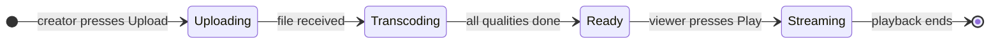

That is the whole product. A video starts as a raw file, becomes a set of small chunks at multiple quality levels, and then gets served to viewers from a server near them. Every design decision below exists to make one of those three transitions faster or cheaper.

> **Take this with you.** Video streaming is a pipeline, not a service. Upload and playback are two different systems. Treat them that way from the first sentence.

---

## Step 2: Ask the right questions

In a real interview, spend two minutes writing down your questions before drawing anything. Not twenty questions. Five focused ones.

<details markdown="1">
<summary><b>Show: 5 questions that change the design</b></summary>

1. **YouTube or Netflix?** They look the same from the outside. YouTube takes uploads from anyone (any quality, any format, billions of videos most people never watch). Netflix has a small curated library where nearly every video is popular. Storage tiering is nearly opposite: YouTube is cold-heavy, Netflix is mostly hot. *This is the biggest design fork.*

2. **Live or recorded (VOD)?** Live streaming needs sub-3-second glass-to-glass latency. Recorded video (VOD) is prepared once and served forever. They share almost no infrastructure. Scope to VOD and mention live as an extension.

3. **Which codecs?** H.264 encodes fast and plays everywhere. H.265 cuts file size by 30% but encodes 3x slower. AV1 cuts another 30% but is 15-30x slower than H.264 to encode. Deciding to support AV1 can multiply the compute bill by 5x. *The codec ladder is the transcoding budget.*

4. **How large can uploads be?** YouTube allows videos up to 256 GB. A file that large cannot arrive in one HTTP request. If the Wi-Fi drops at 4.9 GB, the user starts over unless you support resumable uploads.

5. **How fresh do analytics need to be?** View counts that are a few minutes stale are fine for the watch page. Creator dashboards that update hourly are fine. Anything under 5 seconds freshness requires a separate real-time pipeline. *Each freshness target is a different system and a different cost.*

A strong candidate also asks whether DRM is in scope. YouTube is ad-supported and open. Netflix encrypts every segment and requires a per-device license. The license server is its own system.

</details>

---

## Step 3: How big is this thing?

The same design phrase, two very different companies.

| Metric | YouTube scale | Smaller platform |
|--------|--------------|-----------------|
| Upload | 500 hours of video per minute | 5 hours per minute |
| Viewers | 125 million concurrent at peak | 1 million |
| Egress | 250 Tbps peak | 2.5 Tbps |
| Storage growth | 70 PB per year | 700 TB per year |

<details markdown="1">
<summary><b>Show: how the numbers come out</b></summary>

**Upload ingest.** 500 hours per minute = 500 × 60 = 30,000 seconds of video arriving every 60 seconds. That means 500 seconds of new footage lands every second (many creators uploading at once). At an average source bitrate of 10 Mbps per upload, that is 500 × 10 Mbps / 8 = **5 Gbps sustained**, roughly **15 Gbps at peak**.

**New videos per day.** 500 hours/min × 60 min × 24 hr / 4-min average video length ≈ **450,000 videos per day**, or about 5 per second at steady state.

**Concurrent viewers.** 1 billion watch-hours per day × 3,600 sec/hr / 86,400 sec/day = **42 million people watching at any moment** on average. At peak (Friday night, major event): about **125 million at once**.

**Peak egress.** 125 million viewers × 2 Mbps average (most people on mobile watch 480p or 720p) = **250 Tbps**. No single server, no single data center, can send that. This is the reason a CDN exists.

**Storage growth.** 500 sec of source video per second × 86,400 sec/day × 365 days/year × (10 Mbps / 8 bits per byte) ≈ **20 PB/year for source files**. Transcoded variants add another 50 PB/year (each source becomes 7-9 quality copies). Total: roughly **70 PB of new data per year**.

**Three numbers dominate the whole design:**

| Number | Size | Why it matters |
|--------|------|----------------|
| Peak egress | 250 Tbps | Requires a global CDN with hundreds of servers |
| Transcoding compute | Thousands of CPU cores | Running 24/7, just to keep up with uploads |
| Storage | 70 PB/year, growing forever | Tiering by access frequency saves ~5x in cost |

Everything in the architecture exists to keep one of these three numbers manageable.

</details>

---

## Step 4: The smallest thing that works

Forget YouTube. We are a tiny platform with 100 creators and 10,000 viewers.

Three boxes. One upload flow.

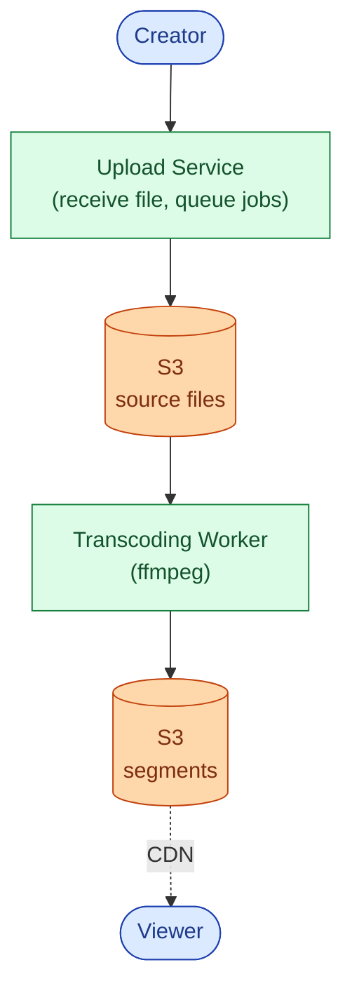

The sequence for an upload is short.

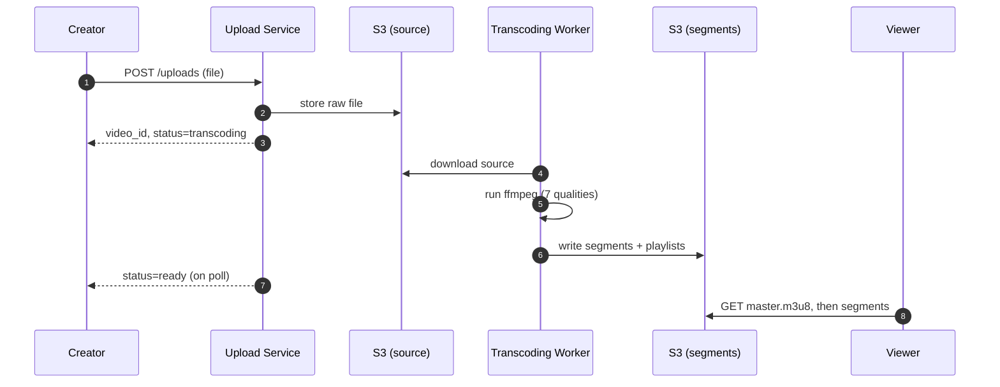

<details markdown="1">
<summary><b>Show: the two key tables</b></summary>

```sql
CREATE TABLE videos (
    video_id    VARCHAR(16) PRIMARY KEY,
    owner_id    BIGINT NOT NULL,
    title       VARCHAR(200),
    status      TEXT NOT NULL,   -- 'uploading', 'transcoding', 'ready', 'blocked'
    source_path TEXT,
    created_at  TIMESTAMPTZ NOT NULL DEFAULT NOW()
);

CREATE TABLE variants (
    video_id    VARCHAR(16),
    quality     VARCHAR(20),     -- '360p_h264', '1080p_h265'
    status      TEXT NOT NULL,   -- 'pending', 'encoding', 'ready', 'failed'
    output_path TEXT,
    completed_at TIMESTAMPTZ,
    PRIMARY KEY (video_id, quality)
);
```

`variants` has one row per (video, quality) so each transcoding job updates its own row independently. No locking on a shared JSON blob.

</details>

> **Take this with you.** At small scale, the whole system is a file upload, a background job, and a CDN URL. Complexity comes in when you need resumable uploads, queuing, and storage tiering, not before.

---

## Step 5: The first crack

The startup gets traction. Creators complain that a bad Wi-Fi connection makes them restart their 2 GB upload from zero. A 5-minute video is now 45 minutes because they have to keep trying.

The fix is resumable uploads. The idea: instead of one big HTTP request, the client sends 16 MB chunks. If a chunk fails, only that chunk retries.

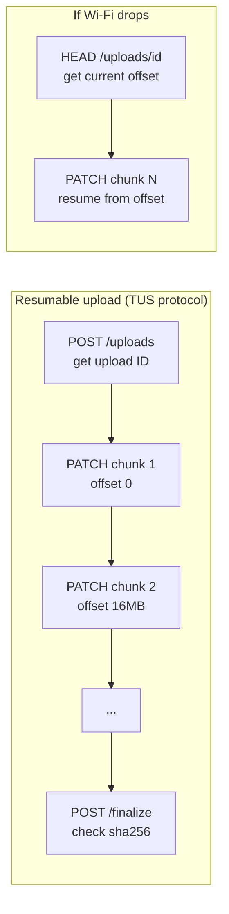

This is called the **TUS protocol** (or S3 multipart, which uses the same idea). The client calls `HEAD /uploads/<id>` to ask "where did we stop?" Then it continues from that byte offset. Only the failed chunk retries.

The second crack arrives right after: uploads are fast but transcoding is slow. A single worker falls behind when multiple creators upload at the same time. The worker needs to be a pool, not a single process. And a crash mid-job should not lose the work.

Both of these problems point toward the same fix: a durable job queue.

> **Take this with you.** Chunked uploads and a job queue are not extras. They are what makes the system work for anyone uploading from a phone.

---

## Step 6: Build the architecture, one layer at a time

### v1: one upload flow

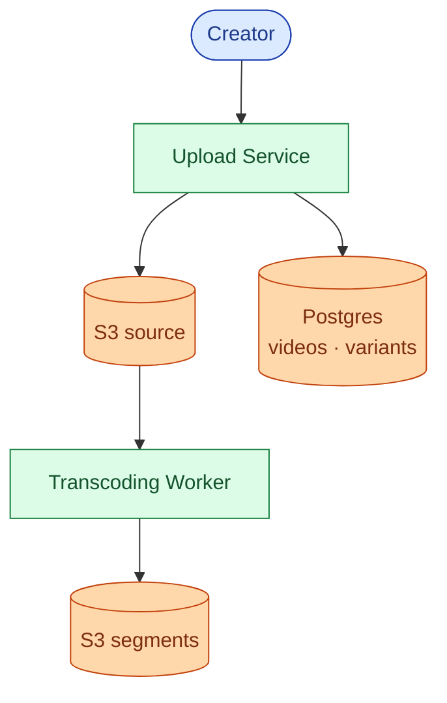

Fine for a few uploads per minute.

### v2: add a job queue so the worker pool can scale

When uploads outnumber workers, jobs need to wait somewhere. The queue also makes each job retryable: if a worker crashes, the job goes back to the queue.

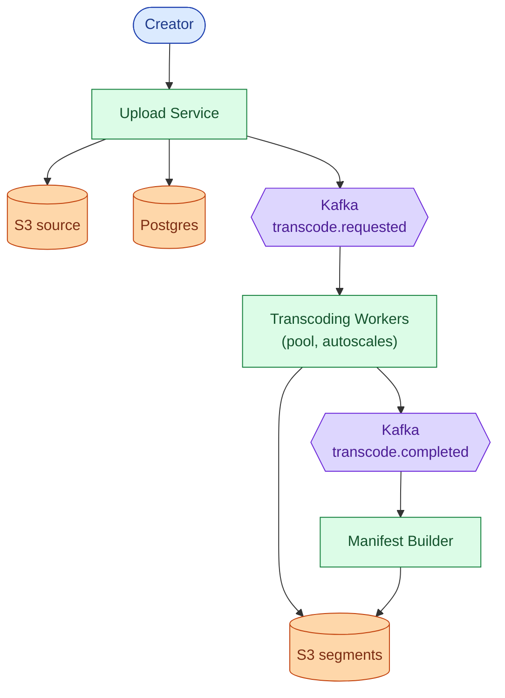

### v3: add the playback path

Upload and playback share almost nothing. The playback path is its own service.

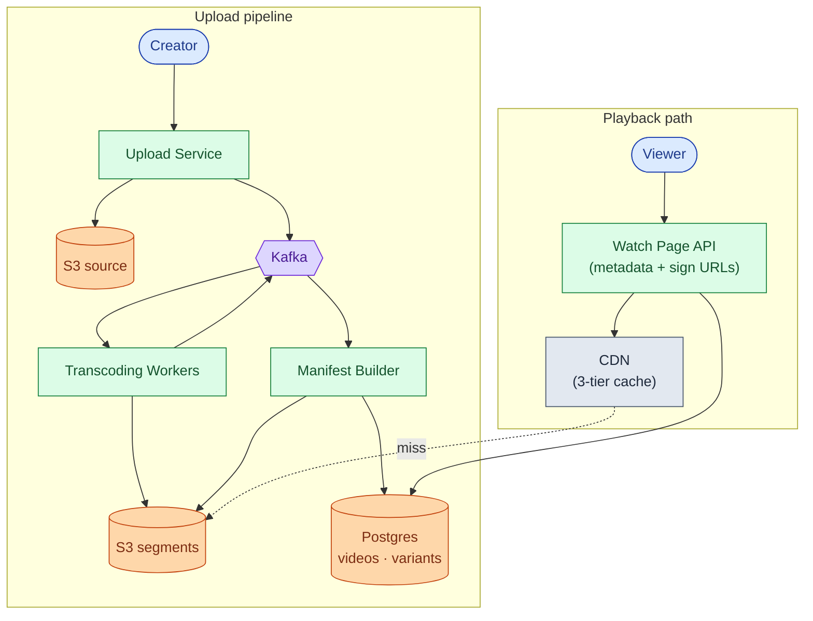

### v4: add telemetry, analytics, and storage tiering

Now viewers are watching and creators want to see data. And 70 PB/year of storage costs money unless you tier it.

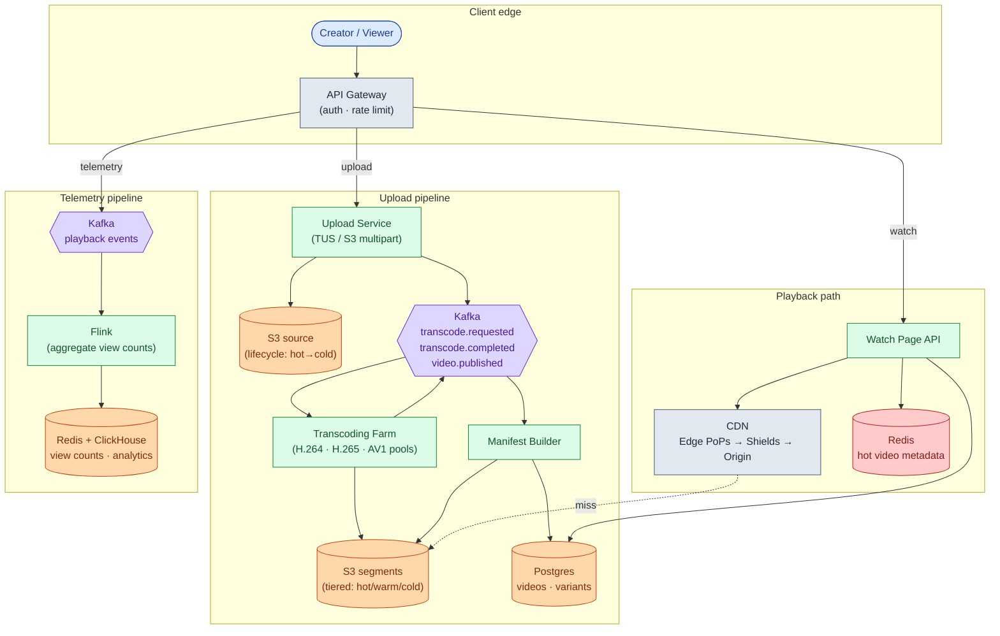

Each box in one line:

| Box | What it does |
|-----|--------------|
| **API Gateway** | Auth, rate limits, routes upload vs playback vs telemetry traffic |
| **Upload Service** | Accepts chunked uploads, issues TUS resumption tokens, triggers transcoding |
| **Kafka** | Durable queue between pipeline stages. Worker crashes do not lose jobs |
| **Transcoding Farm** | Pools of ffmpeg workers, one pool per codec. Autoscales on Kafka lag |
| **Manifest Builder** | Assembles master.m3u8 as quality variants complete |
| **Postgres** | Video catalog, per-variant job status |
| **Watch Page API** | Reads metadata, signs CDN URLs, returns JSON. The only code on the playback hot path |
| **CDN** | Three tiers: edge PoPs, regional shields, S3 origin. 95%+ cache hit rate target |
| **Redis** | Hot video metadata cache. Cuts Postgres reads by 100x for popular videos |
| **Flink + ClickHouse** | Stream-aggregate view counts and watch-time data for creator dashboards |

> **Take this with you.** Kafka is the backbone of the upload pipeline. If a transcoding worker dies at 3 a.m., the job is not lost. Kafka holds it until another worker picks it up.

---

## Step 7: One upload, all the way through

Alice records a 5 GB video of her cooking a meal. She presses Upload from her phone.

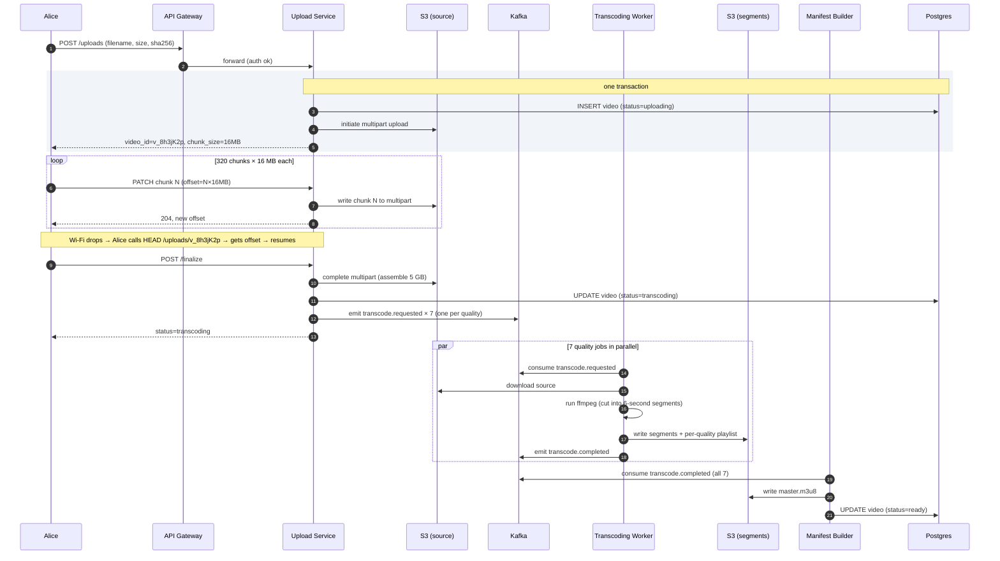

Three things worth pointing at:

1. The `INSERT video` and `initiate multipart` happen in the same transaction. If the server crashes mid-way, the video row and the S3 upload either both exist or neither does.
2. The `finalize` call is idempotent. If Alice retries because her connection dropped, the second call sees the multipart upload is already complete and skips ahead.
3. Workers produce segments at the same time cut points across all qualities. That alignment is what lets the player switch from 360p to 1080p mid-stream without a visual glitch.

---

## Step 8: How playback works

A viewer opens the watch page. Their player makes a sequence of small HTTP requests, each to the CDN.

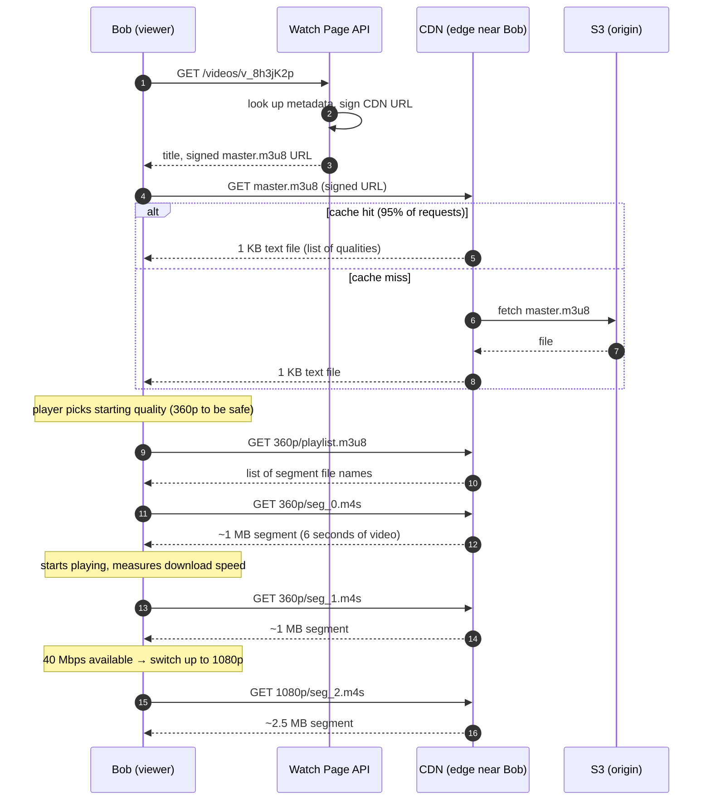

The player switches quality between segments, not mid-segment. This is called **ABR (adaptive bitrate streaming)**. Every quality uses the same segment start times (every 6 seconds), so switching from one quality to another is a clean cut.

The master playlist looks like this:

```
#EXTM3U
#EXT-X-STREAM-INF:BANDWIDTH=700000,RESOLUTION=640x360
360p/playlist.m3u8
#EXT-X-STREAM-INF:BANDWIDTH=2500000,RESOLUTION=1280x720
720p/playlist.m3u8
#EXT-X-STREAM-INF:BANDWIDTH=5000000,RESOLUTION=1920x1080
1080p/playlist.m3u8
```

The player reads this file and picks a starting quality based on the viewer's bandwidth. Then it keeps measuring and adjusts up or down as conditions change.

> **Take this with you.** The player never asks your servers for video bytes. It asks the CDN. Your Watch Page API only provides the signed URL and metadata. After that, your code is out of the loop.

---

## Step 9: Why the CDN is the whole story

250 Tbps egress. No single data center can send that. The CDN is not an optimization. It is the only reason the system works.

A CDN has three tiers. The viewer's request lands at the closest tier first. Each tier caches to protect the tier behind it.

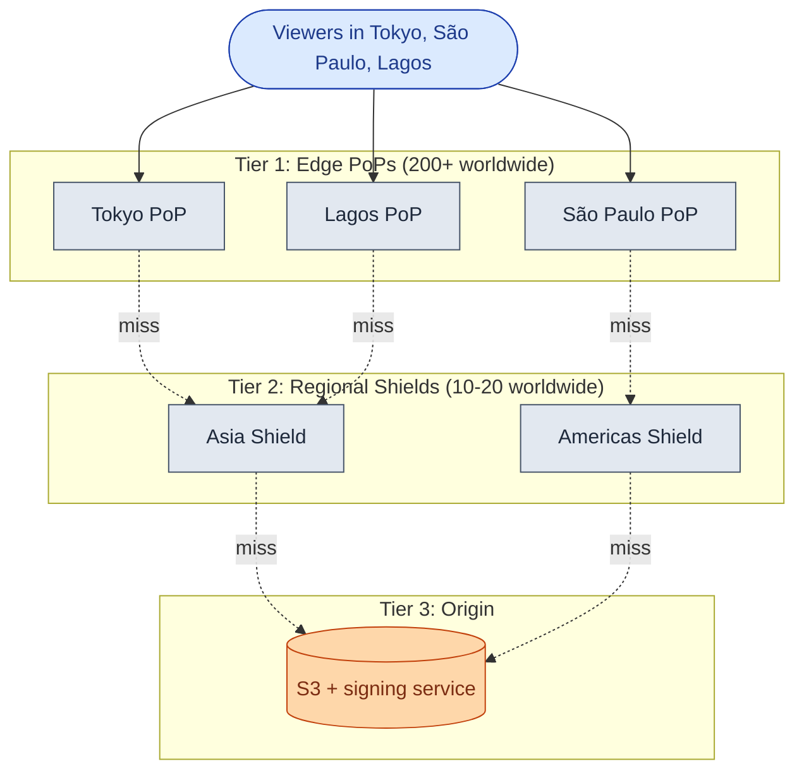

Why the regional shield matters: without it, 200 edge PoPs each missing the same segment all hit S3 directly. That is 200 S3 requests for one piece of content. The shield absorbs them. It fetches from S3 once and serves the other 199 edge PoPs from its cache.

With a 95% edge hit rate, only 5% of requests reach the shield. Only 20% of those reach S3. Your origin sees roughly 1% of total traffic. At 250 Tbps total, that means S3 sees about 2.5 Tbps. Without the CDN, S3 would see 250 Tbps and your cost would be 100x higher.

**Cache TTL choices:**

| Content | TTL | Reason |
|---------|-----|--------|
| Video segments (`seg_N.m4s`) | 7 days | Segments never change once written |
| Master playlist (`master.m3u8`) | 60 seconds | New qualities become available as transcoding completes |
| Thumbnails | 1 year | Immutable once created |
| Signed URLs | 4-8 hours | Expire before they can be shared for free |

> **Take this with you.** "Use a CDN" is not a design. The regional shield is the critical piece. Without it, S3 cannot absorb the request volume on cache misses.

---

## Step 10: Storage tiering

The system produces 70 PB of new data per year. Storage is the third-biggest cost, after CDN and compute. The key insight: most videos are never watched after the first week.

| Tier | What lives here | S3 class | Cost ($/GB/month) |
|------|-----------------|----------|-------------------|
| Hot | Segments watched in the last 7 days | S3 Standard | $0.023 |
| Warm | Segments watched in the last 90 days | S3 Infrequent Access | $0.0125 |
| Cold | Long-tail segments, source files after 30 days | S3 Glacier Instant | $0.004 |
| Archive | Source files with no view in a year | S3 Glacier Deep Archive | $0.00099 |

A daily tiering job reads `last_viewed_at` from the analytics database. It demotes variants with no recent views. It promotes them back when a cold video suddenly goes viral.

With tiering at roughly 5% hot / 15% warm / 80% cold, the blended cost drops from $0.023/GB to about $0.005/GB. That is a 4-5x reduction on the third-biggest line item.

Source files are kept forever. A new codec ships every few years (AV2 will follow AV1). You will need the original source to re-encode without losing quality.

---

## Follow-up questions

Try answering each in 2 or 3 sentences before opening the solution.

1. **Delete a viral video.** A creator deletes a video that has 100M views. It is cached in hundreds of edge PoPs around the world. How do you stop playback globally within 60 seconds?

2. **AV1 backfill.** You want to re-encode the top 10,000 videos in AV1 to reduce bandwidth costs. How do you pick which videos to prioritize, and how do you run the job without disrupting live uploads?

3. **Live streaming.** A creator wants to broadcast a concert to 5 million concurrent viewers with under 3 seconds of delay. What changes in the architecture? What stays the same?

4. **Thumbnails at scale.** Every video needs 1-3 main thumbnails and auto-generated frames for the seek bar. How do you generate, store, and serve them? (There are ~120 seek frames per 4-minute video.)

5. **Copyright takedown.** A valid takedown notice arrives. You must block playback globally within 5 minutes. You cannot delete the source file (it may be needed for legal review). How do you do it?

6. **Watch-time analytics.** A creator wants to see "60% of viewers dropped off at the 3:47 mark." Where does that data come from, and how do you compute it across billions of viewer sessions?

7. **DRM (Netflix mode).** The product switches to a subscription model. Every segment must be encrypted. Every device must get a decryption key before playback. What does the key flow look like?

8. **Multiple audio tracks.** A video has English, Spanish, and Hindi audio, plus 12 subtitle languages. How do these fit into an HLS master playlist? How does the player know which audio to download?

9. **Regional shield outage.** Your Asia regional shield goes down. What is the blast radius? What happens to the 200 edge PoPs behind it?

10. **Real-time view counts.** The recommendation team needs view counts with under 5 seconds of freshness for ranking signals. Your current Flink pipeline has 30 minutes of lag. What do you change?

---

## Related problems

- **[URL Shortener (001)](../001-url-shortener/question.md).** Introduces CDN caching, TTL trade-offs, and hot-key problems at a smaller scale.
- **[Notification System (010)](../010-notification-system/question.md).** The "your video is ready" and "new video from someone you follow" notifications run through it.
- **[News Feed (002)](../002-news-feed/question.md).** The watch page entry is one row in a feed. They share the metadata store and the follow graph.
- **[Distributed Cache (009)](../009-distributed-cache/question.md).** The manifest cache and hot-metadata cache use the same principles.
