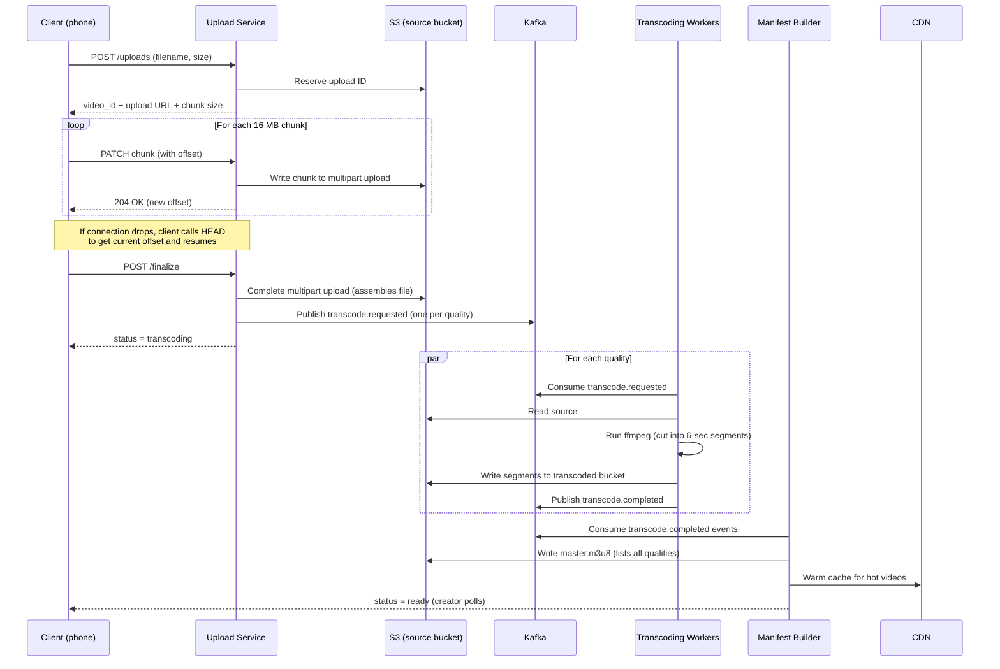
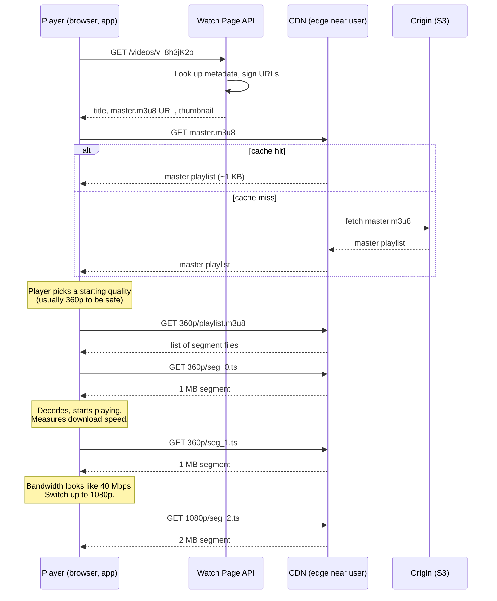
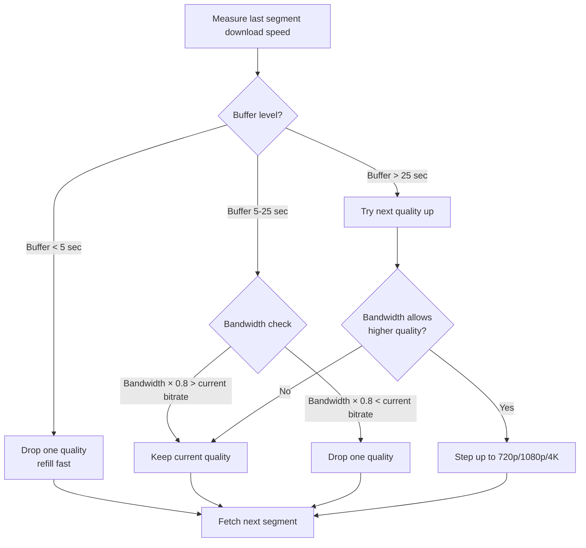

## The scene

You sit down for the interview. The interviewer says:

> *"Design YouTube. Or Netflix, pick one. I want to see how a video gets from a phone to a screen on the other side of the world."*

It sounds like one problem. It is really two problems sharing a database.

**Problem one: upload and prepare a video.** Someone records a video. We take their file, convert it into many sizes, and store it. This part is slow. It runs in the background. We do it once per video.

**Problem two: play a video.** Millions of people press play. We send them video bytes fast, in the right size for their internet speed. This part has to be quick. We do it billions of times per day.

These two halves share almost nothing. They use the same database for video info, and the same storage bucket for files. That is it. If you try to design both at the same time with one big diagram, you will get lost in ten minutes.

We will walk through this step by step. We will start small and add pieces as needed.

---

## Step 1: Ask the right questions

Before drawing anything, sit for five minutes. Write down questions you would ask the interviewer.

A good answer here is not "20 questions about edge cases." It is a small set of questions where the answer changes the whole design.

<details markdown="1">
<summary><b>Show: 8 questions that matter</b></summary>

1. **YouTube or Netflix?** They look the same but they are not. YouTube takes uploads from anyone (any quality, any format, billions of videos most people never watch). Netflix has a small library where every video is popular. Storage choices and the pipeline both change. For this design, assume YouTube-style.

2. **Live or recorded?** Live streaming (a concert happening right now) needs sub-3-second delay between camera and screen. Recorded videos (VOD = video on demand) get prepared once and served forever. They share almost no infrastructure. Scope to VOD. Mention live as an extension.

3. **Global or one country?** Global means we need servers in many places. The bill for sending bytes around the world is the biggest cost in the whole system.

4. **How many video qualities?** The standard set: 240p, 360p, 480p, 720p, 1080p, 1440p, 4K. More qualities means more files to make. Adding the AV1 codec (newer, smaller files but slow to make) can multiply our compute bill by 5x.

5. **How big can uploads be?** YouTube allows 12-hour videos up to 256 GB. A file that big cannot be uploaded in one go. If the wifi drops once, the whole upload restarts. We need resumable uploads.

6. **DRM (digital rights management) and paid content?** YouTube is free with ads. Netflix needs DRM, which means encrypted videos and a license server. Different system.

7. **Is search and recommendations in scope?** Huge separate systems. Right answer: "out of scope, but I will show where they plug in."

8. **Analytics speed?** View counts can be a few minutes late (YouTube famously delays them). Creator dashboards can update once a day. Each freshness target costs different money.

If you only asked "how many users," you missed the biggest questions. Question 2 (live or VOD) and question 4 (which codecs) each move the compute bill by 10x.

</details>

---

## Step 2: How big is this thing?

Same problem, real numbers. Do the math before you draw boxes.

Assume:

- **500 hours** of video uploaded per minute
- **1 billion hours** watched per day
- Average view: **10 minutes**
- Average upload: **4 minutes**
- Bitrate ladder (the standard set of qualities and their data rates):
  - 240p = 400 kbps (kilobits per second)
  - 360p = 700 kbps
  - 480p = 1.2 Mbps (megabits per second)
  - 720p = 2.5 Mbps
  - 1080p = 5 Mbps
  - 1440p = 9 Mbps
  - 4K = 20 Mbps
- Codecs (the rules for compressing video): H.264 always, H.265 for 720p and above, AV1 for the top 1% most-watched
- Source files kept forever (in case we need to re-encode in a new codec later)
- Target start time: under 2 seconds before video plays

Try to compute these on paper first:

1. Upload bandwidth (bytes per second arriving from creators)
2. New videos per day
3. Viewers watching at the same time
4. Egress (bytes per second going out to viewers) at peak
5. Storage growth per year

<details markdown="1">
<summary><b>Show: the math</b></summary>

**Upload bandwidth.** 500 hours per minute = 500 × 60 = 30,000 seconds of video per minute = **500 seconds of video per second**. At an average 10 Mbps (a typical phone upload), that is 500 × 10 = **5 Gbps sustained**, **15 Gbps at peak**.

> Why "seconds of video per second"? If 500 seconds of new footage arrives every second, our system is taking in video faster than time itself. That sounds wrong but it is just many people uploading at once.

**Videos per day.** 500 hours × 60 min × 24 hours / 4-minute average length = **about 450,000 new videos per day**. About 5 new videos every second. At peak: 15 per second.

**Concurrent viewers.** 1 billion hours per day × 3600 seconds / 86400 seconds in a day = **42 million viewer-seconds per second**. That means 42 million people watching at the same moment on average. At peak (Friday night, big sports event): about **125 million at once**.

**Egress at peak.** 125 million viewers × 2 Mbps average (most people watch at 480p or 720p on mobile) = **250 Tbps (terabits per second) peak**.

> Why this is the whole story. 250 Tbps is the dominant number in the design. No single server can send that. No single data center can send that. This is why we need a CDN (content delivery network, a set of servers placed close to users that cache content). The CDN serves 95% of bytes from close-by caches. Our origin only sees the 5% that misses.

**Storage per year.** 500 seconds of input per second × 86,400 seconds per day × 365 days × (10 Mbps / 8 bits per byte) = **about 20 PB (petabytes) per year just for source files**. Plus the converted versions (more on these later), the system grows by **about 70 PB per year**. And it never stops growing.

**The takeaway.** Three numbers dominate the whole design:

| Number | Size | Where it lives |
|--------|------|----------------|
| Egress | 250 Tbps peak | CDN |
| Transcoding compute | thousands of CPU cores | A worker farm |
| Storage | 70 PB per year, forever | Tiered S3 |

Everything we design exists to make one of these three numbers smaller.

</details>

---

## Step 3: How does an upload work?

A creator on their phone records a 5 GB video. They press upload. What happens next?

Take ten minutes to think. Consider:
- What if their wifi drops at 90%?
- Where does the file land first?
- Who decides when to start converting?
- How does the creator know "uploaded" vs "ready to watch"?

<details markdown="1">
<summary><b>Show: the upload pipeline</b></summary>

The upload pipeline has six stages. Each must be restartable on its own. A failure at stage 5 should not redo stages 1 through 4.

**The flow:**



**What each stage does:**

1. **Start.** Client calls `POST /uploads` with filename and total size. Server returns an upload ID and a chunk size (usually 16 MB). Server writes a row in the database with `status = uploading`.

2. **Send chunks.** Client cuts the file into 16 MB pieces. For a 5 GB video that is about 320 chunks. Each chunk is sent as `PATCH /uploads/<id>` with a header telling the server which byte range this is. The server writes it to S3 as part of a multipart upload.

    This uses the **TUS protocol** (or S3 multipart, similar idea). TUS = a standard for resumable uploads on top of HTTP. The key point: each chunk has an offset. If chunk 47 fails, the client retries chunk 47 only.

    > Why chunks instead of one big upload? A single 5 GB PUT cannot resume. If the wifi drops at 4.9 GB, you start over. With chunks, only the failing chunk retries. If the connection drops for ten minutes, the client asks the server "where am I?" using `HEAD /uploads/<id>`, gets back the current offset, and continues from there.

3. **Finalize.** When all chunks are in, client calls `POST /uploads/<id>/finalize`. Server tells S3 to glue the chunks into one file. Server checks the sha256 hash if the client sent one. Status changes to `transcoding`.

4. **Queue conversion jobs.** Server publishes messages to Kafka (a durable message queue). One message per quality level: "convert v_123 to 240p", "convert v_123 to 360p", and so on. About 7-9 messages per video.

5. **Workers convert.** A pool of transcoding workers (running ffmpeg) read jobs from Kafka. For each job, a worker:
    - Downloads the source from S3.
    - Runs ffmpeg with the right codec and bitrate.
    - Cuts the output into 6-second segments (small files like `seg_42.ts`).
    - Uploads the segments back to S3 in a per-video folder.
    - Writes a per-quality playlist (`playlist.m3u8`) that lists all the segment files.
    - Publishes `transcode.completed`.

6. **Build the master manifest.** A separate service watches for `transcode.completed` events. When all qualities are done (or even after the first one if we want fast availability), it writes a `master.m3u8` file. This is a small text file listing all the qualities. Status changes to `ready`. The creator can now publish the video.

> Why 6-second segments? If your network drops mid-video, only the next 6 seconds need to re-buffer, not the whole movie. The player can also switch to a lower quality between segments (without restarting the video) if your wifi gets weaker.

</details>

---

## Step 4: Draw the upload architecture

You know the upload flow. Now draw the boxes. Six pieces are missing. Think about: what catches the chunks, where source files land, what queues the work, what does the converting, what builds the playlist, and where video info lives.

```
            Creator (phone, browser)
                    |
                    | upload chunks
                    v
            +-----------------+
            |   [ ? A ]       |  catches chunks, validates, writes to source
            +--------+--------+
                     |
                     v
            +-----------------+
            |   [ ? B ]       |  source files
            +--------+--------+
                     |
                     | enqueue convert jobs
                     v
            +-----------------+
            |   [ ? C ]       |  message queue
            +--------+--------+
                     |
                     v
            +-----------------+
            |   [ ? D ]       |  convert workers (CPU + GPU)
            +--------+--------+
                     |
                     | write segments
                     v
            +-----------------+
            |  S3 transcoded  |  240p, 360p, 480p ... segments
            +--------+--------+
                     |
                     v
            +-----------------+
            |   [ ? E ]       |  builds master.m3u8 when ready
            +--------+--------+
                     |
                     v
            +-----------------+
            |   [ ? F ]       |  video catalog (title, status, owner)
            +-----------------+
```

<details markdown="1">
<summary><b>Show: the full upload architecture</b></summary>

```
            Creator (phone, browser)
                    |
                    | TUS or S3 multipart (chunked, resumable)
                    v
            +-------------------+
            | Upload Gateway    |  Stateless API. Auth, quota check,
            | (API pods)        |  sha256 verify, chunk routing.
            +---------+---------+
                      |
                      v
            +-------------------+
            | s3://video-source |  Source bucket. Lifecycle policy
            | (S3 Standard)     |  moves old files to cold storage.
            +---------+---------+
                      |
                      | on finalize -> Kafka
                      v
            +-------------------+
            | Kafka             |  Topics: transcode.requested,
            | (message queue)   |  transcode.completed,
            |                   |  video.published.
            +---------+---------+
                      |
                      v
            +-------------------+
            | Transcoding Farm  |  Kubernetes pool.
            | (ffmpeg workers)  |  CPU nodes for H.264 / H.265,
            |                   |  CPU nodes for AV1 (slow but worth
            |                   |  it for popular videos).
            +---------+---------+
                      |
                      v
            +-------------------+
            | s3://transcoded   |  Per-video folder of segments.
            +---------+---------+  Hot videos copied to many regions.
                      |
                      v
            +-------------------+
            | Manifest Builder  |  Reads transcode.completed events.
            | (stateless svc)   |  Writes master.m3u8 / manifest.mpd.
            +---------+---------+
                      |
                      v
            +-------------------+
            | Metadata DB       |  Cassandra. videos table:
            | (videos, variants)|  video_id PK; title, status, owner,
            |                   |  ready_qualities, created_at.
            +-------------------+
```

**What each piece does, in one line:**

- **Upload Gateway.** A stateless web service. Catches the chunks, checks the user is logged in, checks they have not exceeded their upload quota.
- **Source bucket.** Cheap, durable object storage. Sources move to colder (cheaper) storage after 30 days.
- **Kafka topic.** A durable queue. If the worker farm is busy, jobs wait their turn. If a worker crashes, the job becomes available to another worker.
- **Transcoding workers.** Pods running ffmpeg. One worker handles one (video, quality) job at a time. Idempotent: re-running a job overwrites the same output files.
- **Transcoded bucket.** Holds all the small segment files. The whole playback path reads from here (through the CDN).
- **Manifest Builder.** Stateless service. Listens for "this quality is done" events. When enough qualities are done, writes the master playlist that the player will read.
- **Metadata DB.** The catalog. One row per video. Cassandra is the right pick because reads are by `video_id` only (no complex joins).

</details>

---

## Step 5: How does playback work?

A viewer presses play. The player makes a series of HTTP requests. Think about: what does it ask for first? In what order? How does the player decide what quality to send?

Take ten minutes, then check.

<details markdown="1">
<summary><b>Show: the playback flow</b></summary>

The playback sequence:



**Step by step:**

1. **Watch page loads.** Browser calls `GET /videos/v_8h3jK2p`. Server returns title, thumbnail, and the URL of the master playlist. The master URL is signed (has a token that expires in 4 hours) so it cannot be embedded for free elsewhere.

2. **Player fetches the master playlist.** A tiny text file (~1 KB) like this:

    ```
    #EXTM3U
    #EXT-X-STREAM-INF:BANDWIDTH=400000,RESOLUTION=426x240
    240p/playlist.m3u8
    #EXT-X-STREAM-INF:BANDWIDTH=700000,RESOLUTION=640x360
    360p/playlist.m3u8
    #EXT-X-STREAM-INF:BANDWIDTH=2500000,RESOLUTION=1280x720
    720p/playlist.m3u8
    #EXT-X-STREAM-INF:BANDWIDTH=5000000,RESOLUTION=1920x1080
    1080p/playlist.m3u8
    ```

    Each line says: "this quality needs this much bandwidth." The player picks one.

3. **Player picks a starting quality.** Usually starts at 360p or 480p. Not at 1080p, because we do not yet know how fast the network is.

4. **Player fetches the variant playlist.** Returns a list of segment files:

    ```
    #EXTM3U
    #EXT-X-TARGETDURATION:6
    #EXTINF:6.0,
    segment_0.ts
    #EXTINF:6.0,
    segment_1.ts
    ...
    ```

    Each segment is 6 seconds of video.

5. **Player fetches segments and plays.** It downloads segment 0, starts decoding, starts playing. While segment 0 plays, it fetches segment 1. Then segment 2. The buffer (the amount of video ready to play next) fills up to about 30 seconds ahead.

6. **Player measures bandwidth.** If a 1 MB segment downloads in 200 ms, that is 5 MB/s = 40 Mbps. So we have plenty of room for 1080p (5 Mbps).

7. **Player switches qualities between segments.** Next request goes to `1080p/seg_3.ts` instead of `360p/seg_3.ts`. The viewer sees the picture get sharper.

**This is called ABR (adaptive bitrate).** The player adapts the bitrate to your current network.



> Why does every quality need the same segment boundaries? Because the player switches between segments. If 360p cuts at 6.0s, 12.0s, 18.0s, then 1080p must also cut at 6.0s, 12.0s, 18.0s. Otherwise switching mid-stream causes a visible glitch.

**HLS vs DASH.** Both do the same thing two ways:

- **HLS** (HTTP Live Streaming, Apple's standard). Manifests are `.m3u8` text files. Segments are `.ts` or `.m4s` files. Default on iOS and Safari.
- **DASH** (Dynamic Adaptive Streaming over HTTP, an ISO standard). Manifests are `.mpd` XML files. Segments are `.m4s`. Default on Android.

Modern systems write segments once in `.m4s` (the **CMAF** format, Common Media Application Format) and produce both an HLS playlist and a DASH manifest pointing to the same byte files. Best of both.

</details>

---

## Step 6: Why the CDN is the whole story

We computed 250 Tbps egress at peak. No single server can send that. We need to spread the load across hundreds of servers placed close to viewers around the world. That is what a CDN does.

A CDN has three tiers (layers). The viewer hits the closest tier first. If that tier does not have the file, it asks the next tier up.

<details markdown="1">
<summary><b>Show: the three-tier CDN</b></summary>

```
                  +-------------------------------+
                  |  Viewers (all around globe)   |
                  +---+---------+--------+--------+
                      |         |        |
            Tokyo     |    NYC  |    Sao Paulo
                      v         v        v
                  +-------+ +-------+ +-------+
                  | Edge  | | Edge  | | Edge  |     Tier 1: Edge PoPs
                  | PoP   | | PoP   | | PoP   |     200+ worldwide
                  | Tokyo | | NYC   | | SP    |     Cache: 95% hit
                  +---+---+ +---+---+ +---+---+     TTL: 7 days
                      |         |         |          Latency: <50ms
                      |         |         |
                      v         v         v
                  +---------+         +---------+
                  | Shield  |         | Shield  |    Tier 2: Regional
                  | (Asia)  |         | (US-E)  |    shields, 10-20
                  +----+----+         +----+----+    Cache: 80% hit on miss
                       |                   |        TTL: 7 days
                       |                   |        Latency: <100ms
                       +---------+---------+
                                 |
                                 v
                          +-------------+
                          |   Origin    |             Tier 3: Origin
                          |   (S3 +     |             1 per region
                          |   signer)   |             Authoritative
                          +-------------+             Latency: ~30ms
```

**How it works:**

- **Edge PoP.** A PoP is a "point of presence." A small data center in a city. There are 200+ around the world. Holds the most popular content. When you press play in Tokyo, your request lands at the Tokyo PoP. 95% of requests get served right here.

- **Regional shield.** One per cloud region (about 10-20 worldwide). When the Tokyo edge does not have the file, it asks the Asia shield. The shield holds everything any Asia edge ever fetched. Without this shield, 200 edges would all hit S3 directly for the same missing file. With the shield, the shield does one S3 fetch and serves the other 199.

- **Origin.** S3 plus a small URL-signing service. The source of truth. Holds every segment of every video ever uploaded.

> Why this matters. CDN egress costs $0.005 to $0.02 per GB depending on volume. At 600 PB per day (250 Tbps), that is $3M to $12M per day if we paid for every byte. With 95% edge hit rate, only 5% of bytes touch the shield. Only 20% of that touches S3. So S3 sees about 1% of total = ~6 PB per day. The cache hit rate is the most important number in the whole bill.

**Tuning:**

- **Segment TTL: 7 days.** Segments never change once written. Long TTL is safe.
- **Master playlist TTL: 60 seconds.** Master playlists do change (when a new quality finishes encoding). Short TTL so viewers see new qualities quickly.
- **Purge on takedown.** All major CDNs (Cloudflare, Fastly, Akamai, CloudFront) can purge by pattern (`/v_123/*`) in seconds.

</details>

---

## Step 7: Storage tiering

We grow by 70 PB per year. Some videos get a billion views (Gangnam Style). Most get fewer than 100 views ever. Storing them all the same way is wasteful.

Think about: which videos belong on fast (expensive) storage? Which can sit on slow (cheap) storage? Where do source files go?

<details markdown="1">
<summary><b>Show: the storage tiers</b></summary>

Each video has two storage components: the **source** (the original upload) and the **transcoded variants** (what viewers watch). Each one moves between tiers independently based on age and views.

| Tier | What lives here | Storage type | Cost ($/GB/month) | Retrieval |
|------|-----------------|--------------|-------------------|-----------|
| CDN edge | Segments getting views right now | SSD/RAM at PoPs | (cache, not paid storage) | <50 ms |
| Shield | Warm segments per region | Regional SSD | $0.10 | <100 ms |
| Hot | Variants of popular videos | S3 Standard | $0.023 | ~30 ms |
| Warm | Variants of less popular videos | S3 Infrequent Access | $0.0125 | ~30 ms + per-GB fee |
| Cold | Source files after 30 days, variants of dead videos | S3 Glacier Instant | $0.004 | seconds |
| Archive | Sources of videos with no views in a year | S3 Glacier Deep Archive | $0.00099 | 12 hours |

**How content moves:**

- **New upload.** Source goes to hot. Variants go to hot. CDN warms up naturally as viewers watch.
- **Daily tiering job.** Reads last-viewed timestamps. Demotes a variant (hot to warm) if no views in 7 days. Demotes again (warm to cold) if no views in 90 days.
- **Promotion on read.** If a cold variant suddenly gets a spike of views (an old video goes viral), the first viewer pays a small retrieval cost. The job then promotes it back to hot.
- **Source files.** Kept forever. We might need them later to re-encode in a new codec (when AV2 ships, for example). After 30 days, source moves from hot to cold. Re-encoding from cold takes a few seconds, fine for a background job.

**The money math:**

- 70 PB of new content per year, growing.
- If all of it stayed in S3 Standard: $0.023/GB/mo × 70 PB × 12 = **$20M/year** for one year of content. After 10 years compounded: hundreds of millions.
- With tiering: roughly 5% hot, 15% warm, 80% cold. Blended cost: ~$0.005/GB/mo. Same data costs **~$4M/year**. About 5x cheaper.

> Why tiering is a trade-off. Aggressive demotion saves money but costs retrieval fees when a cold video gets a sudden view. The break-even rule: a demoted video should stay demoted longer than the cost to re-promote it. Real systems measure both demote count and within-30-day promotion count. If more than 30% of demoted videos get re-promoted, you demoted too early.

</details>

---

## Follow-up questions

Try answering each in 2 or 3 sentences before opening the solution.

1. **Delete a viral video from every cache.** A creator deletes a video with 100M views. It is cached in every CDN edge around the world. How do you make playback stop globally within 60 seconds?

2. **Backfill a new codec.** AV2 ships. You want to re-encode the top 10,000 most-watched videos to save bandwidth. How do you pick which ones, and how do you run the backfill?

3. **Live streaming.** A creator wants to go live to 5 million concurrent viewers with sub-3-second latency. What changes in the architecture? Hint: ingest changes, transcoding becomes real-time, the segment protocol changes (LL-HLS or LL-DASH).

4. **Thumbnails.** Every video has 1 to 3 main thumbnails plus auto-generated frames for the seek-bar preview. How do you make, store, and serve them at scale (millions per day)?

5. **Copyright takedown.** A takedown notice arrives. You must block playback globally within 5 minutes, but you cannot delete the file (you may need it for legal review). How do you do it?

6. **Watch-time analytics.** A creator wants to see "viewers dropped off at the 3:47 mark." Where does that data come from, and how do you compute it across billions of sessions?

7. **DRM (Netflix mode).** Now every segment must be encrypted. Every device must request a per-session decryption key. Add the DRM pieces to your diagram and explain the key flow.

8. **Subtitles and multiple audio tracks.** A video has English, Spanish, and Hindi audio plus 12 subtitle languages. How do these fit into HLS or DASH? What does the manifest look like?

9. **Shield outage.** Your regional shield goes down. All edges now hit S3 directly. What is the blast radius and how do you survive?

10. **Real-time view counts.** The recommendation team wants view counts with under 5 seconds of freshness for ranking. Your current pipeline is 30 minutes behind. Where do they plug in?

---

## Related problems

- **[URL Shortener (001)](../001-url-shortener/question.md).** Introduces CDN caching, TTL trade-offs, hot keys in a smaller system.
- **[Notification System (010)](../010-notification-system/question.md).** The "your video is ready" and "new video from someone you follow" notifications ride on it.
- **[News Feed (002)](../002-news-feed/question.md).** The watch page is one row in a feed; they share the metadata store and the follow graph.
- **[Distributed Cache (009)](../009-distributed-cache/question.md).** The manifest cache and metadata cache lean on the same primitives.
