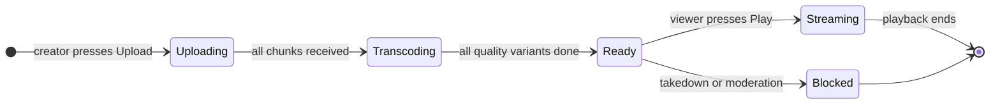
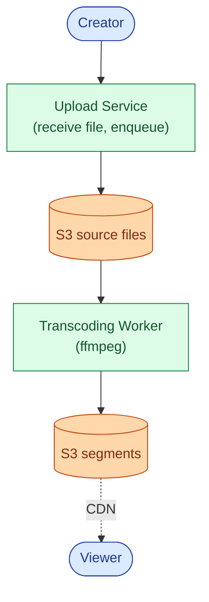
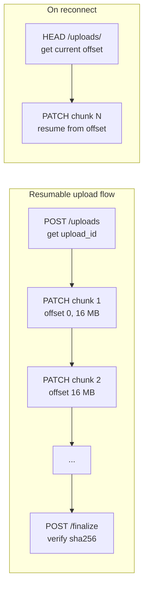
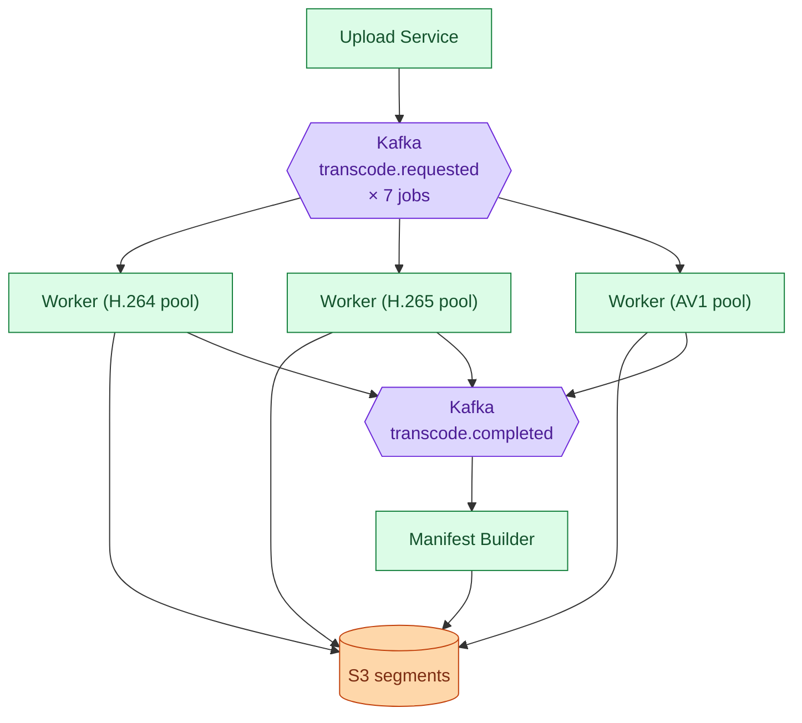
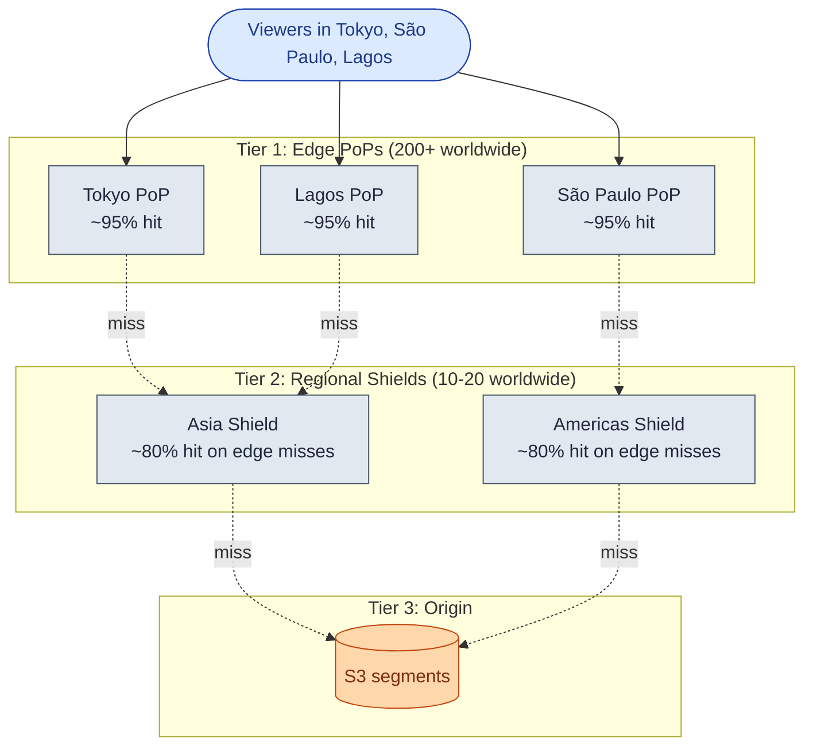
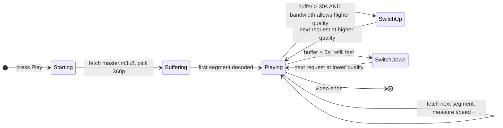
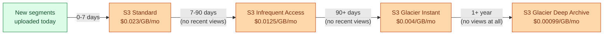
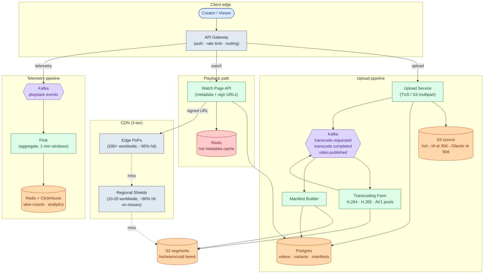
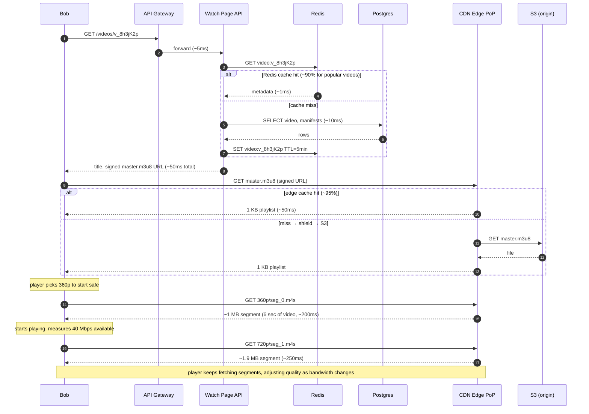
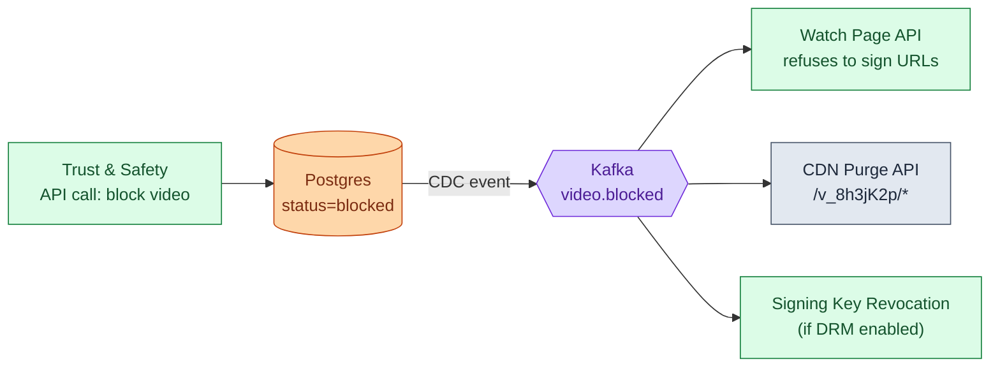

## What we are building

A video streaming platform takes a raw video file from a creator and delivers it to viewers around the world, in the right quality for their connection, as fast as possible.

Concretely: Alice records a 4K cooking video on her phone and uploads a 5 GB file. The platform transcodes it into seven resolutions (240p through 4K), cuts each into 6-second segments, and stores them in object storage. Bob is on a bus with a spotty LTE connection. He presses Play, the player starts at 360p, notices bandwidth improving, and silently switches to 720p mid-stream. Neither Bob nor Alice had to think about any of this.

That is the whole product. That is YouTube.

The problem looks like one system. It is actually two systems that share a database.

Four hard problems hide inside it:

1. **The upload pipeline vs the playback path.** They are separate systems with opposite requirements. Designing them as one is the most common mistake.
2. **Transcoding cost and codec choice.** H.264 encodes at 100x real-time. AV1 encodes at 0.07x real-time. Choosing the wrong codec ladder can multiply compute cost by 20x.
3. **CDN strategy and cache hit rate.** 250 Tbps of peak egress is physically impossible to serve from a data center. A three-tier CDN with regional shields is the only architecture that makes the numbers work.
4. **Adaptive bitrate switching.** Video segments across all resolutions must cut at identical timestamps, or a quality switch mid-stream causes a visible glitch.

We will start with the smallest thing that works, then add one layer at a time as each problem appears.

---

## The lifecycle of one video

Every video moves through a short set of states from upload to playback.



A video spends most of its life in `Ready`, getting watched. The upload and transcoding states are temporary. The `Blocked` transition exists for takedowns and copyright enforcement, both of which must propagate globally in under 60 seconds.

> **Take this with you.** Video streaming is a pipeline, not a service. Upload and playback are two different systems. Treat them that way from the first sentence.

---

## How big this gets

A YouTube-shaped platform gives us these numbers to work with.

| Input | Number |
|-------|--------|
| Uploads | 500 hours of video per minute |
| Concurrent viewers, peak | 125 million |
| Peak egress | 250 Tbps |
| Storage growth | 70 PB per year |
| Upload size limit | 256 GB per file |

From these we can derive everything else.

<details markdown="1">
<summary><b>Show: the derived numbers</b></summary>

| Metric | Value | How |
|--------|-------|-----|
| Upload ingest, steady | ~5 Gbps | 500 hr/min × 10 Mbps avg bitrate / 8 |
| Upload ingest, peak | ~15 Gbps | 3x steady |
| New videos per day | ~450,000 | 500 hr/min × 60 × 24 / 4 min avg |
| New videos per second | ~5 | 450K / 86,400 |
| Average concurrent viewers | ~42 million | 1B watch-hours/day × 3600 / 86400 |
| Peak egress | 250 Tbps | 125M × 2 Mbps avg |
| Source storage, annual | ~20 PB | 500 sec/sec × 86,400 × 365 × 10 Mbps / 8 |
| Transcoded storage, annual | ~50 PB | ~2.5x source (7-9 quality variants) |
| Transcoding cores needed | ~3,500 | H.264 at 100x real-time, 5 sec/sec ingest |

Three numbers dominate the whole design:

| Number | Size | Why it matters |
|--------|------|----------------|
| Peak egress | 250 Tbps | Requires a global CDN with hundreds of PoPs |
| Transcoding compute | ~3,500 CPU cores at H.264 | Running 24/7 just to keep up |
| Storage | 70 PB/year, forever | Tiering by access frequency saves ~5x in cost |

Everything in the architecture exists to keep one of these three numbers manageable.

</details>

> **Take this with you.** Two costs dominate: CDN egress and transcoding compute. Storage is third. Everything else is rounding error.

---

## The smallest version that works

Forget YouTube. We are a tiny platform with 100 creators and 10,000 viewers.

Three boxes. One upload flow.



Two endpoints carry the core product.

| Endpoint | What it does |
|----------|--------------|
| `POST /uploads` | Accept a file, return `video_id` and `status=transcoding` |
| `GET /videos/:id` | Return metadata + signed CDN URL to `master.m3u8` |

<details markdown="1">
<summary><b>Show: the two key tables</b></summary>

```sql
CREATE TABLE videos (
    video_id    VARCHAR(16) PRIMARY KEY,
    owner_id    BIGINT NOT NULL,
    title       VARCHAR(200),
    status      TEXT NOT NULL,   -- 'uploading', 'transcoding', 'ready', 'blocked'
    source_path TEXT,
    created_at  TIMESTAMPTZ NOT NULL DEFAULT NOW()
);

CREATE TABLE variants (
    video_id     VARCHAR(16),
    quality      VARCHAR(20),    -- '360p_h264', '1080p_h265'
    status       TEXT NOT NULL,  -- 'pending', 'encoding', 'ready', 'failed'
    output_path  TEXT,
    bitrate_kbps INT,
    completed_at TIMESTAMPTZ,
    PRIMARY KEY (video_id, quality)
);
```

`variants` has one row per (video, quality) so each transcoding job updates its own row independently. No locking on a shared JSON blob.

</details>

This is enough for a hundred creators on a Tuesday. The interesting question is what breaks first as the platform grows. Three things will: how uploads survive poor connections, how transcoding keeps up with demand, and how video bytes reach 125 million people at once. We address each in turn.

---

## Decision 1: how do we handle large uploads reliably?

A creator on a phone uploads a 2 GB file. Their Wi-Fi drops at 1.9 GB. Without a resumable upload protocol, they start over. This is not acceptable.

The fix is to split the file into chunks and track progress server-side. The client calls `HEAD /uploads/<id>` after reconnecting to ask "where did we stop?" and resumes from that byte offset.



This is the TUS protocol (or S3 multipart, which uses the same idea). The only cost is that the Upload Service must track chunk offsets in its database. Each chunk is 16 MB. A 5 GB upload is 320 chunks. A single failed chunk retries, not the whole file.

There is one subtle problem at `finalize`: the client may call it twice if their connection drops during the response. The finalize must be idempotent. If the multipart upload is already complete, return the existing `video_id` without creating a duplicate.

> **Take this with you.** Chunked resumable uploads are not an optimization. They are what makes a mobile upload platform function at all. Without them, anyone on a phone uploading over 100 MB will sometimes fail.

---

## Decision 2: how do we transcode at scale?

A source video arrives. It needs to become seven or more quality variants, each cut into 6-second segments. That is compute-heavy work that takes minutes per video. The platform needs to do it for thousands of videos per day without blocking new uploads.

The answer is a durable job queue and a pool of workers.



A few rules make this work in production:

**Codec selection changes everything.** The codec determines how much compute each job needs.

| Codec | Encode speed | File size vs H.264 | Decode support | Use case |
|-------|-------------|-------------------|----------------|----------|
| H.264 | ~100x real-time | baseline | Universal | Always ship this |
| H.265 | ~33x real-time | 30% smaller | Near-universal | Worth it above early stage |
| AV1 | ~0.07x real-time | 50% smaller | Modern devices | Top 1-5% by watch time only |

Encoding one 4-minute video in AV1 takes about 20 minutes on a single CPU core. At H.264 speeds, the same video takes 24 seconds. Using AV1 for everything would require 15-30x more compute for the same ingest rate.

**Segment alignment across qualities is not optional.** Every quality must cut at exactly the same timestamps (0s, 6s, 12s...). The player switches quality between segments. If 360p cuts at different boundaries than 1080p, the quality switch causes a visible frame jump. Use `-force_key_frames "expr:gte(t,n_forced*6)"` in ffmpeg.

**Idempotent output.** Workers write to the same S3 keys every run. If a worker crashes mid-job and Kafka redelivers the message, the second run overwrites the same keys cleanly. This makes at-least-once Kafka delivery safe.

**Janitor for stuck jobs.** A periodic scan finds `variants` rows with `status=encoding` older than 2x the expected job duration and republishes them to Kafka. Workers are stateless; restarting is always safe.

> **Take this with you.** The queue makes the pipeline reliable. The codec ladder determines the compute bill. Segment alignment at the same timestamps across all qualities is what makes adaptive bitrate switching work without visual glitches.

---

## Decision 3: how does the CDN serve 250 Tbps?

No single data center can send 250 Tbps of video. At 125 million concurrent viewers averaging 2 Mbps, the math is simple: we need roughly 200+ points of presence around the world, each caching the most popular content for viewers in that city.

But a flat CDN has a fatal flaw: if 200 edge nodes all miss the same segment, they each fire a separate request to S3 origin. One segment would cause 200 S3 requests. A regional shield fixes this.



The arithmetic: at 95% edge hit rate, only 5% of requests reach the shield. At 80% shield hit rate, only 20% of those reach S3. S3 sees roughly 1% of total traffic. At 250 Tbps total, that means S3 handles about 2.5 Tbps. Without the CDN, S3 would need to serve all 250 Tbps.

Cache TTL choices follow the content type.

| Content | TTL | Reason |
|---------|-----|--------|
| Video segments (`seg_N.m4s`) | 7 days | Immutable once written |
| Master playlist (`master.m3u8`) | 60 seconds | New qualities become available as transcoding completes |
| Thumbnails | 1 year | Immutable once created |
| Signed URLs | 4-8 hours | Expire before they can be shared for free |

> **Take this with you.** "Use a CDN" is not a design. The regional shield is the critical piece. Without it, S3 cannot absorb the request volume on cache misses.

---

## Decision 4: how does the player pick the right quality?

The player, not the server, decides which quality to request next. The server never pushes video. The player pulls one segment at a time and adjusts quality between segments based on measured bandwidth and buffer depth. This is ABR (adaptive bitrate streaming).



The master playlist tells the player what resolutions and bitrates are available:

```
#EXTM3U
#EXT-X-STREAM-INF:BANDWIDTH=700000,RESOLUTION=640x360
360p/playlist.m3u8
#EXT-X-STREAM-INF:BANDWIDTH=2500000,RESOLUTION=1280x720
720p/playlist.m3u8
#EXT-X-STREAM-INF:BANDWIDTH=5000000,RESOLUTION=1920x1080
1080p/playlist.m3u8
```

HLS and DASH do the same job with different file formats. Modern platforms write segments in `.m4s` (the CMAF format) and generate both an HLS `.m3u8` and a DASH `.mpd` manifest pointing at the same segment files. One set of segments, two manifests, all devices covered.

> **Take this with you.** The player never asks your servers for video bytes. It asks the CDN. Your Watch Page API only produces the signed URL and metadata. After that, your code is out of the loop.

---

## Decision 5: how do we manage 70 PB/year of storage?

Most videos stop being watched after the first week. Storing them all in S3 Standard costs $0.023/GB/month. At 70 PB/year and 10 years of data, that is hundreds of millions of dollars. Storage tiering by access frequency reduces the blended cost by 4-5x.



A daily tiering job reads `last_viewed_at` from the analytics store and emits S3 lifecycle transitions in bulk. When a cold video suddenly goes viral, it is promoted back to Standard within minutes.

Source files are never deleted. A new codec ships every few years. You need the original source to re-encode without quality loss when that happens.

With tiering at roughly 5% hot / 15% warm / 80% cold, the blended cost drops from $0.023/GB to about $0.005/GB.

> **Take this with you.** Source files are kept forever. Transcoded variants are tiered aggressively. That combination preserves quality for future re-encoding while keeping storage costs manageable.

---

## The full architecture

Pulling the five decisions together gives us the system.



Each component, in one sentence:

| Component | Purpose |
|-----------|---------|
| API Gateway | Auth, rate limiting, routes upload vs playback vs telemetry traffic |
| Upload Service | Accepts chunked uploads, issues TUS tokens, triggers transcoding |
| Kafka | Durable queue between pipeline stages. Worker crashes do not lose jobs |
| Transcoding Farm | Pools of ffmpeg workers, one pool per codec. Autoscales on Kafka lag |
| Manifest Builder | Assembles `master.m3u8` as quality variants complete |
| Postgres | Video catalog, per-variant job status |
| Watch Page API | Reads metadata, signs CDN URLs, returns JSON. The only code on the playback hot path |
| CDN (Edge + Shield + Origin) | Serves all video bytes. Three tiers absorb 99% of traffic before S3 |
| Redis | Hot metadata cache. Cuts Postgres reads by 100x for popular videos |
| Flink + ClickHouse | Stream-aggregates view counts and watch-time data for creator dashboards |

Notice what is not on the synchronous playback path: analytics, view counts, transcoding. If Flink has a lag spike at 3 a.m., viewers keep watching. View counts just update a bit late.

---

## Walk: an upload, end to end

Alice records a 5 GB cooking video and presses Upload.


Three things worth pointing at:

1. The `INSERT video` and `initiate multipart` happen in the same transaction. If the server crashes mid-way, the video row and the S3 upload either both exist or neither does.
2. Workers produce segments at the same cut points across all qualities. That alignment is what lets the player switch quality mid-stream without a visual glitch.
3. The Manifest Builder publishes a partial `master.m3u8` after the first quality completes, so Alice can watch a 360p version while 1080p is still encoding. The master playlist has a 60-second CDN TTL, so viewers see new qualities appear quickly.

---

## Walk: a playback request, end to end

Bob opens the watch page on his commute.



Latency budget for first frame:

| Step | Typical time |
|------|-------------|
| API call (Redis hit) | ~50ms |
| `GET master.m3u8` (CDN edge hit) | ~50ms |
| `GET 360p/playlist.m3u8` (CDN edge hit) | ~50ms |
| `GET seg_0.m4s` (CDN edge hit) | ~200ms |
| First frame decode | ~50ms |
| **Total** | **~400ms** |

A 2-second start-time SLO is achievable even with cold-cache misses.

---

## The hard sub-problem: deleting a video fast

A creator deletes a video. Or trust-and-safety issues a takedown. The video is cached in hundreds of edge PoPs worldwide. How do you stop playback globally within 60 seconds?

The naive approach is to set TTLs short enough that caches expire quickly. The problem is that short TTLs destroy the CDN's effectiveness for the normal case. A 60-second TTL on segments means 99%+ of traffic hits the shield or S3 origin.

The real answer uses CDN purge + signing key revocation together.



The sequence:

1. Status flips to `blocked` in Postgres (milliseconds).
2. CDC event reaches Kafka (< 1 second).
3. Watch Page API stops issuing signed URLs for this video (< 5 seconds).
4. CDN purge propagates globally on major CDNs (Cloudflare, Fastly, Akamai) in 5-30 seconds.
5. Viewers mid-playback drain their 30-second buffer, then see an error.

New viewers cannot start the video within 5-30 seconds. Viewers already watching see it stop within 30 seconds. The 60-second target is reachable.

Note: the S3 objects are not deleted. They are moved to a restricted bucket only the legal team can access. Takedowns often need to be reversed on appeal.

> **Take this with you.** Deletion is not a single database write. It is three steps: refuse new signed URLs, purge CDN caches, revoke signing keys. Kafka carries the event so each layer can react independently.

---

## Follow-up questions

Try answering each in 2 or 3 sentences before opening the solution.

1. **Delete a viral video.** A creator deletes a video with 100M views. It is cached in hundreds of edge PoPs. How do you stop playback globally within 60 seconds?

2. **AV1 backfill.** You want to re-encode the top 10,000 videos in AV1 to reduce bandwidth costs. How do you pick which videos to prioritize, and how do you run the job without disrupting live uploads?

3. **Live streaming.** A creator wants to broadcast a concert to 5 million concurrent viewers with under 3 seconds of delay. What changes in the architecture? What stays the same?

4. **Thumbnails at scale.** Every video needs 1-3 main thumbnails and auto-generated frames for the seek bar. How do you generate, store, and serve them? (There are about 120 seek frames per 4-minute video.)

5. **Copyright takedown.** A valid takedown notice arrives. You must block playback globally within 5 minutes. You cannot delete the source file. How do you do it?

6. **Watch-time analytics.** A creator wants to see "60% of viewers dropped off at the 3:47 mark." Where does that data come from, and how do you compute it across billions of viewer sessions?

7. **DRM (Netflix mode).** The product switches to a subscription model. Every segment must be encrypted. Every device must get a decryption key before playback. What does the key flow look like?

8. **Multiple audio tracks.** A video has English, Spanish, and Hindi audio, plus 12 subtitle languages. How do these fit into an HLS master playlist? How does the player know which audio to download?

9. **Regional shield outage.** Your Asia regional shield goes down. What is the blast radius? What happens to the 200 edge PoPs behind it?

10. **Real-time view counts.** The recommendation team needs view counts with under 5 seconds of freshness for ranking signals. Your current Flink pipeline has 30 minutes of lag. What do you change?

---

## Related problems

- **[URL Shortener (001)](../001-url-shortener/question.md).** Introduces CDN caching, TTL trade-offs, and hot-key problems at a smaller scale.
- **[Notification System (010)](../010-notification-system/question.md).** The "your video is ready" and "new video from someone you follow" notifications run through it.
- **[News Feed (002)](../002-news-feed/question.md).** The watch page entry is one row in a feed. They share the metadata store and the follow graph.
- **[Distributed Cache (009)](../009-distributed-cache/question.md).** The manifest cache and hot-metadata cache use the same principles.
