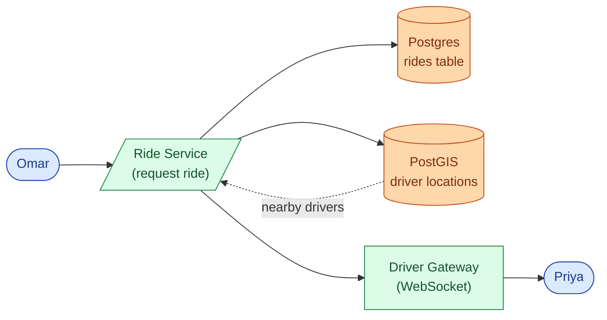
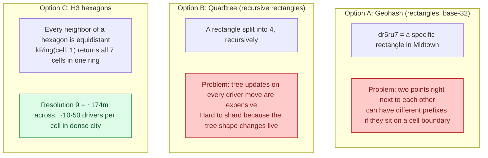
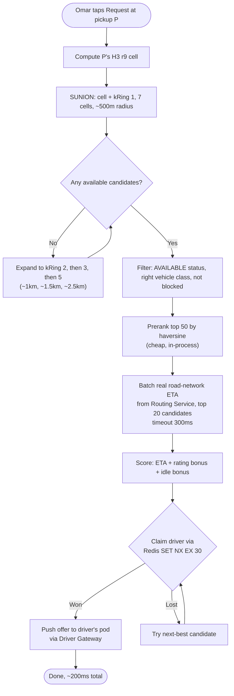
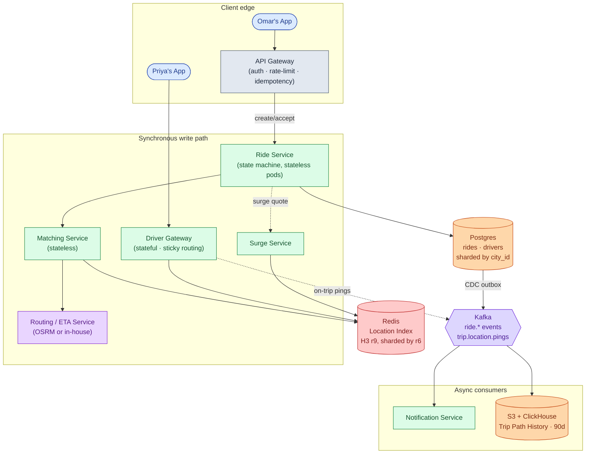
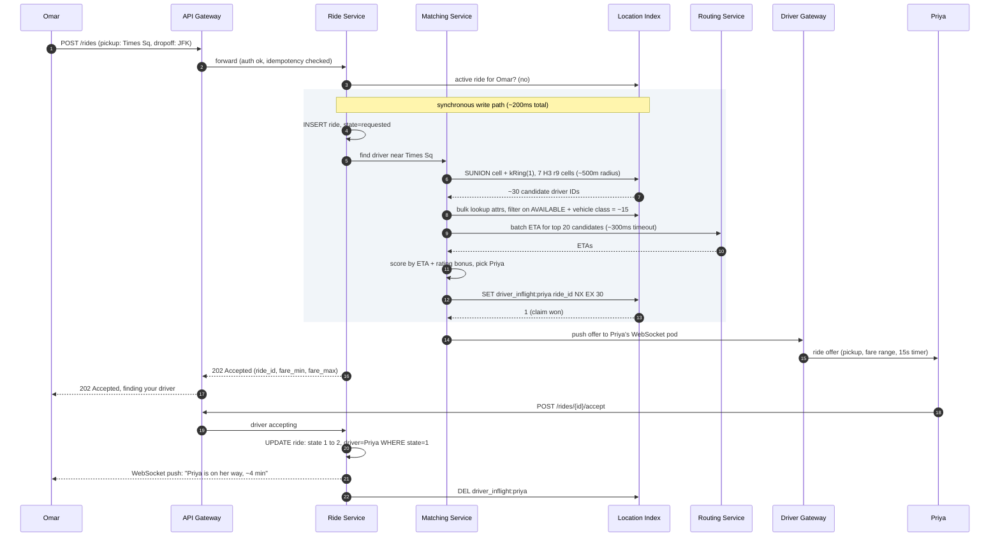
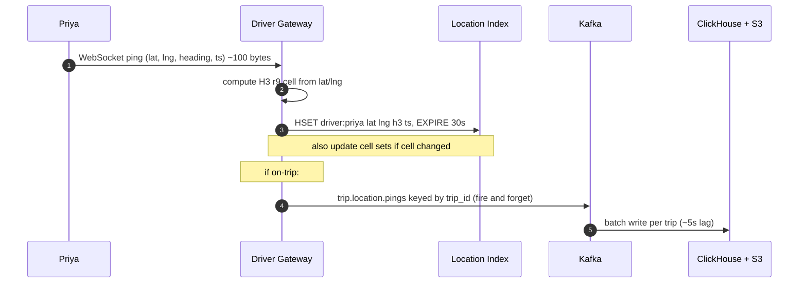
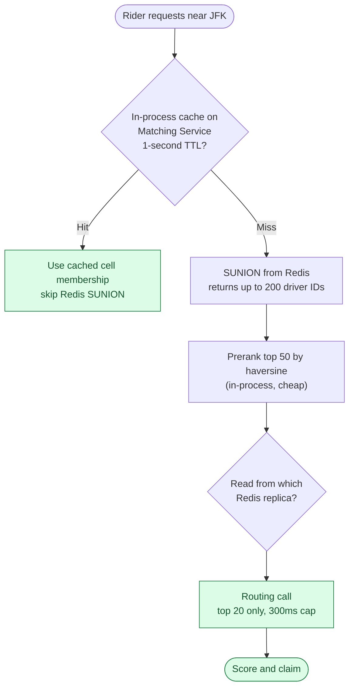

## What we are building

Omar opens Uber in Midtown Manhattan. He taps a destination: JFK airport. The app quotes $42 and shows a map. He taps confirm. Four seconds later, a driver named Priya gets a ping on her phone. She accepts. Omar's map shows Priya's car icon moving toward him. Four minutes later she arrives, he gets in, and twenty-two minutes after that she drops him at the terminal. His card is charged $44.80 (a little waiting time added). The ride is done.

That product touches four genuinely hard problems.

1. **Real-time location at scale.** A million drivers are each pinging their location every 4 seconds. That is 250,000 writes per second, all of them overwrite-in-place, all of them feeding a live map index that matching reads from.
2. **Fast matching.** From Omar's tap to "Priya is on her way," the P99 target is under 2 seconds. Miss it and riders give up.
3. **A state machine that cannot be wrong.** The ride passes through seven states over 25 minutes, across dropped connections and retries. Every transition must be idempotent. One bad transition means a double charge or a ghost ride.
4. **Surge pricing and billing accuracy.** Surge is computed per neighborhood, changes every 10 seconds, and must be locked in at quote time. If the connection drops before trip end, the fare still has to be correct.

We will start with the smallest version that works, then add one piece at a time as each problem appears.

---

## The lifecycle of one ride

Before drawing any boxes, picture what a ride actually is.

```mermaid
stateDiagram-v2
    direction LR
    [*] --> requested: Omar taps Request
    requested --> matched: Priya accepts
    matched --> driver_arriving: en route to Omar
    driver_arriving --> in_progress: Omar boards, Priya taps Start
    in_progress --> completed: Priya taps End Trip
    driver_arriving --> cancelled: either side cancels
    in_progress --> cancelled: rare; fraud / system
    requested --> cancelled: no driver found
    driver_arriving --> no_show: Priya waited, Omar did not show
    completed --> [*]
    cancelled --> [*]
    no_show --> [*]
```



Everything we add later, the location index, the matching algorithm, surge pricing, path history, is machinery that drives this state machine forward safely.

> **Take this with you.** A ride-sharing system is a state machine with a fast map lookup bolted to the front. The map gets you the right driver. The state machine makes sure you bill correctly.

---

## How big this gets

Two scales. Same product.

| Metric | Startup city (Austin) | Uber global |
|--------|-----------------------|-------------|
| Online drivers | 500 | ~1,000,000 |
| Active riders | 2,000 | ~5,000,000 |
| Trips per day | 5,000 | ~100,000,000 |
| Location pings per second | ~125 | ~475,000 |
| Active trips at any moment | ~52 | ~1,000,000 |

<details markdown="1">
<summary><b>Show: how the numbers come out</b></summary>

**Trips per second.** 100M / 86,400 is about 1,160 per second sustained. Friday-night peak is 5-10x that: roughly 10,000 per second at peak.

**Location pings per second.** Idle drivers ping every 4 seconds. On-trip drivers ping every 1 second. About 30% of online drivers are on a trip at any moment.

- Idle: 700,000 × (1/4) = 175,000/sec
- On-trip: 300,000 × (1/1) = 300,000/sec
- Total: ~475,000/sec sustained, ~1,000,000/sec at peak

Location ingest is the dominant write workload. It beats matching by a factor of 50.

**Bandwidth.** Each ping is ~100 bytes (driver_id, lat, lng, heading, speed, accuracy, timestamp, signature). 475,000 × 100B = 47 MB/sec. Not a bottleneck. Storage is.

**Storage.** We store on-trip pings only, not idle pings.

- 100M trips/day × ~225 pings/trip × 100B per ping = ~2 TB/day. Compress and age off after 90 days.
- Current locations: 1M drivers × 200B = ~200 MB total. Tiny. Overwrite in place every 4 seconds.

**What the math tells you.** There are two very different workloads:

- Location ingest: 500k+ writes/sec. Overwrite-in-place in a fast in-memory store.
- Matching: ~10k/sec. Cheap to compute, but every millisecond counts.

Most of the architecture exists to keep these two paths from interfering with each other.

</details>

> **Take this with you.** Location ingest dwarfs every other workload. Keep it on its own infrastructure so it does not leak into matching latency.

---

## The smallest version that works

We are launching in Austin with 500 drivers. Draw the minimum system first.



Three endpoints carry the whole product.

| Endpoint | What it does |
|----------|--------------|
| `POST /rides` | Rider submits pickup and dropoff, gets back a fare range and a ride ID |
| `POST /rides/{id}/accept` | Driver accepts a dispatch offer |
| `GET /rides/{id}` | Rider or driver polls the current ride state |

<details markdown="1">
<summary><b>Show: the core tables</b></summary>

```sql
CREATE TABLE rides (
    ride_id         BIGINT PRIMARY KEY,
    rider_id        BIGINT NOT NULL,
    driver_id       BIGINT,                 -- NULL until matched
    city_id         INT NOT NULL,
    state           SMALLINT NOT NULL,      -- 1=requested ... 6=cancelled
    pickup_lat      DOUBLE PRECISION NOT NULL,
    pickup_lng      DOUBLE PRECISION NOT NULL,
    dropoff_lat     DOUBLE PRECISION NOT NULL,
    dropoff_lng     DOUBLE PRECISION NOT NULL,
    vehicle_class   SMALLINT NOT NULL,
    requested_at    TIMESTAMPTZ NOT NULL,
    matched_at      TIMESTAMPTZ,
    completed_at    TIMESTAMPTZ,
    cancelled_at    TIMESTAMPTZ,
    fare_cents      INT,
    surge_mult      NUMERIC(3,2) NOT NULL DEFAULT 1.00,
    idempotency_key UUID
);

CREATE UNIQUE INDEX idx_idempotency ON rides (rider_id, idempotency_key);
CREATE INDEX idx_rider_active  ON rides (rider_id)  WHERE state IN (1,2,3,4);
CREATE INDEX idx_driver_active ON rides (driver_id) WHERE state IN (3,4);
```

The partial index on `driver_id` for active states is the guard against double-assignment at the database layer.

</details>

This handles Austin at 500 drivers. PostGIS nearby queries are fast enough. The problem shows up when we expand to NYC with 25,000 drivers and 6,000 location writes per second.

> **Take this with you.** Start from the smallest thing that works. The interesting part is what breaks next.

---

## Decision 1: how do we index a million moving cars?

The v1 PostGIS table breaks at scale. At 25,000 drivers pinging every 4 seconds, that is 6,250 writes per second to a relational table with a spatial index. The index cannot keep up with continuous updates while simultaneously serving fast range queries.

The core need is a location store that is fast to write (overwrite-in-place, not INSERT) and fast to query (give me all drivers within 500m of a point, right now).

The solution is a geospatial cell index in Redis. The question is which cell scheme to use.



**Why hexagons beat squares.** With a square grid, diagonal neighbors are 1.41x farther than edge neighbors. When you search for "drivers near a pickup," hexagons give clean symmetric results. The code does not need to compensate for diagonal vs. edge distance.

**The pick: H3 resolution 9.** Cells are ~174m across, ~0.1 sq km. A dense city has 10-50 available drivers per cell at peak. A `kRing(cell, 1)` call covers the cell plus its 6 neighbors, a radius of roughly 500m. That is the right scale for "drivers close enough to arrive in a few minutes."

The Redis data layout per driver:

```
driver:{driver_id}          HASH    lat, lng, h3_r9, status, vehicle_class, last_update_ts
                                    TTL: 30s (refreshed on every ping)

cell:{h3_r9}                SET     driver IDs currently in this cell
                                    (no TTL; swept by driver key expiry)

driver_inflight:{driver_id} STRING  ride_id of active dispatch claim
                                    TTL: 30s (released on accept or timeout)

surge:{h3_r8}               STRING  surge multiplier, e.g. "2.1"
                                    TTL: 30s (refreshed by Surge Service)
```

Shard by H3 resolution 6 (cells ~6km across). All drivers in one metro neighborhood land on the same Redis shard. When a rider is near a shard boundary, the Matching Service reads from adjacent shards in parallel.

> **Take this with you.** Geohash is fine for v1. H3 is the right answer at scale. Quadtree on a live dataset is wrong because tree updates on every driver move are too expensive.

---

## Decision 2: how do we match a rider to a driver in under 2 seconds?

Omar taps Request. The Matching Service has 2 seconds to claim a driver and push an offer. Here is the algorithm.



The `SET NX EX 30` claim is the mutual-exclusion mechanism. If two matching attempts race for Priya, one returns `1` (won) and the other returns `0` (try the next-best driver). The 30-second TTL is a safety net: if the Matching Service crashes before dispatching, the lock auto-releases.

Never use haversine as the final score. A driver 200m away on the other side of a river is much farther by road-network ETA. Haversine is acceptable for the coarse pre-filter (narrowing 200 candidates to 50), but the final score always uses road ETA.

<details markdown="1">
<summary><b>Show: three levels of matching, simplest first</b></summary>

**Level 1: greedy nearest.** Search the 1-ring. Filter. Score top 20 by real ETA. Claim the best available. Fast (under 200ms). Works well when supply is plentiful. Ship this first.

The downside: locally optimal, globally wasteful. If two riders request at almost the same time and the same driver is best for both, the second rider gets a much worse match than they would under paired matching.

**Level 2: greedy with a dispatch window.** Wait ~500ms to collect other pending requests in the same H3 area. Run a small batch match (Hungarian algorithm) to minimize total ETA across all pairs. The 500ms hold is invisible to the rider (still under 2 seconds) and improves average ETA by 5-15% in dense areas.

**Level 3: predictive matching.** The candidate pool includes drivers about to finish a trip in the next 60 seconds. Their ETA includes remaining trip time plus drive to pickup.

Ship Level 1. Add Level 2 when load and data justify it.

</details>

> **Take this with you.** The Redis `SET NX` is the lock that prevents double-assignment. The Routing Service is the heaviest dependency on the match path. Bound its concurrency, timeout, and fallback before your design is complete.

---

## Decision 3: how do we keep the ride state machine correct?

The state machine has seven states and ten transitions. The machine runs for 20-25 minutes across dropped connections, retries, and backgrounded apps. A wrong transition means a double charge or an unrefunded cancellation.

Four invariants that cannot be broken:

1. **Every transition is idempotent.** `POST /accept` called twice leaves the state unchanged. `matched_at` is set only on the first transition.
2. **No backward transitions.** Once `in_progress`, the only exits are `completed` or `cancelled`.
3. **One driver per ride. One active ride per driver.** The Redis `driver_inflight` key and the partial unique index on `rides.driver_id WHERE state IN (3,4)` both enforce this. Two locks, two layers.
4. **Cancel reason is required.** `rider_cancelled`, `driver_cancelled`, `system_no_drivers`, `no_show`, `fraud`. This drives the billing and refund decision.

Transitions are conditional SQL updates:

```sql
UPDATE rides
SET state = 2, driver_id = $driver, matched_at = NOW()
WHERE ride_id = $ride AND state = 1
RETURNING state;
```

If `RETURNING` yields 0 rows, the transition failed: the ride already moved on. The Driver Gateway tells Priya "ride no longer available" and clears her inflight key.

The `Idempotency-Key` header on `POST /rides` handles mobile retries. Without it, a rider who loses connectivity at the wrong moment creates two rides and gets charged twice.

> **Take this with you.** The partial unique index on `driver_id` for active states is the database-layer guard against double-assignment. The Redis `SET NX` is the application-layer guard. Never rely on just one.

---

## Decision 4: how do we handle surge pricing without coupling it to matching?

Surge is not part of the matching path. It is a read-only input to the quote.

The Surge Service reads supply and demand per H3 cell every 10 seconds and writes a multiplier:

```
multiplier = clip(demand_rate / supply_count, min=1.0, max=5.0)
```

`demand_rate` is ride requests in the cell in the last 60 seconds. `supply_count` is available drivers in the cell. The multiplier is written to `surge:{h3_r8}` in Redis with a 30-second TTL.

Surge uses H3 resolution 8 (cells ~3km across), one level coarser than the resolution 9 used for matching. A 5x multiplier on one block but 1x on the next would feel arbitrary. Neighborhood-level surge feels natural.

When Omar's request comes in, the Ride Service reads the current multiplier from Redis and locks it into `rides.surge_mult`. If Priya drives slowly or waits, the fare uses the locked surge, not whatever the live multiplier is when the trip ends.

If the `surge:{h3_r8}` key is missing or stale, the Ride Service defaults to 1.0. The Surge Service being slow or down does not break matching.

> **Take this with you.** Surge and matching do not talk to each other. Surge is a periodic write to a Redis key. Matching reads that key when building the quote. If surge goes down, rides keep working at 1x.

---

## The full architecture



Each component, in one line:

| Component | Purpose |
|-----------|---------|
| API Gateway | Authenticates callers, rate-limits bots, dedupes mobile retries via idempotency keys |
| Ride Service | Owns the ride state machine. Stateless pods. Calls Matching when a driver is needed. |
| Matching Service | Stateless. Reads Redis, scores candidates with real ETA, claims driver via `SET NX`. |
| Driver Gateway | Stateful pods. One WebSocket per online driver. Receives pings, pushes dispatch offers. |
| Routing / ETA Service | Road-network ETA from A to B. CPU-heavy. Isolated so slowdowns do not cascade to matching. |
| Surge Service | Reads supply and demand per H3 r8 cell every 10 seconds. Writes multipliers to Redis. |
| Redis Location Index | Overwrite-in-place. H3 cell sets. Sharded by r6. The hot index for matching. |
| Postgres (sharded by city) | Source of truth for ride records. One shard per city or metro. |
| Kafka + consumers | Trip path history for fraud and disputes. Notification fan-out. All off the synchronous path. |

---

## Walk: a ride request, end to end

Omar taps Request in Midtown. Here is what happens.



Three things worth pointing at:

1. The 202 goes back to Omar **before** Priya accepts. The ride is created. Matching is in progress. Omar sees a spinner. The WebSocket delivers the update when Priya taps Accept.
2. The `SET NX EX 30` in step 10 is the mutual-exclusion lock. If two matching instances race for Priya, one gets `1` and the other gets `0` and moves to the next candidate.
3. The match path (steps 3-10) targets under 200ms. Driver acceptance adds another 3-15 seconds on top. These are different SLOs.

---

## Walk: location pings at scale

Priya is driving toward Omar. She pings every second. With 1M online drivers, the system receives 475,000+ pings per second globally. Each ping causes exactly two writes.

**Write 1: overwrite the location index (every driver, always).**

The Driver Gateway computes the H3 cell from `(lat, lng)`. It updates two Redis keys:

- `driver:{driver_id}`: overwrite with new lat, lng, h3_r9, last_update_ts. TTL refreshed to 30 seconds.
- If the H3 cell changed since last ping: remove from `cell:{old_h3}` set, add to `cell:{new_h3}` set. If same cell: no-op.

Latency: ~0.5ms per ping. Both operations are in memory.

**Write 2: trip path history (on-trip drivers only).**

If Priya is on a trip, the Gateway also pushes the ping to Kafka topic `trip.location.pings` keyed by `trip_id`. A consumer batches per trip and writes to S3 and ClickHouse.

Idle-online drivers are not persisted. Only on-trip pings go to durable storage. This cuts storage cost by roughly 90%.



> **Take this with you.** Two writes per ping: one cheap overwrite to Redis (every driver), one durable append to Kafka (on-trip only). Separating these cuts storage cost by 10x and keeps the hot write path fast.

---

## The hot cell problem

JFK at 5pm has 200 available drivers in two H3 cells. Every rider request in that area triggers a SUNION returning 200 driver IDs. Then a Routing call for ETA across all 200. The Redis shard that owns the JFK cells is at 100% CPU, and every other key on that shard is suffering.

The defenses, cheapest first:



For predictable surges like a concert ending, pre-populate the cell cache at 9:55 before the 10pm rush. The storm hits a warm cache.

> **Take this with you.** The hot cell problem is solved by an in-process cache on the Matching Service, not by scaling Redis. Cap the Routing call at 20 candidates. Most deployments need nothing more than those two changes.

---

## Follow-up questions

Try answering each in 3 or 4 sentences before opening the solution.

1. **Driver ignores the offer.** Priya does not tap Accept within 15 seconds. What does the system do? What if she keeps ignoring requests?

2. **Driver loses connectivity mid-trip.** Priya's phone drops off the network for 90 seconds. How does the system know the trip is still going? What does Omar see? What if she never reconnects?

3. **Two riders, one best driver.** Omar and another rider both request at the same moment and Priya is the best match for both. Walk through the race. How do you prevent Priya from being double-assigned?

4. **Hot cell: airport at rush hour.** JFK has 200 available drivers in two H3 cells. How do you bound the work on every request so matching stays under 200ms?

5. **Hot Redis key.** The `cell:{jfk_h3}` set is on one Redis shard at 100% CPU. Diagnose the problem and describe the fix in order of cheapest to most expensive.

6. **Region failure.** `us-east-1` goes down. NYC rides live there. What happens to in-progress trips? Can riders in other cities still book?

7. **Driver heading away from pickup.** Priya just dropped off a rider and is driving toward home. The matcher picks her because she is 300m from the pickup. Is this the right call? How do you handle direction in scoring?

8. **Fraud: fake GPS.** A driver submits fake coordinates to appear in a high-surge cell. How do you detect this without adding latency to the ingest path?

9. **Routing Service is slow or down.** Matching depends on it for ETAs. How do you degrade gracefully so riders can still get matched?

10. **Bulk cancel.** A major storm hits NYC. Ops wants to cancel all in-progress rides in Manhattan and refund riders. How does the backend handle this, and what can go wrong?

---

## Related problems

- **[News Feed (002)](../002-news-feed/question.md).** The hot-cell problem at an airport is the same fan-out problem as a celebrity post in news feed. Same fixes: in-process cache, replicas, jittered TTLs.
- **[Chat System (003)](../003-chat-system/question.md).** The in-ride chat between Omar and Priya is the same WebSocket and presence problem. The Driver Gateway here is shaped exactly like the chat gateway there.
- **[Notification System (010)](../010-notification-system/question.md).** Dispatch push to drivers, "your driver is arriving" to riders, and SMS fallback when the app is backgrounded all flow through the notification service.
