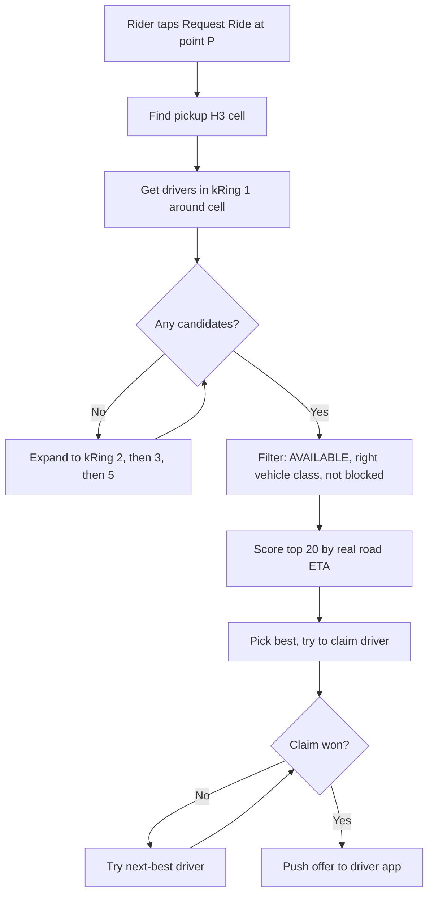
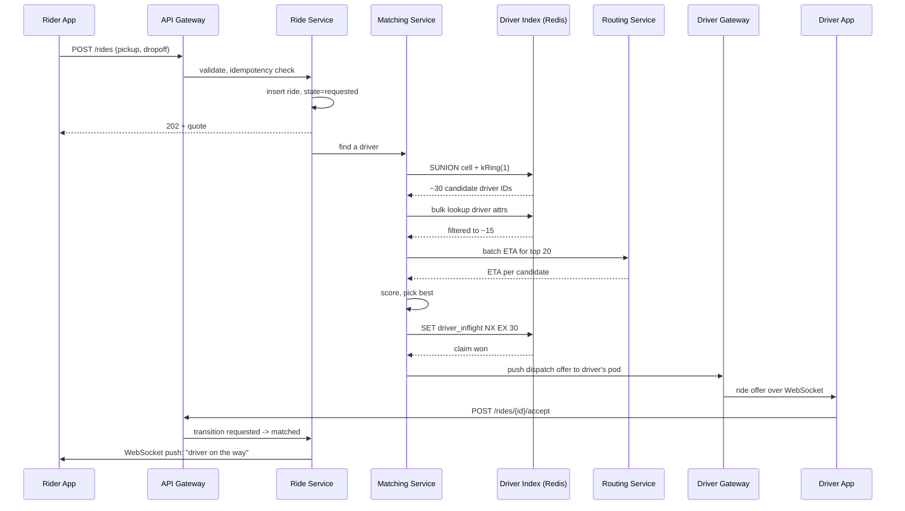

## The scene

You sit down. The interviewer slides their laptop over and says:

> *"Design Uber. A rider opens the app, taps Request Ride, and a few seconds later a nearby driver accepts. Walk me through how that works."*

It sounds like one problem. It is actually three problems stacked on top of each other:

1. Track a million moving cars in real time.
2. Pick one driver out of that million in under two seconds.
3. Keep the ride alive for 20 minutes through dropped signals, backgrounded apps, and last-minute cancellations.

If you get the map index wrong, matching grinds to a halt. If you get the state machine wrong, you charge people for rides that never happened.

We will walk through this from a small city to global scale. At each step, we name what breaks and add the smallest fix.

Do not draw any boxes yet. First, ask the right questions.

---

## Step 1: Ask the right questions

Take five minutes. Write down questions you would ask the interviewer.

A good answer is not "10 questions about edge cases." It is the small set of questions that would change your design if answered differently.

<details markdown="1">
<summary><b>Show: 8 questions that matter</b></summary>

1. **What is in scope?** Just matching a rider with a driver? Or also payments, surge pricing, ETA prediction, in-ride chat, driver signup? *(Pick a slice. A reasonable one: rider requests a ride, system finds a driver, both sides see updates until pickup. Mention surge briefly. Skip payments.)*

2. **How big is this thing?** How many drivers online? How many ride requests per second? Which cities? *(Uber-scale: ~1M drivers online at peak, ~5M active riders, ~100M trips per day. The biggest single city has ~50,000 drivers online. That single-city number tells you how big one shard needs to be.)*

3. **How fast does matching have to be?** From tap to "driver assigned," what is the P99? *(Under 2 seconds is the bar. After that, riders give up.)*

4. **How often do driver apps send location?** *(Every 4 seconds when idle online. Every 1 second once they are on a trip. This drives the write load.)*

5. **What is the matching rule?** Closest driver wins? Highest rated nearby? Smarter batch matching across many requests at once? *(Greedy nearest is simple. Batch matching is smarter but slower.)*

6. **What if the driver cancels or never accepts?** *(Almost always: re-match to the next-best driver. The state machine has to handle this without charging anyone.)*

7. **Is matching global or per city?** *(Per city. There is no point matching a rider in Tokyo with a driver in Lagos. City is the shard boundary.)*

8. **Vehicle types?** UberX, XL, Black, Pool? *(One driver pool with a `vehicle_class` tag. Filter at match time. Pool/shared rides add routing complexity we will skip.)*

If you walked in asking only "how do we find nearby drivers?" you missed half the problem. The state machine, the location ingest, and the city sharding are equally important.

</details>

---

## Step 2: How big is this thing?

Same problem, two scales. Do the math.

**The inputs from the interviewer:**

- 1M drivers online at peak
- 5M active riders at peak
- 100M trips per day
- Driver pings: every 4 seconds idle, every 1 second on a trip
- Hottest single city: 50,000 drivers (NYC, Sao Paulo on New Year's Eve)
- Average trip length: 15 minutes
- P99 match latency target: 2 seconds

Compute these five numbers before peeking:

1. Ride requests per second
2. Location updates per second
3. Bandwidth for location ingest
4. Storage for location history per day
5. How many trips are active at any moment

<details markdown="1">
<summary><b>Show: the math</b></summary>

**Ride requests per second.**

100M / 86,400 sec ≈ **1,160 requests/sec** sustained. Peak is 5x to 10x that (Friday night, big events), so **~10,000 requests/sec at peak**.

**Location updates per second.**

- Idle online drivers: 1M × (1 ping per 4 sec) = **250,000 updates/sec** sustained.
- On-trip drivers: about 30% of online drivers are on a trip. 300,000 × (1 ping per sec) = **300,000 more updates/sec**.
- **Total: ~550,000 updates/sec sustained, ~1M/sec peak.**

Location ingest is the dominant write load. Matching is tiny by comparison.

**Bandwidth for location ingest.**

Each ping is about 100 bytes (driver_id, lat, lng, heading, speed, accuracy, timestamp, signature). 550,000 × 100B = **55 MB/sec**. Fine for ingest. We do not write all of that to durable storage. Most of it just overwrites in a fast in-memory store.

**Storage for location history per day.**

If we kept every ping: 550,000 × 86,400 × 100B ≈ **4.7 TB/day**. We do not. We split it into two stores:

- *Current location* (hot, overwrite-in-place): 1M rows × ~200B = ~200 MB total. Tiny.
- *Trip path history* (durable, ~1 ping per 4 sec while on a trip): 100M trips × ~225 pings × 100B ≈ **2 TB/day**. Compressed and aged off after 90 days.

**Active trips at any moment.**

100M trips/day × 15 min / 1,440 min/day ≈ **1M trips active at any moment**. Sharded by city, the biggest cities have 50,000 to 100,000 active trips each.

**What the math is telling you.**

The system has two very different workloads bolted together:

- **Location updates: 250k+ writes/sec.** Mostly to a fast in-memory store.
- **Trip matching: ~10k/sec.** Cheap to compute but very latency-sensitive.

Most of the architecture exists to keep these two paths from interfering with each other.

</details>

---

## Step 3: How do we find nearby drivers?

This is the central decision. Before you draw any boxes, decide how you store driver locations on a map.

Two queries have to be fast:

- "Given a rider at point P, find all online drivers within R meters."
- "When a driver moves, update where they are in the map."

The naive way: store every driver's `(lat, lng)` in a B-tree on lat, then filter by lng and distance. This is terrible. The index does not understand 2D space.

Real options: geohash, quadtree, H3, S2. Spend 10 minutes thinking about them.

<details markdown="1">
<summary><b>Show: comparing geospatial indexes</b></summary>

| Index | Shape | Good | Not so good |
|-------|-------|------|-------------|
| **Geohash** | A grid of rectangles encoded as base-32 strings (`dr5ru`). Longer string = smaller cell. | Easy to compute. Easy to shard (hash the prefix). Works in any key-value store. | Cells near the equator are wider than cells near the poles. Two points right next to each other can have very different prefixes if they sit across a cell boundary. "Find neighbors" needs a lookup table. |
| **Quadtree** | A rectangle split into 4. Each piece split into 4 again. Recursive. | Cells adapt: small in dense areas, large in empty ones. Good for static data. | Tree updates on every move are expensive. Hard to shard because the tree shape changes. Out of favor for real-time. |
| **H3** (Uber uses this) | Hexagons. 16 resolutions, from huge (resolution 0) to tiny (resolution 15). At resolution 9, cells are ~174m across. | Every neighbor of a hexagon is the same distance away. One call (`kRing`) returns "all cells within K rings of this cell." Cell sizes are roughly uniform globally. | Hexagons cannot perfectly cover a sphere, so H3 uses 12 pentagons to fill the gaps. IDs are 64-bit numbers, not human-readable. |
| **S2** (Google uses this) | Quadrilateral cells on a projected sphere, traversed via a Hilbert curve. | Strong locality: nearby cells have nearby IDs. Range scans work well. | Cells are not uniform in shape. Less intuitive than hexagons. |

> **Why hexagons and not squares?** Every neighbor of a hexagon is the same distance away. With a square grid, your diagonal neighbors are 1.4x farther than your edge neighbors. When you ask "find drivers near me," hexagons give you cleaner, fairer answers. Your code does not have to compensate for diagonal vs edge.

**The pick: H3 at resolution 9.**

- Resolution 9 cells are about 174m across, ~0.1 sq km. In a dense city, that is 10 to 100 drivers per cell. Small enough to list quickly. Big enough that most matches happen within one ring.
- For sharding, use a coarser resolution (5 or 6, several km across) as the shard key. One shard owns all the fine cells inside one coarse cell.
- When a rider is near a city edge and the search spans two coarse cells, the matching service just reads from both shards in parallel.

S2 is a fine alternative (Lyft used it for a long time). Geohash is fine for v1. Quadtree on a live dataset is the wrong answer in 2026.

</details>

---

## Step 4: Draw the system

You know how to index drivers on a map. Now draw the boxes that run the system.

Try filling in the missing pieces. Think about: where do rider requests come in, what holds the driver app connection, what stores the live driver locations, what runs the matching, where do trip records live, and where does path history go.

```
   Rider App                                            Driver App
       |                                                      |
       | HTTPS                                                | persistent WebSocket
       v                                                      v
  +-------------+                                      +--------------+
  |   API GW    |                                      |   [ ? ]      |  (long-lived connections,
  +------+------+                                      |              |   takes in location pings,
         |                                             +------+-------+   pushes ride offers out)
         |                                                    |
         v                                                    v
  +-------------+                                      +--------------+
  |  Ride       |                                      |   [ ? ]      |  (fast in-memory store of
  |  Service    |<-------------------------------------|              |   "where is each driver
  |  (state     |       queries: nearby drivers       +--------------+   right now")
  |   machine)  |
  +------+------+
         |
         | when match needed
         v
  +-------------+
  |   [ ? ]     |   (runs the matching: nearby + filters + scoring)
  +------+------+
         |
         | chosen driver
         v
  push offer through the driver gateway

  Persistent records:
  +------------------+    +------------------+
  |   Trips DB       |    |   [ ? ]          |  (durable per-trip path history,
  |  (ride records)  |    |                  |   used for fraud + disputes)
  +------------------+    +------------------+
```

<details markdown="1">
<summary><b>Show: the full architecture</b></summary>

```
   Rider App                                            Driver App
       |                                                      |
       | HTTPS                                                | persistent WebSocket
       v                                                      v
  +-------------+                                      +-------------------+
  |   API GW    |                                      |  Driver Gateway   |  Holds one WebSocket
  |  (rider)    |                                      |  (stateful pods)  |  per online driver.
  +------+------+                                      +----+----------+---+  Receives pings, pushes
         |                                                  |          |     ride offers.
         |                                  location pings  |          |
         |                                                  |          | offer push
         v                                                  v          |
  +-------------+                                  +-------------------+|
  |  Ride       |                                  | Driver Location   ||  Redis cluster sharded
  |  Service    |<------ nearby query -------------| Index (H3-keyed)  ||  by coarse H3 cell.
  |  (state     |                                  | + status flags    ||  Key per cell = set of
  |   machine)  |                                  +-------------------+|  drivers in that cell.
  +------+------+                                                       |
         |                                                              |
         | when match needed                                            |
         v                                                              |
  +-----------------+                                                   |
  |  Matching       |  Pulls candidate drivers from the index,          |
  |  Service        |  filters them, scores them, picks one.            |
  |  (stateless)    |                                                   |
  +--------+--------+                                                   |
           |                                                            |
           | chosen driver_id -----------------------------------------|
           |                                                            v
           v                                                  (offer goes to driver app)
  +-----------------+
  |   Trips DB      |  Postgres or DynamoDB. The source of truth
  |  (ride records) |  for every ride. Sharded by city.
  +-----------------+

  +------------------------------------------------------------------+
  |             Trip Path History (durable)                           |
  |  Kafka -> S3 (object store) + ClickHouse for analytics.           |
  |  Per-trip pings sampled at ~1 per 4 sec while on a trip.          |
  +------------------------------------------------------------------+

  +------------------------------------------------------------------+
  |   Routing / ETA Service                                           |
  |  Separate. OSRM, Mapbox, or in-house. Answers "ETA from A to B    |
  |  given current traffic." Used for quotes and pickup tracking.     |
  +------------------------------------------------------------------+
```

What each box does, in one line:

- **Driver Gateway.** Stateful. Holds one WebSocket per driver. One pod handles 10,000 to 50,000 connections. Drivers stick to the same pod when they reconnect (best-effort).
- **Driver Location Index.** Redis cluster. Sharded by coarse H3 cell. Each cell key holds the set of driver IDs in that cell. Overwrite-in-place. We do not save every ping forever.
- **Ride Service.** Owns the ride state machine. Knows nothing about driver locations. Calls Matching when it needs a driver.
- **Matching Service.** Stateless. Given a pickup point, asks the index for candidates, applies filters, scores them, picks one.
- **Trips DB.** Source of truth for ride records. Sharded by city, so a region outage does not take down other cities.
- **Trip Path History.** Async pipeline. The gateway forwards on-trip pings to Kafka. Kafka writes to S3 and ClickHouse for later queries.
- **Routing / ETA Service.** Separate service. Heavy CPU. Isolated so its load does not slow down matching.

</details>

---

## Step 5: The matching algorithm

A rider taps Request Ride at point P. You have under 2 seconds to assign a driver.

What is the algorithm? Closest driver wins? Best-rated nearby? Smart batch matching that pairs many riders with many drivers at once?

Try to sketch the logic before peeking.

<details markdown="1">
<summary><b>Show: three approaches, simplest first</b></summary>

**Approach A: greedy nearest.**

```
candidates = location_index.drivers_in_cells(kRing(cell_of(P), 1))
candidates = filter(c -> c.status == AVAILABLE and c.vehicle_class >= requested)
candidates = candidates.sort_by(eta_to(P))
return candidates[0]
```

Fast (under 100ms). Easy to reason about. The default at most companies most of the time.

The downside: locally optimal, globally wasteful. If two riders request at almost the same time and the nearest driver is close to both, the second rider gets a much worse match than they would under paired matching.



**Approach B: greedy with a short hold.**

Same as A, but the matching service waits ~500ms to collect any other pending requests in the same H3 area. Then it runs a small batch matching (Hungarian algorithm) on the whole batch. The goal is to minimize total ETA across all pairs at once.

This is what Uber actually does in dense areas at peak. The 500ms hold is invisible to the rider (still under the 2-second target) and improves average ETA by 5 to 15%.

**Approach C: predictive matching.**

Same as B, but the candidate pool includes drivers who are about to finish their current trip in the next 60 seconds. Their ETA includes the time remaining plus the drive to pickup.

Ship A first. Add B when load justifies it. C is for later.

**Filters to apply before scoring:**

- `status == AVAILABLE` (not on a trip, not offline, not in "heading home" mode)
- `vehicle_class` matches what the rider asked for
- Driver acceptance rate above threshold (low-quality drivers get deprioritized)
- Driver is not on the rider's block list (rare but exists)
- Driver did not just cancel this rider in the last 5 minutes

**Scoring (when you have 5 to 20 candidates):**

- `eta` (ask the Routing Service for road-network ETA, not straight-line distance)
- `driver_rating` (small bonus for higher-rated drivers)
- `pickup_difficulty` (some streets are one-way or hard to pull over on)
- `match_age` (small bonus for drivers idle a long time, but not enough to override a much better match)

> **Common bug:** using straight-line distance (the haversine formula) instead of real road ETA. A driver 200m away on the other side of a river is much farther than a driver 500m away on the same street. Always use the routing service for the final score.

**The Hungarian algorithm in one sentence:** given N pending requests and N candidate drivers, build a cost matrix where `C[i][j]` is the ETA from driver `j` to rider `i`, and find the assignment that minimizes total cost. Runs in O(N^3), which is fine for N up to ~50. Above that, partition by H3 area and run smaller assignments in parallel.

</details>

---

## Step 6: Location updates at scale

Drivers send their position every 4 seconds when online. Every 1 second when on a trip. With 1M drivers online, that is 250k+ pings per second arriving at your servers.

Each update has to be cheap to write and cheap to query. How do you route each one?

<details markdown="1">
<summary><b>Show: the two-write split</b></summary>

Every ping causes two writes, each going to a different store.

**Write 1: Driver Location Index (hot, overwrite-in-place).**

This is the index that matching reads from.

- Driver Gateway receives the packet over WebSocket.
- It computes the H3 cell (resolution 9) from `(lat, lng)`.
- It updates two Redis keys:
  - `driver:{driver_id}` -> hash with `(lat, lng, h3_cell, status, vehicle_class, last_update_ts)`. Overwrite.
  - If the H3 cell changed (driver moved across a cell boundary): remove from `cell:{old_h3}` set and add to `cell:{new_h3}` set. If the cell did not change: no-op.

Two writes per ping, both in memory. ~0.5ms per update. 250k updates/sec = 500k Redis ops/sec, comfortably inside a 20-shard Redis cluster.

The `cell:{h3}` sets are how matching queries efficiently. "Find all drivers within 1 ring of cell X" is `SUNION cell:X cell:X_n1 ... cell:X_n6`, returning at most a few hundred IDs. Filter and score those.

**Write 2: Trip Path History (durable, only on-trip).**

If the driver is on a trip:

- Driver Gateway pushes the ping to a Kafka topic `trip.location.pings`, keyed by `trip_id`.
- A consumer batches per trip and writes to S3 plus ClickHouse.
- Idle-online drivers (not on a trip) do not get persisted. Their pings only update the hot index.

This split saves money. We do not pay durable storage for "where was every driver every 4 seconds today." We only pay for "where was every active trip every 4 seconds today." Roughly 10x cheaper.

**Failure modes to plan for:**

- **Stale entries.** A driver app crashes and stops reporting. The `driver:{driver_id}` key stays until a TTL fires. TTL is 30 seconds. If no update arrives, the driver is considered offline and removed from cell sets by a background sweep. Short enough that matching does not assign a phantom driver.
- **Hot cells.** A single H3 cell over JFK at 5pm can have hundreds of drivers. The set is still small enough to read in <1ms, but the cell key becomes a hot key on its Redis shard. Fix with read replicas of hot cells and 1-second in-process caching on the matching service.
- **Out-of-order pings.** A flaky network may deliver pings out of order. The gateway timestamps each packet on arrival and discards anything older than the current `last_update_ts`. Cheap. Avoids the indexed location going backwards.

</details>

---

## Step 7: The ride state machine

This is where bugs live. Walk through the lifecycle of a ride before peeking.

A ride starts when the rider taps Request. It ends when the driver taps End Trip, or someone cancels. In between, several things can go wrong: the driver does not accept, the driver cancels, the rider cancels, the rider does not show up, the network drops for 90 seconds.

Try to list the states and the transitions. Then check.

```mermaid
stateDiagram-v2
    [*] --> requested: rider taps Request
    requested --> matched: driver accepts
    requested --> cancelled: rider cancels or no driver found
    matched --> driver_arriving: driver en route shown
    driver_arriving --> in_progress: rider boards, driver taps Start
    driver_arriving --> cancelled: rider or driver cancels
    driver_arriving --> no_show: driver waited, rider didn't show
    in_progress --> completed: driver taps End Trip
    in_progress --> cancelled: rare; system or fraud cancel
    completed --> [*]
    cancelled --> [*]
    no_show --> [*]
```

<details markdown="1">
<summary><b>Show: the ride lifecycle</b></summary>



**The rules you cannot break:**

1. **Every transition is idempotent.** Network retries are common. `POST /accept` called twice should leave the state the same and not change `matched_at`.
2. **No backward transitions.** Once you reach `in_progress`, you cannot go back to `matched`. The only exits are `completed` or `cancelled`.
3. **One driver per ride. One ride per driver.** Enforced by a partial unique index in the database and by the `driver_inflight:{driver_id}` key in Redis.
4. **Cancel reason is required.** "rider cancelled," "driver cancelled," "system cancelled" (no drivers found), "no show," "fraud detected." Drives billing.

The state lives as a column on the ride row plus an audit trail in a separate `ride_events` table. Transitions are conditional updates:

```sql
UPDATE rides
SET state = 'matched', driver_id = $driver, matched_at = NOW()
WHERE ride_id = $ride AND state = 'requested'
RETURNING state;
```

If `RETURNING` gives 0 rows, the transition failed (someone else got there first, or the rider cancelled). The driver gateway treats this as "you lost the race" and tells the driver "ride no longer available."

</details>

---

## Step 8: Walk through one ride end-to-end

Imagine the rider taps Request Ride right now. Trace what happens, second by second.

<details markdown="1">
<summary><b>Show: the full ride request flow</b></summary>



**The full timeline:**

- **t=0ms.** Client -> API Gateway -> Ride Service.
- **t=20ms.** Ride Service does the idempotency check, "does rider have an active ride?", looks up surge multiplier, inserts the ride row with `state=requested`, returns 202 with a quote.
- **t=30ms.** Ride Service kicks off matching.
- **t=60ms.** SUNION pulls ~30 candidate IDs from Redis.
- **t=70ms.** Bulk lookup of driver attributes, filter to ~15.
- **t=100ms.** Batch ETA call to Routing.
- **t=200ms.** Score, pick best, claim via `SET NX`.
- **t=210ms.** Push offer to driver's gateway pod.
- **t=220ms.** Driver app shows the offer. Driver has 15 seconds to accept.
- **t=~3000ms (typical).** Driver taps Accept. Ride moves to `matched`. Rider is notified.

**If the driver does not accept by t=15000ms:**

- Matching releases the claim (`DEL driver_inflight:{driver_id}`).
- Bumps the driver's "ignored" counter.
- Re-runs matching with the next-best driver.
- The rider's UI just keeps showing "finding your driver."

After 3 ignores in a row, the driver is auto-set to `offline` (their phone is probably in a backpack).

</details>

---

## Step 9: Surge pricing in one paragraph

When demand outpaces supply, prices go up. That is surge.

> Surge is its own subsystem. It reads supply (drivers available) and demand (recent requests) per H3 cell and emits a multiplier. The quote endpoint reads the multiplier. Matching does not touch it.

```
multiplier = clip(demand_rate / supply_count, min=1.0, max=5.0)
```

Computed per H3 resolution 8 cell (~3km across). Block-level surge would feel weird (5x on one street, 1x on the next). Neighborhood-level feels natural.

The Surge Service runs separately. It consumes the `ride.requested` event stream, snapshots the driver index every 10 seconds, writes `surge:{h3_r8}` to Redis with a 30-second TTL. The Ride Service reads it during quote generation. If missing or stale, default to 1.0.

Real-world surge has a lot more under the hood (anti-gaming, smoothing so it doesn't jump 1x to 5x in one tick, regulatory caps in some cities), but this is the core.

---

## Follow-up questions

Try answering each in 3 or 4 sentences before opening the solution.

1. **Driver doesn't accept in 15 seconds.** What does the system do? Re-match? Notify the rider? What if a driver keeps ignoring requests?

2. **Driver loses connectivity mid-trip for 90 seconds.** How does the system know the trip is still going? What does the rider see? What if the driver never reconnects?

3. **Surge pricing.** A concert lets out and 5,000 riders request in 10 blocks. Demand is 10x supply. How does the multiplier get computed and applied? Which service owns it?

4. **Two riders, one best driver.** Two riders request at almost the same time and the same driver is the best match for both. Walk through the race and how you prevent double assignment.

5. **Rider in a hot cell with 200 candidates.** Airport, downtown at rush hour. How do you avoid scoring all 200 on every request?

6. **Hot key on the airport cell.** One Redis shard is melting because of one cell. Diagnose and fix.

7. **Region failure.** us-east goes down. NYC is served from there. What happens to in-progress trips? Can riders in other regions still ride?

8. **Driver close to pickup but driving away.** Just dropped off a rider and heading home. Should the matcher assign them? How do you signal "going off duty soon"?

9. **Fraud: fake locations.** A driver app teleports to high-surge zones to game the system. How do you detect this without slowing down the ingest path?

10. **Routing Service slow or down.** Matching depends on it for ETAs. How do you fail gracefully?

---

## Related problems

- **[News Feed (002)](../002-news-feed/question.md).** The hot-cell problem here (airport, stadium) rhymes with the celebrity-follower problem in news feed. Same fixes: replicas, in-process cache, jittered TTLs.
- **[Chat System (003)](../003-chat-system/question.md).** In-ride chat between rider and driver is the same WebSocket + presence problem. The driver gateway here is shaped like the chat gateway there.
- **[Notification System (010)](../010-notification-system/question.md).** Dispatch push to drivers, "your driver is arriving" push to riders, and SMS fallback when the app is closed all flow through the notification service.
