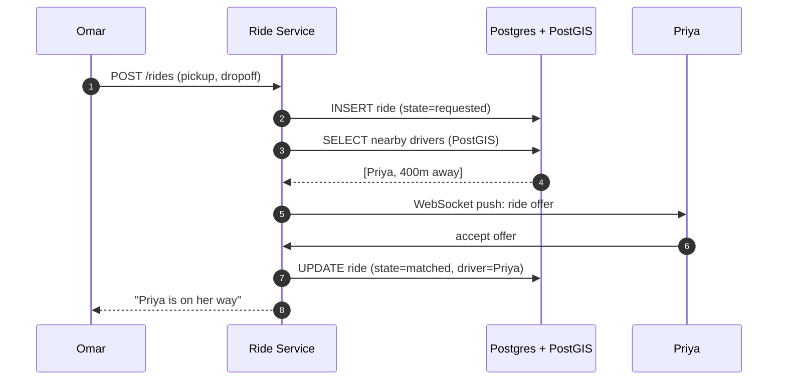
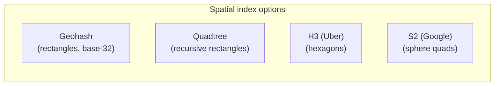
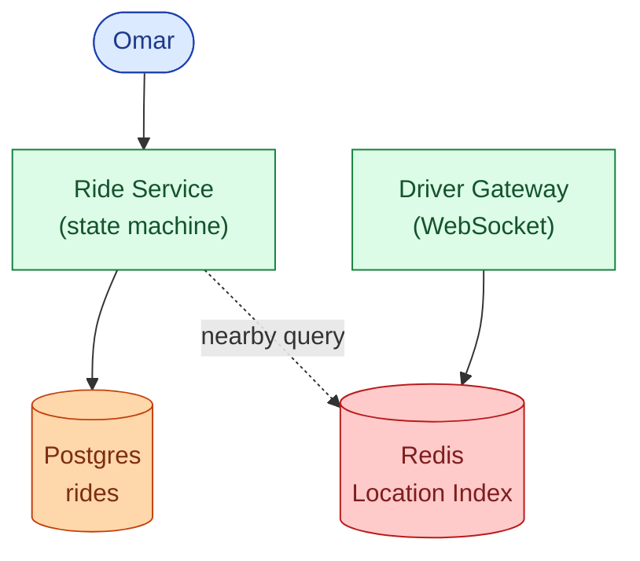
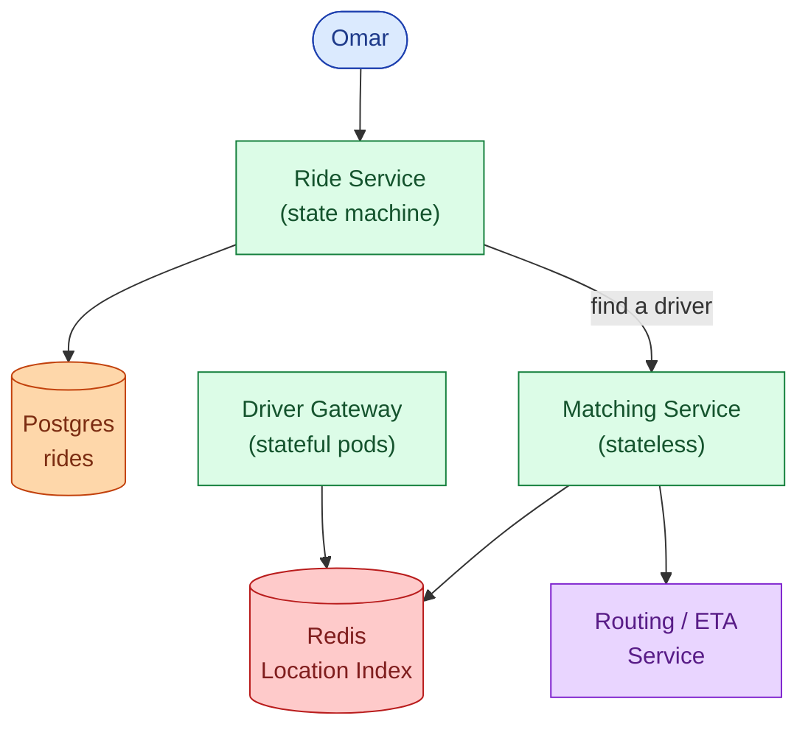
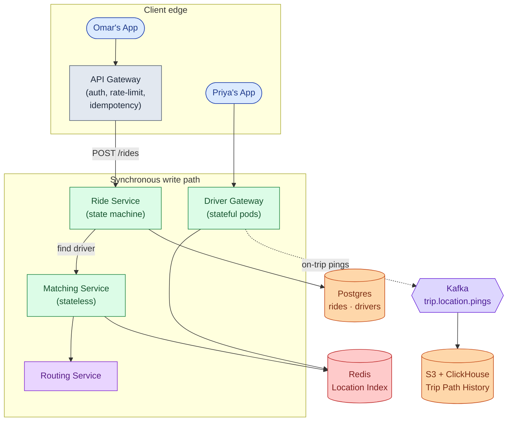
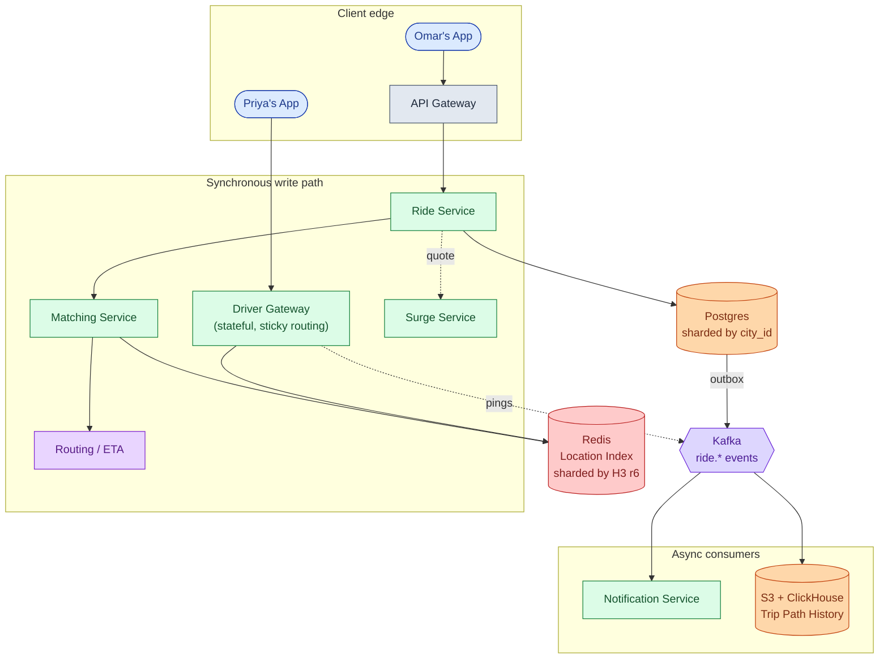
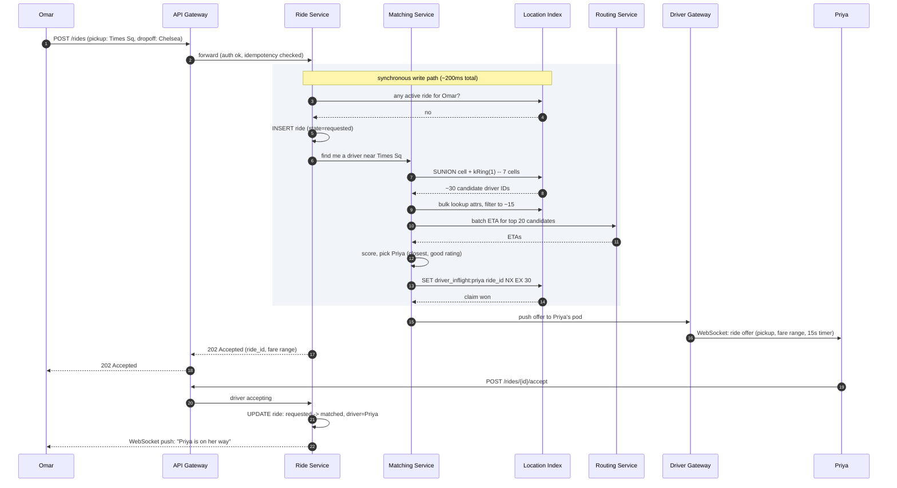
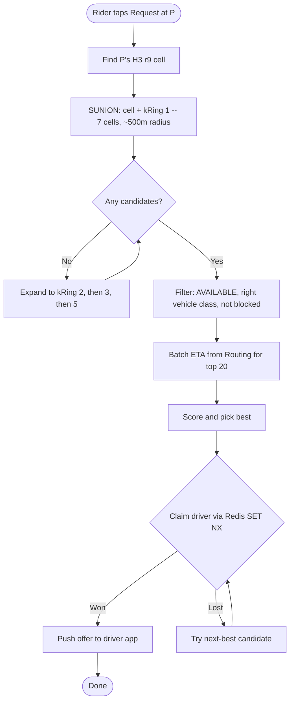

## The scene

You sit down. The interviewer leans back.

> *"Last Friday I opened Uber in Midtown. I tapped Request. Twenty seconds later a driver was on his way."*
>
> *"Walk me through what happened in those twenty seconds. A million drivers are online. How did the system find the right one, lock him in, and push a notification to his phone without charging me for a ride that never happened?"*

That sounds like one problem. It is three problems stacked on top of each other.

First, the **map index**: tracking a million moving cars in real time, each one pinging its location every 4 seconds. Second, the **matching pipeline**: picking the best driver in under 2 seconds. Third, the **state machine**: keeping the ride alive for 20 minutes through dropped connections, cancellations, and driver no-shows, without charging anyone incorrectly.

Get the map index wrong and matching grinds to a halt. Get the state machine wrong and you double-bill riders.

We will build this from a single city to global scale. At each step, we name what breaks and add only what is needed.

---

## Step 1: Picture one ride

Before any boxes, picture what one ride actually is. Omar taps Request. A driver named Priya accepts. That is the skeleton.

```mermaid
stateDiagram-v2
    direction LR
    [*] --> requested: Omar taps Request
    requested --> matched: Priya accepts
    matched --> driver_arriving: en route shown
    driver_arriving --> in_progress: Omar boards, Priya taps Start
    in_progress --> completed: Priya taps End Trip
    driver_arriving --> cancelled: either side cancels
    in_progress --> cancelled: rare; fraud / system
    requested --> cancelled: no driver found
    driver_arriving --> no_show: Priya waited, Omar did not show
    completed --> [*]
    cancelled --> [*]
    no_show --> [*]
```



Everything we add later (the location index, the matching algorithm, surge pricing, path history) is machinery that drives this state machine forward safely.

> **Take this with you.** A ride-sharing system is a state machine with a fast map lookup bolted to the front. The map gets you the right driver. The state machine makes sure you bill correctly.

---

## Step 2: Ask the right questions

In a real interview, take two minutes before drawing anything. Write down what you want to ask.

<details markdown="1">
<summary><b>Show: 5 questions that change the design</b></summary>

1. **What is in scope?** Just matching, or also payments, surge, ETA prediction, in-ride chat, driver onboarding? *A reasonable slice: rider requests, system finds a driver, both sides see live updates until pickup. Mention surge briefly. Skip payments.*

2. **How big is the hottest single city?** Uber global has ~1M online drivers at peak, but the single-city number shapes one shard. NYC and Sao Paulo can each have 50,000 online drivers on a busy Friday. *That number is your shard size target.*

3. **How fast must matching be?** From the rider's tap to "driver assigned," what is the P99 target? *Under 2 seconds. After that, riders give up. This is the SLO the whole architecture is designed around.*

4. **How often do driver apps send location?** *Every 4 seconds when idle-online. Every 1 second when on a trip. This single answer determines the dominant write workload.*

5. **What is the matching rule?** Closest driver wins? Highest-rated nearby? Or batch matching that pairs multiple riders and drivers at once? *Greedy nearest is the right starting point. Batch matching is smarter but adds latency. Ship greedy first.*

A strong candidate also asks: *"Is the routing/ETA calculation part of this service, or separate?"* The right answer is separate. ETA on a road graph is CPU-heavy and spiky. Isolating it means a routing slowdown does not crash matching.

</details>

---

## Step 3: How big is this thing?

Two scales. Same product.

| Metric | Startup city | Uber global |
|--------|-------------|-------------|
| Online drivers | 500 | ~1,000,000 |
| Active riders | 2,000 | ~5,000,000 |
| Trips per day | 5,000 | ~100,000,000 |
| Location pings per second | ~125 | ~550,000 |
| Active trips at any moment | ~52 | ~1,000,000 |

<details markdown="1">
<summary><b>Show: how the numbers come out</b></summary>

**Trips per second.** 100M / 86,400 ≈ **1,160/sec sustained**. Friday night peak is 5-10x: **~10,000/sec at peak**.

**Location pings per second.** Idle online drivers ping every 4 seconds. On-trip drivers ping every 1 second. About 30% of online drivers are on a trip at any moment.

- Idle: 700,000 × (1/4) = 175,000/sec
- On-trip: 300,000 × (1/1) = 300,000/sec
- **Total: ~475,000/sec sustained, ~1,000,000/sec peak**

Location ingest is the dominant write workload by a factor of 50 over matching.

**Bandwidth for location ingest.** Each ping is ~100 bytes (driver_id, lat, lng, heading, speed, accuracy, timestamp, hmac signature). 475,000 × 100B = **47 MB/sec**. Not a bottleneck. Storage is the concern.

**Storage for location data.** We do not store every idle ping. We store only on-trip path history:

- 100M trips/day × ~225 pings/trip × 100B ≈ **2 TB/day**. Compress and age off after 90 days.
- Current locations: 1M drivers × ~200B = **~200 MB total**. Tiny. Overwrite in place. Never keep history for idle drivers.

**Active trips at any moment.** 100M trips/day × 15-minute average / 1,440 min/day ≈ **~1M trips active globally**. The busiest city (NYC) holds 50,000 to 100,000 at peak.

**What the math is telling you.** The system has two very different workloads:

- **Location ingest: 500k+ writes/sec.** Mostly overwrite-in-place in a fast in-memory store.
- **Matching: ~10k/sec.** Cheap to compute, but latency-sensitive to the millisecond.

Most of the architecture exists to keep these two paths from interfering with each other.

</details>

---

## Step 4: The smallest thing that works

Forget global scale. We are a small operation in Austin with 500 drivers. Let us draw the minimum system.




This works for Austin at 500 drivers. The PostGIS nearby query is fast enough. The problem arrives at 25,000 drivers with 500k writes/sec to the location table.

> **Take this with you.** Start from the smallest thing that works. The interesting part is what breaks next.

---

## Step 5: The first crack: the map index

The next morning, the operation expands to NYC. The PostGIS approach has 25,000 drivers sending pings to a relational table at 6,000 writes/sec. The database is the bottleneck before the first rider even taps Request.

The core problem: you need a location store that is fast to write (overwrite-in-place, not INSERT) and fast to query (give me all drivers within 500m of a point, now).

The naive approach stores every driver's `(lat, lng)` in a B-tree. That index does not understand 2D space. You need a **spatial index**.



<details markdown="1">
<summary><b>Show: comparing spatial indexes</b></summary>

| Index | Shape | Good | Not so good |
|-------|-------|------|-------------|
| **Geohash** | Rectangles encoded as base-32 strings (`dr5ru`). Longer string = smaller cell. | Easy to compute. Works in any key-value store. Easy to shard on prefix. | Two points right next to each other can have different prefixes if they sit on a cell boundary. Diagonal distance inconsistency. |
| **Quadtree** | A rectangle split into 4, recursively. | Cells adapt to density: small in dense areas, large in sparse ones. | Tree updates on every move are expensive. Hard to shard because the tree shape changes. Poor fit for real-time location. |
| **H3** | Hexagons at 16 resolutions. Resolution 9 cells are ~174m across. | Every neighbor is the same distance away (hexagon property). One `kRing(cell, 1)` call returns all cells within one ring. Uniform globally. | IDs are 64-bit numbers, not human-readable. 12 "pentagon" cells fill sphere gaps. |
| **S2** | Quadrilateral cells on a sphere via Hilbert curve. | Strong locality: nearby cells have nearby IDs. Range scans work well. | Cells are not uniform in shape or size. Less intuitive than hexagons. |

**Why hexagons beat squares.** Every neighbor of a hexagon is the same distance away. With a square grid, diagonal neighbors are 1.41x farther than edge neighbors. When you search "drivers near me," hexagons give cleaner answers. Your code does not need to compensate for diagonal vs. edge distance.

**The pick: H3 resolution 9.**

- Resolution 9 cells are ~174m across, ~0.1 sq km. In a dense city, 10-100 drivers per cell. Small enough to list quickly. Big enough that most matches happen within one ring.
- Sharding: use coarser resolution 6 (~6km across) as the shard key. One Redis shard owns all the fine cells inside one coarse cell.
- When a rider is near a cell boundary, the matching service reads from both adjacent coarse-cell shards in parallel.

Geohash is fine for v1. H3 is the right answer at scale. Quadtree on a live dataset is the wrong answer.

</details>

The new location store is Redis. Each driver's location overwrites a single hash key in memory. The cell membership sets let matching do a fast set-union to find all drivers in a ring.

> **Take this with you.** The key insight is separating "current location" (overwrite-in-place, Redis) from "trip history" (append-only, Kafka + S3). Trying to use the same store for both is where most v1 designs fall over.

---

## Step 6: Build the architecture, one layer at a time

We have a state machine and a spatial index. Now build the system around them, one layer at a time.

### v1: just the core



Fine for one city with a few thousand drivers.

### v2: separate matching from the state machine

The Ride Service should not contain matching logic. Matching is its own problem: read from the index, filter candidates, score by ETA, claim the driver. Split it out.



The Routing Service is separated because road-network ETA is CPU-heavy. A routing slowdown should not crash matching.

### v3: add the API Gateway and path history

At 5,000 drivers, the rider side needs auth, rate limits, and idempotency handling (mobile apps retry on timeout). Add an API Gateway in front. Add Kafka for trip path history.



### v4: add surge, notifications, sharding by city

At 50,000+ drivers across multiple cities:

- Surge pricing is its own subsystem, reading supply and demand per cell.
- Notifications (driver offer push, "your driver is arriving") should not be on the synchronous path.
- Trips DB is sharded by city so a NYC outage does not take down London.



Each box, in one line:

| Box | What it does |
|-----|--------------|
| **API Gateway** | Authenticates the caller, rate-limits bots, dedupes mobile retries. |
| **Driver Gateway** | Stateful pods. One WebSocket per online driver. Receives pings, pushes offers. |
| **Ride Service** | Owns the ride state machine. Calls Matching when a driver is needed. |
| **Matching Service** | Stateless. Reads Redis, scores candidates with real ETA, claims the best driver. |
| **Routing / ETA** | Road-network ETA from A to B. CPU-heavy. Isolated so slowdowns don't cascade. |
| **Surge Service** | Reads supply and demand per H3 cell. Writes multipliers to Redis. |
| **Redis Location Index** | Overwrite-in-place. The hot index. Matching reads from here. |
| **Postgres (sharded by city)** | Source of truth for ride records. One shard = one city or metro. |
| **Kafka + Consumers** | Trip path history for fraud/disputes. Notifications fan out here. |

> **Take this with you.** If the Notification Service dies at 3am, new rides still get matched. Push messages just queue in Kafka. Anything reactive lives after Kafka, not before.

---

## Step 7: One ride, all the way through

Omar taps Request in Midtown. Watch what happens.



Three things worth pointing at:

1. The 202 goes back to Omar before Priya accepts. The ride is created. Matching is in progress. Omar sees a spinner. The WebSocket delivers the update when Priya taps Accept.
2. The `SET NX EX 30` in Redis is the mutual-exclusion mechanism. If two matching attempts race for Priya, the second one gets `0` back and tries the next-best driver.
3. The matching path (steps 4 through 12) takes under 200ms. Driver acceptance takes 3-15 seconds on top of that. These are different numbers and get different SLOs.

---

## Step 8: Location updates at scale

Priya is online in Midtown. She pings every 4 seconds. Once she picks up Omar, she pings every 1 second. With 1M online drivers, that is 475,000+ pings/sec arriving at the Driver Gateways.

Every ping causes exactly two writes.

**Write 1: overwrite the location index (everyone).**

The Driver Gateway computes the H3 cell from `(lat, lng)`. It updates two Redis keys:

- `driver:{driver_id}`: a hash with `(lat, lng, h3_cell, status, vehicle_class, last_update_ts)`. Overwrite.
- If the H3 cell changed since last ping: remove from `cell:{old_h3}` set, add to `cell:{new_h3}` set. If same cell: no-op.

Two operations. Both in memory. ~0.5ms per ping. The cell sets are how matching queries candidates: `SUNION cell:X cell:X_n1 ... cell:X_n6`.

**Write 2: trip path history (on-trip only).**

If Priya is currently on a trip, the Gateway also pushes the ping to a Kafka topic `trip.location.pings`, keyed by `trip_id`. A consumer batches per trip and writes to S3 plus ClickHouse.

Idle-online drivers (not on a trip) do not get persisted at all. Only on-trip pings go to durable storage.

This split saves ~90% of storage cost. We pay for "where was each active trip every few seconds." We do not pay for "where was every online driver every 4 seconds all day."

<details markdown="1">
<summary><b>Show: failure modes for location ingest</b></summary>

**Stale driver entries.** Priya's app crashes and stops reporting. Her `driver:{driver_id}` key has a 30-second TTL. When it expires, a background sweep removes her from all cell sets. Matching stops considering her within 30 seconds of the crash.

**Hot cells.** JFK at 5pm has hundreds of available drivers in one or two H3 cells. The `cell:{jfk_h3}` Redis key becomes a hot key. The cell's data is small (a set of driver IDs), so the read is fast. But the write rate from drivers moving in and out of the cell can saturate one Redis shard. Fix: in-process cache on the Matching Service (1-second TTL) cuts cell reads by 10-100x. Then read replicas of the hot shard if needed.

**Out-of-order pings.** Priya has a flaky connection. Pings arrive at the server 8 seconds out of order. The Gateway keeps `last_update_ts` per driver and silently discards any ping older than the current timestamp. Avoids the indexed location going backwards.

</details>

> **Take this with you.** Two writes per ping: one cheap overwrite to Redis (everyone), one durable append to Kafka (on-trip only). Separating these cuts storage cost by 10x and keeps the fast path fast.

---

## Step 9: The matching algorithm

Omar taps Request at point P. The Matching Service has under 2 seconds to claim a driver. What is the algorithm?



<details markdown="1">
<summary><b>Show: three levels of matching, simplest first</b></summary>

**Level 1: greedy nearest.**

Search the 1-ring (7 cells, ~500m radius). Filter on status and vehicle class. Score the top 20 by real road ETA from the Routing Service. Claim the best available. If the claim fails (another request got there first), try the next one.

Fast (under 200ms). Works well when supply is plentiful. The default for most cities most of the time.

The downside: locally optimal, globally wasteful. If two riders request at almost the same time and the same driver is best for both, the second rider gets a much worse match than they would under paired matching.

**Level 2: greedy with a short hold (the "dispatch window").**

The Matching Service waits ~500ms to collect other pending requests in the same H3 area. Then it runs a small batch matching (Hungarian algorithm) over the whole batch. The goal is minimizing total ETA across all pairs.

The 500ms hold is invisible to the rider (still under the 2-second target) and improves average ETA by 5-15% in dense areas. Uber runs this in dense cities at peak.

**Level 3: predictive matching.**

The candidate pool includes drivers about to finish a trip in the next 60 seconds. Their ETA includes the remaining trip time plus the drive to pickup.

Ship Level 1. Add Level 2 when load justifies it. Level 3 comes later.

**Filters before scoring:**

- `status == AVAILABLE` (not on a trip, not offline, not in "heading home" mode)
- `vehicle_class` meets or exceeds what the rider asked for
- Driver not on the rider's block list
- Driver did not cancel this same rider in the last 5 minutes
- Driver acceptance rate above a threshold (low-acceptance drivers get deprioritized)

**Scoring (top 20 candidates):**

- `eta`: real road-network ETA to pickup, from the Routing Service
- `driver_rating`: small bonus for higher-rated drivers
- `idle_bonus`: slight preference for drivers who have been idle a long time, without overriding a clearly better match

Never use straight-line (haversine) distance as the primary score. A driver 200m away on the other side of the Hudson River is much farther than a driver 500m away on the same block.

</details>

---

## Step 10: Surge pricing

When demand outpaces supply, prices go up. Surge is its own small subsystem.

The Surge Service reads supply and demand per H3 cell and emits a multiplier:

```
multiplier = clip(demand_rate / supply_count, min=1.0, max=5.0)
```

`demand_rate` is ride requests in the cell in the last 60 seconds. `supply_count` is available drivers in the cell.

The Surge Service runs separately. It consumes the `ride.requested` event stream and snapshots the Driver Location Index every 10 seconds. It writes `surge:{h3_r8}` keys to Redis with a 30-second TTL. The Ride Service reads the multiplier when generating a quote. If the key is missing or stale, it defaults to 1.0.

Surge uses H3 resolution 8 (cells ~3km across, bigger than the resolution 9 used for matching). A 5x multiplier on one block but 1x on the next would feel unfair. Neighborhood-level surge feels natural.

> **Take this with you.** Surge is not part of the matching path. It is a read-only input to the quote. Matching and surge do not talk to each other.

---

## Follow-up questions

Try answering each in 3 or 4 sentences before opening the solution.

1. **Driver ignores the offer.** Priya does not tap Accept within 15 seconds. What does the system do? What if she keeps ignoring requests?

2. **Driver loses connectivity mid-trip.** Priya's phone drops off the network for 90 seconds. How does the system know the trip is still going? What does Omar see? What if Priya never reconnects?

3. **Two riders, one best driver.** Omar and a second rider both request at the same moment and Priya is the best match for both. Walk through the race. How do you prevent Priya from being double-assigned?

4. **Hot cell: airport at rush hour.** JFK has 200 available drivers in two H3 cells. Scoring all 200 on every request is wasteful. How do you bound the work?

5. **Hot Redis key.** The `cell:{jfk_h3}` set is on one Redis shard that is at 100% CPU. Diagnose and fix.

6. **Region failure.** `us-east-1` goes down. NYC rides live there. What happens to in-progress trips? Can riders in other cities still book?

7. **Driver heading away from pickup.** Priya just dropped off a rider and is driving toward home. The matcher picks her for a new request because she is 300m from the pickup. Is this the right call? How do you handle it?

8. **Fraud: fake GPS.** A driver app is submitting fake coordinates to park in a high-surge cell without going there. How do you detect this without adding latency to the ingest path?

9. **Routing Service is slow or down.** Matching depends on it for ETAs. How do you degrade gracefully?

10. **Bulk cancel.** A major storm hits NYC. Ops wants to cancel all in-progress rides in Manhattan and refund riders. How does the backend handle this, and what can go wrong?

---

## Related problems

- **[News Feed (002)](../002-news-feed/question.md).** The hot-cell problem here (airport, stadium) is the same as the celebrity-follower hot fan-out problem in news feed. Same fixes: replicas, in-process cache, jittered TTLs.
- **[Chat System (003)](../003-chat-system/question.md).** The in-ride chat between Omar and Priya is the same WebSocket + presence problem. The Driver Gateway here is shaped like the chat gateway there.
- **[Notification System (010)](../010-notification-system/question.md).** Dispatch push to drivers, "your driver is arriving" to riders, and SMS fallback when the app is backgrounded all flow through the notification service.
