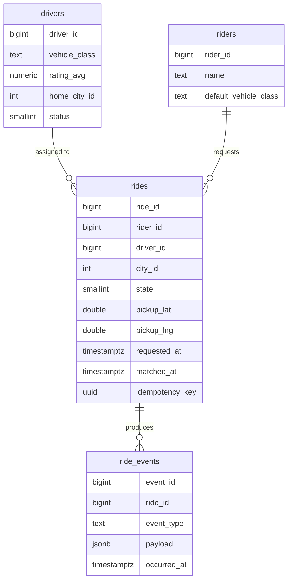
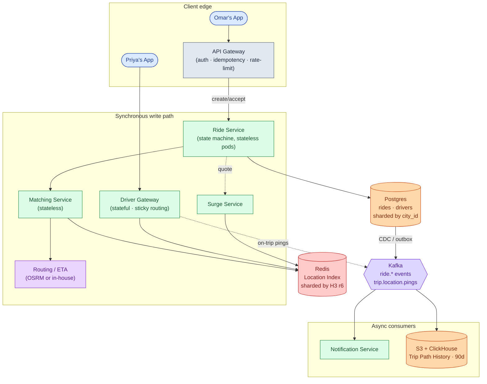
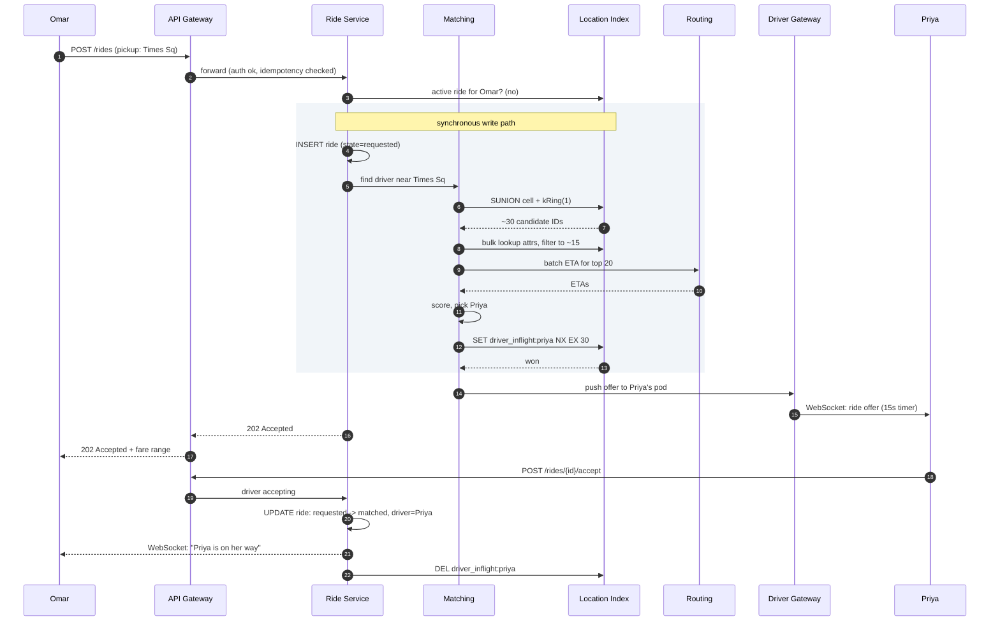
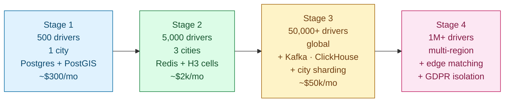

## Solution: Design Uber / Lyft (Ride Sharing)

### The short version

Ride sharing is three problems wearing the same coat.

First, a **map index** that tracks ~1M moving drivers in real time, with 475,000+ location pings per second. Second, a **matching pipeline** that turns a rider's tap into an assigned driver in under 2 seconds. Third, a **ride state machine** that survives 15-25 minutes of cancellations, dropped packets, and backgrounded apps without charging anyone for a ride that never happened.

The design splits cleanly. Location pings flow through a stateful Driver Gateway into a Redis cluster keyed by H3 hexagonal cells. That index is overwrite-in-place. We never query it for history. The Matching Service is stateless: it reads from the Redis index, applies filters, scores candidates using real road-network ETAs from a separate Routing Service. Ride records live in Postgres sharded by city, with per-trip path history streamed to Kafka and S3 for fraud and dispute resolution.

The interesting work is in the seams. The Driver Gateway must be stateful (it holds a WebSocket per driver), which makes deploys harder. The matching service can be greedy or batched. Batched gives 5-15% better global ETA but adds a 500ms hold. The state machine has cancellation, no-show, and reconnect transitions that must all be idempotent because a flaky network delivers every event at least twice.

---

### 1. The two questions that matter most

If you only get to ask two clarifying questions, ask these.

**What is in scope?** Matching only, or also payments, surge, ETA prediction, in-ride chat, driver onboarding? A reasonable slice: rider requests, system finds a driver, both sides see live updates until pickup, mention surge briefly, skip payments. Without scoping this first, you spend the interview designing a payments system.

**How big is the hottest single city?** Uber global has ~1M online drivers at peak, but the single-city number shapes one shard. NYC can have 50,000 online drivers on a busy Friday night. That number is the shard size target and it answers whether Postgres with PostGIS (fine for a small city) or Redis with H3 cells (required for NYC at peak) is the right location store.

Everything else follows from those two answers.

---

### 2. The math, in plain numbers

| Metric | Value |
|--------|-------|
| Trip requests/sec, sustained | ~1,160 |
| Trip requests/sec, peak | ~10,000 |
| Location pings/sec, sustained | ~475,000 |
| Location pings/sec, peak | ~1,000,000 |
| Active trips globally at any moment | ~1,000,000 |
| Active trips, top city (NYC) at peak | 50,000 to 100,000 |
| Durable trip-path storage per day | ~2 TB compressed |
| Current-location storage (all online drivers) | ~200 MB |

The most important observation: location ingest dwarfs every other workload by a factor of 50. Keep it on its own infrastructure so it does not bleed into matching latency or trip-state writes.

---

### 3. The API

**Request a ride (rider side).**

```
POST /api/v1/rides
Authorization: Bearer <rider_token>
Idempotency-Key: <uuid>

{
  "pickup":  { "lat": 40.7580, "lng": -73.9855, "address": "Times Sq" },
  "dropoff": { "lat": 40.7411, "lng": -74.0048, "address": "Chelsea" },
  "vehicle_class": "uberx",
  "payment_method_id": "pm_abc"
}
```

| Status | Meaning |
|--------|---------|
| **202 Accepted** | Ride created in `requested` state. Matching in progress. |
| **200 OK** | Idempotency replay. Same ride returned. |
| **400 Bad Request** | Bad input. Pickup outside service area. |
| **402 Payment Required** | Payment method invalid or expired. |
| **409 Conflict** | Rider already has an active ride. |
| **503 Service Unavailable** | No drivers found after timeout. |

Small but load-bearing choices:

- **202, not 201.** The ride exists but is not yet matched. The client subscribes to a WebSocket channel for state updates. Do not return 201; the resource is not complete yet.
- **Idempotency-Key is required.** Mobile retries on timeout. Without it, you bill people twice. The server stores `(idempotency_key, ride_id)` for 24 hours.
- **The fare is a range.** `fare_min` and `fare_max`. Final fare depends on actual trip time and any waiting time.

**Driver accepts.**

```
POST /api/v1/rides/{ride_id}/accept
Authorization: Bearer <driver_token>

{ "driver_eta_seconds": 180 }
```

| Status | Meaning |
|--------|---------|
| **200 OK** | Driver assigned. |
| **409 Conflict** | Already accepted by another driver, or wrong state. |
| **410 Gone** | Rider cancelled or offer timed out. |

**Location pings (driver side).** Not REST. Sent over the persistent WebSocket as a compact binary frame. About 46 bytes vs ~200 bytes for the JSON equivalent. At 475,000 pings/sec, the bandwidth savings are material.

---

### 4. The data model



<details markdown="1">
<summary><b>Show: the full SQL</b></summary>

```sql
CREATE TABLE rides (
    ride_id          BIGINT PRIMARY KEY,        -- Snowflake-style ID
    rider_id         BIGINT NOT NULL,
    driver_id        BIGINT,                    -- NULL until matched
    city_id          INT NOT NULL,              -- shard key
    state            SMALLINT NOT NULL,         -- 1=requested, 2=matched, 3=driver_arriving,
                                               --   4=in_progress, 5=completed, 6=cancelled, 7=no_show
    pickup_lat       DOUBLE PRECISION NOT NULL,
    pickup_lng       DOUBLE PRECISION NOT NULL,
    dropoff_lat      DOUBLE PRECISION NOT NULL,
    dropoff_lng      DOUBLE PRECISION NOT NULL,
    vehicle_class    SMALLINT NOT NULL,
    requested_at     TIMESTAMPTZ NOT NULL,
    matched_at       TIMESTAMPTZ,
    picked_up_at     TIMESTAMPTZ,
    completed_at     TIMESTAMPTZ,
    cancelled_at     TIMESTAMPTZ,
    cancel_reason    SMALLINT,
    fare_cents       INT,
    surge_mult       NUMERIC(3,2) NOT NULL DEFAULT 1.00,
    idempotency_key  UUID
);

-- Partial indexes keep these small after rides complete.
CREATE UNIQUE INDEX idx_idempotency ON rides (rider_id, idempotency_key);
CREATE INDEX idx_rider_active  ON rides (rider_id)  WHERE state IN (1,2,3,4);
CREATE INDEX idx_driver_active ON rides (driver_id) WHERE state IN (3,4);

CREATE TABLE ride_events (
    event_id      BIGINT PRIMARY KEY,
    ride_id       BIGINT NOT NULL REFERENCES rides(ride_id),
    event_type    TEXT NOT NULL,
    payload       JSONB,
    occurred_at   TIMESTAMPTZ NOT NULL DEFAULT NOW()
);
CREATE INDEX idx_events_ride ON ride_events (ride_id, occurred_at);
```

The partial index on `driver_id` for active states is the guard against double-assignment. If the Matching Service tries to write `driver_id=Priya` to two different rides with state in (3,4), the second write violates the partial unique index. Belt and suspenders alongside the Redis `SET NX` claim.

</details>

**The Driver Location Index (Redis, not SQL).**

```
driver:{driver_id}          HASH    fields: lat, lng, h3_r9, h3_r6,
                                            status, vehicle_class, last_update_ts
                                    TTL: 30s (refreshed on every ping)

cell:{h3_r9}                SET     members: driver_ids currently in this cell
                                    (no TTL; entries swept by TTL expiry of driver keys)

driver_inflight:{driver_id} STRING  value: ride_id of active dispatch claim
                                    TTL: 30s (safety net; cleared on accept or timeout)

surge:{h3_r8}               STRING  value: multiplier (e.g. "2.1")
                                    TTL: 30s (refreshed by Surge Service every 10s)
```

Sharded by `h3_r6` (coarse cells, ~6km across). All drivers in one metro neighborhood land on the same Redis shard. ~20 shards at peak. ~5 GB per shard.

---

### 5. H3 indexing and the matching loop

**Why H3 resolution 9.** Cells are ~174m across, ~0.1 sq km. A dense city has 10-50 available drivers per cell at peak. A `kRing(cell, 1)` query covers the cell plus its 6 neighbors, a ~500m radius. That is the right scale for "drivers close enough to arrive in a few minutes." If no match in the 1-ring (common in suburbs), expand to ring 2, 3, 5. Cap at ring 5.

**Why hexagons beat squares.** Every neighbor of a hexagon is the same distance away. With a square grid, diagonal neighbors are 1.41x farther than edge neighbors. When you are searching "drivers near a pickup," hexagons give you clean, symmetric results without compensation in code.

<details markdown="1">
<summary><b>Show: the matching loop</b></summary>

```python
def match(ride):
    pickup_cell = h3.geo_to_h3(ride.pickup_lat, ride.pickup_lng, resolution=9)

    for ring_size in [1, 2, 3, 5]:
        cells = h3.k_ring(pickup_cell, ring_size)
        candidate_ids = redis.sunion(*[f"cell:{c}" for c in cells])

        candidates = location_index.bulk_lookup(candidate_ids)
        candidates = [
            d for d in candidates
            if d.status == AVAILABLE
            and d.vehicle_class >= ride.vehicle_class
            and d.driver_id not in ride.rider.blocked_drivers
        ]

        if not candidates:
            continue

        candidates = sorted(candidates, key=lambda d: haversine(d, ride.pickup))[:20]
        etas = routing_service.batch_eta(
            origins=[(c.lat, c.lng) for c in candidates],
            destination=(ride.pickup_lat, ride.pickup_lng),
            timeout_ms=300,
        )

        scored = sorted(
            zip(etas, candidates),
            key=lambda t: t[0] + rating_penalty(t[1].rating) + idle_bonus(t[1])
        )

        for eta, candidate in scored:
            if try_claim(candidate.driver_id, ride.ride_id):
                return candidate.driver_id

    return None
```

`try_claim` is a Redis Lua script:

```lua
if redis.call('SET', KEYS[1], ARGV[1], 'NX', 'EX', 30) == 1 then
    return 1
else
    return 0
end
```

`SET NX EX 30` means "set only if not exists, expire in 30 seconds." Two racing requests for the same driver: one returns 1 (won), the other returns 0 (try next-best). The 30-second expiry is a safety net. If the Matching Service crashes before dispatching, the lock auto-releases and the driver becomes claimable again.

</details>

---

### 6. The ride state machine

```mermaid
stateDiagram-v2
    direction LR
    [*] --> requested: rider taps Request
    requested --> matched: driver accepts
    requested --> cancelled: no driver found / rider cancels
    matched --> driver_arriving: en route shown
    driver_arriving --> in_progress: rider boards, driver taps Start
    driver_arriving --> cancelled: either side cancels
    driver_arriving --> no_show: driver waited, rider did not show
    in_progress --> completed: driver taps End Trip
    in_progress --> cancelled: rare; fraud / system cancel
    completed --> [*]
    cancelled --> [*]
    no_show --> [*]
```



Four invariants you cannot break:

1. **Every transition is idempotent.** `POST /accept` called twice leaves the state unchanged. `matched_at` is set only on the first transition.
2. **No backward transitions.** Once `in_progress`, the only exits are `completed` or `cancelled`.
3. **One driver per ride. One ride per driver.** The Redis `driver_inflight` key and the partial unique index on `rides.driver_id` both enforce this. Two locks, two layers.
4. **Cancel reason is required.** `rider_cancelled`, `driver_cancelled`, `system_no_drivers`, `no_show`, `fraud`. Drives billing and the refund decision.

Transitions are conditional SQL updates:

```sql
UPDATE rides
SET state = 2, driver_id = $driver, matched_at = NOW()
WHERE ride_id = $ride AND state = 1
RETURNING state;
```

If `RETURNING` yields 0 rows, the transition failed. The Driver Gateway tells Priya "ride no longer available" and clears her inflight key.

---

### 7. The architecture



Five things to notice:

- The Driver Gateway is **stateful**. A WebSocket is a connection. Sticky routing by `driver_id` plus a Redis session table (`gateway_session:{driver_id} -> pod_id`) lets the Matching Service push dispatch offers by looking up which pod holds each driver.
- The Matching Service is **stateless**. It owns no connections. Reads Redis, calls Routing, claims via `SET NX`, tells the gateway to push. Easy to scale horizontally.
- The Routing Service is **isolated**. Road-network ETA is CPU-heavy and spiky. Isolation means a routing slowdown does not crash matching. Matching times out at 300ms and falls back to straight-line distance.
- The Trips DB is **sharded by city**. Cities are natural blast-radius boundaries. A NYC database failure does not affect London.
- Notifications and path history live **after Kafka**. If the Notification Service crashes, rides still get matched and completed. Push messages queue up and deliver when it recovers.

---

### 8. A request, end to end



Target latencies:

| Operation | P99 target |
|-----------|------------|
| Create ride (202 back to Omar) | ~200ms (bottleneck: SUNION + Routing call) |
| Driver accept (matched state) | ~150ms |
| Dashboard / ride status read | ~50ms |

---

### 9. The scaling journey: one city to global



#### Stage 1: 500 drivers, one city

One Postgres with the PostGIS extension. Driver locations stored in a table with a GiST spatial index. One app instance. Notifications via SendGrid inline. About $300/month.

This works because you see 50 ride requests per hour. PostGIS is loafing. Anything more is over-engineering.

#### Stage 2: 5,000 drivers, 3 cities

PostGIS location table cannot keep up with ~1,250 pings/sec. Move location to Redis with the H3 cell-sets pattern. Add a dedicated Driver Gateway for WebSocket connections. Add a standalone Matching Service. Notifications consume a small Kafka topic instead of inline HTTP calls. About $2k/month.

Still one Postgres for ride records. Still one Routing instance.

#### Stage 3: 50,000+ drivers, global

Several things break at once:

- Airport H3 cells become Redis hot keys.
- The Routing Service cannot keep up with synchronous ETA calls at peak.
- One global Matching Service has cross-region latency.
- The single Postgres for ride records cannot handle writes from dozens of cities.

Fixes, in order:

- In-process cache on Matching Service for cell reads (1-second TTL). Cuts Redis load on hot cells by 10-100x.
- Matching Service replicated per city. Each city-region has its own instance.
- Postgres sharded by `city_id`. Each region runs its own primary plus read replicas.
- Routing Service scaled independently. Circuit-breaker with haversine fallback.
- Trip path history streamed to Kafka, then S3 and ClickHouse. Audit queries run on ClickHouse, not on the primary DB.

Cost around $50k/month.

#### Stage 4: 1M+ drivers, multi-region

New problems:

- A region failure (`us-east-1` down) takes down all NYC rides.
- EU operations open. GDPR requires EU rider data to stay in EU.
- Cross-region drivers (US driver near a border, EU event city) need to be handled.

Multi-region everything. Each region runs its full stack: Gateway, Redis, Matching, Trips DB, Kafka. The rider's home region (from profile) decides where the ride record lives. A US driver in a EU region is routed to the EU region's Driver Gateway. The EU region owns the trip.

For within-region reliability: Trips DB replicated across AZs. A single AZ failure is invisible to riders. A full region failure (rare) cancels in-progress rides with refunds and redirects new traffic via DNS failover.

The architecture has not fundamentally changed since Stage 3. You added regions and GDPR isolation. The core data model is the same one written in Stage 1.

---

### 10. The four hard sub-problems

Same architecture. Four situations that each stress a different component.

| Situation | What stresses the system | The fix |
|-----------|--------------------------|---------|
| **Airport pickup at 5pm** | One H3 cell has 200 available drivers. SUNION returns 200 IDs. Routing call for all 200 would be slow. | Pre-filter by haversine to top 50 before fetching attributes. Cap Routing call at top 20. In-process cache for cell membership. |
| **Concert lets out, 5,000 requests in 10 minutes** | Demand spike in a small area. Matching races. Surge computation lags. | Batch matching with dispatch window (500ms hold). Surge Service updates every 10 seconds with smoothing to avoid 1x to 5x jumps. |
| **Driver connectivity drops mid-trip** | Ride is `in_progress`. No pings arriving. Rider sees no movement. | State machine does not care about pings. Rider app shows "GPS lost" after 30 seconds of stale location. Driver app queues pings locally and replays on reconnect with original timestamps. |
| **Driver just dropped off a rider, heading home** | Available status, but moving away from request area. Haversine makes them look close. | Use Routing Service ETA (road-network, direction-aware) not haversine as the final score. A driver heading away is farther by ETA even if close by straight line. |

---

### 11. Reliability

**Driver Gateway pod crash.** All drivers on that pod disconnect. Apps retry with exponential backoff plus jitter (start 1s, max 30s). Within ~10 seconds, a healthy pod absorbs them. During the reconnection window, those drivers are not matchable. In-progress rides on those drivers are not affected: ride state lives in Postgres, not the Gateway.

**Driver app loses connectivity mid-trip.** WebSocket drops. The trip stays `in_progress`. No event has transitioned it. After 15 minutes with no pings during an `in_progress` ride, ops gets an alert. They review and either mark `completed` with a partial-path fare or `cancelled` with refund. The fare is computed from the dropoff event, not from pings, so lost connectivity does not by itself invalidate the trip.

**Redis cluster loss.** Catastrophic for matching. AZ replication handles most failures in ~30 seconds. During that window, matching is degraded (rides queue). On full cluster loss, location pings buffer in Gateway memory for up to 60 seconds. After that, drivers appear offline and riders see "no drivers available."

**Routing Service slow or down.** Match path falls back to haversine for scoring. Quality drops (a driver across a river may rank too high) but the system functions. A circuit breaker trips after sustained Routing failures and switches all matches to haversine for a 30-second cooldown before probing again. Rider-facing ETA display becomes "a few minutes" instead of a specific number.

**Trips DB primary failure.** Failover to replica (~30 seconds). During the window, new ride requests in that city return 503. In-progress rides cannot transition state. Other cities are fully functional.

---

### 12. Observability

| Metric | Why it matters |
|--------|----------------|
| `match.latency.p99` by city | Headline SLO. >2s for 5 min is a page. |
| `match.success_rate` by city | % of requests that get a driver before timeout. |
| `match.no_drivers_rate` | >5% in a city means a supply problem. |
| `dispatch.accept_rate` | % of offers accepted. <40% means drivers gaming the system or bad match quality. |
| `location.ingest_rate` by region | Should track `drivers_online × (0.25 + 0.3 × 0.75)`. |
| `location.stale_driver_count` | Drivers with last update >30s. Spikes mean a Gateway problem. |
| `redis.hot_cell.ops` for airports, stations | Should stay below shard CPU capacity. |
| `routing.latency.p99` | Feeds directly into match latency. |
| `state_machine.illegal_transitions` | Should be near zero. Nonzero means a client bug or replay attack. |
| `trip.in_progress_no_pings.count` | Trips with no ping in 60s. Possible fraud or network failure. |

Page on: match P99 >2s for 5 min in any top-20 city. Match success rate <90% for 5 min. Gateway disconnect rate >5%/min. Trips DB unavailable.

Ticket on: dispatch accept rate <40%. Hot cell ops >80% of shard capacity. Illegal transitions >0.

---

### 13. Follow-up answers

**1. Driver ignores the offer.**

The Matching Service holds a soft claim via `driver_inflight:{driver_id}` with a 30-second TTL. When dispatch times out at 15 seconds:

- Gateway tells Matching "no answer."
- Matching releases the claim (`DEL driver_inflight`) and increments a per-driver `ignored_count`.
- Matching re-runs, excluding this driver for the next 5 minutes.
- Omar's UI keeps showing "finding your driver." State stays `requested`. No fee.

If a driver ignores 3 offers in a row, their status flips to `offline` automatically. Their app gets: "You seem inactive. Are you still online?" This stops abandoned phones from holding queue slots.

**2. Driver loses connectivity mid-trip.**

The ride is in `in_progress`. The state machine does not care about the WebSocket connection. It cares only about state-change events.

- Gateway marks the driver `connection_lost` in the session table but does not change ride state.
- After 30 seconds, Omar's app shows a "GPS lost" overlay.
- Priya's app queues location samples locally (up to ~10 minutes).
- When Priya reconnects, the Gateway accepts the queued samples. They are timestamped; out-of-order is handled. Path history backfills.
- If she never reconnects: after 15 minutes during `in_progress`, ops gets an alert and manually resolves.

The fare is computed from Priya's `End Trip` event, not from GPS pings. Lost connectivity does not invalidate the trip.

**3. Two riders, one best driver.**

Omar and a second rider, let's say Yui, both request at almost the same time. Priya is the best match for both.

Both Matching Service instances attempt `SET driver_inflight:priya NX EX 30`. One wins. Say Omar's request wins at t=200ms. Yui's request gets `0` back at t=210ms.

Yui's Matching Service moves to the next-best candidate. If Yui has other good options nearby, she barely notices. If the area is sparse, she waits 1-2 more seconds while Matching expands to ring 2.

The Redis `SET NX` is the first layer of mutual exclusion. The partial unique index on `rides.driver_id` for active states is the second layer. Belt and suspenders.

**4. Hot cell: airport at rush hour.**

JFK has 200 available drivers in two H3 cells. Scoring all 200 on every request is wasteful.

Two costs to bound:

- The SUNION returns up to 200 IDs.
- Routing needs real road-network ETA for each one.

Fix: pre-filter by haversine (cheap, in-process) to the 50 nearest before fetching full attributes. After filtering on status and vehicle class, pass only the top 20 to Routing. The hot cell adds a few milliseconds of in-process work, not a Routing round-trip per candidate.

Also: in-process cache on Matching with a 1-second TTL for cell membership. A hot cell serving dozens of requests per second will be served from memory for most of them.

**5. Hot Redis key.**

Symptoms: one Redis shard at 100% CPU, `cell:{jfk_h3}` reads dominate, every other key on that shard has degraded P99.

Mitigations in order:

1. In-process cache on Matching (1-second TTL). Cuts hot-cell reads by 10-100x. This alone often fixes it.
2. Read replicas of the hot shard. Matching round-robins reads across them.
3. Sub-shard the hot cell. Replace `cell:{h3}` with `cell:{h3}:bucket{0..15}` keyed by `hash(driver_id) mod 16`. Reads become a 16-way SUNION (still fast). Writes distribute across 16 keys.
4. Pin known hot cells (airports, stadiums) to a dedicated high-resource shard at provisioning.

Most deployments need only steps 1 and 2.

**6. Region failure.**

In-progress trips in the failed region cannot transition state (the Trips DB is unavailable). Riders on those trips see "service interrupted" and are auto-cancelled with a full refund.

Riders in unaffected cities are fully functional. City sharding by design gives independent blast radii: NYC going down does not affect London, Tokyo, or anywhere else.

For within-region reliability: the Trips DB is replicated across AZs. A single AZ failure is invisible. A full region failure triggers DNS-based failover for new traffic, plus the auto-cancel path for in-progress rides.

**7. Driver heading away from pickup.**

The driver has `status=AVAILABLE` but is driving home after dropping off a rider. Haversine distance says she is 300m away. Her road-network ETA is actually 8 minutes because she would need to make a U-turn.

The fix: always use the Routing Service for final scoring, not haversine. Road-network ETA is direction-aware. It factors in the U-turn, one-way streets, and current heading. A driver heading away ranks lower on ETA even if close by straight line.

The haversine pre-filter (to narrow 200 candidates to 50 before calling Routing) is acceptable for the coarse sort. The final score always uses road-network ETA.

**8. Fraud: fake GPS locations.**

A driver submits fake coordinates to appear in a high-surge area without going there.

Detection without adding latency to the ingest path:

- **Plausibility check at the Gateway.** If a driver jumps more than 1km between two pings 4 seconds apart (maximum realistic speed: ~900 km/h at 1km in 4s), flag the ping. Real cars do not teleport. Sub-millisecond check.
- **Road-path check.** For on-trip drivers, the path should follow roads. A path that cuts through buildings is suspicious. Run this as a nightly batch job against Trip History in ClickHouse.
- **Device attestation.** Google Play Integrity and Apple DeviceCheck verify the location came from a real device, not a mock-location app. Bake into the WebSocket handshake. Flagged devices receive lower matching priority.
- **Surge-zone teleportation.** A driver appearing in a high-surge cell with no recent path leading there gets flagged.

None of these sit in the synchronous match path. Fraud is mostly an async detection problem.

**9. Routing Service slow or down.**

Matching falls back to haversine distance for scoring:

```python
try:
    etas = routing_service.batch_eta(origins, dest, timeout_ms=300)
except (TimeoutError, ServiceUnavailable):
    etas = [haversine(o, dest) / AVG_SPEED for o in origins]
    metrics.inc("matching.routing_fallback")
```

Quality drops because haversine ignores road network. A driver across a river or park may rank too high. But the system functions and most urban grid matches remain acceptable.

A circuit breaker trips after sustained failures and switches all Matching to haversine for a 30-second cooldown before probing again.

For rider-facing ETA display: fall back to "a few minutes" instead of a specific number. A wrong number is worse than a vague one.

**10. Bulk cancel: storm in Manhattan.**

Ops wants to cancel all in-progress and matched rides in Manhattan and refund riders.

Backend approach: `POST /admin/bulk_cancel` with a city and bounding-box filter. The service iterates over rides in that box with state in (2, 3, 4), transitions each to `cancelled` with `cancel_reason=system_event`, and enqueues refund events to Kafka.

Risks to call out:

- Serial iteration at 50,000 active trips is slow. Run it as a background job with a progress key in Redis. Do not block the API thread.
- Some rides will have just completed or been cancelled by the rider between the query and the update. The conditional `WHERE state IN (2,3,4)` handles that safely.
- Downstream: the refund consumer must be idempotent. If the bulk cancel job crashes halfway and replays, the refund consumer must not double-refund.
- Notify drivers too. Drivers with active dispatch offers should receive "ride cancelled" over their WebSocket immediately, not just through a Kafka event that might lag.

---

### 14. Trade-offs worth saying out loud

**Greedy match vs. batch match.** Greedy is simpler, faster, and locally optimal. Batch with a 500ms dispatch window gives 5-15% better global ETA in dense areas. Ship greedy first. Add batched matching as an experiment per-city with a tunable window.

**Why H3 and not geohash.** Hexagonal neighbor uniformity matters when most matches are within 1-2 rings. Geohash neighbors have non-uniform distance, requiring more rings to cover the same physical radius. H3 also has `compact`/`uncompact` for multi-resolution queries.

**Why a stateful Driver Gateway.** "Stateless" is right for most services, but a WebSocket is a connection. The alternative (long-polling) costs 3-5x more bandwidth and battery. Stateful with sticky routing and a session table is the right answer here.

**Why not Postgres for driver locations.** 475,000 overwrite-in-place operations per second to a relational table is very painful. Redis handles this at < 1ms per operation. Location is "current truth, not historical truth." Treating it as a cache, not a record, is the right model.

**Why separate the Routing Service.** Road-network ETA computation is CPU-intensive and has a different scaling profile than matching. If Routing slows down during a sporting event, you want it to degrade in isolation, not take matching down with it. The haversine fallback is acceptable at degraded quality.

---

### 15. Common mistakes

**"Store driver locations in Postgres with a GiST index."** Fine for v1 at 500 drivers. Falls over at 25,000+ drivers with sustained writes. Identify it as the toy answer and graduate to Redis + H3 at scale. The strongest answers say "v1 uses PostGIS, here is the signal that tells us to switch."

**"Use haversine for scoring."** Acceptable as a fallback or pre-filter. As the primary score, it ignores the road network and ranks drivers on the wrong side of rivers, parks, or one-way streets. The interviewer is checking whether you know Routing is a separate layer.

**No state machine.** A design that describes matching but never names the ride states (`requested`, `matched`, `driver_arriving`, `in_progress`, `completed`, `cancelled`, `no_show`) is incomplete. The state machine is where most production bugs and billing errors live.

**Ignoring idempotency.** Network retries on `POST /rides` cause duplicate rides and double charges. Idempotency keys are required, not optional. This is the single most common production incident in ride-sharing systems.

**No mention of the hot-cell problem.** Every city has an airport. Every stadium empties after a game. If you cannot describe how to keep one Redis key alive under load, you are missing a real operational concern that Uber has published about publicly.

**Treating Routing as a free function call.** It is the heaviest dependency in the match path. Bounding its concurrency, timeout, and fallback is essential. Weak answers call Routing and never discuss what happens when it is slow.

**Forgetting cancellation.** Half the state machine is cancel paths. Happy path only leaves the interviewer to infer the rest. Call out driver no-response, rider cancel, driver cancel, and system cancel explicitly.

**Confusing match latency with acceptance latency.** Matching takes <200ms. Driver acceptance takes 3-15 seconds. The 2-second P99 SLO is for "from rider tap until the offer is dispatched to the driver's phone," not "until the driver taps Accept." Be explicit about which one you are measuring.

**Over-engineering multi-region.** Cities are independent. You do not need a globally-distributed multi-master location index. Per-region, per-city sharding is the right model. A NYC driver cannot pick up a Tokyo rider anyway.
