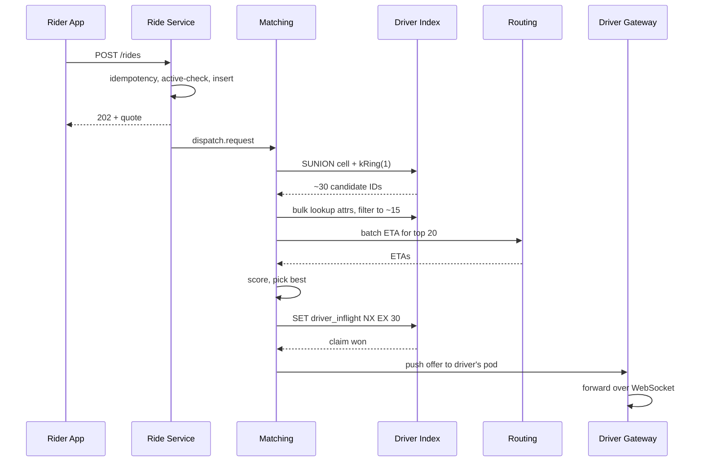

## Solution: Design Uber / Lyft (Ride Sharing)

### The short version

Ride sharing is three problems wearing the same coat.

1. A map index that tracks ~1M moving drivers with 250k+ location pings per second.
2. A matching pipeline that turns a rider's tap into an assigned driver in under 2 seconds.
3. A ride state machine that survives 15 to 25 minutes of cancellations, dropped packets, and backgrounded apps without charging anyone for a ride that never happened.

The design splits cleanly. Location pings flow through a stateful driver gateway into a Redis cluster keyed by H3 hexagonal cells. That index is overwrite-in-place. We never query it for history. The matching service is stateless. It reads from the index, applies filters, scores with a real road-network ETA from a separate routing service. Trip records live in a Postgres (or DynamoDB) sharded by city, with per-trip path history streamed to Kafka and S3 for fraud and disputes.

The interesting work is in the seams. The driver gateway has to be stateful (it holds a WebSocket per driver), which makes deploys harder. The matching service can be greedy or batched. Batched gives 5 to 15% better global ETA but adds a 500ms hold. The state machine has cancellation, no-show, and reconnect transitions that all must be idempotent because a flaky network delivers every event twice. Surge is its own subsystem that reads aggregated supply and demand per cell. Every hot key (airport pickup, stadium after a game, celebrity driver near a concert) needs the same hot-key fixes that show up in every other large system.

---

### 1. The clarifying questions, in one paragraph

The most important question is *what is in scope?* Matching only, or also payments, surge, ETAs, chat? The second most important is *how big is the hottest single city?* That number sizes one shard, and the answer (50,000 drivers in NYC at peak) shapes the whole architecture.

The other questions (location ping frequency, matching policy, cancel handling, vehicle types, sharding model) all follow from those two.

---

### 2. The math, in plain numbers

| Metric | Value |
|--------|-------|
| Trip requests/sec sustained | ~1,160 |
| Trip requests/sec peak | ~10,000 |
| Location updates/sec sustained | ~550,000 |
| Location updates/sec peak | ~1,000,000 |
| Active trips at any moment globally | ~1,000,000 |
| Active trips per top-tier city | 50,000 to 100,000 |
| Durable trip-path storage per day | ~2 TB compressed |

The most important observation: location ingest dwarfs every other workload. Keep it on its own infrastructure (the gateway and the hot index) so it does not bleed into matching latency or trip-state writes.

---

### 3. The API

**Request a ride (rider side).**

```
POST /api/v1/rides
Authorization: Bearer <rider_token>
Idempotency-Key: <uuid>

{
  "pickup":  { "lat": 40.7580, "lng": -73.9855, "address": "Times Sq" },
  "dropoff": { "lat": 40.7411, "lng": -74.0048, "address": "Chelsea" },
  "vehicle_class": "uberx",
  "payment_method_id": "pm_abc"
}
```

| Status | Meaning |
|--------|---------|
| 202 Accepted | Ride created in `requested` state. Matching in progress. |
| 200 OK | Idempotency replay. Same ride returned. |
| 400 Bad Request | Bad input. Pickup outside service area. |
| 402 Payment Required | Payment method invalid. |
| 409 Conflict | Rider already has an active ride. |
| 503 Service Unavailable | No drivers found after timeout. |

A few small but important choices:

- **202, not 201.** The ride exists but is not yet matched. The client subscribes to a WebSocket channel for updates.
- **Idempotency-Key is required.** Mobile retries the submit on timeout. Without the key, you bill people twice. The server stores `(idempotency_key, ride_id)` for 24 hours. A repeat returns the existing ride.
- **The quote is a range.** `fare_min` and `fare_max`. Final fare depends on actual trip time and waiting.

**Driver accepts.**

```
POST /api/v1/rides/{ride_id}/accept
Authorization: Bearer <driver_token>

{ "driver_eta_seconds": 180 }
```

| Status | Meaning |
|--------|---------|
| 200 OK | Driver assigned. |
| 409 Conflict | Already accepted by another driver, or wrong state. |
| 410 Gone | Rider cancelled or offer timed out. |

**Location pings (driver side).** Not REST. Sent over the persistent WebSocket as a binary frame:

```
[1 byte msg_type=LOC]
[8 bytes driver_id]
[4 bytes lat (fixed-point)]
[4 bytes lng (fixed-point)]
[2 bytes heading]
[2 bytes speed]
[1 byte accuracy]
[8 bytes ts_ms]
[16 bytes hmac_sig]
```

~46 bytes on the wire vs ~200 bytes for the JSON version. At 250k packets/sec the savings add up.

---

### 4. The data model

**Drivers (mostly static profile, not the hot index).**

```sql
CREATE TABLE drivers (
    driver_id       BIGINT PRIMARY KEY,
    name            TEXT NOT NULL,
    vehicle_class   SMALLINT NOT NULL,   -- 1=uberx, 2=uberxl, 3=black
    vehicle_plate   TEXT NOT NULL,
    rating_avg      NUMERIC(3,2) NOT NULL DEFAULT 5.00,
    rating_count    INT NOT NULL DEFAULT 0,
    home_city_id    INT NOT NULL,
    status          SMALLINT NOT NULL,   -- 1=active, 2=suspended, 3=offboarded
    created_at      TIMESTAMPTZ NOT NULL DEFAULT NOW()
);
CREATE INDEX idx_city_status ON drivers (home_city_id, status);
```

Read-mostly. Not in the location update path. Only ride creation and post-trip aggregation touch it.

**Rides (the trip record).**

```sql
CREATE TABLE rides (
    ride_id         BIGINT PRIMARY KEY,    -- Snowflake-style
    rider_id        BIGINT NOT NULL,
    driver_id       BIGINT,                 -- NULL until matched
    city_id         INT NOT NULL,           -- shard key
    state           SMALLINT NOT NULL,
    pickup_lat      DOUBLE PRECISION NOT NULL,
    pickup_lng      DOUBLE PRECISION NOT NULL,
    dropoff_lat     DOUBLE PRECISION NOT NULL,
    dropoff_lng     DOUBLE PRECISION NOT NULL,
    vehicle_class   SMALLINT NOT NULL,
    requested_at    TIMESTAMPTZ NOT NULL,
    matched_at      TIMESTAMPTZ,
    picked_up_at    TIMESTAMPTZ,
    completed_at    TIMESTAMPTZ,
    cancelled_at    TIMESTAMPTZ,
    cancel_reason   SMALLINT,
    fare_cents      INT,
    surge_mult      NUMERIC(3,2) NOT NULL DEFAULT 1.00,
    payment_method  TEXT,
    idempotency_key UUID
);
CREATE UNIQUE INDEX idx_idempotency ON rides (rider_id, idempotency_key);
CREATE INDEX idx_rider_active ON rides (rider_id) WHERE state IN (1,2,3,4);
CREATE INDEX idx_driver_active ON rides (driver_id) WHERE state IN (3,4);
```

Sharded by `city_id`. Rides do not cross cities mid-flight. This gives clean shard boundaries.

The partial indexes are doing real work. `idx_rider_active` enforces "one active ride per rider" cheaply. `idx_driver_active` does the same for drivers. After a ride completes, the row drops out of both partial indexes, keeping them small.

**Driver Location Index (Redis, not SQL).**

```
driver:{driver_id}     HASH    fields: lat, lng, h3_r9, h3_r6, status,
                                       vehicle_class, last_update_ts
                                TTL: 30s (refreshed on every update)

cell:{h3_r9}           SET     members: driver_ids currently in this cell
                                (no TTL; entries removed by background sweep
                                 when driver TTL expires)

driver_inflight:{driver_id}    STRING  value: ride_id of active dispatch
                                       (set on claim, cleared on accept/timeout)
```

Sharded by `h3_r6` (coarser, ~6km across) so all drivers in one metro neighborhood land on the same Redis shard. ~20 shards total at peak. ~5GB per shard.

---

### 5. H3 indexing and the matching loop

**Why H3 resolution 9.** Resolution 9 cells are ~174m across, ~0.1 sq km. In a dense city you get 10 to 50 available drivers per cell at peak. A `kRing(cell, 1)` query covers the cell plus its 6 neighbors, a ~750m radius. That is the right scale for "drivers close enough to pick me up in a few minutes."

If no match in the 1-ring (rare in dense areas, common in suburbs), expand to ring 2 (~1.5km), then ring 3 (~2.3km). Cap at ring 5. Past that, ETA is unacceptable and the rider sees "no drivers available."

**The matching loop:**

```python
def match(ride):
    pickup_cell = h3.geo_to_h3(ride.pickup_lat, ride.pickup_lng, resolution=9)

    for k in [1, 2, 3, 5]:
        cells = h3.k_ring(pickup_cell, k)
        candidate_ids = redis.sunion(*[f"cell:{c}" for c in cells])

        # Coarse filter on cached driver attributes.
        candidates = location_index.bulk_lookup(candidate_ids)
        candidates = [
            d for d in candidates
            if d.status == AVAILABLE
            and d.vehicle_class >= ride.vehicle_class
            and d.driver_id not in ride.rider.blocked_drivers
        ]

        if len(candidates) == 0:
            continue

        # Score top N with a real road-network ETA.
        candidates = candidates[:20]
        etas = routing_service.batch_eta(
            origins=[(c.lat, c.lng) for c in candidates],
            destination=(ride.pickup_lat, ride.pickup_lng)
        )

        scored = [
            (eta + rating_penalty(c.rating) + idle_bonus(c.last_idle_ts), c)
            for c, eta in zip(candidates, etas)
        ]
        scored.sort()

        # Try to claim the best. If we lose, try next-best.
        for _, c in scored:
            if try_claim_driver(c.driver_id, ride.ride_id):
                return c.driver_id

    return None
```

`try_claim_driver` is a single Redis Lua script:

```lua
-- KEYS[1] = driver_inflight:{driver_id}, ARGV[1] = ride_id
if redis.call('SET', KEYS[1], ARGV[1], 'NX', 'EX', 30) then
    return 1
else
    return 0
end
```

`SET ... NX EX 30` means "set only if not exists. Expire in 30 seconds." If another ride already claimed this driver, the call returns 0 and we move on. The 30-second expiry is a safety net: if matching crashes before dispatch, the lock auto-releases.

**Batch matching (the smarter variant).** If a city is under heavy load, hold incoming requests for up to 500ms (the "dispatch window") and run a Hungarian assignment over the batch:

```python
def batch_match(rides, drivers):
    cost = [[eta(d, r.pickup) for r in rides] for d in drivers]
    assignment = hungarian(cost)
    return assignment
```

For up to ~50 rides and ~100 drivers, this runs in <50ms. Above that, partition by H3 sub-region and run several smaller assignments in parallel.

The 500ms hold is worth it when ETA savings average 5 to 15%. It is not worth it when the city is sparse. The window is set per city by a control loop watching system load.

---

### 6. Resolving and ranking drivers, in sequence



---

### 7. The architecture, in ASCII

```
                                              Driver App
                                                   |
                                                   |  persistent WebSocket
                                                   |  (TLS + mTLS for driver auth)
                                                   v
   Rider App                              +----------------------+
       |                                  |   Driver Gateway     |  Stateful pods.
       |                                  |   (sticky routing)   |  10-50k connections
       | HTTPS                            |                      |  per pod.
       v                                  |   - decode LOC       |
  +-------------+                         |   - update H3 index  |
  |  API GW     |                         |   - push dispatch    |
  |  (rider)    |                         +----+----------+------+
  +------+------+                              |          |
         |                                     |          | on-trip pings
         |                                     v          v
         |                       +------------------+  +------------------+
         |                       | Driver Location  |  | trip.location.   |
         |                       | Index            |  | pings (Kafka)    |
         |                       | Redis cluster,   |  +--------+---------+
         |                       | sharded by h3_r6 |           |
         |                       +--------+---------+           |
         |                                ^                     v
         v                                |              +-------------+
  +-----------------+                     |              | Trip History|
  |  Ride Service   |                     |              | Pipeline    |
  |  (state machine,|                     |              | (Kafka ->   |
  |   stateless)    |                     |              |  S3 +       |
  +--+----------+---+                     |              |  ClickHouse)|
     |          |                         |              +-------------+
     |          | "find me a driver"      |
     |          v                         |
     |    +-----------------+             |
     |    |  Matching       |-------------+
     |    |  Service        |  reads candidates
     |    |  (stateless)    |
     |    +-----+-----------+
     |          |
     |          | ETA scoring
     |          v
     |    +-----------------+
     |    |  Routing /      |  OSRM or in-house. Stateless. Heavy CPU.
     |    |  ETA Service    |
     |    +-----------------+
     v
  +-----------------+
  |   Trips DB      |  Postgres or DynamoDB. Sharded by city_id.
  +-----------------+

  +-----------------+    +-----------------+
  |  Surge Service  |    |  Notification   |  Push to driver (offer),
  |  (per-cell      |    |  Service        |  push to rider (driver
  |   supply/demand)|    |                 |  arriving, in progress)
  +-----------------+    +-----------------+
```

Things to notice while reading this:

- **Driver Gateway is stateful.** A WebSocket is a connection. You cannot route each frame to a random pod. Sticky routing by `driver_id` plus a Redis session table (`gateway_session:{driver_id} -> pod_id`) lets the matching service push offers by looking up which pod owns each driver.
- **Matching Service is stateless.** It owns no connections. Reads Redis, calls Routing, writes a claim, asks the gateway to push. Easy to scale.
- **Routing Service is separate.** ETA on a road graph is CPU-heavy and spiky. Isolating it means a routing slowdown does not crash matching. Matcher times out at 300ms and falls back to straight-line distance.
- **Trips DB is sharded by city.** Cities are natural blast-radius boundaries. NYC outage does not affect London.
- **Surge is separate.** It aggregates supply and demand per cell and publishes multipliers. The quote endpoint reads them. Matching does not touch surge.

---

### 8. The ride state machine

The states:

```mermaid
stateDiagram-v2
    [*] --> requested
    requested --> matched: driver accepts
    requested --> cancelled: rider cancels / no drivers
    matched --> driver_arriving: en route shown to rider
    driver_arriving --> in_progress: rider boards, driver taps Start
    driver_arriving --> cancelled: rider/driver cancels
    driver_arriving --> no_show: driver waited, rider didn't show
    in_progress --> completed: driver taps End Trip
    in_progress --> cancelled: rare; system / fraud
    completed --> [*]
    cancelled --> [*]
    no_show --> [*]
```



**Invariants you cannot break:**

- **Every transition is idempotent.** `POST /accept` twice -> same state, `matched_at` unchanged.
- **No backward transitions.** Once `in_progress`, the only exits are `completed` or `cancelled`.
- **One driver per ride, one ride per driver.** Enforced by partial unique indexes and the Redis inflight key.
- **Cancel reason is required.** Drives billing.

The state lives in the `rides.state` column with an audit trail in a separate `ride_events` table. Transitions are conditional updates:

```sql
UPDATE rides
SET state = 'matched', driver_id = $driver, matched_at = NOW()
WHERE ride_id = $ride AND state = 'requested'
RETURNING state;
```

If `RETURNING` yields 0 rows, the transition failed. The gateway treats this as "you lost the race" and tells the driver "ride no longer available."

---

### 9. Location update flow

The full split was covered in `question.md` Step 6. The headlines:

- **Two writes per ping.** One overwrite-in-place to the Redis hot index (everyone). One durable write to Kafka for path history (only on-trip drivers).
- **Cell membership updates lazily.** If a driver moves but stays in the same H3 r9 cell, only the `driver:{driver_id}` hash changes. The expensive set-membership update happens only when crossing a cell boundary.
- **30-second TTL on driver keys.** If a driver app goes silent, the driver auto-falls-out of candidate pools.
- **On-trip frequency is 1Hz.** Smoother map for the rider. Bandwidth bounded because only ~30% of online drivers are on a trip.
- **Out-of-order rejection.** The gateway keeps `last_update_ts` per driver and discards older pings.

One detail not covered earlier: **the driver app batches pings**. It buffers samples locally and sends them in bursts every 4 seconds, not as a continuous stream. Less TCP overhead. Less battery. The server cares only about the latest sample for the index. Older samples in a batch go straight to the on-trip path history if applicable.

---

### 10. The scaling journey

Same pattern as every other system. At each stage, name what just broke and add the smallest fix.

#### Stage 1: one city, 10,000 drivers

One Postgres for rides. PostGIS extension for nearby queries. Driver locations stored directly in Postgres with a GiST index. One app instance. Notifications via SendGrid HTTP calls. About $500/month.

Enough because you do ~10 ride requests per minute. Postgres is loafing. Anything more is over-engineering.

#### Stage 2: 100,000 drivers, 10 cities

Postgres for location can't keep up at 25k writes/sec. Move location to Redis with the H3 cell sets pattern. Add a dedicated Driver Gateway with WebSocket per driver. Notifications consume a Kafka topic instead of inline HTTP. About $5k/month.

Still one matching service. One Routing instance per region.

#### Stage 3: 1M drivers, global

Several things break at once:

- Redis hot cells on airports melt one shard.
- Routing Service can't keep up with synchronous ETA calls.
- One global matching service has cross-region latency.

Fixes, in order:

- Sub-shard hot cells (`cell:{h3}:bucket{0..15}`) plus read replicas on hot shards.
- In-process cache on Matching Service for cell reads (1-second TTL). Cuts Redis load on hot cells by 10-100x.
- Matching Service replicated per city. Each city has its own instance behind a city-level load balancer.
- Trips DB sharded by `city_id`. Each region runs its own primary plus read replicas.
- Trip path history streams to Kafka -> S3 + ClickHouse.

Cost jumps to $50k-200k/month.

#### Stage 4: multi-region

New problems:

- A region failure (us-east) takes down all NYC rides.
- EU operations open. GDPR requires EU rider data to stay in EU.

Multi-region everything. Each region runs its full stack (gateway, Redis, matching, Trips DB). The requester's home region (from rider profile) decides where the ride lives. Cross-region matching is not done. A NYC driver cannot pick up a Tokyo rider anyway.

For a city served from one region, the failover plan is:

- Trips DB replicated within-region across AZs.
- A full region failure cancels in-progress rides with refunds. Rare. Acceptable.
- DNS-based failover routes new traffic to a healthy region.

The architecture has not fundamentally changed since Stage 3. You added regions, RBAC, and tenant isolation.

#### Stage 5: 10x scale

You wouldn't keep building. By then you are Uber. The next moves are edge-deployed matching for hot cities, tiered location index (hot in memory, warm in Redis, archived in S3 for drivers idle >5 min), and precomputed road-distance tables for popular origin-destination pairs (airport to downtown asked thousands of times per day, just memoize it).

---

### 11. Reliability

**Driver Gateway pod loss.** All drivers on that pod disconnect. Apps retry with exponential backoff plus jitter (start 1s, max 30s). A new pod absorbs them. During the ~10s window, those drivers are not matchable. Their TTL expires within 30s and they fall out of cell sets cleanly. In-progress rides on those drivers are not affected because ride state lives in the Trips DB.

**Driver app loses connectivity mid-trip.** WebSocket drops. The trip stays `in_progress`. No event has transitioned it. The rider's app shows "driver location stale" after 30 seconds. If the driver reconnects within 5 minutes, queued pings replay (timestamps handle order). If the driver does not reconnect within 15 minutes, an alert fires and ops marks the trip `completed` with a partial-path fare or `cancelled` with refund.

**Redis cluster loss.** Catastrophic for matching. Within-region replication handles failovers in ~30 seconds. During that window, matching is degraded (rides go to `requested` and wait). On full cluster loss, location pings buffer in gateway memory for up to 60s. If the cluster does not recover, drivers are marked unmatchable and riders see "no drivers available."

**Routing Service slow or down.** Match path times out at 300ms and falls back to haversine distance (straight-line) for scoring. Quality drops (drivers across rivers may rank too high) but the system functions. A circuit breaker around Routing trips after sustained failures and switches all matches to haversine for a 30-second cool-down before probing again.

**Trips DB primary failure.** Failover to replica (~30s). During the window, new ride requests in that city return 503. In-progress rides cannot transition. Other cities unaffected.

**Whole region failure.** Drivers and riders in that region's cities are stranded. Cross-region failover is not feasible because location state is in-region. Mitigation: AZ-level redundancy within the region, plus DNS failover for new traffic. In-progress rides in the failed region are cancelled with refund.

---

### 12. Observability

| Metric | Why it matters |
|--------|----------------|
| `match.latency.p99` by city | Headline SLO. >2s for 5 min = page. |
| `match.success_rate` by city | % of requests that get a driver before timeout. |
| `match.no_drivers_rate` | >5% in a city = supply problem (raise driver incentives). |
| `dispatch.accept_rate` | % of offers accepted. <40% = drivers gaming the system or bad matching. |
| `dispatch.accept_latency.p50` | How long drivers take to tap Accept. Sharp rise = app problem. |
| `location.ingest_rate` by region | Should be roughly drivers_online * (0.25 + 0.3 * 0.75). |
| `location.stale_driver_count` | Drivers whose last update is >30s old. Spikes = gateway problem. |
| `redis.hot_cell.ops` for known hot cells (airport, stations) | Should stay below shard capacity. |
| `routing.latency.p99` | Affects match latency directly. |
| `state_machine.illegal_transitions` | Should be near zero. Nonzero = client bug or replay attack. |
| `trip.in_progress_no_pings.count` | Trips with no ping in 60s. Possible network or fraud. |
| `surge.multiplier.max` by city | Sudden 5x in a sleepy area = sensor problem or real event. |

Page on: match P99 >2s for 5 min in any top-20 city. Match success <90% for 5 min. Gateway disconnect rate >5%/min. Trip DB unavailable.

Ticket on: dispatch accept rate <40%. Hot cell ops >80% of shard capacity. Illegal transitions >0.

---

### 13. Follow-up answers

**1. Driver doesn't accept in 15 seconds.**

The Matching Service holds a soft claim via `driver_inflight:{driver_id}` with a 30-second TTL. When dispatch times out at 15s:

- Gateway tells Matching Service "no answer."
- Matching Service explicitly releases the claim (`DEL driver_inflight:{driver_id}`) and increments a per-driver `ignored_count`.
- Matching re-runs, excluding this driver for the next 5 minutes (so they do not get reoffered the same ride).
- Rider's UI keeps showing "finding your driver." State stays `requested`. No fee.

If a driver ignores 3 offers in a row, their status flips to `offline` automatically. Their app gets a notification ("You seem inactive. Are you still online?"). This prevents abandoned phones from holding queue slots.

**2. Driver app loses connectivity mid-trip for 90 seconds.**

The ride is in `in_progress`. The state machine does not care about the connection. It only cares about state-change events (`pickup`, `complete`, `cancel`).

- Gateway sees the WebSocket dropped. Marks the driver `connection_lost` in the session table but does not change ride state.
- Pings stop arriving. Rider's app shows "GPS lost" overlay after 30 seconds.
- Driver app queues location samples locally, up to ~10 minutes worth.
- When the driver reconnects (90 seconds later), the gateway accepts the queued samples. They are timestamped, so out-of-order is handled. Path history backfills.
- If the driver never reconnects: after 15 min with no pings during an `in_progress` ride, ops gets an alert. They review and either mark `completed` with a partial-path fare or `cancelled` with refund.

The fare is computed from the dropoff event submitted by the driver, not from the pings. Lost connectivity does not invalidate the trip as long as dropoff eventually arrives.

**3. Surge pricing.**

Surge is a multiplier on the base fare quote, computed per H3 cell from supply and demand:

```
multiplier = clip(demand_rate / supply_count, min=1.0, max=5.0)
```

Where `demand_rate` is requests in the cell in the last 60 seconds, and `supply_count` is available drivers in the cell.

Architecture:

- Surge Service is separate. Consumes the `ride.requested` event stream and snapshots the Driver Location Index every 10 seconds.
- Writes per-cell multipliers to `surge:{h3_r8}` in Redis with a 30-second TTL.
- Ride Service reads `surge:{cell_of(pickup)}` when generating a quote. If missing or stale, defaults to 1.0.

Why H3 r8 (coarser) for surge: a 5x multiplier on one block but 1x on the next would look bizarre. H3 r8 is ~3km across, which feels like "this neighborhood is busy."

Why the 1.0 minimum: discounts live in promotions, not surge.

Production surge has anti-gaming (drivers cannot teleport to high-surge cells), smoothing (multiplier ramps, does not jump 1x to 5x in one tick), rider notifications ("Fares are higher right now. Pay 2.1x?"), and regulatory caps in some cities.

**4. Two riders, same best driver.**

The race:

- Ride A and Ride B both start matching at t=0 and t=10ms.
- Both pull driver D as best.
- Both attempt `SET driver_inflight:D NX`.

One wins. Say A wins at t=200ms. B's `SET NX` returns 0 at t=210ms.

B's Matching Service detects the conflict and moves to next-best. If B has more than one good option, the rider barely notices. If B has only one viable driver (sparse area), B waits 1-2 more seconds and tries again.

The lock is held in Redis with a 30-second TTL. If A's matching service crashes before sending dispatch, the lock expires and D is claimable again.

The race can also happen at the database level if two matching services try to write `driver_id` to two different rides for the same driver. The partial unique index `idx_driver_active` prevents this:

```sql
UPDATE rides SET state=2, driver_id=$D, matched_at=NOW()
WHERE ride_id=$R AND state=1;
```

If another row already has `driver_id=$D` with state in (3,4), this update violates the partial unique index. The Matching Service treats this as "lost-race," releases its Redis claim, and retries with the next driver.

Belt and suspenders: Redis claim for fast mutual exclusion. DB partial unique index for ultimate correctness.

**5. Hot cell with 200 candidates.**

Two costs to bound:

- The SUNION returns up to 200 IDs.
- For each, a bulk-lookup of attributes.
- For the top 20 by some cheap proxy, we call Routing for real ETA.

Bounding:

- **Cheap pre-filter first.** Before fetching attributes, sample by haversine to take the 50 nearest. Only fetch attributes for those.
- **Cap before Routing.** After filtering, take the top 20.
- **Cache cell membership.** In-process cache with 1-second TTL. A hot cell may be served hundreds of times from memory in a busy second.

Result: the hot cell adds a few ms of in-process work, not a Redis round-trip per candidate.

**6. Hot key on the airport cell.**

Symptoms: one Redis shard hits CPU 100%, `cell:{airport_h3}` reads dominate, every other key on that shard sees degraded P99.

Mitigations, in order:

1. **In-process cache on Matching Service** (1-second TTL). Cuts hot-cell reads by 10-100x.
2. **Read replicas of the shard.** Matching round-robins reads across them.
3. **Sub-shard the hot cell.** Replace one `cell:{h3}` set with `cell:{h3}:bucket{0..15}` keyed by `hash(driver_id) mod 16`. Reads become 16-way SUNION (still cheap). Writes distribute.
4. **Pin hot cells to dedicated shards.** Tag airports, stations at provisioning. Put them on a high-resource shard with extra replicas.

Most installs need just (1) and (2). (3) and (4) come up when an event happens that the system was not provisioned for.

**7. Region failure (us-east down).**

In-progress trips in us-east cities are lost. Their state machine cannot transition because Trips DB shards live in us-east.

- Trips DB is AZ-replicated within us-east, so AZ-level failures are absorbed.
- A full us-east failure (rare) triggers failover to a hot standby in us-east-2 if provisioned. Replication lag of ~5s means up to 5s of rides may be lost.
- Riders in unaffected cities (Europe, Asia, us-west) are fully functional. Cities are independent.
- Riders in us-east see the app refuse new rides. In-progress rides show "service interrupted" and are auto-cancelled with full refund.

Multi-region for matching is hard because location state is in-region and not useful elsewhere. Multi-region for trip records is feasible at higher cost (active-passive with replication is common).

**8. Driver near pickup but driving away.**

The `status` field distinguishes:

- `AVAILABLE`: eligible for offers.
- `ON_TRIP`: currently driving a rider.
- `GOING_OFFLINE`: tapped "Sign off after this ride."
- `OFFLINE`: not eligible.

A driver who just dropped off transitions to `AVAILABLE` automatically. If they tapped End Shift, they go `GOING_OFFLINE` and then `OFFLINE`. A `GOING_OFFLINE` driver is not in the candidate pool.

What about an `AVAILABLE` driver heading the wrong direction? Two approaches:

- **Heading-aware scoring.** Penalize candidates whose heading vector points away from pickup. Easy with the `heading` field in each ping.
- **Predictive ETA.** Ask Routing "if this driver continues their current heading and speed, what is the ETA to pickup?" The current motion is baked in.

In practice, Routing already handles this if given current location and pickup. The road network reflects one-way streets and U-turns. Haversine fallback misses this, which is one more reason to prefer real routing.

**9. Fraud: fake locations.**

Drivers submit fake locations to game surge, claim deadhead bonus, or harvest free rides. Detection without slowing the ingest:

- **Plausibility checks at the gateway.** If a driver jumps >1km between two pings 4 seconds apart, flag it. Real drivers do not teleport. Sub-ms check.
- **Cross-check against the trip path.** For on-trip drivers, the GPS should look like a road. A path cutting across buildings is suspect. Nightly batch job against Trip History.
- **Device attestation.** Use Play Integrity / DeviceCheck to verify location came from a real device, not a mock-location app. Bake into the WebSocket handshake. Suspicious devices get flagged for lower priority.
- **Surge-zone teleportation.** A driver appearing in a high-surge zone with no recent path leading there gets flagged.

None of these sit in the synchronous match path. Fraud is mostly an async detection problem. The synchronous protection is just the plausibility check.

**10. Routing Service slow or down.**

Match path falls back to haversine (straight-line) for scoring:

```python
try:
    etas = routing_service.batch_eta(origins, dest, timeout=300ms)
except (TimeoutError, ServiceUnavailable):
    etas = [haversine(o, dest) / AVG_SPEED for o in origins]
    metrics.inc("matching.routing_fallback")
```

Quality drops because haversine ignores the road network. A driver across a river may score better than a driver one street away. But the system functions and most matches in a dense urban grid are still acceptable.

A circuit breaker around Routing trips after sustained failures and switches all matches to haversine for a cool-down (30 seconds), then probes.

For ETA shown to riders ("your driver arrives in 4 minutes"), the fallback is "your driver arrives in a few minutes": fuzzier text instead of a wrong number.

---

### 14. Trade-offs worth saying out loud

**Greedy match vs batch match.** Greedy is simpler, faster, locally optimal. Batch (with a 500ms hold) gives 5-15% better global ETA in dense areas. Ship greedy first. Add batched matching as an experiment per-city. Keep the dispatch window tunable.

**Why H3 and not geohash.** Hexagonal neighbor uniformity matters when most matches are within 1-2 rings. Geohash neighbors have non-uniform distance, which means more rings of search to cover the same physical area. H3 also has `compact`/`uncompact` for multi-resolution queries, a small but real operational win.

**Why a stateful Driver Gateway.** "Stateless" is dogma, but a WebSocket cannot be stateless. The alternative (pull-based long polling) costs 3-5x more bandwidth and battery. Stateful with sticky routing and a session table is the right answer.

**Why not use the Trips DB as the source of truth for driver location.** Could be done. But 250k writes/sec to a relational DB is much more painful than 250k overwrite-in-place ops to Redis. Location is "current truth, not historical truth." Treating it as a cache, not a record, is the right shape.

**Surge complexity.** A real surge system has half a dozen knobs: demand smoothing, anti-gaming, regional caps, special events, regulatory compliance. The architecture above is the simple core. Production has a lot more under the hood.

**What you would revisit at 10x scale.**

- Per-region matching with cross-region "border" handling for trips that cross metros.
- Tiered location index: hot (last 60s) in memory, warm (last 5 min) in Redis, archived in S3.
- Edge-deployed matching for hot cities. Round-trip from rider to a central DC is 50-100ms. Pushing matching to a city-local micro DC could cut P99 by half.
- Precomputed road-distance tables for hot O-D pairs.

---

### 15. Common mistakes

Most weak answers fall into one of these:

**"Just store driver locations in Postgres with a GiST index."** Fine for v1 in one city. Falls over at 250k writes/sec sustained. Call it out as the toy answer and graduate to Redis + H3 for scale.

**"Use haversine."** Acceptable as a fallback. As the primary scoring function, it ignores the road network and ranks drivers on the wrong side of rivers. The interviewer is checking whether you know Routing is a separate layer.

**No state machine.** A solution that talks about matching but never names the ride states (`requested`, `matched`, `in_progress`, `completed`, `cancelled`, `no_show`) is incomplete. The state machine is where most production bugs live.

**Ignoring idempotency.** Network retries on `POST /rides` cause double-bills. Idempotency keys are required, not optional.

**No mention of the hot cell problem.** Every city has an airport. Every airport is a hot cell. If you cannot describe how to keep that one Redis key alive under load, you are missing a real operational concern.

**Treating Routing as a free function call.** It is the heaviest dependency in the match path. Bounding its concurrency, timeout, and fallback is essential.

**Forgetting about cancellations.** Half the state machine is cancel paths. If you only describe the happy path, you are leaving the interviewer to imagine the rest.

**Confusing match latency with acceptance latency.** Matching is <200ms. Driver acceptance can take 5-15 seconds. The 2-second P99 applies to "from rider tap until matching has picked a driver and dispatched the offer," not "until driver tapped Accept." Be clear which one you mean.

**Overengineering multi-region.** Cities are independent. You do not need a globally-distributed multi-master location index. Per-region, per-city sharding is the right answer.

If you can hit 9 of these, you are interviewing at staff level. The most common gaps in real interviews are the state machine, hot cells, and the Routing fallback.
