## The scene

You sit down. The interviewer pulls up a blank whiteboard tab.

> *"Design a web crawler. Something like Googlebot. Walk me through it."*

Then they wait.

Most people start by drawing a queue and a pool of workers. That gets you to the wrong answer.

The hard parts of a web crawler are not the queue. They are:

- Being polite to websites so they do not block you.
- Not fetching the same page twice when you have 50 billion URLs to track.
- Splitting work across hundreds of machines without them stepping on each other.

We will walk this step by step. At each step we name what breaks first, then add the smallest fix.

A few words you will see throughout:

- **Frontier.** The to-do list of URLs still to fetch. Think of it as a giant inbox.
- **Fetcher.** A worker that does the actual HTTP GET to download a page.
- **Politeness.** Rules that stop us from hammering one website too hard.
- **robots.txt.** A small file at `https://site.com/robots.txt` where the site owner tells crawlers what they may and may not fetch.
- **Bloom filter.** A tiny memory structure that quickly tells you if you have probably seen a URL before. Fast, but allowed to be wrong sometimes (false positives).
- **Canonicalize.** Clean up a URL so different forms of the same URL look identical.

---

## Step 1: Picture one fetch

Before any boxes, picture what one crawl step looks like.

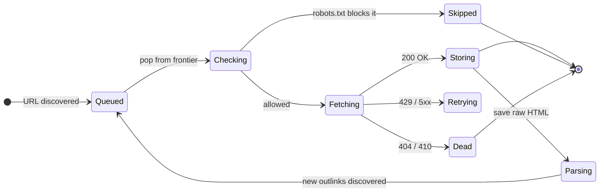

That cycle, run across 450 machines, 58,000 times per second, is the whole product. Everything we add later (priority, dedup, recrawl) is a complication on top of this.

> **Take this with you.** A crawler is a loop: pop a URL, fetch it, parse it, push new URLs back. The interesting engineering is what happens inside each step.

---

## Step 2: Ask the right questions

In a real interview, sit quietly for a couple of minutes. Write down questions that change the design if answered differently.

<details markdown="1">
<summary><b>Show: 5 questions that change the design</b></summary>

1. **What are we crawling?** Just HTML pages? Also images, PDFs, JavaScript-rendered SPAs? *Each one is a different pipeline. Assuming "everything" makes the system 10x bigger than the interviewer intended.*

2. **How fresh must the index be?** Hourly for a news site like CNN? Daily for a blog? Monthly for a dormant page? *The recrawl scheduler can be larger and more complex than the discovery crawler itself.*

3. **How polite must we be?** What is the default per-site request rate? *One stranger's website should never go down because of us. This is the single most load-bearing rule.*

4. **What does the crawler output?** Raw HTML to a blob store? Parsed text pushed to an indexer? *Most candidates skip this and have no plan for what happens after the fetch.*

5. **How big?** Pages per day? Distinct hosts? Storage budget? *5 billion pages per day at 100 KB each is 500 TB per day. If the answer is 500 million pages, the storage problem is 10x smaller.*

A strong candidate also asks: "Are JavaScript-rendered pages in scope?" Rendering is 10x to 100x more expensive than a plain fetch. If yes, treat it as a separate, smaller pipeline.

</details>

---

## Step 3: How big is this thing?

Suppose the interviewer gives you these numbers: 5 billion pages per day, average HTML page size 100 KB compressed, 20 outlinks per page, 50 billion total URLs tracked, 500 million distinct hosts, default politeness of 1 request per host per second.

| What | Number |
|------|--------|
| Fetches/sec sustained | 58,000 |
| Fetches/sec peak | ~150,000 |
| Bandwidth sustained | 5.8 GB/sec |
| Raw HTML/day | 500 TB compressed |
| 30-day hot storage | ~10 PB (after dedup) |
| Frontier metadata | ~5.5 TB across 64 shards |
| Bloom filter for 50B URLs | ~60 GB across 8-16 nodes |
| Fetcher nodes | ~450 |

<details markdown="1">
<summary><b>Show: how the numbers come out</b></summary>

**Fetches per second.**

```
5,000,000,000 / 86,400 sec = 58,000 fetches/sec sustained
Peak 2-3x = ~150,000 fetches/sec
```

**Bandwidth.**

```
58,000 fetches/sec * 100 KB = 5.8 GB/sec sustained
Peak: ~17 GB/sec, roughly 50-150 Gbps across the fleet
```

**Storage.**

```
5B pages/day * 100 KB = 500 TB/day compressed
30 days = 15 PB raw
After deduplicating mirror pages (~30% savings): ~10 PB hot
```

**Frontier metadata.**

```
50B URLs * 110 bytes (URL + small metadata) = ~5.5 TB
Split across 64 shards: ~85 GB per shard. Fits in memory/SSD.
```

**Bloom filter for seen URLs.**

```
50B URLs * 10 bits (for 1% false positive rate)
= 500 Gbit = ~60 GB across 8-16 nodes
```

**Fetcher nodes.**

```
One node handles ~500 concurrent fetches
(500 open connections, each ~1 sec for DNS + TLS + GET + body)

Peak 150,000/sec / 500 per node = 300 nodes
With 50% headroom: ~450 nodes
```

**What the math is telling you.** Storage and bandwidth are large but linear. The hard part is coordination: 450 machines must collectively respect "1 request per second" for each of 500 million different websites. That single constraint drives the sharding scheme.

Also: the Bloom filter for 50 billion URLs only takes 60 GB. Tiny. Bloom filters are magic for this kind of dedup problem.

</details>

---

## Step 4: The smallest thing that works

Forget Google. We are building a crawler for a 10-person research team. One seed list, 1 million pages, one machine.

Three boxes. Nothing else.

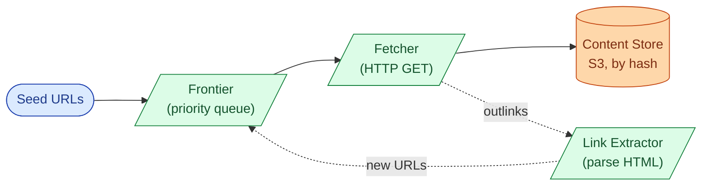

The end-to-end flow for one URL:

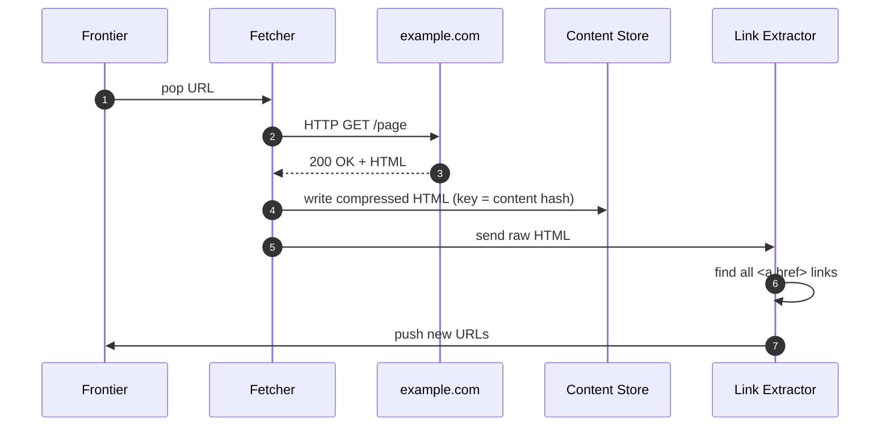

<details markdown="1">
<summary><b>Show: the two core tables</b></summary>

```sql
CREATE TABLE url_meta (
    url_hash         BYTEA PRIMARY KEY,
    url              TEXT NOT NULL,
    host_id          INT NOT NULL,
    first_seen       TIMESTAMPTZ NOT NULL,
    last_fetched     TIMESTAMPTZ,
    last_status      INT,
    content_hash     BYTEA,
    priority         REAL,
    next_refresh_at  TIMESTAMPTZ,
    depth            SMALLINT
);

CREATE TABLE host_meta (
    host_id              INT PRIMARY KEY,
    hostname             TEXT NOT NULL UNIQUE,
    robots_body          TEXT,
    robots_fetched_at    TIMESTAMPTZ,
    crawl_delay_seconds  REAL NOT NULL DEFAULT 1.0,
    health_score         REAL NOT NULL DEFAULT 1.0,
    consecutive_failures INT NOT NULL DEFAULT 0
);
```

</details>

> **Take this with you.** Always start from the smallest thing that works. On one machine this is just a script and two tables. The interesting part of the interview is what breaks when you scale up.

---

## Step 5: The first crack

The research team needs 500 million pages. We add 10 machines. Three things break immediately.

**First: fetchers step on each other.** Two fetchers both grab cnn.com URLs. One hits CNN at 2 req/sec. CNN rate-limits us.

**Second: we re-fetch pages we already have.** Without a seen-URL check, each machine re-discovers the same outlinks and queues them again. The frontier balloons with duplicates.

**Third: the shared Postgres frontier becomes a bottleneck.** 10 machines all polling one table with SELECT FOR UPDATE. Lock contention everywhere.

All three problems share a root cause: there is no coordination. The fix is the same for all three: **split the frontier by hostname**.

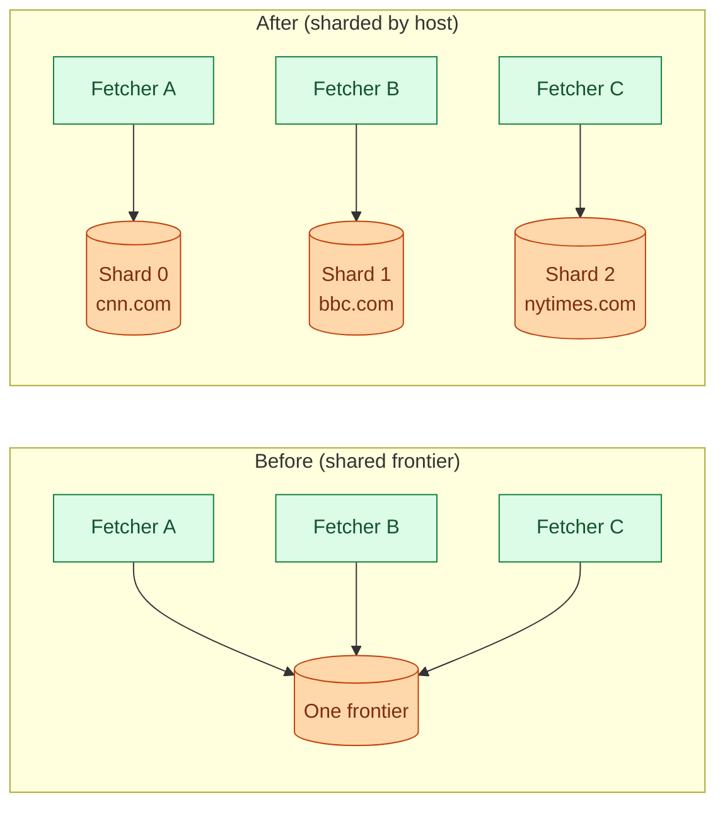

When all URLs for cnn.com live on one shard, that shard owns CNN's rate limit, CNN's robots.txt, and CNN's health score. No coordination needed across shards.

> **Take this with you.** Shard the frontier by hostname, not by URL. Politeness decisions about one site must live on one machine.

---

## Step 6: Build the architecture, one layer at a time

We have a sharded frontier. Now build the system around it. We add one layer at a time and say why.

### v1: just the loop

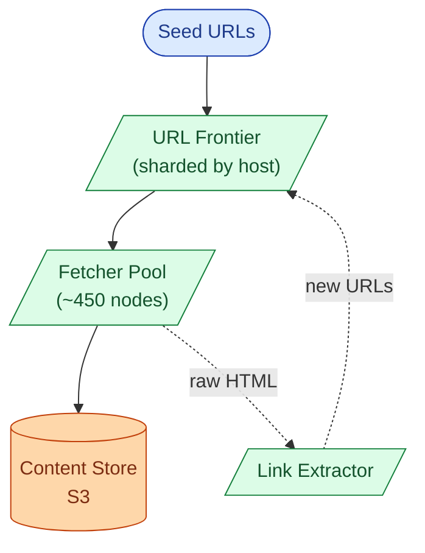

Fine for tens of millions of pages.

### v2: seen-URL check

Without dedup, the frontier grows without bound. Add a **Dedup Index**: a Bloom filter for the hot path, backed by a sharded key-value store for confirmation.

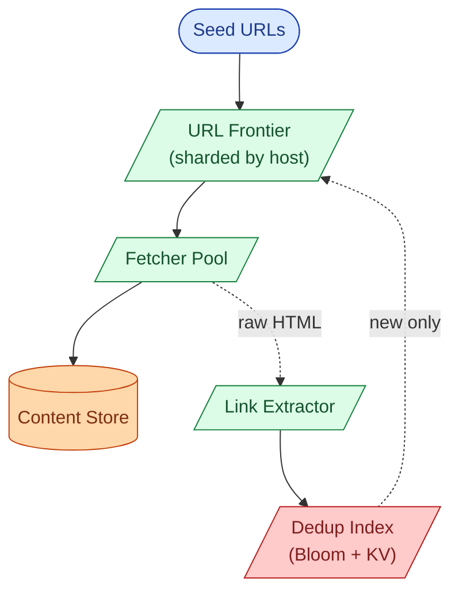

### v3: politeness enforcement

The frontier now needs per-host state: token buckets, robots.txt cache, health scores. Add a **Robots Cache** sidecar and per-host state inside each frontier shard.

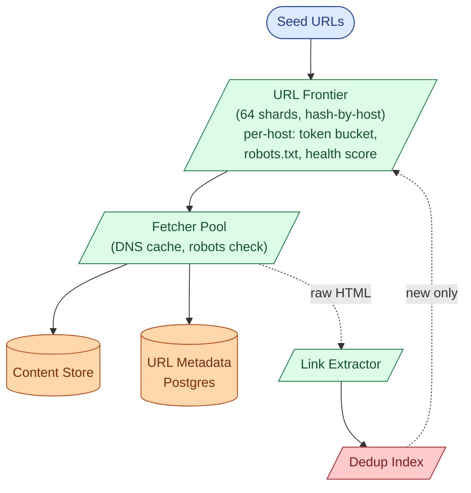

### v4: recrawl, JS rendering, async pipeline

News sites change every hour. SPAs return empty HTML. Add a **Recrawl Scheduler** to re-inject stale URLs, a **JS Render Pipeline** for single-page apps, and Kafka to decouple the stages.

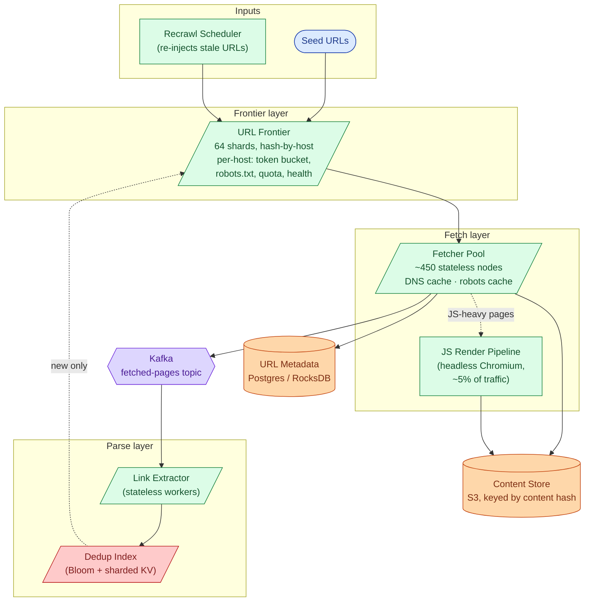

Each box, in one line:

| Box | What it does |
|-----|--------------|
| **URL Frontier** | The brain. Sharded by hostname. Owns token buckets, robots.txt, host health. |
| **Fetcher Pool** | The hands. Stateless. Downloads pages. Caches DNS and robots.txt locally. |
| **JS Render Pipeline** | Headless Chromium for SPA pages. Separate fleet, ~5% of volume. |
| **Kafka** | Decouples fetchers from parsers. Parsing is CPU-heavy; fetching is IO-heavy. |
| **Link Extractor** | Reads HTML, finds all `<a href>` links, cleans them up, sends to dedup. |
| **Dedup Index** | Bloom filter for the fast path. KV store confirms. Only new URLs reach the frontier. |
| **Content Store** | Object storage addressed by content hash. Two URLs with the same content share one blob. |
| **URL Metadata** | Durable record for every URL: last fetched, status, next refresh time, depth. |
| **Recrawl Scheduler** | Scans URL metadata for pages whose refresh time has come. Re-injects them. |

> **Take this with you.** If the Link Extractor fleet dies, the fetched-pages Kafka topic grows but no HTML is lost. Once the fleet recovers, it catches up. Decoupling by stage means each stage can fail and recover independently.

---

## Step 7: One URL, all the way through

Follow a single URL from discovery to having its outlinks queued.

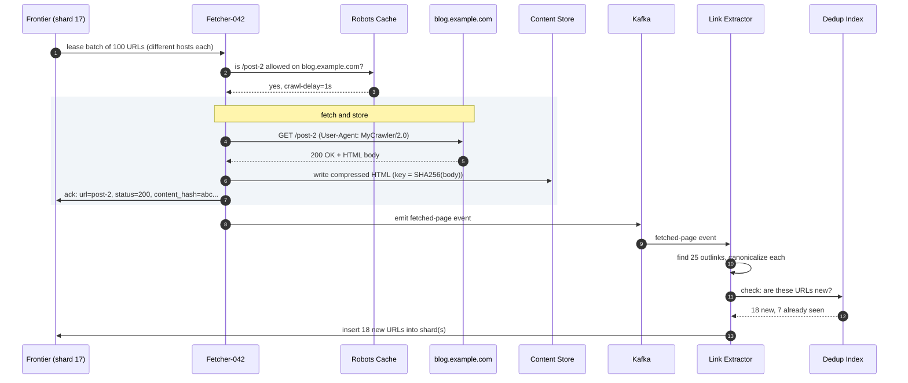

Three things worth pointing at:

1. No two URLs in the lease batch share a host. The fetcher can fire 100 requests in parallel without violating any site's rate limit.
2. The frontier shard owns the token bucket for blog.example.com. It will not hand out another URL for that host until 1 second has passed.
3. The content hash is the storage key. If a second URL later returns the same HTML body, the write is a no-op. Free dedup.

---

## Step 8: Politeness (the constraint that shapes everything)

If your crawler hits cnn.com with 1000 requests per second, three things happen: CNN's site slows down, CNN's ops team blocks your IPs, and CNN files a complaint with your abuse desk.

Politeness is not a nice-to-have. It shapes the entire sharding scheme.

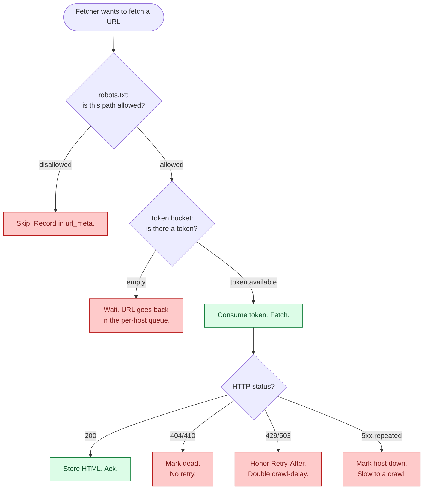

<details markdown="1">
<summary><b>Show: the full politeness ruleset</b></summary>

**robots.txt.** Before fetching any URL on a site, GET `https://site.com/robots.txt`. Cache for 24 hours per host.

```
User-agent: MyCrawler
Disallow: /private/
Crawl-delay: 2
Sitemap: https://site.com/sitemap.xml
```

- `Disallow` means do not fetch that path.
- `Crawl-delay: 2` means wait 2 seconds between requests to this site.
- If robots.txt returns 404, RFC 9309 says "no rules, fetch freely."
- If robots.txt times out or returns 5xx, skip the site until it is readable again.

**Token bucket per host.** Default: 1 request per second. If robots.txt sets `Crawl-delay`, honor that instead.

- Bucket holds 1 token.
- Refills at the configured rate (1 token/sec by default).
- Fetching costs 1 token. If the bucket is empty, the URL waits.

**HTTP status backoff.**

| Status | Action |
|--------|--------|
| 200, 301, 302 | Success. Follow normally. |
| 404 | Record. No retry. |
| 403 | Do not retry for 7 days. |
| 429 | Honor `Retry-After`. Double the per-host delay. |
| 503 | Same as 429. |
| 5xx repeated | Exponential backoff. After 5 failures in 24h, treat host as down. |

**User agent.** Identify yourself:

```
Mozilla/5.0 (compatible; MyCrawler/2.0; +https://example.com/crawler-info)
```

The URL links to a page explaining what your crawler does and how to block it. Missing this is rude and gets you blocked.

</details>

> **Take this with you.** Politeness is why the frontier is sharded by hostname instead of by URL hash. All decisions about one website must live on one machine so rate limits are enforced without cross-shard coordination.

---

## Step 9: Seen-URL dedup (the two-layer approach)

When you have 50 billion known URLs, you cannot check a database on every single outlink discovery. That would be 20 million database lookups per second.

The answer is a two-layer check.

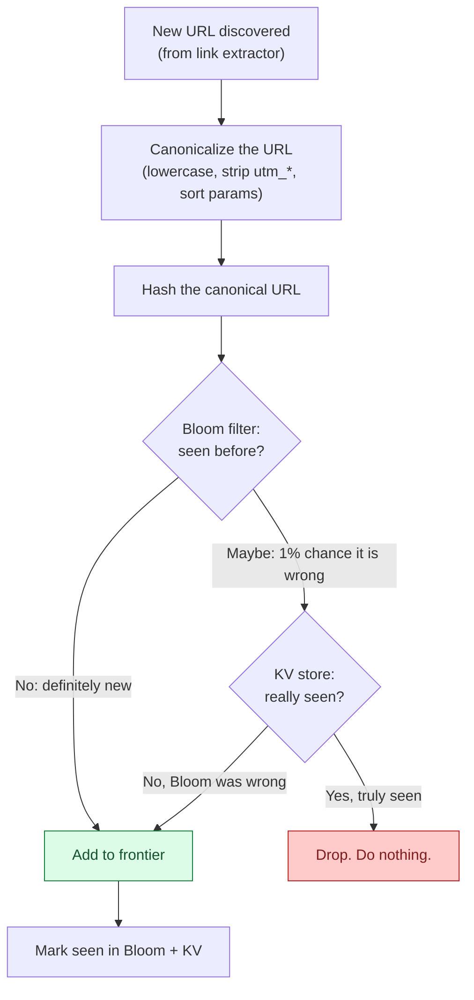

Why two layers? Bloom alone is wrong 1% of the time (false positive: says "seen" when it has not). We cannot afford to drop 1% of genuinely new URLs. So when Bloom says "maybe seen," we do one extra lookup in the KV store. In practice, 99% of checks never reach the KV store.

**Content dedup** is a second, separate check that runs after fetching. Compute `SHA256(page body)`. Two URLs returning the same content write the same blob to S3. The second write is a no-op. The indexer later notices that two `url_meta` rows point to the same `content_hash` and picks one canonical URL to index.

<details markdown="1">
<summary><b>Show: URL canonicalization in code</b></summary>

```python
def canonicalize(raw_url, base_url):
    url = urljoin(base_url, raw_url)
    parsed = urlparse(url)

    scheme = parsed.scheme.lower()
    host = parsed.hostname.lower()
    if host.startswith("www."):
        host = host[4:]

    port = parsed.port
    if (scheme, port) in (("http", 80), ("https", 443)):
        port = None

    path = posixpath.normpath(parsed.path) or "/"

    params = parse_qs(parsed.query)
    for token in ("sid", "PHPSESSID", "jsessionid",
                  "utm_source", "utm_medium", "utm_campaign"):
        params.pop(token, None)
    query = urlencode(sorted(params.items()), doseq=True)

    return urlunparse((scheme, host_with_port(host, port),
                       path, "", query, ""))
```

Session tokens like `PHPSESSID` and tracking params like `utm_source` cause infinite URL explosions. The same page ends up with a different URL for every visitor. Strip them aggressively.

</details>

> **Take this with you.** URL dedup catches 95% of duplicates cheaply, before any fetch. Content dedup catches the rest after fetching. Run both.

---

## Step 10: Recrawl scheduling

Discovery fills the frontier with new URLs. Recrawl fills it with old ones that need refreshing.

CNN publishes 100 articles per day. A dormant personal blog publishes once a year. Recrawling both daily wastes 99% of capacity on the blog and delivers CNN articles an hour late.

The fix is adaptive scheduling: if the content changed since the last fetch, crawl more often. If it did not, back off.

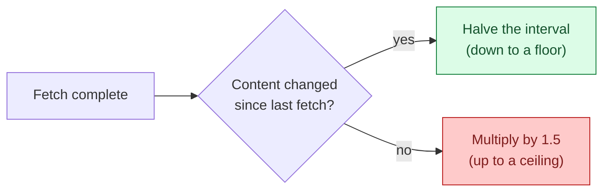

Floors and ceilings by host class:

| Host class | Floor | Ceiling |
|------------|-------|---------|
| News (cnn.com, bbc.com) | 10 minutes | 6 hours |
| Generic | 1 day | 30 days |
| Dormant | 30 days | 90 days |

The Recrawl Scheduler runs continuously, scanning `url_meta` for `next_refresh_at < now()`, and re-injects those URLs into the frontier with a freshness priority boost.

> **Take this with you.** Discovery and recrawl look identical at the frontier. The scheduler just puts URLs back in the queue. The engine does not care how a URL got there.

---

## Follow-up questions

Try answering each in 3 or 4 sentences before opening the solution.

1. **Crawler trap.** A site has a calendar widget linking to `?date=2026-05-25`, `?date=2026-05-26`, and so on for 10,000 years. The frontier fills with junk. How do you detect and stop this without maintaining a list of trap sites?

2. **Soft 404.** A site returns HTTP 200 with a body that says "Page not found." You add it to the index. Later you find every URL on that site returns the same "not found" page. How do you catch this?

3. **JavaScript-rendered pages.** A modern single-page app returns an almost-empty `<div id="root">` and loads everything via JS. The link extractor finds zero links. How does the pipeline handle these?

4. **Recrawl scheduling.** A news site posts 100 articles per day. A dormant blog posts once a year. You want news refreshed within an hour and the blog refreshed monthly. How do you decide each URL's refresh rate without tuning per site?

5. **Frontier persistence.** A frontier shard's machine reboots. There are 5 billion URLs queued in that shard. How do you persist the queue without making every push a synchronous disk write?

6. **Bloom filter race.** Two fetchers in different regions discover the same new URL at the same instant. Both query the dedup service. How do you make sure only one of them adds it to the frontier?

7. **Two URLs, same content.** `example.com/article/123` and `example.com/article/123?utm=email` are the same page. Both got fetched. How does the storage layer notice, and what does the search index see?

8. **A new important domain.** A major news site launches with 1 million pages. At 1 req/sec, it would take 12 days to crawl. How do you go faster without being rude?

9. **Spam farm.** Someone generates 10 million auto-generated low-value pages on cheap domains that interlink. How does the crawler avoid wasting capacity on them?

10. **Geo-distributed targets.** A French news site is hosted in France. Your fetchers are in us-east. Each fetch costs 200ms of round-trip latency. How do you cut the latency without running a full crawler in every region?

---

## Related problems

- **[Rate Limiter (004)](../004-rate-limiter/question.md).** Per-host politeness is a token bucket at huge cardinality. Same patterns, same edge cases.
- **[Distributed Cache (009)](../009-distributed-cache/question.md).** The dedup index, robots.txt cache, and DNS cache all use sharded cache patterns from there.
- **[Typeahead Autocomplete (005)](../005-typeahead-autocomplete/question.md).** Both have a batch pipeline that turns raw input into a serving-side index. Same shape: Kafka spine, stateless workers, periodic compaction.
