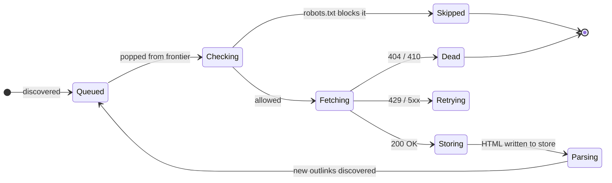
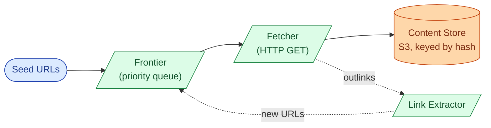
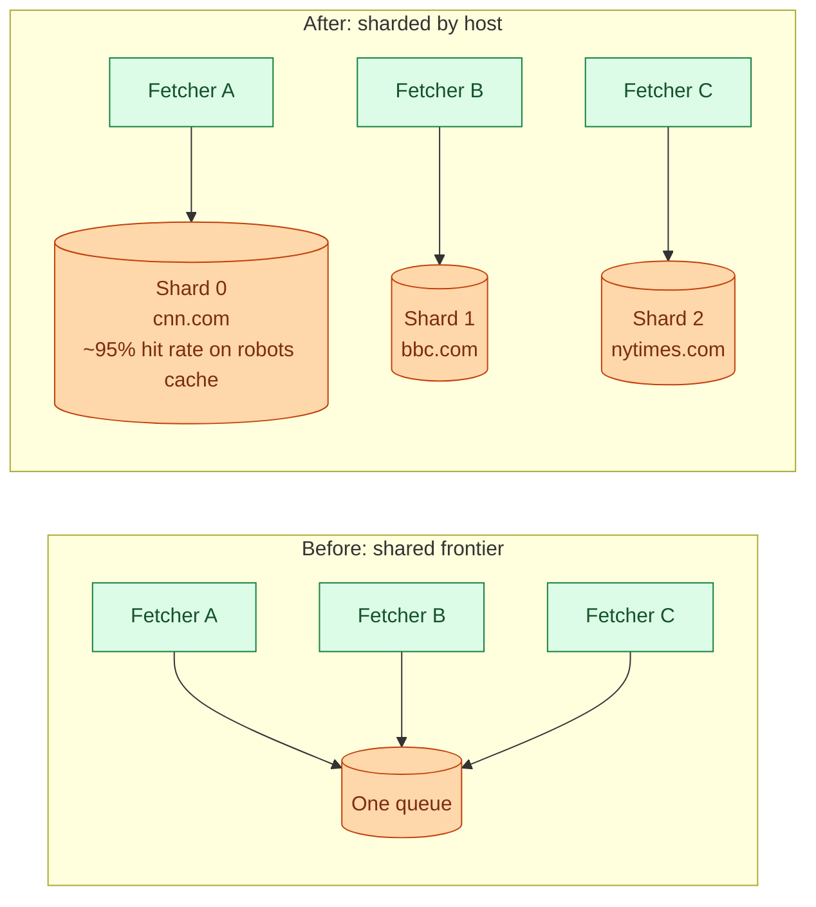
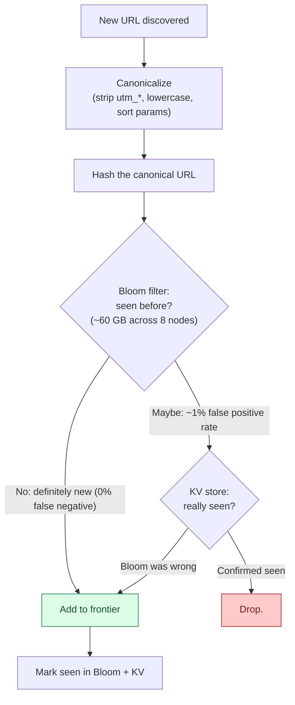
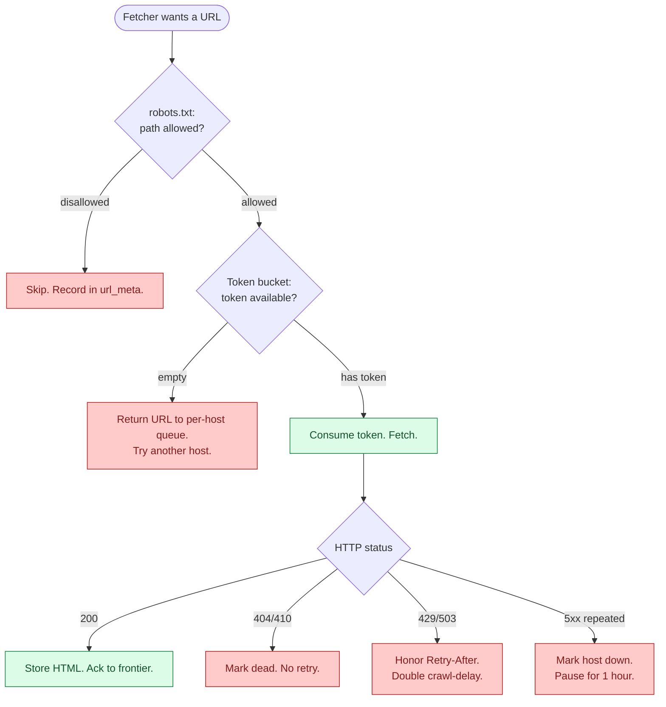
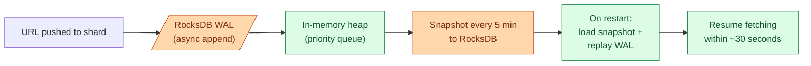
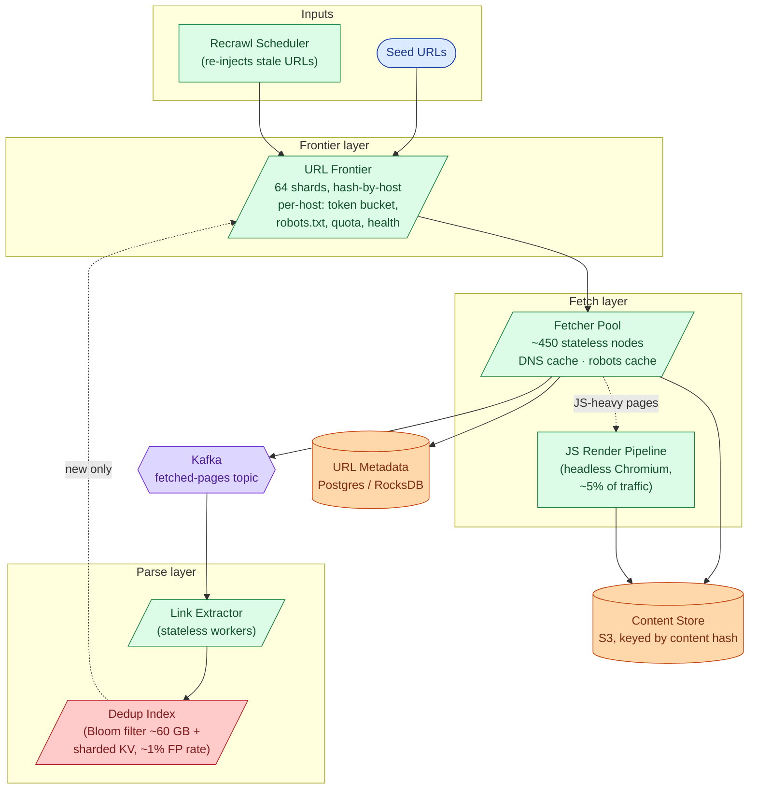
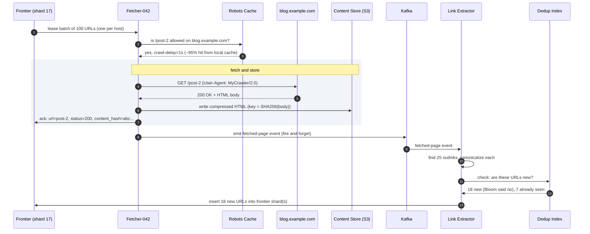
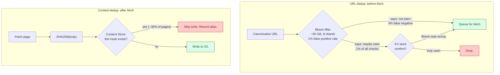

## What we are building

Googlebot fetches roughly 10 billion pages a month. For every page it visits, it reads `robots.txt` to find out what it is allowed to touch, downloads the HTML, extracts every link, deduplicates them against 50 billion previously seen URLs, and pushes the new ones into a queue for future fetching. The cycle repeats forever across 450 machines.

That description sounds simple. The hard parts show up when you try to run it without crashing other people's websites, without fetching the same page a thousand times, and without losing your queue when a machine reboots.

Four problems drive the entire design:

1. **Frontier management.** A to-do list of 50 billion URLs must be ordered, sharded, and kept alive across machine restarts.
2. **Dedup.** Every outlink discovered must be checked against everything already seen, in under a millisecond, without a database round-trip on every check.
3. **Politeness per host.** 450 fetcher nodes must collectively respect "no more than 1 request per second" for each of 500 million different websites, without a central coordinator.
4. **Restart durability.** When a frontier shard reboots, it must resume without re-fetching work that was already done.

---

## The lifecycle of one URL

Every URL goes through a fixed set of states before its outlinks reach the frontier.



That loop, running 58,000 times per second across the fleet, is the whole product. Everything else (priority ordering, dedup, recrawl scheduling) is what happens inside each state transition.

> **Take this with you.** A crawler is a loop: pop a URL, fetch it, parse it, push new URLs back. The interesting engineering is what happens inside each step at scale.

---

## How big this gets

Assume Googlebot-shaped numbers.

| Input | Number |
|-------|--------|
| Pages fetched per day | 5 billion |
| Average page size (compressed HTML) | 100 KB |
| Average outlinks per page | 20 |
| Total known URLs tracked | 50 billion |
| Distinct hosts | 500 million |
| Default politeness per host | 1 request/second |

From those, everything else follows.

<details markdown="1">
<summary><b>Show: the derived numbers</b></summary>

| Metric | Value | How |
|--------|-------|-----|
| Fetches/sec (sustained) | 58,000 | 5B / 86,400 |
| Fetches/sec (peak) | ~150,000 | 2-3x sustained |
| Bandwidth (sustained) | 5.8 GB/sec | 58K × 100 KB |
| Raw HTML per day | 500 TB compressed | 5B × 100 KB |
| 30-day hot storage | ~10 PB | 500 TB/day × 30, minus ~30% content dedup |
| Frontier metadata | ~5.5 TB | 50B URLs × 110 bytes, split across 64 shards |
| Bloom filter (50B URLs, 1% FP rate) | ~60 GB | 50B × 10 bits |
| Fetcher nodes needed | ~450 | 150K peak / 500 concurrent fetches per node |

Two observations from the math:

1. **Storage is large but linear.** 10 PB sounds scary. It is just money and object storage.
2. **The real bottleneck is per-host coordination.** 450 machines must collectively enforce "max 1 req/sec" for 500 million hosts. That single constraint determines the entire sharding scheme.

</details>

> **Take this with you.** The storage and bandwidth numbers are big but tractable. The hard constraint is politeness coordination: all rate-limit decisions for one website must live on one machine.

---

## The smallest version that works

Start with a single machine crawling 1 million pages for a research team.



Two tables carry the state.

| Table | What it holds |
|-------|---------------|
| `url_meta` | Every URL: hash, last fetch status, content hash, next refresh time, depth |
| `host_meta` | Every hostname: robots.txt body, crawl delay, health score, failure count |

<details markdown="1">
<summary><b>Show: the two core tables</b></summary>

```sql
CREATE TABLE url_meta (
    url_hash         BYTEA PRIMARY KEY,
    url              TEXT NOT NULL,
    host_id          INT NOT NULL,
    first_seen       TIMESTAMPTZ NOT NULL,
    last_fetched     TIMESTAMPTZ,
    last_status      INT,
    content_hash     BYTEA,
    priority         REAL,
    next_refresh_at  TIMESTAMPTZ,
    depth            SMALLINT
);

CREATE TABLE host_meta (
    host_id              INT PRIMARY KEY,
    hostname             TEXT NOT NULL UNIQUE,
    robots_body          TEXT,
    robots_fetched_at    TIMESTAMPTZ,
    crawl_delay_seconds  REAL NOT NULL DEFAULT 1.0,
    health_score         REAL NOT NULL DEFAULT 1.0,
    consecutive_failures INT NOT NULL DEFAULT 0
);
```

</details>

This is enough for 1 million pages on a Tuesday. The next question is what breaks first when you add machines.

---

## Decision 1: how do we keep fetchers from stepping on each other?

Add 10 machines. Three problems appear immediately.

- Two fetchers both pop `cnn.com` URLs. Between them they hit CNN at 2 req/sec. CNN rate-limits the crawler.
- Without a seen-URL check, each machine re-discovers the same outlinks. The frontier fills with duplicates.
- With one shared Postgres frontier, 10 machines race on `SELECT FOR UPDATE`. Lock contention everywhere.

All three share a root cause: no coordination. The fix is the same for all three.



When all URLs for `cnn.com` live on one shard, that shard owns CNN's rate limit, CNN's robots.txt, and CNN's per-host token bucket. No cross-shard coordination needed.

The shard key is `hash(hostname) mod 64`. Not hash of the full URL. Hashing by URL scatters the same site across every shard and makes per-host politeness an all-to-all coordination problem.

> **Take this with you.** Shard the frontier by hostname, not by URL. All decisions about one website must live on one machine.

---

## Decision 2: how do we check 50 billion seen URLs fast?

After every fetch, the link extractor discovers 20 outlinks per page. At 58,000 fetches/sec that is 1.16 million URL checks per second. A database roundtrip on every check costs ~10ms each. That is 11,600 seconds of database time every second. It does not work.

The answer is a two-layer check.



A Bloom filter at 1% false positive rate for 50 billion URLs takes 60 GB across 8-16 nodes. It has no false negatives: if the filter says "not seen," the URL is definitely new. The 1% of cases where it says "maybe seen" get a second lookup in a sharded key-value store. In practice, 99% of URL checks never reach the KV store.

Content dedup is a separate second check. After fetching, compute `SHA256(page body)`. Two URLs returning the same HTML write the same blob to object storage. The second write is a no-op. About 30% of crawled pages are mirror duplicates, so this saves roughly 30% of storage for free.

> **Take this with you.** Bloom filter for the hot path, KV store for confirmation. URL dedup catches duplicates before fetching. Content dedup catches the rest after. Run both.

---

## Decision 3: how do we enforce politeness at scale?

Politeness is not optional. If the crawler hits CNN at 1,000 req/sec, CNN's site degrades, CNN's ops team blocks the crawler's IP ranges, and CNN files a complaint. Politeness is the headline non-functional requirement.

Three rules, in order of importance:



<details markdown="1">
<summary><b>Show: the full politeness ruleset</b></summary>

**robots.txt.** Before fetching any URL on a new host, GET `https://site.com/robots.txt`. Cache for 24 hours per host. If robots.txt returns 404, RFC 9309 says "no rules, fetch freely." If it returns 5xx or times out, skip the site until it is readable again.

```
User-agent: MyCrawler
Disallow: /private/
Crawl-delay: 2
Sitemap: https://site.com/sitemap.xml
```

**Token bucket per host.** Default: 1 token/sec. If robots.txt sets `Crawl-delay`, honor that rate instead. The bucket lives on the frontier shard that owns the hostname. `lease_batch` skips URLs whose host has an empty bucket and moves to the next host.

**HTTP status backoff.**

| Status | Action |
|--------|--------|
| 200, 301, 302 | Success. Follow normally. |
| 404 | Record. No retry. |
| 403 | No retry for 7 days. |
| 429 | Honor `Retry-After`. Double the per-host delay. |
| 503 | Same as 429. |
| 5xx × 5 in 24h | Exponential backoff. Treat host as down. |

**User agent.** Identify the crawler honestly:

```
Mozilla/5.0 (compatible; MyCrawler/2.0; +https://example.com/crawler-info)
```

The URL must link to a page explaining what the crawler does and how to opt out. Skipping this gets the crawler blocked.

</details>

> **Take this with you.** Politeness is why the frontier shards by hostname instead of URL hash. All rate-limit decisions for one site must live on one machine, in one token bucket, with no cross-shard calls.

---

## Decision 4: how do we survive a frontier restart?

Each frontier shard holds its priority heap in memory. If the shard reboots, that in-memory queue is gone. At 58,000 fetches/sec, losing even a 5-minute queue means hundreds of thousands of URLs must be re-discovered.

The fix is a write-ahead log plus periodic snapshots.



If the machine crashes between snapshots, the shard may re-discover a few minutes of URLs. That is fine because URL dedup is idempotent: the Bloom filter catches any re-enqueued URL that was already fetched. A small amount of re-work is cheaper than strong durability on every push.

> **Take this with you.** In-memory queue for low-latency pops, async WAL for durability, periodic snapshots for fast restart. URL dedup absorbs the small window of re-work on crash recovery.

---

## The full architecture



Each component, in one sentence:

| Component | Purpose |
|-----------|---------|
| URL Frontier | The brain. 64 shards by hostname. Owns token buckets, robots.txt cache, host health. |
| Fetcher Pool | The hands. 450 stateless nodes. Downloads pages. Caches DNS and robots.txt locally. |
| JS Render Pipeline | Headless Chromium for SPA pages. Separate fleet, ~5% of volume. |
| Kafka | Decouples fetchers (IO-bound) from parsers (CPU-bound). Both can fail and recover independently. |
| Link Extractor | Reads HTML, finds all `<a href>` links, canonicalizes, sends to dedup. |
| Dedup Index | Bloom filter for the fast path (~60 GB, 1% false positive rate). KV store confirms. |
| Content Store | Object storage keyed by `SHA256(body)`. Two URLs with the same HTML share one blob. |
| URL Metadata | Durable record for every URL: last fetch, status, content hash, next refresh time. |
| Recrawl Scheduler | Scans `url_meta` for pages whose refresh time has passed. Re-injects them into the frontier. |

---

## Walk: one URL, all the way through



Three things to notice:

1. No two URLs in the lease batch share a host. The fetcher fires 100 parallel requests without violating any rate limit.
2. The frontier shard owns the token bucket for `blog.example.com`. It will not hand out another URL for that host until 1 second has passed.
3. The content hash is the storage key. A second URL returning the same HTML writes nothing new.

---

## The deep problem: dedup at 50 billion URLs

URL dedup is the hidden chokepoint. The Bloom filter at 1% false positive rate is 60 GB. That sounds manageable. The hard parts are building and maintaining it correctly.



Three subtle problems:

**Bloom filter false positive drift.** As the URL count grows past 50 billion, the false positive rate climbs above 1%. A nightly rebuild from the KV store restores the original bit density.

**Race between two fetchers.** Two machines discover the same new URL at the same instant. Both route to the same Bloom shard (the URL hash deterministically picks the shard). The shard serializes the check-and-add atomically. Only one wins. No inter-machine race is possible if routing is deterministic.

**Canonicalization gaps.** `example.com/article/123?utm_source=email` and `example.com/article/123` are the same page. If canonicalization misses the tracking param, both get fetched. The content hash catches it at the storage layer: both write the same key, the second write is a no-op, and the indexer picks the canonical URL by inlink count.

> **Take this with you.** URL dedup with a Bloom filter eliminates 99% of duplicate checks with zero network cost. Content dedup eliminates the rest for free at write time. The 1% false positive rate is a feature, not a bug: it is tunable and acceptable.

---

## Follow-up questions

Try answering each in 3 or 4 sentences before opening the solution.

1. **Crawler trap.** A site has a calendar widget linking to `?date=2026-05-25`, `?date=2026-05-26`, and so on for 10,000 years. The frontier fills with junk. How do you detect and stop this without maintaining a list of trap sites?

2. **Soft 404.** A site returns HTTP 200 with a body that says "Page not found." You add it to the index. Later you find every URL on that site returns the same "not found" page. How do you catch this?

3. **JavaScript-rendered pages.** A modern single-page app returns an almost-empty `<div id="root">` and loads everything via JS. The link extractor finds zero links. How does the pipeline handle these?

4. **Recrawl scheduling.** A news site posts 100 articles per day. A dormant blog posts once a year. You want news refreshed within an hour and the blog refreshed monthly. How do you decide each URL's refresh rate without tuning per site?

5. **Frontier persistence.** A frontier shard's machine reboots. There are 5 billion URLs queued in that shard. How do you persist the queue without making every push a synchronous disk write?

6. **Bloom filter race.** Two fetchers in different regions discover the same new URL at the same instant. Both query the dedup service. How do you make sure only one of them adds it to the frontier?

7. **Two URLs, same content.** `example.com/article/123` and `example.com/article/123?utm=email` are the same page. Both got fetched. How does the storage layer notice, and what does the search index see?

8. **A new important domain.** A major news site launches with 1 million pages. At 1 req/sec, it would take 12 days to crawl. How do you go faster without being rude?

9. **Spam farm.** Someone generates 10 million auto-generated low-value pages on cheap domains that interlink. How does the crawler avoid wasting capacity on them?

10. **Geo-distributed targets.** A French news site is hosted in France. Your fetchers are in us-east. Each fetch costs 200ms of round-trip latency. How do you cut the latency without running a full crawler in every region?

---

## Related problems

- **[Rate Limiter (004)](../004-rate-limiter/question.md).** Per-host politeness is a token bucket at huge cardinality. Same patterns, same edge cases.
- **[Distributed Cache (009)](../009-distributed-cache/question.md).** The dedup index, robots.txt cache, and DNS cache all use sharded cache patterns from there.
- **[Typeahead Autocomplete (005)](../005-typeahead-autocomplete/question.md).** Both have a batch pipeline that turns raw input into a serving-side index. Same shape: Kafka spine, stateless workers, periodic compaction.
