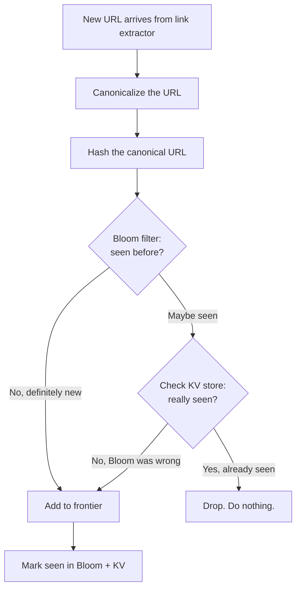
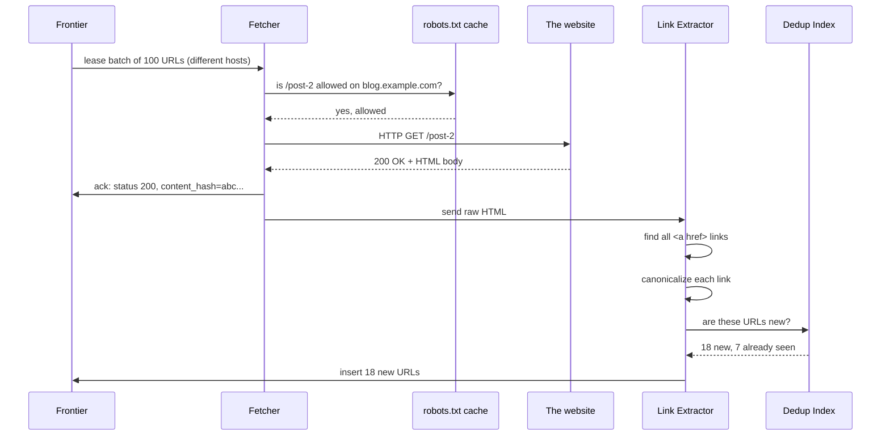

## The scene

You sit down. The interviewer pulls up a blank whiteboard tab. They type one line.

> *"Design a web crawler. Something like Googlebot. Walk me through it."*

Then they wait.

Most people start by drawing a queue and a pool of workers. That gets you the wrong answer. The hard parts of a web crawler are not the queue. They are:

- Being polite to websites so they do not block you.
- Not crawling the same page twice when you have billions of pages.
- Splitting work across hundreds of machines without them stepping on each other.

We will walk this step by step. At each step we will name what breaks first, then add the smallest fix that solves it.

A few words you will see a lot:

- **Crawler.** A program that visits web pages and saves them.
- **Frontier.** The to-do list of URLs we still need to fetch. Think of it as a giant inbox.
- **Fetcher.** A worker that does the actual HTTP GET to download a page.
- **Politeness.** Rules that stop us from hammering one website too hard.
- **robots.txt.** A small file at `https://site.com/robots.txt` where the site owner tells crawlers what they may and may not fetch.
- **Bloom filter.** A tiny memory structure that quickly tells you if you have probably seen a URL before. Fast but allowed to be wrong sometimes (false positives).
- **Canonicalize.** Clean up a URL so different forms of the same URL look identical.

---

## Step 1: Ask the right questions

Before you draw anything, sit for five minutes. Write down questions you would ask the interviewer.

A good answer here is not "20 questions." It is the handful of questions that change the design if answered differently.

<details markdown="1">
<summary><b>Show: 8 questions that matter</b></summary>

1. **What are we crawling?** Just HTML pages? Also images, PDFs, videos? Also pages that need JavaScript to render? *(Each one is a different pipeline. If you assume "everything" you will design a system 10x bigger than what they wanted.)*

2. **Where do we start?** From a seed list? From sitemaps? Are we adding to an existing crawl, or starting from zero? *(Real crawlers always have an existing list. Starting from scratch is a different problem.)*

3. **How fresh must the index be?** Hourly for news? Daily for blogs? Monthly for dormant pages? *(The recrawl scheduler can be bigger than the main crawler.)*

4. **How polite must we be?** What is the default per-site rate? *(One stranger's website should never go down because of us. This is the most load-bearing rule.)*

5. **What does the crawler output?** Raw HTML to a blob store? Parsed text to an indexer? *(Most candidates skip this and have no plan for what happens after the fetch.)*

6. **How big?** Pages per day? Hosts? Bandwidth? Storage budget? *(5 billion pages/day at 100KB each is 500TB/day. If the answer is 1 billion, the storage problem is 5x smaller.)*

7. **JavaScript rendering?** Headless browser, or only static HTML? *(Rendering is 10x to 100x more expensive than a plain fetch. Treat it as a smaller, separate pipeline.)*

8. **Spam and traps?** How do we deal with calendar widgets that link to the year 9999? Spam farms? Fake "page not found" pages? *(The web is adversarial. The interviewer wants to see if you know that.)*

If you only ask "how many pages per day," you skipped politeness, scope, and freshness. Those three things together are most of the design's complexity.

</details>

---

## Step 2: How big is this thing?

Suppose the interviewer gives you these numbers.

- Crawl target: **5 billion pages per day**
- Average HTML page size: 100KB compressed
- Average outlinks per page: 20
- Total URLs the system knows about: 50 billion
- Distinct hosts (websites): 500 million
- Default politeness: **1 request per host per second**
- Storage: 30 days hot, then archived

Try to work out these numbers yourself before peeking.

1. Fetches per second (steady, and peak)
2. Bandwidth at peak
3. Storage per day, and for 30 days
4. Memory for the "seen URLs" check
5. How many fetcher machines do we need?

<details markdown="1">
<summary><b>Show: the math</b></summary>

**Fetches per second.**

```
5,000,000,000 fetches / 86,400 seconds = 58,000 fetches/sec sustained
Peak is 2-3x that = ~150,000 fetches/sec peak
```

**Bandwidth.**

```
58,000 fetches/sec * 100KB = 5.8 GB/sec sustained
Peak: ~17 GB/sec
That is roughly 50-150 Gbps of inbound bandwidth across the fleet.
```

**Storage for raw HTML.**

```
58,000/sec * 86,400 sec = 5B pages/day
5B * 100KB = 500 TB/day of compressed HTML
30 days = 15 PB
After we dedupe identical pages, save ~30%, so ~10 PB hot.
```

**Frontier (the to-do list).**

```
50 billion URLs * ~110 bytes each (URL + small metadata) = ~5.5 TB
Split across, say, 64 shards = ~85 GB per shard. Fits easily.
```

**Seen-URL Bloom filter.**

```
50 billion URLs * 10 bits each (for ~1% false positive rate)
= 500 Gbit = ~60 GB
Sits in memory across a small cluster of nodes.
```

**Fetcher machines.**

```
One fetcher node handles ~500 fetches/sec (500 open connections,
each takes ~1 second for DNS + TLS + GET + body).

Peak 150,000/sec / 500 per node = 300 nodes
Add 50% headroom: ~450 nodes.
```

**What the math is telling you.**

Storage is large but manageable. Bandwidth is large but linear. The hard part is **coordination**: 450 machines must crawl 5 billion pages per day while collectively respecting "1 request per second" for each of 500 million different websites. That is the real puzzle.

Also: the Bloom filter for 50 billion URLs only takes 60 GB. Tiny. Bloom filters are magic for this kind of problem.

</details>

---

## Step 3: The frontier is a priority list, not a FIFO

A crawler walks the web by following links. Page A links to page B, B links to C, and so on. It is a giant graph.

If you do plain BFS (breadth-first search) you visit links in the order you found them. That sounds fine. It is not. Three problems:

1. **The web is infinite.** A calendar widget links to `?date=2026-05-25`, `?date=2026-05-26`, and so on forever. Plain BFS would happily follow all of them.
2. **Not all pages are equal.** The CNN homepage matters more than `someguy.geocities.com/page9`. You want to spend disk on the useful ones.
3. **Politeness forces you to interleave.** You cannot fetch 1000 URLs from one site in a row. You have to spread requests across many sites.

So what should the frontier actually look like?

<details markdown="1">
<summary><b>Show: the priority frontier and two-layer dedup</b></summary>

**The frontier is a priority queue.** Each URL has a score made from:

- **Importance.** Pages with many incoming links score higher (PageRank-style).
- **Freshness.** News pages get pulled up so they get recrawled soon.
- **Penalties.** URLs that look like traps (calendars, session tokens) get pushed way down.

URLs come out highest-priority-first, but only if politeness allows (more on that in Step 5).

**Dedup happens in two layers.**

Layer 1: **URL dedup.** Before adding a URL to the frontier, ask "have we seen this URL before?"

```
URL arrives  ->  canonicalize (clean it up)
            ->  hash the cleaned URL
            ->  ask Bloom filter
            ->  if Bloom says "probably seen", confirm in the KV store
            ->  if truly new, add to frontier
```

Layer 2: **Content dedup.** After fetching, hash the actual page content. If two URLs return the same content (mirror sites, duplicate templates), point them at the same stored blob.

**Depth limit.** Each URL carries a "how many hops from the seed" counter. Past depth 20, almost everything is junk (a calendar, a session-token mess). Stop there.

**Why a Bloom filter at all?** Because checking "have we seen 50 billion URLs" against a real database for every new URL would be too slow and too expensive. The Bloom filter is small, in-memory, and very fast. It can be wrong sometimes (says "seen" when it has not), but then we just do one extra check in the KV store. False positive rate of 1% is fine.

</details>

Here is the dedup decision drawn as a flowchart.



> Why two layers? Bloom alone is fast but says "maybe seen" for 1% of new URLs. We do not want to drop new URLs by mistake. So when Bloom says "maybe", we check the truth store. Most checks never reach the KV store, so the system stays fast.

---

## Step 4: Draw the system

You know what data the frontier holds. Now draw the components that move URLs through it.

Try to fill in the missing pieces below. Five boxes are missing. Think about: where the to-do URLs live, who downloads pages, where the raw HTML is stored, who finds new links in a page, and who checks if a URL is a duplicate.

```
                seed URLs              outlinks from fetched pages
                    |                              |
                    v                              |
            +------------------+                   |
            |   [ ? ]          | <-----------------+
            |  (the to-do list |
            |   of URLs)       |
            +--------+---------+
                     | pop next batch (only URLs we are allowed to fetch now)
                     v
            +------------------+
            |   [ ? ]          |
            |  (downloads      |
            |   pages over     |
            |   HTTP)          |
            +--------+---------+
                     | raw HTML
                     |
          +----------+----------+
          v                     v
   +-------------+        +-------------+
   |   [ ? ]     |        |   [ ? ]     |
   | (saves the  |        | (reads the  |
   |  raw page)  |        |  HTML, pulls|
   |             |        |  out links) |
   +-------------+        +------+------+
                                 |
                                 v
                          +-------------+
                          |   [ ? ]     |
                          | (have we    |
                          |  seen this  |
                          |  URL?)      |
                          +-------------+
```

<details markdown="1">
<summary><b>Show: the full architecture</b></summary>

```
                seed URLs              outlinks from fetched pages
                    |                              |
                    v                              |
            +------------------+                   |
            |   URL Frontier   | <-----------------+
            |  priority queue  |
            |  sharded by host |
            +--------+---------+
                     | lease batch of URLs (politeness gate)
                     v
            +------------------+
            |  Fetcher Pool    |  ~450 stateless nodes
            |  HTTP/HTTPS      |  DNS cache, robots.txt cache,
            |  500 connections |  honors crawl-delay
            |  per node        |
            +--------+---------+
                     | raw HTML + status
                     |
          +----------+----------+
          v                     v
   +-------------+        +-------------+
   | Content     |        | Link        |
   | Store       |        | Extractor   |
   | (S3/GCS,    |        | (parse HTML,|
   |  keyed by   |        |  find links,|
   |  content    |        |  clean them |
   |  hash)      |        |  up)        |
   +-------------+        +------+------+
                                 | candidate URLs
                                 v
                          +-------------+
                          | Dedup Index |  Bloom filter first,
                          | (seen URLs) |  then sharded KV store
                          +------+------+
                                 | truly new URLs
                                 v
                         (back to URL Frontier)

  Side flows:
    - robots.txt cache: refreshed every 24 hours per host.
    - DNS cache: refreshed on TTL.
    - Recrawl scheduler: re-injects URLs that are due for a refresh.
    - Trap detector: scans for suspicious patterns, downgrades them.
```

What each piece does, in one line:

- **URL Frontier.** The brain. Priority queue of URLs, split across many shards so politeness for each host is a single-shard decision.
- **Fetcher Pool.** The dumb hands. Stateless workers that download pages. DNS and robots.txt are cached locally on each fetcher.
- **Content Store.** Where raw HTML lives. Object storage (S3, GCS) keyed by the hash of the page content. Two URLs serving the same page share one blob.
- **Link Extractor.** Reads the HTML, finds `<a href>` links, cleans them up, sends candidates to dedup.
- **Dedup Index.** Bloom filter says "probably new" or "probably seen". KV store confirms.

> Why is Link Extractor separate from Fetcher? Two reasons. First, fetching is mostly waiting on network (IO-bound), parsing is CPU-heavy work. Mixing them wastes both kinds of capacity. Second, if the parser dies, we still have the raw HTML safely saved. We can reparse later.

</details>

---

## Step 5: Politeness (the rule most candidates skip)

If your crawler hits cnn.com with 1000 requests per second, three things happen:

1. CNN's site slows down or crashes.
2. CNN's ops team blocks your IPs.
3. CNN files a complaint with your abuse desk.

Politeness is not a nice-to-have. It is the single biggest constraint that shapes the whole design.

Try to guess the rules before peeking. What should the crawler do before fetching a page? How does it stay under the per-site rate limit?

<details markdown="1">
<summary><b>Show: the politeness rules</b></summary>

**robots.txt.**

Before fetching any URL on a site, GET `https://site.com/robots.txt`. Cache the result for 24 hours per host.

```
User-agent: MyCrawler
Disallow: /private/
Crawl-delay: 2
Sitemap: https://site.com/sitemap.xml
```

- `Disallow` means do not fetch this path.
- `Crawl-delay: 2` means wait 2 seconds between requests to this site.
- If robots.txt returns 404, RFC 9309 says "no rules, fetch freely."
- If robots.txt times out or returns 5xx, skip the site until it is readable again. Safe default.

**Per-host rate limit.**

Default: 1 request per second per host. If the site's robots.txt sets `Crawl-delay`, honor that instead.

Implemented as a **token bucket** per host:

- The bucket holds 1 token.
- The bucket refills at the configured rate (e.g. 1 token/sec).
- To fetch a URL on host H, the fetcher consumes a token from H's bucket. If empty, the URL waits.

> Why one fetcher per host? Because if you hit cnn.com with 1000 requests/sec from 100 different fetchers, CNN will block you. Politeness means staying under the per-site rate limit. The simplest way to enforce that is: all decisions about CNN live on one machine. We achieve this by sharding the frontier by hostname (Step 6).

**HTTP status backoff.**

| Status | What to do |
|--------|------------|
| 200, 301, 302 | Success. Follow normally. |
| 404 | Record. Do not retry. |
| 403 | Disallowed. Do not retry for 7 days. |
| 429 (Too Many Requests) | Honor `Retry-After`. Double the per-host delay. |
| 503 (Service Unavailable) | Same as 429. |
| Repeated 5xx | Exponential backoff. After 5 failures in 24h, treat the host as down. |
| Connection timeout | Lower the host's "health score". If it drops too low, slow down further. |

**User agent.**

Identify yourself:

```
Mozilla/5.0 (compatible; MyCrawler/2.0; +https://example.com/crawler-info)
```

The URL leads to a page explaining what your crawler does and how to block it. Webmasters expect this. Missing it is rude and gets you blocked.

**Bandwidth caps.**

Per-host: do not pull more than X MB per day from one host without permission. Stops you from accidentally mirroring someone's entire site.

</details>

---

## Step 6: How do 450 machines share the work?

You have 450 fetcher nodes. They share a 50-billion-URL frontier. They must collectively crawl 5 billion pages per day **without duplicating work** and **without violating per-host rate limits**.

How is the work divided? Three options. For each, ask: what happens if a node dies? What if one host has 50M URLs in the frontier? How is per-host politeness enforced?

<details markdown="1">
<summary><b>Show: why hash-by-host wins</b></summary>

**Option A: one shared queue, all 450 fetchers pull from it.**

Pros: simple. Cons: politeness is broken. Two fetchers can grab two URLs from cnn.com at the same instant. You would need every fetcher to coordinate with every other fetcher ("are you about to fetch CNN? then I won't"). 450 nodes * 449 others = thousands of conversations. Does not scale.

**Option B: hash by URL.**

Each URL goes to a shard based on `hash(url) mod num_shards`. Pros: even spread. Cons: URLs from cnn.com land on different shards. Same problem as A. The politeness state for cnn.com is split across many shards. Coordination nightmare.

**Option C: hash by host. This is the answer.**

```
shard_id = hash(hostname) mod num_shards
```

All URLs for `cnn.com` live on **one** shard. That shard owns:

- The priority queue for CNN's URLs.
- CNN's token bucket and rate-limit state.
- CNN's robots.txt cache.
- CNN's health score.

When a fetcher needs work, it asks a shard for a batch of URLs that are **safe to fetch right now** (politeness satisfied). The shard picks N URLs across N different hosts that all have free tokens. Hands them to the fetcher. Fetcher does the IO. Returns results. Shard updates state.

This is the standard pattern. Almost every large crawler is structured this way.

**What if a shard dies?**

Replicate each shard (Raft, or primary + warm standby). On failover, rebuild the in-memory queue from disk. Hosts on that shard pause for a minute, then resume.

**What if a fetcher dies mid-batch?**

Use a **lease**. Fetcher gets URLs with a 60-second lease. If not acknowledged within 60 seconds, URLs go back to the queue.

**What about a hot host (50M URLs from one site)?**

- Cap the per-host pop rate. Even if the bucket is full, never hand out more than 10 URLs/sec for one host.
- Spill the host's URLs to secondary storage. Only the top-priority ones stay hot in memory.
- For truly huge hosts (Wikipedia, GitHub), coordinate with the site owners and use their sitemaps.

</details>

Here is the journey of one URL drawn as a sequence diagram.



---

## Step 7: Read the full solution

You have walked through the four hard parts:

1. **Priority frontier.** Not plain BFS. URLs are scored by importance, freshness, and trap penalties.
2. **Two-layer dedup.** URL dedup with Bloom + KV. Content dedup by hashing the body.
3. **Politeness.** robots.txt, per-host token buckets, status code backoff, user agent.
4. **Host-sharded coordination.** Hash by hostname so each host's politeness state is on one machine.

The solution covers the rest: data models, recrawl scheduling, JavaScript rendering, trap detection, multi-region crawling, and what breaks on day two.

---

## Follow-up questions

Try to answer each in 3 or 4 sentences before opening the solution.

1. **Crawler trap.** A site has a calendar widget that links to `?date=2026-05-25`, `?date=2026-05-26`, and so on for 10,000 years. Your crawler dutifully follows every link and the frontier fills with junk. How do you detect and stop this without hardcoding a list of trap sites?

2. **Soft 404.** A site returns HTTP 200 with a body that says "Page not found." You add it to your index. Later you find every URL on that site returns the same "not found" page. How do you catch this?

3. **JavaScript-rendered pages.** A modern single-page app returns an almost-empty `<div id="root">` and loads everything via JS. The link extractor finds zero links. How does the pipeline handle these?

4. **Recrawl scheduling.** A news site posts 100 articles per day. A dormant blog posts once a year. You want news refreshed within an hour and the blog refreshed monthly. How do you decide each URL's refresh rate without tuning per site?

5. **Frontier persistence.** A frontier shard's machine reboots. There are 5 billion URLs queued in that shard. How do you persist the queue without making every push a synchronous disk write?

6. **Bloom filter race.** Two fetchers in different regions discover the same new URL at the same instant. Both query the dedup service. How do you make sure only one of them adds it to the frontier?

7. **Two URLs, same content.** `example.com/article/123` and `example.com/article/123?utm=email` are the same page. Both got fetched. How does the storage layer notice, and what does the search index see?

8. **A new important domain.** A major news site launches with 1 million pages. At 1 req/sec, it would take 12 days to crawl. How do you go faster without being rude?

9. **Spam farm.** Someone generates 10 million auto-generated low-value pages on cheap domains that interlink. How does the crawler avoid wasting capacity on them?

10. **Geo-distributed targets.** A French news site is hosted in France. Your fetchers are in us-east. Each fetch costs 200ms of round-trip latency. How do you cut the latency without running a full crawler in every region?

---

## Related problems

- **[Rate Limiter (004)](../004-rate-limiter/question.md).** Per-host politeness is a token bucket at huge cardinality. Same patterns, same edge cases.
- **[Distributed Cache (009)](../009-distributed-cache/question.md).** The dedup index, robots.txt cache, and DNS cache all use sharded cache patterns from there.
- **[Typeahead Autocomplete (005)](../005-typeahead-autocomplete/question.md).** Both have a batch pipeline that turns raw input into a serving-side index. Same shape: Kafka spine, stateless workers, periodic compaction.
