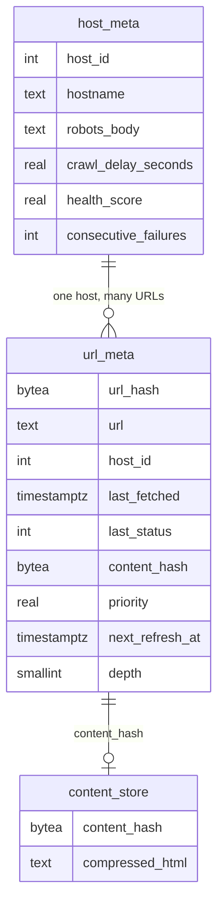
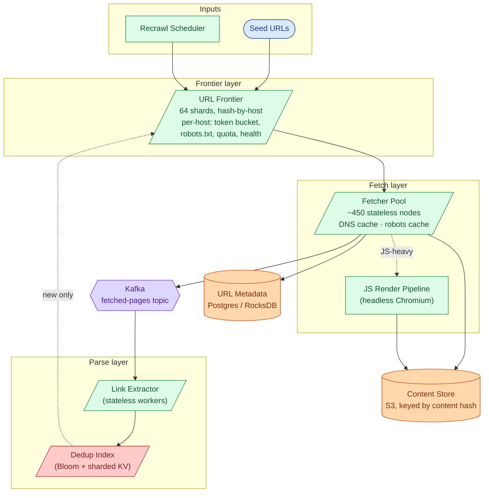
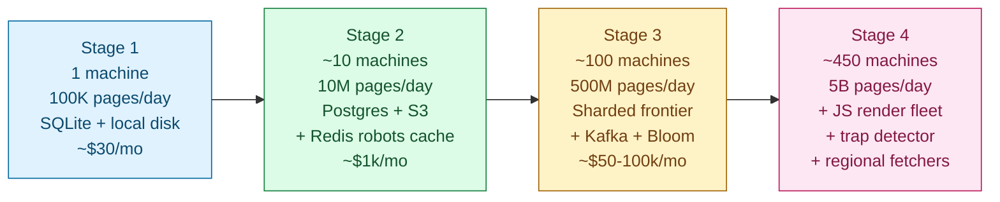

## Solution: Design a Web Crawler (Googlebot)

### The short version

A web crawler is a graph walker. It pulls a URL off a to-do list (the frontier), downloads the page, finds the links inside, cleans them up, checks if they are new, and adds new ones back to the list. Repeat forever.

The hard parts are not the queue:

- **Politeness.** Never crash another person's website. One stranger should never get hurt by your crawler.
- **Dedup.** With 50 billion URLs, you cannot afford to fetch the same page twice. A Bloom filter handles the hot path. A key-value store confirms.
- **Coordination.** 450 machines must work together without stepping on each other. The trick: split the frontier by hostname so all decisions about one site live on one machine.
- **Recrawl.** News sites change every hour. Old blogs change once a year. A separate scheduler decides when to revisit each URL.

The throughput numbers are large but tractable. The real complexity is etiquette and coordination, not raw QPS.

---

### 1. The two questions that matter most

**What are we crawling?** HTML only? Or also JS-rendered SPAs, images, PDFs? Each is a separate pipeline. Assuming "everything" makes the design 10x bigger than intended.

**How fresh must the index be?** A crawler that promises hourly freshness for news needs a recrawl scheduler that is larger and more complex than the discovery crawler itself.

Everything else (politeness detail, JS rendering, output format) follows from those two answers.

---

### 2. The math, in plain numbers

| What | Number |
|------|--------|
| Fetches/sec sustained | 58,000 |
| Fetches/sec peak | ~150,000 |
| Bandwidth sustained | 5.8 GB/sec |
| Raw HTML/day | 500 TB compressed |
| 30-day hot storage | ~10 PB after dedup |
| Frontier metadata | ~5.5 TB across 64 shards |
| Bloom filter for 50B URLs | ~60 GB across 8-16 nodes |
| Fetcher nodes | ~450 |
| Concurrent host slots active | ~58,000 of 500M known hosts |

The headline observation: the bottleneck is not storage or CPU. It is per-host politeness coordination. That single constraint drives the sharding scheme. Hash by host so all decisions about one website happen on one shard.

---

### 3. Internal APIs (between subsystems)

The crawler does not face end users. The APIs that matter are between its own pieces.

**Frontier to Fetcher: lease a batch.**

```
POST /frontier/{shard_id}/lease_batch
{
  "fetcher_id": "fetcher-042",
  "batch_size": 100,
  "lease_seconds": 60
}

Response:
{
  "lease_id": "L-9871234",
  "urls": [
    { "url": "https://example.com/a", "host": "example.com",
      "priority": 0.81, "depth": 3 },
    ...
  ],
  "expires_at": "..."
}
```

Two load-bearing details. No two URLs in the batch share a host, so the fetcher fires 100 requests in parallel without violating any rate limit. The **lease** means: if the fetcher does not call back in 60 seconds, the URLs go back into the queue. Prevents lost work when a node dies.

**Fetcher to Frontier: acknowledge results.**

```
POST /frontier/{shard_id}/ack
{
  "lease_id": "L-9871234",
  "results": [
    { "url": "...", "status": 200, "content_hash": "sha256:...", "fetched_at": "..." },
    { "url": "...", "status": 429, "retry_after_seconds": 600 },
    { "url": "...", "status": 0, "error": "dns_timeout" }
  ]
}
```

Each result updates the host health score, the next-allowed-fetch timestamp, and the URL record in `url_meta`.

**Link Extractor to Dedup Index: check and add.**

```
POST /dedup/check_and_add
{ "candidates": [{ "url": "...", "parent_url": "...", "depth": 4 }, ...] }

Response:
{ "new_urls": [ ... ] }   # only URLs not seen before
```

The service does a Bloom filter check, then a KV lookup for the ones Bloom flagged as "maybe seen." Only truly-new ones reach the frontier.

---

### 4. The data model

Two main tables. One blob store. Plus in-memory state on the frontier shards.



<details markdown="1">
<summary><b>Show: the full SQL</b></summary>

```sql
CREATE TABLE host_meta (
    host_id              INT PRIMARY KEY,
    hostname             TEXT NOT NULL UNIQUE,
    robots_body          TEXT,
    robots_fetched_at    TIMESTAMPTZ,
    crawl_delay_seconds  REAL NOT NULL DEFAULT 1.0,
    health_score         REAL NOT NULL DEFAULT 1.0,
    last_fetched_at      TIMESTAMPTZ,
    consecutive_failures INT NOT NULL DEFAULT 0,
    daily_quota_used     INT NOT NULL DEFAULT 0,
    daily_quota_max      INT NOT NULL DEFAULT 100000,
    flags                INT NOT NULL DEFAULT 0
);

CREATE TABLE url_meta (
    url_hash         BYTEA PRIMARY KEY,
    url              TEXT NOT NULL,
    host_id          INT NOT NULL REFERENCES host_meta(host_id),
    first_seen       TIMESTAMPTZ NOT NULL,
    last_fetched     TIMESTAMPTZ,
    last_status      INT,
    content_hash     BYTEA,
    priority         REAL,
    next_refresh_at  TIMESTAMPTZ,
    depth            SMALLINT,
    parent_url_hash  BYTEA,
    flags            INT NOT NULL DEFAULT 0
);

CREATE INDEX idx_host_priority ON url_meta (host_id, priority DESC)
    WHERE last_fetched IS NULL;
CREATE INDEX idx_refresh ON url_meta (next_refresh_at)
    WHERE next_refresh_at IS NOT NULL;
```

`flags` is a bitfield, not separate columns. States like `trap_suspected`, `soft_404`, `redirect_chain_too_long` can be added without a schema migration. Each bit is one test.

</details>

The **Content Store** lives in object storage (S3 or GCS), addressed by `content_hash` (SHA-256 of the compressed body). Two URLs returning the same page write the same key. The second write is a no-op. This is free content dedup at write time.

The **frontier shard** holds in-memory state not in the tables: a priority heap keyed by `(host_id, scheduled_at, priority)`, per-host token buckets, and per-host "next allowed fetch" timestamps. On restart, rebuild from `url_meta`.

---

### 5. The core algorithm

#### URL canonicalization

Before doing anything with a URL, clean it so different forms of the same page look identical.

<details markdown="1">
<summary><b>Show: the canonicalize function</b></summary>

```python
def canonicalize(raw_url, base_url):
    url = urljoin(base_url, raw_url)
    parsed = urlparse(url)

    scheme = parsed.scheme.lower()
    host = parsed.hostname.lower()
    if host.startswith("www."):
        host = host[4:]

    port = parsed.port
    if (scheme, port) in (("http", 80), ("https", 443)):
        port = None

    path = posixpath.normpath(parsed.path) or "/"

    params = parse_qs(parsed.query)
    for token in ("sid", "PHPSESSID", "jsessionid",
                  "utm_source", "utm_medium", "utm_campaign"):
        params.pop(token, None)
    query = urlencode(sorted(params.items()), doseq=True)

    return urlunparse((scheme, host_with_port(host, port),
                       path, "", query, ""))
```

Session tokens like `PHPSESSID` cause infinite URL explosions: the same page has a different URL for every visitor. Stripping `utm_*` is opinionated but correct for dedup. Sorting query params ensures `?a=1&b=2` and `?b=2&a=1` hash to the same value.

</details>

#### Dedup with a Bloom filter

```python
def is_new(url):
    h = sha256(canonicalize(url))
    if not bloom.contains(h):
        return True                  # definitely new
    if not kv_store.exists(h):
        return True                  # Bloom false positive
    return False

def mark_seen(url):
    h = sha256(canonicalize(url))
    bloom.add(h)
    kv_store.put(h, {"first_seen": now()})
```

The Bloom filter is partitioned by URL hash prefix across 8-16 nodes. Each node owns a slice of the keyspace. Both reads and writes route to one specific node.

False positive rate: 1%. That means 1% of new URLs trigger an extra KV lookup. Tunable by adding more bits per element.

#### Politeness with token buckets

<details markdown="1">
<summary><b>Show: the HostTokenBucket class</b></summary>

```python
class HostTokenBucket:
    def __init__(self, rate_per_sec=1.0):
        self.rate = rate_per_sec
        self.tokens = 1.0
        self.last_refill = now()

    def try_consume(self):
        elapsed = now() - self.last_refill
        self.tokens = min(1.0, self.tokens + elapsed * self.rate)
        self.last_refill = now()
        if self.tokens >= 1.0:
            self.tokens -= 1.0
            return True
        return False
```

</details>

The bucket lives on the frontier shard that owns the host. `lease_batch` only returns URLs whose bucket has a token. URLs with empty buckets are skipped; the shard moves on to other hosts.

#### Priority scoring

Each URL gets a score when it enters the frontier:

```python
def initial_priority(url, parent_url, parent_priority):
    p = 0.5
    p *= host_quality_score(host_of(url))    # 0.0 (spam) to 1.0 (great)
    p *= parent_priority ** 0.5              # diffuse from parent
    p *= 1 / (1 + depth(url))               # depth decay
    if has_known_trap_pattern(url):
        p *= 0.1
    return min(1.0, max(0.0, p))
```

Host quality scores are computed offline in a daily batch job over the link graph. Spam hosts identified today have their queued URLs deprioritized overnight.

---

### 6. The architecture



Five things to notice:

1. The frontier is the coordination bottleneck. Politeness, priority, and dedup-confirmation all need state. Sharding by host keeps the hot path local.
2. The fetcher pool is the bandwidth bottleneck. Stateless. Easy to scale. Caches are per-node to avoid choke points.
3. Content Store is hash-addressed. Two URLs with the same content write one blob. Free dedup at write time.
4. Link Extractor is separate from Fetcher. Parsing is CPU-bound; fetching is IO-bound. Mixing them wastes both types of capacity. If the parser fleet dies, the raw HTML is safely in Kafka.
5. The Dedup Index is separate from the Frontier. The Bloom filter is global. Co-locating it with the frontier (sharded by host) would not work because outlinks from one page span many hosts.

---

### 7. One URL's journey, end to end

1. **Discovery.** A fetched page `blog.example.com/post-1` is parsed by the Link Extractor. One `<a href>` link is `/post-2`. Canonicalize to `https://blog.example.com/post-2`.

2. **Dedup check.** Send to the Dedup Service. Bloom says "not seen." Return as new.

3. **Frontier insert.** Route to shard `hash("blog.example.com") mod 64 = shard 17`. Compute initial priority from parent + depth + host quality. Insert into shard 17's priority heap.

4. **Wait.** The URL sits in the queue. The host's token bucket releases 1 token/sec.

5. **Lease.** Fetcher-042 calls `lease_batch` on shard 17 with `batch_size=100`. Shard 17 picks 100 URLs from 100 different hosts, each with a free token. `post-2` is one of them. Tokens consumed. URLs returned with a 60-second lease.

6. **DNS.** Fetcher-042 checks its local DNS cache. Cache miss. Query DNS. Cache for the TTL.

7. **Robots.** Check robots.txt cache. Cache hit. `/post-2` is allowed.

8. **Fetch.** Open HTTPS connection (reuse from pool if possible). GET `/post-2` with the crawler's user agent. Receive 200 + body.

9. **Content hash.** Normalize the body (strip per-request noise like CSRF tokens). Compute SHA-256.

10. **Store.** Write compressed body to S3 at key `sha256:abc...`. Update `url_meta`: `last_fetched`, `last_status=200`, `content_hash=abc...`.

11. **Ack.** Fetcher sends ack to shard 17. Shard updates host health (success), schedules `next_refresh_at`, removes URL from the active lease.

12. **Extract.** Link Extractor consumes the fetched-pages Kafka event. Parses `post-2`'s HTML. Finds 25 outlinks. Each goes through canonicalize, dedup check, frontier insert.

The interesting observation: most of the latency is queue wait, often hours for low-priority URLs. The actual work is fast. The system is throughput-bound, not latency-bound.

---

### 8. Frontier maintenance

The frontier is not just a queue you push to and pop from. It needs active maintenance.

**Trim dead URLs.** URLs with `last_status` in `[404, 410, 451]` for more than 30 days are removed.

**Adaptive refresh.** Each URL has `next_refresh_at`. After every fetch:

- Content changed: halve the interval (floor depends on host class).
- Content unchanged: multiply the interval by 1.5 (up to a ceiling).

Floors and ceilings by host class:

| Host class | Floor | Ceiling |
|------------|-------|---------|
| News (cnn.com, bbc.com) | 10 minutes | 6 hours |
| Generic | 1 day | 30 days |
| Dormant | 30 days | 90 days |

**Daily priority recompute.** Recompute each host's quality score and reorder the queue. Spam hosts flagged today have their pending URLs deprioritized tomorrow.

**Resharding.** If one shard is consistently hot (a giant host dominates it), split the shard. Drain its URLs into the new shards atomically and update the routing table. Same pattern as resharding a SQL database.

---

### 9. The scaling journey: 1 machine to Googlebot



#### Stage 1: 1 machine, 100K pages/day

One Python script. SQLite for `url_meta`. Local disk for HTML. No Bloom filter (the seen-set fits in RAM). robots.txt fetched on every request. About $30/month.

Fine because 100K pages/day is roughly 1 fetch/sec. Building more is over-engineering.

#### Stage 2: 10 machines, 10M pages/day

What breaks: SQLite locks up under concurrent writes. Local disk runs out. robots.txt re-fetching annoys webmasters.

Fixes, in order: move `url_meta` to Postgres, move HTML to S3 addressed by content hash, cache robots.txt in Redis with 24h TTL, add a real Bloom filter (fits in RAM at this size), add per-host token buckets in Redis. Still one shared frontier. ~$1k/month.

#### Stage 3: hundreds of machines, 500M pages/day

What breaks: Postgres becomes a bottleneck under concurrent frontier access. Politeness violations happen because fetchers race for host tokens. The seen-URL check cannot keep up.

Fixes: shard the frontier by hostname across 64 nodes backed by RocksDB, each with Raft replication. Decouple parsing from fetching via Kafka (fetching is IO-bound, parsing is CPU-bound; separate fleets for each). Add a sharded Bloom filter across 8 nodes. Add regional fetcher pools for EU and Asia hosts. About $50-100k/month.

#### Stage 4: Googlebot scale, 5B pages/day

What breaks: one frontier shard with a giant host (Wikipedia, GitHub) becomes hot. JS-heavy pages return empty content. Spam farms fill the frontier with junk. The Bloom filter's false positive rate drifts up as the universe grows beyond 50B URLs.

Fixes, in order:

- **Hot host mitigation.** Cap per-host pop rate. Spill low-priority URLs to cold storage. Coordinate with mega-hosts via their sitemaps.
- **JS render pipeline.** Separate fleet of headless Chromium. Allocate ~5% of capacity. Flag and route only JS-heavy URLs.
- **Trap detector.** Background job clusters URLs by shape. Hosts where one URL shape dominates get flagged.
- **Bloom rebuild.** Nightly job rebuilds from the KV store, restoring the 1% false positive rate.
- **Adaptive recrawl scheduler.** Per-URL frequency based on observed content changes.

This is also where multi-region shows up. Each major region runs its own fetcher pool. The frontier remains globally sharded. Only the IO leg is regional.

---

### 10. JavaScript rendering

The modern web is JS-heavy. `https://airbnb.com/rooms/123` might return an almost-empty `<div id="root">` and load real content via JavaScript. Plain HTTP GET sees nothing useful.

Two-pass crawl, the way Googlebot actually works:

1. **First pass: static fetch.** Standard HTTP GET. Parse the HTML. If the page looks JS-heavy (very little text, few outlinks, large `<script>` blocks), flag it.
2. **Second pass: render.** Send the URL to a render queue. A headless Chromium node loads the URL, runs JavaScript, waits a few seconds for the page to settle, takes a DOM snapshot, writes rendered HTML to the Content Store under a new key.
3. **Re-extract.** Link Extractor runs again on the rendered HTML. Now it finds the real outlinks.

Rendering is 10x to 100x more expensive than a plain fetch. Allocate ~5% of total capacity. Prioritize high-value URLs only.

---

### 11. Reliability

**Frontier shard fails.** The hosts on that shard pause. Replicate each shard with Raft or primary + warm standby. On failover, rebuild the in-memory queue from RocksDB. Hosts pause under a minute, then resume.

**Fetcher node fails.** Leases expire. URLs return to the queue automatically. No data loss. Auto-scaling replaces the node.

**Link Extractor fails.** The Kafka backlog grows but no HTML is lost. Once the extractor recovers, it catches up. Fetcher does not block.

**Dedup Service fails.** Fail open: treat all candidate URLs as new. Accept some duplicate work. Failing closed (reject all as seen) would lose new URLs forever, which is far worse.

**Content Store fails.** Fetcher buffers locally for a few minutes. Beyond that, drop the fetch and requeue the URL. The recrawl scheduler will re-inject it.

**Region fails.** Regional fetcher pool is offline. URLs targeted at that region get assigned to the next closest region. Latency degrades but throughput holds.

---

### 12. Observability

| Metric | Why it matters |
|--------|----------------|
| `fetches_per_sec` (sustained, peak) | Headline throughput |
| `frontier_size_per_shard` | Detects hot shards |
| `host_quota_used_per_host` | Politeness compliance |
| `robots_disallow_rate` | Spike means your user agent is getting blocked |
| `dedup_false_positive_rate` | Above 1% means rebuild the Bloom filter |
| `content_dedup_rate` | Should be ~30%. Higher means you are crawling mirrors |
| `outlinks_per_page` p50/p99 | Spike means a trap site |
| `fetch_status_breakdown` 429/503 rate | Spike means you are being too aggressive |
| `frontier_lease_expiry_rate` | High means the fetcher pool is struggling |
| `recrawl_scheduler_lag` | Overdue refreshes piling up means the freshness SLO is at risk |
| `dns_cache_hit_rate` | Below 95% means you are hammering DNS |
| `js_render_queue_depth` | JS pipeline is the slow lane; it can back up |
| `webmaster_complaint_count` | Page on this. Politeness is the headline non-functional SLO. |

Page on: webmaster complaint volume rising, frontier shard down, 429/503 rate above 5%, throughput below 50% of target.

Ticket on: dedup rate drift, content dedup rate spike (mirror crawl), trap detector firings.

---

### 13. Follow-up answers

**1. Crawler trap.**

Symptoms: one host produces unbounded outlinks of the same shape (`?date=2026-05-25`, `?date=2026-05-26`, ...).

Detection in layers:

- **Per-host URL count cap.** If a host adds more than 1 million URLs to the frontier in a day, pause new additions from that host pending review.
- **Pattern heuristic.** For each host, cluster URLs by normalized shape (replace digits and tokens with wildcards). If one shape is more than 80% of the host's URLs, flag as a likely trap.
- **Depth limit.** Hard cap at depth 20. Calendar traps link to themselves indefinitely, so depth grows without bound. The cap stops them.
- **Outlink density.** Pages with more than 500 same-shape outlinks to the same host get flagged.

Recovery: drop the trap URLs from the frontier. Lower the host's quality score so future URLs from it get deprioritized.

**2. Soft 404.**

Detection: a single `content_hash` accounting for more than 30% of fetched pages on a host means those URLs all return the same "page not found" body. A secondary signal: that body contains text like "404", "not found", "page does not exist" and is unusually short.

Once detected, mark `soft_404` in `url_meta`. The indexer ignores those URLs. Recrawl drops to once a month in case the site fixes itself.

**3. JavaScript-rendered pages.**

If `outlinks_count == 0` and the page is non-trivially long, flag for JS rendering. Route to the separate headless Chromium fleet. Load the URL, run JavaScript, wait a few seconds, snapshot the DOM, write rendered HTML to the Content Store. Re-run the Link Extractor on the rendered HTML.

Cost: 10x to 100x more expensive than static fetch. Allocate ~5% of total capacity. Prioritize high-value URLs only.

**4. Recrawl scheduling.**

Track whether `content_hash` changed since the last fetch. Changed: halve the interval (down to the floor). Unchanged: multiply by 1.5 (up to the ceiling). Floors and ceilings are per host class: news hosts floor at 10 minutes, generic hosts floor at 1 day, dormant hosts floor at 30 days. The Recrawl Scheduler scans `url_meta` continuously for `next_refresh_at < now()` and re-injects those URLs.

**5. Frontier persistence.**

Writing every push synchronously to disk would exhaust the IOPS budget. Instead: keep the queue in memory for low latency, append every operation to a RocksDB write-ahead log asynchronously, and snapshot the full in-memory state to RocksDB every 5 minutes. On restart: load the most recent snapshot, replay the log past it, resume. A crash may lose the last few seconds of pushes. That is fine because URLs are idempotent: a re-discovered URL is caught by the Bloom filter and discarded.

**6. Bloom filter race.**

Two fetchers in different regions discover the same new URL at the same instant. Both calls route to the same Bloom shard (the URL hash deterministically picks the shard). On the shard, the operation is atomic: if not in Bloom, add to Bloom and KV; otherwise reject. Only one wins. No inter-region race is possible because both calls hit the same shard.

**7. Two URLs, same content.**

After canonicalization, `utm_*` is stripped, so `example.com/article/123?utm=email` and `example.com/article/123` become the same URL. Dedup catches them at the URL layer before any fetch.

If canonicalization misses something and both URLs get fetched, they compute the same `content_hash`. The Content Store write is a no-op on the second. The `url_meta` table has two rows pointing at the same `content_hash`. The indexer picks the canonical URL by signals like inlink count, indexes the rest as aliases.

**8. New important domain at default rate.**

12 days to crawl 1 million pages at 1 req/sec is too slow for a major news site relaunch. Options: negotiate a higher rate with the site's crawler-relations team (set `crawl_delay_seconds=0.1` by mutual agreement), ingest their sitemap (sitemaps publish update timestamps, so you only fetch changed pages), or boost only the top 10,000 pages by a quick PageRank pass and leave the long tail at default.

Politeness is a default, not a law. With consent and signal, you can go faster.

**9. Spam farm.**

Mitigation in layers: compute host quality scores offline (spam hosts have low PageRank, low inlink diversity, low content quality) and use that score for per-host quota and per-URL priority. Cap outlink extraction at 200 per page (a page with 5,000 self-linking outlinks is junk). For a host whose quality drops below a threshold and whose URL patterns match spam, blacklist it pending weekly review.

A spam farm should burn through its daily host quota in a few hours and then stop affecting capacity.

**10. Geo-distributed targets.**

Maintain a small fetcher pool in each major region (us-east, eu-west, ap-south). The frontier annotates each URL with a `region_hint` based on the host's geo IP. When dispatched, the URL prefers a fetcher in the closest region. The frontier remains globally sharded. Only the IO leg is regional. Cost: 3x deployment, but only fetcher pools are duplicated, not the frontier or stores. Typical fetch latency for Asian sites drops from 300ms to 50ms.

---

### 14. Trade-offs worth saying out loud

**BFS vs PageRank-prioritized.** Pure BFS spends capacity equally on everything. PageRank prioritization focuses on useful pages but can starve the long tail. Most production crawlers run weighted: ~80% priority-driven, ~20% exploration budget for low-priority URLs to avoid blind spots.

**URL dedup only, or also content dedup.** URL dedup catches 95% of duplicates cheaply (Bloom + KV). Content dedup catches the rest but only after fetching. Content-hash dedup is free at write time. Most crawlers do both.

**Strict robots.txt or lenient.** Strict means respect every directive, refresh every 24 hours, and fail closed on unreachable robots.txt. Lenient means cache longer and fail open. Strict is the only defensible answer in interviews and in practice. Webmaster relations are a real cost.

**Synchronous fetch-parse-dedup vs decoupled pipeline.** Decoupled is harder to operate but lets each stage scale independently and fail independently. At this scale, decoupled wins.

**What you would revisit at 10x scale.** Shard by TLD first, then by host within TLD, so country-specific shards can become regional. Move to streaming PageRank (continuous update rather than daily batch) so quality scores reflect link-graph changes faster. Adopt a learned model for per-host adaptive rate rather than a static token bucket. Introduce a federated frontier (top-level coordinator + regional frontiers) so the system survives entire-region outages.

---

### 15. Common mistakes

**"Just BFS from a seed."** No priority, no politeness, no dedup. This is a homework crawler, not a production one.

**Hashing by URL instead of by host.** Politeness becomes an N-squared coordination problem. The interviewer will catch this immediately.

**Forgetting robots.txt.** Politeness is the load-bearing constraint. If you skip robots.txt and per-host rate limits, you skipped the most important part.

**Treating recrawl as an afterthought.** "Just recrawl daily" does not work for news (too slow) or for dormant pages (too wasteful). Adaptive scheduling is the expected answer.

**Ignoring content dedup.** The web has massive duplication from mirrors, CDN variants, and template pages. Without content-hash dedup, you waste 30% of storage and pollute the index.

**No mention of crawler traps.** Calendars, session tokens, infinite pagination. Every real crawler has trap detection. Without it, the frontier fills with junk within days.

**A single big queue.** Sharding is non-negotiable at this scale. A single queue limits throughput and is a single point of failure.

**Overengineering dedup.** Some candidates propose perfectly-consistent distributed sets. A Bloom filter with 1% false positive rate is fine. Strong consistency on dedup is over-budget.

**No JS rendering plan.** Without a render pipeline you miss a large fraction of the modern web. Name the pipeline and say it is a separate fleet, even if you do not design it in detail.

**Skipping geo-distribution.** Crawl latency to far-side hosts is real. Regional fetcher pools are a cheap win that experienced candidates name.

If you hit 9 of these in a 45-minute slot, you are interviewing well. The three that separate strong from average answers: host-sharded frontier for politeness, adaptive recrawl scheduling, and crawler trap handling. Those three together cover about half the design's real complexity.
