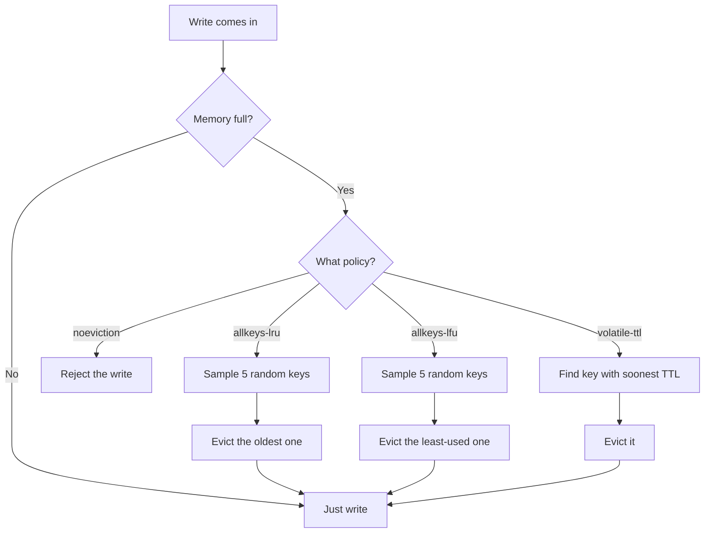
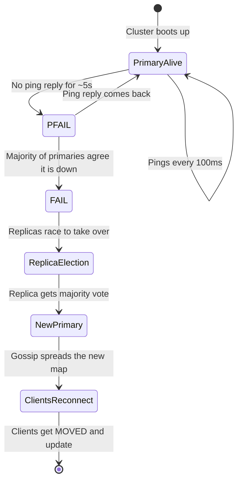
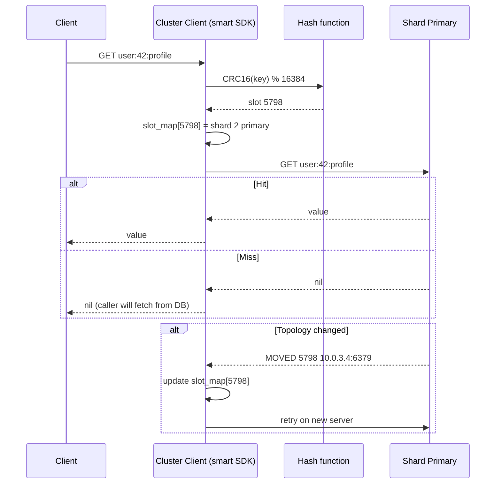

## The scene

You walk into the second interview round. The interviewer points at the whiteboard and says:

> *"You have used Redis before, right? Good. Now design it. Not one Redis server. The whole cluster. How does the cluster find a key? What happens when a server dies? How do you add a new server without taking the system down?"*

They lean back and wait.

This is the question that separates two kinds of candidates. The first kind treats Redis like a magic box. They say *"Redis stores keys in memory"* and stop. The second kind treats Redis like a distributed system. They talk about how many computers share the work, how they find each other, and what happens when one of them dies.

If you open with *"Redis stores key-value pairs in memory"* you have already lost ground. The interviewer wants the cluster story. Sharding. Replication. Failover. Resharding.

A cache is also a tool that you will use again and again in other system designs. URL shorteners use it. News feeds use it. Autocomplete uses it. So you will be asked this question, or something close to it, more than once.

We will walk this from a small cache for a startup to a giant cache for a company with millions of users. At every step we name what breaks first, then add the smallest fix that solves it.

---

## A few words you will see a lot

Before we start, here are some terms in plain language. If you already know them, skip ahead.

- **Cache.** A fast store that keeps copies of data so you do not have to ask the slow database every time. Think of a sticky note on your monitor versus walking to the file cabinet.
- **Key-value store.** A simple kind of database. You ask for a key like `user:42:name`, you get back a value like `"Alice"`. That is it. No tables, no joins.
- **In-memory.** Stored in RAM, not on disk. RAM is about 1000x faster than disk, but it loses everything when the power goes out.
- **Shard.** One slice of the data. If your cluster has 12 shards, each shard holds about 1/12 of the keys.
- **Primary and replica.** The primary is the main copy. The replica is a backup copy that follows the primary. If the primary dies, the replica takes over.
- **Consistent hashing.** A way to assign keys to servers so that adding or removing one server only re-shuffles a small fraction of keys, not all of them.
- **Eviction.** When the cache is full and you need to throw out old keys to make room for new ones.
- **TTL (time-to-live).** A timer on a key. After the timer runs out, the key is gone.

That is enough to start.

---

## Step 1: Ask the right questions

Before you draw anything, sit for five minutes. Write down questions you would ask the interviewer.

A good answer here is not "ten questions about every edge case." It is the small handful of questions that change the design if answered differently.

<details markdown="1">
<summary><b>Show: 8 questions that matter</b></summary>

1. **How strict is "fresh"?** If I write a value and immediately read it back, do I have to see the new value? Or is it okay to see the old value for a moment? *(Most caches are okay with "eventually fresh." If the interviewer says "must always be fresh," you are now building a database, not a cache. Whole shape changes.)*

2. **What happens on restart?** If a server reboots, do we lose the data, or do we want it back? *(Memcached loses everything. Redis can save to disk. The answer decides if we need persistence.)*

3. **How big are the values? What operations?** Are values small (under 1 KB) or huge (multi-MB)? Just simple get and set? Or do we need lists, sets, sorted sets, pub/sub? *(Memcached is just simple keys. Redis has many data structures. This changes the API surface.)*

4. **How much traffic?** Operations per second? Total data size? Read-to-write ratio? *(Without numbers we cannot size the cluster. A common answer: 1 million operations per second, 1 TB of data, 10 reads per 1 write.)*

5. **What happens when memory is full?** Throw out old keys (LRU)? Reject new writes? Use only TTL? *(This is a product question. The wrong choice silently breaks the app.)*

6. **One region or many?** Just one data center, or also Europe and Asia? *(Cross-region caching is unusual. Most teams keep caches in one region and let the database handle the other regions. Confirm.)*

7. **Smart client or proxy?** Do clients know which server has which key (smart client)? Or do they talk to a proxy that figures it out? *(Redis uses smart clients. Memcached often uses a proxy. Both work, different trade-offs.)*

8. **How many failures must we survive?** One server down without losing data? Two? *(This drives how many replica copies we keep per shard.)*

A candidate who only asks "how many ops per second" and "how much data" missed the three important ones: freshness, persistence, eviction. Those are what the interviewer wants to hear.

</details>

---

## Step 2: How big is this thing?

Let's say the interviewer gave us these numbers:

- 1 million operations per second on a normal day, 3 million at peak
- 1 TB of cached data
- 10 reads per 1 write
- Average value size: 1 KB
- Average key size: 50 bytes
- Target: P99 latency under 5 ms in the same region
- Survive one server failure per shard without losing data

Work out these on paper before peeking:

1. Reads per second and writes per second at peak
2. Network bandwidth at peak
3. Memory per server in a 6-server cluster (with 2 copies of data)
4. Memory per server in a 12-server cluster
5. How many TCP connections do we have if 1000 app servers each open 50 connections?

<details markdown="1">
<summary><b>Show: the math</b></summary>

**Reads and writes at peak.** 3 million ops/sec with 10:1 read-to-write:

- Reads: about 2.7 million per second
- Writes: about 300 thousand per second

One Redis server tops out around 100K-200K ops/sec on simple get/set. (Higher with pipelining. Pipelining means batching many commands together on the wire to save round trips. Lower with complex commands.) So we need at least 15-30 servers to handle 3M ops/sec before we even add safety headroom.

**Network bandwidth at peak.** Each op moves about 50 bytes key + 1 KB value + 20 bytes protocol overhead = around 1.1 KB. 3M times 1.1 KB = about 3.3 GB/sec across all servers. Across 30 servers, that is 110 MB/sec per server. A 25 Gbps network card has about 3 GB/sec to spare, so this is comfortable. One thing to watch: replication doubles the write bandwidth on the primary server.

**Memory per server, 6 servers, 2 copies.** 1 TB times 2 copies = 2 TB total. Across 6 servers = 340 GB per server. Doable on the right machine (an r7g.16xlarge has 512 GB). But if one server dies, 170 GB of primary data is briefly unavailable. Big blast radius.

**Memory per server, 12 servers, 2 copies.** 2 TB total / 12 = 170 GB per server. Smaller blast radius. An r7g.8xlarge (256 GB) fits with room to spare.

Plus overhead: Redis itself uses about 20% more RAM than the raw data, because of internal encoding, expiration metadata, and replication buffers. So budget 200 GB instances for 170 GB of dataset.

**Connections.** 1000 servers times 50 connections = 50,000 client connections. With smart clients, every client opens a connection to every shard primary. 50K times 12 = 600K connections across the cluster, about 50K per server.

Redis handles this on one event loop. 50K idle connections is fine. But each connection costs about 20 KB of buffer memory inside Redis. 50K times 20 KB = 1 GB per server just for connection state. Worth knowing.

**What the math is telling you.**

The bottleneck is per-server CPU, not memory or network. (Redis runs one main thread, so per-server CPU is limited.) The cluster size is driven by how many ops one server can handle, and how much data you are willing to lose if one server dies. Not by how much storage you need.

</details>

---

## Step 3: How do we find a key?

You have a key like `user:42:profile`. You have 12 servers. Which server has that key?

This is the central question. Three serious approaches.

<details markdown="1">
<summary><b>Show: compare three ways to assign keys</b></summary>

| Way | How it works | Cost to add or remove a server | How even is the spread? |
|-----|-------------|-------------------------------|-------------------------|
| **Modulo hashing** | `server = hash(key) % N` | Disaster. Going from 6 to 7 servers re-shuffles about 6/7 of all keys. | Perfectly even. |
| **Consistent hashing** | Put keys and servers on a ring. Key goes to the next server clockwise. | About 1/N of keys move when you add one server. | Uneven with few servers. Fix with virtual nodes. |
| **Rendezvous (HRW)** | For each key, score every server. Highest score wins. | About 1/N of keys move. Same as consistent hashing. | Even by design. |

> **Why consistent hashing and not modulo?** With modulo, adding one new server changes the assignment of almost every key. All those keys then miss the cache, slamming the database. With consistent hashing, only about 1/N of keys move when you add a server. That is the whole reason it exists.

**Consistent hashing with virtual nodes is the standard answer.**

The simple ring (one position per server) gives uneven spread. With 6 servers, one server might own 30% of the ring and another 5%. The fix: give each real server many (100-200) virtual positions on the ring. With 1200 virtual nodes for 6 servers, the spread becomes close to uniform.

**Redis Cluster uses a variant: 16384 fixed slots.** Each key hashes to `CRC16(key) mod 16384`. Slots are assigned to servers. Adding a server moves some slots. Mathematically the same as 16384 virtual nodes, but with explicit slot ownership.

**Memcached takes a different path.** The protocol has no built-in clustering. The client library does the work. Clients use libketama (consistent hashing with virtual nodes) to pick a server. No server-side rebalancing. If you change the client config, keys move and you accept the cache miss storm.

### A simple ASCII picture of the ring

```
              slot 0 / 16384
                    .
            .               .
        S3 vnode A       S1 vnode A
       .                         .
      .                           .
    S2 vnode B                  S2 vnode A
      .                           .
       .                         .
        S3 vnode B       S1 vnode B
            .               .
                    .
              slot 8192

  Each S1, S2, S3 has many vnodes scattered around.
  A key hashes to a point on the ring.
  Walk clockwise to find the next vnode. That server owns the key.
```

### Migration math

Say we have 12 servers, 85 GB per server. We add server 13. With consistent hashing, about 1/13 of keys move, spread across the 12 old servers:

- Each old server sends about 7 GB to server 13
- Server 13 receives about 85 GB total
- At 100 MB/sec migration rate (throttled so we do not saturate the network), 85 GB / 100 MB/sec = about 14 minutes

**What happens to lookups for keys being moved?** Redis Cluster uses `ASK` redirects. If a key is in flight, the client first tries the old server. The old server says `ASK` and points to the new server. Client retries on the new server. After migration is done, the old server responds with `MOVED` for that whole slot, and the client updates its slot map.

**Honest trade-off.** Consistent hashing reduces movement. It does not eliminate it. A dumb client that ignores `MOVED` and `ASK` and just retries on the old server will see cache misses (and may fall through to the database) during the migration window. Migration is not free. It is just contained.

</details>

---

## Step 4: Draw the system

Some boxes are missing. Try to fill in the five `[ ? ]` spots before peeking. Hint: how does the client find a server? How do servers find each other? What sits next to each primary for safety? What runs across all servers to keep the cluster healthy?

```
              +----------------------+
              |  Application Server   |
              |   +---------------+   |
              |   |   [ ? ]       |   |  (knows the cluster layout,
              |   +-------+-------+   |   picks the right server)
              +-----------+-----------+
                          |
                          v
        +----------------------------------------+
        |          [ ? ]                          |  (decides which server
        |                                         |   owns a given key)
        +-----+--------------+-------------+------+
              |              |             |
              v              v             v
       +------------+ +------------+ +------------+
       |  Shard 1   | |  Shard 2   | |  Shard 3   |
       |            | |            | |            |
       | +--------+ | | +--------+ | | +--------+ |
       | |Primary | | | |Primary | | | |Primary | |
       | +---+----+ | | +---+----+ | | +---+----+ |
       |     | repl | |     |      | |     |      |
       | +---v----+ | | +---v----+ | | +---v----+ |
       | | [ ? ]  | | | | [ ? ]  | | | | [ ? ]  | |  (takes over if primary dies)
       | +--------+ | | +--------+ | | +--------+ |
       +------------+ +------------+ +------------+
              ^             ^             ^
              +-------------+-------------+
                            |
                   +--------v--------+
                   |    [ ? ]        |  (every server talks to every other
                   |                 |   server, sharing health info)
                   +-----------------+
```

<details markdown="1">
<summary><b>Show: the full architecture</b></summary>

```
              +----------------------------+
              |  Application Server         |
              |   +-------------------+    |
              |   |  Smart Client Lib  |    |  Caches slot-to-server map.
              |   |  (Lettuce, Jedis,  |    |  Picks server by
              |   |   redis-py-cluster)|    |  CRC16(key) % 16384.
              |   +---------+---------+    |  Reacts to MOVED/ASK.
              +-------------+--------------+
                            |
                            v
        +----------------------------------------------+
        |  Hash Slot Ring (16384 fixed slots)           |
        |  slot = CRC16(key) % 16384                    |
        |  slot -> owning server, kept in sync via      |
        |  gossip                                       |
        +----+-----------------+----------------+-------+
             |                 |                |
             v                 v                v
      +--------------+   +--------------+   +--------------+
      |  Shard 1     |   |  Shard 2     |   |  Shard 3     |
      |  slots       |   |  slots       |   |  slots       |
      |  0-5460      |   |  5461-10922  |   |  10923-16383 |
      |              |   |              |   |              |
      | +----------+ |   | +----------+ |   | +----------+ |
      | | Primary  | |   | | Primary  | |   | | Primary  | |
      | | takes    | |   | |          | |   | |          | |
      | | writes   | |   | |          | |   | |          | |
      | +----+-----+ |   | +----+-----+ |   | +----+-----+ |
      |      | async  |   |      |      |   |      |      |
      |      | repl   |   |      |      |   |      |      |
      | +----v-----+ |   | +----v-----+ |   | +----v-----+ |
      | | Replica  | |   | | Replica  | |   | | Replica  | |
      | | can      | |   | |          | |   | |          | |
      | | serve    | |   | |          | |   | |          | |
      | | reads    | |   | |          | |   | |          | |
      | | promoted | |   | |          | |   | |          | |
      | | on fail  | |   | |          | |   | |          | |
      | +----------+ |   | +----------+ |   | +----------+ |
      +--------------+   +--------------+   +--------------+
             ^                 ^                ^
             +-----------------+----------------+
                               |
                      +--------v---------+
                      |  Gossip Protocol  |  Every server pings a few
                      |  (cluster bus on  |  peers per second.
                      |   a separate      |  Shares:
                      |   TCP port)       |   - who is alive
                      |                   |   - slot ownership map
                      |                   |   - epoch numbers
                      |                   |   - failover votes
                      +-------------------+
```

**What each piece does, in one line each:**

- **Smart Client Library.** Holds the slot map locally. Sends each command directly to the right primary. If the topology changed and the client targets the wrong server, the server responds `MOVED <slot> <new_address>` and the client updates its map. `ASK` is the same idea but only for the duration of a slot migration.

- **Hash Slot Ring.** 16384 fixed slots. Each slot owned by exactly one primary at a time. The slot map is replicated across all servers via gossip.

- **Primary per shard.** The single writer for its slot range. Holds the real data in memory.

- **Replica per shard.** An async copy. Can serve reads (slightly stale). Promoted to primary if the primary dies.

- **Gossip protocol.** The cluster's nervous system. Every server sends a `PING` to a small random subset of peers every 100ms, sharing its view of the topology. After a few rounds, every server converges on the same view. Detects failures within a few seconds. Coordinates failover votes.

**For Memcached, the picture is simpler.** No built-in cluster. No gossip. No replication. The "cluster" lives only in the client library, which consistent-hashes across a static list of servers. If a server dies, clients notice the broken connection, mark it dead, and re-hash to the survivors. No automatic failover. This is on purpose. Memcached likes simplicity and assumes the application can handle any key disappearing.

</details>

---

## Step 5: When memory fills up

The cache fills up. Now what?

There are two different things people confuse: **expiration** (TTL ran out) and **eviction** (memory is full, throw something out even if its TTL is still good).

Here is a flowchart of the eviction decision:



<details markdown="1">
<summary><b>Show: expiration vs eviction, and why "approximated LRU"</b></summary>

### Expiration (TTL)

`SET key value EX 60` gives the key a 60-second TTL. Two ways the key gets removed:

- **Passive.** When a client tries to read the key, Redis notices it has expired and deletes it before responding. Cheap. But if no one ever reads it, the expired key sits in memory forever.
- **Active.** A background job samples 20 random TTL keys every 100ms. If more than 25% are expired, it samples again right away. This keeps memory close to actual live keys without scanning the whole keyspace.

Both run together.

### Eviction policies (when `maxmemory` is hit)

| Policy | What it does |
|--------|-------------|
| `noeviction` | Reject writes with an error. Reads still work. Application must handle the error. |
| `allkeys-lru` | Evict the approximate least-recently-used key from anywhere. |
| `volatile-lru` | Evict the approximate LRU key, but only from keys with a TTL. |
| `allkeys-lfu` | Evict the approximate least-frequently-used key (counts access frequency over a decay window). |
| `volatile-lfu` | Same as above but only TTL keys. |
| `allkeys-random` | Evict a random key. |
| `volatile-random` | Evict a random key from those with TTL. |
| `volatile-ttl` | Evict the key with the soonest TTL. |

**How to choose:**

- **Pure cache:** `allkeys-lru` or `allkeys-lfu`. You do not care about specific keys; keep the hot ones.
- **Mixed cache + counters or locks:** `volatile-lru`. Put TTLs on cacheable keys. Leave critical keys (counters, locks) without TTL so eviction skips them.
- **No eviction allowed:** `noeviction` with strict monitoring. Used when the cache is the only copy of the data, which you should usually avoid.

### What is "approximated LRU" and why?

True LRU needs a doubly-linked list of every key. Every access moves the touched key to the front of the list. With 100M keys and millions of ops/sec, the cost hurts: about 16 bytes per key just for prev/next pointers, plus cache-unfriendly random pointer chasing.

Redis approximates. Sample 5 random keys (configurable, can go up to 10) and evict the oldest of the sample. With a sample size of 10, the result is statistically very close to true LRU at a tiny fraction of the cost.

> **Why this matters:** with 100M keys, no linked list saves 1.6 GB of RAM per server. That is a real number.

How "oldest" is tracked: every key has a 24-bit "last access time" field in its object header, updated on read or write. Sampling reads this field. No linked list, no pointer overhead.

Trade-off: sometimes evicts a not-quite-oldest key. For cache use cases this is invisible.

LFU is similar: each key has a small counter that goes up on access and decays over time, so old-but-popular keys do not stay sticky forever.

</details>

---

## Step 6: When a server dies

Each primary has one or more replicas. When the primary dies, a replica takes over. How does that happen?

Here is a state diagram of the failover dance:



<details markdown="1">
<summary><b>Show: async vs sync, detection, election, and the "old primary returns" problem</b></summary>

### Async replication (default)

Primary handles the write, replies to the client, and queues the write for replication. Replicas pull from the primary's replication buffer and apply.

- **Latency:** write returns as soon as the primary commits to memory. Replicas catch up in milliseconds under normal conditions.
- **Data loss window:** the writes still in the buffer that have not reached the replica. Under normal load, just a handful of operations.
- **If the primary dies before replication catches up, those writes are lost.**

This is the right default for cache workloads. The cache is not the only copy of the data.

### Synchronous replication (the `WAIT` command)

After a write, the client can issue `WAIT <num_replicas> <timeout_ms>`. This blocks until that many replicas have acked the previous writes, or the timeout fires.

- **Latency:** bounded by the slowest of the N replicas. One same-AZ replica adds about 1ms. Cross-AZ adds 5-10ms.
- **Data loss window:** zero if you wait for all replicas. But `WAIT` is not true synchronous semantics; if the primary crashes between the write and the WAIT, things get fuzzy.

Sync replication is rare for caches. Use it only for the small set of writes that cannot tolerate loss (a financial counter, a deduplication marker).

### How do we detect the primary is down?

Gossip-based detection. Each server pings a few random peers every 100ms. If a server fails to reply for about 5 seconds, the pinging server marks it `PFAIL` (possibly failed) and gossips this. Once a majority of primaries agree, the state becomes `FAIL` (cluster-wide consensus that it is down).

> Lower threshold = faster failover but more false positives during network blips. Higher = slower recovery. Default 5s is usually fine.

### Leader election

When a primary is declared `FAIL`, its replicas race to take over.

1. Each replica waits a small delay proportional to its replication lag (the most-current replica goes first).
2. The replica asks all other primaries for votes: "should I take over for failed primary X?"
3. Other primaries vote yes if they agree X is `FAIL` and the requesting replica is the only one asking in this epoch (term number).
4. With a majority vote, the replica promotes itself, claims the slot range, and gossips the new layout.
5. Clients learn the new primary via `MOVED` redirects on the next request.

Total failover time: usually 5-15 seconds. Most of that is the detection window; the actual promotion takes under a second.

Memcached has no failover. Server dies, the client library notices, hashes to remaining servers. Keys on the dead server are simply gone until it comes back.

### The "old primary returns" problem

The old primary was network-partitioned, not actually dead. Now it can talk again. The cluster has already promoted a replica.

On its first gossip exchange, the returning server learns its epoch is stale. It demotes itself to a replica of the new primary, throws away its in-memory state, and syncs from the new primary. Any writes accepted during the partition window are lost.

This is the classic CAP trade-off: the cluster chose availability (let the new primary take writes during the partition) and accepts that writes on the old primary cannot be reconciled.

To make this smaller: use `min-replicas-to-write` so a primary refuses writes if it cannot reach at least one replica. Trades a bit of availability for less data loss. Some teams set this. Most caches accept the small loss window.

</details>

---

## Step 7: A GET, drawn end to end

Here is a Mermaid sequence of a simple GET request:



---

## Follow-up questions

Try to answer each in 2 or 3 sentences before opening the solution.

1. **Hot key.** One key gets 500,000 requests per second. It lives on one shard. That shard's CPU pegs at 100%. What do you do?

2. **Big key.** One key holds a sorted set with 2 million entries. A single `ZRANGE 0 -1` stalls the event loop for 800ms. Every other operation queues behind it. How do you prevent this, and how do you recover?

3. **TTL stampede.** You set a TTL of 60 seconds on a million keys at once (bulk import). 60 seconds later, the application's P99 latency doubles. Why? Fix it without changing the TTL.

4. **Persistence.** When should you use RDB? When AOF? When both? When neither? What does each cost in latency and data loss window?

5. **Resharding.** Six servers growing to twelve. How do you do this without dropping operations per second or losing data? How long does it take?

6. **Network partition.** Two servers in one data center can talk to each other but not to the rest of the cluster. What happens? Will the partition try to elect its own primaries?

7. **Memory fragmentation.** Redis reports `used_memory_rss / used_memory = 1.8`. Explain what that means in plain words, and what you would do about it.

8. **Cache stampede.** A popular key expires. 10,000 concurrent requests miss, all hit the database. The database melts. How do you prevent this in the cache layer?

9. **Read-after-write surprise.** A user writes `SET balance 100`, immediately reads back, and sees the old value. Why? When can this happen in a cluster that uses replicas for reads?

10. **Hit rate crash.** Cache hit rate dropped from 95% to 60% overnight. No deploys happened. What is your investigation path?

---

## Related problems

- **[URL Shortener (001)](../001-url-shortener/question.md).** Uses this cache heavily on the redirect path. The hot key problem there is the same one analyzed here.
- **[News Feed (002)](../002-news-feed/question.md).** The timeline store is a Redis cluster. Sorted-set encoding, hot-key replicas, cold-user eviction all come from this design.
- **[Typeahead Autocomplete (005)](../005-typeahead-autocomplete/question.md).** The prefix index sits in the same kind of distributed cache. The big-key problem is acute there (top prefixes hold large suggestion lists).
