## What we are building

A distributed cache is an in-memory key-value store spread across many servers, sitting in front of a database. When an app needs data, it checks the cache first. A hit costs under a millisecond. A miss falls through to the database and costs 10-50ms. The cache exists to absorb the misses.

A single Redis server tops out at roughly 150K operations per second and a few hundred GB of RAM. A product serving 1 million requests per second with a 1 TB working set needs a cluster: many servers, coordinated.

That coordination is where the problems live.

Five hard problems are hiding in this design:

1. **Sharding.** Given a key and 12 servers, which server holds it? The answer must stay stable when servers join or leave.
2. **Replication.** If one server dies, its data dies with it. How do you keep a live backup and promote it fast?
3. **Hot keys.** One key gets 500K requests per second. It lives on one shard. That shard melts while the others idle.
4. **The consistency model.** After a write, can you immediately read your own value? From a replica? How stale is acceptable?
5. **Eviction.** Memory is finite. When it fills, which keys go? The wrong answer silently breaks the application.

We will build the system one layer at a time, starting with a single server and adding each piece as the problem demands it.

---

## The lifecycle of one cache operation

Before drawing any cluster diagrams, picture what a single cache operation does. The app asks for a key. Either it is there (hit) or it is not (miss).

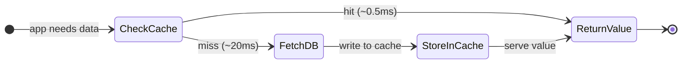

A hit costs a fraction of a millisecond. A miss pays the database round trip and then writes the result to cache so the next request is a hit.

> **Take this with you.** A cache is a fast answer to a question you have answered before. Every design decision that follows exists to keep those fast answers available across many servers without losing them.

---

## How big this gets

The scale assumptions that drive this design:

| Input | Number |
|-------|--------|
| Sustained operations per second | 1 million |
| Peak operations per second | 3 million |
| Read-to-write ratio | 10:1 |
| Total working set | 1 TB |
| Average value size | 1 KB |
| Latency target (P99, get) | < 1ms |

From these we can derive the cluster shape.

<b>Show: derived numbers</b>

| Metric | Value | How |
|--------|-------|-----|
| Reads at peak | 2.7M/sec | 3M × 10/11 |
| Writes at peak | 300K/sec | 3M × 1/11 |
| Min shards needed | 20 | 3M / 150K ops per server |
| With 20% headroom | 24 shards | round up, add buffer |
| Replication factor 2: total servers | 48 | 24 primaries + 24 replicas |
| Data per primary | ~85 GB | 1 TB / 12 shards (using 12 primaries) |
| With Redis encoding overhead (20%) | ~200 GB | typical r7g.8xlarge has 256 GB |
| Network per server | ~110 MB/sec | 3M ops × 1.1 KB avg / 30 servers |
| Connection state (1K app servers × 50 conns × 20 KB) | ~1 GB | budget this separately |

The real bottleneck is per-shard CPU: Redis runs one main event-loop thread. All other resources (memory, network) are comfortable well before CPU saturates.

> **Take this with you.** The bottleneck is single-threaded CPU per shard, not memory or network. Cluster size is driven by ops per second, not by storage.

---

## The smallest version that works

Before tackling the cluster, draw the simplest thing that actually runs.

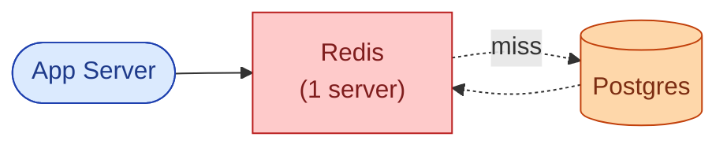

The app uses cache-aside: check Redis first, miss falls through to Postgres, result is written back to Redis with a TTL. This handles a small startup. The question is what breaks first as the system grows, and what to add in what order.

---

## Decision 1: how do we route a key to the right server?

You have `user:42:profile`. You have 12 servers. Which server has it?

The answer must be consistent (the same key always maps to the same server) and must stay stable when servers are added or removed. Three approaches exist, and they behave very differently on topology change.

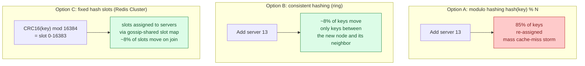

Modulo hashing fails at scale: adding one server causes 85% of keys to map to a different server simultaneously. Every client gets a miss on their next request and hammers the database.

Consistent hashing and fixed slots both move only ~1/N of keys on a topology change. Redis Cluster uses 16,384 fixed slots. The slot map fits in 2 KB and is gossiped across all servers every few seconds. Client libraries cache this map locally and compute `slot = CRC16(key) & 16383` before sending the command, so they connect directly to the right server with no proxy hop.

Here is what a 3-shard cluster looks like from the client's perspective:

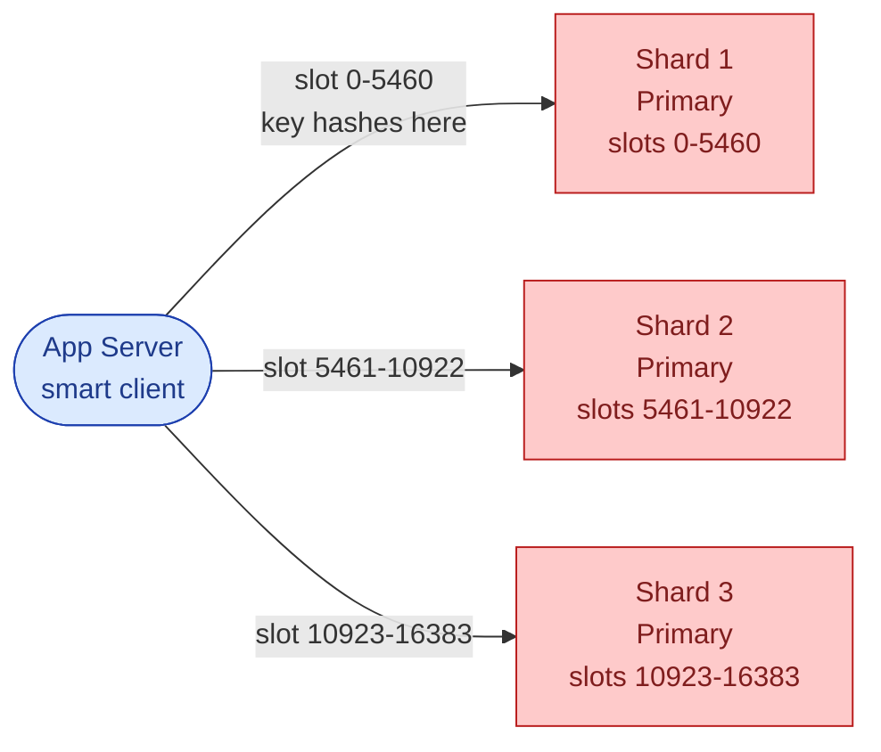

<b>Show: virtual nodes, hash tags, and migration mechanics</b>

**The uneven ring problem.** A simple consistent hash ring with one position per server gives very uneven load. One server might own 30% of the ring, another 5%. The fix: give each real server many virtual positions (100-200 virtual nodes). With 1,200 virtual nodes spread across 6 servers, the distribution is close to uniform. Redis Cluster's 16,384 slots serve the same purpose with explicit assignment rather than ring positions.

**Hash tags.** If you need two keys to land on the same slot (for multi-key operations like `MGET` or `MULTI/EXEC`), use hash tags: `{user:42}:profile` and `{user:42}:settings` both hash on only the part inside `{}`. Both land on the same slot. Multi-key commands work without cross-slot errors.

**Migration mechanics.** When you add shards, slots migrate from old servers to new ones. During migration, the source server responds `ASK` for any key that has already moved. `ASK` tells the client to try the new server for this one request only. After full migration, the source responds `MOVED`, and clients update their cached slot map permanently. Client libraries handle both transparently.

**Migration speed.** You have 12 servers with ~85 GB each. You add server 13. Each of the 12 old servers gives ~7 GB to server 13. At a throttled 100 MB/sec migration rate: ~14 minutes to balance. Throttle so migration uses at most ~5% CPU on source and destination.

> **Take this with you.** Use fixed hash slots or consistent hashing. Never modulo hashing. The reason is not elegance: it is that adding one server should not cause a mass cache-miss storm.

---

## Decision 2: what happens when a server dies?

Each shard holds data in memory. If the server running that shard crashes, all data on it is gone until the cache rewarms from the database.

The solution is replication: every shard has a primary and at least one replica. The replica copies from the primary in the background. If the primary goes down, the replica gets promoted.

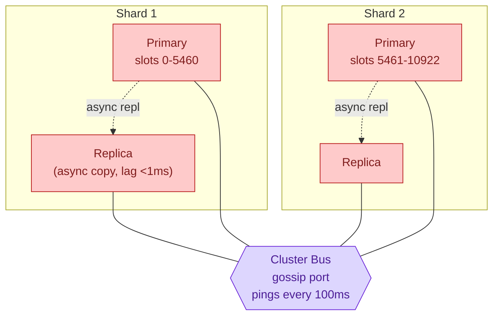

The gossip protocol is how all servers track each other's health. Each server pings roughly 5 random peers every 100ms. No response for ~5 seconds marks the server `PFAIL`. Once a majority of primaries independently agree it is dead, the status changes to `FAIL` and failover begins.

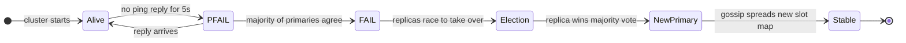

Failover takes 5-15 seconds. During that window, the affected slot range returns errors or cache misses. A well-built application treats cache errors the same as misses and falls through to the database.

<b>Show: async vs sync replication, and the returning-primary problem</b>

**Async replication (default).** Primary writes to memory, replies `+OK` to the client, then queues the write for replication. Replicas pull and apply. Replication lag at steady state: under 1ms intra-AZ. If the primary dies before the replica receives the last few writes, those writes are lost. For a pure cache, this is acceptable.

**Synchronous replication (`WAIT` command).** After a write, call `WAIT <N> <timeout_ms>`. Blocks until N replicas have acked. Data loss window drops to near zero. Adds ~1ms intra-AZ. Use only for the small set of writes that genuinely cannot be lost: financial counters, deduplication markers. Not appropriate for most cache workloads.

**The returning-primary problem.** The primary was network-partitioned, not dead. The cluster promoted a replica. The partition heals. On its first gossip exchange, the returning server sees its epoch is stale, immediately demotes itself to a replica of the new primary, and requests a resync. Any writes it accepted during the partition are discarded. This is the CAP trade-off: the cluster chose availability and accepts the small loss.

Setting `min-replicas-to-write 1` makes the primary refuse writes if it cannot reach any replica. Shrinks the loss window at the cost of brief write unavailability during a partition.

> **Take this with you.** Replication factor 2 (one replica per shard) is the minimum. Failover takes 5-15 seconds. Design the application to treat cache errors as misses, not fatal errors.

---

## Decision 3: what do we do when memory fills up?

Memory is finite. When the cache is full and a new write arrives, something has to give. Two separate mechanisms handle this, and people often confuse them.

**Expiration (TTL).** A key's timer runs out. That key is stale and should be removed. Redis removes expired keys lazily (on the next read of that key) and actively (a background job samples 20 TTL-bearing keys every 100ms and deletes the expired ones).

**Eviction.** Memory is full and a new write arrived. Redis needs to throw out a key that is still valid. Which one?

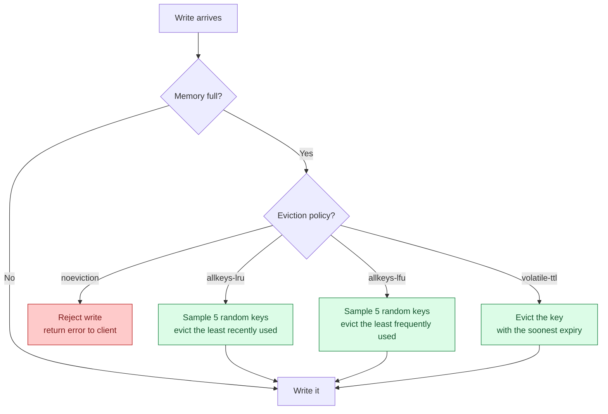

Which policy to use:

| Situation | Policy |
|-----------|--------|
| Pure cache, all keys are cacheable | `allkeys-lru` |
| Cache with some critical keys (counters, locks) that must never be evicted | `volatile-lru` |
| Data loss from eviction is a bug | `noeviction` |

<b>Show: why approximated LRU instead of true LRU, and LFU vs LRU</b>

**True LRU is too expensive.** Exact LRU needs a doubly-linked list of every key. Every read moves the touched key to the front. With 100M keys that is 1.6 GB of pointer overhead, plus cache-unfriendly pointer chasing on every single read.

Redis approximates. It samples 5 random keys (configurable up to 10) and evicts the least recently accessed one. With a sample size of 10, the result is statistically very close to true LRU at a fraction of the cost. Each key stores a 24-bit last-access timestamp in its object header. No linked list, no pointer overhead.

**LFU vs LRU.** LRU evicts keys that have not been accessed recently. LFU evicts keys that have not been accessed frequently. A key accessed 10,000 times per day but not in the last 5 minutes would be evicted by LRU. LFU keeps it. For workloads with bursty access patterns, `allkeys-lfu` is often better. Most caches start with LRU and switch to LFU after measuring.

> **Take this with you.** Expiration and eviction are different mechanisms triggered by different conditions. Expiration fires per-key when a TTL expires. Eviction fires globally when memory hits `maxmemory`. Both need a policy. Default to `allkeys-lru` for a pure cache.

---

## Decision 4: how do we handle hot keys?

One key gets 500K requests per second. It sits on one shard. That shard's single event-loop thread is pegged at 100% CPU. Every other key on that shard queues behind the hot one.

The fix is layered, and each layer is cheaper than the next.

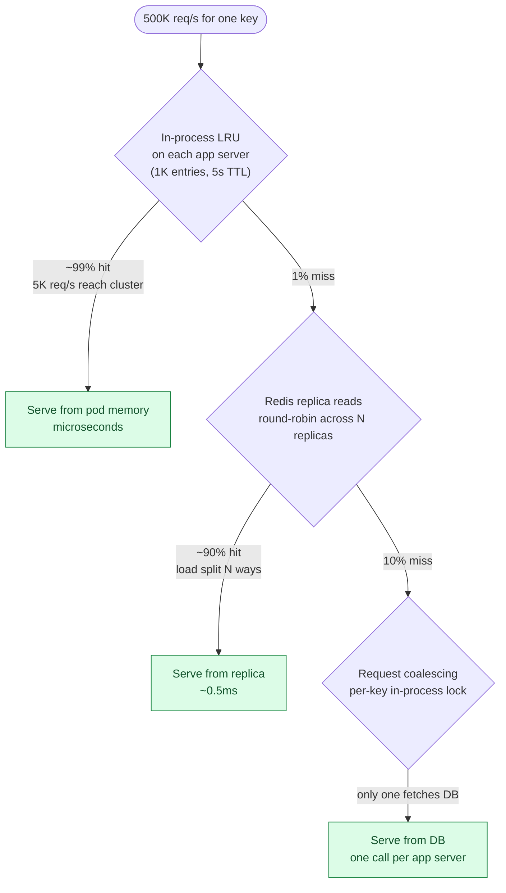

The in-process LRU is the single biggest win. At 1,000 app servers each with a local LRU that catches 99% of hot-key traffic, the cluster sees 5K req/s instead of 500K. That is a 100x reduction before a single cluster call.

For extreme cases where even this is not enough, key splitting stores the value under `hot_key:0` through `hot_key:7`, each hashing to a different slot. The client picks a random suffix per read. Every write must update all copies. Use this only when the other layers are not enough.

> **Take this with you.** Hot keys are solved by layered caching: in-process LRU first, replica reads second, request coalescing third. The cluster alone cannot fix a hot key.

---

## The full architecture

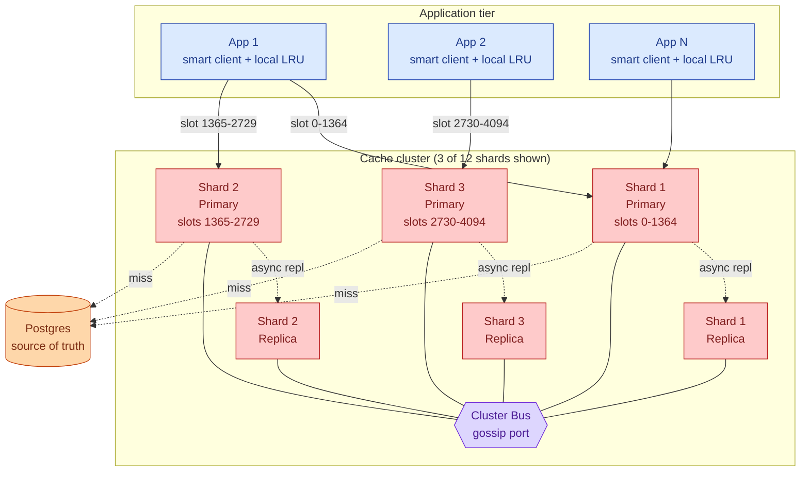

Each component, in one line:

| Component | Purpose |
|-----------|---------|
| App + local LRU | 1,000-entry in-process cache. Absorbs hot-key traffic before it reaches the cluster. |
| Smart client | Holds the slot map locally. Routes each command to the right primary. Handles `MOVED`/`ASK` transparently. |
| Shard primary | The only writer for its slot range. All reads and writes that miss local LRU land here. |
| Shard replica | Async copy. Can serve slightly stale reads. Gets promoted on primary death. |
| Cluster Bus | Gossip on a separate TCP port. Shares health, slot ownership, epoch numbers. Detects failures within ~5-8 seconds. |
| Postgres | Source of truth. Cache misses fall through here. Must be sized to handle the full load on a cold cache. |

---

## Walk: a GET, end to end

Alice's app needs `user:42:profile`.

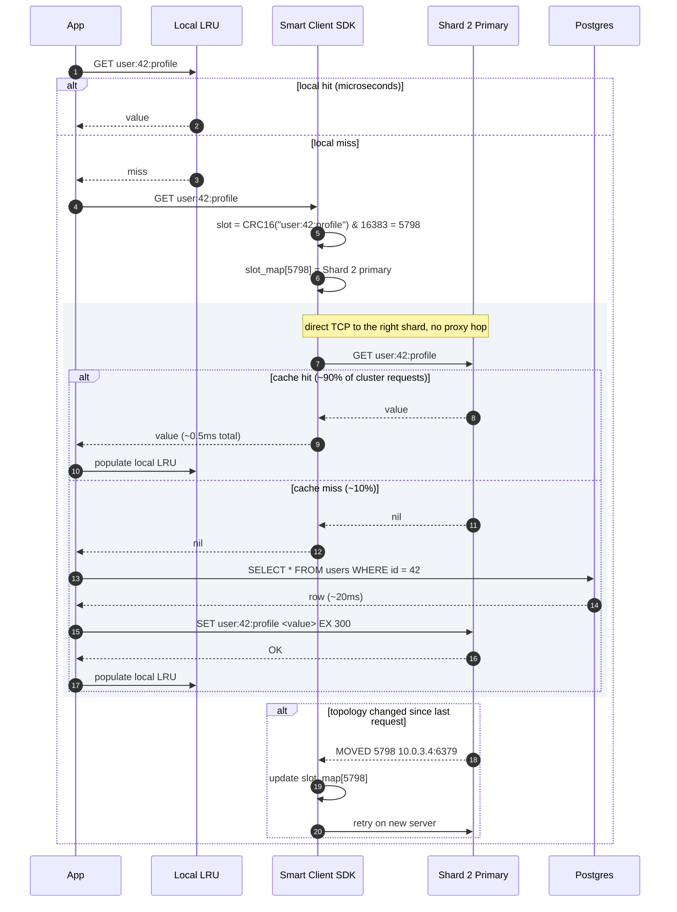

Three details worth noting:

1. The local LRU check costs microseconds. If it hits, the cluster never sees the request. For hot keys this is the entire defense.
2. The smart client connects directly to the right shard primary. No proxy, no extra network hop.
3. A `MOVED` response means the slot has permanently migrated. An `ASK` response means the slot is mid-migration for this one key only. Client libraries handle both transparently.

---

## The hard sub-problem: cache stampede

A popular cache entry expires. Before any app server can refresh it, 10,000 concurrent requests arrive and all get a miss. All 10,000 go to the database simultaneously. The database melts.

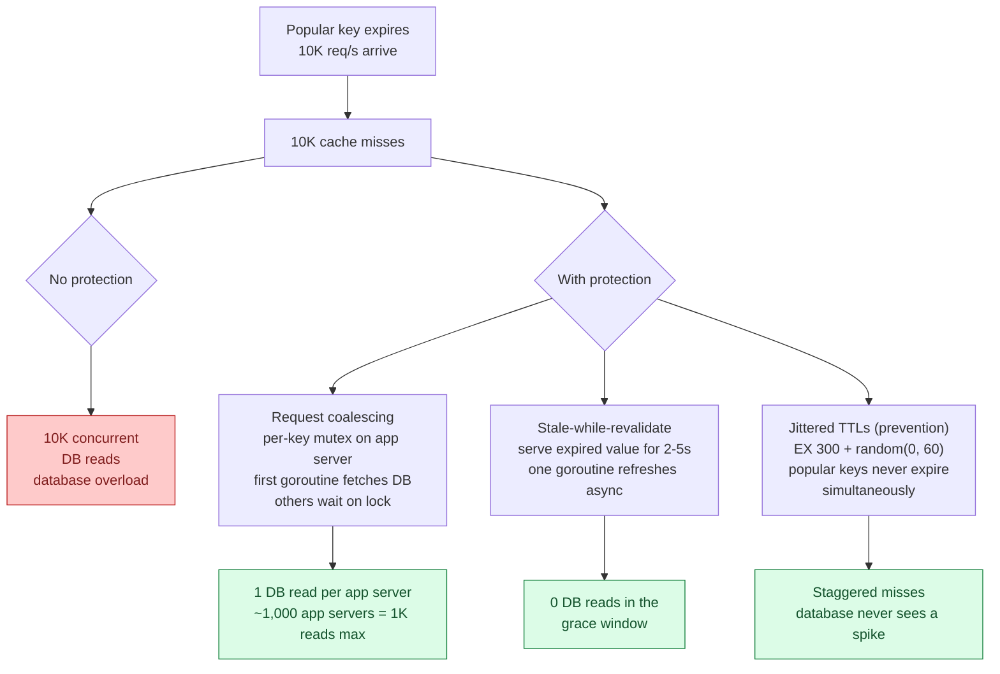

The defenses work together. Jitter prevents the problem. Coalescing limits the damage when it still happens. Stale-while-revalidate keeps the hit rate high during refresh. A production system needs all three.

> **Take this with you.** TTLs cause stampedes. The fix is jittered TTLs plus request coalescing plus stale-while-revalidate. "We will use TTLs" is the wrong answer. Naming all three is the right one.

---

## Follow-up questions

Try answering each in 2 or 3 sentences before opening the solution.

1. **Hot key.** One key gets 500K requests per second. It lives on one shard. That shard's CPU is pegged at 100%. What do you do, and in what order?

2. **Big key.** One key holds a sorted set with 2 million entries. A single `ZRANGE 0 -1` stalls the event loop for 800ms. Every other operation on that shard queues behind it. How do you prevent this, and how do you recover once it already exists?

3. **TTL stampede.** You set a TTL of 60 seconds on a million keys during a bulk import. 60 seconds later, your application's P99 latency doubles. Why? How do you fix it without changing the TTL value?

4. **Persistence.** When do you use RDB snapshots? When AOF? When neither? What does each cost in terms of latency and data loss window?

5. **Resharding.** Six servers growing to twelve. How do you do this without dropping operations per second or losing data? How long does it take?

6. **Network partition.** Two cache servers in one data center can talk to each other but not to the rest of the cluster. What happens? Will the isolated pair try to elect their own primaries?

7. **Memory fragmentation.** Redis reports `used_memory_rss / used_memory = 1.8`. What does that mean in plain words, and what do you do about it?

8. **Cache stampede.** A popular key expires. 10,000 concurrent requests all miss and hit the database. The database melts. Walk through three defenses.

9. **Read-after-write.** A user writes `SET balance 100`, immediately reads it back, and sees the old value. Why? When does this happen, and how do you prevent it when it matters?

10. **Hit rate crash.** Cache hit rate dropped from 95% to 60% overnight. No deploys happened. What is your investigation path, step by step?

---

## Related problems

- **[URL Shortener (001)](../001-url-shortener/question.md).** Uses a cache cluster on the redirect path. The hot key and stampede problems analyzed here appear there in concrete form.
- **[News Feed (002)](../002-news-feed/question.md).** The timeline store is a Redis cluster with sorted-set encoding. The big-key problem is acute for users with many followers.
- **[Typeahead Autocomplete (005)](../005-typeahead-autocomplete/question.md).** The prefix index sits in a distributed cache. Top prefixes are big keys. The hot-key defenses are the same as here.
