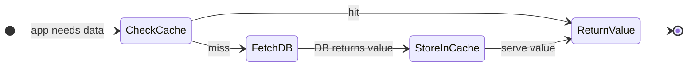
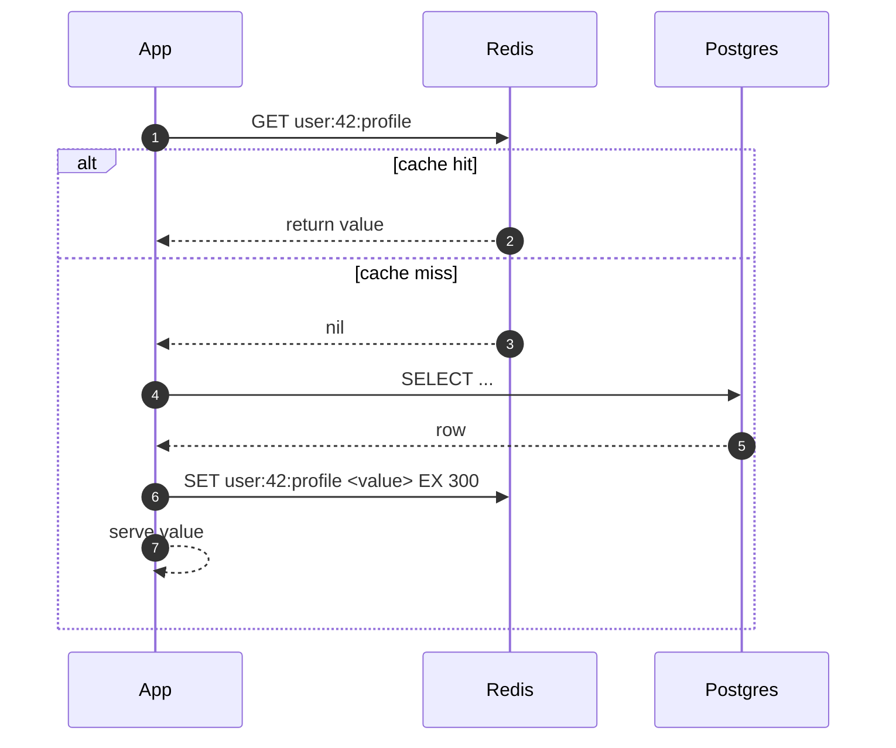
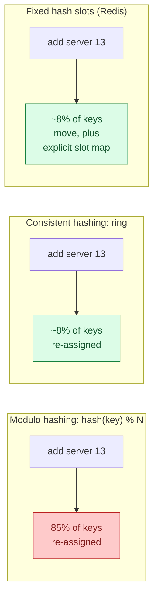
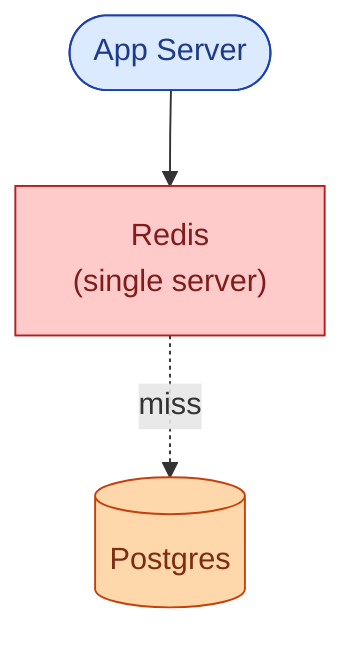
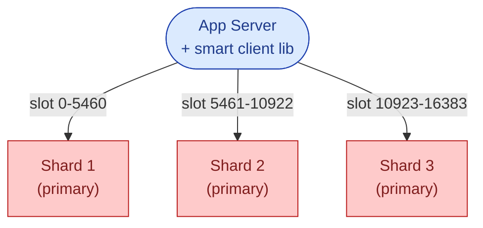
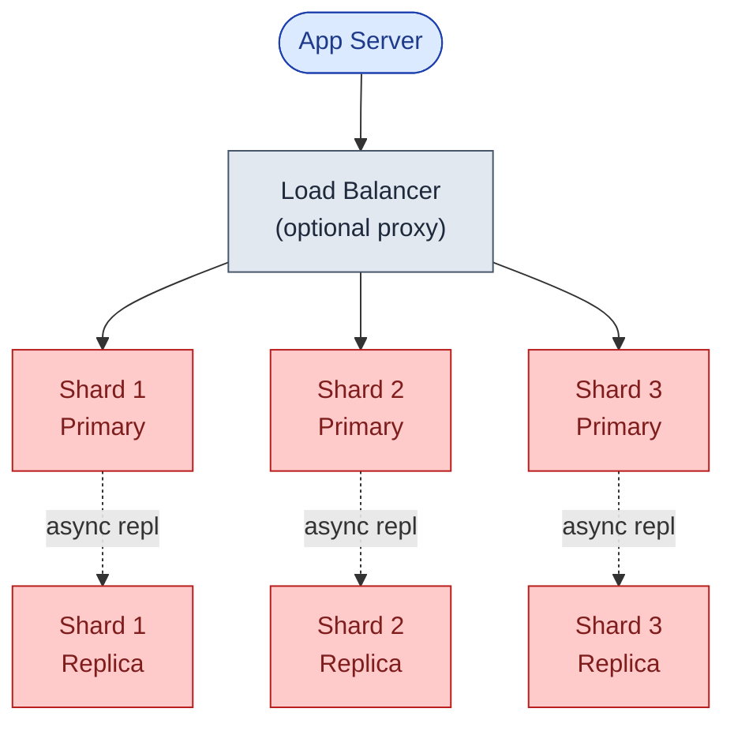
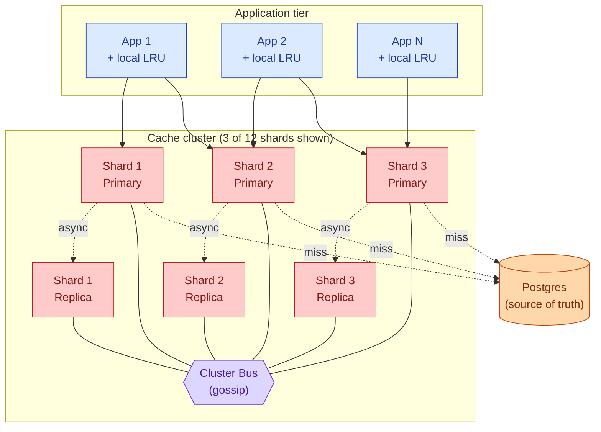
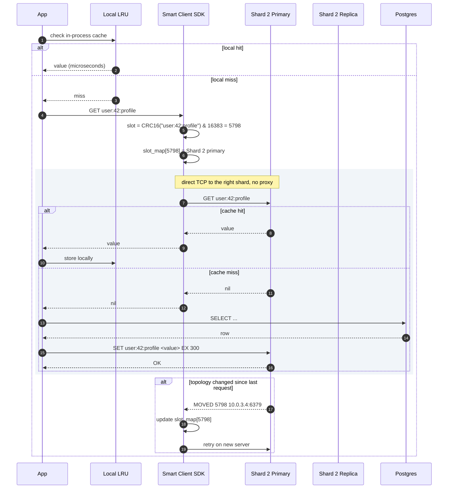
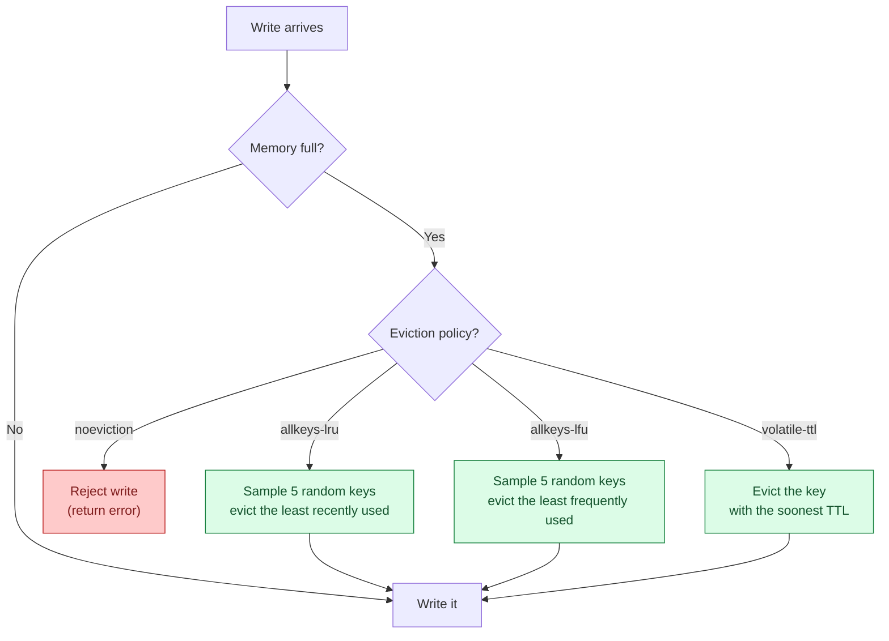
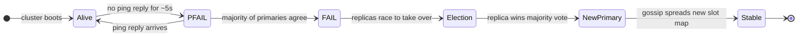

## The scene

You sit down. The interviewer points at the whiteboard.

> *"You have used Redis before, right? Good. Now design it. Not one Redis server. The whole cluster. How does the cluster find a key? What happens when a server dies? How do you add a new server without taking the system down?"*

They lean back and wait.

That is the question. It sounds simple, but the word "cache" hides three hard problems: how to spread data across many servers, how to keep data safe when servers fail, and how to make room when memory fills up.

A single Redis server tops out around 150K operations per second. Real products need 10x that. So we need a cluster. And the moment you have a cluster, you need answers to all three problems above.

We will start with one server and add one layer at a time.

---

## Step 1: Picture one cache operation

Before any clusters, just picture what a cache does. The app asks for a key. Either it is there (hit) or it is not (miss).

That is the whole point of a cache. Everything we add from here (sharding, replication, eviction, failover) is infrastructure to keep that loop fast and reliable.

> **Take this with you.** A cache is a fast answer to a question you have already answered before. The design problem is keeping those fast answers spread across many servers without losing any.

---

## Step 2: Ask the right questions

In a real interview, sit quietly for a minute and write down what you want to ask. Not ten questions. Five good ones.

<b>Show: 5 questions that change the design</b>

1. **How strict is "fresh"?** If I write a key and immediately read it back, do I have to see the new value? Or is it okay to see the old one for a moment? *Most caches are fine with "eventually fresh." If the answer is "must always see latest," you are building a database, not a cache.*

2. **What happens on restart?** If a server reboots, do we lose the data, or do we want it back? *Memcached always loses it. Redis can save to disk. This decides whether we need persistence.*

3. **What if memory fills up?** Throw out old keys (LRU)? Reject new writes? Only expire by TTL? *This is a product question. The wrong choice silently breaks the application.*

4. **How much traffic and how much data?** Operations per second? Total working set size? Read-to-write ratio? *Without these numbers we cannot size the cluster. A common starting point: 1 million ops/sec, 1 TB of data, 10 reads per 1 write.*

5. **Smart client or proxy?** Do clients know which server holds which key (smart client, Redis Cluster style)? Or do they talk to a proxy that figures it out? *Both work. Different operational trade-offs.*

A strong candidate also asks: *"Is this a pure cache or is the cache the only copy of the data?"* The answer changes the persistence and eviction story completely.

---

## Step 3: How big is this thing?

Same cache service, two very different companies.

| Company | Ops/day | Per second (peak) | Working set | Notes |
|---------|---------|-------------------|-------------|-------|
| Startup | ~5M | ~200 | 10 GB | Fits on one server |
| Large product (e.g. Twitter) | ~250B | ~3M peak | 1 TB | Needs a cluster |

<b>Show: how the numbers come out</b>

Assume the interviewer gives us: **1M ops/sec sustained, 3M peak, 1 TB working set, 10:1 read-to-write**.

**Reads and writes at peak.**
- Reads: 2.7M/sec
- Writes: 300K/sec

One Redis server handles roughly 100K-200K ops/sec on simple get/set. So we need at least 15-30 servers to cover 3M ops/sec before adding any safety headroom.

**Network bandwidth.** Each op moves about 50 bytes (key) + 1 KB (value) + 20 bytes (protocol) = 1.1 KB. At 3M ops/sec across 30 servers: ~110 MB/sec per server. Comfortable on a 25 Gbps card.

**Memory per server.** 1 TB data × 2 copies (one replica per shard) = 2 TB total. Across 12 shards = ~170 GB per server. Add 20% Redis internal overhead = 200 GB. An r7g.8xlarge (256 GB) fits with headroom.

**Connection cost.** 1,000 application servers × 50 connections = 50K client connections. Each connection costs ~20 KB of buffer in Redis = ~1 GB per server just for connection state. Worth budgeting.

**The number that matters.** The bottleneck is per-shard CPU, not memory or network. Redis runs one main event loop thread. Cluster size is driven by how many ops one thread can handle, not by raw storage.

---

## Step 4: The smallest thing that works

Forget the cluster for now. A 10-person startup needs a cache for their user profile endpoint. One server. Nothing else.

The flow for a GET:

This is the right place to start. The interesting part is what happens when you need more than one server.

> **Take this with you.** Always start from the smallest thing that works. In a cache design, the first hard question is: when you have 12 servers, how does the app know which one has the key?

---

## Step 5: The central problem - how to find a key

You have `user:42:profile`. You have 12 servers. Which server has that key?

Three approaches. They look similar but behave very differently when you add or remove a server.

**Why consistent hashing beats modulo.** With modulo hashing, adding one server re-assigns almost every key. All those keys miss the cache at the same moment and slam the database. Consistent hashing moves only ~1/N of keys when you add one server. That is why it exists.

**Redis Cluster takes a variant approach.** It uses 16,384 fixed slots. Every key maps to a slot with `CRC16(key) mod 16384`. Slots are assigned to servers. Adding a server moves some slots. Mechanically similar to 16,384 virtual nodes on a consistent hash ring, but with explicit slot ownership that all servers gossip.

<b>Show: virtual nodes and the slot ring in detail</b>

**The uneven ring problem.** A simple ring with one position per server gives very uneven spread. With 6 servers, one server might own 30% of the ring and another 5%. The fix: give each real server many (100-200) virtual positions on the ring. With 1,200 virtual nodes spread across 6 servers, the distribution is close to uniform.

**Redis Cluster slot map.** 16,384 slots fit in 2 KB (16,384 bits). Small enough to gossip across the cluster every few seconds. The client libraries cache this map locally and compute `slot = CRC16(key) & 16383` before sending the request, so they connect directly to the right server without a round-trip lookup.

**Hash tags.** If you need two keys to land on the same slot (for multi-key operations), you can use hash tags: `{user:42}:profile` and `{user:42}:settings` both hash using only `user:42`. Both land on the same slot.

**Migration math.** You have 12 servers, ~85 GB per server. You add server 13. With consistent hashing, each of the 12 old servers moves ~7 GB to server 13. At a throttled 100 MB/sec migration rate: 85 GB / 100 MB/sec = about 14 minutes to balance the new server. During migration, clients see `ASK` redirects for in-flight keys. After migration, they see `MOVED` redirects and update their slot map.

> **Take this with you.** Consistent hashing (or fixed hash slots) is the standard answer for key routing. The reason is not elegance. It is that adding or removing a server should not cause a mass cache-miss storm.

---

## Step 6: Build the architecture, one layer at a time

We have a key routing strategy. Now build the system around it.

### v1: one shard

Fine for a startup. One server, 150K ops/sec ceiling, no safety.

### v2: three shards (smart client routes by key)

The smart client library (Lettuce, Jedis, redis-py-cluster) holds the slot map and picks the right server before sending the command. No proxy needed.

### v3: add replicas (survive a server death)

Each shard has one primary and one replica. The replica copies from the primary in the background (async by default). If the primary dies, the replica gets promoted in 5-15 seconds.

### v4: gossip protocol + application-side local LRU

What each piece does:

| Box | What it does |
|-----|--------------|
| **App + local LRU** | A small in-process cache (e.g. 1,000 entries, 5-second TTL). Absorbs hot-key traffic before it reaches the cluster. |
| **Smart client** | Holds the slot map. Routes each command to the right shard. Handles `MOVED`/`ASK` redirects on topology change. |
| **Shard primary** | The single writer for its slot range. Holds the data in memory. |
| **Shard replica** | Async copy. Can serve slightly-stale reads. Promoted to primary on failure. |
| **Cluster Bus (gossip)** | Runs on a separate TCP port. Each server pings ~5 random peers every 100ms. Shares liveness, slot ownership, epoch numbers. Detects failures within ~5 seconds. |

> **Take this with you.** The gossip protocol is the cluster's nervous system. Without it, no server would know when another died. The failover and rebalancing story both depend on it.

---

## Step 7: One GET, all the way through

App server wants `user:42:profile`. Here is what actually happens.

Three details worth noting:

1. The local LRU check costs microseconds. If it hits, the cluster never sees the request. This is the first defense against hot keys.
2. The smart client connects directly to the right primary. No proxy hop.
3. A `MOVED` response means the slot has permanently migrated. An `ASK` response means the slot is mid-migration for this one key. The client handles both transparently.

---

## Step 8: When memory fills up

The cache fills up. Two different things happen, and people often confuse them.

**Expiration (TTL).** A key's timer ran out. That key is stale and should go. Redis removes it lazily (on next read) and actively (a background job samples 20 TTL keys every 100ms, deletes the expired ones).

**Eviction.** Memory is full and a new write arrived. Redis needs to throw something out, even if its TTL is still good.

<b>Show: why "approximated LRU" and which policy to pick</b>

**True LRU is too expensive.** Exact LRU requires a doubly-linked list of every key. Every read moves the touched key to the front. With 100M keys that is 1.6 GB of pointer overhead alone, plus cache-unfriendly pointer chasing on every read.

Redis approximates. Sample 5 random keys (configurable up to 10) and evict the oldest. With a sample size of 10, the result is statistically very close to true LRU at a fraction of the cost. Each key stores a 24-bit "last access time" in its object header. No list, no pointer overhead.

**Which policy to pick:**

| Situation | Policy | Why |
|-----------|--------|-----|
| Pure cache, all keys are cacheable | `allkeys-lru` | Keep the hot keys. Throw out stale ones. |
| Cache with critical keys (counters, locks) that must never be evicted | `volatile-lru` | Only evict keys that have a TTL. Leave TTL-free keys alone. |
| Eviction not acceptable (data loss would be a bug) | `noeviction` | Reject writes when full. Application must handle the error. |

**LFU vs LRU.** LRU evicts keys that were not accessed recently. LFU evicts keys that were not accessed frequently. A key accessed 10,000 times a day but not in the last 5 minutes would be evicted by LRU. LFU keeps it. For workloads with bursty access patterns, `allkeys-lfu` is often better.

> **Take this with you.** Eviction and expiration are different mechanisms triggered by different conditions. In an interview, naming both and explaining when each fires shows you have used Redis in production.

---

## Step 9: When a server dies

Each primary has a replica. When the primary stops responding, the replica takes over.

<b>Show: async vs sync replication, election details, and the old-primary-returns problem</b>

**Async replication (default).** Primary writes to memory, replies to the client, queues the write for replication. Replicas pull from the queue and apply. Replication lag at steady state: under 1ms intra-AZ. If the primary dies before the replica receives the last few writes, those writes are lost. This is the right default for caches.

**Synchronous replication (`WAIT` command).** After a write, the client issues `WAIT <N> <timeout_ms>`. This blocks until N replicas have acked. Data loss window drops to near zero. Latency adds ~1ms intra-AZ, ~5-10ms cross-AZ. Use only for the small set of writes that truly cannot be lost (financial counters, deduplication markers).

**Failure detection.** Each server pings ~5 random peers every 100ms. No response for ~5 seconds marks the server `PFAIL`. Once a majority of primaries independently mark it `PFAIL`, it becomes `FAIL`. Cluster-wide consensus. Typical detection time: 5-8 seconds.

**Leader election.** When a primary is declared `FAIL`:

1. Each replica waits a delay proportional to its replication lag. The most up-to-date replica goes first.
2. That replica asks all other primaries for a vote.
3. Primaries vote yes if they also see the old primary as `FAIL` and have not voted in this election epoch.
4. With a majority, the replica promotes itself and gossips the new slot ownership.

Total failover time: 5-15 seconds. Most of that is the detection window. Actual promotion takes under a second.

**The old-primary-returns problem.** The primary was network-partitioned, not actually dead. The cluster promoted a replica. Now the partition heals.

On its first gossip exchange, the returning server learns its epoch is stale. It immediately demotes itself to a replica of the new primary and requests a resync. Any writes it accepted during the partition are lost. This is the CAP trade-off: the cluster chose availability and accepts the small loss.

Setting `min-replicas-to-write 1` makes the primary refuse writes if it cannot reach any replica. Reduces the loss window at the cost of brief unavailability during the partition. Many caches do not set this; they accept the loss.

> **Take this with you.** Failover takes 5-15 seconds. During that window, the affected slot range returns errors or cache misses. Well-built applications treat cache errors the same as misses and fall through to the database. Design your app to handle a cold cache.

---

## Step 10: One hard problem per feature

The same cluster can stress different parts of the design depending on traffic.

| Problem | Concrete example | What stresses the design | The fix |
|---------|-----------------|--------------------------|---------|
| **Hot key** | Twitter's "liked by @celebrity" counter | One shard at 100% CPU. Others idle. | In-process LRU absorbs 99% of traffic. Replica reads spread the rest. |
| **Big key** | A sorted set with 2M entries | `ZRANGE 0 -1` blocks the event loop for 800ms. Every other key on that shard stalls. | Cap at write time. Use `ZSCAN` to iterate in batches. Use `UNLINK` (not `DEL`) to remove. |
| **TTL stampede** | 1M keys all set with `EX 60` at the same time | At t=60s, active expiration and application regeneration all fire at once. CPU spikes, database melts. | Add jitter at write time: `EX (60 + random(0, 30))`. |
| **Cache stampede** | Popular key expires during a traffic spike | 10,000 concurrent requests miss, all query the database | Request coalescing: one thread fetches, others wait on a local lock. Stale-while-revalidate: serve expired value while fetching new one. |
| **Resharding** | Growing from 6 to 12 shards | Slot migration while serving traffic | Incremental slot migration. Clients see `ASK` redirects during migration, `MOVED` after. Application sees tail latency spike, not errors. |

> **Take this with you.** Hot keys, big keys, TTL stampede, cache stampede, resharding. If you can describe the symptom and the fix for each of these, you are interviewing above the bar.

---

## Follow-up questions

Try answering each in 2 or 3 sentences before opening the solution.

1. **Hot key.** One key gets 500,000 requests per second. It lives on one shard. That shard's CPU pegs at 100%. What do you do?

2. **Big key.** One key holds a sorted set with 2 million entries. A single `ZRANGE 0 -1` stalls the event loop for 800ms. Every other operation on that shard queues behind it. How do you prevent this, and how do you recover once it already exists?

3. **TTL stampede.** You set a TTL of 60 seconds on a million keys at once (bulk import). 60 seconds later, the application's P99 latency doubles. Why? Fix it without changing the TTL value.

4. **Persistence.** When should you use RDB snapshots? When AOF? When both? When neither? What does each cost in terms of latency and data loss window?

5. **Resharding.** Six servers growing to twelve. How do you do this without dropping operations per second or losing data? How long does it take?

6. **Network partition.** Two cache servers in one data center can talk to each other but not to the rest of the cluster. What happens? Will the isolated pair try to elect their own primaries?

7. **Memory fragmentation.** Redis reports `used_memory_rss / used_memory = 1.8`. What does that mean in plain words, and what do you do about it?

8. **Cache stampede.** A popular key expires. 10,000 concurrent requests miss, all hit the database. The database melts. How do you prevent this in the cache layer?

9. **Read-after-write.** A user writes `SET balance 100`, immediately reads it back, and sees the old value. Why? When can this happen in a cluster that uses replicas for reads?

10. **Hit rate crash.** Cache hit rate dropped from 95% to 60% overnight. No deploys happened. What is your investigation path?

---

## Related problems

- **[URL Shortener (001)](../001-url-shortener/question.md).** Uses this cache heavily on the redirect path. The hot key problem there is the same one analyzed here.
- **[News Feed (002)](../002-news-feed/question.md).** The timeline store is a Redis cluster. Sorted-set encoding, hot-key replicas, and cold-user eviction all come from this design.
- **[Typeahead Autocomplete (005)](../005-typeahead-autocomplete/question.md).** The prefix index sits in the same kind of distributed cache. The big-key problem is acute there (top prefixes hold large suggestion lists).
