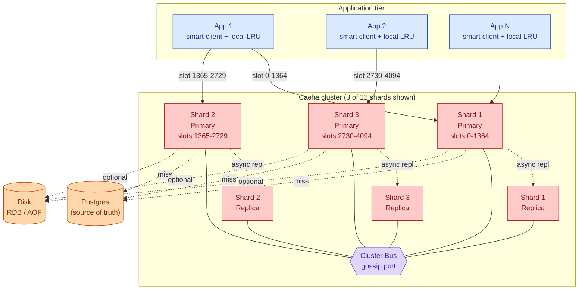
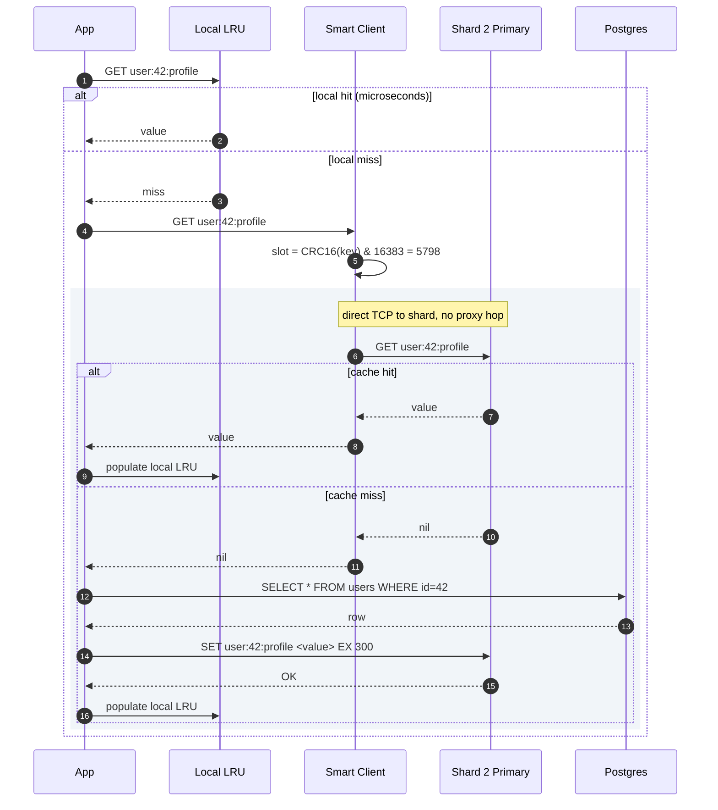
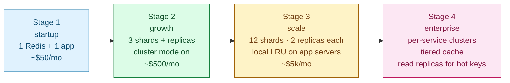

## Solution: Distributed Cache (like Redis or Memcached)

### The short version

A distributed cache is a fast in-memory key-value store split across many servers. The data is sharded (each server holds a slice) and replicated (each shard has a backup). A few hard problems are hiding inside: how to find a key when servers come and go, how to keep replicas close enough that failover loses little, how to evict data gracefully when memory fills, and how to survive the few keys that get all the traffic.

The standard shape is fixed hash slots (Redis Cluster uses 16,384 of them) spread across shards. Each shard has one primary and one or more replicas. A gossip protocol runs across all servers, sharing health and slot ownership. Clients are smart: they cache the slot map locally and route commands directly to the right shard.

Scale is not the hard part. A 12-shard cluster handles 3M ops/sec comfortably. The hard parts are the hot key that breaks one shard, the big key that blocks the event loop, and the resharding that has to happen without dropping traffic.

---

### 1. The two questions that matter most

**Is this a pure cache or the only copy of the data?** A pure cache can lose data on restart and on eviction. If Redis holds data that is nowhere else, you need persistence and `noeviction`. Two completely different designs wearing the same name.

**How strict is freshness?** If the app reads from replicas and can tolerate a few milliseconds of stale data, you get 2-3x read throughput per shard at almost no cost. If reads must see the latest write, every read goes to the primary and you lose that benefit.

Everything else (eviction policy, persistence tier, replication factor) follows from these two.

---

### 2. The math, in plain numbers

| Item | Value |
|------|-------|
| Sustained ops/sec | 1M |
| Peak ops/sec | 3M |
| Read-to-write ratio | 10:1 |
| Working set | 1 TB |
| Average value | 1 KB |
| Single-node Redis ceiling | ~150K ops/sec mixed get/set |

What this tells us:

- A 12-shard cluster is comfortable at peak. 6 shards is too tight.
- With replication factor 2 (one replica per shard), that is 24 servers total.
- Per server: ~170 GB primary data + 20% Redis encoding overhead = 200 GB target. A 256 GB instance fits.
- Network: ~110 MB/sec per server. Well under a 25 Gbps card.
- Connection state: ~1 GB per server for 50K client connections at 20 KB each.
- Bottleneck: per-shard CPU (single event-loop thread), not memory or network.

---

### 3. The API

Two commands carry almost every use case.

| Command | Semantics |
|---------|-----------|
| `GET key` | Return value or nil. O(1). |
| `SET key value [EX seconds] [NX\|XX]` | Write with optional TTL. `NX` = only if missing. `XX` = only if exists. O(1). |
| `MGET k1 k2 ...` | Batch get. All keys must hash to the same slot, or the client fans out. |
| `DEL key` | Delete. Returns 1 if existed. |
| `INCR key` / `INCRBY key n` | Atomic integer increment. Foundation for rate limiters and counters. |
| `EXPIRE key seconds` | Add TTL to an existing key. |
| `SCAN cursor [MATCH pattern]` | Cursored iteration. Never use `KEYS *` in production. |

Three cluster-specific behaviors every client must handle:

| Response | Meaning | Client action |
|----------|---------|---------------|
| `MOVED <slot> <host:port>` | Slot permanently on another server. | Update slot map, retry on new server. |
| `ASK <slot> <host:port>` | Slot mid-migration; this key is already on the new server. | Send `ASKING` then command to new server. Do not update slot map yet. |
| `READONLY` error | Tried to write to a replica. | Reroute to primary. |

---

### 4. The data model and memory layout

The conceptual model is a flat hash table: keys to values. The interesting engineering is how Redis encodes values to save memory.

**Object header.** Every Redis value has a small header: type tag, encoding, reference count, and a 24-bit "last access time" used for LRU/LFU sampling. About 16 bytes per object.

**Encoding choices.** Redis picks an encoding based on size:

| Type | Small encoding | Large encoding | Switch point |
|------|---------------|----------------|--------------|
| Short string (<= 44 bytes) | `embstr` (one allocation) | `raw` | 44 bytes |
| Small integer | `int` (no allocation) | `embstr` | Non-integer |
| Hash (small) | `listpack` (flat array) | `hashtable` | 128 entries or any field > 64 bytes |
| Sorted set (small) | `listpack` | `skiplist + hashtable` | 128 entries or any element > 64 bytes |

A 10-field hash as `listpack` takes ~200 bytes. The same hash as `hashtable` takes ~600 bytes. At 100M small hashes, that is 40 GB saved by staying in `listpack`.

**Expiration metadata.** Keys with TTL have an entry in a separate "expires" dictionary mapping key to expiration timestamp. Active expiration samples from this dictionary, not the whole keyspace.

<details markdown="1">
<summary><b>Show: full memory layout notes and Memcached slab allocator</b></summary>

**Memcached's slab allocator.** Memcached uses fixed-size slabs (64 B, 128 B, 256 B, ...). A 100-byte value goes into a 128-byte slab. Memory-efficient when value sizes cluster tightly. Wasteful when they vary widely. The "calcification" problem: once slabs are allocated to a size class, they cannot easily be reassigned. Traffic that shifts from small to large values leaves small slabs idle.

**Redis replication buffer.** The primary keeps a circular ring buffer (default 1 MB, configure to 256 MB or more in production) of recent writes. When a replica reconnects after a brief outage, it requests a partial resync from its replication offset. If the offset is still in the buffer, only the missed writes are sent (fast). If the offset has wrapped, a full RDB snapshot is sent (slow, can take minutes for a large dataset). Size the replication buffer so brief network blips do not trigger full resyncs.

</details>

---

### 5. The engine: consistent hashing and replication

**Slot assignment.**

```
slot = CRC16(key) & 16383
server = slot_map[slot]
```

The slot map is replicated across all servers via gossip. Clients also cache it locally. When topology changes, clients learn through `MOVED` responses on their next misdirected request.

**Hash tags.** `{user:42}:profile` and `{user:42}:settings` both hash on `user:42` (the text inside `{}`). Both land on the same slot. Multi-key operations (`MGET`, `MULTI`/`EXEC`) stay on one shard.

**Replication protocol.** Async by default. The primary appends every write to a replication backlog and replies to the client immediately. Replicas pull and apply. Lag at steady state: under 1ms intra-AZ. The client can call `WAIT <N> <timeout_ms>` to block until N replicas ack the write. Most cache workloads do not need this.

**Failover.** Gossip detects a dead primary in ~5-8 seconds (majority of primaries must agree). Replicas race to take over: the one with the smallest replication lag broadcasts a vote request. Primaries vote yes if they also see the old primary as dead and have not voted in this epoch. A majority vote promotes the winner. Total failover: 5-15 seconds.

---

### 6. The architecture



Five things to notice:

- Each app server holds a complete slot map and connects directly to the right shard. No proxy, no extra hop.
- Replicas are async. Failover loses the writes in the replication buffer at the moment the primary died, typically a handful of operations.
- The cluster bus runs on a separate TCP port (data port + 10000 in Redis). Gossip traffic does not compete with client traffic.
- Persistence is optional. Most caches do not persist. Some use RDB snapshots to seed a warm replica quickly after restart.
- The database is the source of truth. If the whole cache cluster dies, the app falls through to the database. Design the database to handle this.

---

### 7. A request, end to end



Recording a write follows the same path. The primary appends the command to its replication backlog, replies `+OK`, and the replicas pull and apply asynchronously. P99 for a GET is ~0.2ms in the same data center. For a SET it is ~0.3ms. The bottleneck is the single-threaded event loop, not network.

---

### 8. The scaling journey: 10 users to millions



#### Stage 1: startup (10-100 users)

One Redis server, no cluster mode, no replicas, no persistence (or RDB every 15 minutes). Inline cache-aside in the application. If Redis restarts, the cache is cold until traffic warms it. $50/month. Ship in a day.

This is the right answer for a new product. Over-engineering here is a waste.

#### Stage 2: growth (~10K users)

Something breaks: one Redis server can no longer hold the working set, or it is pegged at CPU. Enable Redis Cluster. Start with 3 shards (6 servers including replicas). Traffic stays alive during resharding if the client handles `MOVED`/`ASK`.

Also: wire up proper eviction policy (`allkeys-lru` for pure cache), set `maxmemory`, and alert on `used_memory > 80% of maxmemory`.

#### Stage 3: scale (100K-1M users)

Hot keys appear. A few endpoints dominate traffic. One shard shows 2x the ops/sec of others.

Fix order:

- Add a small in-process LRU on every app server (caffeine in Java, cachetools in Python, 1,000 entries, 5-second TTL). The hottest 1% of keys stop reaching the cluster.
- Enable replica reads for read-heavy endpoints. `READONLY` connections to replicas effectively double or triple per-shard read throughput.
- Grow to 12 shards if per-shard ops/sec still exceeds 150K. Rolling reshard; no downtime.

Also at this stage: move audit-critical writes to `WAIT 1 100ms` so at least one replica has the value before you reply to the user.

#### Stage 4: enterprise (millions of users)

Split one monolithic cluster into per-service clusters. The news feed cluster, the session cluster, and the rate-limit cluster each have their own sizing, eviction policy, and on-call rotation. Blast radius shrinks.

Introduce a tiered cache: in-process LRU (L1) → Redis cluster (L2) → database (L3). Instrument each tier separately. A drop in L2 hit rate means something different from a drop in L1 hit rate.

For extreme hot keys (celebrity events, sports scores), consider key splitting: store the same value under N keys with different slot suffixes and have the client pick a random one. Spreads load across N shards.

---

### 9. The five hard problems

#### Hot key (500K req/s on one key)

Symptoms: that shard's CPU at 100%. Other shards idle. P99 for all keys on that shard climbs.

Mitigations in order of cheapness:

1. In-process LRU on app servers. A 100-entry LRU with a 5-second TTL absorbs over 99% of traffic. The single biggest win.
2. Replica reads for that key. With 2 replicas, triple the read throughput. Accept slightly stale values.
3. Key splitting: store the value under `hot_key:0` ... `hot_key:7`, each on a different slot. Client picks a random suffix. Every write must update all 8 copies. Use only for extreme cases.
4. Request coalescing on app servers: if many goroutines need the same expired key, only one fetches it; the others wait on a local lock.

#### Big key (sorted set with 2M entries)

`ZRANGE 0 -1` on 2M entries blocks the single-threaded event loop for ~800ms. Every other key on that shard stalls.

Prevention: cap at the application layer. Reject writes that would push a set past 10K entries, or split into smaller sets. Track key sizes with `MEMORY USAGE key`. Alert on outliers.

Recovery once the key exists: use `UNLINK` (not `DEL`). `DEL` on a 2M-element set is itself a multi-second blocking call. `UNLINK` (Redis 4+) moves deallocation to a background thread. To break the key apart, iterate with `ZSCAN` in batches and write chunks to new keys, then `UNLINK` the original.

#### TTL stampede

1M keys all given `EX 60` during a bulk import. At t=60s, active expiration fires on all of them at once. CPU spikes. The application's "regenerate on miss" path hammers the database simultaneously.

Fix without changing the TTL value: add jitter at write time. `EX (60 + random(0, 30))`. Spreads expirations over 30 seconds. 1M keys / 30s = 33K expirations/sec. Active expiration handles this without spiking.

#### Cache stampede

A popular key expires. 10,000 concurrent requests miss and hit the database. The database melts.

Standard four-layer defense:

1. **Request coalescing.** Per-key in-process lock. First request fetches and writes the cache; concurrent requests wait. Reduces 10K DB calls to 1 per app server.
2. **Stale-while-revalidate.** Serve the expired value for a short grace window (2-5 seconds) while one goroutine fetches the new value asynchronously. Application tolerates a few seconds of staleness.
3. **Probabilistic early expiration (XFetch).** A small fraction of reads near the TTL boundary trigger an early refresh. One client refreshes while others serve the still-valid value.
4. **Jittered TTLs (prevention).** Stagger writes so keys do not expire simultaneously.

#### Resharding (6 to 12 shards)

1. Bring up 6 new primaries + 6 replicas. Empty. Introduce them to the cluster with `CLUSTER MEET`.
2. Plan migrations: each of the 6 old shards gives half its slots to a new shard.
3. Migrate slot by slot with `MIGRATE`. Each key moves atomically. Source responds `ASK` for in-flight keys. After migration, source responds `MOVED` and clients update their slot map.
4. Throttle migration to ~5% CPU overhead on source and destination.

Traffic stays live throughout. Tail latency spikes slightly from redirect overhead. Hit rate dips a few percentage points during migration. Application sees no errors if the client handles `ASK`/`MOVED`. Migration time for 100 GB per shard at 50 MB/sec: ~30 minutes. All 6 shards migrate in parallel.

---

### 10. Reliability

**Crash mid-write.** The primary writes to memory and immediately replies `+OK`. If it crashes a millisecond later, that write is in memory but not yet replicated and not on disk (unless AOF is enabled). Writes since the last replication sync are lost. For a pure cache, this is acceptable. For stateful data, use AOF with `everysec`.

**Replica falls behind.** Replication backlog overflows. The replica needs a full resync (RDB snapshot of the entire dataset shipped over the network). During resync, the replica serves reads from its old snapshot (stale). Set the replication buffer large enough that brief network blips do not trigger full resyncs. Default is 1 MB. Production minimum is 256 MB. Common to set 1 GB.

**Cluster-wide reboot.** Without persistence, every shard comes back empty. The database absorbs the entire working set as cache misses. If the database cannot handle cold-cache load, either enable RDB persistence on Redis (to restore a warm snapshot after restart) or design the database for this scenario explicitly.

**Persistence options.**

| Mechanism | Latency cost | Data loss window |
|-----------|-------------|-----------------|
| None | Zero | Everything on restart |
| RDB snapshot (every 5 min) | Brief CPU spike during fork | Up to 5 minutes |
| AOF (`everysec`) | ~1ms per write | Up to 1 second |
| AOF (`always`) | ~5ms per write (fsync every command) | Near zero |

For pure cache: no persistence. The database is the source of truth. For slow-to-warm caches: RDB every 5 minutes. For stateful Redis (counters, rate limiters, session store): AOF with `everysec` plus replicas.

---

### 11. Observability

| Metric | Why it matters | Alert threshold |
|--------|---------------|-----------------|
| `ops_per_sec` per shard | Detects hot shards | Shard at >2x cluster median |
| `latency_p99` per shard | Slow shard (big key, CPU pressure) | >10ms |
| `cache_hit_rate` | Cache effectiveness | Drop >10 percentage points |
| `used_memory` vs `maxmemory` | Eviction headroom | >80% |
| `evicted_keys_per_sec` | Eviction pressure | Spike from baseline |
| `replication_lag_sec` | Replica freshness | >1 second sustained |
| `mem_fragmentation_ratio` | Allocator waste (rss/used) | >1.5 |
| `slowlog_count` | Commands past 10ms threshold | Any sustained appearance |
| `cluster_state` | Cluster health | Anything other than "ok" |

Page on: `cluster_state != ok`, `replication_lag > 5s`, P99 latency > 20ms, ops/sec drop > 50%.

Ticket on: hit rate drop > 10 points, eviction spike, fragmentation > 1.8.

---

### 12. Follow-up answers

**1. Hot key (500K req/s).**

First, add a small in-process LRU on each app server (1,000 entries, 5s TTL). At 1,000 app servers, 500K req/s becomes 500 req/s reaching the cluster. That is the cheapest fix. If that is not enough, enable `READONLY` replica reads for that key (spreads load across replicas). If still not enough, split the key into N variants and have the client pick a random one per request.

**2. Big key.**

Do not delete with `DEL`. On a 2M-entry sorted set, `DEL` itself blocks for seconds. Use `UNLINK`, which moves deallocation to a background thread. To break the key apart, read with `ZSCAN` in batches of 100, write chunks to new keys, then `UNLINK` the original. Prevention: cap at write time. Reject writes that would push a collection past 10K entries.

**3. TTL stampede.**

At t=60s, active expiration tries to delete all 1M expired keys at once, spiking CPU. Simultaneously, application cache-miss handlers all fire and hit the database. Fix: add jitter at write time. Instead of `EX 60`, use `EX (60 + random(0, 30))`. Expirations spread over a 30-second window.

**4. Persistence choice.**

Use nothing for a pure cache where the database can handle cold-start load. Use RDB snapshots (every 5-15 minutes) when the cache takes hours to warm, so a restart does not cause a long recovery period. Use AOF with `everysec` when Redis holds stateful data (counters, session tokens). Use AOF with `always` only for the rare keys that need near-zero loss, and accept ~10x lower throughput on those writes.

**5. Resharding (6 to 12).**

Bring up 6 new primaries + 6 replicas. Use `redis-cli --cluster rebalance` to plan and execute slot migrations. Each slot migration is atomic: keys move one by one, `ASK` redirects serve in-flight requests, `MOVED` follows after full migration. Throttle to ~5% CPU overhead. Total time: ~30 minutes for a 1 TB cluster at 50 MB/sec sustained transfer rate. Zero downtime if the client library handles redirects correctly.

**6. Network partition (two servers isolated).**

The isolated pair cannot get a majority vote for any failover or leadership claim. They refuse to promote themselves. If they are primaries, they see they cannot reach enough peers and eventually stop accepting writes (if `min-replicas-to-write` is set) or continue accepting writes that will be discarded on partition heal (if not). When the partition heals, they gossip in, see their epochs are stale, and demote themselves to replicas of the promoted servers. No split-brain because majority is required for all decisions.

**7. Memory fragmentation ratio 1.8.**

`rss / used = 1.8` means the OS sees Redis using 1.8x what Redis itself tracks. The 80% gap is allocator fragmentation: jemalloc holds free chunks it cannot return to the OS because of scattered small allocations between larger ones. Causes: mixed value sizes, high churn of keys with TTL. Fixes: enable `activedefrag yes` (background defragmenter, ~5% CPU), or plan a rolling restart (flush the old instance, let the replica take over, restart the former primary fresh). Above 1.5 investigate. Above 2.0 act immediately.

**8. Cache stampede.**

Two defenses that work together. Request coalescing: use a per-key mutex on each app server so only one goroutine fetches the new value, others wait. Stale-while-revalidate: serve the just-expired value for 2-5 seconds while one goroutine fetches asynchronously. For prevention, add jitter to TTLs so popular keys do not expire simultaneously. In high-stakes cases, implement probabilistic early expiration (XFetch): occasionally refresh a key a few seconds before it expires so expiry is never a surprise.

**9. Read-after-write.**

The write went to the primary. The read was routed to a replica that had not yet received the replication update. Replication lag is usually under 1ms intra-AZ but can spike under load or during a resync. Fix: route reads to the primary for code paths that require read-after-write consistency. Or use `WAIT 1 100` after the write to block until at least one replica has acked before reading from that replica. Accept eventual consistency everywhere else.

**10. Hit rate crash (95% to 60%).**

Investigate in this order:

1. `evicted_keys_per_sec` spiking? Working set grew or maxmemory shrank. Common cause: new feature writing more keys, or a new service sharing the same cluster.
2. Did any TTLs shorten? Even cutting from 300s to 60s collapses hit rate on long-tail keys.
3. New key naming convention in a deploy? If the app started writing `v2:user:42:profile` instead of `user:42:profile`, old warm keys are stranded and never read again.
4. Cluster degraded? `CLUSTER INFO` will show. During failover, some slots have no primary for 5-15 seconds. Misses pile up.
5. Resharding in progress? `MOVED` redirects during migration add latency and occasionally cause client-side misses if the client does not handle `ASK` correctly.

---

### 13. Trade-offs worth saying out loud

**Redis vs Memcached.** Memcached is multi-threaded per process (scales to all cores) and has lower per-key overhead (slab allocator, no encoding metadata). Redis is single-threaded per event loop but supports TTL, data structures, atomic counters, persistence, pub/sub, and cluster mode. Use Memcached for a pure key-value cache where you want maximum density and the simplest operational model. Use Redis for almost everything else.

**Smart client vs proxy.** A proxy (like Twemproxy) is simpler for the client but is a single point of failure and does not support live resharding. Smart clients (Lettuce, Jedis, redis-py-cluster) handle `MOVED`/`ASK` transparently and support cluster mode fully. Proxies linger in legacy systems. New deployments use smart clients.

**Why single-threaded?** Every Redis command is atomic against the keyspace by construction. No locks needed. A slow command blocks everything, but that is a disciplinary problem (cap value sizes, ban `KEYS *`, watch slowlog). Redis 6+ added I/O threads for parsing and writing, but command execution stays serial.

**Multi-region cache.** Almost always wrong. The cache should be regional. Cross-region cache replication adds latency and consistency problems for a layer that is designed to be lossy. Let the database handle multi-region durability.

**What to revisit at 10x scale.** Move from one monolithic cluster to per-service clusters (smaller blast radius, independent tuning). Add a tiered cache (L1 local LRU, L2 Redis, L3 database) with metrics at each tier. For the highest-traffic keys, consider a dedicated Memcached cluster if Redis data structures are not needed.

---

### 14. Common mistakes

**"Redis stores things in memory."** True and irrelevant. The question is the cluster. Skip to partitioning.

**Modulo hashing.** Falls apart on every cluster size change. Adding one server re-assigns 85% of keys at once, causing a mass cache miss storm. Always say consistent hashing or hash slots.

**Consistent hashing without virtual nodes.** Consistent hashing alone gives uneven distribution. The interviewer waits for "virtual nodes" or "16,384 hash slots."

**Confusing expiration and eviction.** TTL fires per-key when the timer runs out. Eviction fires globally when memory hits `maxmemory`. Different mechanisms. Different policies. Both matter.

**Recommending true LRU.** A doubly-linked list across 100M keys uses 1.6 GB of pointer overhead. Approximated LRU (sample 5, evict the oldest) is the right answer, and naming the cost shows you understand the trade-off.

**No hot key answer.** The interviewer will ask. In-process LRU plus replica reads is the standard answer. Name both.

**Forgetting big key.** A sorted set with millions of entries blocks the single-threaded event loop on any O(N) command. If you bring this up unprompted, you are clearly above the bar.

**Sync replication everywhere.** Doubles write latency for operations that almost never need it. Default to async. Opt into `WAIT` per call for the few writes that matter.

**Cache stampede as "we'll use TTLs."** TTLs cause stampedes. The fix is jitter plus request coalescing. Name the mechanism.

**No persistence story.** Even if the answer is "none," say so and explain why. The interviewer wants to hear that you reasoned about it.

The spine of a strong answer: hash slots plus smart client, replication-and-failover narrative, eviction policy choice, hot key mitigation. Candidates who cover all four and explain the trade-offs are clearly above the bar.
