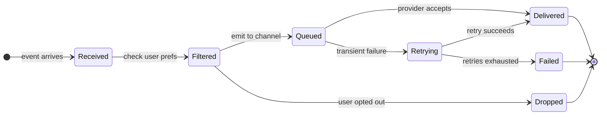
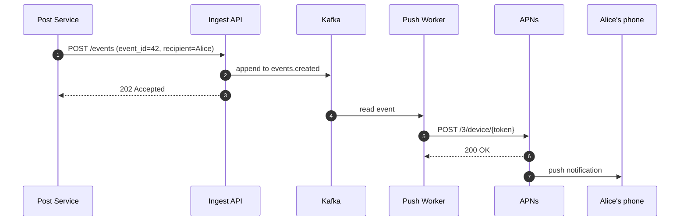
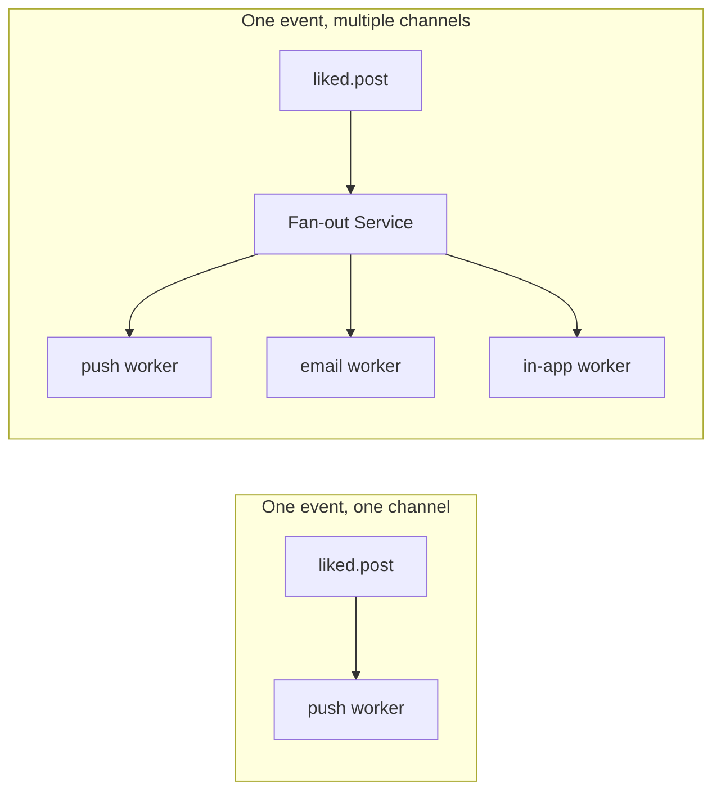
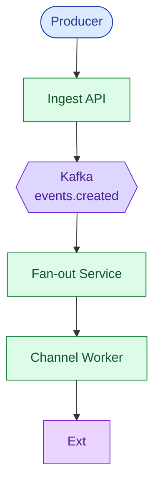
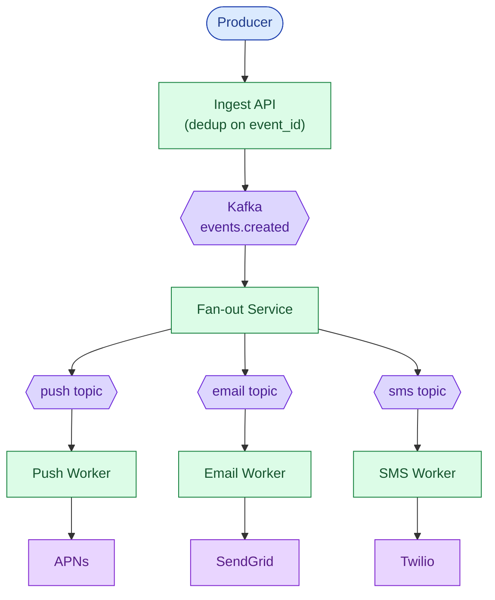
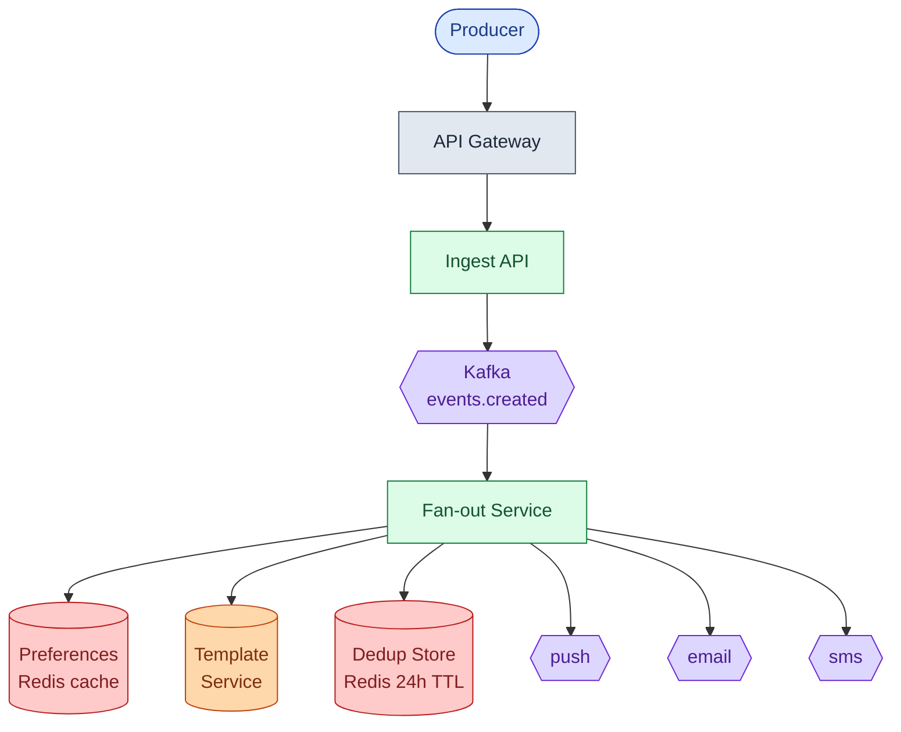
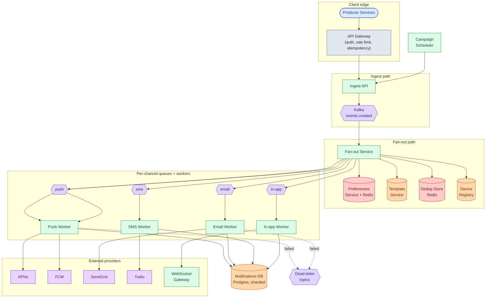
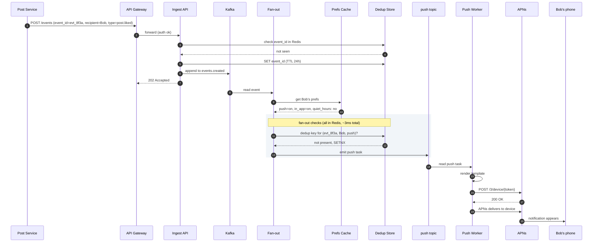
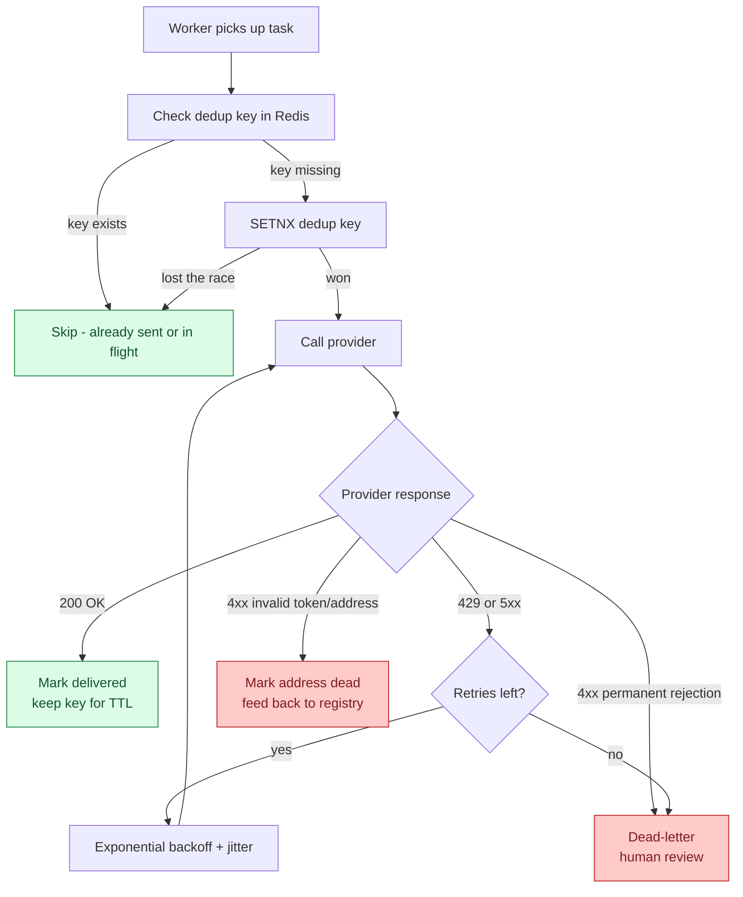

## The scene

You sit down. The interviewer leans forward.

> *"Every time Alice likes your photo, you get a push. Every time your invoice is ready, you get an email. Every time your Uber driver is three minutes away, you get an SMS."*
>
> *"One event comes in. The right notifications go out. Design the system that does this at a billion users."*

It sounds like "read from a queue, call Apple's push service, done." It is not.

The trap is the word **one**. One event is not one notification. One event can become zero notifications (the user turned everything off), one notification (a single SMS), or ten million notifications (a marketing blast). The system has to handle all three shapes without operators tuning it by hand.

Two problems collide here. **Fan-out:** one input event produces many output messages, like one "Black Friday sale" event going to ten million recipients. And **external delivery:** your code does not deliver the push. Apple does. Or Google. Or SendGrid. Or Twilio. Each has its own failures, its own rate limits, its own error codes.

Get fan-out wrong and you wake users up at 3am. Get retries wrong and you either drop notifications silently or send the same SMS seven times.

We will build this from a tiny startup up to a billion-user product, adding one layer at a time.

---

## Step 1: Picture one notification

Before any boxes, picture what one notification actually is. One event. One recipient. One channel.



That is the whole product. Everything we add later (fan-out, aggregation, quiet hours, rate limits) is a complication on top of this single path.

> **Take this with you.** A notification system is a pipeline. The hard part is not moving the message. The hard part is deciding whether to move it at all, and what to do when the provider fails.

---

## Step 2: Ask the right questions

In a real interview, sit quietly for two minutes. Write down the questions whose answers change the whole design. Not every edge case. Five good questions.

<details markdown="1">
<summary><b>Show: 5 questions that change the design</b></summary>

1. **Which channels?** Push (iOS and Android), email, SMS, in-app? *Each channel is a different external service with different error codes and rate limits. The design has to treat channels as plug-ins, not bake one in.*

2. **What kinds of events trigger notifications?** User activity (Alice liked your post), system events (your invoice is ready), or marketing campaigns? *Marketing is a totally different shape. One operator click can target 10 million users. Transactional goes to one user at a time. They need separate paths.*

3. **Can users turn things off?** Per channel? Per event type? Quiet hours? *Preferences are the number-one source of "why did I get this?" complaints. They must be checked before fan-out, not after.*

4. **What is the freshness deadline per channel?** Push in under a minute? Email in under five minutes? *A two-hour-old "your driver arrived" push is junk. A weekly digest email can wait an hour. Different deadlines change the retry policy completely.*

5. **What if the same event arrives twice?** A producer service retried because of a network blip. Do we send the notification twice? *This decides whether we need idempotency keys throughout the pipeline.*

The meta question: *"Is notifications a separate service or part of the product service?"* The right answer is separate. Product services emit events. A notification service consumes them.

</details>

---

## Step 3: How big is this thing?

Same product, two very different scales.

| Company | Users | Notifications/day | Per second (sustained) | Peak burst |
|---------|-------|-------------------|------------------------|------------|
| Startup | 100k | ~1 million | ~12 | ~50 |
| Billion-user product | 1 billion | ~10 billion | ~116,000 | ~350,000 |

<details markdown="1">
<summary><b>Show: how the numbers come out</b></summary>

**Startup: 100k users.**

Assume 10 notifications per user per day on average. That is 1 million per day, or about 12 per second. Even with a 4x peak, a single server handles this easily.

**Billion-user product: 10 billion per day.**

10 billion / 86,400 seconds = ~116,000 per second sustained. Peak is roughly 3x that, ~350,000/sec.

Per-channel split:

| Channel | Share | Sustained QPS |
|---------|-------|---------------|
| Push    | 60%   | ~70,000/sec |
| In-app  | 30%   | ~35,000/sec |
| Email   | 7%    | ~8,000/sec  |
| SMS     | 3%    | ~3,500/sec  |

**Marketing campaign burst.**

One campaign targeting 10 million users sent in 5 minutes: 10M / 300 seconds = ~33,000/sec for those 5 minutes. A 30% spike on top of the baseline.

**Storage for delivery records over 30 days.**

One row per delivered notification is about 120 bytes. 10 billion × 120 bytes = 1.2 TB per day. Over 30 days: 36 TB. Spread across 64 database shards, that is ~600 GB per shard.

**The number that matters.** Throughput is not the hard part. A well-partitioned Kafka cluster handles 116,000/sec easily. The hard parts are:

1. Fan-out per event ranges from 0 to 10 million. The system must handle that range without operators adjusting settings per campaign.
2. External providers are slow and lossy. You have to retry without sending duplicates.
3. Preferences must be checked cheaply for every single notification in the hot path.

</details>

---

## Step 4: The smallest thing that works

Forget a billion users. We are a startup. One event type: "someone liked your post." One channel: push. One external provider: APNs.

Three boxes. Nothing else.


One event, all the way to the device:



<details markdown="1">
<summary><b>Show: the minimal table</b></summary>

```sql
CREATE TABLE notifications (
    notification_id   UUID PRIMARY KEY,
    event_id          UUID NOT NULL,
    recipient_user_id BIGINT NOT NULL,
    channel           TEXT NOT NULL,
    status            TEXT NOT NULL,   -- 'queued', 'sent', 'failed'
    created_at        TIMESTAMPTZ DEFAULT NOW(),
    sent_at           TIMESTAMPTZ
);
```

One table. This is the right place to start. Everything we add from here will be a response to a real problem.

</details>

> **Take this with you.** Always start from the smallest thing that works. The interesting part of the interview is what happens **next**.

---

## Step 5: The first crack

The next morning, the product manager walks in: *"We want to send the same 'liked your post' notification via email for users who opted out of push. And we want to send a welcome email to every new signup. Oh, and a weekly digest."*

You look at your code. The word `push` is baked in everywhere. If you add email by copy-pasting the push worker, you will add SMS the same way next month, then in-app, and you will end up with four nearly-identical workers sharing no code, with different bugs in each.

The real problem: one event can now produce different notifications for different channels. You have a **fan-out** problem.



The Fan-out Service is where the decision lives: *for this event, for this user, on which channels?* That question touches preferences, quiet hours, and the per-user rate cap. It belongs in one place, not scattered across four workers.

<details markdown="1">
<summary><b>Show: the Fan-out Service decision logic</b></summary>

```python
def fan_out(event):
    for recipient in event.recipients:
        prefs = preferences.get(recipient.user_id)   # Redis cache hit

        for channel in ["push", "email", "sms", "in_app"]:
            if not prefs.channel_enabled(channel):
                continue
            if not prefs.category_enabled(channel, event.category):
                continue
            if is_quiet_hours(recipient.user_id, channel):
                maybe_defer(event, recipient, channel)
                continue
            if hourly_cap_exceeded(recipient.user_id, channel):
                continue

            emit_to_channel(channel, event, recipient)
```

Five checks. Each one a reason to stop. If all five pass, the notification is emitted to the per-channel queue. The channel worker then handles delivery, retries, and failure.

</details>

> **Take this with you.** Fan-out is its own service. Once you add a second channel, preferences and quiet hours live in the fan-out layer, not inside each channel worker.

---

## Step 6: Build the architecture, one layer at a time

We now have a Fan-out Service. Build the rest of the system around it, one layer at a time.

### v1: just the pipeline



Fine for a startup. One channel, one worker pool.

### v2: multiple channels, separate queues

Each channel has its own queue and its own worker pool. If SendGrid goes down, email backs up but push keeps flowing.



### v3: preferences, templates, dedup

The fan-out check needs three things at hot-path speed: user preferences, message templates, and a dedup store. All three belong in Redis.



### v4: the full system

Add the delivery log, a device registry, dead-letter queues, and a separate Campaign Scheduler for marketing blasts.



Each box in one line:

| Box | What it does |
|-----|--------------|
| **API Gateway** | Authenticates producers, rate-limits, checks idempotency keys. |
| **Ingest API** | Schema check, dedup on `event_id`, appends to Kafka. |
| **Fan-out Service** | Checks preferences, quiet hours, per-user cap, aggregation windows. Emits per-channel tasks. |
| **Preferences Service** | Per-user opt-ins, quiet hours, timezone, locale. Backed by Postgres, cached in Redis. |
| **Template Service** | Versioned, localized message templates. Renders variables at fan-out time. |
| **Dedup Store** | Redis with 24h TTL. Key = `event_id + recipient + channel`. Stops duplicates across retries. |
| **Device Registry** | Maps user_id to active push tokens. Fan-out turns "send to user 456" into device tokens. |
| **Channel Workers** | Render the message, call the provider, record the result, handle retries. |
| **Notifications DB** | Delivery log. Every notification row: status, timestamps, provider message ID. |
| **Campaign Scheduler** | Expands a segment query into individual events and feeds them into the ingest path at a controlled rate. |
| **Dead-letter topics** | Notifications that failed all retries. Auto-cleans invalid tokens; surfaces others to human review. |

> **Take this with you.** If SendGrid goes down at 3am, push and SMS keep flowing. Each channel has its own queue. One bad provider cannot drag down the others.

---

## Step 7: One event, all the way through

Alice likes Bob's photo. Bob has push and in-app enabled. He is in Los Angeles (not in quiet hours).



Three things to notice:

1. The dedup check at the Ingest API catches producer retries early, before any fan-out work happens.
2. The fan-out checks (preferences, quiet hours, dedup) all hit Redis. No Postgres in the hot path.
3. The push worker talks to APNs over a persistent HTTP/2 connection. One worker holds many open streams, not one connection per notification.

---

## Step 8: Retry, dedup, and dead-letter

External providers fail. APNs returns 429 when you push too fast. SendGrid returns 5xx during incidents. Twilio rejects messages to invalid numbers. The design must tell "try again later" from "give up forever" without sending duplicates.



<details markdown="1">
<summary><b>Show: per-channel retry policy</b></summary>

Every provider response falls into one of three buckets:

| Bucket | Signal | Action |
|--------|--------|--------|
| Transient | 429, 5xx, timeout | Retry with exponential backoff + jitter |
| Permanent invalid recipient | APNs `Unregistered`, FCM `NotRegistered`, Twilio invalid number, email hard bounce | No retry. Mark address dead. |
| Permanent rejection | Content flagged, sender blacklisted | No retry. Dead-letter for human. |

Per-channel retry windows:

| Channel | Max retries | Max window | Reason |
|---------|-------------|-----------|--------|
| Push | 5 | 60 seconds | A two-hour-old "driver arrived" push is useless |
| In-app | 3 | 7 seconds | If the app is open, it needs to appear now |
| Email | 8 | 24 hours | SendGrid outages can last hours; email is store-and-forward |
| SMS | 3 | 5 minutes | Short; SMS must be timely |

**Why jitter?** If 1,000 workers all wait exactly 8 seconds after a 429, they all hit the provider at the same instant and cause another 429. Adding a random offset (say, 8 ± 2 seconds) spreads the retries out.

**Push token cleanup.** When APNs returns a dead-token signal (HTTP 410), the push worker writes to a `push_token_invalidations` Kafka topic. A small consumer marks the token as `invalid` in the device registry. Future fan-outs skip that token.

</details>

> **Take this with you.** 4xx means "stop retrying." 5xx means "try again later." Getting these two buckets mixed up turns one bad address into a million pointless API calls.

---

## Step 9: Aggregation, quiet hours, and per-user caps

Notifications are the fastest way to make users uninstall your app. Three guardrails, each enforced in the Fan-out Service.

<details markdown="1">
<summary><b>Show: aggregation windows</b></summary>

**The problem.** Alice's post goes viral. Bob gets 100 "Alice liked your post" notifications in one hour. Each fires its own event.

**The fix.** Events that can be batched carry an `aggregation_key` like `post:789:likes`. Fan-out checks Redis:

1. No open window: `SETEX agg:post:789:likes 3600 1`. Schedule a "close" message for 60 minutes from now.
2. Window exists: `INCR agg:post:789:likes`. Emit nothing.
3. At window close: read the count and the actor list. Emit one notification: *"Alice and 99 others liked your post."*

The template renders differently based on count: one actor, two named actors, or "N and M others."

One subtle edge case: the window starts on the first event. If Bob gets one like at T=0 and 99 likes at T=3,599, he gets one aggregated notification at T=3,600. If the 99 likes arrive after the window closes, he gets two: the first batch, then a new window starting. This is expected behavior for tumbling windows. Rolling windows (where the window extends on each new event) are an option but are harder to implement correctly.

</details>

<details markdown="1">
<summary><b>Show: quiet hours and per-user caps</b></summary>

**Quiet hours.** Each user's preferences include their timezone and a do-not-disturb window (like 22:00 to 07:00 local time). Fan-out converts the current UTC time to the user's local time and checks the window.

If we are inside the quiet window:

- **Transactional** (2FA, invoice, security alert): send immediately. Quiet hours do not apply.
- **Marketing**: drop. A "lunch deal: $5 off until 3pm" notification delivered at 8am the next day is stale and annoying.
- **Social** (likes, comments, follows): defer to a delayed topic. The user gets a digest when quiet hours end.

**Per-user cap.** A Redis sliding-window counter per `(user_id, channel)`:

```
INCR notifications:hourly:user_456:push
EXPIRE notifications:hourly:user_456:push 3600
```

If the counter exceeds the cap (say 20/hour for push, 5/hour for SMS), drop or defer the notification.

Why per-channel and not just per-user? Because SMS costs about $0.01 each and push costs near zero. The caps should reflect cost and intrusiveness, not just count.

Transactional notifications bypass the cap entirely. They are tagged `category=transactional` and the check skips them.

</details>

> **Take this with you.** Aggregation, quiet hours, and per-user caps all belong in the Fan-out Service, not scattered across individual channel workers. The Fan-out layer is the one place that sees every notification for every user before it goes anywhere.

---

## Follow-up questions

Try answering each in 2 or 3 sentences before opening the solution.

1. A producer service retries `event_id=42` because of a network blip, sending it twice within 100ms. Walk through how the system avoids sending duplicate notifications. What if the second retry comes 25 hours later, after the dedup TTL expires?

2. A marketing campaign is supposed to target 10 million users but the operator accidentally targets 100 million. How do you stop it mid-flight? What state has to be torn down?

3. APNs is down for 30 minutes. What happens to push notifications during the outage? What happens when it comes back? Do users see a flood at recovery?

4. A user updates their notification preferences to opt out of marketing. A marketing campaign was already queued and is mid-fan-out. Which notifications still go out?

5. A user has 5 devices. They do something that triggers a notification to themselves (like "your scheduled post just went live"). How many push notifications? On which devices? What if one device is signed out?

6. You discover a template bug: it sends literal `{{name}}` instead of the user's name. How do you roll back? What about messages already sent?

7. The notifications database shows one shard much hotter than the others. Diagnose.

8. A user complains they got an SMS at 4am. Trace the path. Who is responsible? How do you reproduce it?

9. Web push (browser-based notifications) needs to be added as a new channel. What changes in the architecture? What stays the same?

10. Compliance asks: prove that user 12345 received exactly the notifications we claim, and no others. What is your audit trail? How long do you keep it?

---

## Related problems

- **[News Feed (002)](../002-news-feed/question.md).** The fan-out worker pattern is the same. The celebrity problem (one author with millions of followers) maps onto the marketing campaign problem here (one event targeting millions of recipients).
- **[Rate Limiter (004)](../004-rate-limiter/question.md).** The per-user notification cap is exactly a rate limiter scoped to a user. The sliding-window counter and token-bucket variants apply directly.
- **[Chat System (003)](../003-chat-system/question.md).** Push notification delivery to mobile devices is the same problem as chat message delivery. APNs and FCM are the same tools, and the device-token lifecycle is shared.
- **[Distributed Cache (009)](../009-distributed-cache/question.md).** Preferences and dedup state both live in Redis with TTL. Hot-key and eviction behavior matters here too.
- **[Approval Management (011)](../011-approval-management/question.md).** Every approval event fires off notifications. The fan-out, retry, and quiet-hours machinery here consumes the approval engine's events.
