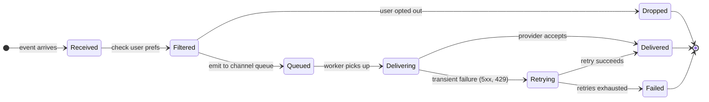
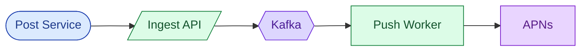
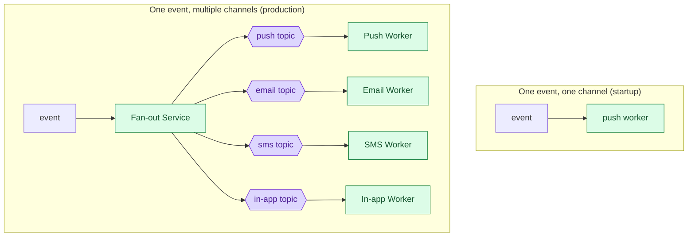
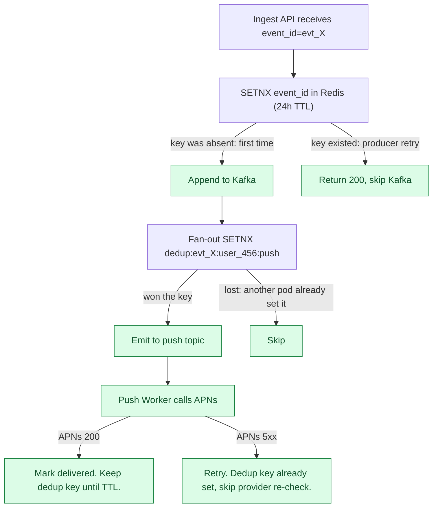
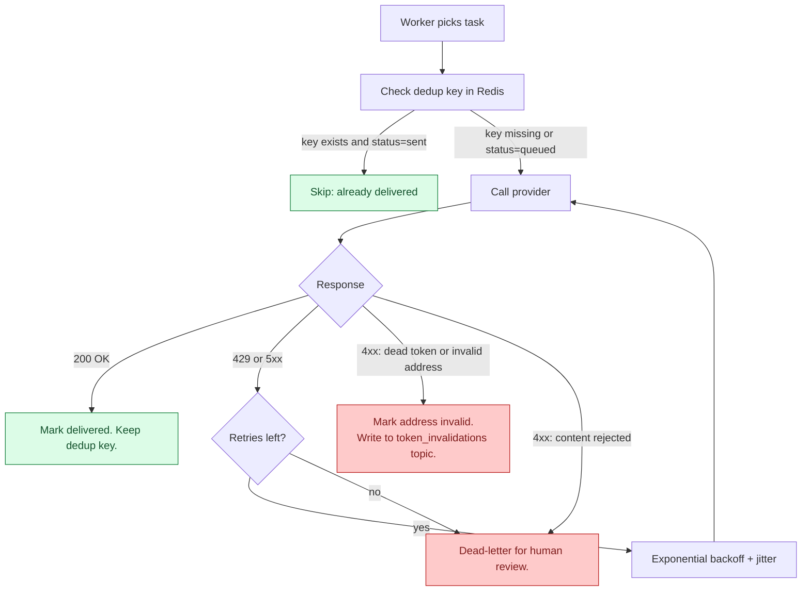
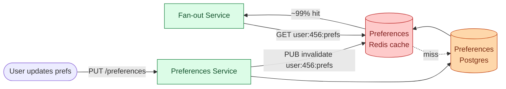
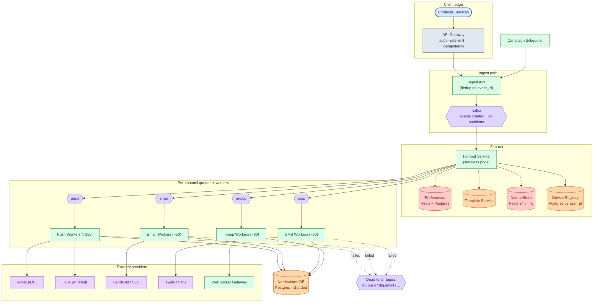
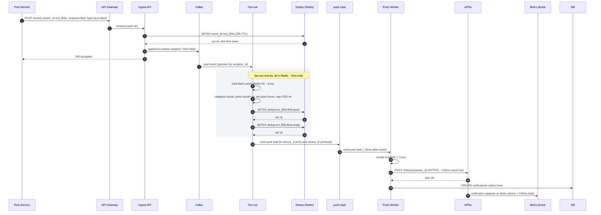
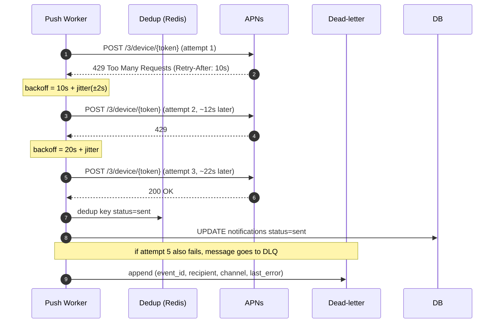
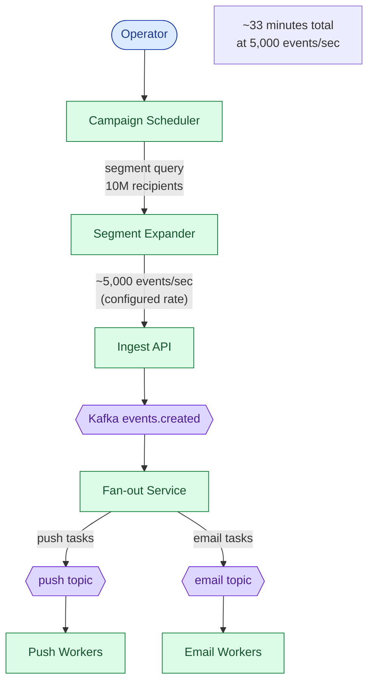

## What we are building

Alice replies to Bob's comment. A single database write in the Post Service needs to reach Bob's phone as a push notification, his inbox as an in-app banner, and possibly his email, all within a few seconds, in the right language, only if he has not turned that channel off, only if it is not 3 a.m. in his timezone, and never more than once even if the upstream service retried the event.

That is the notification system. One event fans out into zero, one, or many notifications across four channels (iOS push, Android push, email, SMS), each delivered through a third-party provider that has its own quotas, its own error codes, and its own reliability profile.

The product looks like a thin wrapper around three `POST` calls. The hard part is everything around the call itself.

There are five real problems hiding here:

1. **Fan-out shape.** A social event goes to one user. A marketing blast goes to ten million. The system has to handle both without manual tuning.
2. **Channel isolation.** If SendGrid goes down, email delivery should back up without touching push or SMS.
3. **Retry without duplication.** A provider returns 5xx. Retry is correct. But if the retry fires twice, the user gets two SMS messages. Dedup keys must follow the message all the way to the provider call.
4. **Quiet hours and per-user caps.** The system must enforce these at fan-out time, not inside each channel worker.
5. **Dead token and invalid address cleanup.** APNs tells you a push token is dead. If you ignore it and keep sending, APNs throttles you account-wide.

We will start with a single event to a single user. Then we add one layer at a time as each problem appears.

---

## The lifecycle of one notification

Before drawing boxes, picture one notification's path from event to device.



A notification spends most of its life moving between `Queued`, `Delivering`, and `Delivered`. `Dropped` and `Failed` are the failure modes worth designing for.

> **Take this with you.** A notification is not just a message delivery. It is a policy decision (should we send at all?) followed by a delivery attempt with retry semantics. Both halves need their own design.

---

## How big this gets

| Input | Number |
|-------|--------|
| Users | 1 billion |
| Notifications per day | ~10 billion |
| Channel split | 60% push, 30% in-app, 7% email, 3% SMS |
| Marketing campaign burst | 10 million recipients in 5 minutes |
| Delivery latency target (push) | < 60 seconds P99 |
| Audit log retention | 30 days hot, 7 years cold |

<details markdown="1">
<summary><b>Show: derived throughput and storage numbers</b></summary>

| Metric | Value | How |
|--------|-------|-----|
| Sustained QPS, all channels | ~116,000/sec | 10B / 86,400 |
| Peak QPS (3x burst) | ~350,000/sec | marketing campaigns on top of baseline |
| Push worker count at sustained load | ~230 | 500 provider calls/sec per worker |
| Storage per notification row | ~120 bytes | UUID, status, timestamps, provider_msg_id |
| Storage per day | ~1.2 TB | 10B × 120 bytes |
| 30-day hot storage | ~36 TB | spread across 64 Postgres shards, ~600 GB each |

Per-channel sustained QPS:

| Channel | Share | QPS |
|---------|-------|-----|
| Push (iOS + Android) | 60% | ~70,000 |
| In-app | 30% | ~35,000 |
| Email | 7% | ~8,000 |
| SMS | 3% | ~3,500 |

**The number that matters.** The sustained QPS is not the hard ceiling. Kafka handles 116,000/sec without breaking a sweat. The ceiling is the per-account quotas at each provider: APNs throttles per HTTP/2 connection per certificate, Twilio per sender number, SendGrid per sub-account. At scale you hold many provider credentials and round-robin across them.

</details>

> **Take this with you.** Throughput is not the interesting constraint. Provider quotas are. Fan-out shape (one event to ten million) and dedup at retry are where the design gets hard.

---

## The smallest version that works

Forget a billion users. One event type: someone liked your post. One channel: iOS push. One provider: APNs.



Two endpoints carry the whole product at this stage.

| Endpoint | What it does |
|----------|--------------|
| `POST /events` | Accept an event from a producer service, append to Kafka |
| `PUT /users/me/notification-preferences` | Store channel opt-ins and quiet hours |

<details markdown="1">
<summary><b>Show: the minimal table</b></summary>

```sql
CREATE TABLE notifications (
    notification_id   UUID PRIMARY KEY,
    event_id          UUID NOT NULL,
    recipient_user_id BIGINT NOT NULL,
    channel           SMALLINT NOT NULL,
    status            SMALLINT NOT NULL DEFAULT 1,
    queued_at         TIMESTAMPTZ NOT NULL DEFAULT NOW(),
    sent_at           TIMESTAMPTZ
);
```

One table. Everything we add next is a response to a real problem, not a speculative feature.

</details>

This is enough for tens of thousands of users. Three things will break next: fan-out when we add a second channel, preference enforcement at scale, and duplicate sends when Kafka consumer groups rebalance. We address each in turn.

---

## Decision 1: how do we handle fan-out?

The moment we add a second channel, a question appears: which channels does this event go to, for this user? That decision touches user preferences, quiet hours, and per-user caps. It cannot live inside each channel worker, because then each worker repeats the same logic with different bugs.

The answer is a Fan-out Service: a single stage that reads the event, runs the policy checks, and emits per-channel tasks to separate queues.



The Fan-out Service runs five checks, in order, for every (event, recipient, channel) triple:

1. Is this channel enabled in the user's preferences?
2. Is this event category enabled (e.g., marketing vs. transactional)?
3. Are we inside the user's quiet hours?
4. Has the user hit their hourly cap for this channel?
5. Have we already started delivering this notification (dedup check)?

If any check fails, the notification is dropped or deferred. Only notifications that pass all five reach a channel queue.

Per-channel topics are load-bearing. If SendGrid has a 30-minute outage, the email topic backs up to ~14 million messages. Push and SMS keep draining. Without separate topics, one bad provider stalls all channels.

> **Take this with you.** The Fan-out Service is the one place that knows about every notification for every user before it goes anywhere. Preferences, quiet hours, and caps belong there, not scattered across workers.

---

## Decision 2: how do we prevent duplicate sends?

Duplicates come from two places: producer retries (the upstream service sent the same event twice) and Kafka consumer group rebalances (two workers briefly process the same message).

The fix is a dedup key at two points in the pipeline.



The Redis key `dedup:{event_id}:{recipient_user_id}:{channel}` serializes two concurrent workers racing on the same message. The first wins with `SETNX`. The second sees the key and skips the provider call without returning an error.

Why 24 hours? Long enough that a retry within a reasonable time window is caught. After 24 hours, the same `event_id` is more likely an operator resend than a duplicate. For strict exactly-once guarantees on 2FA SMS, use a Postgres `INSERT ... ON CONFLICT` with a durable unique constraint instead of Redis.

> **Take this with you.** Idempotency keys must travel with the message from ingest to the provider call. A dedup check only at the Ingest API does not catch Kafka consumer rebalances. A dedup check only at the worker does not catch producer retries that never hit Kafka.

---

## Decision 3: how do we handle provider failures?

APNs returns 429 when you push too fast. SendGrid returns 5xx during incidents. Twilio rejects messages to unported numbers with a 4xx. The worker must know which errors mean "try again" and which mean "give up."



Retry windows differ by channel, because staleness means different things:

| Channel | Max retries | Max window | Why |
|---------|-------------|------------|-----|
| Push | 5 | 60 seconds | A "your driver arrived" push from two hours ago is useless |
| In-app | 3 | 7 seconds | If the session is still open, it needs to appear now |
| Email | 8 | 24 hours | Store-and-forward. An invoice email delivered 4 hours late is still useful. |
| SMS | 3 | 5 minutes | Timely, and Twilio retries independently at the carrier layer |

Why jitter? If 1,000 workers all sleep exactly 8 seconds after a 429, they hit the provider at the same instant and cause another 429. Adding ±2 seconds of random offset spreads them out.

Token invalidation is its own feedback loop. When APNs returns `410 Unregistered`, the push worker writes to a `token_invalidations` Kafka topic. A small consumer marks that token `invalid` in the device registry. The next fan-out skips it.

> **Take this with you.** 4xx means stop retrying. 5xx means try again later. Mixing these up turns one bad address into a million pointless API calls and a throttled account.

---

## Decision 4: how do we enforce quiet hours and per-user caps?

These checks run at fan-out time, not inside channel workers. The fan-out layer sees every notification for every user. Channel workers do not.

**Quiet hours.** Each user's preferences include a timezone and a do-not-disturb window. Fan-out converts the current UTC time to the user's local time and checks the window.

| Category | Quiet hours behavior |
|----------|----------------------|
| `transactional` (2FA, invoice, security alert) | Send immediately. Quiet hours do not apply. |
| `marketing` | Drop. A "lunch deal: $5 off" delivered at 8 a.m. the next day is stale. |
| `social` (likes, comments) | Defer to a delayed topic. User gets a digest when the window ends. |

**Per-user cap.** A sliding-window counter per `(user_id, channel)` in Redis:

```
INCR notifications:hourly:user_456:push
EXPIRE notifications:hourly:user_456:push 3600
```

If the counter exceeds the cap, drop or defer. Caps are per-channel, not per-user globally, because SMS costs ~$0.01 each and push costs near zero. The caps should reflect cost and intrusiveness.

**Aggregation.** Alice's post goes viral. Bob gets 100 "Alice liked your post" events in one hour. Without aggregation, he gets 100 notifications.

Fan-out checks Redis for an open aggregation window keyed on `post:789:likes`. If no window exists, start one with `SETEX` and schedule a close message. If a window exists, increment its count and emit nothing. At close time, fan-out reads the count and emits one notification: "Alice and 99 others liked your post."

> **Take this with you.** Aggregation, quiet hours, and per-user caps all belong in the Fan-out Service. The Fan-out layer is the only part of the system with full visibility into what is being sent to whom before it goes anywhere.

---

## Decision 5: where do preferences live at hot-path speed?

Fan-out runs 116,000 times per second at the billion-user scale. A synchronous Postgres read for each one means 116,000 Postgres reads per second. That melts the database.

Preferences live in Postgres as the source of truth, but are read from Redis on the hot path. Writes invalidate the cache via pub/sub.



The pub/sub invalidation on write means a preference change is visible to fan-out within about 1 second. For marketing, this creates a small window of inconsistency: events already past fan-out and sitting on a channel topic are not re-checked. For strict opt-out compliance, re-check preferences in the channel worker too, at the cost of one extra Redis read per send.

> **Take this with you.** Preferences must be a cache read on the hot path, not a database read. Pub/sub invalidation on write keeps the cache fresh without a time-based TTL that could serve stale opt-outs.

---

## The full architecture



Each component, in one sentence:

| Component | Purpose |
|-----------|---------|
| API Gateway | Authenticates producers, rate-limits, checks idempotency keys. |
| Ingest API | Schema validation, event-level dedup, appends to Kafka. |
| Fan-out Service | Checks prefs, quiet hours, per-user cap, aggregation. Emits per-channel tasks. |
| Preferences Service | Per-user opt-ins, quiet hours, timezone. Postgres-backed, Redis-cached. |
| Template Service | Versioned, localized message templates. Rendered at fan-out time. |
| Dedup Store | Redis with 24h TTL. Key = `event_id + recipient + channel`. |
| Device Registry | Maps `user_id` to active push tokens per platform. |
| Channel Workers | Render the message, call the provider, record the result, handle retries. |
| Notifications DB | Delivery log. One row per notification: status, timestamps, provider message ID. |
| Campaign Scheduler | Expands a segment query into events, feeds Ingest API at a controlled rate. |
| Dead-letter topics | Notifications that failed all retries. Cleans invalid tokens; surfaces others for review. |

---

## Walk: Alice likes Bob's post

Bob has push and in-app enabled. He is in Los Angeles. It is 2 p.m.



Three things to notice:

1. The 202 goes back to the Post Service at step 6, before any fan-out work starts. The producer is never blocked on delivery.
2. All fan-out checks hit Redis. Postgres is not on the hot path.
3. APNs is called over a persistent HTTP/2 connection. One worker holds many open streams, not one connection per notification.

---

## Walk: APNs returns 429

The push topic has 10,000 tasks queued. APNs starts rate-limiting.



The jitter on each retry step is what prevents 1,000 workers all waking up at the same instant and causing another 429.

---

## The fan-out problem at marketing scale

One "Black Friday" campaign targets 10 million users. Without a Campaign Scheduler, the operator's one API call produces 10 million `events.created` messages in milliseconds. Kafka backs up. Fan-out consumers fall behind. Channel workers queue for hours. Other transactional events (2FA codes, invoice notifications) sit behind the marketing blast.



The Campaign Scheduler controls the rate. It also respects per-user local time: if the campaign is set to deliver between 10 a.m. and 8 p.m. local time, the scheduler computes each user's local time from their timezone in the preferences store and holds events until the window opens.

> **Take this with you.** Marketing campaigns need a separate entry point with a rate limit. Without it, one careless campaign saturates Kafka and delays 2FA codes for every other user.

---

## Follow-up questions

Try answering each in 2 or 3 sentences before opening the solution.

1. A producer service retries `event_id=42` because of a network blip, sending it twice within 100ms. Walk through how the system avoids sending duplicate notifications. What if the second retry comes 25 hours later, after the dedup TTL expires?

2. A marketing campaign is supposed to target 10 million users but the operator accidentally targets 100 million. How do you stop it mid-flight? What state has to be torn down?

3. APNs is down for 30 minutes. What happens to push notifications during the outage? What happens when it comes back? Do users see a flood at recovery?

4. A user updates their notification preferences to opt out of marketing. A marketing campaign was already queued and is mid-fan-out. Which notifications still go out?

5. A user has 5 devices. They do something that triggers a notification to themselves (like "your scheduled post just went live"). How many push notifications? On which devices? What if one device is signed out?

6. You discover a template bug: it renders literal `{{name}}` instead of the user's name. How do you roll back? What about messages already sent?

7. The notifications database shows one shard much hotter than the others. Diagnose it.

8. A user complains they got an SMS at 4 a.m. Trace the path. Who is responsible? How do you reproduce it?

9. Web push (browser-based notifications) needs to be added as a new channel. What changes in the architecture? What stays the same?

10. Compliance asks: prove that user 12345 received exactly the notifications we claim, and no others. What is your audit trail? How long do you keep it?

---

## Related problems

- **[News Feed (002)](../002-news-feed/question.md).** The fan-out worker pattern is the same. The celebrity problem maps onto the marketing campaign problem here.
- **[Rate Limiter (004)](../004-rate-limiter/question.md).** The per-user notification cap is exactly a rate limiter scoped to a user. Sliding-window counters apply directly.
- **[Chat System (003)](../003-chat-system/question.md).** Push notification delivery to mobile devices is the same problem as chat message delivery. APNs and FCM are shared tools, and the device-token lifecycle is identical.
- **[Distributed Cache (009)](../009-distributed-cache/question.md).** Preferences and dedup state both live in Redis with TTL. Hot-key and eviction behavior matters here too.
- **[Approval Management (011)](../011-approval-management/question.md).** Every approval event fires notifications. The fan-out, retry, and quiet-hours machinery here consumes the approval engine's events.
