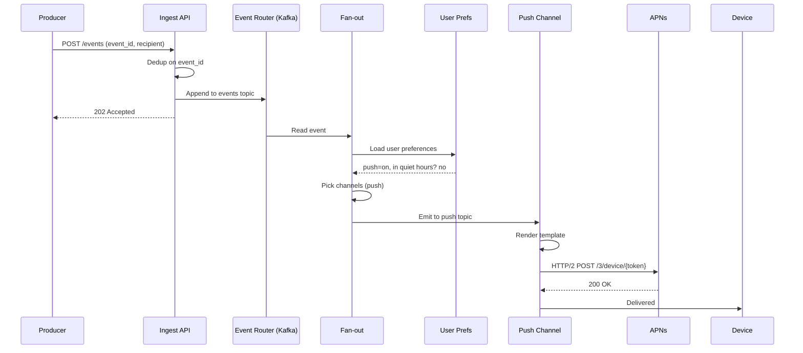
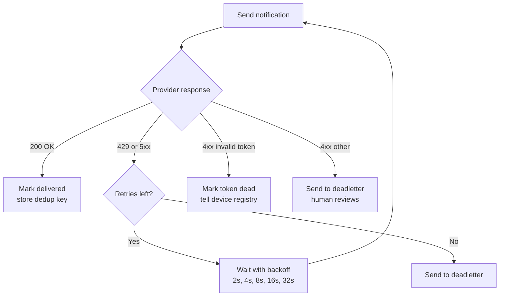
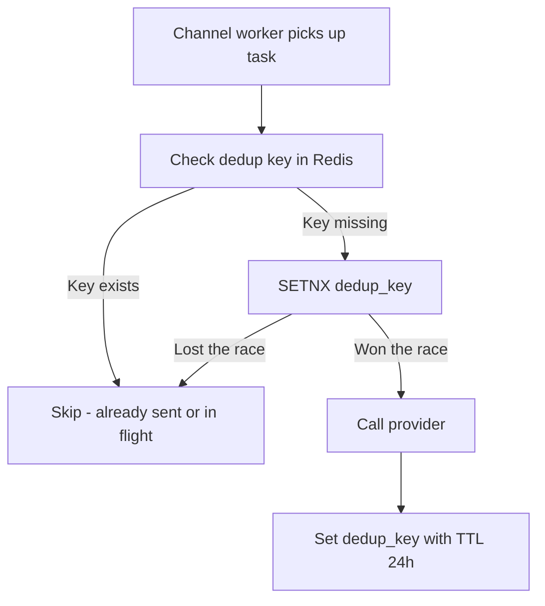
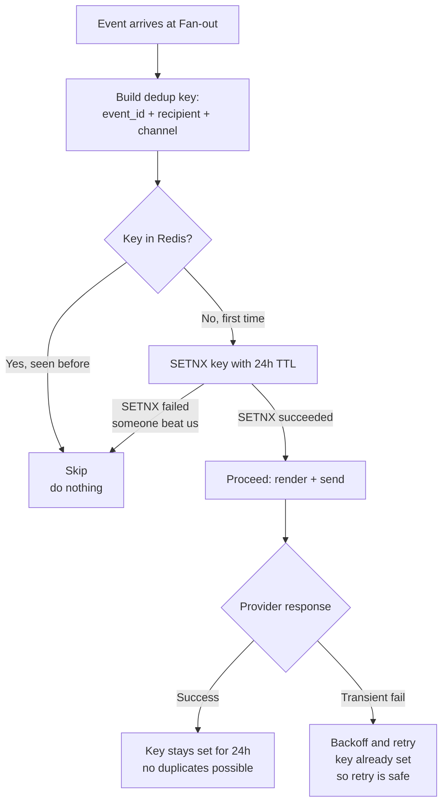

## The scene

You are in the interview room. The whiteboard already has scribbles from the last problem. The interviewer wipes it clean and writes one line:

> *"Design the notification system for our product. Push, email, SMS. One event comes in. The right notifications go out."*

It sounds easy. Read from a queue. Call Apple's push service. Done. Go home.

It is not easy. The trap is the word "one." One event is not one notification. One event might become zero notifications (the user turned them all off). Or one notification (a single SMS). Or a million notifications (a marketing blast). The system has to handle all three without breaking a sweat.

Two ugly problems meet here:

1. **Fan-out.** One input event triggers many output messages. Like one tweet posting to a thousand followers' timelines. Or one "Black Friday sale" event going out to ten million users.
2. **External delivery.** Your code does not deliver the push. Apple does. Or Google. Or SendGrid. Or Twilio. Each one has its own rules, its own failures, its own rate limits. You are not in charge. You just ask nicely.

Get fan-out wrong and you wake users up at 3am. Get retries wrong and you either drop notifications silently or send the same SMS seven times. Both make users hate you.

The interviewer is watching to see if you ask about channels, preferences, and dedup *before* you start drawing boxes. We will walk this from a small startup to a billion-user product. At each step, we name what just broke and add the smallest fix.

---

## Step 1: Ask the right questions

Before you draw anything, sit for five minutes. Write down the questions you would ask the interviewer.

A good list is not "every edge case I can think of." It is the small set of questions whose answers change the whole design.

<details markdown="1">
<summary><b>Show: 8 questions that matter</b></summary>

1. **Which channels?** Push (iPhone and Android)? Email? SMS? In-app messages? Web push? *Each channel is a different external service with its own rules. The design has to treat channels as plug-ins, not bake one in.*

2. **What kinds of events trigger notifications?** User events (someone liked your post)? System events (your invoice is ready)? Marketing campaigns? *Marketing is a totally different shape. One operator click can send to 10 million users in a few minutes. Transactional is one event to one or a few users.*

3. **Can users turn things off?** Per channel? Per event type? Quiet hours? Different languages? *Preferences are the number one source of "why did I get this?" complaints. They have to be checked before fan-out, not after.*

4. **What is the deadline per channel?** Push in under a minute? Email in under five? SMS in under one? *A 2-hour-old "your driver arrived" push is useless. A weekly digest email can wait an hour. Different channels have different deadlines.*

5. **What about aggregation?** If a user gets 100 likes on a post in an hour, is that 100 notifications or one? *Almost always one. ("John and 99 others liked your post.") This needs to be a first-class step in the design, not a hack.*

6. **How big is it?** How many notifications per day? What is the biggest single event? *Shape matters more than total. 10 billion per day spread evenly is easy. 10 billion per day with 90% of it coming from ten viral events per week is hard.*

7. **What if the same event arrives twice?** A producer service retried because of a network blip. Do we send the notification twice? *No. We need a dedup key.*

8. **What rules apply?** GDPR in Europe. TCPA for SMS in the US. CAN-SPAM for email. Unsubscribe links required? *Each channel has legal rules that change the API and the data model.*

The question that decides the whole design is **user preferences**. Without preferences, fan-out is just "for each recipient, send." With preferences, it becomes "for each recipient, check what they allow, check the time of day, check the hourly cap, check if we already sent this." That is a totally different system.

</details>

---

## Step 2: How big is this thing?

The interviewer gives you these numbers.

- 1 billion users
- 10 billion notifications delivered per day, across all channels
- Channel mix: 60% push, 30% in-app, 7% email, 3% SMS
- Single event fan-out ranges from 0 (user blocked all channels) to 1 million (a marketer's blast)
- Per-channel deadlines: push under 1 minute, in-app under 5 seconds, email under 5 minutes, SMS under 1 minute
- Worst burst: a marketing campaign fires 10 million notifications in 5 minutes

Compute five numbers before peeking:

1. Notifications per second, sustained and at peak
2. Per-channel sustained rate
3. Storage for delivery records over 30 days
4. The burst rate during a marketing campaign
5. How many worker machines you need (assume each worker can do 500 calls per second)

<details markdown="1">
<summary><b>Show: the math</b></summary>

**Notifications per second.**

10 billion / 86,400 seconds = ~116,000 per second sustained. Peak is roughly 3× that, so around **350,000 per second** across all channels combined.

**Per-channel sustained rate:**

| Channel | Share | Sustained QPS |
|---------|-------|---------------|
| Push    | 60%   | ~70,000/sec  |
| In-app  | 30%   | ~35,000/sec  |
| Email   | 7%    | ~8,000/sec   |
| SMS     | 3%    | ~3,500/sec   |

These are under what Apple's push service (APNs), Google's push service (FCM), SendGrid, and Twilio can take. But only if you stay under their per-account limits. SMS in particular has carrier limits (around 100 messages per second per long phone number). So you hold many sender phone numbers, not one.

**Storage for delivery records.**

One row per delivery is about 120 bytes. At 10 billion notifications per day:

10 billion × 120 bytes = **1.2 TB per day**.

Over 30 days, that is **36 TB**. Spread across 32 to 64 database shards, manageable.

**Marketing campaign burst.**

10 million notifications in 5 minutes = 33,000 per second for those 5 minutes. On top of the steady 116,000 per second, that is a 30% spike. Kafka handles this without sweating, as long as the partitions are sized right.

**Worker pool size.**

At 500 calls per second per worker, the 116,000 per second sustained rate needs about **230 workers**. Peak around **700**. Auto-scale based on how far behind the queues fall.

**What the math is telling you.**

Total throughput is not the hard part. The hard parts are these three:

1. Fan-out per event ranges from 0 to 1 million. The system must handle that range without operators changing settings every day.
2. External providers (Apple, Google, SendGrid, Twilio) are slow and lossy compared to your own services. You have to retry without sending duplicates.
3. Preferences and quiet hours must be checked cheaply and correctly for every single notification.

> **Why does fan-out shape matter so much?** Imagine two products. Product A sends 1 million notifications a day, evenly. That is ~12 per second. Easy. Product B sends 1 million a day, but 900,000 of them go out in a single 5-minute marketing blast. Same total, but Product B's queue must absorb a 3,000-per-second burst. Same number on paper. Totally different system.

</details>

---

## Step 3: The pipeline

Notifications flow through a pipeline. Four stages, each doing one job.

```
1. Ingest    -> 2. Fan-out    -> 3. Route per channel    -> 4. Deliver
   (front       (one event       (separate queue for         (call APNs,
    door)        becomes many     each channel)               FCM, SendGrid,
                 notifications)                               Twilio)
```

Try to fill in why each stage exists, then check.

<details markdown="1">
<summary><b>Show: full pipeline with reasons</b></summary>

```
   Producer Service (the thing that fires the event)
   like PostService, BillingService, MarketingTool
                 |
                 |  1. POST /events  { event_id, type, payload, recipients[] }
                 v
   +-------------------------------------+
   |  Notification Ingest API            |  Check who you are, check the
   |  (stateless, just a front door)     |  payload, dedup on event_id
   +------------+------------------------+
                |
                |  2. Append to "events.created" Kafka topic
                v
   +-------------------------------------+
   |  Fan-out Service                    |  For each recipient:
   |  (reads from Kafka)                 |   - load user preferences
   |                                     |   - load the template
   |                                     |   - decide which channels
   |                                     |   - check quiet hours
   |                                     |   - check aggregation window
   |                                     |  Then emit per-channel tasks.
   +------------+------------------------+
                |
                |  3. Append to per-channel topics:
                |     notifications.push, .email, .sms, .in_app
                v
   +-------------------------------------+
   |  Channel Workers                    |  One worker pool per channel.
   |  (push / email / sms / in-app)      |  Render the template, call
   |                                     |  the external provider.
   +------------+------------------------+
                |
                |  4. Call the external provider
                v
              User's phone / inbox / app
```

**Why each stage exists:**

- **Ingest API** is the front door. It checks the request, then dedups on `event_id`. If the same `event_id` shows up twice, the second one gets dropped before it costs anything downstream.

> **Why dedup at the front door?** Because producers retry on timeouts. They sent the event, then their network blipped, so they sent it again. Without dedup, your user gets two notifications. The fix is one line: check if you have seen this event_id in the last 24 hours.

- **Kafka in the middle** separates producers from consumers. Producers post and get a fast OK. Consumers process at their own pace. If a downstream provider goes down, messages queue up and drain when it comes back.

- **Fan-out Service** is where the magic happens. One event might become 0, 1, or 1,000 notifications. All preference and aggregation logic lives here.

- **Per-channel queues.** Each channel has different speeds, different limits, different retry rules. Keep them in separate queues so a SendGrid outage does not back up push delivery.

> **Why separate queues?** Imagine you have one big "notifications" queue. SendGrid goes down. Email retries pile up. The single queue gets backed up. Now push notifications also slow down, because they share the queue. One bad channel takes everyone down. Separating queues stops this.

- **Channel workers** are simple and stateless. Render the message, call the provider, record what happened.

</details>

---

## Step 4: Sequence diagram, event to delivered push

Before drawing the full architecture, walk through a single event from start to finish. One like on a post. One push notification to one phone.



The trick is what the boxes do not say. The Fan-out check is doing five things in parallel: preferences, template, quiet hours, hourly cap, dedup. If any one says "no," the notification stops there. We will see that in detail later.

---

## Step 5: The big architecture

Now draw all the supporting pieces. Eight boxes are missing in the diagram below. Think about: who owns user preferences, who renders the message, where dedup state lives, where device tokens are stored.

```
   Producer Services --> +----------------+
                         |   Ingest API   |
                         +-------+--------+
                                 |
                                 v
                         +----------------+
                         |  events Kafka  |
                         +-------+--------+
                                 |
                                 v
                         +----------------+        +------------------+
                         |   Fan-out      |<-------|    [ ? ]         |  (per-user opt-in,
                         |   Service      |        |                  |   quiet hours, locale)
                         +--+-------------+        +------------------+
                            |
                            |             +------------------+
                            |<------------|    [ ? ]         |  (subject, body,
                            |             |                  |   localized, versioned)
                            |             +------------------+
                            |
                            |             +------------------+
                            |<------------|    [ ? ]         |  (event_id + recipient +
                            |             |                  |   channel -> already sent?)
                            |             +------------------+
                            |
                            v
                +----------------------------+
                |  per-channel Kafka topics  |
                | push / email / sms / inapp |
                +-----+----+----+----+-------+
                      |    |    |    |
                      v    v    v    v
                +---+ +---+ +---+ +---+
                |[?]| |[?]| |[?]| |[?]|  (each calls its external provider)
                +-+-+ +-+-+ +-+-+ +-+-+
                  |     |     |     |
                  v     v     v     v
                APNs/  Send  Twilio/ WebSocket
                FCM    Grid   SNS    push to
                              SMS    open app
```

<details markdown="1">
<summary><b>Show: full architecture</b></summary>

```
   Producer Services --> +----------------+
                         |   Ingest API   |  Auth, dedup on event_id
                         +-------+--------+
                                 |
                                 v
                         +----------------+
                         |  events Kafka  |  topic: events.created
                         +-------+--------+  partitioned by recipient_id hash
                                 |
                                 v
                         +----------------+      +-----------------------+
                         |   Fan-out      |<-----|  Preferences Service  |
                         |   Service      |      |  (per-channel opt-in, |
                         +--+-------------+      |   per-event opt-out,  |
                            |                    |   quiet hours, tz,    |
                            |                    |   locale)             |
                            |                    +-----------------------+
                            |
                            |             +-----------------------+
                            |<------------|  Template Service     |
                            |             |  (subject + body,     |
                            |             |   localized, versioned|
                            |             |   per channel,        |
                            |             |   A/B variants)       |
                            |             +-----------------------+
                            |
                            |             +-----------------------+
                            |<------------|  Dedup Store          |
                            |             |  (Redis with TTL,     |
                            |             |   key = event_id +    |
                            |             |   recipient +         |
                            |             |   channel)            |
                            |             +-----------------------+
                            |
                            v
                +----------------------------+
                |  per-channel Kafka topics  |
                | push / email / sms / inapp |
                +-----+----+----+----+-------+
                      |    |    |    |
                      v    v    v    v
                +----+ +----+ +----+ +-----+
                |Push| |Mail| |SMS | |InApp|
                |Wkr | |Wkr | |Wkr | |Wkr  |
                +-+--+ +-+--+ +-+--+ +-+---+
                  |     |     |     |
                  v     v     v     v
                APNs/  Send  Twilio/ WebSocket
                FCM    Grid   SNS    push to
                              SMS    open app
                  |     |     |     |
                  v     v     v     v
              Device Inbox  Phone  In-app feed
```

What each new piece does:

- **Preferences Service.** Cheap, hot, mostly read. Fan-out hits it once per recipient. Heavily cached because preferences rarely change.

- **Template Service.** Stores message templates with variables (like `Hi {{name}}, you have {{count}} new likes`). Versioned. Localized. The renderer is a small library called inside the channel workers. The Template Service just hands out template content.

- **Dedup Store.** Redis with TTL. Key is `event_id + recipient + channel`. If the key is there, the notification was already sent (or is on its way). Skip. TTL is 24 hours, long enough to cover all retry windows.

- **Per-channel workers.** Each pool is sized on its own. Push workers call APNs and FCM in batches. Email workers call SendGrid. SMS workers call Twilio with per-number rate limiting. In-app workers write to a WebSocket gateway or to a store-and-poll table.

> **Why is dedup keyed on three things, not just `event_id`?** Because one event can go to many recipients (fan-out). And one recipient can get notifications on multiple channels (push, email, in-app for the same event). The unique unit is `event + person + channel`. Anything less and you either miss real notifications or send duplicates.

</details>

---

## Step 6: Retry, dedup, and deadletter

External providers fail. APNs returns 429 when you push too fast. SendGrid returns 5xx during their incidents. Twilio rejects messages to invalid numbers. The design has to tell "try again later" apart from "give up forever" without sending the same notification twice.

Take 10 minutes. Design:

1. The retry policy per channel (how many tries, with what wait between)
2. The idempotency key (so retries do not duplicate)
3. What goes to the deadletter queue and who looks at it
4. How invalid push tokens get cleaned up



<details markdown="1">
<summary><b>Show: full retry strategy</b></summary>

**Sorting responses into three buckets.** Every provider response falls into one of three:

| Bucket | What it means | What to do |
|--------|---------------|------------|
| Transient | 429, 5xx, timeout, network reset | Wait, then try again |
| Permanent invalid recipient | APNs `Unregistered`, FCM `NotRegistered`, Twilio invalid number, email hard bounce | Do not retry. Mark the address as dead. Clean it up. |
| Permanent rejection | Template rejected, content flagged, sender blacklisted | Do not retry. Send to deadletter for a human to look at. |

> **Why retry only on 5xx but not 4xx?** Because 5xx means the server temporarily failed (it might work next time). 4xx means we sent something wrong (invalid token, bad payload). Retrying a 4xx will fail forever. Knowing the difference stops a million pointless API calls.

**Per-channel retry policy:**

| Channel | Max retries | Backoff | Max retry window |
|---------|-------------|---------|------------------|
| Push (APNs/FCM) | 5 | 2s, 4s, 8s, 16s, 32s + jitter | 60 seconds (push must be fresh) |
| In-app | 3 | 1s, 2s, 4s | 7 seconds |
| Email | 8 | 30s, 1m, 5m, 15m, 1h, 4h, 12h, 24h | 24 hours |
| SMS | 3 | 5s, 30s, 2m + jitter | 5 minutes |

Push retries have a tight window because a 2-hour-old "your driver arrived" push is junk. Email retries are generous because email is store-and-forward by nature. SendGrid outages can last hours.

> **What is jitter?** Random wiggle added to the backoff. If 1,000 workers all wait exactly 8 seconds, they all hit the provider at the same instant. The provider falls over again. Jitter spreads them out so they retry at different times. Tiny detail, huge impact.

**The idempotency key:**

```
dedup_key = sha256(event_id + recipient_user_id + channel)
```

Stored in Redis with a 24-hour TTL.



> **Why SETNX and not just SET?** SETNX means "set only if not exists." It is atomic. If two workers both try at the same instant, only one wins. The loser sees "already set" and skips the provider call. Without SETNX, both could check, both see empty, both send. Duplicate notification.

For mission-critical channels (SMS for 2FA codes), use a stronger check. Write to a Postgres row with `INSERT ON CONFLICT DO NOTHING RETURNING`. Slower (one DB write per send) but bulletproof.

**Deadletter queue.** Messages that fail all retries go to `notifications.deadletter.{channel}`. A small dashboard groups them by error reason. Permanent invalid recipients get auto-cleaned. The rest land in front of a human, usually within an hour.

**Push token cleanup.** APNs and FCM both tell you when a token is dead. The channel worker:

1. Sees the dead-token response.
2. Writes to a `push_token_invalidations` topic.
3. A small consumer marks the token as `revoked` in the device table.
4. Future notifications skip that token. If the user has no other devices, push acts like an opt-out for that user.

</details>

---

## Step 7: Dedup, drawn out

The dedup check is the single most important thing in this design. If it works, retries are safe. If it does not, users hate you.



> **Why does the TTL exist?** Two reasons. One, Redis would fill up forever otherwise. Two, after 24 hours, a "retry" of the same event_id is more likely an operator manually resending or a real bug. You want it to go through, not silently skip.

> **What if a worker dies right after SETNX but before calling the provider?** The key is set, but the notification was never sent. The user never gets it. To handle this, you can store the worker_id and a timestamp in the dedup value. On replay, check if that worker is still alive (heartbeat). If dead, the replay proceeds. For social and marketing notifications, the simpler SETNX is fine. For 2FA codes, use the bulletproof Postgres version.

---

## Step 8: Rate limiting, aggregation, and quiet hours

Notifications are the fastest way to make users uninstall your app. Three guardrails, each at a different layer.

Take 10 minutes:

1. **Per-user cap.** A user should not get more than N notifications per hour, across all channels.
2. **Aggregation.** 100 likes on one post should be one notification ("John and 99 others"), not 100.
3. **Quiet hours.** A user in Tokyo at 2am should not get a marketing push, even if it is 10am in California where your servers run.

How do you build each? Where in the pipeline do they live?

<details markdown="1">
<summary><b>Show: all three guardrails</b></summary>

**Per-user cap.** Lives in the Fan-out Service. After choosing channels, before emitting per-channel tasks.

How: a Redis sliding-window counter per `(user_id, channel)`.

```
INCR notifications:hourly:user_456:push
EXPIRE notifications:hourly:user_456:push 3600
```

If the counter exceeds the cap (say 20/hour for push, 5/hour for SMS), drop the notification or hold it for a daily digest.

> **Why per-channel and not just per-user?** Because the costs differ. SMS costs about $0.01 each. Push costs near zero. You can send a user 50 pushes a day without thinking. 50 SMS a day costs you $0.50 and probably gets you sued.

Transactional notifications (your code, your invoice, your driver arrived) bypass the cap. They are tagged `category=transactional` and the check skips them. Only `marketing` and `social` count.

**Aggregation.** Same place. Separate path for events that can be batched.

Events that can be aggregated (likes, follows, comments on the same post) carry an `aggregation_key` like `post:789:likes`. The Fan-out Service does:

1. On arrival, check Redis for an open window: `EXISTS agg:post:789:likes`.
2. If no window: start one with `SETEX agg:post:789:likes 3600 1` (1-hour window). Schedule a "close" message for window end.
3. If window exists: `INCR agg:post:789:likes`. Do not emit anything new.
4. When the window expires, a scheduled job reads the count and sends one notification with the aggregated content.

The template looks like: `"{{first_actor.name}} and {{count - 1}} others liked your post"`. Fan-out materializes the actor list at window close.

> **Subtle ordering bug.** Window starts on the first event. User gets 1 like at T=0 and 99 likes at T=3,599. They get one notification at T=3,600. Good. But if they get 99 likes at T=0 and 1 like at T=3,601, they get two notifications: the big one, then a lonely "1 person liked your post." Adjustable; some products use rolling windows.

**Quiet hours.** Fan-out again, before emitting to any channel.

Each user's preferences include their timezone and a do-not-disturb window (like 22:00 to 07:00 local time). Fan-out converts "now" to the user's local time and checks the window.

If now is inside the quiet window:

- **Transactional.** Send anyway. Quiet hours do not apply.
- **Marketing.** Drop. Do not delay. Users hate a morning rush of overnight notifications.
- **Social** (likes, follows, comments). Hold. Move to a "deferred" topic with a delayed delivery time set to the end of quiet hours. When the user wakes up, they get a digest.

> **Why drop marketing instead of holding it?** Because the marketing message is timed. "Lunch deal, $5 off until 3pm" is useless at 8am the next day. Holding it would deliver a stale message. Dropping is better than misleading.

**Timezone matters.** A marketing campaign that fires "Tuesday 10am" should fire at 10am in each user's local time. Not 10am UTC. Fan-out groups campaign work by user timezone.

</details>

---

## Follow-up questions

Try answering each in 3 to 4 sentences before reading the solution.

1. A producer service retries an event because of a network blip and sends `event_id=42` twice within 100ms. Walk through how the system avoids sending duplicate notifications. What if the second retry comes 25 hours later, after the dedup TTL expires?

2. A marketing campaign is meant to send to 10 million users but the operator accidentally targets 100 million. How do you stop it mid-flight? What state has to be torn down?

3. APNs is down for 30 minutes. What happens to push notifications during the outage? What happens when it comes back? Do users see a flood at recovery?

4. A user updates their notification preferences to opt out of marketing, but a marketing campaign was already queued. Are messages already in the queue still sent, or do they honor the latest preferences?

5. A user has 5 devices. They post something that triggers a notification to themselves (like "your scheduled post just went live"). How many push notifications? On which devices? What if one device is signed out?

6. You discover that one notification template has a bug: it sends literal `{{name}}` instead of the user's name. How do you roll back? What about messages already sent?

7. The notifications database is showing one shard much hotter than others. Diagnose.

8. A user complains they got an SMS at 4am. Trace the path: who is responsible? How do you reproduce?

9. Web push (browser-based push) needs to be added as a new channel. What changes in the architecture? What stays the same?

10. Compliance asks: prove that user 12345 received exactly the notifications we claim, and not others. What is your audit trail? How long do you keep it?

---

## Related problems

- **[News Feed (002)](../002-news-feed/question.md).** The fan-out worker pattern is the same. The celebrity problem (one author with millions of followers) maps onto the marketing campaign problem here (one event targeting millions of recipients).
- **[Rate Limiter (004)](../004-rate-limiter/question.md).** The per-user notification cap is exactly a rate limiter scoped to a user. The sliding-window counter and token-bucket variants apply directly.
- **[Chat System (003)](../003-chat-system/question.md).** Push notification delivery to mobile devices is the same problem as chat message delivery. APNs and FCM are the same tools, and the device-token lifecycle is shared.
- **[Distributed Cache (009)](../009-distributed-cache/question.md).** Preferences and dedup state both live in Redis with TTL. Hot-key and eviction behavior matters here too.
- **[Approval Management (011)](../011-approval-management/question.md).** Every approval event fires off notifications. The fan-out, retry, and quiet-hours machinery here consumes the approval engine's events.
