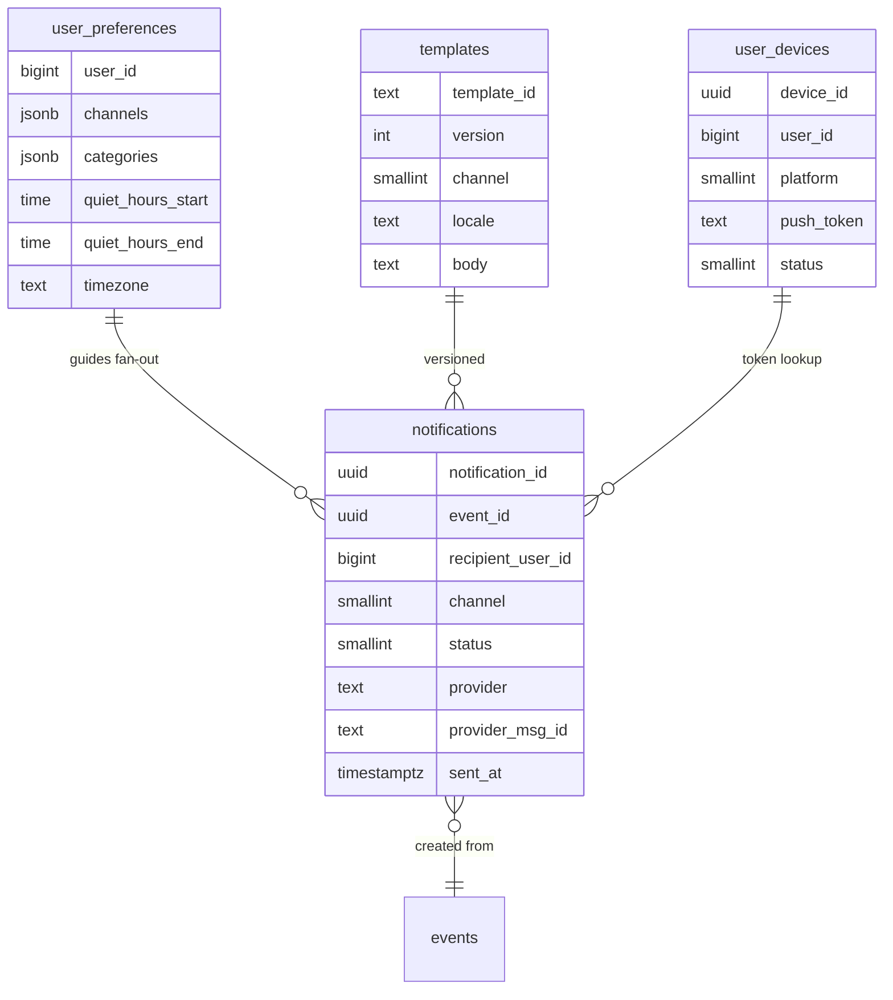
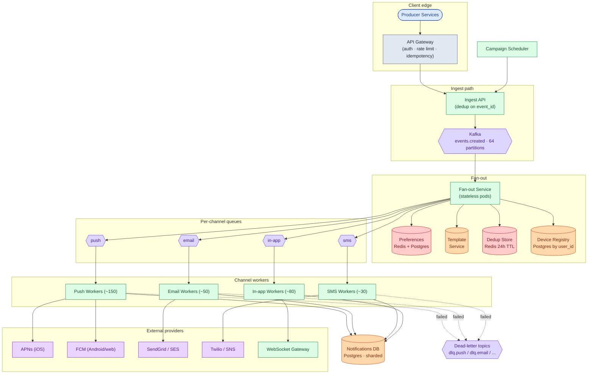
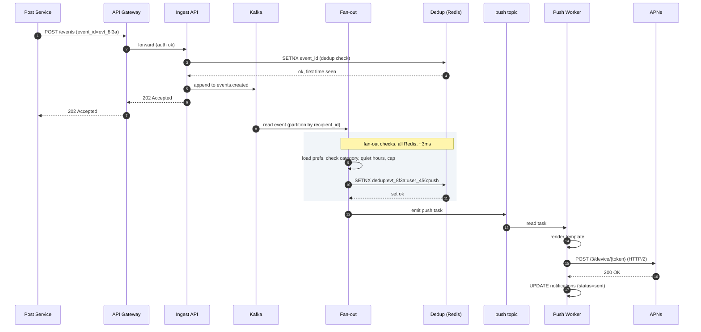
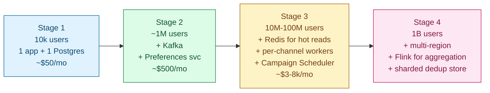

## Solution: Notification System

### The short version

A notification system is a pipeline. One event comes in. The right messages go out. Four stages: ingest the event, decide what to send (fan-out), route per channel, deliver through an external provider.

The pipeline runs on Kafka. Each stage is its own service so each can scale on its own bottleneck. Push, email, SMS, and in-app each get their own queue and their own worker pool. If SendGrid goes down, push keeps flowing.

The interesting work is at the edges. **Idempotency keys** (`event_id + recipient + channel`) stop duplicate sends across retries and Kafka rebalances. **Aggregation windows** turn 100 likes into one "Alice and 99 others" notification. **Quiet hours** and **per-user caps** stop the system from waking people up at 3am. **Push token cleanup** feeds back into the device registry so dead tokens get pruned within minutes.

What trips candidates: one worker pool for all channels (one bad provider drags everyone else down), preferences as a synchronous Postgres call on the hot path (cannot scale to 100,000/sec), and retries without dedup keys producing duplicate sends.

---

### 1. The two questions that matter most

**User preferences.** Without preferences, fan-out is "for each recipient, send." With preferences, it becomes "for each recipient, decide channels, check quiet hours, check the hourly cap, check if we already sent this." Different system.

**Fan-out shape.** Are events always 1-to-1 (transactional), or can one event target millions (marketing campaigns)? A 10 billion/day system with even spread is easier than one with viral spikes. The marketing worst case decides queue sizing and whether you need a separate Campaign Scheduler.

---

### 2. The math, in plain numbers

| Scale | Notifications/day | Per second (sustained) | Peak | Storage (30 days) |
|-------|-------------------|------------------------|------|-------------------|
| Startup (100k users) | ~1 million | ~12 | ~50 | 3.6 GB |
| Mid-size (10M users) | ~100 million | ~1,200 | ~5,000 | 360 GB |
| Billion-user product | ~10 billion | ~116,000 | ~350,000 | 36 TB |

Per-channel split at the billion-user scale:

| Channel | Share | Sustained QPS |
|---------|-------|---------------|
| Push    | 60%   | ~70,000/sec |
| In-app  | 30%   | ~35,000/sec |
| Email   | 7%    | ~8,000/sec  |
| SMS     | 3%    | ~3,500/sec  |

Worst burst: a 10-million-recipient marketing campaign sent in 5 minutes adds ~33,000/sec for the duration. A 30% spike on top of the 116,000 baseline.

Worker pool sizing: at 500 provider calls per second per worker, the sustained 116,000/sec needs ~230 workers; peak needs ~700. Auto-scale based on Kafka consumer lag.

The real ceiling is not your code. It is the **per-account quotas** at the providers. APNs throttles per HTTP/2 connection per certificate. Twilio throttles per sender number. SendGrid throttles per sub-account. At scale, you hold many provider credentials and load-balance across them.

---

### 3. The API

Two endpoints carry the whole product. Submit an event and read/write preferences. Everything else is reading data back.

```
POST /api/v1/events
Idempotency-Key: <event_id>

{
  "event_id": "evt_8f3a91...",
  "event_type": "post.liked",
  "category": "social",
  "actor": { "user_id": 123 },
  "recipients": [
    { "user_id": 456, "context": { "post_id": 789 } }
  ],
  "aggregation_key": "post:789:likes",
  "template_id": "tpl_like_v3",
  "template_vars": { "actor_name": "Alice", "post_title": "..." },
  "ttl_seconds": 3600
}
```

| Status | Meaning |
|--------|---------|
| **202** | Event queued |
| **200** | Same event_id already accepted (idempotent replay) |
| **400** | Invalid payload, unknown template |
| **413** | Recipient list too long (> 10k); use bulk endpoint |
| **429** | Producer rate limit hit |

Load-bearing choices:

- **`Idempotency-Key` is required.** Producer retries on timeout. Without it, mobile apps and microservices replay the same event and users get duplicate notifications.
- **`category` controls policy.** It decides whether quiet hours apply, whether per-user caps apply, and how aggressively the system retries. `transactional` bypasses caps and quiet hours. `marketing` does not.
- **`ttl_seconds` is a hard deadline.** A push with a 1-hour TTL that sits in a backed-up queue for 90 minutes gets dropped, not delivered stale. This is what prevents the "flood at recovery" problem.

For marketing campaigns targeting millions, a separate bulk endpoint takes a segment query and paces delivery:

```
POST /api/v1/campaigns
{
  "campaign_id": "cmp_winter_2026",
  "segment_query": { "country": "US", "tier": "active" },
  "template_id": "tpl_winter_v2",
  "channels": ["push", "email"],
  "send_window": {
    "start_local_time": "10:00",
    "end_local_time": "20:00",
    "timezone_strategy": "per_user_local"
  },
  "rate_limit": { "per_second": 5000 }
}
```

The Campaign Scheduler expands the segment into a recipient stream and feeds it into the ingest path at the configured rate. Without this, one careless campaign floods Kafka and backpressures everything else.

Preferences API:

```
PUT /api/v1/users/me/notification-preferences
{
  "channels": {
    "push":  { "enabled": true },
    "sms":   { "enabled": false }
  },
  "categories": {
    "marketing":     { "enabled": false },
    "transactional": { "enabled": true }
  },
  "quiet_hours": {
    "enabled": true,
    "start": "22:00",
    "end": "07:00",
    "timezone": "America/Los_Angeles"
  }
}
```

Writes go to the Preferences Service primary. Reads come from a regional Redis cache invalidated via pub/sub on every write.

---

### 4. The data model

Five tables. Each one does one job.



<details markdown="1">
<summary><b>Show: the full SQL</b></summary>

```sql
CREATE TABLE notifications (
    notification_id     UUID PRIMARY KEY,
    event_id            UUID NOT NULL,
    recipient_user_id   BIGINT NOT NULL,
    channel             SMALLINT NOT NULL,       -- 1=push, 2=email, 3=sms, 4=inapp
    template_id         VARCHAR(64) NOT NULL,
    template_version    INT NOT NULL,
    status              SMALLINT NOT NULL,       -- 1=queued, 2=sent, 3=failed, 4=dropped
    category            SMALLINT NOT NULL,       -- 1=transactional, 2=social, 3=marketing
    provider            VARCHAR(32),
    provider_msg_id     VARCHAR(128),
    retry_count         SMALLINT NOT NULL DEFAULT 0,
    queued_at           TIMESTAMPTZ NOT NULL,
    sent_at             TIMESTAMPTZ,
    error_code          VARCHAR(64),
    error_message       TEXT
);

CREATE INDEX idx_event_recipient_channel
    ON notifications (event_id, recipient_user_id, channel);
CREATE INDEX idx_recipient_recent
    ON notifications (recipient_user_id, queued_at DESC);

CREATE TABLE user_preferences (
    user_id              BIGINT PRIMARY KEY,
    channels             JSONB NOT NULL,
    categories           JSONB NOT NULL,
    quiet_hours_start    TIME,
    quiet_hours_end      TIME,
    timezone             VARCHAR(64),
    locale               VARCHAR(16),
    updated_at           TIMESTAMPTZ NOT NULL DEFAULT NOW(),
    version              INT NOT NULL DEFAULT 1
);

CREATE TABLE templates (
    template_id     VARCHAR(64) NOT NULL,
    version         INT NOT NULL,
    channel         SMALLINT NOT NULL,
    locale          VARCHAR(16) NOT NULL,
    subject         TEXT,
    body            TEXT NOT NULL,
    variables       JSONB NOT NULL,
    created_at      TIMESTAMPTZ NOT NULL,
    deprecated_at   TIMESTAMPTZ,
    PRIMARY KEY (template_id, version, channel, locale)
);

CREATE TABLE user_devices (
    device_id       UUID PRIMARY KEY,
    user_id         BIGINT NOT NULL,
    platform        SMALLINT NOT NULL,    -- 1=ios, 2=android, 3=web
    push_token      VARCHAR(512) NOT NULL,
    status          SMALLINT NOT NULL,    -- 1=active, 2=revoked, 3=invalid
    last_seen_at    TIMESTAMPTZ NOT NULL
);
CREATE INDEX idx_user_active ON user_devices (user_id) WHERE status = 1;
```

**Dedup store (Redis, not SQL):**

```
KEY:   dedup:{event_id}:{recipient_user_id}:{channel}
VALUE: notification_id
TTL:   24 hours
```

</details>

Three small choices doing real work:

**`notifications` is sharded by `notification_id` hash.** Writes spread evenly. The `idx_event_recipient_channel` index makes "did we already send this?" lookups fast within the shard. The Redis dedup store is the fast path. This index is the durable backup.

**`templates` are immutable per version.** To "edit" a template, publish version N+1. Roll back by flipping the current-version pointer back. Old messages already sent are stuck (you cannot un-send a push), but new sends pick up the fix within minutes.

**`user_devices` filtered by `status = 1`.** Fan-out turns "send to user 456" into active device tokens. Revoked and invalid tokens never touch the provider.

---

### 5. The engine: event to delivered push

The path of one event, with timing:

```
T+0ms    Post Service calls POST /events with event_id=evt_X, recipient=user_456.
T+5ms    Ingest API checks payload. Checks event_id in Redis: not seen.
         SETs event_id (TTL 24h). Appends to events.created Kafka topic.
         Returns 202.

T+10ms   Fan-out consumer reads the message.
T+11ms   Loads user_456's preferences from Redis (cache hit, ~1ms).
T+12ms   Loads template metadata from Redis (cache hit).
T+13ms   Checks in order:
          - category=social, prefs.social.enabled=true. OK.
          - quiet_hours: user is in PST, now is 14:00. Not in window.
          - per-user cap: counter=3, cap=20. OK.
          - aggregation: agg:post:789:likes does not exist.
            Start window: SETEX 3600 1. Schedule close message.
          - dedup: SETNX dedup:evt_X:user_456:push. Won.
         Decision: emit to push and in-app (per user's prefs).

T+15ms   Expand user_456 to active devices: device_A (ios), device_B (android).
T+16ms   Emit two push tasks. Emit one in-app task.
T+18ms   INSERT 3 rows into notifications (status=queued).

T+25ms   Push worker pulls task for device_A.
T+26ms   Check dedup key: already set by fan-out. Proceed.
T+27ms   Render template body. ~1ms.
T+28ms   Call APNs HTTP/2: POST /3/device/{token_A}.
T+150ms  APNs returns 200. Worker updates: status=sent, provider_msg_id=apns_xyz.

T+3600s  Aggregation window closes. Fan-out reads count: 47 likes.
         Emits one notification: "Alice and 46 others liked your post."
```

P50 end-to-end for a single push: ~150ms. The biggest chunk is the APNs round trip.

---

### 6. The architecture



Five things to notice:

- The Ingest API sits in front of Kafka so producers never wait on fan-out. A producer call returns 202 in under 10ms regardless of downstream load.
- Kafka is partitioned by `recipient_user_id` on `events.created`. All events for one user land on one partition. The per-user cap counter lives on the consumer that owns the partition. No cross-pod fighting.
- Fan-out and channel workers are split because they have different bottlenecks. Fan-out is IO-bound on Redis lookups. Channel workers are blocked by the provider's latency. Splitting them lets each scale independently.
- Per-channel topics contain blast radius. If SendGrid is down, the email topic backs up. Push and SMS keep flowing.
- The Campaign Scheduler is separate because marketing campaigns need pacing. Firing 10 million notifications in 10 seconds would overwhelm the provider quotas. The scheduler reads a segment query, expands it, and feeds the ingest API at a configured rate.

---

### 7. A request, end to end



---

### 8. The scaling journey: 10 users to 1 billion



#### Stage 1: 10,000 users

One Postgres, one app instance. Preferences stored in Postgres. Push only (APNs + FCM). Notifications delivered inline via HTTP call to APNs. No queue, no retry logic beyond a single try-catch.

Enough because you see a few hundred notifications per hour. Building more is over-engineering.

#### Stage 2: 1 million users

Something breaks: the inline APNs call slows down the API because APNs latency is 50-200ms. Producer services start timing out.

Add Kafka to decouple the ingest path from delivery. Add a Preferences Service backed by Postgres (still synchronous, but now a separate service). Add a push worker pool. Add basic retry logic. ~$500/month.

Still no Redis, no separate channel workers, no dedup beyond a simple Postgres check. One million users and a few thousand notifications per minute is still manageable with direct Postgres reads.

#### Stage 3: 10 million to 100 million users

Several things break at once:

- Preferences Postgres is hit on every fan-out event. At 10,000/sec, that is 10,000 Postgres reads per second. The database falls over.
- One marketing campaign targeting 5 million users overwhelms the single channel worker pool. Email delivery queues up behind push.
- No dedup: a Kafka consumer rebalance causes a worker to re-process 500 messages. Users get duplicate push notifications.

Fixes, in order:

- Redis cache for preferences with pub/sub invalidation on write. Cache hit rate goes to 99%.
- Separate Kafka topics and worker pools per channel. Email and push can now fail independently.
- Redis dedup store with SETNX. Consumer rebalance duplicates handled.
- Campaign Scheduler to pace large campaigns.
- Aggregation windows in fan-out to batch social notifications.
- Quiet hours and per-user caps enforced at fan-out.

Cost jumps to $3-8k/month.

#### Stage 4: 1 billion users

New problems:

- EU operations open. GDPR requires EU user data to stay in EU.
- The Redis dedup store at 100k writes/sec on one cluster becomes a bottleneck.
- Aggregation windows are stateful. Fan-out workers need distributed state for aggregation counters.
- Marketing campaigns targeting 100 million users overwhelm even the Campaign Scheduler.

Multi-region: each region has its own Kafka, workers, Postgres, and Redis. The user's home region (from HRIS/auth) decides where events are processed. Cross-region delivery (a US user sending a notification to an EU user) routed via authenticated cross-region API.

Dedup store sharded by `recipient_user_id` with strong consistency within shard. The dedup guarantee is per-shard; acceptable because cross-shard duplicates are rare.

Replace bare Kafka consumers in fan-out with Flink or Kafka Streams for window aggregation. Lets you express aggregation declaratively and get state management for free.

The core data model has not changed since Stage 1. You added regions, sharding, and a streaming framework on top.

---

### 9. The variants

| Variant | What changes |
|---------|--------------|
| **In-app only (no external providers)** | No retry, no token cleanup, no provider quotas. Fan-out writes directly to an inbox table. WebSocket gateway for online users. |
| **2FA / security SMS** | Exactly-once guarantee required. Use two-phase commit (Postgres `INSERT ON CONFLICT`) instead of Redis SETNX. Accept the ~5ms extra latency. |
| **Weekly digest** | Fan-out defers all social notifications to a "digest" bucket. A cron job at Sunday midnight aggregates per user and emits one email. |
| **WhatsApp / LINE** | Same channel adapter pattern. Each new channel is ~2 weeks of work to wire in. Nothing else changes. |

---

### 10. Reliability

**Provider outage.** APNs goes down for 30 minutes. Push topic backs up. Push workers retry with backoff. After max retries, messages go to dead-letter. When APNs returns, the backlog drains. Two safeguards stop a flood: per-notification TTL drops stale messages, and workers respect APNs's published throughput limit on recovery.

**Consumer rebalance.** Kafka consumer groups rebalance when a pod dies or joins. A partition briefly gets processed by two consumers. The Redis SETNX dedup key serializes them: the loser sees the key set and skips the provider call. For 2FA SMS, the stronger Postgres two-phase commit is used instead.

**Late-arriving events.** A producer held an event for 10 minutes due to its own outage, then sent it. If `ttl_seconds` was 5 minutes, drop it. If no TTL was set, deliver it. Some events (an invoice notification) should be delivered even slightly late. Producers are expected to set TTL based on the event's meaning.

**Preferences write race.** A user rapidly toggles marketing opt-out on and off. The pub/sub invalidation fires multiple times. The preferences cache reads the latest value from Postgres on each invalidation. The last write wins. This is intentional and correct.

---

### 11. Observability

| Metric | Why it matters |
|--------|----------------|
| `notifications.queued_rate` (by channel, category) | Headline throughput |
| `notifications.delivery_rate_pct` (delivered / queued) | Drops below 95% = page |
| `fanout.latency_p99` | Fan-out service health |
| `channel.latency_p99` (per provider) | Spot APNs/SendGrid slowdowns early |
| `provider.error_rate` (by code) | Distinguish transient from permanent failures |
| `dedup.hit_rate` | Should be near 0% in steady state; spike means producers are retrying |
| `aggregation.windows_open` | Sanity check |
| `quiet_hours.deferred_rate` | If too high, the system may be holding too much |
| `preferences.cache_hit_rate` | Should be > 99% |
| `kafka.consumer_lag_p99` (per topic) | Leading indicator of backup |
| `deadletter.rate` (by channel, reason) | Triggers manual triage |
| `token_invalidation.rate` | Sudden spike may be an auth bug |
| `unsubscribe.rate` (by category) | Product signal for notification fatigue |

Page on: any channel's `delivery_rate_pct` below 95% for 5 minutes. Fan-out `latency_p99` above 30 seconds for 5 minutes. Dead-letter rate spike more than 10x baseline.

Ticket on: unsubscribe rate spike (likely a bad campaign). Token invalidation spike (auth bug?). Preferences cache hit rate dropping (eviction tuning needed).

---

### 12. Follow-up answers

**1. Producer retries `event_id=42` twice within 100ms. Later, after TTL expires.**

Within 100ms: the Ingest API checks Redis for the event_id. The first call SETs the key (24h TTL) and proceeds. The second call sees the key set and returns 200 immediately. Nothing reaches Kafka twice.

After 25 hours: the dedup key has expired. The second call is treated as a new event and a second notification fires. This is intentional. Twenty-four hours is long enough that a legitimate retry has already landed. After that, the same event_id is more likely an operator manually resending or a bug producing the same ID for a different intent. For strict deduplication beyond 24 hours, write the event_id to a Postgres `processed_events` table with a unique constraint at ingest time.

**2. Marketing campaign accidentally targets 100M instead of 10M.**

Detection: the volume alert fires when `notifications.queued_rate` for the marketing category spikes beyond the expected band.

Stop at the Campaign Scheduler: `POST /campaigns/{id}/pause`. The scheduler stops emitting events within 1-2 seconds.

Events already on `events.created` Kafka are not stopped by pausing the scheduler. Fix: the fan-out Service checks a "campaign blocklist" Redis set on every event. If the campaign_id is in the blocklist, drop the event without fan-out. The operator adds the campaign_id via an admin endpoint, effective within seconds.

Per-channel topics may already have tasks from the bad campaign. Channel workers also check the blocklist before calling the provider.

Cleanup: the blocklist entry expires after 24 hours. Notifications already sent are in the notifications table for audit. Nothing to roll back on the delivery side.

**3. APNs is down for 30 minutes.**

During: push topic backs up. Workers retry with exponential backoff. After max retries (5 attempts, ~60-second window), messages go to dead-letter.

Recovery: APNs returns. Workers resume. A backlog of ~500k messages drains over the next ~5 minutes.

Flood prevention: per-message TTL drops anything past its expiration. A "your driver arrived" push with a 5-minute TTL is dropped if it sat in the queue for 30 minutes. Workers also respect APNs's throughput limits on resumption and do not dump the full backlog at once.

**4. User opts out of marketing while a campaign is in flight.**

Fan-out checks preferences at the moment it processes the event, not when the event was created. The preferences cache has a 5-minute TTL with pub/sub invalidation on write. Opt-out at T=0 invalidates the cache. Fan-out refetches on next event, typically within 1 second.

Events already past the fan-out stage and sitting on per-channel topics are not re-checked. Those are sent. Window of inconsistency: about 10 seconds.

For strict legal compliance (must not send marketing after opt-out), also re-check preferences in the channel worker before calling the provider. Adds ~1ms per send. Worth it for marketing.

**5. User has 5 devices; notification to themselves.**

Fan-out expands "send to user_456" against the device registry filtered by `status = 1` (active). Results: device_A (ios, active), device_B (android, active), device_C (ios, status=revoked, skip), device_D (web push, active), device_E (ios, status=invalid, skip).

Result: 3 push notifications, one per active device. The signed-out and invalid-token devices are filtered at expansion time, before any provider call.

The user gets 3 pushes. Whether to further deduplicate to the most recently active device is a product decision. Most products send to all active devices.

For in-app: one row in the inbox, regardless of devices. Inbox is per-user, not per-device.

**6. Template bug: renders `{{name}}` literally.**

Detection: support tickets, or an automated lint pass that catches unrendered variables in a sample render.

Roll back: templates are versioned and immutable. Flip the "current version" pointer for `tpl_X` from v3 to v2. Fan-out picks up the new pointer when the template metadata cache expires (TTL is short for the pointer, longer for the body).

Messages already sent cannot be recalled. For severe issues (PII leaked), send a follow-up notification with an apology. Mostly, accept the damage and fix forward.

Prevention: every template change goes through lint (check template_vars match variables referenced), a preview render with sample data, a canary to 0.1% of recipients, then full rollout.

**7. One database shard hotter than others.**

Diagnosis:

1. Check the shard key. `notifications` is sharded by `notification_id` hash. An imbalance on a hash-sharded table usually means either the hash function is bad or queries are not using the shard key and are scatter-gathering.
2. Check slow-query logs. A query like `SELECT FROM notifications WHERE recipient_user_id = ?` scatter-gathers all shards when `recipient_user_id` is not the shard key. One slow shard delays every such query, and it looks "hot" from outside.
3. Check partition age within the shard. If partitioned by week, the current week's partition takes all writes. Expected and fine.
4. Check noisy neighbor. Another tenant on the same physical host can steal I/O.

Most often it is a query-pattern issue. A secondary index on `recipient_user_id` on each shard handles the common case without re-sharding.

**8. User got an SMS at 4am.**

Trace:

1. `SELECT FROM notifications WHERE recipient_user_id = ? AND channel = 3 AND sent_at BETWEEN '03:30' AND '04:30'`. Returns `notification_id`, `event_id`, `template_id`, `category`.
2. From `event_id`: find the originating event. Who emitted it? What `category`?
3. Check the user's preferences: are quiet hours set? What timezone is stored?
4. Check fan-out logs for this event: did it run the quiet-hours check? What did it decide?

Likely causes: (a) the category was `transactional`, so quiet hours were skipped by design; (b) the user's timezone is wrong in the preferences table (stored as UTC but they live in PST); (c) a DST edge case in the quiet-hours evaluation. Reproduce by replaying the same event with the same user state against the fan-out logic.

The structured fan-out log is what makes diagnosis possible. Without it, you cannot answer this question.

**9. Add web push as a new channel.**

What changes:

- New channel adapter for the Web Push protocol (uses VAPID keys, talks to FCM for Chrome, Mozilla autopush for Firefox).
- New entry in the `channel` enum.
- New template variant per template (web push bodies are short).
- Subscription endpoint: browser subscribes and gets a `{endpoint URL, keys}` object stored in `user_devices` with `platform=3`.
- Preferences UI adds the web push toggle.

What stays the same: Ingest API, Kafka topology, dedup store, preferences service, retry and dead-letter logic, templates service. Fan-out now checks for an active web subscription and, if present, emits to a new `notifications.web_push` topic.

Adding a channel is a 2-3 week project. The architecture pays back this decision every time.

**10. Audit trail for compliance.**

Every notification has a row in `notifications` with: `notification_id`, `event_id`, `recipient_user_id`, `channel`, `template_id`, `template_version`, `category`, `status`, `queued_at`, `sent_at`, `provider`, `provider_msg_id`, `error_code`.

For "prove user 12345 received exactly these notifications":

```sql
SELECT *
  FROM notifications
 WHERE recipient_user_id = 12345
   AND sent_at BETWEEN ? AND ?
   AND status = 2
 ORDER BY sent_at;
```

The absence of a row proves the negative: every emitted notification is logged at queue time (status=queued), before any provider call. If status never became `sent`, the row is still there.

Retention: 30 days hot in Postgres, archived to S3 as Parquet for 7 years. Compliance queries hit Postgres for recent data and Athena for archived.

For deeper audit (why a notification was suppressed: quiet hours? cap? opt-out?), structured fan-out logs ship to a log warehouse. Cheaper than putting every suppression decision in Postgres. Sufficient for the rare compliance audit.

---

### 13. Trade-offs worth saying out loud

**Build vs. buy channel adapters.** You could use OneSignal or Braze to handle all channels. Faster to launch. But you pay per notification at scale, you cannot tune behavior per channel, and you have less visibility into provider failures. For a product sending billions, build. For millions, buy.

**Where to evaluate preferences.** Earlier (in fan-out) is cheaper but slightly stale if the user changes preferences mid-campaign. Later (in channel worker) is more responsive but costs an extra Redis read per send. Fan-out is the right default; re-check in the channel worker only for strict compliance cases.

**Strict vs. eventual dedup.** Redis SETNX is fast but has a window where two workers can both win. Two-phase commit with Postgres is durable but adds 5-10ms. SETNX for social and marketing. Two-phase for 2FA SMS. Pick per category.

**Aggregation window shape.** Tumbling windows (fixed duration, no overlap) are simple but can produce two notifications if events straddle a boundary. Rolling windows extend on each event and never close until quiet, but they delay delivery. Most products use tumbling with a 1-hour default and accept the edge case.

**What you would revisit at 10x scale.** Move fan-out to a streaming framework (Flink or Kafka Streams) for declarative window aggregation and built-in state management. Federate the dedup store regionally. Build a "shadow send" mode where new channels or templates can be tested against real traffic without actually calling the provider.

---

### 14. Common mistakes

**One worker pool for all channels.** "We have a worker that handles push, email, and SMS." Wrong. One bad channel drags down the others. Separate pools, separate topics.

**No idempotency key on producer calls.** A producer retry sends two notifications. Bad.

**Synchronous Postgres preference lookup in the hot path.** At 100k/sec, 100k Postgres reads per second melts the database. Cache in Redis with pub/sub invalidation.

**No aggregation.** A user with 100 likes on a post gets 100 notifications. Real product complaint within a day of launch.

**No quiet hours or per-user cap.** Both required for any product with more than a few hundred users.

**Treating push token revocation as manual cleanup.** APNs and FCM tell you when a token is dead. Build the feedback loop on day one.

**No dead-letter strategy.** "Failed messages just retry forever." Either you flood the provider or messages pile up indefinitely.

**Same retry policy across all channels.** Push with a 24-hour retry window delivers a "your driver arrived" push two hours late. Email with a 60-second retry window drops messages that could have delivered after a 1-hour SendGrid outage.

**Forgetting marketing is different from transactional.** Marketing needs pacing, a Campaign Scheduler, separate quiet-hours behavior, and compliance handling (CAN-SPAM, GDPR). A single uniform pipeline blurs them.

**No mention of compliance.** GDPR for EU, TCPA for SMS in the US, CAN-SPAM for email. The architecture must accommodate these, not bolt them on later.

If you hit 8 of these 10 in an interview, you are doing well. The three that separate strong from average answers: separate per-channel queues, dedup keys on the producer path, and preferences as a cached read.
