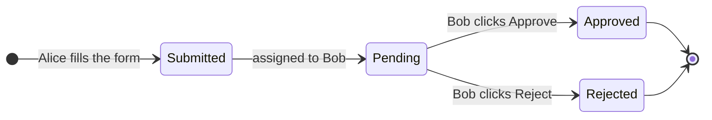
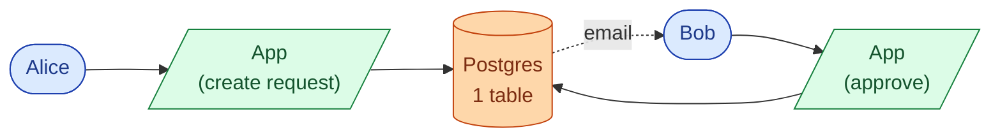
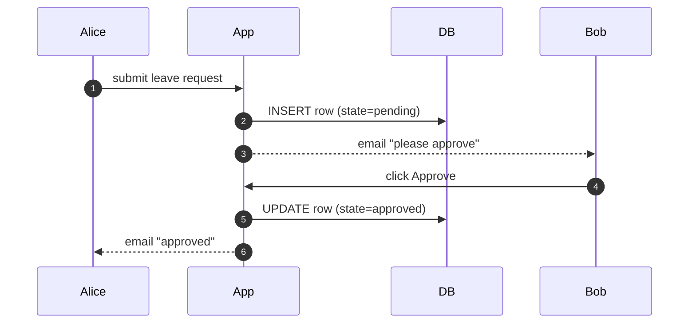
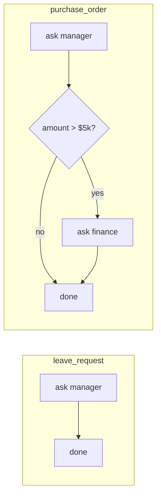
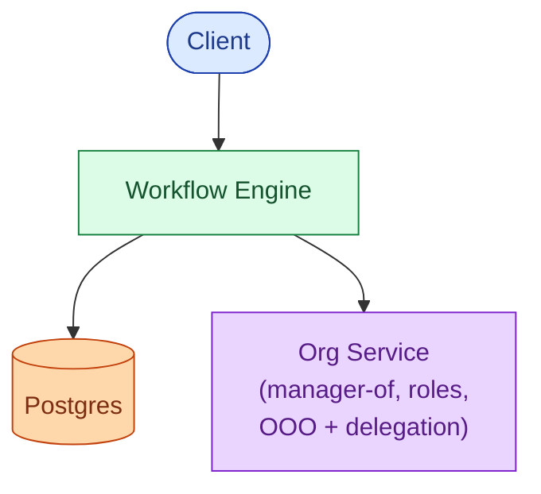
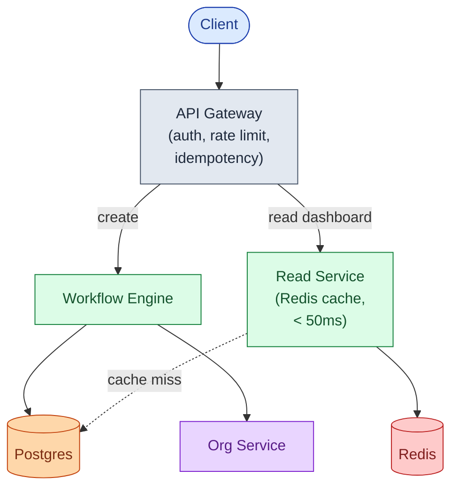
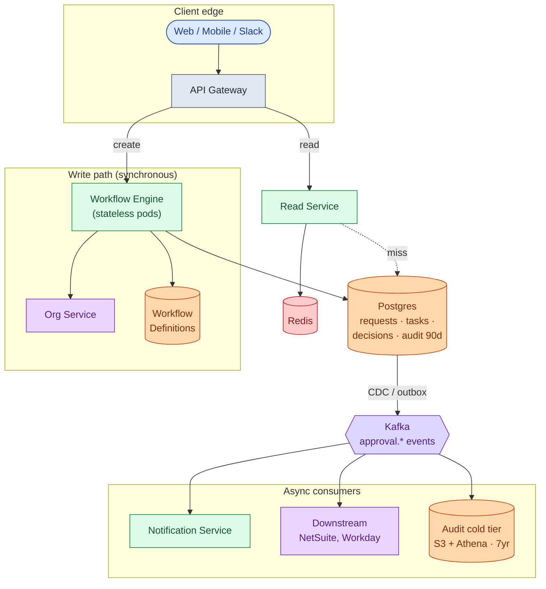
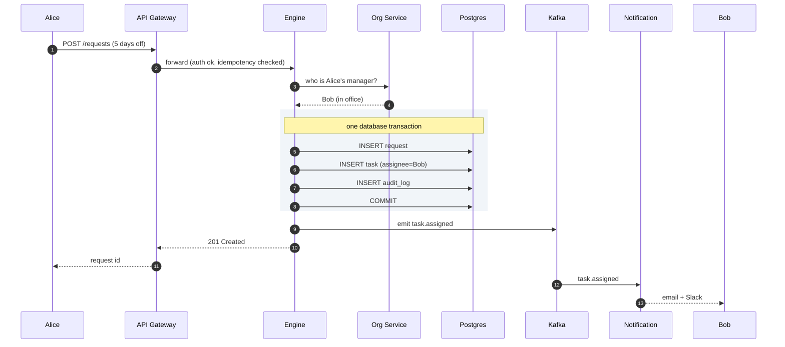
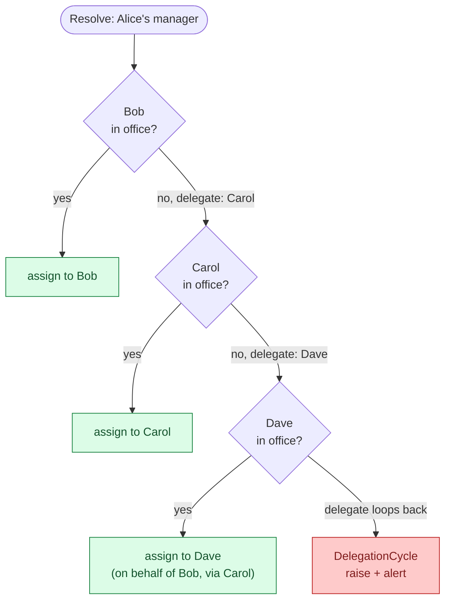
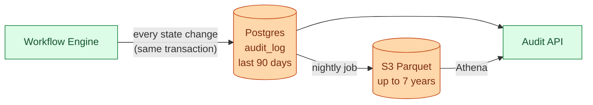

## The scene

You sit down. The interviewer leans in.

> *"Last week I asked my boss for three days off. I filled in a form. She clicked Approve. Done."*
>
> *"Today I bought a $1,200 laptop. Same company, same intranet, same idea: I filled in a form, my boss approved, finance approved, the order went through."*
>
> *"Different rules, different approvers, but the shape is the same. Design one service that handles both. And the next fifty workflows the company invents."*

That is the question. It sounds tiny. It is not.

The word **approval** sounds like a single checkbox. The real questions are different:

- What if the approver is on vacation?
- What if nobody responds?
- What if the approver quits the company while your request is still pending?
- How do you stop someone from approving their own request?
- Five years from now an auditor knocks. How do you prove who approved what?

We will start with the smallest version that works for a 10-person startup. Then we add **one** pressure at a time and watch the design grow.

---

## Step 1: Picture one approval

Before any boxes, just picture what one approval **is**. Alice asks. Bob decides. That is it.



That is the whole product, in one picture. Everything we add later (more approvers, vacations, deadlines, audit) is a complication on top of this.

> **Take this with you.** An approval service is a small state machine, run a lot of times, on a lot of different shapes of request.

---

## Step 2: Ask the right questions

In a real interview, sit quietly for two minutes and write down what you want to ask. Not twenty questions. Five good ones.

<details markdown="1">
<summary><b>Show: 5 questions that change the design</b></summary>

1. **One workflow, or many?** Just leave requests? Or also expenses, POs, contracts? *Almost always many. This is the single biggest decision.*
2. **Who writes the rules?** Engineers in code, or HR admins in a UI? *If non-engineers, you need a definition store, a UI, and versioning.*
3. **What about vacation?** If Alice is out, does her approval auto-route to Bob? *Delegation is the single biggest source of production bugs.*
4. **What if nobody responds?** Auto-approve after 48 hours? Escalate? Page someone? *This is the SLA layer.*
5. **How long do we keep the records?** SOX needs 7 years. Healthcare needs longer.

A strong candidate also asks the meta question: *"Is sending the notifications part of this service, or a separate one?"* The right answer is separate. The engine emits events. A notification service consumes them.

</details>

---

## Step 3: How big is this thing?

Same product, two very different companies.

| Company | People | Requests/day | Per second | Open at once |
|---------|--------|--------------|------------|--------------|
| Startup | 50 | ~36 | tiny | ~70 |
| Enterprise | 100,000 | ~71,000 | ~1 steady, ~3 peak | ~200,000 |

<details markdown="1">
<summary><b>Show: how the numbers come out</b></summary>

Assume each person creates ~5 approval requests per week.

- **Startup (50 people).** 50 × 5 = 250/week ≈ **36/day**. One every 40 minutes.
- **Enterprise (100k people).** 100k × 5 = 500k/week ≈ **71,000/day** ≈ **1/sec steady, 3/sec peak**.
- A request lives ~3 days on average, so ~200,000 are open at any moment.

**The number that matters.** Throughput is tiny. A single Postgres handles it. The real problem at enterprise scale is **organizational complexity**: thousands of workflow types, tens of thousands of approver roles, hundreds of downstream integrations.

Reads beat writes **25 to 1.** Every employee opens their dashboard ~10 times a day. The read path matters more than the write path.

</details>

---

## Step 4: The smallest thing that works

Forget enterprise. We are a 10-person startup. One workflow: leave requests. Manager approves. Done.

Three boxes. Nothing else.



The end-to-end flow takes 20 lines of code and one table.



<details markdown="1">
<summary><b>Show: the one table</b></summary>

```sql
CREATE TABLE leave_requests (
    id              UUID PRIMARY KEY,
    employee_id     TEXT NOT NULL,
    manager_id      TEXT NOT NULL,
    start_date      DATE,
    end_date        DATE,
    state           TEXT NOT NULL,    -- 'pending', 'approved', 'rejected'
    created_at      TIMESTAMPTZ DEFAULT NOW(),
    decided_at      TIMESTAMPTZ
);
```

Five columns. This is the right place to start. Everything we add from here will be a response to a real problem.

</details>

> **Take this with you.** Always start from the smallest thing that works. The interesting part of the interview is what happens **next**.

---

## Step 5: The first crack

The next morning the CFO walks in: *"Can your team also handle purchase order approvals? Same idea, but anything over $5,000 also needs finance to sign off."*

You look at your code. The word `leave_request` is everywhere. If you copy-paste a `purchase_orders` table, you are going to copy-paste another five tables this year. Each one a near-copy of the last.

This is the trap. **Stop hardcoding the workflow. Treat it as data.**

A workflow becomes a small recipe the engine reads:



Same engine. Different recipe. New workflows take five minutes, no deploy.

<details markdown="1">
<summary><b>Show: a workflow written as YAML</b></summary>

```yaml
workflow: leave_request
version: 3

steps:
  - id: auto_approve_short
    when: days < 3
    action: approve

  - id: manager_approval
    type: approval
    approver: "{{ employee.manager }}"
    timeout: 48h
    on_timeout: escalate

  - id: hr_and_grandboss
    when: days > 14
    type: parallel
    branches:
      - approver: "{{ employee.manager.manager }}"
      - approver: "hr-leave-admin"
    quorum: all
```

A workflow language needs five things:

1. **Conditional steps (`when:`).** Auto-approve short leaves. Skip finance for tiny POs.
2. **Timeouts.** Humans miss things. Without timeouts the queue grows forever.
3. **Delegation.** Vacation happens. The engine follows the chain without looping.
4. **Parallel with quorum.** Code review needs 2 of 3 approvals. Some signoffs need *all* department heads.
5. **Roles, not just users.** If `hr-leave-admin` quits, the workflow still works.

The `version` field is sacred. A request created on v3 stays on v3 forever, even after v4 ships. Otherwise the shape of running requests changes mid-flight and audit becomes impossible.

</details>

> **Take this with you.** Workflows are **data**, not code. The engine reads the data and runs it.

---

## Step 6: Build the architecture, one layer at a time

We have an engine that reads recipes. Now build the system that runs around it. We will add **one layer at a time** and say why.

### v1: just the engine


This is fine for ten users.

### v2: who is the manager?

The recipe says *"ask the employee's manager."* The engine has to look that up somewhere. Add the **Org Service**, a thin layer over Workday or BambooHR.



### v3: every employee opens their dashboard ten times a day

Reads beat writes 25 to 1. Don't hammer the primary DB on every dashboard load. Add a **Read Service** backed by Redis.



### v4: notifications, integrations, audit archival

These should not slow down the write path. If SendGrid is down, approvals must still flow. Add **Kafka**. Anything reactive becomes a consumer.



Each box, in one line:

| Box | What it does |
|-----|--------------|
| **API Gateway** | Authenticates the caller, rate-limits bots, dedupes mobile retries. |
| **Workflow Engine** | The brain. Reads state, picks next step, assigns next task. Stateless. |
| **Org Service** | "Who is Bob's manager? Is Bob on vacation? Who is his delegate?" |
| **Workflow Definitions** | Where the YAML recipes live. Versioned. Immutable per version. |
| **Postgres** | Source of truth. Live state + last 90 days of audit. |
| **Read Service + Redis** | Optimized for the dashboard. Lets the primary DB rest. |
| **Kafka** | Carries events out to the async world. |
| **Notification, Integrations, Audit cold tier** | Consumers. Not on the write path. |

> **Take this with you.** If the notification service dies at 3 a.m., new approvals still flow. Emails just queue up. Anything reactive lives **after** Kafka, not before.

---

## Step 7: One request, all the way through

Alice submits a leave request. Watch what happens.



Three details worth pointing at:

1. The request, the task, and the audit row are written in **one transaction**. Crashes mid-write roll back cleanly. Either all three exist, or none.
2. Kafka is written **after** the commit. Notifications fan out from there.
3. The engine itself is stateless. Restart it any time. State lives in Postgres.

---

## Step 8: The vacation problem

The recipe says `approver: {{ employee.manager }}`. The engine has to turn that template into a real, live human being.

That sounds easy. It is not.

> Alice submits a leave request.
> Her manager is **Bob**. But Bob is on vacation, with **Carol** as his delegate.
> Carol is also on vacation, with **Dave** as her delegate.
> Dave is in the office.

Who gets the task?



Dave gets the task. Three safety rails make this production-safe:

1. **Cap the depth** (max ~5 hops). An HR mistake should not recurse forever.
2. **Track visited users.** If the chain loops back to someone already seen, raise an error and alert.
3. **Record the chain on the task.** Dave's UI then shows *"You are approving on behalf of Bob, via Carol."* Audit records the same chain.

<details markdown="1">
<summary><b>Show: the resolver, in code</b></summary>

```python
def resolve_approver(spec, requester, when):
    target = render_template(spec, {"employee": requester})

    if is_role(target):
        members = org.role_members(target, at=when)
        if not members:
            raise NoApproverFound(target)
        target = pick_round_robin(members)

    return follow_delegation(target, when, depth=0, visited=set())


def follow_delegation(user, when, depth, visited):
    if depth > 5:
        raise DelegationTooDeep(user)
    if user.id in visited:
        raise DelegationCycle(visited)
    visited.add(user.id)

    if not user.exists:
        return fallback_for_departed(user)

    ooo = org.get_active_ooo(user, at=when)
    if ooo is None or ooo.delegate is None:
        return user
    return follow_delegation(ooo.delegate, when, depth + 1, visited)
```

The `when` parameter is the key to audit replay. To rebuild who *would have been* the approver back when this request was created, you need a point-in-time view of the org chart. People change jobs. Delegations expire. Roles get reassigned.

</details>

> **Take this with you.** Vacation chains are where most approval systems break. The fix is not clever code. It is **boring discipline**: cap depth, track visited, record the chain.

---

## Step 9: The audit trail

Five years from now, an auditor asks: *"Show me every approval decision on purchase orders over $50,000 in Q3 2024."*

By then:

- The people who made those decisions may have left.
- The workflow definitions have changed many times.
- Roles have been reorganized.

Your system must still answer. Audit is not a log file. It is a product.



Five rules you cannot break:

1. **Append-only.** No UPDATE. No DELETE. Ever. The DB user that writes audit has INSERT-only privileges.
2. **Snapshot in every row.** The request's state at that moment, frozen. Lets you replay the request's life by walking events in order.
3. **Workflow version pinned.** If this request ran against v3, the audit row says v3, even if v5 ships tomorrow.
4. **Who and on whose behalf.** If Carol approved as Bob's delegate, both names are recorded.
5. **Hash chain for high-compliance industries.** Each event has `prev_hash` and `hash`. Tampering with one event invalidates every event after it. Required in healthcare and finance.

<details markdown="1">
<summary><b>Show: the audit_log schema</b></summary>

```sql
CREATE TABLE audit_log (
    event_id          UUID PRIMARY KEY,
    occurred_at       TIMESTAMPTZ NOT NULL,
    request_id        UUID NOT NULL,           -- referenced, not foreign key
    workflow_id       TEXT NOT NULL,
    workflow_version  INT NOT NULL,            -- pinned forever
    event_type        TEXT NOT NULL,
    actor             JSONB,                   -- {user, role, delegated_from}
    payload           JSONB NOT NULL,
    snapshot          JSONB                    -- request state at this moment
);

CREATE INDEX idx_audit_request   ON audit_log (request_id, occurred_at);
CREATE INDEX idx_audit_workflow  ON audit_log (workflow_id, occurred_at);
CREATE INDEX idx_audit_actor     ON audit_log USING gin (actor);
```

No foreign key to `requests`. On purpose. If a request is ever deleted (GDPR, mistaken bulk import), the audit must survive.

</details>

> **Take this with you.** Audit lives next to the application, but is a different product, with its own schema, its own retention, its own queries.

---

## Step 10: Four flavors, one engine

Same engine. Four real workflows. Each stresses a different feature.

| Workflow | Concrete example | What stresses the engine | The lesson |
|----------|------------------|--------------------------|------------|
| **Purchase order** | $12k for servers | Conditional steps. Manager always. Finance if > $5k. CFO if > $25k. | The engine must evaluate `when:` at each step and skip cleanly. |
| **Leave request** | 21-day vacation | Parallel with quorum. After manager, HR **and** grandboss in parallel. Both must approve. | Default quorum must be `all`. Otherwise rubber-stamping is too easy. |
| **Expense report** | Receipt missing | Backward transition. Request rewinds to the requester, then forward again. | Engine needs explicit `return_to_step`. Pending downstream tasks must be cancelled on rewind. |
| **Code review** | PR with 2 approvals, new commit pushed | External events. CI status must pass. New commits invalidate prior approvals. | Engine needs `on_input_change: invalidate_approvals`. |

The big idea: **one engine, four wildly different workflows, no special cases.** If you instead built a separate `purchase_orders` service, you would also need a separate `leave_requests` service, then `expense_reports`, then `code_reviews`, then twenty more. That is the trap the design exists to avoid.

---

## Follow-up questions

Try answering each in 2 or 3 sentences before opening the solution.

1. **Self-approval.** A user submits a PO and is also in the finance approver group. How do you stop them from approving their own request?

2. **Approver leaves the company.** Their dashboard still shows a pending task forever, but they cannot log in. What happens to that task?

3. **Delegation cycle.** Alice delegates to Bob. Bob delegates to Alice. The engine tries to resolve Alice's request and loops forever. How do you stop it?

4. **Workflow version migration.** You ship `leave_request` v4. There are 800 requests still in flight on v3. What happens to them?

5. **Two approvers click at the same moment.** They are both listed in parallel with `quorum: any`. Both hit Approve in the same millisecond. Does the request advance twice?

6. **Auto-approval rule was broken.** Last night, finance's `when: amount < 100` rule auto-approved 50,000 fraudulent micro-purchases. How do you detect this and recover?

7. **Bulk import.** HR wants to load 5,000 historical leave requests with their original timestamps and approvers. How do you preserve the audit trail's accuracy?

8. **Slow dashboard.** Carol has 120 pending tasks. Her dashboard takes 4 seconds to load. Why? How do you fix it?

9. **Search across all approvals.** Auditor needs *"all POs mentioning vendor Acme Corp approved in Q2."* Your `requests` table has a JSON `inputs` column. Naive search is slow. What do you do?

10. **NetSuite integration.** Every approved PO must create a record in NetSuite. NetSuite returns 5xx errors 1% of the time. How do you guarantee the record is created exactly once?

11. **Notification storm.** A request transitions through 8 states in 10 minutes. 12 watchers get 8 emails each. They unsubscribe. How do you fix it?

12. **The "approve all" button.** Carol has 80 pending leave requests for school holiday week. She wants to approve them all at once. What does the backend API look like, and what can go wrong?

13. **Privacy.** Salary-affecting decisions (raise requests) should not be visible to non-HR users, even in audit logs. How do you enforce this?

14. **Infinite-loop workflow.** A workflow author writes step A → step B → step A. You publish it. First request through it loops forever. How do you catch this before publication?

15. **Multi-region.** EU operations open. EU employee data must stay in EU. How does the engine handle a request where the requester is in EU but the approver is in US?

---

## Related problems

- **[Notification System (010)](../010-notification-system/question.md).** Every approval event fires off notifications. The fan-out, retry, and quiet-hours machinery there consumes the approval engine's events.
- **[Help Desk Ticketing (019)](../019-helpdesk-ticketing/question.md).** Same state-machine + role-routing + SLA-timer patterns. A ticket's lifecycle is structurally identical to an approval's.
- **[Write-Heavy System Patterns (018)](../018-write-heavy-patterns/question.md).** The audit log here is exactly a write-heavy append-only system.
- **[Read-Heavy System Patterns (017)](../017-read-heavy-patterns/question.md).** The "my pending approvals" dashboard is the read-heavy half of this design.
