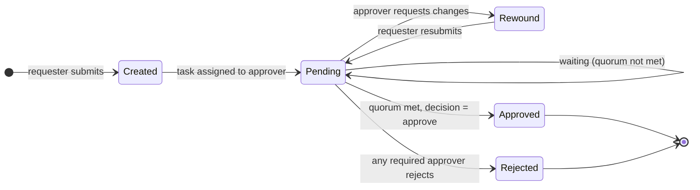
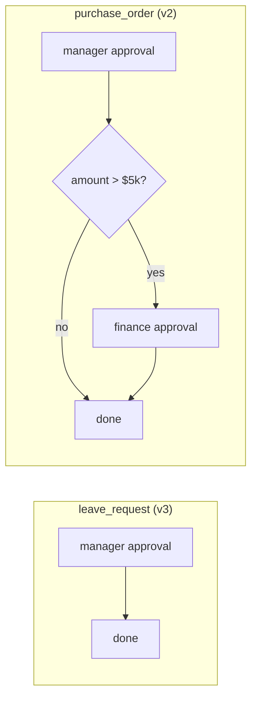
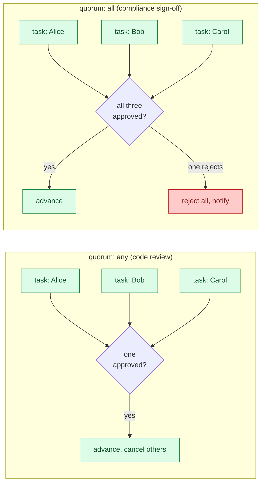
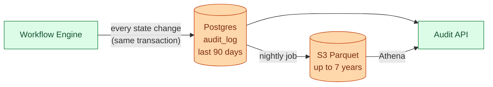
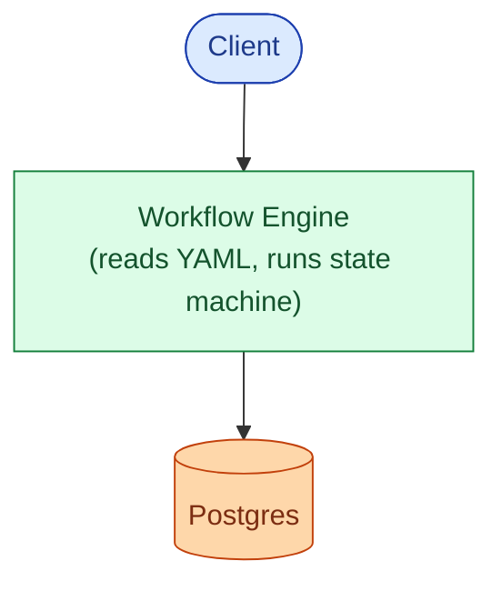
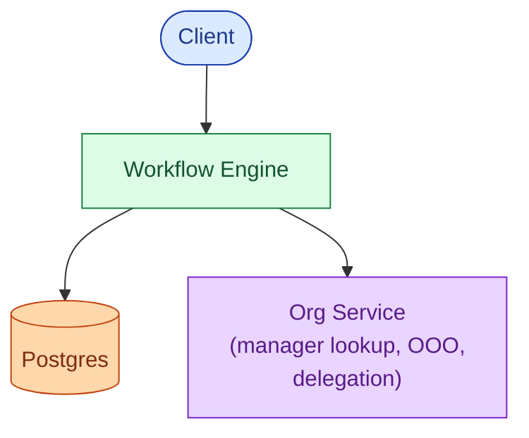
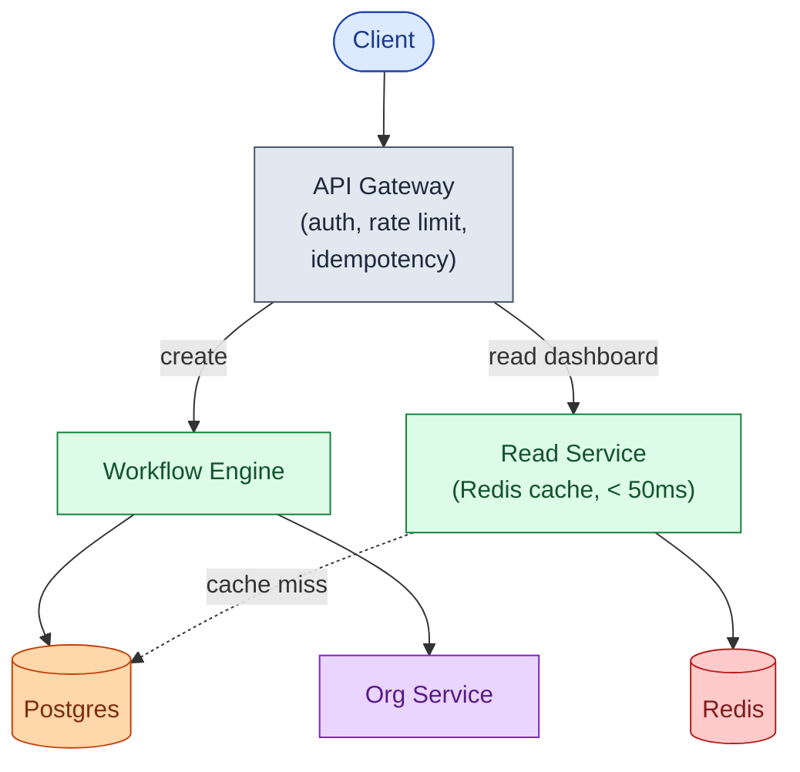
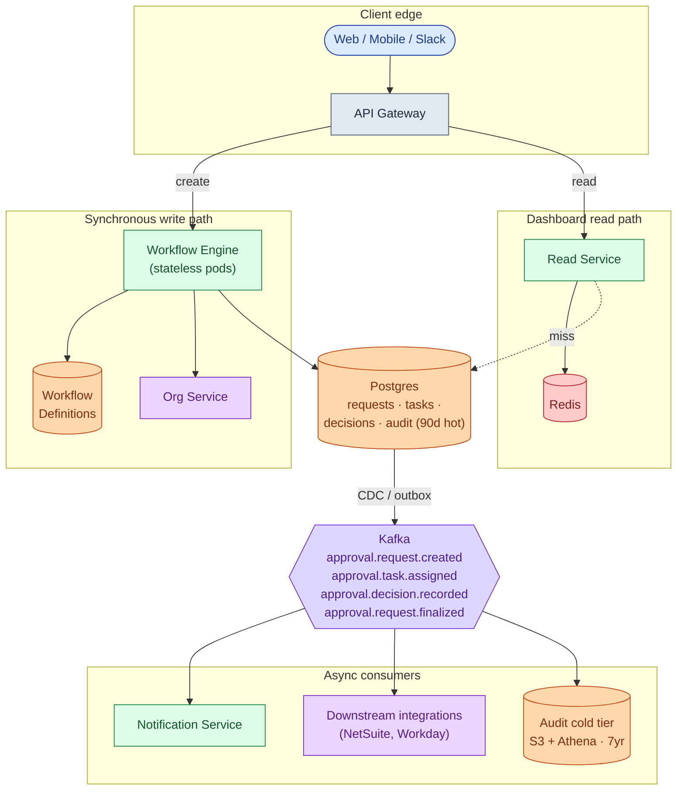
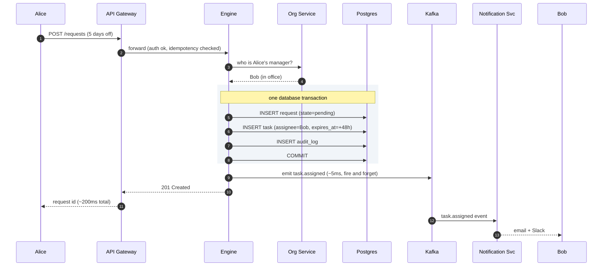
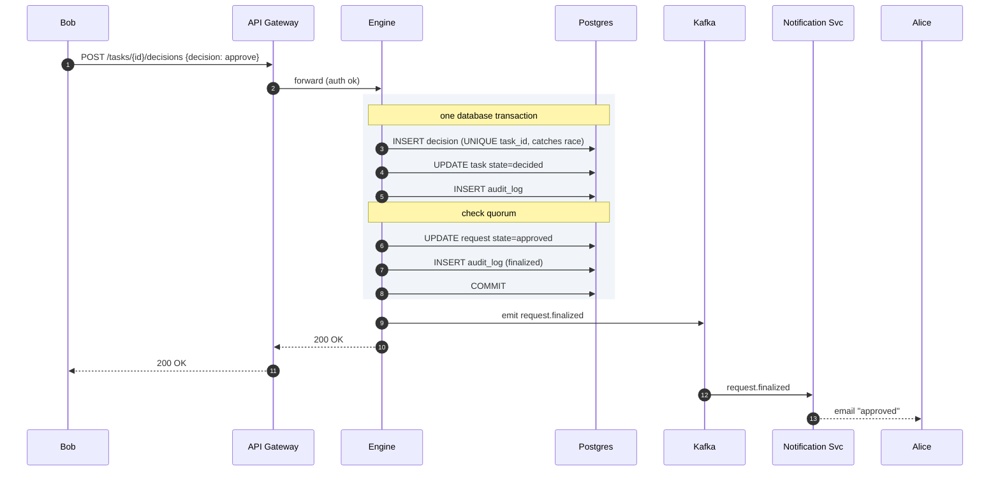

## What we are building

Alice asks for 3 days off. She fills in a form. Her manager approves it. Done.

Alice buys a $1,200 laptop. Same company, same intranet: she fills in a form, her manager approves, then finance approves, then the order goes through.

Both flows feel like the same thing. They are. One engine reads a recipe, assigns tasks to people, waits for decisions, and moves forward. The goal is to build that engine once, then handle 50 different workflows the company invents without writing new code for each one.

The hard problems hiding in this product:

1. **Workflow as data.** You cannot hardcode every workflow in code. The engine must read a recipe at runtime, not compile one in.
2. **Role resolution and vacation.** "The requester's manager" is a template, not a name. Resolving it is complicated when the manager is out and their delegate is also out.
3. **Parallel approval with quorum.** Some requests need one of three people to approve. Some need all three. The engine must handle both without special cases.
4. **The audit trail.** Five years from now an auditor asks who approved a $50,000 purchase order. Org charts change. People leave. The system must still answer.

We will start with the simplest version that works. Then we add one pressure at a time.

---

## The lifecycle of one approval request

Every request goes through a small set of states. Picture this before drawing any boxes.



Seven states cover the full product: `Created`, `Pending`, `Rewound`, `Approved`, `Rejected`, plus `Cancelled` (withdrawn by requester) and `Expired` (deadline passed with no decision). Everything else (vacation routing, parallel approvals, audit) is machinery around these transitions.

> **Take this with you.** An approval service is a state machine, run many times, on many shapes of request. The engine drives the same transitions whether it is a leave request or a $50,000 purchase order.

---

## How big this gets

Same product, two very different companies.

| Input | Startup (50 people) | Enterprise (100,000 people) |
|-------|---------------------|------------------------------|
| Requests per day | ~36 | ~71,000 |
| Requests per second (peak) | tiny | ~3 |
| Active requests in flight | ~70 | ~200,000 |
| Workflow types | 2 to 5 | 1,000 to 5,000 |

<details markdown="1">
<summary><b>Show: how these numbers come out</b></summary>

Assume each person creates roughly 5 approval requests per week.

- **Startup (50 people).** 50 × 5 = 250/week, or about 36/day.
- **Enterprise (100k people).** 100k × 5 = 500k/week, or about 71,000/day = 0.8/sec steady, ~3/sec peak.
- A typical request stays open about 3 days. With 71,000 per day flowing in and out, roughly 200,000 are open at any moment.

What this tells us:

- **The throughput is small.** Even at enterprise scale, a single Postgres handles the write volume. This is not a high-throughput system.
- **Reads beat writes 25 to 1.** Every employee checks their dashboard around ten times a day. 100,000 employees × 10 reads = 1 million reads per day, against 71,000 writes.
- **The hard number is 200,000 active requests.** The "show me my pending approvals" query has to find the right subset in under 50ms. That is where caching matters.

</details>

> **Take this with you.** This is not a throughput problem. It is an organizational complexity problem: thousands of workflow types, tens of thousands of approver roles, and a read path that must stay fast for every employee's dashboard.

---

## The smallest version that works

Forget enterprise. We are a 10-person startup. One workflow: leave requests. Manager approves. Done.


Two endpoints and one table. Nothing else.

| Endpoint | What it does |
|----------|--------------|
| `POST /requests` | Accept inputs, write a row, email the approver |
| `POST /tasks/{id}/decisions` | Record approve or reject, email the requester |

<details markdown="1">
<summary><b>Show: the one table</b></summary>

```sql
CREATE TABLE leave_requests (
    id           UUID PRIMARY KEY,
    employee_id  TEXT NOT NULL,
    manager_id   TEXT NOT NULL,
    start_date   DATE,
    end_date     DATE,
    state        TEXT NOT NULL,
    created_at   TIMESTAMPTZ DEFAULT NOW(),
    decided_at   TIMESTAMPTZ
);
```

Six columns. This is the right place to start. Every column you add from here responds to a real problem, not an anticipated one.

</details>

> **Take this with you.** Always start from the smallest thing that works. The interesting part of the interview is what happens next.

---

## Decision 1: workflow as data

The product is live. The CFO asks: *"Can you also handle purchase order approvals? Same idea, but anything over $5,000 also needs finance to sign off."*

You look at the code. The word `leave_request` is everywhere. If you copy-paste the table, you copy-paste again for expenses, contracts, and twenty more workflows this year.

The fix: stop hardcoding workflows. Treat them as data. The engine reads a recipe at runtime and executes it.



Same engine. Different recipe. A new workflow takes five minutes to add, with no deploy.

<details markdown="1">
<summary><b>Show: a workflow written as YAML</b></summary>

```yaml
workflow: leave_request
version: 3

steps:
  - id: auto_approve_short
    when: days < 3
    action: approve

  - id: manager_approval
    type: approval
    approver: "{{ employee.manager }}"
    timeout: 48h
    on_timeout: escalate

  - id: hr_and_grandboss
    when: days > 14
    type: parallel
    branches:
      - approver: "{{ employee.manager.manager }}"
      - approver: "hr-leave-admin"
    quorum: all
```

Five things this recipe language needs:

1. **Conditional steps (`when:`).** Auto-approve short leaves. Skip finance for small purchases.
2. **Timeouts.** Without them, the queue grows forever. Humans miss things.
3. **Delegation.** Vacation happens. The engine follows the chain without looping.
4. **Parallel with quorum.** Some flows need any 1 of 3. Others need all. The recipe says which.
5. **Roles, not just users.** If the `hr-leave-admin` person quits, the workflow routes to whoever fills the role.

The `version` field is important. A request created on v3 stays on v3 forever, even after v4 ships. Otherwise, in-flight requests change shape mid-flight and audit becomes impossible.

</details>

> **Take this with you.** Workflows are data, not code. The engine reads the data and runs it. If you hardcode workflows, you build one service per workflow type, and you will never stop building them.

---

## Decision 2: how does the engine find the right approver?

The recipe says `approver: "{{ employee.manager }}"`. The engine has to resolve that template into a real, live person before it can assign a task.

That sounds easy. Production makes it complicated.


Three safety rails make this production-safe:

1. **Cap the depth.** Five hops is the most any real org chart needs. After five, raise an error and page someone.
2. **Track visited users.** If the chain loops back to someone already seen, stop and alert.
3. **Record the chain on the task.** Dave's UI shows *"You are approving on behalf of Bob, via Carol."* The audit log records the same chain.

<details markdown="1">
<summary><b>Show: the resolver algorithm</b></summary>

```python
def resolve_approver(spec, requester, when):
    target = render_template(spec, {"employee": requester})

    if is_role(target):
        members = org.role_members(target, at=when)
        if not members:
            raise NoApproverFound(target)
        target = pick_round_robin(members)

    return follow_delegation(target, when, depth=0, visited=set())


def follow_delegation(user, when, depth, visited):
    if depth > 5:
        raise DelegationTooDeep(user)
    if user.id in visited:
        raise DelegationCycle(visited)
    visited.add(user.id)

    if not user.exists:
        return fallback_for_departed(user)

    ooo = org.get_active_ooo(user, at=when)
    if ooo is None or ooo.delegate is None:
        return user
    return follow_delegation(ooo.delegate, when, depth + 1, visited)
```

The `when` parameter is the key to audit replay. Resolving who would have been the approver at a specific point in the past requires a point-in-time view of the org chart. People change jobs. Delegations expire. Roles get reassigned.

</details>

> **Take this with you.** Vacation chains are where most approval systems break in production. The fix is not clever code. It is boring discipline: cap depth, track visited, record the chain.

---

## Decision 3: how does parallel approval work?

Some requests need any one of three people to approve. Others need all three. A leave of more than 14 days might need both HR and the requester's grandboss, and both must approve.

The engine must handle this without the workflow definition listing every possible combination.



The race condition matters here. Two people both click Approve in the same millisecond. The database handles it: a `UNIQUE` constraint on `decisions.task_id` lets one INSERT win and gives the other a conflict error. The API turns that into a 409. No application-level locks needed.

> **Take this with you.** Parallel approval is solved at the database layer, not the application layer. The unique constraint on the decision record is what prevents double-advance.

---

## Decision 4: how do we build an audit trail that holds up?

Five years from now an auditor asks: *"Show me every approval decision on purchase orders over $50,000 in Q3 2024."* By then, the people who made those decisions may have left. The workflow definitions have changed. Roles have been reorganized.

The audit log is not a log file. It is a separate product, with its own schema and retention policy.



Five rules for the audit schema:

1. **Append-only.** No UPDATE. No DELETE. The DB user that writes audit has INSERT-only privileges.
2. **Snapshot in every row.** The request's full state at that moment, frozen. Replay the request's life by walking events in order.
3. **Workflow version pinned.** If a request ran against v3, the audit row says v3. Shipping v5 does not change it.
4. **Who and on whose behalf.** If Carol approved as Bob's delegate, both names are in the record.
5. **Hash chain for high-compliance environments.** Each event has a `prev_hash` and a `hash`. Tampering with one event invalidates every event after it. Required in healthcare and financial services.

<details markdown="1">
<summary><b>Show: the audit_log schema</b></summary>

```sql
CREATE TABLE audit_log (
    event_id          UUID PRIMARY KEY,
    occurred_at       TIMESTAMPTZ NOT NULL,
    request_id        UUID NOT NULL,
    workflow_id       TEXT NOT NULL,
    workflow_version  INT NOT NULL,
    event_type        TEXT NOT NULL,
    actor             JSONB,                   -- {user, role, delegated_from}
    payload           JSONB NOT NULL,
    snapshot          JSONB,                   -- request state at this moment
    prev_hash         TEXT,                    -- for hash chain
    hash              TEXT
);

CREATE INDEX idx_audit_request   ON audit_log (request_id, occurred_at);
CREATE INDEX idx_audit_workflow  ON audit_log (workflow_id, occurred_at);
CREATE INDEX idx_audit_actor     ON audit_log USING gin (actor);
```

No foreign key to `requests`. On purpose. If a request is ever deleted (GDPR, mistaken bulk import), the audit must survive. Audit is the truth-of-record.

Hot tier: last 90 days in Postgres. Cold tier: S3 Parquet, queried via Athena, retained for 7 years. A nightly job moves rows between tiers.

</details>

> **Take this with you.** Audit lives next to the application but is a different product, with its own schema, retention, and query interface. Treating it as a side effect is the most common mistake in approval system design.

---

## The full architecture

Putting the four decisions together gives us the system. Built incrementally, one layer at a time.

### v1: just the engine



Fine for ten users.

### v2: adding role resolution

The recipe says *"the employee's manager."* Add the Org Service, a thin layer over Workday or BambooHR with a 5-minute cache.



### v3: adding the read path

Reads beat writes 25 to 1. Every employee opens their dashboard ten times a day. Add a Read Service backed by Redis.



### v4: full architecture with async consumers

Notifications and integrations should not slow down the write path. If SendGrid is down, approvals must still flow. Add Kafka. Anything reactive becomes a consumer.



| Component | Purpose |
|-----------|---------|
| API Gateway | Authenticates the caller, rate-limits bots, dedupes mobile retries. |
| Workflow Engine | Reads state, picks the next step, assigns tasks. Stateless. |
| Org Service | Manager lookups, OOO status, delegation chains. Cached aggressively. |
| Workflow Definitions | Versioned YAML recipes. Immutable per version. |
| Postgres | Source of truth. Live state plus the last 90 days of audit. |
| Read Service + Redis | Optimized for the dashboard. Denormalized pending-task list per user. |
| Kafka | Carries events to the async world. |
| Notification, Integrations, Cold audit | Consumers. Not on the write path. |

> **Take this with you.** If the notification service dies at 3 a.m., new approvals still flow. Emails just queue up. Anything reactive lives after Kafka, not before.

---

## Walk: a request from submit to assigned

Alice submits a 5-day leave request.



Three details to call out:

1. The request, the task, and the audit record are written in **one transaction**. A crash mid-write rolls back cleanly. Either all three exist, or none.
2. Kafka is written after the commit. The response goes to Alice before notifications fan out.
3. The engine is stateless. Restart any pod at any time. State lives in Postgres.

---

## Walk: a decision, and parallel quorum

Bob clicks Approve. The leave is simple, so one approval finishes the request.



The `UNIQUE (task_id)` constraint on `decisions` is what serializes the race. Two people clicking at the same millisecond: one INSERT wins, the other fails with a conflict, the API returns 409. The request advances exactly once, with no application-level lock.

---

## Follow-up questions

Try answering each in 2 or 3 sentences before opening the solution.

1. **Self-approval.** A user submits a PO and is also in the finance approver group. How do you stop them from approving their own request?

2. **Approver leaves the company.** Their dashboard still shows a pending task, but they cannot log in. What happens to that task?

3. **Delegation cycle.** Alice delegates to Bob. Bob delegates to Alice. The engine tries to resolve Alice's request and loops forever. How do you stop it?

4. **Workflow version migration.** You ship `leave_request` v4. There are 800 requests still in flight on v3. What happens to them?

5. **Two approvers click at the same moment.** They are both listed in parallel with `quorum: any`. Both hit Approve in the same millisecond. Does the request advance twice?

6. **Auto-approval rule was broken.** Last night, a `when: amount < 100` rule auto-approved 50,000 fraudulent micro-purchases. How do you detect this and recover?

7. **Bulk import.** HR wants to load 5,000 historical leave requests with their original timestamps and approvers. How do you preserve the audit trail's accuracy?

8. **Slow dashboard.** Carol has 120 pending tasks. Her dashboard takes 4 seconds to load. Why? How do you fix it?

9. **Search across all approvals.** An auditor needs *"all POs mentioning vendor Acme Corp approved in Q2."* Your `requests` table has a JSON `inputs` column. Naive search is slow. What do you do?

10. **NetSuite integration.** Every approved PO must create a record in NetSuite. NetSuite returns 5xx errors 1% of the time. How do you guarantee the record is created exactly once?

11. **Notification storm.** A request transitions through 8 states in 10 minutes. 12 watchers get 8 emails each. They unsubscribe. How do you fix it?

12. **The "approve all" button.** Carol has 80 pending leave requests for school holiday week. She wants to approve them all at once. What does the backend API look like, and what can go wrong?

13. **Privacy.** Salary-affecting decisions (raise requests) should not be visible to non-HR users, even in audit logs. How do you enforce this?

14. **Infinite-loop workflow.** A workflow author writes step A to step B to step A. You publish it. The first request through it loops forever. How do you catch this before publication?

15. **Multi-region.** EU operations open. EU employee data must stay in EU. How does the engine handle a request where the requester is in EU but the approver is in US?

---

## Related problems

- **[Notification System (010)](../010-notification-system/question.md).** Every approval event fires off notifications. The fan-out, retry, and quiet-hours machinery there consumes the approval engine's events.
- **[Help Desk Ticketing (019)](../019-helpdesk-ticketing/question.md).** Same state-machine, role-routing, and SLA-timer patterns. A ticket's lifecycle is structurally identical to an approval's.
- **[Write-Heavy System Patterns (018)](../018-write-heavy-patterns/question.md).** The audit log here is exactly a write-heavy append-only system.
- **[Read-Heavy System Patterns (017)](../017-read-heavy-patterns/question.md).** The "my pending approvals" dashboard is the read-heavy half of this design.
