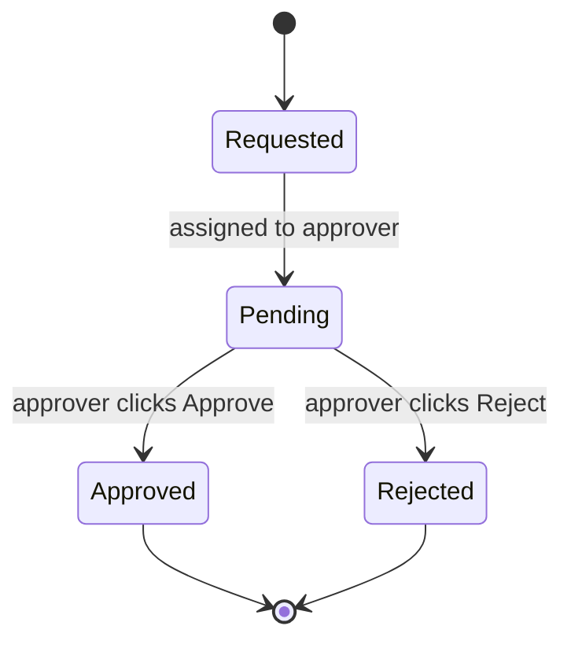
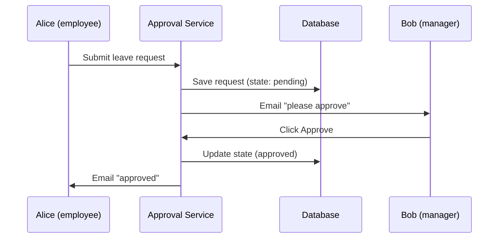
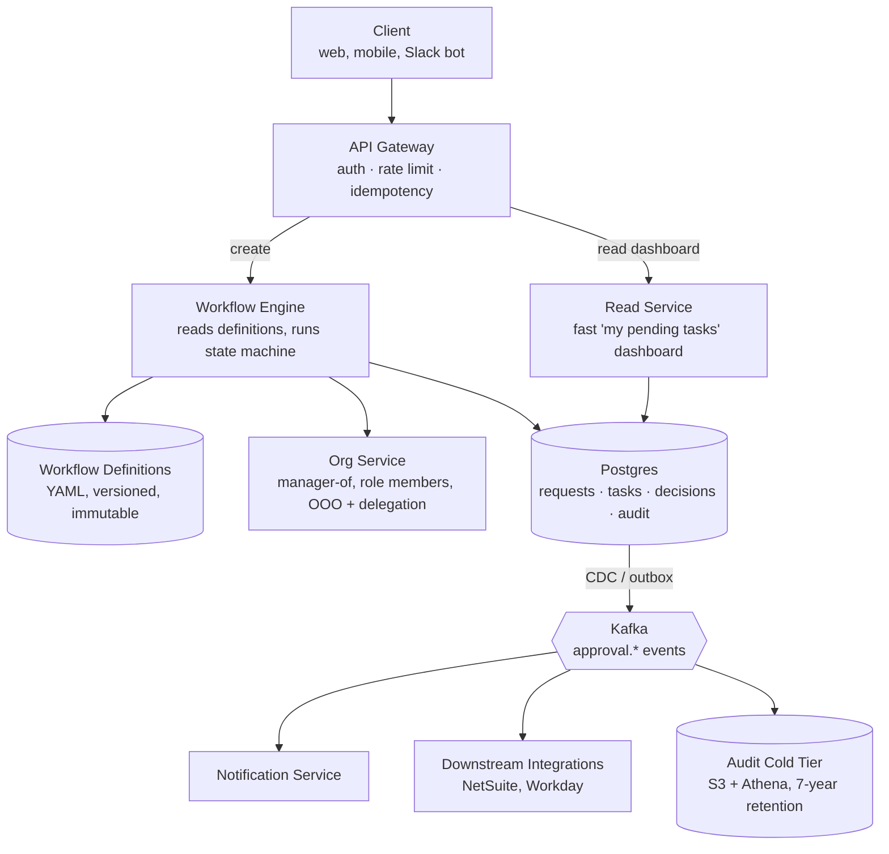
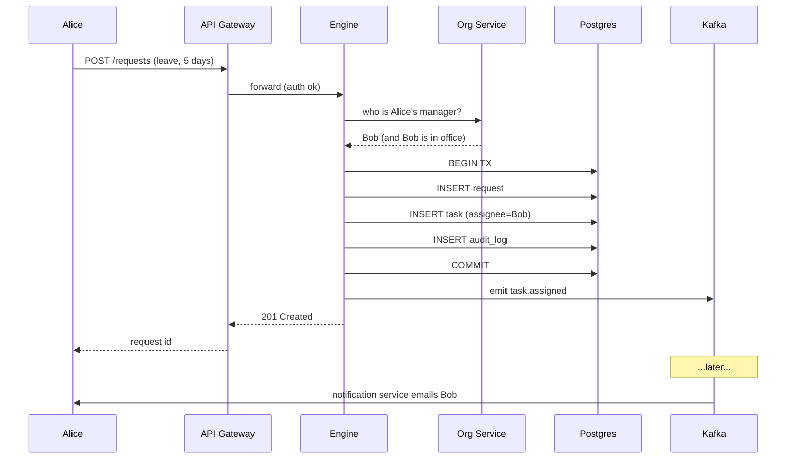
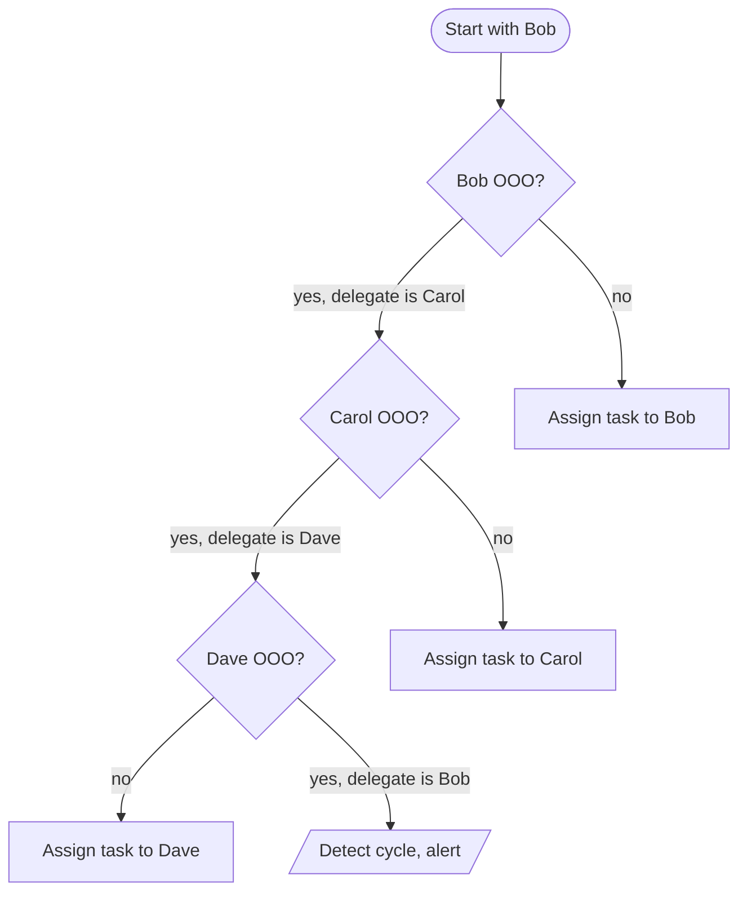
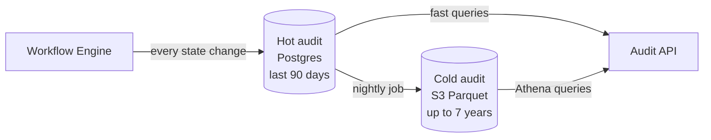

## The scene

You sit down. The interviewer smiles and says:

> *"Think of the last time you asked your boss for time off. You filled in a form, your boss clicked Approve, you got the days. Easy."*
>
> *"Now imagine the same company also approves expenses, purchase orders, code reviews, and contract signatures. Different rules, different approvers, but the basic shape is the same: someone asks, someone decides. Design one service that handles all of them."*

That is the question. It sounds tiny. It is not.

Here is the trap. The word "approval" sounds like a single checkbox. The real questions are different:

- What happens when the approver is on vacation?
- What if they never respond?
- What if they quit the company while your request is still pending?
- How do you stop a person from approving their own request?
- And five years from now, when an auditor knocks, how do you prove who approved what?

We will start with the simplest version that works for ten people. Then we will add one pressure at a time and watch the design grow.

---

## Step 1: What is an approval, really?

Before any system design, picture the smallest possible approval. One person asks. One person decides. Three outcomes.



That is the whole product, in one picture. Everything we add later (multiple approvers, vacations, deadlines, audit) is a complication on top of this.

If you remember nothing else from this problem, remember: **an approval service is a small state machine, asked to run a lot of times, by a lot of people, on a lot of different shapes of request.**

---

## Step 2: Ask the right questions

In a real interview you should sit quietly for two minutes and write down what you want to ask. Not twenty questions. Five good ones.

<details markdown="1">
<summary><b>Show: 5 questions that change the design</b></summary>

1. **One workflow, or many?** Just leave requests? Or also expenses, POs, contracts? *Almost always many. This is the biggest decision in the whole design.*
2. **Who writes the workflow rules?** Engineers in code, or HR admins in a UI? *If non-engineers write them, you need a definition store, a UI, and versioning.*
3. **What about vacation?** If Alice is out, does her approval auto-route to Bob? *Delegation is the single biggest source of production bugs.*
4. **What if nobody responds?** Auto-approve after 48 hours? Escalate? Page someone? *This is the SLA layer.*
5. **How long do we keep the records?** SOX needs 7 years. Healthcare needs longer.

A strong candidate also asks the meta question: *"Is sending the notifications part of this service, or a separate one?"* The right answer is separate. The engine emits events. A notification service consumes them.

</details>

---

## Step 3: How big is this thing?

Same problem, two scales.

| Scale | Employees | Requests/day | Per second | Active in flight |
|-------|-----------|--------------|------------|------------------|
| Startup | 50 | ~36 | tiny | 50 to 70 |
| Enterprise | 100,000 | ~71,000 | ~1 steady, ~3 peak | ~200,000 |

<details markdown="1">
<summary><b>Show: how the numbers come out</b></summary>

Assume each person creates about 5 approval requests per week.

**Startup (50 people).** 50 × 5 = 250 requests/week ≈ **36 per day**. One every 40 minutes. A Google Sheet could handle this.

**Enterprise (100,000 people).** 100k × 5 = 500k/week ≈ **71,000 per day** ≈ **1 per second steady, 3 per second at peak**. Each request lives about 3 days on average, so ~200,000 are open at any moment.

**What the math is telling you.** The throughput is small. A single Postgres handles it. The real problem at enterprise scale is not requests per second, it is **organizational complexity**: thousands of workflow types, tens of thousands of approver roles, hundreds of downstream integrations.

Also: reads beat writes 25 to 1. Every employee opens their dashboard ~10 times a day to check status. The read path matters more than the write path.

</details>

---

## Step 4: Build the simplest version that works

Forget enterprise for a moment. We are a 10-person startup. One workflow: leave requests. Manager approves. Done.

Picture the flow:



That is it. A web form, a database table with five columns, and an email. You could build it in a weekend.

<details markdown="1">
<summary><b>Show: the database table</b></summary>

```sql
CREATE TABLE leave_requests (
    id              UUID PRIMARY KEY,
    employee_id     TEXT NOT NULL,
    manager_id      TEXT NOT NULL,
    start_date      DATE,
    end_date        DATE,
    state           TEXT NOT NULL,    -- 'pending', 'approved', 'rejected'
    created_at      TIMESTAMPTZ DEFAULT NOW(),
    decided_at      TIMESTAMPTZ
);
```

Five columns. Tiny. This is the right place to start. Everything we add from here is in response to a real problem.

</details>

This is the version most candidates would draw on the whiteboard. It is correct. The interesting part of the interview is what happens next.

---

## Step 5: Then what breaks?

The next morning the CFO walks in: *"Can your team also handle purchase order approvals? Same idea, but anything over $5k also needs finance to sign off."*

You look at your code. The word `leave_request` is everywhere. If you copy-paste a `purchase_orders` table, you are going to copy-paste another five tables this year. Each one a near-copy of the last. Each one slightly different.

This is the trap. The fix is one idea: **stop hardcoding the workflow. Treat it as data.**

A workflow becomes a small recipe the engine reads:

```
leave_request:
   step 1: ask the employee's manager
   step 2: done

purchase_order:
   step 1: ask the employee's manager
   step 2: if amount > $5,000, also ask finance
   step 3: done
```

Same engine. Different recipe. New workflows take five minutes, no deploy.

<details markdown="1">
<summary><b>Show: a workflow written as YAML</b></summary>

```yaml
workflow: leave_request
version: 3

steps:
  - id: auto_approve_short
    when: days < 3
    action: approve

  - id: manager_approval
    type: approval
    approver: "{{ employee.manager }}"
    timeout: 48h
    on_timeout: escalate

  - id: hr_and_grandboss
    when: days > 14
    type: parallel
    branches:
      - approver: "{{ employee.manager.manager }}"
      - approver: "hr-leave-admin"
    quorum: all
```

A workflow language needs to support five things, and each one maps to a real problem:

1. **Conditional steps (`when:`).** Auto-approve short leaves. Skip finance for tiny POs.
2. **Timeouts (`timeout:` + `on_timeout:`).** Humans miss things. Without timeouts your queue grows forever.
3. **Delegation.** Vacation happens. The engine has to follow the chain without looping.
4. **Parallel with quorum.** Code review needs 2 of 3 senior approvals. Some signoffs need *all* department heads.
5. **Roles, not just users.** If `hr-leave-admin` quits, the workflow still works. The engine resolves the role to a real person at runtime.

The `version` field matters. When this request was created, the workflow was on v3. Even if v4 ships tomorrow, this request keeps running on v3, forever. Otherwise the shape of running requests changes mid-flight and audit becomes a nightmare.

</details>

---

## Step 6: The system, drawn out

Now we have an engine that reads workflow definitions and runs them. Here is the whole architecture.



What each box does, in one line:

- **API Gateway.** Authenticates the caller, rate-limits bots, dedupes retries.
- **Workflow Engine.** The brain. Reads the current state, decides what is next, assigns the next task. Stateless. State lives in Postgres.
- **Workflow Definitions.** Where the YAML recipes live. Versioned. New versions never overwrite old ones.
- **Org Service.** Knows Alice's manager is Bob, that Bob is on vacation, and that Carol is his delegate. Usually a thin layer over Workday or BambooHR.
- **Postgres.** Source of truth. Small live state, plus an append-only audit log for the last 90 days.
- **Read Service.** Optimized for the dashboard. Reads from a Redis cache populated by engine events. Lets the primary DB rest.
- **Kafka.** Carries events out to the side-effect world: notifications, downstream syncs, analytics, audit archival.
- **Audit cold tier.** Older audit rows in S3, queryable by Athena for years.

Notice what is *not* in the write path: notifications, downstream integrations, audit archival. They are all consumers of Kafka events. If the notification service dies at 3am, new approvals still flow. Emails just queue up.

---

## Step 7: One request, end to end

Picture Alice submitting a leave request, all the way through.



Three details worth pointing at:

1. The request, the task, and the audit row are all written in **one database transaction**. Either all three exist, or none do. Crashes mid-write roll back cleanly.
2. The engine writes the event to Kafka *after* the transaction commits. Notifications, integrations, and audit archival fan out from there.
3. The engine itself is stateless. Restart it in the middle of the day. The next request lands on a different pod and works fine.

---

## Step 8: The vacation problem (delegation)

The workflow says `approver: "{{ employee.manager }}"`. The engine has to turn that template into a real person before it can assign a task.

That sounds simple. Let's see why it isn't.

**Alice submits a leave request. Her manager is Bob. But:**

- Bob is on vacation. He set Carol as his delegate.
- Carol is on the same vacation. She set Dave as her delegate.
- Dave is in the office.

Who gets the task?



The engine walks the chain. Three safety rails make it production-safe:

1. **Cap the depth** (max 5 hops). Otherwise an HR mistake can recurse forever.
2. **Track visited users**. If the chain loops back to someone already seen, stop and raise an alert.
3. **Record the chain on the task.** Dave's dashboard then shows *"You are approving on behalf of Bob, via Carol."* Audit shows the same chain.

<details markdown="1">
<summary><b>Show: the resolver, written out</b></summary>

```python
def resolve_approver(spec, requester, when):
    target = render_template(spec, {"employee": requester})

    if is_role(target):
        members = org.role_members(target, at=when)
        if not members:
            raise NoApproverFound(target)
        target = pick_round_robin(members)

    return follow_delegation(target, when, depth=0, visited=set())


def follow_delegation(user, when, depth, visited):
    if depth > 5:
        raise DelegationTooDeep(user)
    if user.id in visited:
        raise DelegationCycle(visited)
    visited.add(user.id)

    if not user.exists:
        return fallback_for_departed(user)

    ooo = org.get_active_ooo(user, at=when)
    if ooo is None or ooo.delegate is None:
        return user
    return follow_delegation(ooo.delegate, when, depth + 1, visited)
```

The `when` parameter looks redundant but is the key to audit replay. To rebuild who *would have been* the approver back when this request was created, you need a point-in-time view of the org chart. People change jobs. Delegations expire. Roles get reassigned.

</details>

---

## Step 9: The audit trail

Five years from now an auditor will ask: *"Show me every approval decision on purchase orders over $50,000 in Q3 2024."*

By then:

- The people who made those decisions may have left.
- The workflow definitions have changed many times.
- The approvers' roles have been reorganized.

Your system must still answer. That means audit is not a log file. It is a product.



Five rules you cannot break:

1. **Append-only.** No UPDATE. No DELETE. Ever. The DB user that writes audit has INSERT-only privileges.
2. **Snapshot in every row.** The request's full state at that moment, frozen. Lets you replay the request's life by walking events in order.
3. **Workflow version pinned.** If `leave_request` is on v5 today and this request ran against v3, the audit row shows v3.
4. **Who and on whose behalf.** If Carol approved as Bob's delegate, both names are recorded.
5. **Hash chain for high-compliance industries.** Each event has `prev_hash` and `hash`. Tampering with one event invalidates every event after it. Required in healthcare and finance.

<details markdown="1">
<summary><b>Show: the audit_log schema</b></summary>

```sql
CREATE TABLE audit_log (
    event_id          UUID PRIMARY KEY,
    occurred_at       TIMESTAMPTZ NOT NULL,
    request_id        UUID NOT NULL,           -- referenced, not foreign key
    workflow_id       TEXT NOT NULL,
    workflow_version  INT NOT NULL,            -- pinned forever
    event_type        TEXT NOT NULL,
    actor             JSONB,                   -- {user, role, delegated_from}
    payload           JSONB NOT NULL,
    snapshot          JSONB                    -- request state at this moment
);

CREATE INDEX idx_audit_request   ON audit_log (request_id, occurred_at);
CREATE INDEX idx_audit_workflow  ON audit_log (workflow_id, occurred_at);
CREATE INDEX idx_audit_actor     ON audit_log USING gin (actor);
```

There is no foreign key to `requests`. On purpose. If a request is ever deleted (GDPR, mistaken bulk import), the audit must survive. Audit is the truth-of-record, not the requests table.

</details>

---

## Step 10: Four workflows, one engine

Here are four real workflows. The same engine, the same data model, the same audit log runs all of them. Each one stresses a different feature.

| Workflow | What stresses the engine | The lesson |
|----------|--------------------------|------------|
| **Purchase order** ($12k for servers) | Conditional steps. Manager always approves. Finance if > $5k. CFO if > $25k. | The engine must evaluate `when:` at each step and skip cleanly. |
| **Leave request** (21-day vacation) | Parallel approval with quorum. After manager, HR and grandboss in parallel. **Both** must approve. | Default quorum must be `all`, not `any`. Otherwise rubber-stamping is too easy. |
| **Expense report** (finance asks for a missing receipt) | Backward transitions. Request rewinds to the requester, then forward again. | Engine needs explicit `return_to_step`. Pending downstream tasks must be cancelled when the request rewinds. |
| **Code review** (PR with 2 approvals, new commit pushed) | External events. CI status must pass. New commits invalidate prior approvals. | Engine needs `on_input_change: invalidate_approvals` and the ability to react to non-human events. |

The big idea: one engine, four wildly different workflows, no special cases. If you instead built a separate `purchase_orders` service, you would also need a separate `leave_requests` service, then `expense_reports`, then `code_reviews`, then twenty more. That is the trap the design exists to avoid.

---

## Follow-up questions

Try answering each in 2 or 3 sentences before opening the solution.

1. **Self-approval.** A user submits a PO and is also in the finance approver group. How do you stop them from approving their own request?

2. **Approver leaves the company.** Their dashboard still shows a pending task forever, but they cannot log in. What happens to that task?

3. **Delegation cycle.** Alice delegates to Bob. Bob delegates to Alice. The engine tries to resolve Alice's request and loops forever. How do you stop it?

4. **Workflow version migration.** You ship `leave_request` v4. There are 800 requests still in flight on v3. What happens to them?

5. **Two approvers click at the same moment.** They are both listed in parallel with `quorum: any`. Both hit Approve in the same millisecond. Does the request advance twice?

6. **Auto-approval rule was broken.** Last night, finance's `when: amount < 100` rule auto-approved 50,000 fraudulent micro-purchases. How do you detect this and recover?

7. **Bulk import.** HR wants to load 5,000 historical leave requests with their original timestamps and approvers. How do you preserve the audit trail's accuracy?

8. **Slow dashboard.** Carol has 120 pending tasks. Her dashboard takes 4 seconds to load. Why? How do you fix it?

9. **Search across all approvals.** Auditor needs *"all POs mentioning vendor Acme Corp approved in Q2."* Your `requests` table has a JSON `inputs` column. Naive search is slow. What do you do?

10. **NetSuite integration.** Every approved PO must create a record in NetSuite. NetSuite returns 5xx errors 1% of the time. How do you guarantee the record is created exactly once?

11. **Notification storm.** A request transitions through 8 states in 10 minutes. 12 watchers get 8 emails each. They unsubscribe. How do you fix it?

12. **The "approve all" button.** Carol has 80 pending leave requests for school holiday week. She wants to approve them all at once. What does the backend API look like, and what can go wrong?

13. **Privacy.** Salary-affecting decisions (raise requests) should not be visible to non-HR users, even in audit logs. How do you enforce this?

14. **Infinite-loop workflow.** A workflow author writes step A → step B → step A. You publish it. First request through it loops forever. How do you catch this before publication?

15. **Multi-region.** EU operations open. EU employee data must stay in EU. How does the engine handle a request where the requester is in EU but the approver is in US?

---

## Related problems

- **[Notification System (010)](../010-notification-system/question.md).** Every approval event fires off notifications. The fan-out, retry, and quiet-hours machinery there consumes the approval engine's events.
- **[Help Desk Ticketing (019)](../019-helpdesk-ticketing/question.md).** Same state-machine + role-routing + SLA-timer patterns. A ticket's lifecycle is structurally identical to an approval's.
- **[Write-Heavy System Patterns (018)](../018-write-heavy-patterns/question.md).** The audit log here is exactly a write-heavy append-only system.
- **[Read-Heavy System Patterns (017)](../017-read-heavy-patterns/question.md).** The "my pending approvals" dashboard is the read-heavy half of this design.
