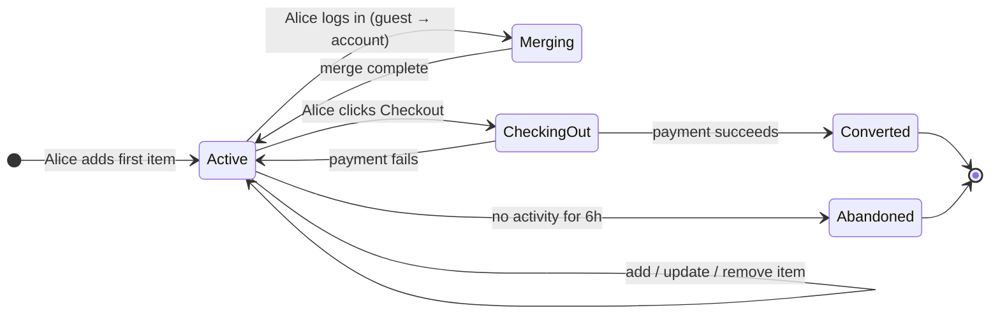
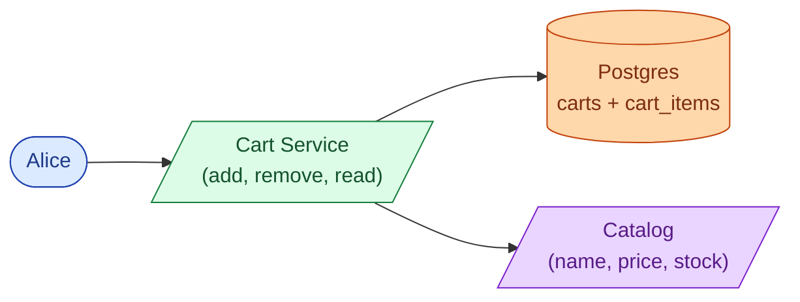
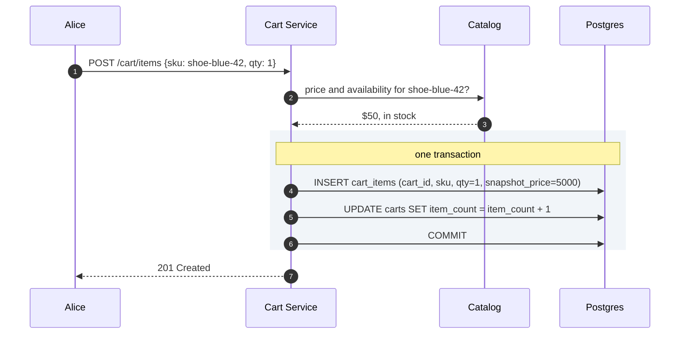
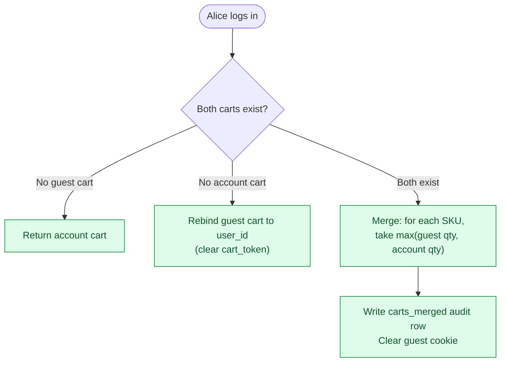
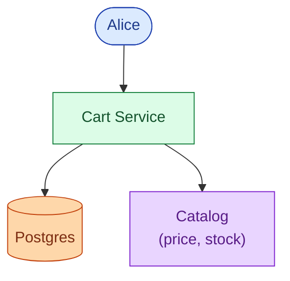
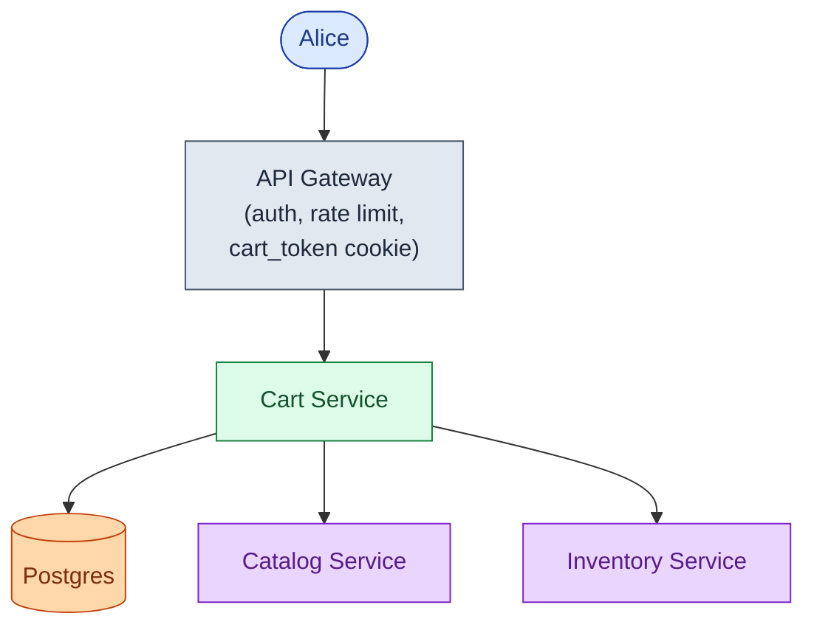
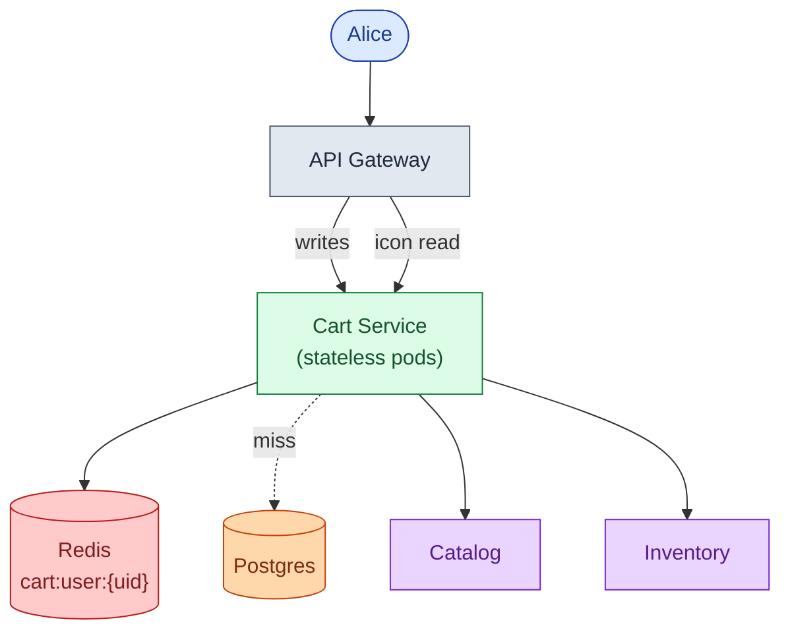
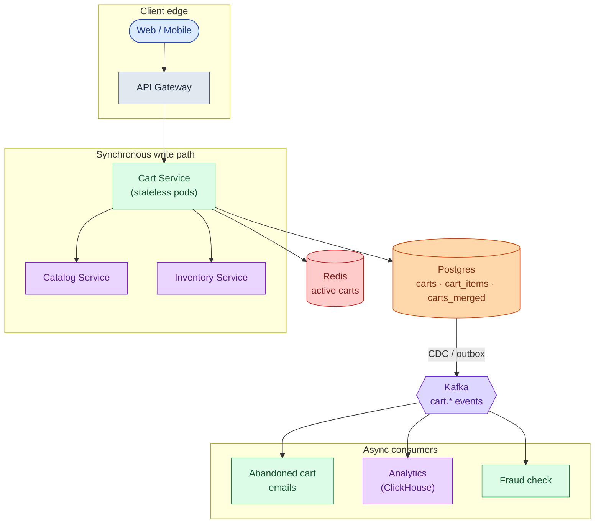
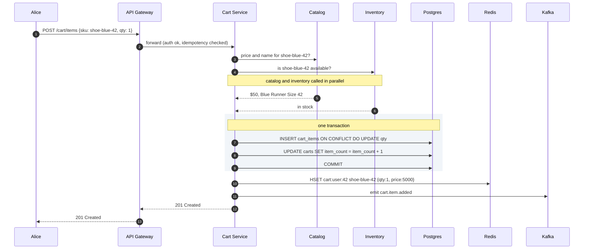
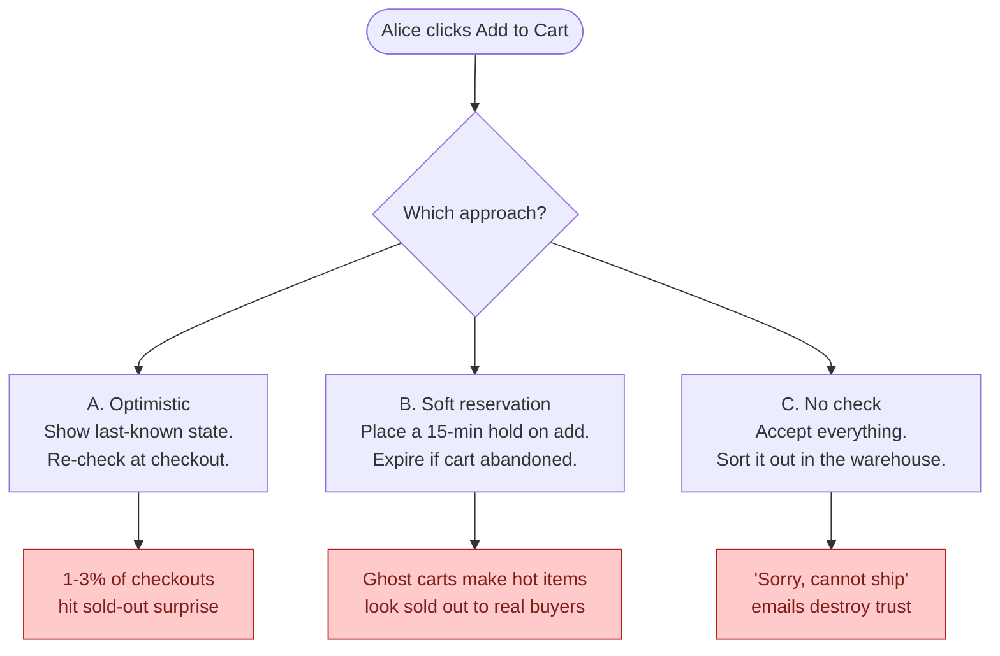

## The scene

You sit down. The interviewer opens a browser tab.

> *"We sell shoes online. About 500 customers a day today. You know the cart experience: add items, change the count, leave for two hours, come back, and your stuff is still there."*
>
> *"Build that. And plan for growth."*

They lean back. *"This one sounds easy."*

That smile is a warning.

The word **cart** sounds like a checkbox. Three buttons, one table, done in a day. The real questions hide in the gaps:

- Where does the cart actually live? In the browser? On the server? In Redis?
- A guest adds 3 items, then logs in. They already had 2 items saved. What does the cart show?
- The cart says "in stock." Twenty minutes later the user clicks Buy. Someone else took the last pair. What now?
- The cart icon appears on every page. At a million users, that is 350 reads per second. From what?

We will start with a 10-person prototype and add one pressure at a time, watching the design grow.

---

## Step 1: Picture one cart

Before boxes and arrows, just picture what one cart **is**. Alice adds shoes. She changes her mind. She buys.



Everything added later (Redis, Kafka, reservations, price drift) is a complication on top of this one diagram.

> **Take this with you.** A cart is a small state machine per user. The interesting part is not the state machine. It is what happens between Active and Converted.

---

## Step 2: Ask the right questions

In a real interview, write down your questions before drawing anything. Not twenty. Five good ones that change the design.

<details markdown="1">
<summary><b>Show: 5 questions that change the design</b></summary>

1. **Guests or login only?** Can someone add items without an account? Almost every real shop says yes. This single answer decides whether you need merge logic at login. *Almost always: yes, guests can add.*

2. **How long does a cart live?** One hour? One day? Thirty days? A short cart can live in Redis with a TTL. A thirty-day cart needs Postgres as the source of truth, because Redis is not a durable store.

3. **Multi-device sync?** If Alice adds a shoe on her phone, does she see it on her laptop five minutes later? If yes, the cart must live on the server. A cookie in the browser will not work across devices.

4. **What does "in stock" mean?** Three very different options:
   - Hold it for Alice for 15 minutes (soft reservation)
   - Show her the last-known state and re-check at checkout (optimistic)
   - Accept the order and sort it out later (no check)
   These three options lead to three different architectures.

5. **Who does the checkout?** Does the cart service complete the purchase, or does it hand off a frozen snapshot to an order service? The answer changes who owns the inventory decrease and the payment call.

A strong candidate also asks: *"Is sending notifications part of this service, or a separate one?"* The cart emits events. A notification service consumes them. Keep those two things apart.

</details>

---

## Step 3: How big is this thing?

Same shop, two very different sizes.

| Company | Visitors/day | Carts/day | Writes/sec | Reads/sec | Active now |
|---------|--------------|-----------|------------|-----------|------------|
| Small shop | 500 | 150 | ~0.003 | ~0.06 | ~50 |
| Big shop (1M users) | 1,000,000 | 300,000 | 7 (peak 21) | 115 (peak 350) | ~25,000 |

<details markdown="1">
<summary><b>Show: how the numbers come out</b></summary>

Assume 30% of visitors add at least one item. Average cart: 3 items, edited twice.

**Small shop (500 visitors/day):**
- Carts: 500 × 30% = 150/day
- Cart writes: 150 × 2 edits = 300/day → **0.003/sec**
- Cart icon reads: 500 visitors × 10 page views = 5,000/day → **0.06/sec**
- Active carts: 150 carts × average life of ~8h / 24h ≈ **50 open at any moment**
- Storage: 150 × 3 items × 200 bytes ≈ 90 KB/day. One year: ~33 MB.

**Big shop (1M visitors/day):**
- Carts: 300,000/day → **3.5/sec** steady, **10/sec** at peak
- Cart writes: 600,000/day → **7/sec** steady, **21/sec** at peak
- Cart icon reads: 1M × 10 page views = 10M/day → **115/sec** steady, **350/sec** at peak
- Active carts: 300,000 × 30-day TTL / 30 ≈ **25,000 open at any moment**
- Storage: 300k carts × 3 items × 200 bytes ≈ 180 MB/day. One month of live carts: ~5.5 GB.

**The number that matters:** writes are tiny even at 1M users. A single Postgres handles 20 writes/sec without breathing hard. The real challenge is the cart icon read on every page: 350/sec at peak, with a tight latency requirement. That is the bottleneck.

| Metric | At 1M users |
|--------|-------------|
| Writes/sec | ~21 peak. Any database handles this. |
| Reads/sec | ~350 peak. This is the real challenge. |
| Storage | ~7 GB live. Nothing. |
| Real bottleneck | Cart icon read on every page. Not the buy button. |

</details>

> **Take this with you.** The cart is a read-heavy problem disguised as a write problem. Optimize the cart icon read, not the add-item write.

---

## Step 4: The smallest thing that works

Forget scale. We are a 10-person startup. Logged-in only. One Postgres table. One server.



Alice adds a shoe. Here is the full sequence.



<details markdown="1">
<summary><b>Show: the two tables</b></summary>

```sql
CREATE TABLE carts (
    cart_id     UUID PRIMARY KEY,
    user_id     BIGINT,
    cart_token  UUID,
    status      TEXT NOT NULL DEFAULT 'active',
    item_count  INT NOT NULL DEFAULT 0,
    created_at  TIMESTAMPTZ NOT NULL DEFAULT NOW(),
    updated_at  TIMESTAMPTZ NOT NULL DEFAULT NOW(),
    expires_at  TIMESTAMPTZ
);

CREATE TABLE cart_items (
    cart_id              UUID NOT NULL REFERENCES carts(cart_id),
    sku                  TEXT NOT NULL,
    qty                  INT NOT NULL CHECK (qty > 0 AND qty <= 99),
    snapshot_price_cents INT NOT NULL,
    added_at             TIMESTAMPTZ NOT NULL DEFAULT NOW(),
    PRIMARY KEY (cart_id, sku)
);
```

`item_count` is denormalized on the `carts` row. The cart icon on every page only needs that one number. One row read, no JOIN, no catalog call.

`snapshot_price_cents` records what the price was when Alice added the item. If the price changes tomorrow, the audit trail still shows what she saw.

</details>

> **Take this with you.** Two tables and a stateless service carry the whole product for the first thousand users. The interesting work starts when something breaks.

---

## Step 5: The first crack

Everything above works fine for logged-in users. Marketing then asks: *"Can guests add items without signing in? Most competitors do that."*

You look at your code. You have `user_id` everywhere. For guests there is no user_id yet.

The fix: give guests a `cart_token`, a random UUID stored in a browser cookie. The cart lives on the server, keyed by that token instead of a user ID. The cookie just points at the row.

Now a new problem surfaces. Alice builds a guest cart with 3 shoes over 20 minutes. She logs in. She already had 2 shoes saved in her account from last week.



The quantity rule matters: if the guest cart has 2 of shoe-A and the account cart has 1, the user almost certainly wants 2, not 3. Summing would surprise them. **Take the max, not the sum.**

<details markdown="1">
<summary><b>Show: the merge in code</b></summary>

```python
def merge_carts(anonymous_token, user_id):
    with db.transaction(isolation="serializable"):
        anon_cart = db.fetch_cart(cart_token=anonymous_token, lock=True)
        user_cart = db.fetch_cart(user_id=user_id, lock=True)

        if anon_cart is None:
            return user_cart

        if user_cart is None:
            db.update(anon_cart.id, user_id=user_id, cart_token=None)
            audit_merge(user_id, anonymous_token, rule="rebind")
            return db.fetch_cart(user_id=user_id)

        merged = {item.sku: item.copy() for item in user_cart.items}
        trimmed = []
        for item in anon_cart.items:
            if not catalog.is_available(item.sku):
                trimmed.append(item.sku)
                continue
            if item.sku in merged:
                merged[item.sku].qty = min(
                    max(item.qty, merged[item.sku].qty), MAX_QTY_PER_ITEM
                )
            else:
                if len(merged) >= MAX_CART_ITEMS:
                    trimmed.append(item.sku)
                    continue
                merged[item.sku] = item

        db.replace_items(user_cart.id, merged.values())
        db.delete(anon_cart.id)
        audit_merge(user_id, anonymous_token, rule="qty:max", trimmed=trimmed)
        return db.fetch_cart(user_id=user_id)
```

Four things that look small but are not:

1. **Serializable isolation.** Alice double-clicks Log In. Two merge calls race. The second finds the guest cart already deleted and does nothing. No duplicate merge.
2. **Audit always written.** Whether rebind, merge, or no-op, write a row to `carts_merged`. When Alice emails support "my cart is wrong after I logged in," you have the answer.
3. **Discontinued items skipped silently.** Show a banner: "Some guest cart items are no longer available."
4. **Cookie cleared after merge.** The response sets `Set-Cookie: cart_token=; Max-Age=0`. Otherwise the next page load tries to merge again.

</details>

> **Take this with you.** The merge on login is where most cart designs break. Max-qty rule, one transaction, audit row, clear the cookie.

---

## Step 6: Build the architecture, one layer at a time

We have a guest-capable cart with merge. Now grow it. Add **one layer at a time**, one reason per layer.

### v1: just the service



Fine for 100 users.

### v2: inventory is a separate team

The catalog now splits into two: a Catalog service (name, image, price) and an Inventory service (stock level). Different teams own them. The cart reads from both in parallel on every cart page load.



### v3: the cart icon read starts hurting

Cart icon reads at 350/sec show up in slow query logs. Add Redis. Active carts live as a hash per user. The cart service writes through to Postgres and caches in Redis. Icon reads hit Redis first.



### v4: downstream teams want cart events

Marketing wants abandoned-cart emails. Analytics wants the funnel. Fraud wants to see add patterns. These should not slow the write path. Add Kafka. Cart events flow out; consumers subscribe.



Each box, in one line:

| Box | What it does |
|-----|--------------|
| **API Gateway** | Authenticates the caller, hands out `cart_token` cookies for guests. |
| **Cart Service** | Stateless. Owns merge logic, size limits, price snapshot. |
| **Catalog Service** | Returns name, image, current price for each SKU. |
| **Inventory Service** | Returns stock availability. Cart reads it; never writes to it. |
| **Postgres** | Source of truth. Durable. Small (7 GB at 1M users). |
| **Redis** | Fast cache for active carts. The icon read lives here. |
| **Kafka** | Carries cart events to any team that wants them. |
| **Abandoned cart, Analytics, Fraud** | Consumers. Not on the write path. If one dies, carts still work. |

> **Take this with you.** If the abandoned-cart emailer dies at 3 a.m., new add-to-carts still flow. Emails just queue up. Anything reactive lives after Kafka, not before.

---

## Step 7: One add-to-cart, end to end

Alice adds a shoe. Watch what happens.



Three details worth naming:

1. Catalog and inventory are called **in parallel**. Total latency is `max(catalog, inventory)`, not the sum. Free speedup.
2. The DB write and the `item_count` update are **one transaction**. Crashes mid-write roll back cleanly.
3. Redis is written **after** the commit. If Redis fails, Postgres has the truth.

---

## Step 8: Inventory check at checkout

The cart tells Alice a shoe is in stock when she adds it. Twenty minutes later she clicks Buy. The shoe is gone. Someone else took the last pair.

Three approaches. None is perfect.



<details markdown="1">
<summary><b>Show: comparison table and recommendation</b></summary>

| Approach | Normal case | Failure mode | Cost to build | Right for |
|----------|-------------|--------------|---------------|-----------|
| **A. Optimistic** | Works. Checkout re-checks. | 1-3% of checkouts find the item gone last-second. | Low. | Default for most shops. |
| **B. Soft reservation** | User never sees "sold out" mid-checkout. | Ghost carts hold inventory. Hot items show "sold out" to real buyers. | High. Inventory needs hold/release/expiry logic. | Concert tickets, limited sneaker drops. |
| **C. No check** | Always accepts. | "Cannot ship, here is your refund." | Near zero. | Pre-orders, print-on-demand. |

**Recommendation: optimistic by default. Reservation only for explicitly flagged SKUs.**

Industry abandonment rates are 60-70%. If every add-to-cart held inventory for 15 minutes, ghost carts would make real inventory look empty. That is right for a Taylor Swift concert. Wrong for shoes.

The division of responsibility:
- **On add to cart:** read-only inventory check. Show the user what we believe. No writes.
- **On cart page load:** re-read, cached for ~30 seconds.
- **On checkout:** the Order Service does the authoritative `try_reserve(sku, qty)`. If it fails, no order and no charge.

The cart's job is to show good information. The Order Service's job is to make the buy real.

</details>

> **Take this with you.** The cart shows what is probably true. The Order Service makes it actually true. Never conflate the two.

---

## Step 9: Price drift

Alice added shoe-blue-42 at $50 last Tuesday. Today the price is $55. She goes to checkout.

What does she pay? What does she see?

The rule most shops use:

- Show the **current price** in the cart, with a small note: "was $50 when added."
- Charge the current price at checkout.
- If the difference passes a threshold (10% or $5, whichever is smaller), **require the user to confirm** before payment.

Why confirm? EU consumer law requires it. And a silent $10 price bump on a $50 item is a bad surprise that generates chargebacks.

The `snapshot_price_cents` column on `cart_items` stores what Alice saw when she added. The current price comes from the Catalog service on every read. The UI shows both. Analytics keeps both. The checkout confirmation captures both in the order record.

> **Take this with you.** Snapshot price is for trust and audit. Current price is what gets charged. Show both.

---

## Follow-up questions

Try to answer each in 2 or 3 sentences before opening the solution.

1. **Bots stuff a cart with 10,000 items.** What goes wrong? How do you stop it?

2. **Phone-to-laptop sync delay.** Alice adds a shoe on her phone. She opens her laptop 5 seconds later. The cart shows the old state. How long is acceptable? How do you fix it?

3. **Redis goes down mid-day.** All active carts are in Redis. What does the user see? How do you recover quietly?

4. **Price went up.** Alice added a shoe at $50 last week. Today it is $55. What does she pay? What does she see?

5. **Abandoned cart emails.** You want to email shoppers 6 hours after their last activity. How do you find those carts without scanning every cart every minute?

6. **Anonymous carts pile up.** When do you delete them? What happens if a user comes back after 90 days with the old cookie?

7. **Two people share an account.** Both log in from different cities. Both add items at the same time. What happens?

8. **Currency switch.** Alice adds a shoe priced in USD. She switches the site to EUR. What happens to her cart?

9. **Item becomes restricted.** Alice added a legal item. A new regulation restricts shipping it to her state. She goes to checkout. What does the system do?

10. **Save for later.** Alice wants to move an item from her cart to a wishlist. Is this the cart's job? Where does the wishlist live?

---

## Related problems

- **[Approval Management (011)](../011-approval-management/question.md).** Same patterns: state per user, event stream on changes, audit table on merge. The `carts_merged` table is the same idea as the approval audit log.
- **[Coupon Redemption (014)](../014-coupon-redemption/question.md).** The cart holds a coupon code. The coupon service decides if it is valid. Same service boundary as inventory.
- **[Read-Heavy System Patterns (017)](../017-read-heavy-patterns/question.md).** The cart icon read on every page is a classic read-heavy load. The Redis-plus-DB pattern applies directly.
- **[Write-Heavy System Patterns (018)](../018-write-heavy-patterns/question.md).** The Kafka event stream for analytics is write-heavy at scale.
- **[Help Desk Ticketing (019)](../019-helpdesk-ticketing/question.md).** "My cart is wrong" support tickets need the `carts_merged` audit table to answer.
