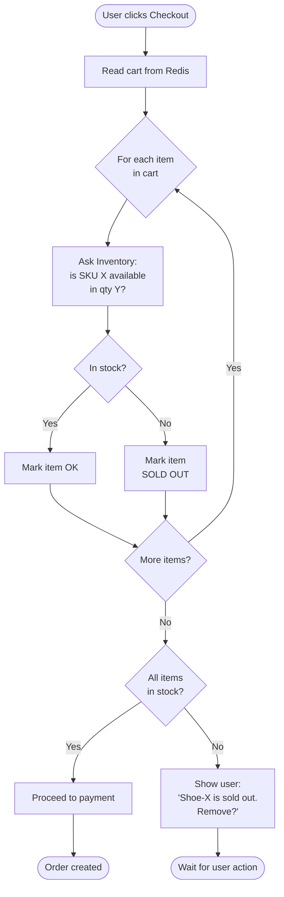

## The scene

You sit down for the interview. The interviewer turns their laptop toward you.

> *"We sell shoes online. Today we get about 500 customers a day. We want a shopping cart. You know the kind. You add items, change the count, leave for two hours, come back, and your stuff is still there. Build that. And we plan to grow."*

They smile. *"This one is easy. Or it should be."*

That smile is a warning.

A cart looks like a tiny project. Three buttons. One table. Done in a day. But the real work hides in places you do not see at first:

- Where does the cart actually live? In the browser? On the server? In a cookie? In a database?
- A guest user adds 3 items. Then they log in. They already had 2 items in their account from last week. What now?
- The cart says "in stock." Five minutes later, the user clicks Buy. Someone else just took the last one. What do you do?
- A million people use your site at once. The page must still load fast. How?

We will walk this from a 500-customer shop up to a 1-million-user marketplace. At each step, something will break. Naming what breaks is half the job.

A quick word about words: **SKU** means "stock keeping unit." It is just a code for one specific item. Like "blue-running-shoe-size-42" is one SKU. We will use SKU and "item" to mean the same thing.

---

## Step 1: Ask before you draw

Stop. Do not draw boxes yet.

Sit for 5 minutes. Write down the questions you would ask the interviewer.

A good answer is not 20 questions about every tiny detail. It is the small set of questions where a different answer would change your whole design.

<details markdown="1">
<summary><b>Show: 8 questions that change the design</b></summary>

1. **Guests or login only?** Can someone add items without an account? Almost every real site says yes. This one answer decides if you need merge logic at login.

2. **How long does a cart live?** One hour? One day? Forever? A short cart can live in memory. A forever cart needs a database.

3. **Phone and laptop both?** If I add a shoe on my phone, do I see it on my laptop too? If yes, the cart must live on the server. Cookies in the browser will not work.

4. **What does "in stock" mean?** Three options:
   - Reserved for me right now (hold it for 15 minutes)
   - You can see it, but anyone can buy it
   - Last we checked it was here, but we are not sure
   
   These are very different to build.

5. **Are there limits?** Can someone add 50,000 items to one cart? Bots will try. A normal limit is 100 different items, 99 of each.

6. **Price changed. Now what?** Item was $50 when added. Now it is $55. Which price does the user pay? Usually the new price, but you must show the user clearly.

7. **Coupons here or somewhere else?** Coupons are usually a different service. The cart just holds the code.

8. **Where does the cart end?** The cart stops when the user clicks "Place Order." After that, a new thing called an order takes over.

If you walked in asking only "how many users," you would miss the merge problem, the inventory problem, and the price problem. Those three are where the design actually lives.

> Why ask these first? Because if you start drawing boxes before you know the answers, you will draw the wrong boxes. The interviewer wants to see that you think before you build.

</details>

---

## Step 2: How big is this thing?

Same problem, two sizes. Do the math.

**Small shop today:**

- 500 visitors per day
- 30% add at least one item
- Average cart: 3 items, edited 2 times before buying
- 60% of carts are left without buying (this is normal for online shops)

**One million users:**

- 1 million visitors per day
- Same behavior
- Busy hour is 3 times the normal rate
- Logged-in carts last 30 days

Try to figure out these numbers for both sizes:

1. Cart writes per second
2. Cart reads per second (every page shows the cart icon with a number)
3. How many carts are open right now
4. How much disk space the carts need
5. Inventory checks per second at the busy hour

<details markdown="1">
<summary><b>Show: the math, plain numbers</b></summary>

**Small shop (500 users/day):**

- Carts made: 500 x 30% = 150 per day. About 6 per hour.
- Edits: 150 x 2 = 300 writes per day. About 0.003 per second. Tiny.
- Reads: ~10 page views per visit x 500 = 5,000 reads per day. About 0.06 per second.
- Open carts right now: about 50.
- Disk: 150 carts x 3 items x ~200 bytes = 90 KB per day. After one year, ~33 MB.

You could build this with one database table and one server. A laptop running at home could handle it.

**Big site (1 million users/day):**

- Carts made: 300,000 per day. About 3.5 per second normal, 10 per second at peak.
- Writes: 600,000 per day. About 7 per second normal, 21 per second at peak.
- Reads: 10 million page views x cart-icon-check = 10 million per day. About 115 per second normal, 350 per second at peak.
- Open carts right now: about 25,000.
- Disk: 300k x 30 days x 3 items x 200 bytes = ~5.5 GB. Plus headers. Total around 7 GB.
- Inventory checks at peak: ~400 per second.

**What does this tell us?**

| Thing | Even at 1M users |
|-------|------------------|
| Writes | Tiny (~20/sec). Any database handles this. |
| Reads | Big (~350/sec). This is the real challenge. |
| Storage | 7 GB. Nothing. |
| Real bottleneck | The inventory service getting hammered. |

> Why does this matter? Because the cart is not a "make it fast to write" problem. It is a "make reads fast" problem. The cart icon on every page is what kills you, not the buy button.

</details>

---

## Step 3: Where does the cart actually live?

This is the biggest question in cart design. Four places it could live. Each has a real trade-off.

The four options:

- **A. Cookie only.** Cart goes inside the browser cookie. Sent to server with every request.
- **B. Server memory.** Cart kept in the app server's RAM, keyed by session ID.
- **C. Database (Postgres).** Cart saved in a regular database table.
- **D. Database + Redis.** Postgres holds the truth. Redis is a fast cache in front.

For each option, think about: who can read it, what happens on a new device, what happens if the server restarts, and what it costs.

<details markdown="1">
<summary><b>Show: the comparison table and the right answer</b></summary>

| Where | How it works | Good | Bad | Use when |
|-------|--------------|------|-----|----------|
| Cookie only | Cart written into a browser cookie | No server work. Survives server restart. | Cookie max size is ~4 KB (so ~30 items max). Sent on every request. No sync across devices. Lost if user clears cookies. | Small demo sites only |
| Server memory | Cart kept in app server RAM | Fastest reads. No outside system. | Lost on server restart. Breaks with more than one server. | Never in real life |
| Database (Postgres) | Cart saved in rows | Safe. Survives anything. Can run queries on it. | Database read on every cart-icon view. At 350 reads/sec, the DB feels it. | Default for small to medium sites |
| Redis cache + DB | Cart in Redis for speed. DB has the truth. Write to both. | Sub-millisecond reads. Scales well. DB still safe. | Two systems to keep in sync. More moving parts. | Right answer once you hit 10k+ daily users |

**The recommendation:**

- **Anonymous users (no login):** Cart on the server. The cookie holds only a small token (a UUID like `7f3a-...`). The token points to the cart row.
- **Logged-in users:** Cart on the server, keyed by user ID.
- **Backend:** Start with just Postgres. Add Redis when database reads start hurting (around 10k daily users).

> Why not cookie only? Cookies are tiny (4 KB max). They get sent on every request, so a fat cookie slows every page. They do not sync between phone and laptop. They die when the user clears cookies. The cookie is good only as a token (small UUID) pointing to the server-side cart.

> Why not server memory? Junior engineers love this because it is fast in their laptop tests. But the moment you add a second server, half the users see an empty cart on alternate page loads. Mention this answer just to dismiss it.

</details>

---

## Step 4: Draw the system

Try to fill in the blanks. Six boxes are missing. Think about:

- Who handles the user's request at the edge?
- Where does the cart live?
- What speeds up reads?
- Where is the source of truth?
- How do other systems hear about cart changes?
- Who tells the cart what is in stock?

```
                Client (web, mobile)
                        |
                        v
                +-----------------+
                |    [ ? ]        |  sits at the edge,
                |                 |  checks who you are
                +--------+--------+
                         |
                         v
                +-----------------+
                |  Cart Service   |  the brain
                +--+------+-------+
                   |      |
            read   |      |  writes events
                   v      |
              +--------+  |
              | [ ? ]  |  |  fast cache for active carts
              +----+---+  |
                   |      |
                   v      v
              +------------------+
              |   [ ? ]          |  source of truth
              +------------------+
                          |
                          v
                   +-------------+
                   |   [ ? ]     |  event stream for others
                   +-------------+

       Other services called directly:
              +----------------+
              |   [ ? ]        |  tells us what is in stock
              +----------------+
              +----------------+
              |   [ ? ]        |  gives us name, image, price
              +----------------+
```

<details markdown="1">
<summary><b>Show: the full picture</b></summary>

```
                Client (web, mobile)
                        |
                        v
                +-------------------+
                |   API Gateway     |  TLS, login check,
                |                   |  rate limit,
                |                   |  cart_token cookie
                +---------+---------+
                          |
                          v
                +-------------------+
                |   Cart Service    |  stateless pods
                |                   |  merge logic,
                |                   |  size limits,
                |                   |  price snapshot
                +--+------+-------+-+
                   |      |       |
            read   |      |       |  emit events
                   v      |       |
              +--------+  |       |
              | Redis  |  |       |  cart:user:{id}
              | active |  |       |  TTL 30 days
              | carts  |  |       |
              +----+---+  |       |
                   | write|       |
                   |through       |
                   v      v       |
              +------------------+|
              | Postgres         ||  carts,
              | source of truth  ||  cart_items,
              |                  ||  carts_merged
              +------------------+|
                                  |
                                  v
                          +-------------+
                          | Kafka       |  cart.item.added
                          | cart.*      |  cart.item.removed
                          |             |  cart.merged
                          |             |  cart.abandoned
                          +------+------+
                                 |
              +------------------+-----------+----------+
              v                  v           v          v
        +----------+   +-------------+  +--------+  +-------+
        |Abandoned |   | Analytics   |  | Recs   |  | Fraud |
        |cart      |   |             |  | engine |  | check |
        |emails    |   |             |  |        |  |       |
        +----------+   +-------------+  +--------+  +-------+

      Called directly (sync):
              +-------------------+
              | Inventory Service |  is SKU X in stock?
              |                   |  cart asks on add and read
              +-------------------+
              +-------------------+
              | Catalog / Pricing |  name, image, price now
              | Service           |
              +-------------------+
```

What each piece does:

- **API Gateway.** First stop. Checks TLS (encryption), checks who you are, limits how fast you call us, hands out a `cart_token` cookie for guests.
- **Cart Service.** The brain. Has no memory of its own. Knows how to merge carts, enforce size limits, snapshot prices.
- **Redis (active carts).** Fast cache. Holds your cart as `cart:user:42 -> {shoe-blue: 2, shoe-red: 1}`. Sub-millisecond reads. Items stay for 30 days.
- **Postgres.** The truth. Used when Redis misses, and for slow queries like "find abandoned carts."
- **Kafka.** Event bus. Cart writes events here but does not wait. Other services pick them up later.
- **Inventory Service.** Owned by another team. Cart asks "is shoe-blue-42 in stock?" Cart never writes to it.
- **Catalog Service.** Returns the name, picture, and current price of items.

> Why is the cart service "stateless"? Because if a cart pod dies, we just start another one. All the actual cart data is in Redis and Postgres. The pod is just a worker. This means we can run 10 pods, or 100, or 1,000. They are all the same.

</details>

---

## Step 5: The guest-to-login merge

A guest user adds 3 items over 20 minutes. They click "Log in." They already had 2 items in their account from last week.

What does the cart show after login?

This is the part most people get wrong.

Think about these cases:

- Guest cart has shoe-A (qty 1) and shoe-B (qty 2). Account cart is empty.
- Guest cart has shoe-A (qty 1). Account cart has shoe-C (qty 1).
- Guest cart has shoe-A (qty 2). Account cart has shoe-A (qty 1). What is the final qty?
- Guest cart has shoe-A. Account cart has shoe-A, but shoe-A is now sold out forever.
- Guest cart is empty. Account cart has shoe-C.

What do you do with the guest's `cart_token` cookie after the merge?

Here is a sequence diagram of the merge. Try to predict each step.

```mermaid
sequenceDiagram
    participant U as User (browser)
    participant API as API Gateway
    participant Cart as Cart Service
    participant DB as Postgres

    Note over U: Guest with cart_token cookie<br/>adds shoe-A (qty 2)
    U->>API: POST /cart/items
    API->>Cart: add to anon cart
    Cart->>DB: INSERT cart_items (anon_cart_id, shoe-A, 2)
    DB-->>Cart: ok
    Cart-->>U: 201 Created

    Note over U: User clicks Log in,<br/>enters password
    U->>API: POST /login
    API-->>U: 200 OK + session token

    Note over U: Browser still has<br/>cart_token cookie

    U->>API: POST /cart/merge
    API->>Cart: merge(anon_token, user_id)
    Cart->>DB: BEGIN
    Cart->>DB: SELECT anon cart (token=...)
    Cart->>DB: SELECT user cart (user_id=42)
    Note over Cart: Both exist!<br/>shoe-A in both
    Cart->>Cart: merged_qty = max(2, 1) = 2
    Cart->>DB: UPDATE user_cart items
    Cart->>DB: DELETE anon cart
    Cart->>DB: INSERT carts_merged audit row
    Cart->>DB: COMMIT
    Cart-->>API: merged cart
    API-->>U: 200 OK + Set-Cookie: cart_token=; Max-Age=0
    Note over U: cart_token cookie cleared
```

<details markdown="1">
<summary><b>Show: the merge rules and the code</b></summary>

**The rule for overlapping items: take the bigger number, not the sum.**

If a user added 2 of shoe-A on their phone (as a guest), and they had 1 of shoe-A in their account cart from yesterday, what did they want?

Almost always: "I want 2." Not "I want 3." Adding them would surprise the user. Max is safer.

Exception: things that really should add up (like gift cards or digital items). Those are special cases per category.

**Some teams pick "guest cart wins" instead.** This is also OK. The most recent action is the most accurate. Easier to explain. But you lose items from the older session that the user still wanted.

Whichever you pick, **tell the user clearly**: "We combined your guest cart with your saved cart." Show what changed.

**The code:**

```python
def merge_carts(anonymous_token, user_id):
    with db.transaction():
        anon_cart = cart_store.get_by_token(anonymous_token)
        user_cart = cart_store.get_by_user(user_id)

        # Case 1: no guest cart, nothing to do
        if anon_cart is None:
            return user_cart

        # Case 2: guest cart but no account cart yet
        # Just rebind the guest cart to the user
        if user_cart is None:
            cart_store.rebind(anon_cart.id, user_id=user_id, clear_token=True)
            audit_merge(user_id, anon_cart.id, source="rebind")
            return cart_store.get_by_user(user_id)

        # Case 3: both exist. Merge.
        merged_items = {}
        for sku, item in user_cart.items.items():
            merged_items[sku] = item.copy()

        for sku, anon_item in anon_cart.items.items():
            # Skip discontinued items
            if not catalog.is_available(sku):
                continue
            if sku in merged_items:
                # Both carts had this item. Take the bigger qty.
                merged_items[sku].qty = max(anon_item.qty, merged_items[sku].qty)
                # But cap at the max per-item limit
                merged_items[sku].qty = min(merged_items[sku].qty, MAX_QTY_PER_ITEM)
            else:
                merged_items[sku] = anon_item

        # If the merged cart is too big, trim it
        if len(merged_items) > MAX_CART_ITEMS:
            merged_items = trim_to_limit(merged_items, MAX_CART_ITEMS)

        cart_store.replace(user_cart.id, merged_items)
        cart_store.delete(anon_cart.id)
        audit_merge(user_id, anon_cart.id, source="merge",
                    rules={"qty": "max"})

        return cart_store.get_by_user(user_id)
```

**Six small things doing real work:**

1. **Idempotent.** A user might double-click "Log in." The second merge call must do nothing. We handle this by checking if the anon cart exists first, and by clearing the cookie after.

2. **Audit trail.** Write a row to `carts_merged`. This saves you when a user emails support saying "my cart is wrong after I logged in." You can look back and see exactly what happened.

3. **Cookie cleanup.** Clear the `cart_token` cookie after merge (`Set-Cookie: cart_token=; Max-Age=0`). Otherwise the next page load tries to merge again.

4. **Discontinued items.** If the item is sold out forever, skip it silently. Show a small banner: "Some items in your guest cart are no longer available."

5. **Size limit.** A user with 80 items in their account cart and 80 in their guest cart goes over the 100-item limit. Trim with a clear rule (keep the newest) and tell the user.

6. **Race condition.** User logs in on two devices at the same time. Both call merge. The first one wins. The second one finds the anon cart already gone and does nothing.

> Why do the merge on the server, not the browser? Because the browser cannot be trusted. It does not know the account's cart. It cannot enforce limits. The merge must be one transaction on the server.

</details>

---

## Step 6: Inventory check at checkout

The cart says "in stock" when the user adds an item. Twenty minutes later, they click checkout. Now the item is gone.

Or worse: the user successfully checks out and pays. Then your warehouse says "we have no shoes."

Three approaches. None of them is perfect.

**A. Optimistic.** Cart shows the last-known stock. At checkout, re-check. If gone, tell the user "this is sold out now, please remove it."

**B. Soft reservation (TTL hold).** Adding to cart places a 15-minute hold on the item. If the user does not buy, the hold expires. If they buy, the hold becomes a real purchase.

**C. No checks.** Take the order. Charge the card. If we cannot ship, refund.

Here is the flow for option A (optimistic) at checkout.



<details markdown="1">
<summary><b>Show: the comparison and the right answer</b></summary>

| Option | Normal case | Bad case | Cost to build | Right for |
|--------|-------------|----------|---------------|-----------|
| **A. Optimistic** | Cart shows it. Checkout works. | 1-3% of checkouts find the item gone at the last second. User has to remove and retry. | Low. Just a read on add. | Most online shops. Default. |
| **B. Soft reservation** | Add to cart, item is yours for 15 minutes. User never sees "sold out" mid-checkout. | Hot items show fake "sold out" because empty carts hold them. | High. Inventory service needs holds, releases, expirations. | Concert tickets. Limited sneaker drops. Anything with low supply and high demand. |
| **C. No checks** | Always works at checkout. | "Sorry, we cannot ship, here is your refund" email. Hurts trust. | Almost zero. | Pre-orders. Print-on-demand. Things with unlimited supply. |

**The recommendation: optimistic by default. Reservation only for special items.**

The default is option A. The cart reads inventory when the user adds (green check). It re-reads on cart page load (refresh badge). At checkout, the **order service** does the final, authoritative check and decreases the stock count atomically.

For special items (concert tickets, limited drops), the catalog marks the SKU as `requires_reservation=true`. The cart calls the inventory service to place a TTL hold. The hold token is stored on the cart_item row. If the user removes the item or the hold expires, the cart releases the hold.

> Why not reservation for everything? Because 60-70% of carts are abandoned (industry standard). If every add held inventory for 15 minutes, you would show "sold out" to real buyers while ghost carts sit on the items. This is fine for a Taylor Swift concert. Bad for shoes.

> Why not "no checks" by default? Because "we cannot ship, sorry" emails destroy trust quickly. Only acceptable when supply is truly unlimited (digital goods, print-on-demand).

**Where the check happens:**

- **On add to cart:** read-only. Show state to user. No writes.
- **On cart page load:** re-read (cached for ~30 seconds).
- **On checkout:** authoritative write. The order service calls `try_reserve(sku, qty)`. If it fails, no order.

> Why is the cart's job only to "show good info"? Because the guarantee belongs at checkout, not at the cart. The cart shows what we believe is true. The order service makes it real.

</details>

---

## Follow-up questions

Try to answer each in 2 or 3 sentences before opening the solution.

1. **Bots stuff a cart with 10,000 items.** What goes wrong? How do you stop it?

2. **Phone-to-laptop sync delay.** User adds an item on their phone. Opens their laptop 5 seconds later. Cart shows the old state. How long is OK? How do you make it fresh?

3. **Redis dies in the middle of the day.** All active carts in Redis are gone. What does the user see? How do you recover quietly?

4. **Price went up.** User added a shoe at $50 last week. Today it is $55. They click checkout. What price do they pay? What do they see?

5. **Abandoned cart detection.** You want to send "you left this" emails after 6 hours of no activity. How do you find these carts without scanning every cart every minute?

6. **Anonymous carts pile up forever.** When do you delete them? What happens if a user comes back after 90 days with the old cookie?

7. **Two people share an account.** Both log in at the same time from different cities. Both add items. What happens?

8. **Currency and language.** User adds an item priced in USD. Switches the site to EUR. What happens to the cart?

9. **Item becomes restricted.** User added a legal item. A new law restricts shipping it to their state. They go to checkout. What does the system do?

10. **Save for later (wishlist).** User wants to move an item from cart to wishlist. Is this the cart's job? Where does the wishlist live?

---

## Related problems

- **[Approval Management (011)](../011-approval-management/question.md).** Different topic, same patterns. State per user. Event stream on changes. Audit trail. The cart's `carts_merged` table is the same idea as approval's audit log.
- **[Coupon Redemption (014)](../014-coupon-redemption/question.md).** The cart holds the coupon code. The coupon service decides if it is valid. Same boundary as inventory.
- **[Read-Heavy System Patterns (017)](../017-read-heavy-patterns/question.md).** The cart-icon read on every page is a classic read-heavy load. The Redis-plus-DB pattern applies.
- **[Write-Heavy System Patterns (018)](../018-write-heavy-patterns/question.md).** The Kafka event stream for analytics is write-heavy at scale.
- **[Help Desk Ticketing (019)](../019-helpdesk-ticketing/question.md).** "My cart is wrong" support tickets need the merge audit table to answer.
