## What we are building

Alice adds a $79 pair of shoes to her cart on her laptop. An hour later she opens her phone, and the shoes are still there. She clicks Buy, the shoes ship, and her credit card gets charged exactly once.

That is the whole product. It sounds like three database rows. The interesting problems are hiding underneath.

Five hard problems show up in every real cart:

1. **Cross-device sync.** The cart must live on the server, not in a browser cookie. A cookie only works on one device.
2. **Guest-to-user merge.** Alice browses as a guest, adds 3 items, then logs in. She already had 2 items saved. Now what?
3. **Inventory race.** The cart says a shoe is in stock. Twenty minutes later, someone else took the last pair. Alice clicks Buy.
4. **Idempotent checkout.** Alice's phone drops the network mid-checkout. The app retries. She must not get two orders or two charges.
5. **Abandoned cart cleanup.** Sixty percent of carts are never bought. Ghost carts pile up. Guest cart tokens accumulate in the database forever.

We will start with the smallest version that works, then add one piece at a time as each problem appears.

---

## The lifecycle of one cart

Every cart moves through a small set of states. Picture it once before drawing any architecture.

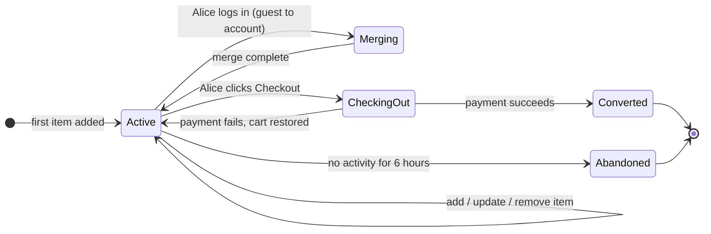

Everything else in this design (Redis, Kafka, inventory holds, price drift handling) is a complication on top of this one state machine.

> **Take this with you.** A cart is a small state machine per user. The hard part is not the state machine. It is what happens between Active and Converted.

---

## How big this gets

Same product, two very different sizes.

| Input | Small shop (500 DAU) | Big shop (1M DAU) |
|-------|---------------------|-------------------|
| Carts per day | 150 | 300,000 |
| Cart writes per second (peak) | ~0.01 | ~21 |
| Cart icon reads per second (peak) | ~0.06 | ~350 |
| Active carts at any moment | ~50 | ~25,000 |
| Live storage | ~33 MB/year | ~7 GB |

<details markdown="1">
<summary><b>Show: how the numbers come out</b></summary>

Assume 30% of visitors add at least one item. Average cart has 3 items, edited twice.

**Small shop (500 visitors/day):**
- Carts: 500 × 30% = 150 per day
- Cart writes: 150 × 2 edits = 300/day, so **0.003/sec steady**
- Cart icon reads: 500 visitors × 10 page views = 5,000/day, so **0.06/sec**
- Active carts: 150 carts × ~8h average life / 24h = **~50 open at any moment**
- Storage: 150 carts × 3 items × 200 bytes = ~90 KB/day, ~33 MB/year

**Big shop (1M visitors/day):**
- Carts: 1M × 30% = 300,000/day, so **3.5/sec steady**
- Cart writes: 600,000/day, so **7/sec steady, 21/sec peak**
- Cart icon reads: 1M × 10 page views = 10M/day, so **115/sec steady, 350/sec peak**
- Active carts (30-day TTL): 300,000 × 30 days / 30 = **~25,000 open at any moment**
- Storage: 300K carts × 3 items × 200 bytes = ~180 MB/day, ~7 GB live

The number that matters: writes are tiny even at 1M users. Any database handles 21 writes/sec. The real challenge is the cart icon read on every page: 350/sec with a tight latency target. That single endpoint sets the caching strategy.

| Metric | At 1M users |
|--------|-------------|
| **Writes/sec (peak)** | ~21. Any database handles this. |
| **Icon reads/sec (peak)** | ~350. This is the design constraint. |
| **Active carts in Redis** | ~25,000. About 5 MB as compact hashes. |
| **Real bottleneck** | Cart icon read on every page, not the buy button. |

</details>

> **Take this with you.** The cart is a read-heavy problem disguised as a write problem. Optimize the icon read, not the add-item write.

---

## The smallest version that works

One Postgres, one app server, logged-in users only.

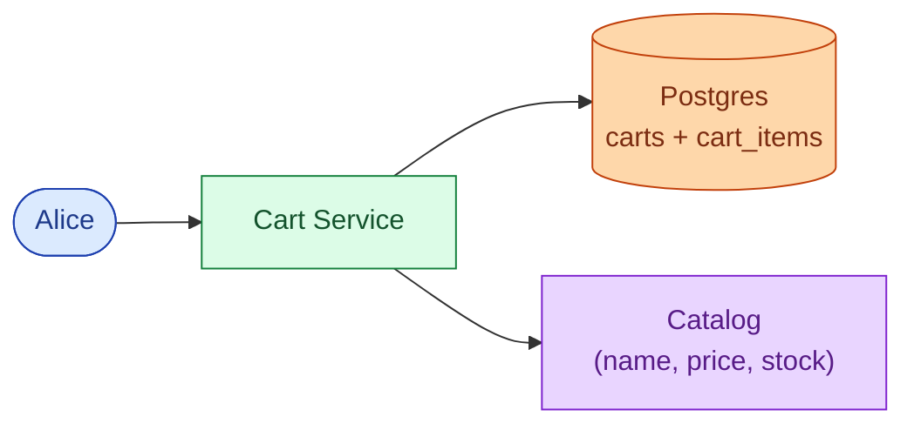

Three endpoints carry the full product at this stage.

| Endpoint | What it does |
|----------|--------------|
| `GET /api/v1/cart` | Return items, quantities, snapshot prices, and live availability |
| `POST /api/v1/cart/items` | Add an item or increase its quantity |
| `PATCH /api/v1/cart/items/{sku}` | Update quantity; qty 0 removes the item |

<details markdown="1">
<summary><b>Show: the two tables</b></summary>

```sql
CREATE TABLE carts (
    cart_id     UUID PRIMARY KEY,
    user_id     BIGINT,
    cart_token  UUID,
    status      TEXT NOT NULL DEFAULT 'active',
    item_count  INT NOT NULL DEFAULT 0,
    created_at  TIMESTAMPTZ NOT NULL DEFAULT NOW(),
    updated_at  TIMESTAMPTZ NOT NULL DEFAULT NOW(),
    expires_at  TIMESTAMPTZ
);

CREATE TABLE cart_items (
    cart_id              UUID NOT NULL REFERENCES carts(cart_id),
    sku                  TEXT NOT NULL,
    qty                  INT NOT NULL CHECK (qty > 0 AND qty <= 99),
    snapshot_price_cents INT NOT NULL,
    added_at             TIMESTAMPTZ NOT NULL DEFAULT NOW(),
    PRIMARY KEY (cart_id, sku)
);
```

`item_count` is denormalized on the `carts` row. The cart icon on every page only needs that one number: one row read, no JOIN, no catalog call.

`snapshot_price_cents` records what Alice saw when she added the item. If the price changes tomorrow, the audit trail still shows what she was shown.

</details>

This is enough for a hundred users. The interesting question is what breaks first as the system grows.

---

## Decision 1: where does the cart live for guests?

Marketing asks: can users browse and add items without creating an account? Almost every real shop says yes. This single answer changes the data model and adds a merge step at login.

The fix is a `cart_token`: a random UUID stored in a browser cookie. The cart lives on the server, keyed by that token instead of a user ID. The cookie just points at the row.

Now a new problem: Alice builds a guest cart with 3 shoes over 20 minutes. She logs in. She already had 2 shoes saved from last week.

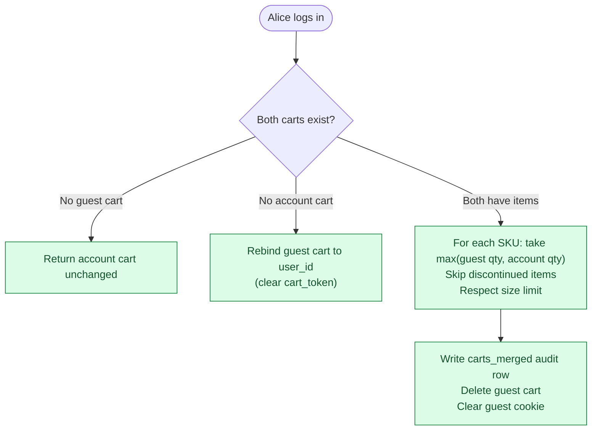

The quantity rule matters. If the guest cart has 2 of shoe-A and the account cart has 1, Alice almost certainly wants 2, not 3. **Take the max, not the sum.**

The merge runs inside a serializable transaction. Alice might double-click Log In. Two concurrent merge calls race. The second finds the guest cart already deleted and returns the account cart unchanged. No duplicate merge.

<details markdown="1">
<summary><b>Show: the carts_merged audit table and merge sketch</b></summary>

```sql
CREATE TABLE carts_merged (
    merge_id        UUID PRIMARY KEY,
    user_id         BIGINT NOT NULL,
    anonymous_token UUID,
    anonymous_items JSONB NOT NULL,
    account_items   JSONB NOT NULL,
    merged_items    JSONB NOT NULL,
    rule_applied    TEXT NOT NULL,
    trimmed_items   JSONB,
    occurred_at     TIMESTAMPTZ NOT NULL DEFAULT NOW()
);
```

Every merge writes a row here regardless of outcome: rebind, full merge, or no-op. When Alice emails support "my cart is wrong after I logged in," you have the answer. The data is cheap to store. The audit is irreplaceable.

```python
def merge_carts(anonymous_token, user_id):
    with db.transaction(isolation="serializable"):
        anon_cart = db.fetch_cart(cart_token=anonymous_token, lock=True)
        user_cart  = db.fetch_cart(user_id=user_id, lock=True)

        if anon_cart is None:
            return user_cart

        if user_cart is None:
            db.update(anon_cart.id, user_id=user_id, cart_token=None)
            audit_merge(user_id, anonymous_token, rule="rebind")
            return db.fetch_cart(user_id=user_id)

        merged  = {item.sku: item.copy() for item in user_cart.items}
        trimmed = []
        for item in anon_cart.items:
            if not catalog.is_available(item.sku):
                trimmed.append(item.sku)
                continue
            if item.sku in merged:
                merged[item.sku].qty = min(
                    max(item.qty, merged[item.sku].qty), MAX_QTY_PER_ITEM
                )
            else:
                if len(merged) >= MAX_CART_ITEMS:
                    trimmed.append(item.sku)
                    continue
                merged[item.sku] = item

        db.replace_items(user_cart.id, merged.values())
        db.delete(anon_cart.id)
        audit_merge(user_id, anonymous_token, rule="qty:max", trimmed=trimmed)
        return db.fetch_cart(user_id=user_id)
```

</details>

> **Take this with you.** The merge on login is where most cart designs break. Max-qty rule, one serializable transaction, audit row, clear the cookie.

---

## Decision 2: how do we handle the inventory race?

Alice adds a shoe to her cart at 2 PM. At 2:20 PM she clicks Buy. Someone else took the last pair at 2:15 PM. Three approaches handle this. None is perfect.

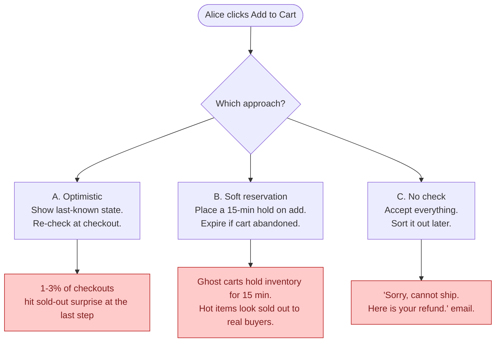

<details markdown="1">
<summary><b>Show: comparison table and recommendation</b></summary>

| Approach | Normal case | Failure mode | Build cost | Right for |
|----------|-------------|--------------|------------|-----------|
| **A. Optimistic** | Works fine. Checkout re-checks. | 1-3% of checkouts find item gone at the last step. | Low. | Default for most shops. |
| **B. Soft reservation** | User never sees a sold-out surprise mid-checkout. | Ghost carts hold inventory for 15 min. Hot items show as sold out to real buyers. | High. Inventory needs hold, release, and TTL expiry logic. | Concert tickets, limited sneaker drops. |
| **C. No check** | Always accepts. Fast. | "Cannot ship, here is your refund." | Near zero. | Pre-orders, print-on-demand. |

**Default: optimistic. Reservation only for SKUs explicitly flagged `requires_reservation=true`.**

Industry cart abandonment is 60-70%. If every add-to-cart held inventory for 15 minutes, ghost carts would make real inventory look empty. That is right for a Taylor Swift ticket sale. Wrong for shoes.

Division of responsibility:
- **Cart service:** read-only availability check on add. Show what we believe. No writes to inventory.
- **Order service:** authoritative `try_reserve(sku, qty)` at checkout. If it fails, no order, no charge.

The cart's job is to show good information. The order service's job is to make the buy real.

</details>

> **Take this with you.** The cart shows what is probably true. The Order Service makes it actually true. Never put the inventory guarantee in the cart.

---

## Decision 3: how do we make checkout idempotent?

Alice's phone drops the connection mid-checkout. The app retries. Without idempotency, the cart service processes the checkout twice and charges her twice.

The fix is an `Idempotency-Key` header on every mutating request: a UUID the client generates once per logical operation. The server records the key and the result. If the same key arrives again, it returns the recorded result without re-processing.

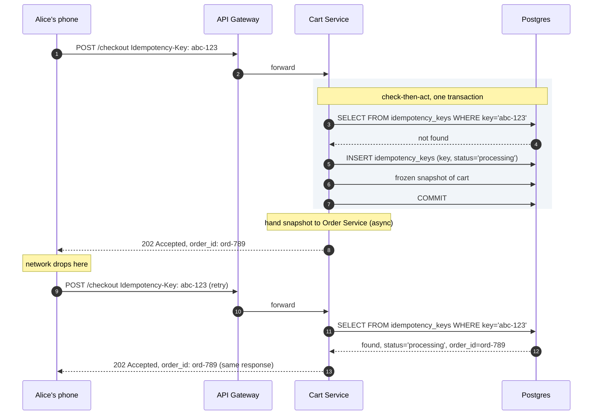

The cart does not clear until the Order Service emits a `cart.converted` event. Payment failure emits `cart.checkout_failed`, holds release, and the cart is intact for editing.

> **Take this with you.** Idempotency keys plus a frozen snapshot. The key catches retries. The snapshot decouples cart state from payment outcome.

---

## Decision 4: how do we serve the cart icon fast?

The cart icon appears on every page. At 1M users, that is 350 icon reads per second. Each read only needs one number: how many items are in Alice's cart.

The naive path is a `SELECT COUNT(*) FROM cart_items WHERE cart_id = ?`. At 350/sec this starts showing up in slow query logs within a few weeks of launch.

Two things fix this. First, denormalize `item_count` onto the `carts` row and keep it updated in the same transaction as item changes. Second, cache the whole cart hash in Redis so icon reads never touch Postgres.

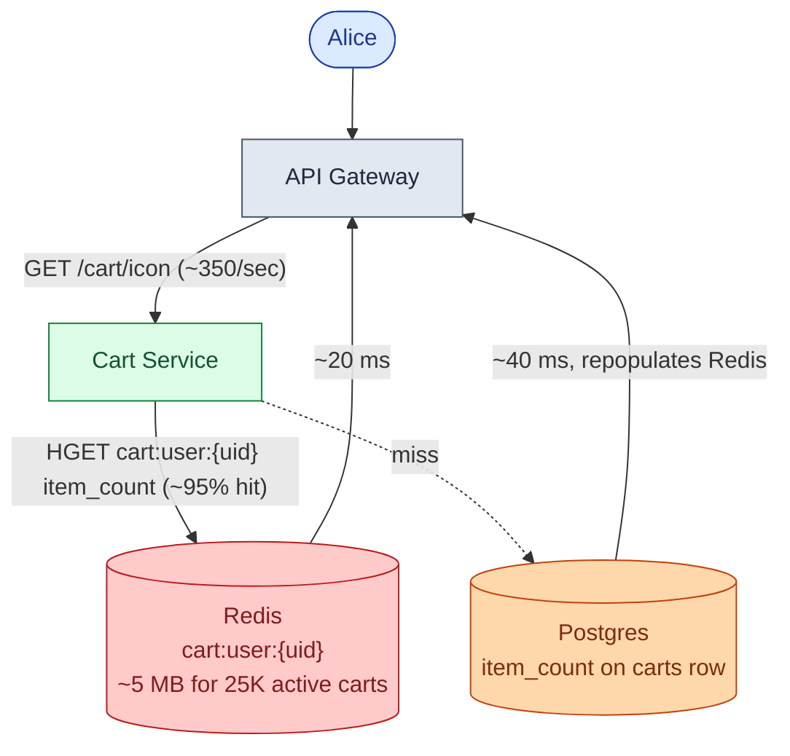

Redis holds the compact cart: SKU, qty, snapshot price. One HGET returns the count. Catalog and inventory results are not stored in Redis; they change too fast and are fetched fresh on each full cart page load.

> **Take this with you.** Denormalize `item_count`. Cache it in Redis. One field read, no JOIN, no catalog call. That is how the icon stays under 20 ms.

---

## Decision 5: how do we clean up abandoned carts?

60-70% of carts are never purchased. Guest carts accumulate with no user to notify. At 1M users, that is 180,000 abandoned carts per day with no automatic cleanup.

Two separate problems: finding carts to email, and deleting dead rows.

**Finding carts to email:** a nightly job queries carts where `status = 'active'` and `updated_at` is exactly 6 hours old, within a narrow window.

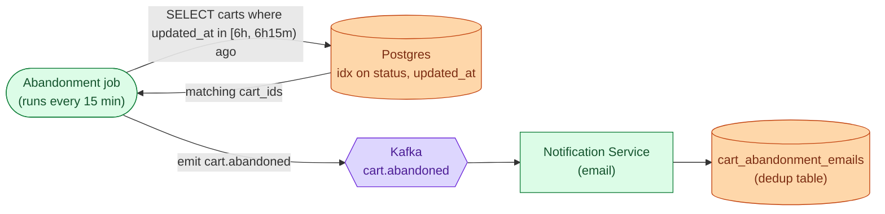

The narrow time window means the query only touches carts that just crossed the threshold. The partial index on `(status, updated_at)` makes it fast regardless of total cart count.

**Deleting dead rows:** guest carts get `expires_at = NOW() + 30 days`, refreshed on every activity. A nightly GC job deletes rows where `expires_at < NOW()` and `status != 'converted'`. Converted carts stay for the order audit trail.

> **Take this with you.** Narrow time windows, not full scans. Emit events to Kafka, do not email directly from the job. Dedup on delivery, not on send.

---

## The full architecture

Putting the five decisions together.

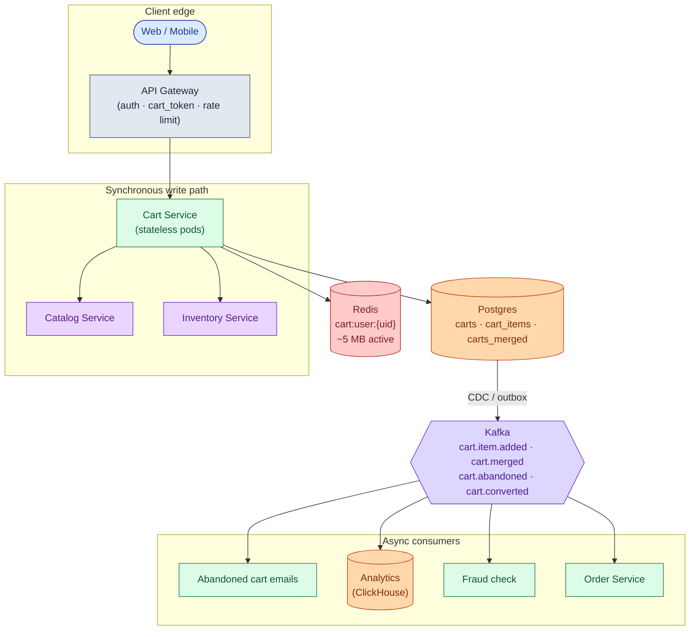

Each component in one sentence:

| Component | Purpose |
|-----------|---------|
| API Gateway | Auth, cart_token cookie issuance, rate limiting per IP and user. |
| Cart Service | Stateless. Owns merge logic, size limits, price snapshot, idempotency check. |
| Catalog Service | Name, image, current price per SKU. Called on cart page load, in parallel with Inventory. |
| Inventory Service | Stock availability. Cart reads it. Never writes to it. |
| Postgres | Source of truth. Three tables: `carts`, `cart_items`, `carts_merged`. |
| Redis | Fast cache for active carts. Icon read lives here (~5 MB for 25K active carts). |
| Kafka | Carries cart events to downstream teams. Abandonment, analytics, fraud, order service. |
| Order Service | Authoritative inventory reserve + payment. Cart does not clear until Order Service confirms. |
| Analytics, Fraud, Emails | Downstream consumers. If any dies, cart adds and reads still work. |

---

## Walk: add to cart, end to end

Alice adds a shoe on her laptop.

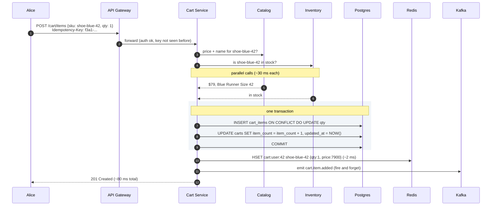

Three details worth noting:

1. Catalog and Inventory are called in parallel. Total latency is `max(catalog, inventory)`, not the sum.
2. The DB write and the `item_count` update are one transaction. A crash mid-write rolls back cleanly.
3. Redis is written after the commit. If Redis fails, Postgres has the truth and repopulates on the next read.

---

## Walk: cross-device sync

Alice adds shoes on her laptop at 2 PM. She opens her phone at 3 PM.

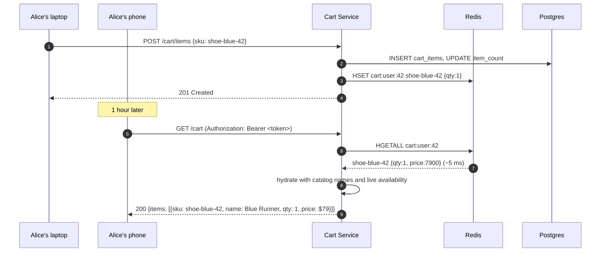

The cart is keyed by `user_id`, not by device. Any device with a valid session token reads the same cart. No sync protocol needed.

---

## The hard sub-problem: inventory hold timing

When a soft reservation is used (flagged SKUs like limited drops), the hold timer creates a cascading problem.

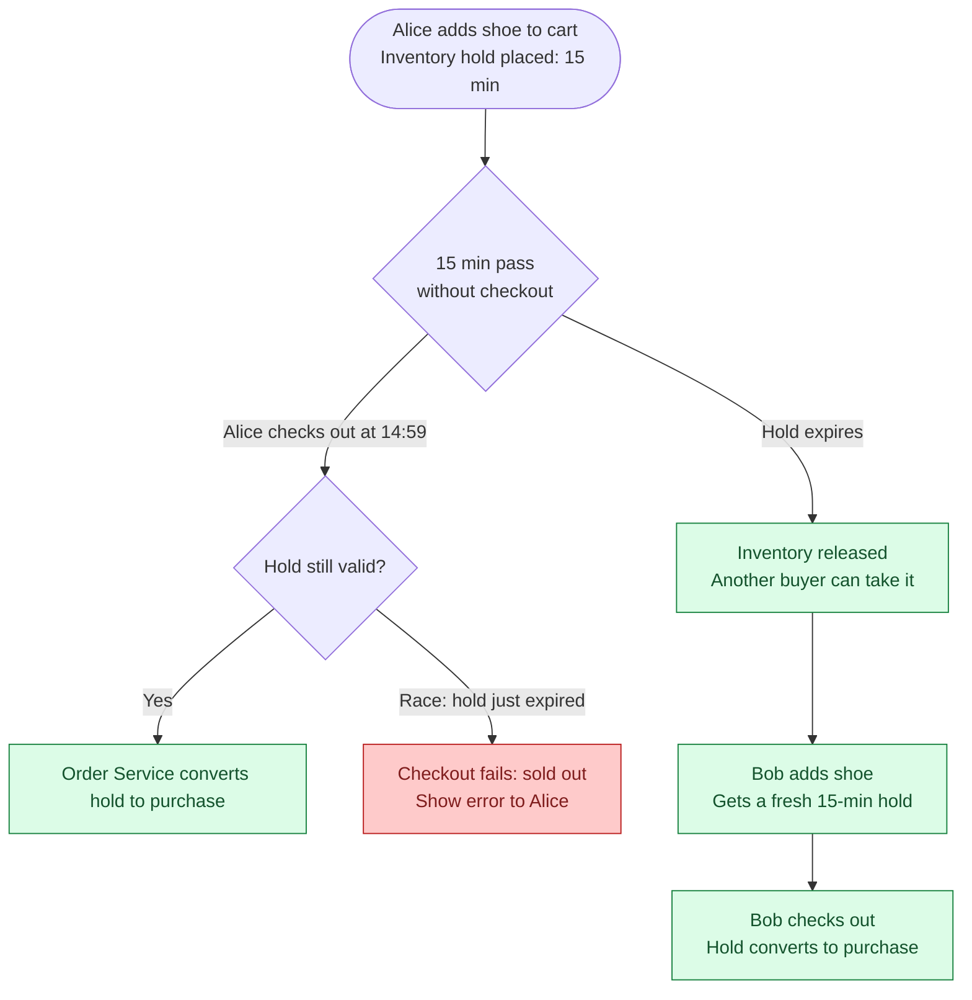

The race at the bottom (hold just expired while checkout is in flight) is unavoidable. The mitigation is a grace window: the Order Service attempts the reserve even if the hold shows as expired within the last 30 seconds. If the inventory count still has availability, the purchase goes through.

| Hold timer | Trade-off |
|------------|-----------|
| 5 minutes | Fewer ghost holds. More sold-out surprises at checkout. |
| 15 minutes | Standard for limited drops. Significant ghost hold problem at high abandonment. |
| 30 minutes | Feels safe for the user. Ghost holds lock out real buyers for half an hour. |

For most shops: skip holds entirely. Use optimistic inventory. Reserve only at checkout, inside the Order Service, as an atomic step with payment.

> **Take this with you.** Hold timers solve one problem (surprise at checkout) and create another (ghost holds blocking real buyers). Keep them short and scope them to SKUs that genuinely need them.

---

## Follow-up questions

Try answering each in 2 or 3 sentences before opening the solution.

1. **Bots stuff a cart with 10,000 items.** What goes wrong? How do you stop it?

2. **Phone-to-laptop sync delay.** Alice adds a shoe on her phone. She opens her laptop 5 seconds later. The cart shows the old state. How long is acceptable? How do you fix it?

3. **Redis goes down mid-day.** All active carts are cached in Redis. What does Alice see? How do you recover without losing any carts?

4. **Price went up.** Alice added a shoe at $79 last week. Today it is $89. What does she pay? What does she see at checkout?

5. **Abandoned cart emails.** You want to email shoppers 6 hours after their last activity. How do you find those carts without scanning every active cart every minute?

6. **Anonymous carts pile up.** When do you delete them? What happens if a user returns after 90 days with the same old cookie?

7. **Two people share one account.** Both log in from different cities and add items at the same time. What happens?

8. **Currency switch.** Alice adds a shoe priced in USD. She switches the site to EUR. What happens to the snapshot price?

9. **Item becomes restricted.** Alice added a legal item. A new regulation restricts shipping it to her state. She goes to checkout. What does the system do?

10. **Save for later.** Alice wants to move an item from her cart to a wishlist. Is this the cart service's job? Where does the wishlist live?

11. **Checkout race.** Two sessions for the same user both hit checkout within 100 ms of each other (browser tab dupe, mobile + desktop). What prevents a double order?

12. **Cart grows to 200 items.** When do you enforce a size limit? Where does the limit live?

---

## Related problems

- **[Approval Management (011)](../011-approval-management/question.md).** Same patterns: state per user, event stream on changes, audit table on transitions.
- **[Coupon Redemption (014)](../014-coupon-redemption/question.md).** The cart holds a coupon code. The coupon service decides validity. Same service boundary as inventory.
- **[Read-Heavy System Patterns (017)](../017-read-heavy-patterns/question.md).** The cart icon read on every page is a classic read-heavy load. The Redis-plus-DB pattern applies directly.
- **[Write-Heavy System Patterns (018)](../018-write-heavy-patterns/question.md).** The Kafka event stream for analytics is the write-heavy pattern at scale.
- **[Help Desk Ticketing (019)](../019-helpdesk-ticketing/question.md).** "My cart is wrong after login" support tickets need the `carts_merged` audit table to answer.
