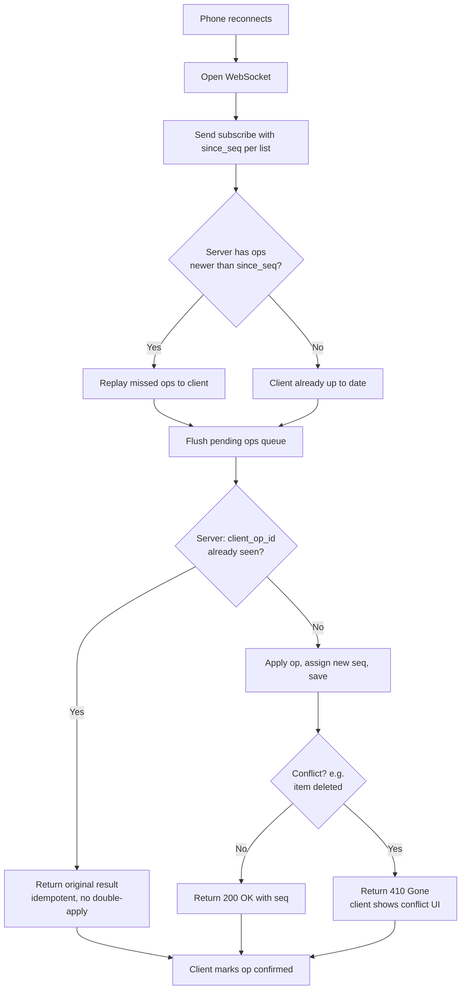
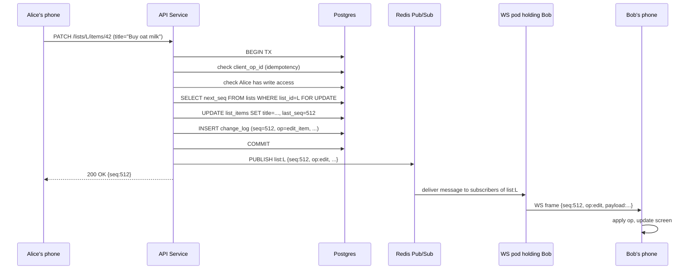

## The scene

You sit down. The interviewer leans back and says:

> *"Everyone has used Todoist or Trello. Build a todo list app. Users make lists. They add items. They check items off. Now the fun part. Any list can be shared with friends. When Alice adds an item, Bob, who is also on that list, should see it on his phone within a second or two. Build that."*

They wait.

It looks like a simple CRUD app. (CRUD = Create, Read, Update, Delete. Just basic data operations.) That answer dies fast. Three hard problems are hiding in the question:

1. How do you push a change to other phones in near real-time without melting your servers?
2. What happens when Alice and Bob edit the same item title at the same moment?
3. What does the permission model look like once a list can be re-shared?

Most people jump straight to *"I'll use WebSockets."* That is the right tool. But it is the wrong place to start. The right place is to ask what *kind* of collaboration the interviewer wants. A list that refreshes every 10 seconds is a totally different system from one where Alice's keystrokes show up on Bob's screen as she types.

We will walk this from 10 users to 1 million users. At every step we will name what breaks first, then add the smallest fix that solves it.

---

## Step 1: Ask the right questions

Before you draw anything, sit for five minutes. Write down questions you would ask the interviewer.

A good answer here is not "20 questions about every edge case." It is the small handful of questions that change the design if answered differently.

<details markdown="1">
<summary><b>Show: 10 questions that matter</b></summary>

1. **How real-time is real-time?** Is a 1 second delay okay? Or do we need sub-100ms like Google Docs, where you see each keystroke? *(This one answer drives 60% of the design. 1 to 5 seconds means polling works. Sub-second means WebSocket. Sub-100ms with two people editing the same field means CRDT.)*
2. **What can be shared, and at what size?** A whole list? Just one item? A whole workspace? *(Per-list sharing is the common answer.)*
3. **Can a person you invited re-share with someone else?** *(Changes the permission model from a flat list into a tree.)*
4. **What roles?** Viewer, editor, admin? *(Two roles cover 90% of cases.)*
5. **Scale.** 10k users? 10M users? *(Both are valid. The math is very different.)*
6. **Offline support.** Can a user add items on the subway with no signal? What happens on reconnect? *(Big design choice. Pushes you toward client-side queues and conflict rules.)*
7. **Notifications.** Push? Email? In-app only? *(Usually a separate service. Need to know if it is in scope.)*
8. **Item structure.** Just title and a checkbox? Or due dates, assignees, sub-tasks? *(Start simple. Ask before adding fields.)*
9. **Delete semantics.** When Alice deletes an item, does it vanish for Bob? Trash bin with undo? *(Soft delete with tombstones is almost always the right answer. We will explain why.)*
10. **Invite flow.** Share by link? Direct invite by username? Email invite? *(Affects the auth and onboarding flow.)*

A strong candidate also says what is **out of scope**. Rich-text editing inside items, file attachments, calendar sync, AI suggestions. Those would each double the scope.

</details>

---

## Step 2: How big is this thing?

Same problem, two scales. Do the math.

**Small scale:**

- 10,000 daily active users
- 20 lists per user (most are personal; about 3 are shared)
- Shared lists have about 4 collaborators each
- Each user adds or checks off about 30 items per day
- Each user opens the app about 15 times per day

**Large scale:**

- 1,000,000 daily active users
- Same per-person numbers

Compute these for each scale:

1. Writes per second
2. Reads per second
3. Concurrent WebSocket connections (assume each active user holds one open)
4. Total storage after 2 years
5. **Fan-out**: when Alice writes to a 5-person list, how many copies of the update get pushed out?

<details markdown="1">
<summary><b>Show: the math at both scales</b></summary>

**At 10k DAU (small):**

- Writes: 10k × 30 = 300k per day = **about 3.5 writes/sec average, 10/sec at peak**. Tiny.
- Reads: 10k × 15 opens × 3 lists per session = 450k reads/day = **about 5/sec average, 15/sec peak**. Tiny.
- WebSocket connections: if 20% are active at peak, that is **2,000 open sockets**. One small server with 4GB RAM handles that easily.
- Storage: 10k users × 20 lists × 100 items × ~200 bytes = **40 MB** total. Trivial.
- Fan-out: each write to a 5-person list pushes to 4 other people. At 10 writes/sec that is **40 deliveries/sec**. Nothing.

At this scale, you could literally use one Postgres database, one server, and poll every 5 seconds. The only reason we won't is that we want a design that grows.

**At 1M DAU (large):**

- Writes: 1M × 30 = 30M/day = **about 350/sec average, 1,000/sec peak**. Still small for any modern database.
- Reads: 1M × 15 × 3 = 45M/day = **about 520/sec average, 1,500/sec peak**.
- WebSocket connections: 20% active = **200,000 open sockets**. One box cannot hold that. A typical Node.js or Go server handles ~50k sockets per box. So you need 4 to 8 boxes.
- Storage: 1M users × 20 × 100 × 200 bytes = **4 GB** of current state. The history log (if kept forever) would be **6.5 TB over 2 years**. You will not keep it all. You compact old entries.
- Fan-out: 1k writes/sec peak × 4 collaborators = **4,000 deliveries/sec**, spread across many WebSocket servers.

**What the math is telling you:**

The write rate is small even at 1M users. Throughput is not the hard problem. The hard problems are:

- **Connection count.** 200k open sockets across many servers means you need a way to send one update to all the right servers.
- **Fan-out across servers.** If Alice's update lands on server A but Bob's connection lives on server B, server A needs a way to tell server B. This is what Redis pub/sub solves. (Pub/sub = publish / subscribe. One sender broadcasts a message. Many listeners receive it. No reply needed.)
- **Offline sync.** Users go offline for hours. When they come back, they need their queued edits to merge cleanly with edits from others.

> **Why this matters.** Polling every 2 seconds *sounds* simple. But at 1M users that is 500,000 requests/sec just to check "anything new?" Most return "nothing." WebSocket lets the server stay quiet until something actually changes, then pushes the update instantly. Much less waste.

</details>

---

## Step 3: Real-time updates, three options

Alice adds an item. Bob needs to see it. You have three serious ways to push the update to Bob's phone:

1. **Polling.** Bob's phone asks the server "anything new?" every few seconds.
2. **WebSocket.** A persistent connection between browser and server. Either side can send a message at any time without re-asking. The server pushes when it has something.
3. **Server-Sent Events (SSE).** Like WebSocket but one direction only (server to client). Runs over normal HTTP.

Before peeking, write down the pros and cons of each. Think about:

- Cost per connected user
- What happens when the app is in the background on a phone
- What happens behind a strict corporate firewall
- What happens when 100 things change at once

<details markdown="1">
<summary><b>Show: comparison and recommendation</b></summary>

| Aspect | Polling | WebSocket | SSE |
|--------|---------|-----------|-----|
| Protocol | HTTP request and response, over and over | One TCP connection, kept open | One HTTP response, kept open |
| Direction | Client asks, server replies | Both ways | Server to client only |
| Time to deliver an update | As bad as the poll interval (e.g., 5 sec) | Sub-100ms | Sub-100ms |
| Connection cost | High (a full handshake every poll) | Low (one connection) | Low (one connection) |
| Memory per user on server | Low when idle | About 10 to 50 KB per open socket | About 10 to 50 KB per open response |
| Works behind strict firewalls | Excellent (just HTTP) | Sometimes blocked; needs WSS over port 443 | Excellent (looks like a slow HTTP response) |
| Phone in background | Naturally pauses, polls on wake | Connection dies; reconnects on foreground | Same as WebSocket |
| Complexity | Lowest | Highest (frames, ping/pong, reconnect, auth on upgrade) | Medium |
| Sending client to server | Use a separate POST | Same socket | Use a separate POST |

**Recommendation: WebSocket, with polling as a fallback.**

WebSocket is the primary path. Lowest latency. Cheapest per connection at scale. Built into every browser. Polling is the fallback. Some corporate networks block WebSocket. The client tries WSS first; if the handshake fails or no message arrives within 30 seconds, fall back to polling on a different endpoint.

SSE is also fine. Some teams pick it because it is simpler. Most pick WebSocket because the connection is two-way. You can send "Alice is typing" or "Bob just opened the list" over the same channel. SSE forces a separate POST for every client-to-server message.

**WebSocket is not free.** An open socket costs memory (10 to 50 KB for buffers and app state). The client must send a ping every 30 seconds or so to detect dead connections behind a NAT. (NAT = the home router that hides your phone behind one public IP. NATs forget about idle connections after a few minutes.) Mobile clients drop the socket constantly (screen off, app backgrounded, weak signal). So you need fast reconnect with a "give me everything since X" catch-up call.

> **Why this matters at small scale.** At 100 users, polling every 5 seconds is fine. The user sees changes within 5 seconds. They do not complain. Build polling first. Build WebSocket only when polling cost (battery on mobile, traffic on server) becomes a real problem. Most teams build WebSocket too early.

</details>

---

## Step 4: Draw the system

You know what protocol to use. Now draw the boxes that run it.

Try to fill in the missing pieces below. Five boxes are missing. Think about: where do clients hit first, where do writes go, where do open WebSocket connections live, where is the source of truth, and how does one write reach all the right servers.

```
            Client (web, iOS, Android)
                       |
                       v
              +------------------+
              |   [ ? ]          |  auth, rate limit, sticky routing
              +------+-----------+
                     |
       write         |          subscribe (WS)
                     |
            +--------+--------+
            |                 |
            v                 v
      +-----------+     +--------------+
      |  [ ? ]    |     |  [ ? ]       |  holds open sockets;
      |  CRUD,    |     |              |  pushes messages to
      |  perms,   |     |              |  the right users
      |  ops      |     +-------+------+
      +-----+-----+             |
            |                   |
            v                   |
      +-------------+           |
      |   [ ? ]     | <---------+  source of truth: lists,
      |             |              items, op log, grants
      +------+------+
             |
             v
      +-------------+
      |   [ ? ]     |   one write -> all WS servers
      |             |   with a subscriber for that list
      +-------------+
```

<details markdown="1">
<summary><b>Show: the full architecture</b></summary>

```
            Client (web, iOS, Android)
                       |
                       v
              +-------------------+
              |   API Gateway     |  auth, rate limit, sticky
              |   + Load Balancer |  routing for WS upgrades
              +------+------------+
                     |
       write         |          subscribe (WS)
                     |
            +--------+--------+
            |                 |
            v                 v
      +-----------+     +------------------+
      |  API      |     |  WebSocket       |
      |  Service  |     |  Service         |
      |  (REST):  |     |  (50k sockets    |
      |  CRUD,    |     |   per pod;       |
      |  perms,   |     |   pushes to      |
      |  writes   |     |   local users)   |
      |  the op   |     +--------+---------+
      |  log      |              |
      +-----+-----+              |
            |                    | replay on reconnect
            v                    v
      +----------------------------------------+
      |  Postgres                              |
      |   users                                |
      |   lists                                |
      |   list_items   (current state)         |
      |   share_grants (who can see what)      |
      |   change_log   (append-only op log)    |
      +-------------------+--------------------+
                          |
              every write also publishes
                          v
      +----------------------------------------+
      |  Redis Pub/Sub                         |
      |   channel per list_id                  |
      |   WS pods subscribe to channels for    |
      |   lists their connected users watch    |
      +----------------------------------------+
```

What each piece does, in one line:

- **API Gateway + LB.** Auth, rate limit, picks a WS pod for upgrade. Tries to send a returning client to the same pod (sticky routing) to keep caches warm.
- **API Service.** Handles all writes: create list, add item, check off, share, revoke. Every write also appends to the op log in the same database transaction.
- **WebSocket Service.** Holds the open sockets. When a client connects and authenticates, the pod subscribes that connection to the right Redis channels. When a message arrives on a channel, the pod forwards it to local sockets.
- **Postgres.** Source of truth. Current state plus an append-only `change_log`. The change_log is the spine. It powers real-time push, reconnect catch-up, undo, and offline sync.
- **Redis Pub/Sub.** The fan-out bus. Every write publishes a message to a channel named after the list. Every WS pod that has a subscriber for that list receives it and forwards to its local sockets.

**Why two services (API and WS) and not one?**

They scale very differently. The API is request/response. Low memory. Scales with requests per second. The WebSocket service is connection-heavy. High memory per pod. Scales with concurrent users. Splitting them lets each scale on its own. You can deploy WS server updates without restarting REST traffic.

</details>

---

## Step 5: The conflict problem

Alice and Bob both have the same shared list open. At 2:31:05 PM:

- Alice edits item #42 from "Buy milk" to "Buy oat milk."
- At the same millisecond, Bob edits item #42 from "Buy milk" to "Buy almond milk."

Both writes hit your servers within 50ms of each other. What does the system do? Whose title wins? Does Bob see Alice's title flash on his screen and then change back? What if Alice was offline for an hour and queued the change locally first?

Three serious options:

1. **Last-write-wins (LWW).** The newer write wins. The older one is overwritten.
2. **Operational Transform (OT).** A technique to merge concurrent edits inside the same text. Google Docs uses this.
3. **CRDT.** A data structure where two people's offline edits merge automatically with no conflicts. Math guarantees both sides converge to the same final state. (CRDT = Conflict-free Replicated Data Type.)

<details markdown="1">
<summary><b>Show: which to pick and why</b></summary>

For a todo list with item-level edits (not character-by-character editing inside a field), **LWW with a logical sequence number is the right answer**.

**Why not OT.** OT shines when two users are typing in the same text field at the same time and you want both keystrokes preserved. That is overkill for "edit item title." If Alice and Bob both change the title, one of them has to lose. The user sees "the second one wins." That is fine for a todo list. OT adds a lot of complexity for very little benefit here.

**Why not CRDT yet.** CRDTs are great for offline-first apps where two users may be disconnected for hours and you want their edits to merge without a server. They cost real things: bigger payload per op (the merge metadata travels with the data), trickier debugging, harder for the team to learn. For a todo list at small to medium scale, LWW is simpler. The user experience is acceptable. CRDT becomes a strong choice once offline-first is a first-class feature (see scaling stage 4).

**Why a logical sequence number, not wall-clock time.** Wall-clock time is unreliable across devices. Alice's phone might be 30 seconds ahead of Bob's. A correct LWW scheme uses a server-assigned **sequence number** (`seq`) that increases by 1 with every op on a list. Higher seq wins. No clock skew possible.

**The flow for Alice vs Bob:**

1. Alice's edit reaches the server first. Server stamps it `seq=512`, saves it, publishes to Redis.
2. Bob's edit reaches 50ms later. Server stamps it `seq=513`, saves it, publishes.
3. Both ops fan out to all clients. Final title across all screens: "Buy almond milk" (the seq=513 winner).

The cost: Alice's screen may briefly show "Buy oat milk" (her own edit, applied optimistically) then snap to "Buy almond milk." For a todo list this flash is acceptable. For a document editor it would not be. That's why Google Docs uses OT, not LWW.

**Offline edits.** Alice is offline. She edits item #42. Her client queues the op with a local ID. An hour later she reconnects. Her client sends the op. The server stamps it with the *current* next seq (say 900). If Bob edited the same item while Alice was offline at seq=513, Bob's edit was earlier but Alice's late-arriving edit gets a higher seq and **wins**. This is the famous LWW gotcha: it does not respect *when* the user actually wanted to make the edit. It is acceptable for a todo list. Not acceptable for document editing.

</details>

---

## Step 6: Permissions

Alice owns a list. She shares it with Bob (editor) and Carol (viewer). Bob then wants to share the list with Dave. Does Bob have that authority? If yes, what role does Dave get? If Alice later kicks Bob out, does Dave lose access too?

Try to sketch a `share_grants` table and the rules.

<details markdown="1">
<summary><b>Show: the permissions model</b></summary>

**Three roles, kept simple:**

| Role | Read items | Write items | Share the list | Manage members | Delete the list |
|------|------------|-------------|----------------|----------------|------------------|
| viewer | yes | no | no | no | no |
| editor | yes | yes | maybe (per-list setting) | no | no |
| admin | yes | yes | yes | yes | yes |

The list creator is implicitly the admin. Simple version: one admin per list. Fancier: multiple admins.

**The grant table:**

```sql
CREATE TABLE share_grants (
    grant_id      UUID PRIMARY KEY,
    list_id       UUID NOT NULL,
    grantee_id    UUID NOT NULL,           -- who has access
    role          TEXT NOT NULL,           -- 'viewer' | 'editor' | 'admin'
    granted_by    UUID NOT NULL,           -- who gave them access
    granted_at    TIMESTAMPTZ NOT NULL DEFAULT NOW(),
    revoked_at    TIMESTAMPTZ              -- soft delete (NULL = active)
);
CREATE UNIQUE INDEX idx_active
    ON share_grants (list_id, grantee_id)
    WHERE revoked_at IS NULL;
```

A user has access if there is a non-revoked grant for them on that list. The partial unique index prevents accidentally granting two roles to the same person on the same list.

**Does Bob lose Dave when Alice kicks Bob out?**

Two models. Pick one and defend it:

- **Non-cascading (recommended).** Revoking Bob does NOT revoke Dave. Dave has his own direct grant. Alice has to revoke Dave separately. The UI should warn Alice: "Bob added 3 other people. Revoke them too?" Make it explicit, not automatic.
- **Cascading.** Revoking Bob also revokes everyone Bob invited, and everyone *they* invited, all the way down. Harder to reason about. Surprises users.

Slack and Notion both go non-cascading by default. We will too.

**Cache the permission check.** Cache `(user_id, list_id) -> role` in Redis for 60 seconds. A user touches the same lists over and over; hit rate is very high. Invalidate when a grant changes.

> **Why this matters.** Without a cache, every write goes through a permission lookup in Postgres. At 1k writes/sec, that is 1k extra DB queries/sec. With a 60-second cache and ~95% hit rate, it drops to 50/sec. Easy win.

</details>

---

## Step 7: Offline editing and the sync protocol

The dominant use case on mobile is offline. A user opens the app on the subway. Adds five items. Checks two off. Edits a title. No signal the whole time. Twenty minutes later they surface and the phone reconnects.

What does the protocol between client and server look like?

Think about:

- How does the client tell the server "I already created this item, don't create it twice"?
- What does the server send back when the user reconnects after being away?
- What if Alice edited an item while you were offline, and that item has since been deleted by Bob?

<details markdown="1">
<summary><b>Show: how offline sync works</b></summary>

**While offline:**

The client keeps two stores on disk (SQLite on phones, IndexedDB on web):

1. **Local mirror** of every list: items, titles, done flags, the last `seq` seen for each list.
2. **Pending ops queue**: ops the user did locally that have not yet been confirmed. Each op has a `client_op_id` (a UUID the client makes up at the moment of the edit).

The user sees their edits immediately on screen, with a small "Saving..." indicator. This is **optimistic UI**: show success first, confirm with the server later.

**On reconnect:**



**Three conflict cases the protocol must handle:**

1. **Edit a deleted item.** Alice deleted item #42 while Bob was offline. Bob's late edit on #42 gets `410 Gone`. Bob's client shows: *"You edited 'Buy milk' but Alice deleted it. Restore?"*
2. **Edit on a list you no longer have access to.** Alice revoked Bob. Bob's edits get `403 Forbidden`. Client shows: *"Your edits to 'Family chores' were not saved. Alice removed you from this list."*
3. **Too far behind.** Bob has been offline for 60 days. The server compacts the op log after 30 days. The server replies `too_far_behind=true`. The client refetches the full list state and starts fresh.

**Why `client_op_id` is non-negotiable.**

Without it, the server cannot tell a duplicate retry from a brand new op. Mobile networks drop mid-request all the time. The phone retries. Without a key, the retry creates a duplicate item. With the key, the server sees "I already applied this op with this key" and returns the original result. The unique index on `(list_id, client_op_id)` in the database is what makes this safe.

**Why the pending ops queue must live on disk.**

The user closes the app. The OS evicts the process. They open it the next day. The pending ops need to still be there. SQLite on iOS and Android survives process kills, app updates, and reboots.

</details>

---

## Step 8: Trace a real-time edit, end to end

Alice edits item #42 on her phone. Bob has the same list open. Trace what happens, step by step, across all the boxes.

<details markdown="1">
<summary><b>Show: the full flow</b></summary>



**A few details worth pointing out:**

- The `SELECT ... FOR UPDATE` on the `lists` row is what serializes writes on the same list. Two concurrent writes to list L are forced to take turns. This is what guarantees seq numbers are gap-free and ordered.
- Alice's phone gets `200 OK` *before* the message reaches Redis. Her optimistic update is already on screen. The response just confirms the seq.
- Every WS pod with a subscriber for `list:L` receives the Redis message. Pods with no subscriber for that list ignore it.
- Bob's client knows it last saw `seq=511`. When `seq=512` arrives, there is no gap. Apply it. If `seq=514` had arrived (skipping 513), the client knows there is a gap and asks for the missing op via the REST catch-up endpoint.
- End to end (Alice presses Enter to Bob's screen updates) is roughly **150 to 300 ms** in the same region.

</details>

---

## Follow-up questions

Try answering each in 2 to 4 sentences before opening the solution.

1. **Reconnect after a long disconnect.** Bob's phone has been offline for 4 hours. He reconnects and his client knows it last saw `seq=412` on list L. How does the server send Bob just the deltas since then, and how do you cap the cost when someone has been gone for weeks?

2. **Presence ("Alice is here").** Bob wants to see a small avatar showing Alice is currently viewing the list. How do you do this without writing to the database every second?

3. **Permission revoked while user is connected.** Alice revokes Bob while Bob has the list open. Bob's WebSocket is still subscribed. How fast does Bob actually lose access, and what does his client see?

4. **Item ordering.** Users can drag items to reorder. Two users drag the same item at the same time. How do you represent the order so it does not produce a mess?

5. **Notifications.** When Alice adds an item, Bob should get a push notification. Where does this happen in your design, and how do you avoid sending Bob 50 notifications when Alice adds 50 items in 10 seconds?

6. **Search.** Bob wants to search across all his lists for "milk." How do you do this without scanning every item in every list?

7. **Undo.** Bob accidentally deletes an item. He hits Cmd-Z. How does this work, and what happens if other collaborators have already seen the deletion?

8. **Sticky routing fails.** Your load balancer cannot guarantee a returning client lands on the same WS pod. The new pod knows nothing about Bob's subscriptions. What goes wrong, and how do you fix it?

9. **A list with 50,000 subscribers.** A celebrity creates a "Daily affirmations" list and 50k people subscribe. Every edit fans out to 50k clients. What breaks first, and what do you do?

10. **Privacy.** Bob is on Alice's list and can see other members' names and emails. Some users want to be private. How do you support "show me as anonymous"?

---

## Related problems

- **[Approval Management Service (011)](../011-approval-management/question.md).** Also uses an append-only log as the spine. Compare the `change_log` here with the `audit_log` there. Same idea, different consumers.
- **[Comment System (015)](../015-comment-system/question.md).** Comments use the same real-time fan-out and permission checks. Thread structure and notification batching apply directly.
- **[Read-Heavy System Patterns (017)](../017-read-heavy-patterns/question.md).** The "render Bob's dashboard" path is a heavy read. The caching patterns from that problem apply here.
