## What we are building

Alice creates a grocery list and shares it with Bob and Carol. All three can open the list on their phones or laptops. When Alice adds "oat milk," Bob and Carol see it within a second, without refreshing the page. When Bob checks off "eggs," Alice sees the checkmark appear on her screen. Either of them can add items, check things off, or rename entries at any time.

That is the whole product. Shared state, multiple writers, near-real-time propagation.

The problem looks like a CRUD app. It is not. Five hard problems are hiding in the description:

1. **Concurrent edits.** Alice renames an item at the same moment Bob does. One of them has to win. Which one, and how?
2. **Offline writes.** Carol's phone loses signal for 30 minutes. She adds three items while offline. When she reconnects, those changes need to reach the server safely, without creating duplicates.
3. **Share permissions.** Bob is an editor. Can Bob invite Dave? If Alice revokes Bob, does Dave lose access too? What if Bob has the app open when Alice revokes him?
4. **Sync protocol.** The server pushes ops to subscribers. If a subscriber misses a message (reconnect, crash), how does it catch up without fetching the entire list?
5. **Conflict resolution.** Two offline clients diverge for an hour. When both reconnect, whose version of item #42 is correct?

We will solve each one in turn, starting from the simplest thing that ships.

---

## The lifecycle of one op

Before drawing any boxes, picture a single edit traveling through the system.

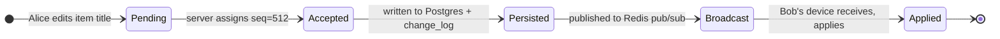

Every feature in this design either produces one of these transitions or handles what happens when one fails.

> **Take this with you.** A shared list is an append-only log of ops, not just a table of current item state. The log is what powers real-time delivery, offline catch-up, and conflict resolution. Design the log first.

---

## How big this gets

| Input | Value |
|-------|-------|
| Daily active users | 1 million |
| Ops per user per day (adds, edits, checks) | ~30 |
| Average list members | 5 |
| Concurrent WebSocket connections at peak | ~200,000 |
| Op log retention | 30 days hot, 2 years cold |

From these we can derive the hard numbers.

<details markdown="1">
<summary><b>Show: the derived numbers</b></summary>

| Metric | Value | How |
|--------|-------|-----|
| Writes per second, steady | ~350 | 1M × 30 / 86,400 |
| Writes per second, peak | ~1,000 | 3x steady |
| Fan-out deliveries per second | ~4,000 | 1k writes × 4 other members |
| Op log storage, 30 days | ~60 GB | 1M × 30 ops × 200 bytes × 30 days |
| Current state storage | ~4 GB | 1M users × 20 lists × 100 items × 200 bytes |

What the numbers tell us:

- **Write rate is not the bottleneck.** 1,000 writes/sec is a light day for Postgres. Throughput is not the hard part.
- **200k concurrent WebSockets cannot live on one machine.** At roughly 50k sockets per Go or Node.js pod, you need 4 to 8 pods, plus a way for a write on pod A to reach a subscriber on pod B.
- **Fan-out volume is moderate.** 4,000 deliveries/sec is comfortable for Redis pub/sub. The fan-out becomes interesting only for lists with thousands of subscribers (a shared "company announcements" list).
- **Op log dominates storage.** The 30-day window caps it at 60 GB per million users. A nightly job archives older ops to S3 and prunes.

</details>

> **Take this with you.** Connection count and cross-pod fan-out are the two design constraints that matter. Write rate is not.

---

## The smallest version that works

Forget the million-user case. Two colleagues share one list. One server, one database, no real-time push.

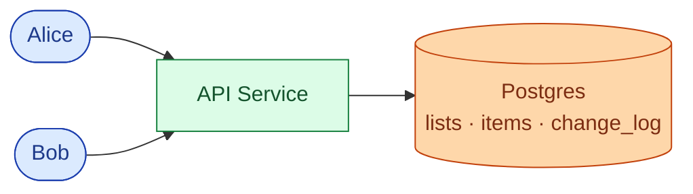

Bob polls `GET /lists/L/changes?since_seq=X` every 10 seconds. If nothing changed, he gets an empty array. If Alice added an item, he gets the op. Latency is up to 10 seconds, which is fine for a small team at first.

Two endpoints carry the core product. One for writes, one for catch-up reads.

| Endpoint | What it does |
|----------|--------------|
| `PATCH /lists/{id}/items/{item_id}` | Write an op; returns `{seq: N}` |
| `GET /lists/{id}/changes?since_seq=N` | Replay ops after N; returns ordered list |

Every write carries a `Client-Op-Id` header. It is a UUID the client generates when the user makes the edit. If the same ID arrives twice (mobile retry), the server returns the original result without applying the op again.

<details markdown="1">
<summary><b>Show: the five tables</b></summary>

```sql
CREATE TABLE users (
    user_id      UUID PRIMARY KEY,
    email        CITEXT UNIQUE NOT NULL,
    display_name TEXT NOT NULL,
    created_at   TIMESTAMPTZ NOT NULL DEFAULT NOW()
);

CREATE TABLE lists (
    list_id    UUID PRIMARY KEY,
    owner_id   UUID NOT NULL REFERENCES users(user_id),
    title      TEXT NOT NULL,
    next_seq   BIGINT NOT NULL DEFAULT 1,
    created_at TIMESTAMPTZ NOT NULL DEFAULT NOW(),
    deleted_at TIMESTAMPTZ
);

CREATE TABLE list_items (
    item_id    UUID PRIMARY KEY,
    list_id    UUID NOT NULL REFERENCES lists(list_id),
    title      TEXT NOT NULL,
    done       BOOLEAN NOT NULL DEFAULT FALSE,
    order_key  TEXT NOT NULL,
    created_by UUID NOT NULL REFERENCES users(user_id),
    last_seq   BIGINT NOT NULL,
    deleted_at TIMESTAMPTZ
);
CREATE INDEX idx_items_list ON list_items (list_id, order_key) WHERE deleted_at IS NULL;

CREATE TABLE share_grants (
    grant_id   UUID PRIMARY KEY,
    list_id    UUID NOT NULL REFERENCES lists(list_id),
    grantee_id UUID NOT NULL REFERENCES users(user_id),
    role       TEXT NOT NULL,
    granted_by UUID NOT NULL REFERENCES users(user_id),
    granted_at TIMESTAMPTZ NOT NULL DEFAULT NOW(),
    revoked_at TIMESTAMPTZ
);
CREATE UNIQUE INDEX idx_grants_active
    ON share_grants (list_id, grantee_id) WHERE revoked_at IS NULL;

CREATE TABLE change_log (
    list_id      UUID NOT NULL,
    seq          BIGINT NOT NULL,
    op           TEXT NOT NULL,
    actor_id     UUID NOT NULL,
    payload      JSONB NOT NULL,
    client_op_id UUID,
    occurred_at  TIMESTAMPTZ NOT NULL DEFAULT NOW(),
    PRIMARY KEY (list_id, seq)
);
CREATE UNIQUE INDEX idx_change_log_idem
    ON change_log (list_id, client_op_id) WHERE client_op_id IS NOT NULL;
```

</details>

This ships in a week and handles a small team without any real-time infrastructure.

---

## Decision 1: how do we push edits to other devices?

Polling at 10 seconds feels slow once users are actively collaborating. Dropping to 2 seconds makes it feel live, but 200k users polling every 2 seconds is 100k requests/sec returning "nothing new." That burns battery and server capacity.

The better model: the server tells devices when something changes, instead of devices asking repeatedly.

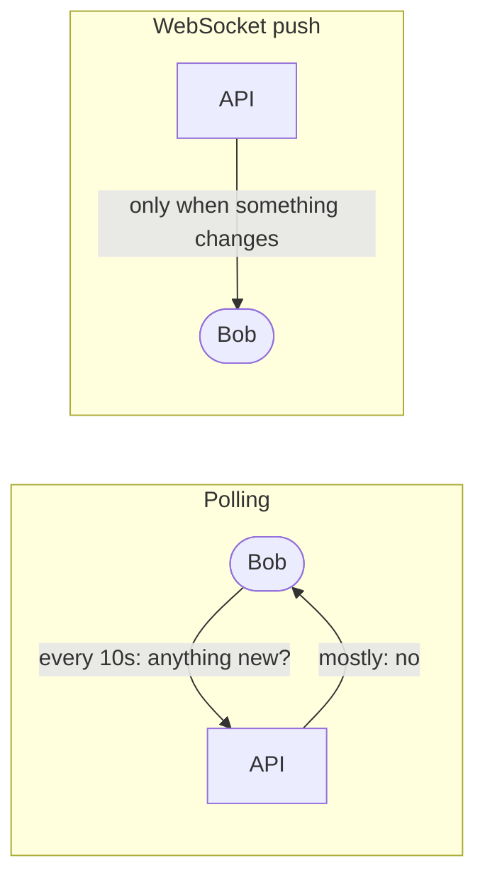

WebSocket is the right tool. One persistent TCP connection per client. The server writes to it the moment an op is committed. Bob sees the change within 200 to 300 ms of Alice pressing Enter.

The next problem: at 200k concurrent sockets you need multiple WS pods. When Alice's write lands on pod A, Bob's connection lives on pod B. Pod A has to signal pod B.

Redis pub/sub solves this. Every write publishes to a channel named `list:{list_id}`. Every WS pod that has at least one subscriber for that list receives the message and forwards it to local sockets.

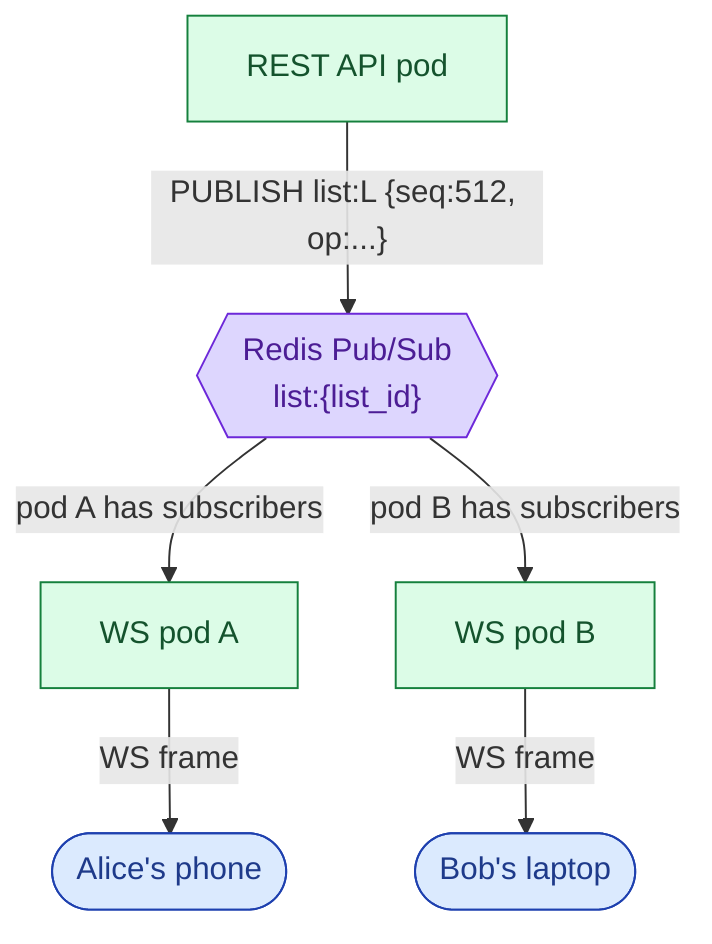

One important detail: pub/sub is fire-and-forget. Redis does not guarantee delivery. If a WS pod restarts mid-message, that message is gone. This is fine because the client tracks which `seq` it last received. On reconnect, it calls `GET /lists/L/changes?since_seq=N` to fill the gap. Postgres is the source of truth. Redis is just the delivery channel.

The sync intervals that matter:

| Delivery path | Typical latency |
|---------------|-----------------|
| Live WebSocket (same region) | 150 to 300 ms |
| Polling fallback (10 s interval) | up to 10 s |
| Reconnect catch-up from change_log | 1 to 5 s depending on gap size |
| Client offline > 30 days (full refetch) | 5 to 30 s |

> **Take this with you.** Postgres is the source of truth. Redis is the delivery channel. If a Redis message is lost, clients detect the gap via seq numbers and call the catch-up endpoint. Nothing is permanently lost.

---

## Decision 2: how do we handle offline writes?

Carol's phone drops signal on the subway. She adds three items while offline. When she surfaces 20 minutes later, her client has three pending ops sitting in a local SQLite queue.

Two problems on reconnect:

1. **Duplicates.** The network might have dropped after the server accepted an op. Carol's client does not know. If she retries, the server must not create a second copy of "oat milk."
2. **Conflicts.** Bob may have edited or deleted one of the items Carol touched while she was offline.

The `client_op_id` field handles duplicates. Each op gets a UUID when Carol creates it. On reconnect she flushes the queue. The server checks `change_log` for that UUID. If it is already there, the server returns the original result. The unique index on `(list_id, client_op_id)` makes this safe under concurrent retries.

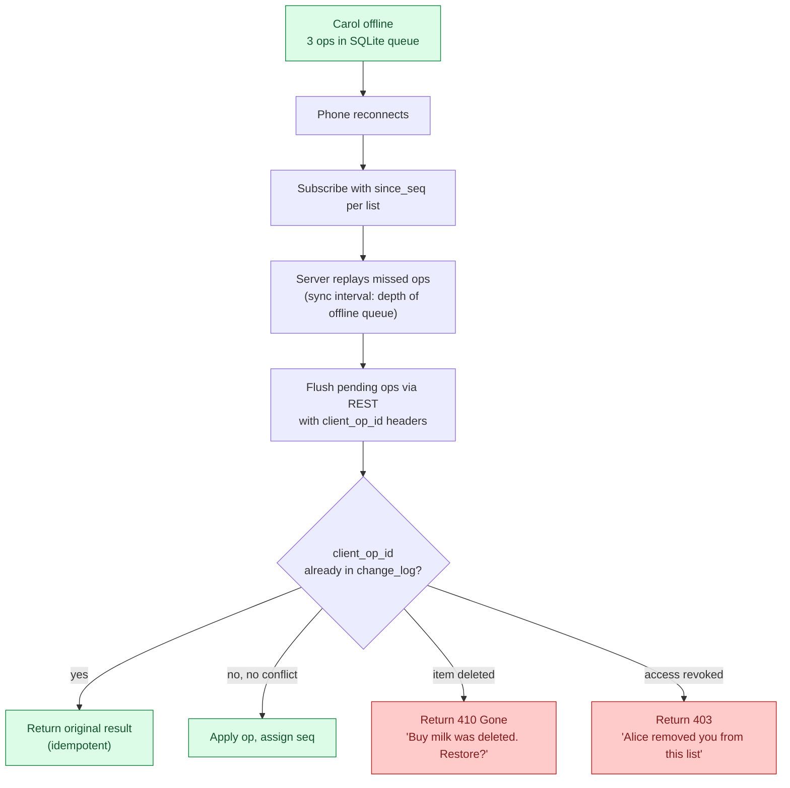

Typical offline queue depths and their handling:

| Offline duration | Queue depth (typical) | Server response |
|------------------|-----------------------|-----------------|
| < 30 min | 1 to 20 ops | Replay + flush, < 1 s |
| 1 to 8 hours | 20 to 200 ops | Replay in pages, 2 to 5 s |
| > 30 days | N/A | `too_far_behind: true`; client refetches full state |

> **Take this with you.** `client_op_id` is non-negotiable. Without it, mobile retries create duplicate items. The unique index on `(list_id, client_op_id)` in `change_log` is what makes "already applied" detection safe.

---

## Decision 3: what do share permissions look like?

Alice owns the list. She grants Bob `editor` and Carol `viewer`.

Three roles cover nearly everything:

| Role | Read items | Write items | Share list | Manage members | Delete list |
|------|------------|-------------|------------|----------------|-------------|
| viewer | yes | no | no | no | no |
| editor | yes | yes | per-list setting | no | no |
| admin | yes | yes | yes | yes | yes |

The interesting question is cascading. Alice revokes Bob. Bob had invited Dave. Does Dave lose access?

Two models:

```mermaid
flowchart LR
    subgraph NonCascade["Non-cascading (recommended)"]
        A1(["Alice"]) -->|revoke| B1(["Bob"])
        B1 -.not affected.-> D1(["Dave"])
        A1 -.prompt: 'Bob invited 1 person. Remove them too?'.-> UI1["UI"]
    end
    subgraph Cascade["Cascading"]
        A2(["Alice"]) -->|revoke| B2(["Bob"])
        B2 -->|auto-revoke| D2(["Dave"])
        D2 -->|"(Dave is surprised)".-> UI2["UI"]
    end
```

Non-cascading is the better default. It is what Notion and Slack do. Revoking Bob does not remove Dave. Alice sees a prompt offering to remove Dave separately. Fewer surprises.

The permission check runs on every request. To avoid a Postgres query on each of the 1,000 writes/sec, cache `(user_id, list_id) -> role` in Redis with a 60-second TTL. On any grant change, invalidate the cache entry. If Bob is revoked, also publish to a `perm:{bob_user_id}` Redis channel so every WS pod drops his subscriptions immediately.

Permission scope comparison:

| Scope | Description | Where enforced |
|-------|-------------|----------------|
| list-level | Can user read/write this list? | Permission cache + DB |
| op-level | Can user perform this specific op type? | API handler |
| revocation propagation | Drop WS subscription within 2 s | `perm:{user_id}` Redis channel |

> **Take this with you.** Permissions are enforced by the server, not the client. The client greys out buttons as a courtesy. The server checks on every write.

---

## Decision 4: how do we resolve concurrent edits?

Alice and Bob both have item #42 open. At the same moment:

- Alice changes "Buy milk" to "Buy oat milk."
- Bob changes "Buy milk" to "Buy almond milk."

Both writes hit the server within 50 ms of each other.

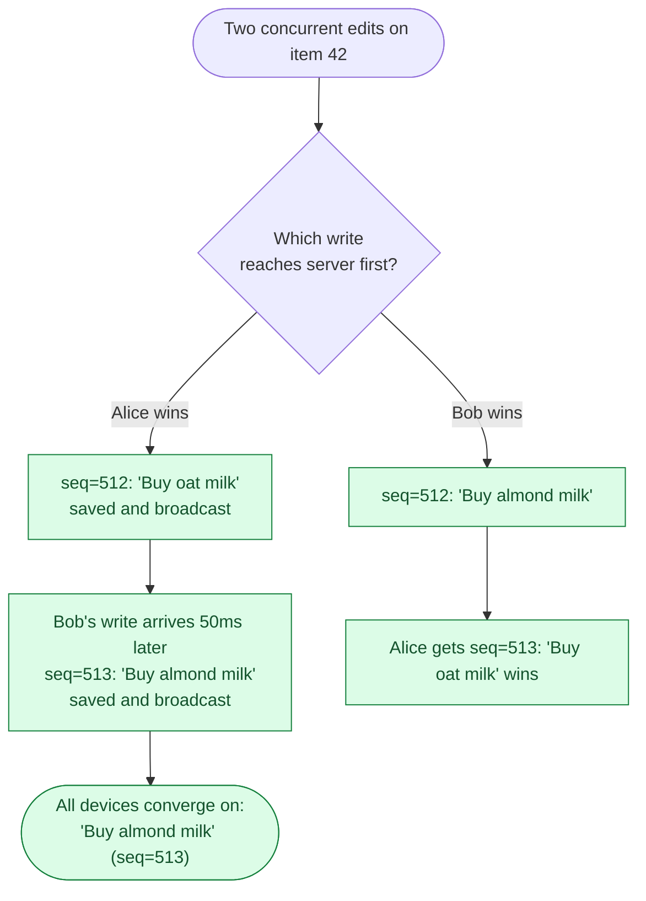

This is last-write-wins (LWW) by server-assigned seq. Higher seq wins. No clock skew possible because the server assigns the seq inside a transaction with a row-level lock on `lists.next_seq`.

Alice's screen may briefly show "Buy oat milk" (optimistic update), then snap to "Buy almond milk" when seq=513 arrives. For a todo list, that flash is fine.

<details markdown="1">
<summary><b>Show: why LWW and not OT or CRDT</b></summary>

**LWW** is correct for item-level edits on a todo list. When two people rename the same item, one edit has to lose. The behavior is "second one wins." Acceptable.

**Operational Transform (OT)** is optimal when two users type in the same text field simultaneously and you want both keystrokes merged. Google Docs uses OT. We are not building Google Docs. OT adds significant complexity for no benefit here.

**CRDT** earns its keep when offline editing is a first-class feature and users spend hours disconnected. CRDTs guarantee convergence without a server round-trip. The cost is real: merge metadata travels with every op, client code is more complex, debugging is harder. Use LWW as the default. Add CRDT for the title field only once offline-conflict complaints are frequent enough to justify the complexity.

**Why not wall-clock timestamps?** Alice's phone might be 30 seconds ahead of Bob's. Server-assigned seq numbers have no skew.

</details>

> **Take this with you.** Use LWW for a todo list. The server-assigned seq number decides the winner. Add CRDT only when offline-first becomes a primary product requirement.

---

## Decision 5: how do we keep op log storage bounded?

At 1 million users, 30 ops/day, 200 bytes each, the log grows by roughly 6 GB per day. Keeping 2 years of history is 4.4 TB. Most of it is cold.

Two-tier retention:

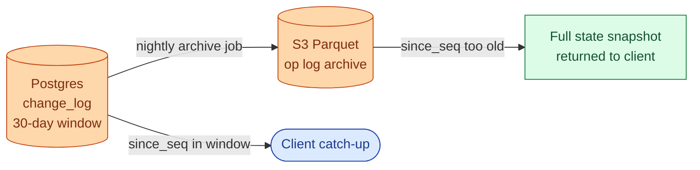

A nightly job copies rows older than 30 days from `change_log` to S3 Parquet and deletes them from Postgres. Clients reconnecting with a `since_seq` older than 30 days receive `too_far_behind: true` and refetch the full current state in one call. That keeps the hot storage at roughly 60 GB per million users.

> **Take this with you.** Keep 30 days of ops in Postgres for cheap catch-up. Archive older ops to S3. Clients older than 30 days do a full refetch. Build the snapshot endpoint early; you will need it.

---

## The full architecture

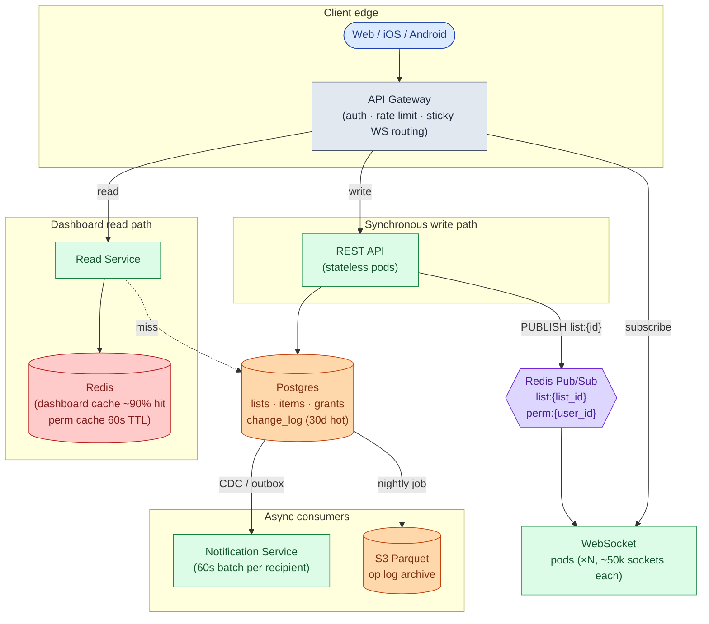

| Component | Purpose |
|-----------|---------|
| API Gateway | Authenticates callers, rate-limits bots, routes WS upgrades to the right pod |
| REST API | Handles all writes. Appends to `change_log` inside the same transaction as the item update |
| WebSocket pods | Hold open sockets. Subscribe to Redis channels. Forward messages to local sockets |
| Postgres | Source of truth. Current item state plus 30 days of `change_log` |
| Redis pub/sub | Cross-pod fan-out for live delivery. Also carries permission-revocation events |
| Read Service + Redis cache | Serves the "my lists" dashboard. ~90% cache hit rate, no DB query in the common case |
| Notification Service | Consumes `change_log` via CDC, batches per recipient over 60 seconds, sends push/email |
| S3 cold tier | Op log older than 30 days. Queried rarely, mostly for compliance or undo past the 30-day window |

---

## Walk: one edit, end to end

Alice edits item #42. Bob has the same list open on his laptop.

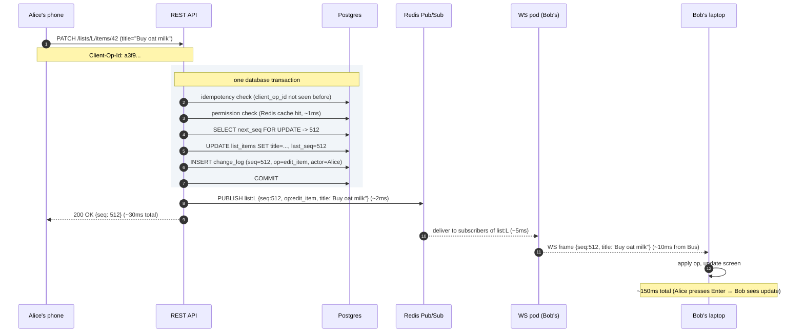

Three things to notice:

1. The seq bump, the item update, and the `change_log` row are written in one transaction. If anything fails, it all rolls back. Alice sees a 500. Bob never sees a partial update.
2. The Redis publish happens after the commit. Publishing inside the transaction and then rolling back would fan out ops that never persisted.
3. Bob's client knows it last saw `seq=511`. When `seq=512` arrives in order, apply it. If `seq=514` arrived first (gap), the client calls the catch-up endpoint to fill in 513 before applying.

---

## Walk: reconnect after a gap

Bob's laptop went to sleep for 2 hours. He opens it and the WebSocket reconnects.

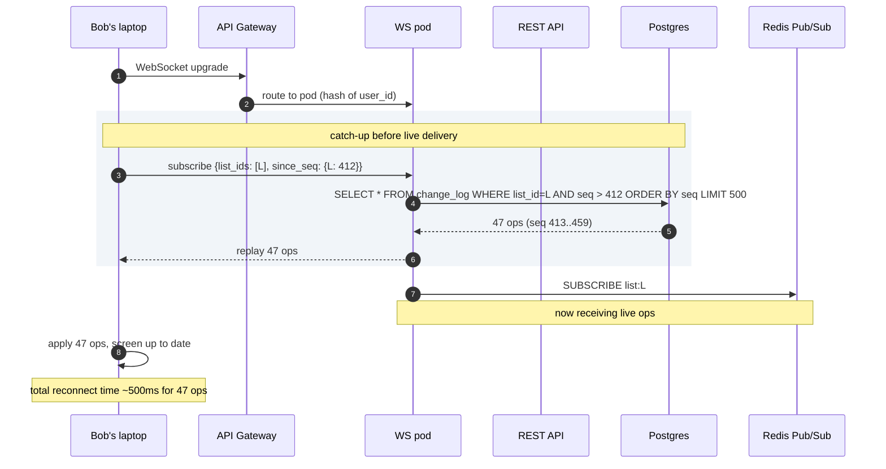

If Bob was offline more than 30 days, the server returns `too_far_behind: true, current_seq: 9001`. Bob's client refetches full list state via `GET /lists/L`, then subscribes from `since_seq: 9001`.

---

## The large-list fan-out problem

A "company all-hands action items" list has 5,000 subscribers. Every edit fans out to 5,000 sockets across ~8 WS pods. At 10 edits/minute, that is 50,000 message deliveries per minute, roughly 833/sec.

What breaks first: outbound bandwidth per pod. 500-byte op × 625 subscribers per pod × 10 edits/min = 3 MB/min per pod. At 1 edit/sec it becomes 3 MB/sec, getting tight.

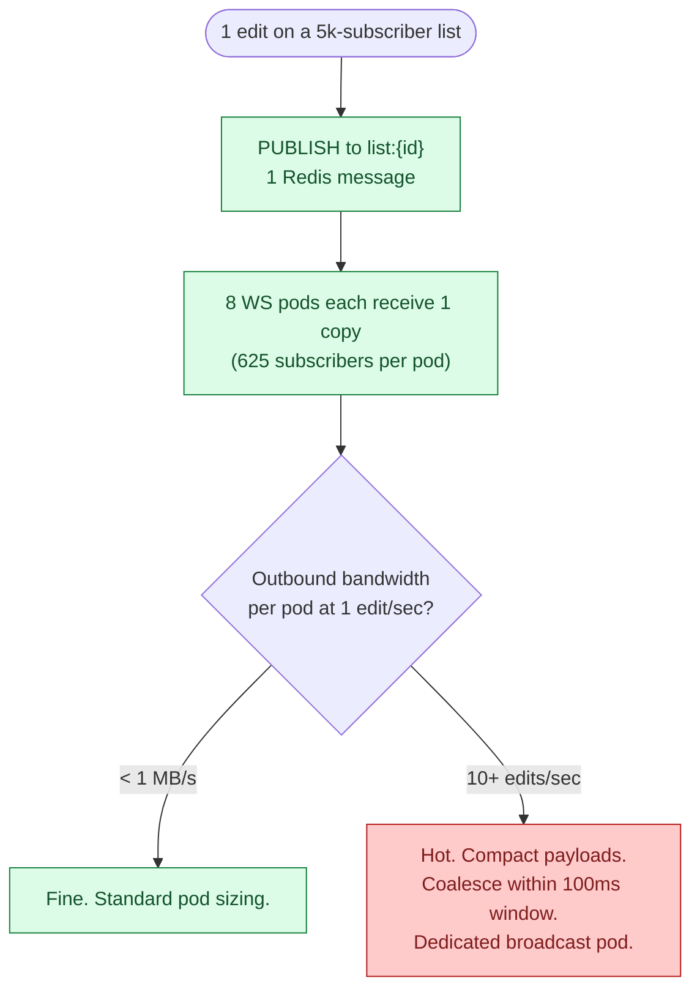

Mitigations: compact op payloads (delta only, not full item state), coalesce multiple edits within a 100 ms window before broadcasting, and route very large lists to dedicated broadcast pods with higher network allocation. For most todo-list use cases this scenario is rare. Consider capping subscribers per list at 1,000 in the standard product tier.

> **Take this with you.** Fan-out bandwidth is the constraint on large lists, not write throughput. Compact payloads and coalescing buy you an order of magnitude before you need dedicated infrastructure.

---

## Follow-up questions

Try answering each in 2 to 4 sentences before opening the solution.

1. **Reconnect after a long disconnect.** Bob's phone has been offline for 4 hours. He reconnects and his client knows it last saw `seq=412` on list L. How does the server send Bob just the deltas, and what do you do when someone has been offline for 6 weeks?

2. **Presence.** Bob wants to see a small avatar showing that Alice is currently viewing the list. How do you do this without writing to Postgres every second?

3. **Permission revoked while connected.** Alice revokes Bob while Bob has the list open and his WebSocket is still subscribed. How quickly does Bob actually lose access, and what does his client show?

4. **Item ordering.** Users can drag items to reorder. Two users drag the same item at the same moment. How do you represent the order so it does not produce a mess?

5. **Notifications.** When Alice adds an item, Bob should get a push notification. Where in your design does this happen, and how do you avoid sending Bob 50 notifications when Alice adds 50 items in 10 seconds?

6. **Search.** Bob wants to search across all his lists for "milk." How do you do this without scanning every item in every list?

7. **Undo.** Bob accidentally deletes an item and hits Cmd-Z. How does this work, and what happens if other collaborators have already seen the deletion?

8. **Sticky routing fails.** Your load balancer cannot guarantee a returning client lands on the same WS pod. The new pod knows nothing about Bob's subscriptions. What happens, and how do you recover?

9. **A list with 50,000 subscribers.** A celebrity creates a "Daily affirmations" list and 50k people follow it. Every edit fans out to 50k clients. What breaks first, and what do you do?

10. **Privacy.** Bob is on Alice's list and can see other members' names. Some users want to be listed as anonymous. How do you support that?

---

## Related problems

- **[Approval Management Service (011)](../011-approval-management/question.md).** Also uses an append-only op log as the spine. Compare the `change_log` here with the `audit_log` there. Same idea, different consumers.
- **[Comment System (015)](../015-comment-system/question.md).** Comments use the same real-time fan-out and permission checks. Thread structure and notification batching apply directly.
- **[Read-Heavy System Patterns (017)](../017-read-heavy-patterns/question.md).** The "render Bob's dashboard" path is a heavy read. The caching patterns there apply here.
