## The scene

You sit down. The interviewer smiles and says:

> *"Everyone has used Todoist or a notes app with a shared list. Build one. Users make lists. They add items. They check things off. And here is the fun part: any list can be shared with other people. When Alice adds an item, Bob, who is also on that list, should see it on his phone within a second or two. Build that."*

They wait.

It sounds like a simple CRUD app. It is not.

Three hard problems are hiding in that description:

- How do you push a change to other devices in near real-time without melting your servers?
- What happens when Alice and Bob edit the same item title at the same moment?
- What does "access" mean when a list gets re-shared?

Most people jump straight to *"I'll use WebSockets."* That is the right tool but the wrong place to start. The right place is to understand what kind of collaboration you are actually building. A list that refreshes every 10 seconds is a completely different system from one where Alice's keystrokes appear on Bob's screen as she types.

We will walk this from 10 users to 1 million, adding one layer at a time.

---

## Step 1: Picture one shared edit

Before any boxes, just picture the smallest thing that needs to happen. Alice makes a change. Bob sees it.

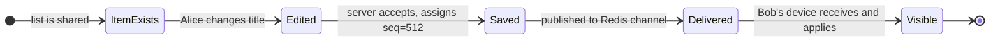

That is the whole product, in one picture. Everything we add later (conflict resolution, offline sync, permissions) is a complication on top of this.

> **Take this with you.** A shared todo list is not a chat app and not a document editor. It is closer to a shared spreadsheet where each item is a row. That framing keeps the design grounded.

---

## Step 2: Ask the right questions

In a real interview, sit quietly for two minutes. Write down what you want to ask. Not twenty questions. Five good ones.

<details markdown="1">
<summary><b>Show: 5 questions that change the design</b></summary>

1. **How real-time is real-time?** Is a 2-second delay okay, or do we need sub-100ms like Google Docs where you see each keystroke? *This one answer drives 60% of the design. Two seconds means polling works. Sub-second means WebSocket. Sub-100ms co-editing means CRDT.*

2. **Can a person you invited re-share with someone else?** *Changes the permission model from a flat list of users to a tree with `granted_by` chains. Also affects what happens when you revoke someone.*

3. **Is offline support a first-class feature?** *If yes, the client needs a local op queue on disk and the server must accept out-of-order ops with client-side IDs. If no, every write requires a live connection and the whole design gets simpler.*

4. **What roles?** Viewer, editor, admin? *Two roles cover 90% of cases. Three cover nearly everything.*

5. **How long is the history kept?** Can Bob undo a deletion from last week? Or just the last 30 seconds? *Affects how long you keep the op log and what your compaction policy looks like.*

A strong candidate also names what is out of scope: rich-text editing inside items, file attachments, calendar sync, sub-tasks. Each one would double the scope.

</details>

---

## Step 3: How big is this thing?

Same product, two very different companies.

| Scale | Writes/sec (peak) | Reads/sec (peak) | Concurrent WebSocket | Storage, 2 years |
|-------|-------------------|------------------|----------------------|------------------|
| 10k DAU | 10 | 15 | ~2,000 | 40 MB state + ~60 GB op log |
| 1M DAU | 1,000 | 1,500 | ~200,000 | 4 GB state + ~6.5 TB op log |

<details markdown="1">
<summary><b>Show: how the numbers come out</b></summary>

Assume each daily active user adds or checks off 30 items per day, opens the app 15 times, and holds one WebSocket open when active. About 20% of users are active at peak.

**At 10k DAU:**

- Writes: 10k × 30 = 300k/day = ~3.5/sec average, **10/sec peak**. Tiny.
- Reads: 10k × 15 opens × 3 lists per session = 450k/day = ~5/sec average, **15/sec peak**. Tiny.
- WS connections: 20% of 10k = **2,000**. One 4 GB server handles that easily.
- Storage: 10k users × 20 lists × 100 items × ~200 bytes = **40 MB** for current state.
- Fan-out: each write to a 5-person list pushes to 4 other devices. At 10 writes/sec that is **40 deliveries/sec**. Trivial.

**At 1M DAU:**

- Writes: 1M × 30 = 30M/day = **~350/sec average, 1,000/sec peak**. Still fine for one Postgres on beefy hardware.
- Reads: 1M × 15 × 3 = 45M/day = **~520/sec average, 1,500/sec peak**.
- WS connections: 20% of 1M = **200,000 open sockets**. A typical Node.js or Go server handles ~50k per box. You need 4 to 8 boxes.
- Storage: 1M users × 20 × 100 × 200 bytes = **4 GB** for current state. The op log at 30 ops/user/day × 200 bytes × 1M users × 730 days ≈ **4.4 TB** if you kept everything. You will compact it.
- Fan-out: 1k writes/sec × 4 collaborators = **4,000 deliveries/sec**, spread across many WS pods.

**What the math is telling you:**

Write throughput is not the problem. Even at 1M users, 1k writes/sec is a light day for Postgres.

The hard problems are:

- **Connection count.** 200k open sockets cannot live on one machine.
- **Fan-out across pods.** Alice's write lands on pod A but Bob's connection lives on pod B. Pod A needs a way to tell pod B. Redis pub/sub is what solves this.
- **Op log storage.** Keep 30 days of ops per list. Clients offline longer than 30 days refetch full state. This caps the log at roughly **60 GB** per million DAU.

</details>

> **Take this with you.** Write rate is not the bottleneck. The two hard numbers are concurrent socket count and fan-out delivery.

---

## Step 4: The smallest thing that works

Forget the million-user case. We have a 10-person team. One list. Two people sharing it. No offline, no reconnect, no Redis.

Three boxes. Nothing else.

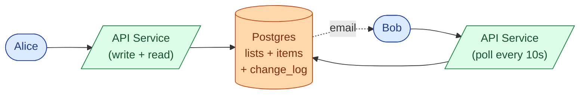

Bob just polls. Every 10 seconds he calls `GET /lists/L/changes?since_seq=X`. If nothing changed, he gets an empty array. If Alice added an item, he gets the op.

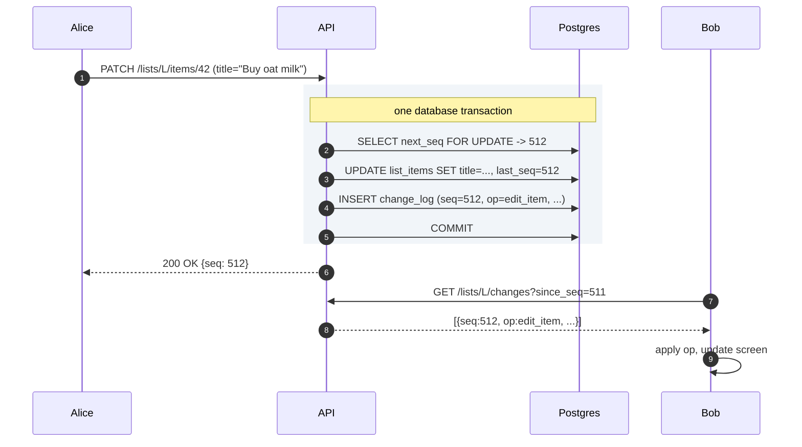

<details markdown="1">
<summary><b>Show: the five tables</b></summary>

```sql
CREATE TABLE users (
    user_id      UUID PRIMARY KEY,
    email        CITEXT UNIQUE NOT NULL,
    display_name TEXT NOT NULL,
    created_at   TIMESTAMPTZ NOT NULL DEFAULT NOW()
);

CREATE TABLE lists (
    list_id    UUID PRIMARY KEY,
    owner_id   UUID NOT NULL REFERENCES users(user_id),
    title      TEXT NOT NULL,
    next_seq   BIGINT NOT NULL DEFAULT 1,
    created_at TIMESTAMPTZ NOT NULL DEFAULT NOW(),
    deleted_at TIMESTAMPTZ
);

CREATE TABLE list_items (
    item_id    UUID PRIMARY KEY,
    list_id    UUID NOT NULL REFERENCES lists(list_id),
    title      TEXT NOT NULL,
    done       BOOLEAN NOT NULL DEFAULT FALSE,
    order_key  TEXT NOT NULL,
    created_by UUID NOT NULL REFERENCES users(user_id),
    last_seq   BIGINT NOT NULL,
    deleted_at TIMESTAMPTZ
);
CREATE INDEX idx_items_list ON list_items (list_id, order_key) WHERE deleted_at IS NULL;

CREATE TABLE share_grants (
    grant_id   UUID PRIMARY KEY,
    list_id    UUID NOT NULL REFERENCES lists(list_id),
    grantee_id UUID NOT NULL REFERENCES users(user_id),
    role       TEXT NOT NULL,
    granted_by UUID NOT NULL REFERENCES users(user_id),
    granted_at TIMESTAMPTZ NOT NULL DEFAULT NOW(),
    revoked_at TIMESTAMPTZ
);
CREATE UNIQUE INDEX idx_grants_active
    ON share_grants (list_id, grantee_id) WHERE revoked_at IS NULL;

CREATE TABLE change_log (
    list_id      UUID NOT NULL,
    seq          BIGINT NOT NULL,
    op           TEXT NOT NULL,
    actor_id     UUID NOT NULL,
    payload      JSONB NOT NULL,
    client_op_id UUID,
    occurred_at  TIMESTAMPTZ NOT NULL DEFAULT NOW(),
    PRIMARY KEY (list_id, seq)
);
CREATE UNIQUE INDEX idx_change_log_idem
    ON change_log (list_id, client_op_id) WHERE client_op_id IS NOT NULL;
```

The `change_log` is the spine. It powers real-time delivery, reconnect catch-up, undo, and offline sync. Every other feature builds on it.

</details>

> **Take this with you.** Always start from the smallest thing that works. The interesting part of the interview is what happens next.

---

## Step 5: The first crack

Ten seconds is fine for a shopping list. But the product manager has just demoed the app and says: *"Users complain that when someone checks an item off, the other person doesn't see it immediately. Can we make it instant?"*

You look at the polling code. 10-second lag is baked into the protocol. You could drop it to 2 seconds, but then Bob's phone is hammering the server 30 times a minute. At 1M users that is 500,000 requests per second, most returning "nothing new." Wasteful.

The fix is to flip the relationship. Instead of Bob asking *"anything new?"* every few seconds, the server tells Bob the moment something changes. That is what WebSocket is for.

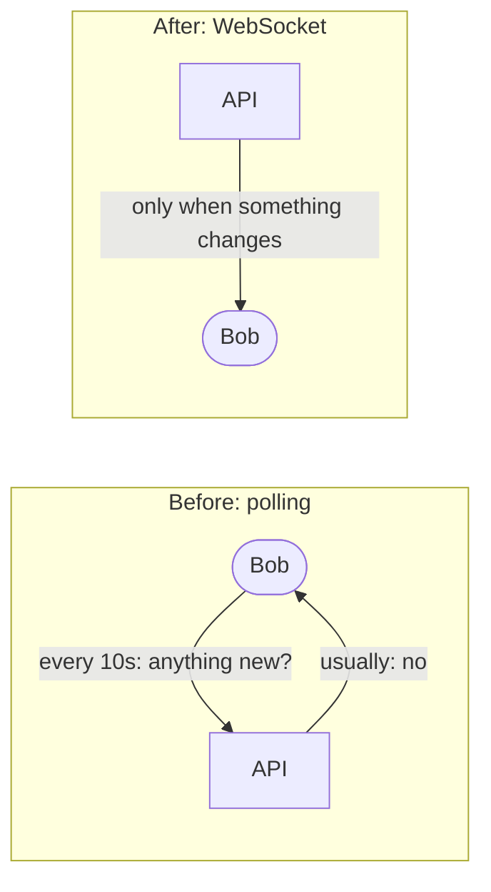

The change is conceptually small. In practice it introduces a new problem: Alice and Bob might be connected to different servers. When Alice writes, how does Bob's server find out?

> **Take this with you.** Polling is not lazy design. At small scale it is cheaper and simpler than WebSocket. Switch when the polling cost (battery on mobile, wasted server work) outweighs the engineering cost.

---

## Step 6: Build the architecture, one layer at a time

### v1: one server, polling

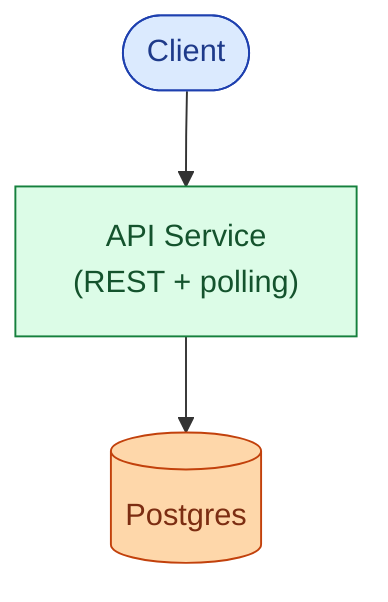

Fine for a small team. Ships in a week.

### v2: add WebSocket, still one server

Split the API service into two. The REST API handles writes. The WebSocket service holds open sockets. When Alice writes, the REST API needs a way to tell the WS service immediately. Because there is only one WS process, an in-process channel works (Go channel, Node.js EventEmitter, asyncio.Queue).

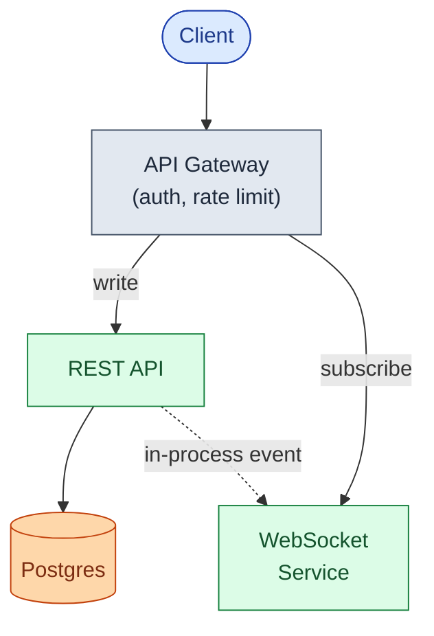

**Why two services and not one?** They scale very differently. The REST API is request/response with low memory per connection. The WS service is connection-heavy, with 10 to 50 KB memory per open socket. Splitting them lets each scale on its axis.

### v3: multiple WS pods need a fan-out bus

At ~30k concurrent sockets you need more than one WS pod. Now Alice's write can land on pod A but Bob's connection lives on pod B. Add Redis pub/sub as the fan-out bus. Every write publishes a message to a channel named `list:{list_id}`. Every WS pod that has at least one subscriber for that list receives it and forwards to local sockets.

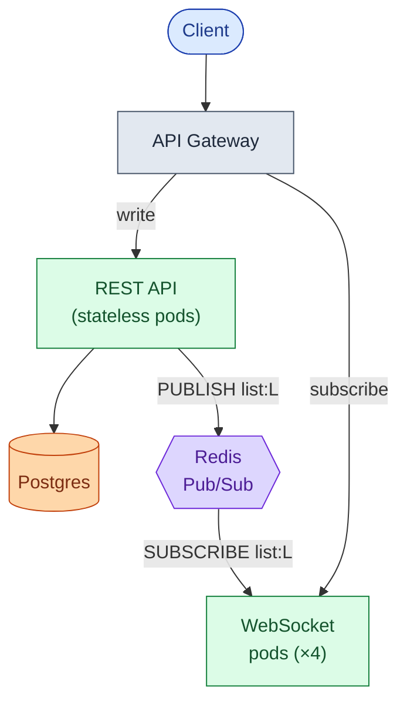

### v4: add the permission cache, notifications, and op log compaction

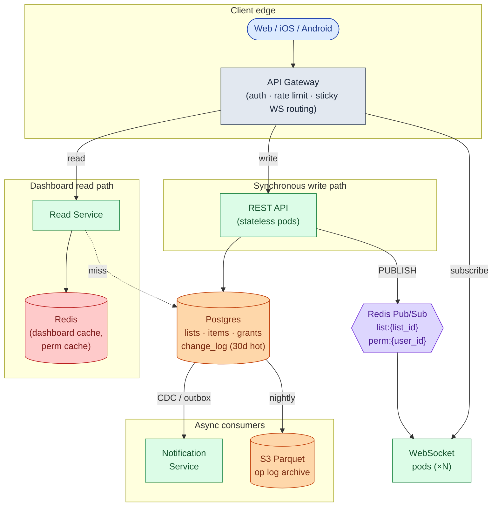

Each box in one line:

| Box | What it does |
|-----|--------------|
| **API Gateway** | Authenticates the caller, rate-limits bots, routes WS upgrades to the right pod |
| **REST API** | Handles all writes: create list, add item, check off, share. Appends to `change_log` in the same transaction |
| **WebSocket pods** | Hold open sockets. Subscribe to Redis channels. Forward messages to local sockets |
| **Postgres** | Source of truth. Current state plus the last 30 days of `change_log` |
| **Redis pub/sub** | The fan-out bus. Also carries permission-revocation events |
| **Read Service + Redis cache** | Serves the "my lists" dashboard. One cache read, no DB query in the common case |
| **Notification Service** | Consumes `change_log` via CDC, batches per recipient, sends push/email |
| **S3 cold tier** | Op log older than 30 days. Queried rarely, mostly for compliance |

> **Take this with you.** Postgres is the source of truth. Redis is just the delivery channel. If a Redis message is lost (pub/sub is fire-and-forget), clients detect the gap via seq numbers and call the catch-up endpoint. Nothing is lost.

---

## Step 7: One write, all the way through

Alice edits item #42 on her phone. Bob has the same list open on his laptop. Watch what happens.

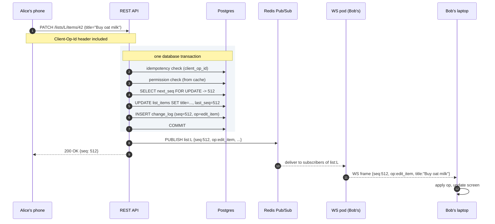

Three things worth pointing at:

1. The seq bump, the item update, and the `change_log` row are written in **one transaction**. If anything fails, it all rolls back. Alice gets a 500. Bob never sees a partial update.
2. The Redis publish happens **after** the commit. If you publish inside the transaction and it rolls back, subscribers see ops that never persisted.
3. Bob's client knows it last saw `seq=511`. When `seq=512` arrives in order, apply it. If `seq=514` arrived first (gap), the client calls the catch-up endpoint to fill in `seq=513` before applying.

---

## Step 8: The conflict problem

Alice and Bob both have the same list open. At the same moment:

- Alice changes item #42 from "Buy milk" to "Buy oat milk."
- Bob changes item #42 from "Buy milk" to "Buy almond milk."

Both writes hit the server within 50ms of each other. Whose title wins?

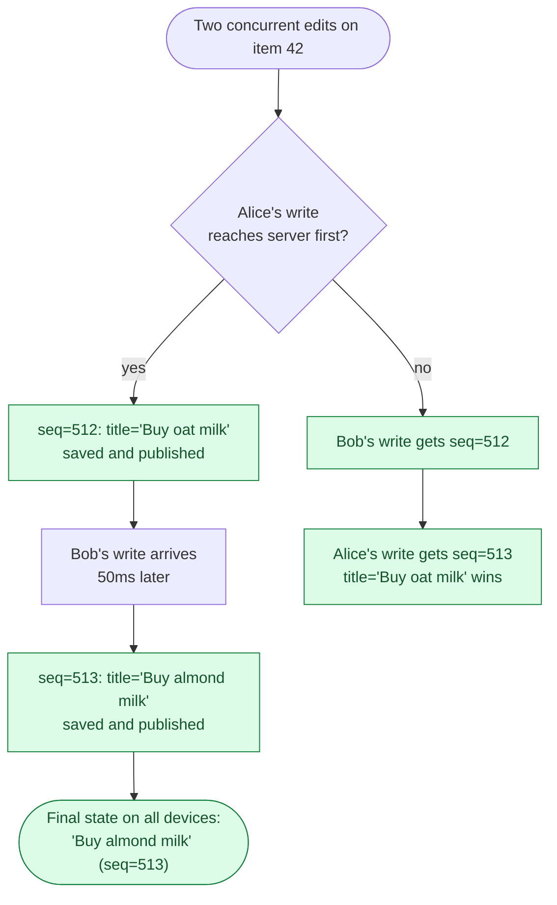

This is **last-write-wins by server-assigned sequence number (LWW)**. The server decides order. No clock skew possible.

Alice's screen may briefly show "Buy oat milk" (optimistic update), then snap to "Buy almond milk" when `seq=513` arrives. For a todo list, that flash is acceptable.

<details markdown="1">
<summary><b>Show: why LWW and not OT or CRDT</b></summary>

**Last-write-wins (LWW)** is the right choice for a todo list. When two people both rename the same item, one edit has to lose. The user experience is "second one wins." That is fine.

**Operational Transform (OT)** shines when two users are typing in the same text field at the same time and you want both keystrokes preserved. That is overkill for "edit item title." Google Docs uses OT because it is a document editor. We are not.

**CRDT** earns its keep when offline editing is a first-class feature and users spend hours disconnected. CRDTs guarantee that two clients that diverged for any length of time will converge to the same final state without a server round-trip. The cost is real: bigger payload per op (merge metadata travels with the data), harder to debug, more complex client code. LWW is the right first choice for a todo list. CRDT makes sense later, for the title field, when the offline complaint is loud enough.

**Why not wall-clock timestamps for LWW?** Alice's phone might be 30 seconds ahead of Bob's. Use server-assigned seq numbers instead. Higher seq wins. No clock skew possible.

</details>

> **Take this with you.** Use LWW for a todo list. Use CRDT for the title field only, once offline editing is a primary complaint. Never use OT unless you are building a document editor.

---

## Step 9: Permissions

Alice owns a list. She shares it with Bob as editor and Carol as viewer.

Bob wants to share the list with Dave. Does Bob have that authority?

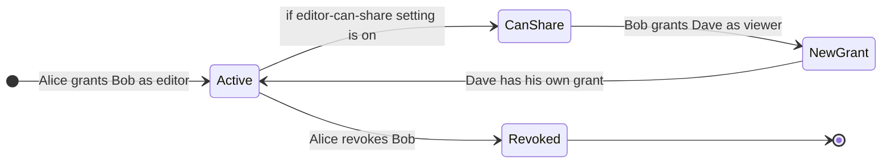

Three roles. Six permissions. Simple enough to reason about.

| Role | Read items | Write items | Share list | Manage members | Delete list |
|------|------------|-------------|------------|----------------|-------------|
| **viewer** | yes | no | no | no | no |
| **editor** | yes | yes | per-list setting | no | no |
| **admin** | yes | yes | yes | yes | yes |

<details markdown="1">
<summary><b>Show: the grants table and cascade rules</b></summary>

```sql
CREATE TABLE share_grants (
    grant_id   UUID PRIMARY KEY,
    list_id    UUID NOT NULL,
    grantee_id UUID NOT NULL,
    role       TEXT NOT NULL,
    granted_by UUID NOT NULL,
    granted_at TIMESTAMPTZ NOT NULL DEFAULT NOW(),
    revoked_at TIMESTAMPTZ
);
CREATE UNIQUE INDEX idx_grants_active
    ON share_grants (list_id, grantee_id)
    WHERE revoked_at IS NULL;
```

A user has access if there is a row with their `grantee_id` and a NULL `revoked_at`. The partial unique index prevents accidentally giving someone two roles on the same list.

**Does Dave lose access when Alice revokes Bob?**

Two models. Pick one and defend it:

- **Non-cascading (recommended).** Revoking Bob does NOT revoke Dave. Dave has his own grant. Alice can see Bob added Dave and choose to revoke Dave separately. The UI prompts: "Bob added 1 other person. Remove them too?" Make it explicit, not automatic. Notion and Slack both work this way.
- **Cascading.** Revoking Bob automatically revokes everyone Bob invited, recursively. Harder to reason about. Surprises users.

**Cache the permission check.** Store `(user_id, list_id) -> role` in Redis with a 60-second TTL. A user touches the same few lists repeatedly. Hit rate is very high. Invalidate on any grant change. If Bob is revoked, publish to a `perm:{bob_user_id}` Redis channel. Every WS pod that has Bob's connection drops his subscription to `list:L` immediately.

Without the cache: every write triggers a Postgres permission lookup. At 1k writes/sec that is 1k extra queries/sec. With a 95% cache hit rate it drops to 50/sec.

</details>

> **Take this with you.** Permissions are enforced by the server, not the client. The client greys out buttons as a courtesy. The server checks every time.

---

## Follow-up questions

Try answering each in 2 to 4 sentences before opening the solution.

1. **Reconnect after a long disconnect.** Bob's phone has been offline for 4 hours. He reconnects and his client knows it last saw `seq=412` on list L. How does the server send Bob just the deltas, and what do you do when someone has been offline for 6 weeks?

2. **Presence.** Bob wants to see a small avatar showing that Alice is currently viewing the list. How do you do this without writing to Postgres every second?

3. **Permission revoked while connected.** Alice revokes Bob while Bob has the list open and his WebSocket is still subscribed. How quickly does Bob actually lose access, and what does his client show?

4. **Item ordering.** Users can drag items to reorder. Two users drag the same item at the same moment. How do you represent the order so it does not produce a mess?

5. **Notifications.** When Alice adds an item, Bob should get a push notification. Where in your design does this happen, and how do you avoid sending Bob 50 notifications when Alice adds 50 items in 10 seconds?

6. **Search.** Bob wants to search across all his lists for "milk." How do you do this without scanning every item in every list?

7. **Undo.** Bob accidentally deletes an item and hits Cmd-Z. How does this work, and what happens if other collaborators have already seen the deletion?

8. **Sticky routing fails.** Your load balancer cannot guarantee a returning client lands on the same WS pod. The new pod knows nothing about Bob's subscriptions. What happens, and how do you recover?

9. **A list with 50,000 subscribers.** A celebrity creates a "Daily affirmations" list and 50k people follow it. Every edit fans out to 50k clients. What breaks first, and what do you do?

10. **Privacy.** Bob is on Alice's list and can see other members' names. Some users want to be listed as anonymous. How do you support that?

---

## Related problems

- **[Approval Management Service (011)](../011-approval-management/question.md).** Also uses an append-only op log as the spine. Compare the `change_log` here with the `audit_log` there. Same idea, different consumers.
- **[Comment System (015)](../015-comment-system/question.md).** Comments use the same real-time fan-out and permission checks. Thread structure and notification batching apply directly.
- **[Read-Heavy System Patterns (017)](../017-read-heavy-patterns/question.md).** The "render Bob's dashboard" path is a heavy read. The caching patterns there apply here.
