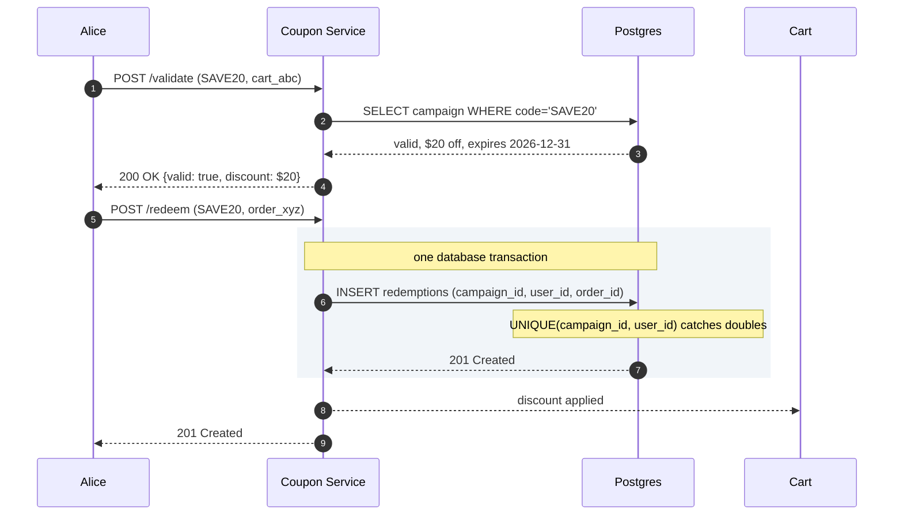
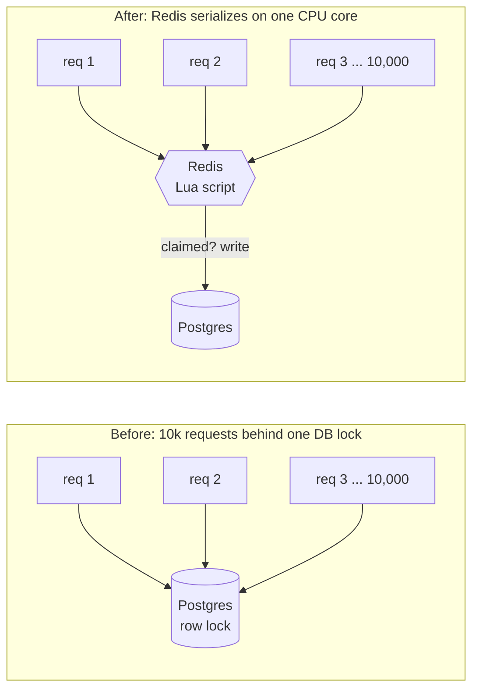
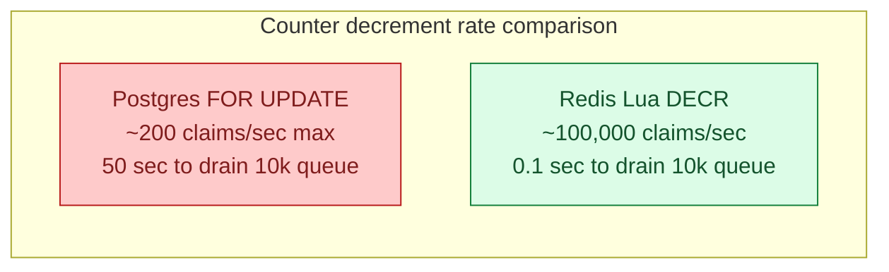
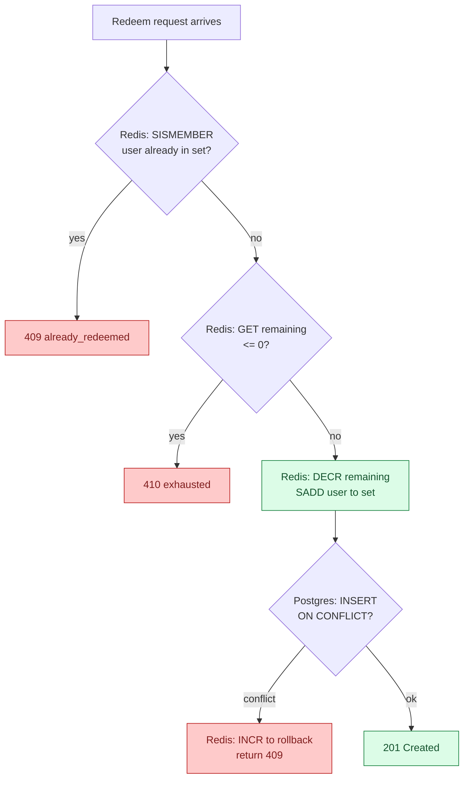
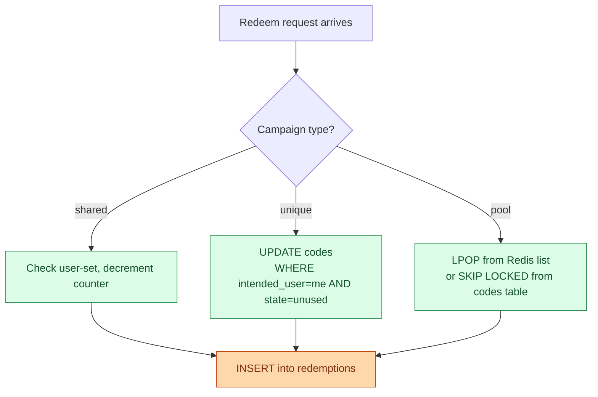
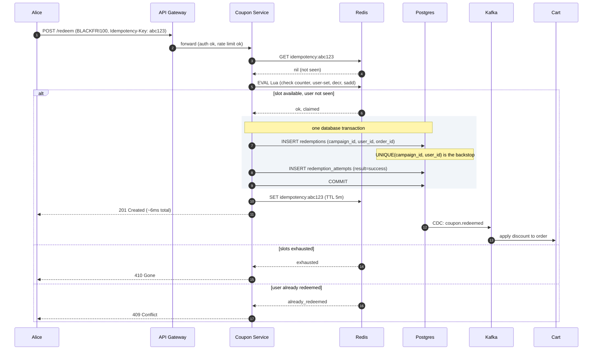
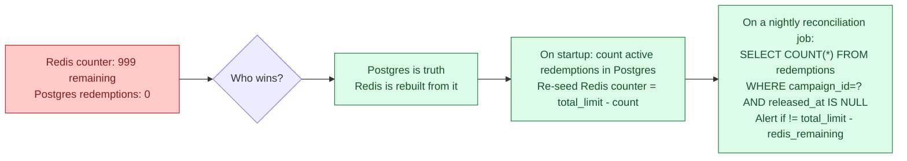

## What we are building

Marketing launches a code: `SAVE20`. It gives $20 off, limited to the first 10,000 customers, one per user. Alice enters it at checkout, gets the discount, and the counter goes down by exactly one, even when the campaign drops during a flash-sale spike with thousands of people all hitting redeem at the same instant.

That is the core product. It looks like a simple "mark a row used" operation. It is not.

Four real problems hide inside it:

1. **Atomic decrement under heavy concurrency.** When 10,000 requests arrive in one second, the wrong implementation gives out 10,200 discounts or times out 9,000 people.
2. **Per-user limit enforcement.** Alice submits from two browser tabs at the same time. Both requests reach the server before either has written to the database. Exactly one should succeed.
3. **Fraud and namespace scraping.** A bot fires `SAVE01`, `SAVE02`, `SAVE03`, ... at hundreds of attempts per second to find valid codes before real users do.
4. **Eventually consistent vs. strongly consistent counter.** If Redis holds the counter and Postgres holds the record, what happens when they drift? Which one is authoritative?

We start with the smallest version that works, then add one pressure at a time.

---

## The lifecycle of one redemption

Picture the state a code goes through before drawing any boxes.


The whole product lives in this diagram. Every piece of infrastructure added later serves one purpose: resolving the race at the `Claimed` transition correctly when two users hit the last slot at the same instant.

> **Take this with you.** A coupon system is a state machine with one nasty edge: two requests hitting the last slot simultaneously. The architecture exists to resolve that race correctly and only once.

---

## How big this gets

Two very different moments in the same day.

| Moment | Requests/sec | What is hot | The hard problem |
|--------|-------------|-------------|-----------------|
| Steady state | ~5 redeem, ~25 validate | Many campaigns, all warm | Cache hit rate |
| Launch burst | **10,000 in 1 second** | One campaign, one counter | Correct winner count |

<details markdown="1">
<summary><b>Show: how the numbers come out</b></summary>

**Launch burst.** 10,000 requests in 1 second = 10,000 QPS spike, lasting seconds not hours. Every request needs a correct answer: 1,000 win, 9,000 lose, nobody gets two.

**Steady QPS.** 50,000 redemptions per day / 86,400 seconds is about 0.6 per second. At peak hours maybe 5. Validate runs about 5 times per redeem (users paste, bounce, come back), so steady validate QPS is roughly 25 per second.

**Storage.** 200 million codes x 200 bytes is about 40 GB. Redemption log over 5 years is about 9 GB. Total around 50 GB. One Postgres instance.

**Hot working set during a launch.** One campaign. One counter. Maybe 100 KB of actively hot data.

What the math tells you: the system is small. Throughput is not the problem. Storage is not the problem. The architecture exists for two reasons: surviving the 10,000 QPS burst on one hot key correctly, and stopping abuse.

</details>

> **Take this with you.** Build for the burst, not the average. The 9,000 losers who need a fast "sold out" response are the real design pressure, not the 1,000 winners.

---

## The smallest version that works

Ten users. One campaign: `WELCOME20`, 20% off, unlimited. One service. One database.


Two endpoints carry the entire product.

| Endpoint | What it does |
|----------|--------------|
| `POST /coupons/validate` | Check the code and return the discount. Read-only. |
| `POST /coupons/redeem` | Claim a slot atomically. Writes to the database. |

<details markdown="1">
<summary><b>Show: the three tables at this stage</b></summary>

```sql
CREATE TABLE campaigns (
    campaign_id    UUID PRIMARY KEY,
    code           TEXT UNIQUE NOT NULL,
    discount       JSONB NOT NULL,
    starts_at      TIMESTAMPTZ NOT NULL,
    ends_at        TIMESTAMPTZ NOT NULL,
    total_limit    INT,
    per_user_limit INT NOT NULL DEFAULT 1
);

CREATE TABLE redemptions (
    redemption_id UUID PRIMARY KEY,
    campaign_id   UUID NOT NULL REFERENCES campaigns,
    user_id       TEXT NOT NULL,
    order_id      TEXT NOT NULL,
    redeemed_at   TIMESTAMPTZ NOT NULL DEFAULT NOW()
);

CREATE UNIQUE INDEX idx_redemption_once
    ON redemptions (campaign_id, user_id);
```

The `UNIQUE(campaign_id, user_id)` index is the whole correctness story at this stage. Two browser tabs, two retries, a race: the database serializes them. First insert wins. Second fails with a unique-violation. The API returns 409.

</details>

The happy path, traced:



> **Take this with you.** The `UNIQUE(campaign_id, user_id)` index is the correctness foundation. Every layer added later is performance on top of that guarantee.

---

## Decision 1: how do we keep the counter correct under burst?

Marketing launches `BLACKFRI100`: 1,000 codes, 10,000 attempts in the first second.

Naive approach: `SELECT remaining FROM campaigns WHERE code='BLACKFRI100' FOR UPDATE`. Every one of those 10,000 requests queues behind the same database row lock. The first finishes in 5 ms. The 10,000th waits nearly a minute. Most time out.

The fix is to move the counter off Postgres and into Redis, where a Lua script runs the "check and decrement" atomically in memory.



Redis is single-threaded. A Lua script inside Redis is atomic. All 10,000 requests still serialize, but on a sub-millisecond in-memory operation instead of a 5 ms disk write under lock contention.

The counter decrement rate tells the story:



<details markdown="1">
<summary><b>Show: the Lua script</b></summary>

```lua
-- KEYS[1] = "campaign:{cid}:remaining"
-- KEYS[2] = "campaign:{cid}:users"
-- ARGV[1] = user_id

local remaining = tonumber(redis.call('GET', KEYS[1]))
if remaining == nil or remaining <= 0 then
  return {'err', 'exhausted'}
end
local already = redis.call('SISMEMBER', KEYS[2], ARGV[1])
if already == 1 then
  return {'err', 'already_redeemed'}
end
redis.call('DECR', KEYS[1])
redis.call('SADD', KEYS[2], ARGV[1])
return {'ok', 'claimed'}
```

Why Lua and not two separate commands (`GET` then `DECR`)? Two separate commands have a gap between them. In that gap, 1,000 other users can GET and see the code is available, then all 1,000 try to DECR. With Lua, the check and claim happen as one indivisible step.

</details>

Redis handles the burst. But Redis can lose state. Postgres is still the backstop: the `UNIQUE(campaign_id, user_id)` index prevents double-claims even if Redis hiccups.

> **Take this with you.** Redis Lua for speed, Postgres for truth. The Lua script handles the burst in memory. The unique index in Postgres catches anything Redis misses.

---

## Decision 2: how do we enforce per-user limits across concurrent requests?

Alice has two browser tabs open. She submits `SAVE20` in both within the same 50 ms. Both requests reach the service before either has written to the database.

Three places where this can be caught:

| Layer | How | Failure mode |
|-------|-----|--------------|
| **Redis Lua** | `SISMEMBER` checks the user-set before decrement | Lost if Redis fails over |
| **Postgres `UNIQUE` index** | Second insert fails with `23505 unique_violation` | Correct, but needs explicit handling |
| **Idempotency key** | Client sends same key on retry; server caches the response | Only covers retries, not two-tab race |

All three layers work together. The Lua script is the fast path: it catches the race in memory before any database write. The unique index is the safety net: even if the Lua check and the second request's Lua check run simultaneously (they cannot, Redis is single-threaded, but if Redis fails), the database refuses the second insert.

The Lua script flow, visualized:



> **Take this with you.** The per-user check lives in Redis (fast path) and Postgres (backstop). Neither alone is sufficient.

---

## Decision 3: how do we stop brute-force and namespace scraping?

Two things happen on launch day.

**Scenario A.** A script fires 50 redeem attempts per second from one account, guessing codes: `SAVE01`, `SAVE02`, `SAVE03`. Most fail. Some hit. You see thousands of failed attempts per minute.

**Scenario B.** Marketing mails `BLACKFRI100` at 9 a.m. By 9:05 it appears on a deal forum. Random people redeem it. All 1,000 slots vanish in 30 seconds. The intended newsletter audience never had a chance.


The Bloom filter is the key move against namespace scraping. Every issued code is added to an in-process Bloom filter (about 300 MB for 200 million codes at 0.1% false-positive rate). If the submitted code is not in the filter, return 404 immediately. No database hit. Brute-force load never reaches the real store.

<details markdown="1">
<summary><b>Show: defenses for both scenarios</b></summary>

**Brute force (Scenario A).**

Per-user rate limiting is the cheapest big win. Authenticated users get 10 validate attempts per minute and 5 redeem attempts per minute. Token bucket in Redis. Return 429 with `Retry-After` after the cap.

After 5 failures from the same user, double the cooldown. After 10, ban for an hour.

The Bloom filter then handles the load that rate limits do not catch: low-frequency probing from many accounts. False-positive rate at 0.1% means 99.9% of bogus codes return 404 in microseconds.

**Leaked code (Scenario B).**

Once a shared code leaks, you cannot undo it. You can mitigate.

Audience filter at validate time: the code carries an `audience_filter` (must be a newsletter subscriber as of date X). Validate fails if the user does not match. Forum readers share the code, but most cannot use it.

Even better: mail unique per-user codes rather than one shared code. One leaked code burns one slot, not all 1,000.

Velocity-based auto-pause: if a campaign sees a 100x spike in redeem attempts over the trailing baseline in one minute, auto-pause and alert. Marketing reviews before all slots are gone.

</details>

> **Take this with you.** The Bloom filter handles guessing. The audience filter handles leaking. Per-user rate limits handle both. Defense is layered.

---

## Decision 4: how do we handle three different code patterns with one engine?

Marketing has three different ways to hand out discounts.

| Pattern | Example | How it works | Leak blast radius |
|---------|---------|--------------|-------------------|
| Generic shared | `SAVE10` | One code, counter on campaign | High: one leak burns all slots |
| Unique per-user | `UID-7A2F-9B3C` | One row per (campaign, user) | Low: one leak burns one slot |
| Pre-generated pool | `BLACKFRI-AB7K` | Many codes, each used once | Medium: one leak burns one slot |

The same claim engine handles all three. The campaign `type` field is the switch.



<details markdown="1">
<summary><b>Show: pool claim with SKIP LOCKED</b></summary>

For low-traffic campaigns, the pool claim can skip Redis and use Postgres directly.

```sql
WITH next_code AS (
  SELECT code_id FROM codes
  WHERE campaign_id = $campaign_id AND state = 'unused'
  ORDER BY code_id
  FOR UPDATE SKIP LOCKED
  LIMIT 1
)
UPDATE codes c
SET state = 'used', claimed_by = $user_id, claimed_at = NOW()
FROM next_code nc
WHERE c.code_id = nc.code_id
RETURNING c.code_id, c.code;
```

`FOR UPDATE SKIP LOCKED` tells a concurrent transaction: if this row is already locked, skip it and try the next one. Ten parallel transactions each pick a different unused row. The 1,001st finds zero unused rows and returns nothing. Throughput is a few hundred claims per second. For bursts above that, pre-load the code strings into a Redis list and use `LPOP`.

</details>

> **Take this with you.** One API, three patterns. The campaign `type` field decides the internal claim path. Callers do not need to know which one runs.

---

## The full architecture


Each component in one line:

| Component | Purpose |
|-----------|---------|
| API Gateway | Auth, per-user and per-IP rate limits, WAF. |
| Coupon Service (write) | Runs the Lua claim, writes to Postgres, emits via outbox. Stateless. |
| Coupon Service (read) | Validates codes. Bloom filter first, then Redis cache, then Postgres. |
| Bloom filter | In-process. Rejects bogus codes in microseconds. |
| Redis (claim) | Counter and user-set for hot campaigns. Lua script is the burst path. |
| Redis (cache) | Campaign metadata for validate reads. 60s TTL. |
| Postgres | Source of truth. The unique index is the correctness guarantee. |
| Kafka | Carries events to cart, fraud, and analytics. None of these block checkout. |

---

## Walk: a redeem, end to end

Alice submits `BLACKFRI100` during the launch burst.



Three things to notice:

1. The Redis Lua runs before Postgres. It serializes 10,000 concurrent requests on one CPU core at sub-millisecond speed.
2. The Postgres write is synchronous, before returning success. If the service crashes after Redis claimed but before Postgres recorded, the retry hits the same `Idempotency-Key` and gets the cached response.
3. Cart, fraud, and analytics are downstream of Kafka. A cart outage does not block checkout.

---

## The hard sub-problem: what happens when Redis and Postgres drift?

Redis decremented the counter. The service crashed before writing to Postgres. On restart, Redis is at 999 remaining. Postgres has 0 redemptions for this campaign. They are out of sync.

This is not a theoretical edge case. Network blips, pod restarts, and OOM kills happen. The design must handle drift without losing correctness.

The recovery path:



The rule: Postgres is always authoritative. Redis is a fast path that can be rebuilt. If the two ever disagree, Postgres wins and Redis is reseeded.

The design makes this safe: the Postgres `UNIQUE` index prevents double-claims even if a user races through a reseeded counter. A Redis counter drift of +5 (Redis thinks there are 5 more slots than there really are) can result in at most 5 over-claims, each of which will be caught at the database insert by the unique constraint on `(campaign_id, user_id)`.

> **Take this with you.** Redis drift is detectable and recoverable because Postgres is the ground truth. Design so that any Redis state can be rebuilt from the database.

---

## Follow-up questions

Try answering each in 2 or 3 sentences before opening the solution.

1. **Network failed mid-redeem.** Alice submits `BLACKFRI100`. The request times out after Redis decremented the counter but before Postgres recorded the redemption. She retries. What does your system do?

2. **The cap got blown.** The campaign has 1,000 slots. After launch, 1,003 redemptions appear in Postgres. How did this happen? How do you detect it and prevent it?

3. **Stackable codes.** A cart has `SAVE10` (10% off) and `FREESHIP` (free shipping). The user adds `BLACKFRI100` (100% off). What does your validate endpoint return? Where does the stacking logic live?

4. **Refund flow.** An order with `BLACKFRI100` is refunded. Marketing wants the code released back into the pool so someone else can use it. Engineering hates this. What is the right answer?

5. **Expiration in the wrong time zone.** A code expires at "midnight on Dec 31." The user is in Tokyo. The code was issued in PST. What does the user see, and how do you avoid being yelled at on social media?

6. **Mass code update.** A campaign has 10 million per-user codes pre-generated. Marketing realizes the discount amount is wrong. They want to update all 10 million without invalidating already-redeemed ones. Can you?

7. **Multi-region.** Your site has US and EU regions. A US-issued code is redeemed against the EU site. How do you guarantee single-use across regions?

8. **Bloom filter false negative.** Your Bloom filter says "code not present," but the code actually exists. Bloom filters do not have false negatives. Explain why, and what error they do have, and how that affects this design.

9. **The last slot race.** Reusable code `SAVE10` has been used 9,999 times. The limit is 10,000. Twenty users hit redeem at the same instant. How do you give it to exactly one of them and tell the other nineteen "limit reached"?

10. **Unused expired code.** A code was mailed to a user but they never redeemed it before expiry. After expiry, can you reuse that code string for a new campaign? Why or why not?

---

## Related problems

- **[Approval Management (011)](../011-approval-management/question.md).** The audit trail, immutable record-keeping, and state machine patterns apply directly to the redemption log here.
- **[Shopping Cart (012)](../012-shopping-cart/question.md).** The cart consumes `coupon.redeemed` events and applies discounts. Cart idempotency is the other side of redemption idempotency.
- **[Rate Limiter (004)](../004-rate-limiter/question.md).** The per-user and per-IP rate limits in Decision 3 use these algorithms. Pick one with intent.
- **[Distributed Cache (009)](../009-distributed-cache/question.md).** The Redis layer here is the same caching layer. Understand its eviction and replication story before depending on it for hot-burst correctness.
